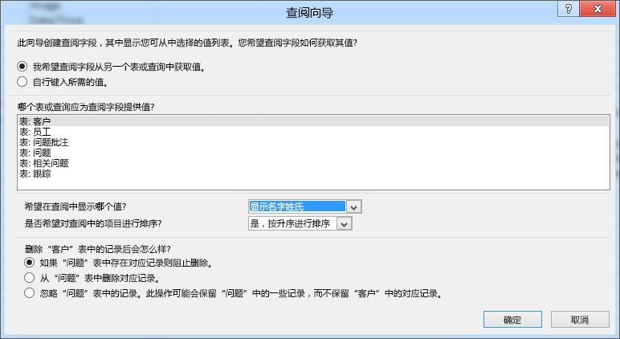
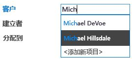

# 在 Access 中创建和自定义 Web 应用Create and customize a web app in Access

> [!IMPORTANT]
> Microsoft 不再建议在 SharePoint 中创建和使用 Access Web 应用程序。作为备选方法，请考虑使用 [Microsoft PowerApps](https://powerapps.microsoft.com/en-us/)，生成适用于 Web 和移动设备的无代码业务解决方案。Microsoft no longer recommends creating and using Access web apps in SharePoint. As an alternative, consider using [Microsoft PowerApps](https://powerapps.microsoft.com/en-us/) to build no-code business solutions for the web and mobile devices. 
  
Access 2013 采用新的应用程序模型，使主题专家可以快速创建基于 Web 的应用程序。Access 中包含一系列模板，您可用于开始创建应用程序。Access 2013 features a new application model that enables subject matter experts to quickly create web-based applications. Included with Access are a set of templates that you can use to jump start creating your application.

## 使用 Access 2013 构建应用程序的先决条件Prerequisites for building an app with Access 2013

若要按照此示例中的步骤操作，需要：To follow the steps in this example, you need the following:
  
- AccessAccess
    
- SharePoint 开发环境A SharePoint development environment
    
有关设置 SharePoint 开发环境的详细信息，请参阅[设置 SharePoint 的常规开发环境](https://docs.microsoft.com/sharepoint/dev/general-development/set-up-a-general-development-environment-for-sharepoint)。For more information about setting up your SharePoint development environment, see [Set up a general development environment for SharePoint](https://docs.microsoft.com/sharepoint/dev/general-development/set-up-a-general-development-environment-for-sharepoint). 
  
有关获取 Access 和 SharePoint 的详细信息，请参阅[下载](https://msdn.microsoft.com/office/apps/fp123627)。For more information about obtaining Access and SharePoint, see [Downloads](https://msdn.microsoft.com/office/apps/fp123627).

## 创建应用程序Create the app

假设您想创建一个 Access 应用程序，用于跟踪企业的问题，则在从头开始创建表和视图之前，您应该搜索一个满足您需求的架构模板。Suppose you want to create an Access app that tracks issues for your business. Before you start creating the tables and view from scratch, you should search for a schema template that meets your needs.
  
### 创建问题跟踪应用程序To create the issue tracking app

1. 打开 Access 并选择 **"自定义 Web 应用程序"**。Open Access and choose **Custom web app**.
    
2. 输入你的应用的名称和 Web 位置。Enter a name and the web location for your app. 你也可以从“位置”\*\*\*\* 列表中选择一个位置并选择“创建”\*\*\*\*。You can also choose a location from the **Locations** list and choose **Create**.
    
3. 在“你想跟踪什么?”\*\*\*\* 框中键入 **Issues**，然后按 ENTER。Type **Issues** into the **What would you like to track?** box and then press ENTER. 
    
   图 1 显示了一个可能对跟踪问题有用的模板列表。A list of templates that might be useful for tracking issues is displayed in Figure 1.
    
   **图 1. 与问题搜索相匹配的模板****Figure 1. Templates that match the search for issues**

   
  
4. 选择“问题”\*\*\*\*。Choose **Issues**.
    
Access 创建一系列表和视图。Access creates a set of tables and views.
  
## 浏览应用程序Explore the app

若要了解架构和视图是否满足您的需求，您应该对其进行检查。To understand whether the schema and views meet your needs, you should examine them.
  
平铺窗格中显示了通过选择“问题”架构创建的表。“问题”、“客户”和“员工”表是应用程序的重心所在。“问题”表存储关于每个问题的信息。每个问题由员工代表客户创建并分配给某个员工。“相关问题”和“问题注释”表在应用程序中起支持作用。“相关问题”表使您可以将一个问题链接到另一个。“问题注释”表存储对一个问题的多个注释。The tables created by selecting the Issues schema are displayed in the Tile Pane. The Issues, Customer, and Employees tables are the main focus of the app. The Issues table stores information about each issue. Each issue is opened by and assigned to an employee on behalf of a customer. The Related Issues and Issue Comments tables play a supporting role in the app. The Related Issues table enables you to link one issue to another. The Issue Comments table stores multiple comments for a single issue.
  
在 Access 桌面 (.accdb) 数据库中，在“关系”\*\*\*\* 窗口中管理表之间的关系。In an Access desktop (.accdb) database, the relationships between tables are managed in the **Relationships** window. Access 2013 应用使用设置为 **Lookup** 数据类型的字段来管理关系。Access 2013 apps manage relationships by using fields set to the **Lookup** data type. 让我们通过右键单击“问题”\*\*\*\* 窗格并选择“编辑表”\*\*\*\* 来检查问题表的关系。Let's examine the relationships for the Issues table by right-clicking the **Issues** tile and selecting **Edit Table**.
  
“客户”\*\*\*\* 字段与“客户”\*\*\*\* 表相关。The **Customer** field is related to the **Customers** table. 若要检查关系，请选择“客户”\*\*\*\* 字段，然后选择“修改查找”\*\*\*\*。To examine the relationship, select the **Customer** field and then select **Modify Lookups**. 将显示“查找向导”\*\*\*\*，如图 2 所示。The **Lookup Wizard** is displayed, as shown in Figure 2. 
  
**图 2. 显示与“客户”表的关系的“查找向导”****Figure 2. Lookup Wizard displaying the relationship to the Customers table**

  
“查找向导”对话框显示“客户”\*\*\*\* 字段链接到“客户”\*\*\*\* 表，并从“客户”\*\*\*\* 表中返回“显示名字和姓氏”\*\*\*\* 字段。The Lookup Wizard dialog box shows that the **Customer** field is linked to the **Customers** table and to return the **Display Name First Last** field from the **Customers** table. 
  
“打开者”\*\*\*\*、“分配到”\*\*\*\* 和“更改者”\*\*\*\* 字段与“员工”\*\*\*\* 表相关。The **Opened By**, **Assigned To**, and **Changed By** fields are related to the **Employees** table. 其他几个字段也被设置为 **Lookup** 数据类型。Several other fields are also set to the **Lookup** data type. 在这些情况下，Lookup 数据类型用于指定字段中允许的特定值。In these cases, the Lookup data type is used to specify the specific values to allow for in the field. 
  
关闭“问题”\*\*\*\* 表并检查平铺窗格。Close the **Issues** table and examine the Tile Pane. “问题”\*\*\*\*、“客户”\*\*\*\* 和“员工”\*\*\*\* 表的顶部三个窗格与“相关问题”\*\*\*\* 和“问题注释”\*\*\*\* 表的底部两个窗格的显示有所不同，如图 3 中所示。The top three tiles, for the **Issues**, **Customers**, and **Employees** tables, are displayed differently than the bottom two tiles for the **Related Issues** and **Issue Comments** table, as shown in Figure 3. 
  
**图 3.“问题”架构的平铺窗格****Figure 3. Tile Pane for the Issues schema**

  
“相关问题”\*\*\*\* 和“问题注释”\*\*\*\* 表显示为灰色，因为它们将对 Web 浏览器中的用户隐藏。The **Related Issues** and **Issue Comments** tables are dimmed because they are to be hidden from the user in the web browser. 
  
现在我们使用该应用来跟踪某些问题。Let's use the app to track some issues. 为此，单击“启动应用”\*\*\*\* 在 Web 浏览器中打开应用。To do this, click **Launch App** to open the app in your web browser. 
  
该应用打开“问题”表的“问题列表”\*\*\*\* 视图。The app opens the **Issues List** view of the Issues table. 在添加问题之前，可添加一些客户和员工。Before adding an issue, it would be a good idea to add some customers and employees. 单击“客户”\*\*\*\* 窗格以开始添加客户。Click the **Customers** tile to start adding customers. 
  
使用视图选择器从“客户”\*\*\*\* 表的三个可用视图（即“列表”\*\*\*\*、“数据表”\*\*\*\* 和“组”\*\*\*\*）中选择一个，如图 4 中所示。Use the View Selector to choose one of three views available for the **Customers** table, labeled **List**, **Datasheet**, and **Groups** as shown in Figure 4. 
  
**图 4. 视图选择器****Figure 4. View Selector**

  
选择“列表”\*\*\*\* 会激活“客户列表”\*\*\*\* 视图，该视图是“列表详细信息”视图。Choosing **List** activates the **Customers List** view, which is a List Details view. 列表详细信息是创建表时 Access 自动生成的一种视图。List Details is one of the views Access automatically generates when you create a table. 用于区分“列表详细信息”视图的主要功能是视图左侧显示的列表窗格。The main feature that distinguishes a List Details view is the list pane that appears on the left side of the view. 列表窗格用于筛选和导航视图中包含的记录。The list pane is used to filter and navigate the records contained in the view. 在 Access 桌面数据库中，实现可搜索的列表视图将需要编写自定义代码。In an Access desktop database, implementing a searchable list view would require writing custom code. 
  
选择“数据表”\*\*\*\* 将打开“客户数据表”\*\*\*\* 视图。Choosing **Datasheet** opens the **Customers Datasheet** view. “数据表”是创建表时 Access 自动生成的另一种视图。Datasheet is the other kind of view Access automatically generates when you create a table. “数据表”视图对于更习惯以类似电子表格的方式输入、排序和筛选数据的用户而言非常有帮助。Datasheet views are useful for those who find it easier to enter, sort, and filter data in a spreadsheet-like manner. 
  
选择“组”将打开“摘要”视图。“摘要”视图可用于根据字段对记录进行分组，并（可选）计算总和或平均值。Choosing Groups opens a Summary view. Summary views can be used to group records based on a field and optionally calculate a sum or average.
  
添加客户时，可使用操作栏添加、编辑、保存和删除记录或取消编辑。操作栏是每个视图顶部的 可自定义 工具栏，如图 5 中所示。As you're adding customers, use the Action Bar to add records, edit records, save records, delete records, and cancel edits. The Action Bar is a customizable toolbar that appears at the top of each view, as shown in Figure 5.
  
**图 5. 操作栏****Figure 5. Action Bar**

  
添加一些客户和员工后，打开"问题列表"视图并开始添加问题。在"客户"框中键入客户的名称时，将出现一个或多个客户名称，如图 6 中所示。Once you've added some customers and employees open the Issues List view and start adding an issue. As you type the name of a customer into the into the Customer box, one or more of the customer names will appear, as shown in Figure 6.
  
**图 6. 自动完成控件****Figure 6. AutoComplete control**

  
"客户"框是一个自动完成控件。自动完成控件显示与您在框中所键入内容匹配的记录的列表。这有助于确保数据输入的准确性。The Customer box is an AutoComplete control. The AutoComplete control displays a list of records that match what you're typing into the box. This helps ensure the accuracy of data entry.
  
## 自定义应用程序Customize the app

现在您已浏览了整个应用程序，您注意到"问题列表"视图不包含客户的任何联系信息。现在我们来对应用程序进行自定义，在创建问题时在问题表中添加客户的工作电话。Now that you've taken a tour of the app, you notice that the Issues List view doesn't contain contact information for the customer. Let's customize the app to add the customer's work phone to the Issues table as the issue is being created.
  
### 向问题表添加字段To add a field to the Issues table

1. 在 Access 中打开应用程序。Open the app in Access.
    
2. 依次选择“问题”\*\*\*\* 窗格、“设置/操作”\*\*\*\* 图标和“编辑表”\*\*\*\*。Choose the **Issues** tile, choose the **Settings/Action** icon, and then choose **Edit Table**.
    
3. 在“字段名称”\*\*\*\* 列的第一个空白单元格中输入“联系人号码”\*\*\*\*。Enter **Contact Number** in the first blank cell in the **Field Name** column. 
    
4. 在“数据类型”\*\*\*\* 列中选择“短文本”\*\*\*\*。Choose **Short Text** in the **Data Type** column. 
    
5. 选择“保存”\*\*\*\*。Choose **Save**.
    
6. 关闭问题表。Close the Issues table.
    
现在我们已有字段来存储电话号码，让我们创建一个数据宏来查找联系信息。Now that we have field in which to store the phone number, let's create a data macro to look up the contact information.
  
### 创建数据宏以查找联系信息To create the data macro to look up contact information

1. 在“创建”\*\*\*\* 组中，依次选择“高级”\*\*\*\*、“数据宏”\*\*\*\*。In the **Create** group, choose **Advanced**, and then choose **Data Macro**.
    
2. 选择“创建参数”\*\*\*\*。Choose **Create Parameter**.
    
3. 在“名称”\*\*\*\* 框中，输入 **CustID**。In the **Name** box, enter **CustID**. 在“类型”\*\*\*\* 下拉列表中，选择“数字(浮点十进制数)”\*\*\*\*。In the **Type** dropdown, choose **Number (Floating Decimal).**
    
4. 从“添加新操作”\*\*\*\* 下拉列表中，选择“LookupRecord”\*\*\*\*。From the **Add New Action** dropdown, choose **LookupRecord**. 
    
5. 在“在其中查找 A 记录”\*\*\*\* 下拉列表中，选择“客户”\*\*\*\*。In the **Look Up A Record In** dropdown, choose **Customers**. 
    
6. 在“Where 条件”\*\*\*\* 框中，输入 **[Customers].[ID]=[CustID]**。In the **Where Condition** box, enter **[Customers].[ID]=[CustID]**. 
    
7. 从“添加新操作”\*\*\*\* 下拉列表中选择“SetReturnVar”\*\*\*\*。Choose **SetReturnVar** from the **Add New Action** dropdown. 
    
    > [!NOTE]
    > 你将看到两个“添加新操作”\*\*\*\* 下拉列表，一个在 **LookupRecord** 块之内，另一个在 **LookupRecord** 块之外。You'll see two **Add New Action** dropdowns, one within the **LookupRecord** block, and another outside the **LookupRecord** block. 你应该在 **LookupRecord** 块中选择“添加新操作”\*\*\*\* 下拉列表，如图 7 所示。You should choose the **Add New Action** dropdown within the **LookupRecord** block, as shown in Figure 7. 
  
   **图 7.“添加新操作”下拉列表****Figure 7. Add New Action dropdown**

   
  
8. 在“名称”\*\*\*\* 框中，输入 **ContactPhone**。In the **Name** box, enter **ContactPhone**. 
    
9. 在“表达式”\*\*\*\* 框中，输入 **[Customers].[Work Phone]**。In the **Expression** box, enter **[Customers].[Work Phone]**. 
    
10. 选择“保存”\*\*\*\*。Choose **Save**. 在“宏名称”\*\*\*\* 框中输入 **GetContactPhone**，然后选择“确定”\*\*\*\*。Enter **GetContactPhone** in the **Macro Name** box and then choose **OK**.
    
    宏应类似于图 8 中所示的宏。The macro should resemble the macro shown in Figure 8.
    
    **图 8. GetContactPhone 数据宏****Figure 8. GetContactPhone data macro**

    
  
11. 关闭宏设计视图。Close macro Design View.
    
现在我们已准备好将“联系人号码”\*\*\*\* 字段添加到问题列表窗体中。Now we're ready to add the **Contact Number** field to the Issues List form. 
  
### 将“联系人号码”字段添加到问题列表窗体中To add the Contact Number field to the Issues List form

1. 选择“问题”\*\*\*\* 表。Choose the **Issues** table. 此操作会选择问题列表表单。This chooses the Issues list form. 
    
2. 在视图选择器中，依次选择“列表”\*\*\*\*、“设置/操作”图标\*\*\*\*、“编辑”\*\*\*\*。In the View selector, choose **List**, choose the **Settings/Action** icon, and then choose **Edit**.
    
3. 将“联系人号码”\*\*\*\* 字段从“字段列表”\*\*\*\* 窗格拖动到你希望联系人号码显示的窗体上的位置。Drag the **Contact Number** field form the **Field List** pane to the location on the form where you want the contact number to be displayed. 
    
4. 选择“联系人号码”\*\*\*\* 文本框，然后单击“数据”\*\*\*\*。Choose the **Contact Number** text box, and then click **Data**. 
    
5. 在“控件名称”\*\*\*\* 框中，输入 **CustomerContact**，然后关闭“数据”\*\*\*\* 弹出框。In the **Control Name** box, enter **CustomerContact** and then close the **Data** popup. 
    
6. 选择“保存”\*\*\*\*。Choose **Save**.
    
现在我们应编写一个用户界面 (UI) 宏，将“工作电话”\*\*\*\* 字段从“客户”\*\*\*\* 表复制到“问题”\*\*\*\* 表的“联系人电话”\*\*\*\* 字段中。Now we should write a user interface (UI) macro that copies the **Work Phone** field from the **Customers** table into the **Contact Phone** field of the **Issues** table. “CustomerAutocomplete”\*\*\*\* 控件的“更新后”\*\*\*\* 事件是该宏的一个理想位置。The **After Update** event of the **CustomerAutocomplete** control is a good location for the macro. 
  
### 创建 AfterUpdate 宏To create the AfterUpdate macro

1. 依次选择“CustomerAutocomplete”\*\*\*\* 控件、“操作”\*\*\*\* 按钮、“更新后”\*\*\*\*。Choose the **CustomerAutocomplete** control, choose the **Actions** button, and then choose **After Update**. 
    
    将在宏设计视图中打开一个空宏。A blank macro is opened in macro Design View.
    
2. 从“添加新操作”\*\*\*\* 下拉列表中，选择“RunDataMacro”\*\*\*\*。From the **Add New Action** dropdown, choose **RunDataMacro**. 
    
3. 在“宏名称”\*\*\*\* 下拉列表中，选择“GetContactPhone”\*\*\*\*。In the **Macro Name** dropdown, choose **GetContactPhone**. 
    
4. 在" **CustID**"框中，输入" **[CustomerAutocomplete]** "。In the **CustID** box, enter **[CustomerAutocomplete]**. 
    
5. 在“SetLocalVar”\*\*\*\* 框中，输入**电话**。In the **SetLocalVar** box, enter **Phone**. 
    
    当您选择之前创建的 GetContactPhone 数据宏时，Access 自动填充参数名称并返回宏的变量。When you chose the GetContactPhone data macro that was created earlier, Access automatically filled in the parameter name and return variable for the macro.
    
    客户的电话号码存储在名为 Phone 的变量中。The phone number for the customer is stored in a variable named Phone.
    
6. 从“添加新操作”\*\*\*\* 下拉列表中，选择“SetProperty”\*\*\*\*。From the **Add New Action** dropdown, choose **SetProperty**. 
    
7. 在“控件名称”\*\*\*\* 框中，输入 **CustomerContact**。In the **Control Name** box, enter **CustomerContact**. 
    
8. 在“属性”\*\*\*\* 下拉列表中，选择“值”\*\*\*\*。In the **Property** dropdown, choose **Value**. 
    
9. 在“值”\*\*\*\* 框中，输入 **=[Phone]**。In the **Value** box, enter **=[Phone]**. 
    
10. 选择“保存”\*\*\*\*。Choose **Save**.
    
    宏应类似于图 9 中所示的宏。The macro should resemble the macro shown in Figure 9.
    
    **图 9.“更新后”宏****Figure 9. After Update macro**

    
  
11. 关闭宏设计视图。Close macro Design View.
    
12. 关闭“问题列表”视图。当看到更改保存提示时，选择“是”\*\*\*\*。Close the Issues List view. Choose **Yes** when you are prompted to save your changes. 
    
现在我们准备好发布自定义文本了。Now we're ready to text the customization. 单击“启动应用”\*\*\*\* 在 Web 浏览器中打开应用，然后添加新问题。Click **Launch App** to open the app in your web browser and then add a new issue. 输入客户名称后，“联系人号码”\*\*\*\* 框会自动更新，如图 10 所示。The **Contact Number** box updates automatically after the customer name is entered,  as shown in Figure 10. 
  
**图 10. 已更新电话号码的问题视图****Figure 10. Issues view updated with phone number**

  
## 结论Conclusion

使用 中包含的架构模板之一是开始创建 Access Web 应用程序的好办法。为您自动创建的视图包含高级功能，这需要在 Access 桌面数据库中实施的自定义代码。Using one of the schema templates included with is a good way to jump start the creation of an Access web app. The views that are automatically created for you contain advanced functionally that requires custom code to implement in a Access desktop database. 
  
## 另请参阅See also

- [面向 Access 2013 开发人员的新增功能What's new for Access 2013 developers](https://msdn.microsoft.com/library/df778f51-d65e-4c30-b618-65003ceb39b3%28Office.15%29.aspx) 
- [Access custom web app referenceAccess custom web app reference](access-custom-web-app-reference.md)
  

