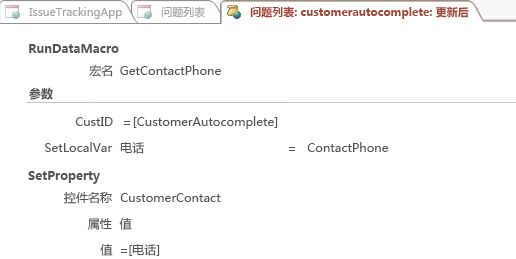

# 在 Access 中创建和自定义 Web 应用

> [!IMPORTANT]
> Microsoft 不再建议在 SharePoint 中创建和使用 Access Web 应用程序。作为备选方法，请考虑使用 [Microsoft PowerApps](https://powerapps.microsoft.com/zh-CN/)，生成适用于 Web 和移动设备的无代码业务解决方案。 
  
Access 2013 采用新的应用程序模型，使主题专家可以快速创建基于 Web 的应用程序。Access 中包含一系列模板，您可用于开始创建应用程序。

## 使用 Access 2013 构建应用程序的先决条件

若要按照此示例中的步骤操作，需要：
  
- Access
    
- SharePoint 开发环境
    
有关设置 SharePoint 开发环境的详细信息，请参阅[设置 SharePoint 的常规开发环境](https://docs.microsoft.com/zh-CN/sharepoint/dev/general-development/set-up-a-general-development-environment-for-sharepoint)。 
  
有关获取 Access 和 SharePoint 的详细信息，请参阅[下载](http://msdn.microsoft.com/zh-CN/office/apps/fp123627)。

## 创建应用程序

假设您想创建一个 Access 应用程序，用于跟踪企业的问题，则在从头开始创建表和视图之前，您应该搜索一个满足您需求的架构模板。
  
### 创建问题跟踪应用程序

1. 打开 Access 并选择 **"自定义 Web 应用程序"**。
    
2. 输入你的应用的名称和 Web 位置。 你也可以从“位置”**** 列表中选择一个位置并选择“创建”****。
    
3. 在“你想跟踪什么?”**** 框中键入 **Issues**，然后按 ENTER。 
    
   图 1 显示了一个可能对跟踪问题有用的模板列表。
    
   **图 1. 与问题搜索相匹配的模板**

   
  
4. 选择“问题”****。
    
Access 创建一系列表和视图。
  
## 浏览应用程序

若要了解架构和视图是否满足您的需求，您应该对其进行检查。
  
平铺窗格中显示了通过选择“问题”架构创建的表。“问题”、“客户”和“员工”表是应用程序的重心所在。“问题”表存储关于每个问题的信息。每个问题由员工代表客户创建并分配给某个员工。“相关问题”和“问题注释”表在应用程序中起支持作用。“相关问题”表使您可以将一个问题链接到另一个。“问题注释”表存储对一个问题的多个注释。
  
在 Access 桌面 (.accdb) 数据库中，在“关系”**** 窗口中管理表之间的关系。 Access 2013 应用使用设置为 **Lookup** 数据类型的字段来管理关系。 让我们通过右键单击“问题”**** 窗格并选择“编辑表”**** 来检查问题表的关系。
  
“客户”**** 字段与“客户”**** 表相关。 若要检查关系，请选择“客户”**** 字段，然后选择“修改查找”****。 将显示“查找向导”****，如图 2 所示。 
  
**图 2. 显示与“客户”表的关系的“查找向导”**

  
“查找向导”对话框显示“客户”**** 字段链接到“客户”**** 表，并从“客户”**** 表中返回“显示名字和姓氏”**** 字段。 
  
“打开者”****、“分配到”**** 和“更改者”**** 字段与“员工”**** 表相关。 其他几个字段也被设置为 **Lookup** 数据类型。 在这些情况下，Lookup 数据类型用于指定字段中允许的特定值。 
  
关闭“问题”**** 表并检查平铺窗格。 “问题”****、“客户”**** 和“员工”**** 表的顶部三个窗格与“相关问题”**** 和“问题注释”**** 表的底部两个窗格的显示有所不同，如图 3 中所示。 
  
**图 3.“问题”架构的平铺窗格**

  
“相关问题”**** 和“问题注释”**** 表显示为灰色，因为它们将对 Web 浏览器中的用户隐藏。 
  
现在我们使用该应用来跟踪某些问题。 为此，单击“启动应用”**** 在 Web 浏览器中打开应用。 
  
该应用打开“问题”表的“问题列表”**** 视图。 在添加问题之前，可添加一些客户和员工。 单击“客户”**** 窗格以开始添加客户。 
  
使用视图选择器从“客户”**** 表的三个可用视图（即“列表”****、“数据表”**** 和“组”****）中选择一个，如图 4 中所示。 
  
**图 4. 视图选择器**

  
选择“列表”**** 会激活“客户列表”**** 视图，该视图是“列表详细信息”视图。 列表详细信息是创建表时 Access 自动生成的一种视图。 用于区分“列表详细信息”视图的主要功能是视图左侧显示的列表窗格。 列表窗格用于筛选和导航视图中包含的记录。 在 Access 桌面数据库中，实现可搜索的列表视图将需要编写自定义代码。 
  
选择“数据表”**** 将打开“客户数据表”**** 视图。 “数据表”是创建表时 Access 自动生成的另一种视图。 “数据表”视图对于更习惯以类似电子表格的方式输入、排序和筛选数据的用户而言非常有帮助。 
  
选择“组”将打开“摘要”视图。“摘要”视图可用于根据字段对记录进行分组，并（可选）计算总和或平均值。
  
添加客户时，可使用操作栏添加、编辑、保存和删除记录或取消编辑。操作栏是每个视图顶部的 可自定义 工具栏，如图 5 中所示。
  
**图 5. 操作栏**

  
添加一些客户和员工后，打开"问题列表"视图并开始添加问题。在"客户"框中键入客户的名称时，将出现一个或多个客户名称，如图 6 中所示。
  
**图 6. 自动完成控件**

  
"客户"框是一个自动完成控件。自动完成控件显示与您在框中所键入内容匹配的记录的列表。这有助于确保数据输入的准确性。
  
## 自定义应用程序

现在您已浏览了整个应用程序，您注意到"问题列表"视图不包含客户的任何联系信息。现在我们来对应用程序进行自定义，在创建问题时在问题表中添加客户的工作电话。
  
### 向问题表添加字段

1. 在 Access 中打开应用程序。
    
2. 依次选择“问题”**** 窗格、“设置/操作”**** 图标和“编辑表”****。
    
3. 在“字段名称”**** 列的第一个空白单元格中输入“联系人号码”****。 
    
4. 在“数据类型”**** 列中选择“短文本”****。 
    
5. 选择“保存”****。
    
6. 关闭问题表。
    
现在我们已有字段来存储电话号码，让我们创建一个数据宏来查找联系信息。
  
### 创建数据宏以查找联系信息

1. 在“创建”**** 组中，依次选择“高级”****、“数据宏”****。
    
2. 选择“创建参数”****。
    
3. 在“名称”**** 框中，输入 **CustID**。 在“类型”**** 下拉列表中，选择“数字(浮点十进制数)”****。
    
4. 从“添加新操作”**** 下拉列表中，选择“LookupRecord”****。 
    
5. 在“在其中查找 A 记录”**** 下拉列表中，选择“客户”****。 
    
6. 在“Where 条件”**** 框中，输入 **[Customers].[ID]=[CustID]**。 
    
7. 从“添加新操作”**** 下拉列表中选择“SetReturnVar”****。 
    
    > [!NOTE]
    > 你将看到两个“添加新操作”**** 下拉列表，一个在 **LookupRecord** 块之内，另一个在 **LookupRecord** 块之外。 你应该在 **LookupRecord** 块中选择“添加新操作”**** 下拉列表，如图 7 所示。 
  
   **图 7.“添加新操作”下拉列表**

   
  
8. 在“名称”**** 框中，输入 **ContactPhone**。 
    
9. 在“表达式”**** 框中，输入 **[Customers].[Work Phone]**。 
    
10. 选择“保存”****。 在“宏名称”**** 框中输入 **GetContactPhone**，然后选择“确定”****。
    
    宏应类似于图 8 中所示的宏。
    
    **图 8. GetContactPhone 数据宏**

    
  
11. 关闭宏设计视图。
    
现在我们已准备好将“联系人号码”**** 字段添加到问题列表窗体中。 
  
### 将“联系人号码”字段添加到问题列表窗体中

1. 选择“问题”**** 表。 此操作会选择问题列表表单。 
    
2. 在视图选择器中，依次选择“列表”****、“设置/操作”图标****、“编辑”****。
    
3. 将“联系人号码”**** 字段从“字段列表”**** 窗格拖动到你希望联系人号码显示的窗体上的位置。 
    
4. 选择“联系人号码”**** 文本框，然后单击“数据”****。 
    
5. 在“控件名称”**** 框中，输入 **CustomerContact**，然后关闭“数据”**** 弹出框。 
    
6. 选择“保存”****。
    
现在我们应编写一个用户界面 (UI) 宏，将“工作电话”**** 字段从“客户”**** 表复制到“问题”**** 表的“联系人电话”**** 字段中。 “CustomerAutocomplete”**** 控件的“更新后”**** 事件是该宏的一个理想位置。 
  
### 创建 AfterUpdate 宏

1. 依次选择“CustomerAutocomplete”**** 控件、“操作”**** 按钮、“更新后”****。 
    
    将在宏设计视图中打开一个空宏。
    
2. 从“添加新操作”**** 下拉列表中，选择“RunDataMacro”****。 
    
3. 在“宏名称”**** 下拉列表中，选择“GetContactPhone”****。 
    
4. 在" **CustID**"框中，输入" **[CustomerAutocomplete]** "。 
    
5. 在“SetLocalVar”**** 框中，输入**电话**。 
    
    当您选择之前创建的 GetContactPhone 数据宏时，Access 自动填充参数名称并返回宏的变量。
    
    客户的电话号码存储在名为 Phone 的变量中。
    
6. 从“添加新操作”**** 下拉列表中，选择“SetProperty”****。 
    
7. 在“控件名称”**** 框中，输入 **CustomerContact**。 
    
8. 在“属性”**** 下拉列表中，选择“值”****。 
    
9. 在“值”**** 框中，输入 **=[Phone]**。 
    
10. 选择“保存”****。
    
    宏应类似于图 9 中所示的宏。
    
    **图 9.“更新后”宏**

    
  
11. 关闭宏设计视图。
    
12. 关闭“问题列表”视图。 当你收到保存更改的提示时，选择“是”****。 
    
现在我们准备好发布自定义文本了。 单击“启动应用”**** 在 Web 浏览器中打开应用，然后添加新问题。 输入客户名称后，“联系人号码”**** 框会自动更新，如图 10 所示。 
  
**图 10. 已更新电话号码的问题视图**

  
## 结论

使用 中包含的架构模板之一是开始创建 Access Web 应用程序的好办法。为您自动创建的视图包含高级功能，这需要在 Access 桌面数据库中实施的自定义代码。 
  
## 另请参阅

- [面向 Access 2013 开发人员的新增功能](http://msdn.microsoft.com/library/df778f51-d65e-4c30-b618-65003ceb39b3%28Office.15%29.aspx) 
- [Access custom web app reference](access-custom-web-app-reference.md)
  

