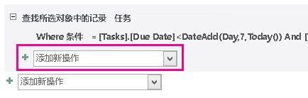
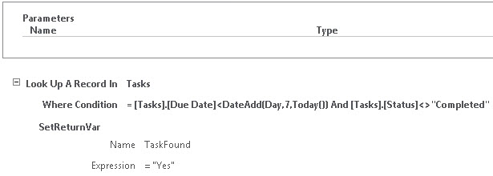
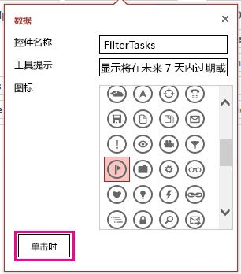
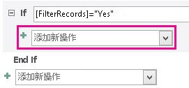
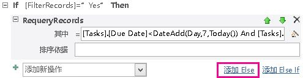

# <a name="filter-a-view-by-using-a-macro-in-an-access-app"></a>访问应用程序中使用宏筛选视图

了解如何使用 RequeryRecords 宏操作和数据宏筛选 Access 应用程序中的视图。
  
> [!IMPORTANT]
> [!重要信息] Microsoft 不再建议在 SharePoint 中创建和使用 Access Web 应用程序。作为备选方法，请考虑使用 [Microsoft PowerApps](https://powerapps.microsoft.com/en-us/)，生成适用于 Web 和移动设备的无代码业务解决方案。 

Access 应用程序中的默认列表视图，可以筛选的字段中包含的值的问题。 可能想要筛选通过匹配值基于一组条件，而不是视图的实例。 为此，您必须创建宏。 本文演示如何创建用于筛选视图以显示位于以前到期或截止随后 7 天的任务的宏。
  
## <a name="prerequisites-for-building-an-app-with-access"></a>构建具有访问权限的应用程序的先决条件
<a name="Access2013FilterViewByUsingMacro_Prerequisites"> </a>

若要遵循此示例中的步骤，您需要：
  
- Access 2013
- SharePoint 2013 开发环境
    
> [!NOTE]
> 有关设置 SharePoint 开发环境的详细信息，请参阅[设置 SharePoint 2013 的常规开发环境](http://msdn.microsoft.com/library/08e4e4e1-d960-43fa-85df-f3c279ed6927%28Office.15%29.aspx)。 > 的有关获取 Access 2013 和 SharePoint 2013 的详细信息，请参阅[下载](http://msdn.microsoft.com/en-US/office/apps/fp123627)。 
  
## <a name="create-the-app"></a>创建应用程序
<a name="Access2013FilterViewByUsingMacro_CreateApp"> </a>

假设您想要创建的跟踪任务为您的业务应用程序访问。 在开始创建的表和视图之前，您应搜索架构的模板。
  
### <a name="to-create-the-task-tracking-app"></a>若要创建跟踪应用程序的任务

1. 打开 Access 并选择 **"自定义 Web 应用程序"**。
    
2. 输入名称和您的应用程序的 web 位置。 您还可以从**位置**列表中选择一个位置，然后选择**创建**。
    
3. 在**搜索**框中键入**任务**，然后按 ENTER。 
    
    图 1 中显示的可能很有用跟踪任务的模板的列表。
    
   **图 1。与任务搜索相匹配的模板**

   
  
4. 选择**任务**。
    
Access 创建一系列表和视图。
  
输入您的应用程序中的几个示例任务和员工。 若要执行此操作，选择**启动应用程序**在 web 浏览器中打开应用程序。 在**截止日期**字段中输入一个值，为每项任务。 完成后，返回到 Access。 
  
## <a name="plan-the-customizations"></a>规划自定义项
<a name="Access2013FilterViewByUsingMacro_PlanCustomizations"> </a>

现在，您可以包含多个任务的应用程序。 默认视图，可搜索的任何任务使用视图中显示的字段中存储的项目。 例如，您可以搜索高优先级的问题或正在进行中的问题。 假设您想要设置您的工作，通过显示的未到期在下一周中解决问题的优先级。 若要执行此操作，您应创建用户界面 (UI) 宏。
  
您可用于筛选视图的 UI 宏命令是[RequeryRecords 宏操作 （访问自定义 web 应用程序）](requeryrecords-macro-action-access-custom-web-app.md)。 **RequeryRecords**宏操作的筛选器基于*其中*参数，它提供一个 SQL WHERE 子句的窗体中的视图。 筛选的视图，必须提供若干事实以特定格式筛选的视图。 
  
相关的事实是：
  
- 要比较的字段
    
- 如何引用今天的日期
    
- 如何引用相对于今天的日期某一天
    
- 如何确定其任务正在进行
    
**截止日期**字段提供有关时任务的截止日期信息。 **状态**字段提供有关每个任务的状态信息。 要引用在宏中的字段，请使用格式 **[*TableName*]。 [*FieldName*]**。 使用 **[任务]。 [截止日期]** 指**截止日期**字段和 **[任务]。 [状态]** 来引用**状态**字段。 
  
[Today 函数 （访问自定义 web 应用程序）](today-function-access-custom-web-app.md)函数将返回今天的日期。 [DateAdd 函数 （访问自定义 web 应用程序）](dateadd-function-access-custom-web-app.md)函数可用于计算的日期，则一定数量的指定日期之后的天数。 
  
**状态**字段包含多个可能的值。 **已完成**的值表示任务不再处于活动状态。 
  
可以将这些事实结合到下面的 SQL WHERE 子句。
  
```sql
[Tasks].[Due Date]<DateAdd(Day,7,Today()) AND [Tasks].[Status]<>"Completed"
```

在宏中使用此 SQL WHERE 子句筛选的视图，显示在下一步 7 天内到期或已到期解决问题。
  
若要运行的 UI 宏，它必须附加到的项目或在视图中发生的事件。 **操作栏**是方便地向视图中添加自定义命令。 **操作栏**是可自定义工具栏出现在每个视图的顶部。 默认情况下，**操作栏**包含按钮添加、 编辑、 保存、 删除和取消编辑。 您可以添加执行自定义操作，如筛选视图的按钮。 
  
如果视图包含符合指定的条件的记录，然后**RequeryRecords**筛选视图。 但是，如果视图不包含任何记录符合条件，比一个新的空白记录显示。 如果您不希望如果没有任务的截止下一周显示空白记录，您必须找到检查任务之前调用**RequeryRecords**宏操作的方法。 若要执行此操作，创建要检查的满足条件的记录的数据宏。 
  
UI 宏将调用数据宏，将尝试查找的下一周截止任务。 如果数据宏查找任务，则自定义应用程序。
  
## <a name="customize-the-app"></a>自定义应用程序
<a name="Access2013FilterViewByUsingMacro_CustomizeApp"> </a>

现在，您已确定自定义项，实现它们。 应首先创建数据宏。 某些数据宏直接连接到表。 但是，此数据宏为独立的数据宏。
  
### <a name="to-create-the-data-macro"></a>若要创建数据宏

1. 在 Access 中打开应用程序。
    
2. 在**创建**组中，选择**高级**，然后选择**数据宏**。
    
    在宏设计视图中打开一个空白数据宏。
    
3. 从**添加新操作**列表框中，选择**LookupRecord**。
    
4. 在查找 Up A 记录列表框**中**，选择**任务**。
    
5. 在**Where 条件**框中，输入 **[任务]。 [截止日期]\<DateAdd(Day,7,Today()) 和 [任务]。[状态]\< \>"完成"**。 
    
6. 从**添加新操作**列表框中选择**SetReturnVar** 。 
    
    > [!NOTE]
    > 您将看到两个**添加新操作**列表框， **LookupRecord**块，和其他外部**LookupRecord**块内的一个。 图 1 中所示，您应选择在**LookupRecord**块中，**添加新操作**列表框。 
  
   **图 1。添加新操作列表框**

   
  
7. 在**名称**框中，输入**TaskFound**。 
    
8. 在**表达式**框中，输入 **"是"**。 
    
9. 选择“保存”****。 在**宏名称**框中输入**TasksDueSoon** ，然后选择**确定**。
    
    宏应类似于图 2 所示的宏。
    
   **图 2。TasksDueSoon 数据宏**

   
  
10. 关闭宏设计视图。
    
现在，我们已准备好自定义按钮添加到操作栏。
  
### <a name="to-add-a-custom-button-to-the-action-bar"></a>将自定义按钮添加到操作栏

1. 选择**任务**表。 这会选择的任务列表表单。 
    
2. 视图选择器中选择**列表**，选择**设置中的操作**图标，然后选择**编辑**。
    
    在设计视图中打开视图。
    
3. 现在，我们已准备好自定义按钮添加到操作栏。 为此，请选择**添加自定义操作**，如图 3 所示。 
    
   **图 3。添加自定义操作按钮**

   
  
    新操作显示为具有星形图标的按钮，如图 4 中所示。
    
   **图 4。新操作栏按钮**

   
  
4. 选择自定义操作栏按钮，，然后选择**数据**图标。 
    
    出现**数据**对话框。 
    
5. 在**控件名称**框中，输入**FilterTasks**。 
    
6. 在**工具提示**框中，输入**显示任务以前到期或截止在下个星期**。 
    
现在，我们已准备好创建将筛选视图的 UI 宏。
  
### <a name="to-create-the-ui-macro-to-filter-the-view"></a>若要创建要筛选的视图的 UI 宏

1. 在**数据**对话框中，选择**在单击**图 5 中所示。 
    
   **图 5。数据对话框**

   
  
    在宏设计视图中打开一个空的 UI 宏。
    
2. 从**添加新操作**列表框中，选择**RunDataMacro**。 
    
3. 在宏名称框中，输入**TasksDueSoon**。 
    
    在**SetLocalVar**框中，输入**FilterRecords**。 
    
    **RunDataMacro**操作调用我们之前创建**TasksDueSoon**数据宏，并将其结果存储在名为**FilterRecords**的变量。 
    
4. 从**添加新操作**列表框中，选择**如果**。 
    
5. 在**如果**框中，输入 **[FilterRecords] ="Yes"**。 
    
6. 从**添加新操作**列表框中，选择**RequeryRecords**。 
    
    > [!NOTE]
    > 您将看到两个**添加新操作**列表框，一个**If**块中，和其他外部**If**块中。 应选择**If**块中，在**添加新操作**列表框，如图 6 所示。 
  
   **图 6。添加新操作列表框**

   
  
7. 在**位置**框中，输入 **[任务]。 [截止日期]\<DateAdd(Day,7,Today()) 和 [任务]。[状态]\< \>"完成"**。 
    
8. 在**Order By**框中，输入 **[截止日期]**。 
    
9. 选择**添加 Else**链接，如图 7 中所示显示**添加新操作**框的右侧。 
    
   **图 7。添加 Else 链接**

   
  
    Else 子句添加到 If 块。
    
10. 从**添加新操作**列表框中，选择**MessageBox**。 
    
11. 在**消息**框中，输入**没有任务的过期或内到期且随后 7 天 ！**。 
    
12. 选择“保存”****。
    
    宏应类似于图 8 中所示的宏。
    
    **图 8。用于筛选视图的 UI 宏**

    
  
13. 关闭宏设计视图。
    
此时，我们已创建要显示的紧急任务的任务列表视图的筛选器的 UI 宏。 它不会有礼貌将视图保留在筛选状态，而不需要提供方法要删除筛选器。 若要执行此操作，添加另一个操作栏按钮和 UI 宏。
  
### <a name="to-add-an-action-bar-button-to-remove-the-filter"></a>若要删除筛选器操作栏按钮添加

1. 选择**添加自定义操作**。
    
    新操作显示为具有星形图标的按钮
    
2. 选择自定义操作栏按钮，然后选择**数据**图标。 
    
    出现**数据**对话框。 
    
3. 在**控件名称**框中，输入**RemoveFilter**。 
    
4. 在**工具提示**框中，输入**删除所有筛选器应用于视图**。 
    
现在，我们已准备好创建将删除窗体筛选视图的 UI 宏。
  
### <a name="to-create-the-ui-macro-to-remove-the-filter-from-the-view"></a>若要创建要从视图中删除筛选器的 UI 宏

1. 在**数据**对话框中，选择**上单击**。
    
    在宏设计视图中打开一个空的 UI 宏。
    
2. 从**添加新操作**列表框中，选择**RequeryRecords**。 
    
    此时，我们将保留**其中**和**Order By**框为空。 **RequeryRecords**操作调用不带任何参数，然后从视图中删除所有筛选器。 
    
3. 选择“保存”****。
    
4. 关闭宏设计视图。
    
5. 关闭任务列表视图。 当提示您保存所做的更改时，请选择**是**。 
    
现在，我们已准备好自定义项的文本。 选择**启动应用程序**以在 web 浏览器中打开应用程序，然后选择自定义 FilterTasks 操作栏按钮。 显示随后 7 天内到期且或以前的任何任务。 如果应用程序包含没有紧急任务，则显示一条消息。 
  
## <a name="conclusion"></a>结论

您可以使用中的 UI 宏**RequeryRecords**宏操作筛选根据您选择的标准视图。 根据所需的行为，您可能要创建验证记录满足的条件，才能使用**RequeryRecords**宏操作的数据宏。 
  
## <a name="see-also"></a>另请参阅

- [Access 中面向开发人员的新增功能](http://msdn.microsoft.com/library/df778f51-d65e-4c30-b618-65003ceb39b3%28Office.15%29.aspx)
    

