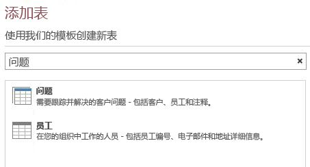

# <a name="filter-a-view-by-using-a-macro-in-an-access-app"></a>通过在 Access 应用程序中使用宏来筛选视图

了解如何在 Access 应用程序中使用 RequeryRecords 宏操作和数据宏来筛选视图。
  
> [!IMPORTANT]
> Microsoft 不再建议在 SharePoint 中创建和使用 Access Web 应用程序。作为备选方法，请考虑使用 [Microsoft PowerApps](https://powerapps.microsoft.com/zh-CN/)，生成适用于 Web 和移动设备的无代码业务解决方案。 

通过 Access 应用程序中的默认列表视图，你可以筛选字段中包含的值问题。 在某些情况下，你可能希望根据一组条件来筛选视图，而不是通过匹配值来进行筛选。 为此，你必须创建一个宏。 本文介绍如何创建用于筛选视图的宏，以显示将在未来 7 天内过期或到期的任务。
  
## <a name="prerequisites-for-building-an-app-with-access"></a>使用 Access 构建应用程序的先决条件
<a name="Access2013FilterViewByUsingMacro_Prerequisites"> </a>

若要按照此示例中的步骤操作，你需要：
  
- Access 2013
- SharePoint 2013 开发环境
    
> [!NOTE]
> 有关设置 SharePoint 开发环境的详细信息，请参阅[设置 SharePoint 2013 的常规开发环境](https://msdn.microsoft.com/library/08e4e4e1-d960-43fa-85df-f3c279ed6927%28Office.15%29.aspx)。 有关获取 Access 2013 和 SharePoint 2013 的详细信息，请参阅[下载](https://msdn.microsoft.com/office/apps/fp123627)。 
  
## <a name="create-the-app"></a>创建应用程序
<a name="Access2013FilterViewByUsingMacro_CreateApp"> </a>

假设你想创建一个 Access 应用程序，用于跟踪企业的任务。 在开始创建表和视图之前，你应该搜索一个架构模板。
  
### <a name="to-create-the-task-tracking-app"></a>创建任务跟踪应用程序

1. 打开 Access 并选择“**自定义 Web 应用程序**”。
    
2. 输入一个名称和您的应用程序的 Web 位置。您也可以从“位置”列表中选择一个位置并选择“创建”。
    
3. 在“**搜索**”框中键入**任务**，然后按 ENTER。 
    
    图 1 显示了一个可能对跟踪任务有用的模板列表。
    
   **图 1. 与任务搜索相匹配的模板**

   
  
4. 选择“**任务**”。
    
Access 将创建一组表和视图。
  
在你的应用程序中输入几个示例任务和员工。 为此，单击“**启动应用程序**”以在 Web 浏览器中打开应用程序。 在每个任务的“**截止日期**”字段中输入一个值。 完成后返回到 Access。 
  
## <a name="plan-the-customizations"></a>计划自定义项
<a name="Access2013FilterViewByUsingMacro_PlanCustomizations"> </a>

现在，你拥有包含多个任务的应用程序。 通过默认视图，你可以使用在视图所示字段中存储的条目来搜索任何任务。 例如，你可以搜索高优先级问题或正在处理的问题。 假设你希望通过显示将于下周到期的活动问题来确定工作的优先级。 为此，你应该创建用户界面 (UI) 宏。
  
可用于筛选视图的 UI 宏命令是 [RequeryRecords 宏操作（Access 自定义 Web 应用程序）](requeryrecords-macro-action-access-custom-web-app.md)。 **RequeryRecords** 宏操作根据 *Where* 参数筛选视图，该参数以 SQL WHERE 子句的形式提供。 若要筛选视图，你必须提供特定格式的多个事实来过滤视图。 
  
相关事实包括：
  
- 要比较的字段
    
- 如何引用当天日期
    
- 如何引用相对于当天日期的特定日期
    
- 如何确定正在执行的任务
    
“**截止日期**”字段提供了有关任务截止日期的信息。 “**状态**”字段提供了有关每个任务的状态信息。 若要引用宏中的字段，请使用格式 **[*TableName*].[*FieldName*]**。 使用 **[Tasks].[Due Date]** 引用“**截至日期**”字段，并使用“**[Tasks].[Status]**”引用“**状态**”字段。 
  
[Today 函数（Access 自定义 Web 应用程序）](today-function-access-custom-web-app.md)函数将返回当天日期。 [DateAdd 函数（Access 自定义 Web 应用程序）](dateadd-function-access-custom-web-app.md)函数可用于计算在指定日期之后的特定天数的日期。 
  
“**状态**”字段包含几个可能的值。 值“**已完成**”表示任务不再处于活动状态。 
  
这些事实可以组合到以下 SQL WHERE 子句中。
  
```sql
[Tasks].[Due Date]<DateAdd(Day,7,Today()) AND [Tasks].[Status]<>"Completed"
```

在宏中使用此 SQL WHERE 子句来筛选视图，以显示将在未来 7 天内到期或过期的活动问题。
  
若要运行 UI 宏，必须将其附加到视图中出现的项目或事件。 **操作栏**是向视图添加自定义命令的便捷位置。 **操作栏**是可自定义的工具栏，显示在每个视图的顶部。 默认情况下，**操作栏**包含用于添加、编辑、保存、删除和取消编辑的按钮。 你可以添加用于执行自定义操作的按钮，例如筛选视图。 
  
如果视图包含符合指定条件的记录，则 **RequeryRecords** 会筛选该视图。 但是，如果视图不包含符合条件的记录，则会显示新的空白记录。 如果你希望在没有将于下周到期的任务时不要显示空白记录，则必须在调用 **RequeryRecords** 宏操作之前找到检查任务的方法。 为此，请创建数据宏以检查符合条件的记录。 
  
UI 宏将调用数据宏，后者会尝试查找将于下周到期的任务。 如果数据宏找到任务，则会自定义应用程序。
  
## <a name="customize-the-app"></a>自定义应用程序
<a name="Access2013FilterViewByUsingMacro_CustomizeApp"> </a>

现在，你已确定自定义项，请实现它们。 应该先创建数据宏。 某些数据宏将直接附加到表。 但是，此数据宏是独立的数据宏。
  
### <a name="to-create-the-data-macro"></a>创建数据宏

1. 在 Access 中打开应用程序。
    
2. 在“**创建**”组中，依次选择“**高级**”、“**数据宏**”。
    
    此时将在宏设计视图中打开一个空白数据宏。
    
3. 从“**添加新操作**”列表框中，选择 **LookupRecord**。
    
4. 在“**查找所选对象中的记录**”列表框中，选择“**任务**”。
    
5. 在“**Where 条件**”框中，输入 **[Tasks].[Due Date]\<DateAdd(Day,7,Today()) AND [Tasks].[Status]\<\>"Completed"**。 
    
6. 从“**添加新操作**”列表框中选择 **SetReturnVar**。 
    
    > [!NOTE]
    > 你将看到两个“**添加新操作**”列表框，一个在 **LookupRecord** 块之内，另一个在 **LookupRecord** 块之外。 你应该选择 **LookupRecord** 块之内的“**添加新操作**”列表框，如图 1 所示。 
  
   **图 1.“添加新操作”列表框**

   
  
7. 在“**名称**”框中，输入 **TaskFound**。 
    
8. 在“**表达式**”框中，输入“**是**”。 
    
9. 选择“**保存**”。 在“**宏名称**”框中输入 **TasksDueSoon**，然后选择“**确定**”。
    
    宏应类似于图 2 中所示的宏。
    
   **图 2. TasksDueSoon 数据宏**

   
  
10. 关闭宏设计视图。
    
现在，我们已准备好向操作栏添加自定义按钮。
  
### <a name="to-add-a-custom-button-to-the-action-bar"></a>向操作栏添加自定义按钮

1. 选择“**任务**”表。 此操作会选择任务列表表单。 
    
2. 在视图选择器中，依次选择“**列表**”、“**设置/操作**”图标、“**编辑**”。
    
    视图将在“设计视图”中打开。
    
3. 现在，我们已准备好向操作栏添加自定义按钮。 若要执行此操作，请选择“**添加自定义操作**”，如图 3 中所示。 
    
   **图 3. 添加自定义操作按钮**

   
  
    新操作显示为带有星形图标的按钮，如图 4 中所示。
    
   **图 4. 新的操作栏按钮**

   
  
4. 选择自定义操作栏按钮，然后选择“**数据**”图标。 
    
    此时将显示“**数据**”对话框。 
    
5. 在“**控件名称**”框中，输入 **FilterTasks**。 
    
6. 在“**工具提示**”框中，输入“**显示将于下周过期或到期的任务**”。 
    
现在，我们已准备好创建用于筛选视图的 UI 宏。
  
### <a name="to-create-the-ui-macro-to-filter-the-view"></a>创建用于筛选视图的 UI 宏

1. 在“**数据**”对话框中，选择 **On Click**，如图 5 中所示。 
    
   **图 5.“数据”对话框**

   
  
    将在宏设计视图中打开一个空白 UI 宏。
    
2. 从“**添加新操作**”列表框中，选择 **RunDataMacro**。 
    
3. 在“宏名称”框中，输入 **TasksDueSoon**。 
    
    在 **SetLocalVar** 框中，输入 **FilterRecords**。 
    
    **RunDataMacro** 操作将调用我们之前创建的 **TasksDueSoon** 数据宏，并将其结果存储在名为 **FilterRecords** 的变量中。 
    
4. 从“**添加新操作**”列表框中，选择 **If**。 
    
5. 在 **If** 框中，输入 **[FilterRecords]="Yes"**。 
    
6. 从“**添加新操作**”列表框中，选择 **RequeryRecords**。 
    
    > [!NOTE]
    > 你将看到两个“**添加新操作**”列表框，一个在 **If** 块之内，另一个在 **If** 块之外。 你应该选择 **If** 块之内的“**添加新操作**”列表框，如图 6 中所示。 
  
   **图 6.“添加新操作”列表框**

   
  
7. 在 **Where** 框中，输入 **[Tasks].[Due Date]\<DateAdd(Day,7,Today()) AND [Tasks].[Status]\<\>"Completed"**。 
    
8. 在“**排序依据**”框中，输入 **[Due Date]**。 
    
9. 选择“**添加新操作**”框右侧显示的“**添加 Else**”链接，如图 7 中所示。 
    
   **图 7. 添加 Else 链接**

   
  
    一个 Else 子句将添加到 If 块。
    
10. 从“**添加新操作**”列表框中，选择 **MessageBox**。 
    
11. 在“**消息**”框中，输入“**在未来 7 天内没有过期或到期的任务！**”。 
    
12. 选择“**保存**”。
    
    宏应类似于图 8 中所示的宏。
    
    **图 8. 用于筛选视图的 UI 宏**

    
  
13. 关闭宏设计视图。
    
此时，我们已经创建了 UI 宏，用于筛选“任务列表”视图以显示紧急任务。 让视图保持筛选状态而不提供删除筛选器的方法似乎有些不妥。 为此，请添加另一个操作栏按钮和 UI 宏。
  
### <a name="to-add-an-action-bar-button-to-remove-the-filter"></a>添加操作栏按钮以删除筛选器

1. 选择“**添加自定义操作**”。
    
    新操作显示为带有星形图标的按钮
    
2. 选择自定义操作栏按钮，然后选择“**数据**”图标。 
    
    此时将显示“**数据**”对话框。 
    
3. 在“**控件名称**”框中，输入 **RemoveFilter**。 
    
4. 在“**工具提示**”框中，输入“**删除应用于视图的所有筛选器**”。 
    
现在，我们已准备好创建将从视图中删除筛选器的 UI 宏。
  
### <a name="to-create-the-ui-macro-to-remove-the-filter-from-the-view"></a>创建用于从视图中删除筛选器的 UI 宏

1. 在“**数据**”对话框中，选择 **On Click**。
    
    将在宏设计视图中打开一个空白 UI 宏。
    
2. 从“**添加新操作**”列表框中，选择 **RequeryRecords**。 
    
    此时，我们会将 **Where** 和“**排序依据**”框留空。 然后在没有任何参数的情况下调用 **RequeryRecords** 操作，所有筛选器都将从视图中删除。 
    
3. 选择“**保存**”。
    
4. 关闭宏设计视图。
    
5. 关闭“任务列表”视图。 当你收到保存更改的提示时，选择“**是**”。 
    
现在，我们已准备好发布自定义文本。 选择“**启动应用程序**”以在 Web 浏览器中打开应用程序，然后选择自定义 FilterTasks 操作栏按钮。 此时将显示将在未来 7 天内过期或到期的任何任务。 如果应用程序不包含紧急任务，则会显示一条消息。 
  
## <a name="conclusion"></a>结论

你可以在 UI 宏中使用 **RequeryRecords** 宏操作，以根据你选择的条件来筛选视图。 根据所需的行为，你可能需要创建数据宏以在使用 **RequeryRecords** 宏操作之前验证记录是否符合条件。 
  
## <a name="see-also"></a>另请参阅

- [面向 Access 2013 开发人员的新增功能](https://msdn.microsoft.com/library/df778f51-d65e-4c30-b618-65003ceb39b3%28Office.15%29.aspx)
    

