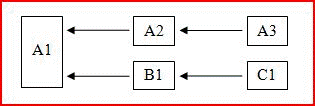

# Excel 中的多线程重新计算Multithreaded recalculation in Excel

**适用于**：Excel 2013 | Office 2013 | Visual Studio**Applies to**: Excel 2013 | Office 2013 | Visual Studio 
  
Microsoft Office Excel 2007 是首版对工作表使用多线程重新计算 (MTR) 的 Excel。Microsoft Office Excel 2007 was the first version of Excel to use multithreaded recalculation (MTR) of worksheets. 可以将 Excel 配置为，在重新计算时最多使用 1024 个并发线程，无论计算机上有多少个处理器或处理器核心。You can configure Excel to use up to 1024 concurrent threads when recalculating, regardless of the number of processors or processor cores on the computer. 
  
> [!NOTE]
> 由于会产生与每个线程相关的操作系统开销，因此不得将 Excel 配置为使用超过所需的线程数。There is an operating system overhead associated with each thread, so you should not configure Excel to use more threads than you need. 
  
如果计算机有多个处理器或处理器核心，操作系统负责以最高效方式将线程分配给处理器。If the computer has multiple processors or processor cores, the operating system takes responsibility for allocating the threads to the processors in the most efficient way.
  
## Excel MTR 概述Excel MTR overview

Excel 尝试确定可同时在不同线程中重新计算的计算链部分。Excel tries to identify parts of the calculation chain that can be recalculated concurrently on different threads. 下面这个非常简单的示例树（其中，x ← y 表示 y 仅依赖 x）就说明了这一点。The following very simple tree (where x ← y means y only depends on x) shows an example of this.
  
**图 1：同时在不同线程中计算****Figure 1. Calculating concurrently on different threads**

  
在计算 A1 后，便能在一个线程中依次计算 A2 和 A3，同时在另一个线程中依次计算 B1 和 C1（假设所有单元格都是线程安全单元格）。After A1 is calculated, A2 and then A3 can be calculated on one thread, while B1 and then C1 can be calculated on another, assuming all the cells are thread safe. 
  
> [!NOTE]
> “线程安全单元格”一词是指只包含线程安全函数的单元格。The term thread-safe cell means a cell that only contains thread-safe functions. [Excel 视为线程安全和非线程安全的项](#xl2007xllsdk_threadsafe)中详细说明了什么是线程安全项和非线程安全项。What is and is not thread-safe is detailed [What Is and Is Not Considered Thread Safe by Excel](#xl2007xllsdk_threadsafe). 
  
大多数实际工作簿包含的依赖关系树要比上面的示例复杂得多。Most practical workbooks contain far more complex dependency trees than this example. 此外，只有在计算完成后，才能知道单元格的重新计算时间，此时间长短不一，具体视函数参数而定。Moreover, the recalculation time of a cell cannot be known until a calculation is done and can vary greatly depending on the functions' arguments. 为了获得最佳结果，Excel 在每次计算时都会尝试改进计算顺序，直到没有进一步优化空间为止。To obtain the best results, Excel tries to improve the calculation order on every calculation until no further optimization is possible.
  
Excel 使用一个主线程来运行或执行以下内容：Excel uses a single main thread to run or execute the following:
  
- 内置命令Built-in commands
    
- XLL 命令XLL commands
    
- XLL 加载项管理器接口函数（**xlAutoOpen** 函数等）XLL Add-in Manager interface functions (**xlAutoOpen** function, and so on) 
    
- Microsoft Visual Basic for Applications (VBA) 用户定义命令（通常称为“宏”）Microsoft Visual Basic for Applications (VBA) user-defined commands (often referred to as macros)
    
- VBA 用户定义函数VBA user-defined functions
    
- 内置非线程安全工作表函数（见下一部分中的列表）Built-in thread-unsafe worksheet functions (see the next section for a list)
    
- XLM 宏工作表用户定义命令和函数XLM macro sheet user-defined commands and functions
    
- COM 加载项命令和函数COM add-in commands and functions
    
- 条件格式表达式中的函数和运算符Functions and operators within conditional formatting expressions
    
- 工作表公式中使用的已定义名称定义中的函数和运算符Functions and operators within defined name definitions used in worksheet formulas
    
- 使用 **F9** 键强制计算公式编辑框中的表达式The forced evaluation of an expression in the formula-edit box using the **F9** key 
    
除非 Excel 被配置为使用多线程，否则所有工作表公式（无论函数是否是线程安全函数）都是在主线程中进行计算。All worksheet formulas, regardless of whether the functions are thread safe or not, are evaluated on the main thread unless Excel is configured to use more than one thread. 如果用户指定应使用多线程，其他线程用于线程安全单元格。When the user specifies that more than one thread should be used, the additional threads are used for thread-safe cells. 请注意，如果从负载均衡角度来看是有意义的，主线程仍用于线程安全单元格。Note that the main thread may still be used for thread-safe cells when it makes sense from a load-balancing point of view.
  
值得重申的是，Excel 一次只运行一个命令，因此无需采用在编写线程安全函数时所采用的相同防范措施，如使用线程本地内存和关键部分。It is worth restating that Excel does not run more than one command at once, so you do not need to employ the same precautions as when you are writing thread-safe functions, such as the use of thread-local memory and critical sections.
  
## Excel 视为安全线程和非安全线程的项What is and is not considered thread safe by Excel

Excel 仅将以下项视为线程安全项：Excel only considers the following as thread safe:
  
- Excel 中的所有一元运算符和二元运算符。All unary and binary operators in Excel.
    
- 自 Excel 2007 起引入的几乎所有内置工作表函数（见例外列表）Almost all built-in worksheet functions starting in Excel 2007 (see exceptions list)
    
- 已显式注册为线程安全的 XLL 加载项函数。XLL add-in functions that have been explicitly registered as thread-safe.
    
内置非线程安全工作表函数包括：The built-in worksheet functions that are not thread safe are:
  
- **PHONETIC****PHONETIC**
    
- **CELL**（如果使用的是“format”或“address”参数）**CELL** when either the "format" or "address" argument is used 
    
- **INDIRECT****INDIRECT**
    
- **GETPIVOTDATA****GETPIVOTDATA**
    
- **CUBEMEMBER****CUBEMEMBER**
    
- **CUBEVALUE****CUBEVALUE**
    
- **CUBEMEMBERPROPERTY****CUBEMEMBERPROPERTY**
    
- **CUBESET****CUBESET**
    
- **CUBERANKEDMEMBER****CUBERANKEDMEMBER**
    
- **CUBEKPIMEMBER****CUBEKPIMEMBER**
    
- **CUBESETCOUNT****CUBESETCOUNT**
    
- **ADDRESS**（其中第五个参数 (sheet_name) 已给定）**ADDRESS** where the fifth parameter (the sheet_name) is given 
    
- 任何引用数据透视表的数据库函数（**DSUM**、**DAVERAGE** 等）Any database function (**DSUM**, **DAVERAGE**, and so on) that refers to a pivot table
    
- **ERROR.TYPE****ERROR.TYPE**
    
- **HYPERLINK****HYPERLINK**
    
具体而言，以下项被视为非安全线程项：To be explicit, the following are considered to be unsafe:
  
- VBA 用户定义函数VBA user-defined functions
    
- COM 加载项用户定义函数COM add-in user-defined functions
    
- XLM 宏工作表用户定义函数XLM macro-sheet user-defined functions
    
- 未显式注册为线程安全的 XLL 加载项函数XLL add-in functions not explicitly registered as thread safe
    
潜在影响是，以下操作和函数是非线程安全，无法从注册为线程安全的 XLL 函数中调用它们：The implications are that the following operations and functions are not thread-safe, and fail if they are called from an XLL function registered as thread safe:
  
- 调用 XLM 信息函数，例如，**xlfGetCell** (**GET.CELL**)。Calls to XLM information functions, for example, **xlfGetCell** (**GET.CELL**).
    
- 调用 **xlfSetName** (**SET.NAME**)，以定义或删除 XLL 内部名称。Calls to **xlfSetName** (**SET.NAME**) to define or delete XLL-internal names.
    
- 使用 **xlUDF** 调用非线程安全的用户定义函数。Calls to thread-unsafe user-defined functions using **xlUDF**.
    
- 对包含非线程安全函数或包含定义内有非线程安全函数的已定义名称的表达式调用 [xlfEvaluate](xlfevaluate.md) 函数。Calls to the [xlfEvaluate](xlfevaluate.md) function for expressions that contain thread-unsafe functions or that contain defined names whose definitions contain thread-unsafe functions. 
    
- 调用 [xlAbort](xlabort.md) 函数，以清除中断条件。Calls to the [xlAbort](xlabort.md) function to clear a break condition. 
    
- 调用 [xlCoerce](xlcoerce.md) 函数，以获取未计算单元格引用的值。Calls to the [xlCoerce](xlcoerce.md) function to get the value of an uncalculated cell reference. 
    
> [!NOTE]
> XLL 工作表函数不得调用 C API 命令（例如，**xlcSave**），无论是否已注册为线程安全。XLL worksheet functions are not permitted to call C API commands, for example, **xlcSave**, regardless of whether they have been registered as thread safe or not. 
  
假设声明为线程安全的 XLL 函数无法调用 XLM 信息函数或引用未计算单元格，Excel 不允许注册为宏工作表等效项的 XLL 函数也注册为线程安全。Given that XLL functions declared as thread safe cannot call XLM information functions or reference uncalculated cells, Excel does not permit XLL functions that are registered as macro sheet equivalents to also be registered as thread safe. 因此，无法尝试使用 **xlCoerce** 获取未计算单元格引用的值，并看到 **xlretUncalced** 错误。Therefore attempting to get the value of an uncalculated cell reference using **xlCoerce** fails with an **xlretUncalced** error. 也无法调用 XLM 信息函数，并看到 **xlretFailed** 错误。Calling an XLM information function fails with an **xlretFailed** error. 上面列出的其他点也会失败，并看到 Excel C API 中引入的错误代码：**xlretNotThreadSafe**。The other points listed previously fail with an error code introduced in the Excel C API: **xlretNotThreadSafe**. 
  
所有仅限 C API 的回调函数都是线程安全函数：The C API-only call-back functions are all thread safe:
  
- **xlCoerce**（但例外是无法强制转换未计算单元格引用）**xlCoerce** (except although coercion of uncalculated cell references fails) 
    
- **xlFree****xlFree**
    
- **xlStack****xlStack**
    
- **xlSheetId****xlSheetId**
    
- **xlSheetNm****xlSheetNm**
    
- **xlAbort**（用于清除中断条件时例外）**xlAbort** (except when used to clear a break condition) 
    
- **xlGetInst****xlGetInst**
    
- **xlGetHwnd****xlGetHwnd**
    
- **xlGetBinaryName****xlGetBinaryName**
    
- **xlDefineBinaryName****xlDefineBinaryName**
    
有一种例外情况是 **xlSet** 函数，在任何情况下，它都是命令等效项，因此无法从任何工作表函数中进行调用。The one exception is the **xlSet** function, which is, in any case, a command-equivalent and so cannot be called from any worksheet function. 
  
可使用 Excel 将 XLL 工作表函数注册为线程安全。An XLL worksheet function can be registered with Excel as thread safe. 这会指示 Excel 可以在多线程中安全地同步调用函数，尽管必须确保情况的确如此。This tells Excel that the function can be called safely and simultaneously on multiple threads, although you must make sure this is really the case. 如果注册为线程安全的函数之后的行为不安全，可能会破坏 Excel 的稳定性。You can possibly destabilize Excel if a function registered as thread safe then behaves unsafely.
  
## 将 XLL 函数注册为线程安全Registering XLL functions as thread safe

编写线程安全函数时，开发人员必须遵守如下规则：The rules that a developer must obey when writing thread-safe functions are as follows:
  
- 不要在可能是非线程安全的其他 DLL 中调用资源。Do not call resources in other DLLs that may not be thread safe.
    
- 不要通过 C API 或 COM 执行任何非线程安全调用。Do not make any thread-unsafe calls via the C API or COM.
    
- 使用关键部分来保护多线程可能同时使用的资源。Protect resources that could be used simultaneously by more than one thread using critical sections.
    
- 对线程专用存储使用线程本地内存，并将函数中的静态变量替换为线程本地变量。Use thread-local memory for thread-specific storage, and replace static variables within functions with thread-local variables.
    
Excel 施加了以下额外限制：不能将线程安全函数注册为宏工作表等效项，因此既无法调用 XLM 信息函数，也无法获取未重新计算单元格的值。Excel imposes an additional restriction: thread-safe functions cannot be registered as macro-sheet equivalents, and therefore cannot call XLM information functions or get the values of un-recalculated cells.
  
## 内存争用Memory contention

多线程系统必须解决以下两个基本问题：Multithreaded systems must address two fundamental issues:
  
- 如何保护必须供多线程读取或写入的内存。How to protect memory that must be read from, or written to, by more than one thread.
    
- 如何创建和访问与执行线程关联（所以也是专用）的内存。How to create and access memory that is associated with, and so private to, the executing thread.
    
Windows 操作系统和 Windows 软件开发工具包 (SDK) 提供了可解决这两个问题的工具：分别是关键部分和线程本地存储 (TLS) API。The Windows operating system and Windows Software Development Kit (SDK) provide tools for both of these: critical sections and the thread-local storage (TLS) API respectively. 有关详细信息，请参阅 [Excel 中的内存管理](memory-management-in-excel.md)。For more information, see [Memory Management in Excel](memory-management-in-excel.md).
  
可能会出现第一个问题的情况包括，例如当两个工作表函数（或同一函数的两个同时运行实例）需要访问或修改 DLL 项目中的全局变量时。The first issue can arise, for example, when two worksheet functions (or two simultaneously running instances of the same function) need to access or modify a global variable in a DLL project. 请注意，此类全局变量可能会隐藏在类对象的全局可访问实例中。Remember that such a global variable might be hidden in a globally accessible instance of a class object.
  
可能会出现第二个问题的情况包括，例如当工作表函数在函数体代码中声明静态变量或对象时。The second issue can arise, for example, when a worksheet function declares a static variable or object within the function body code. C/C++ 编译器仅创建所有线程都使用的一个副本。The C/C++ compiler only creates a single copy that all threads use. 也就是说，函数的一个实例可能会更改值，而其他线程中的另一个实例可能会假定值是之前设置的。This means one instance of the function could change the value, while another on a different thread might be assuming the value is what it previously set.
  
## MTR 应用示例Example applications of MTR

所有导出工作表函数的 XLL 都可以利用 Excel 中的多线程重新计算 (MTR)，前提是这些函数无需执行非线程安全操作。Any XLL that exports worksheet functions can take advantage of multithreaded recalculation (MTR) in Excel provided that those functions do not need to perform thread-unsafe actions. 这样一来，Excel 能够尽快重新计算依赖它们的工作簿，因此适用于任何应用场景。This enables Excel to recalculate workbooks that depend on them as quickly as possible and is therefore desirable whatever the application.
  
具体而言，MTR 对调用用户定义函数 (UDF) 的工作簿的重新计算时间有重大影响，这些函数本身调用外部进程来获取理想结果。Specifically, MTR has an enormous impact on the recalculation time of workbooks that call user-defined functions (UDFs) that themselves call external processes to obtain the desired result. 尤其是，假设 UDF 调用可同时处理多个请求的远程服务器，且工作簿包含对相应函数的多个调用。In particular, consider a UDF that calls a remote server that can process many requests simultaneously and a workbook containing many calls to that function. 如果工作簿重新计算是单线程，那么必须先完成对 UDF 和远程服务器的每次调用，然后才能执行下一个调用。If recalculation of the workbook is single-threaded, each call to the UDF, and so to the remote server, must complete before the next one can be made. 这就浪费了服务器一次处理多个调用的功能。This wastes the server's ability to process many calls at once. 如果工作簿重新计算是多线程，Excel 就可以同时或快速连续地执行多个调用。If recalculation of the workbook is multithreaded, Excel can make multiple calls at the same time or in rapid succession.
  
如果 Excel 配置为使用与服务器相同的线程数（称之为 N），且工作簿的依赖关系树拓扑允许此配置，那么总重新计算时间可能会大约缩短为单线程计算时间的 1/N。If Excel is configured to use the same number of threads as the server—call it N—and the topology of the dependency tree of the workbook permits it, the total recalculation time could be reduced to something approaching 1/N of the single-threaded calculation time. 即使（运行工作簿的）客户端计算机只有一个处理器，可能也是这样，尤其是当调用服务器所花费的时间相对于服务器处理调用所花费的时间较短时。This may be true even where the client computer (on which the workbook is running) only has one processor, especially where the time taken to make the call to the server is small relative to the time it takes the server to process the call. 
  
每个额外线程都会产生操作系统开销。There is operating system overhead for each additional thread. 因此，可能必须对给定工作簿、给定服务器和客户端计算机进行某试验，以确定应指示 Excel 使用的最佳线程数。Therefore some experimentation might be required for a given workbook and a given server and client computer to find the optimum number of threads Excel should be told to use. 
  
例如，假设正在运行 Excel 的是单处理器计算机，且工作簿包含 1,000 个单元格。For example, consider a single-processor computer that is running Excel and a workbook that contains 1,000 cells. 它会调用 UDF，进而调用一个或多个远程服务器。It calls a UDF, which in turn calls one or more remote servers. 假定这 1,000 个单元格不相互依赖，因此 Excel 无需等到一个调用完成后再执行下一个调用。Assume that the 1,000 cells do not depend upon each other, so that Excel does not have to wait for one call to complete before calling the next. （此约束可以有所放宽，而不影响此示例。）如果服务器可以同时处理 100 个请求，且 Excel 配置为使用 100 个线程，那么执行时间可以缩短为仅单线程执行时间的 1/100。(Some relaxation of this constraint is possible without affecting this example.) If the servers can process 100 requests simultaneously, and Excel is configured to use 100 threads, the execution time can be reduced to as little as 1/100th of that where only one thread is used. 与向每个线程分配调用的 Excel 和管理 100 个线程的操作系统相关的开销表明实际时间缩短不会如此明显。The overhead that is associated with Excel allocating calls to each thread and the operating system managing 100 threads means that, in practice, the reduction will not be quite this great. 这其中还有一个隐含假定，即服务器可以很好地缩放，且让它同时处理 100 个任务不会显著影响各个任务完成时间。There is also an implicit assumption here that the server scales well, and asking it to process 100 tasks concurrently will not affect individual task completion times significantly.
  
这项技术可能会带来重要优势的一个实际应用是，可以将 Monte-Carlo 方法和其他数字密集型任务拆分为更小的子任务，从而能够在服务器中进行场化。One practical application in which this technique can have an important benefit is that of Monte-Carlo methods, as well as other numerically intensive tasks that can be split into smaller sub-tasks that can be farmed out to servers.
  
## Excel Services 注意事项Excel Services considerations

Excel Services 支持在服务器上加载、计算和呈现 Excel 电子表格。Excel Services supports the loading, calculating, and rendering of Excel spreadsheets on a server. 然后，用户可使用标准浏览器工具来访问电子表格并与之交互。Users can then access and interact with the spreadsheets by using standard browser tools.
  
Excel Services UDF 是使用 Microsoft .NET Framework 托管代码创建而成，可通过 .NET 程序集使用。Excel Services UDFs are created using Microsoft .NET Framework managed code and made available though a .NET assembly. Excel Services 不支持 XLL。XLLs are not supported by Excel Services. 托管代码服务器 UDF 资源可以调用 XLL 来使用它的功能，这样用户可以在使用服务器加载的工作簿和客户端加载的工作簿时使用相同功能。A managed code server UDF resource can call into an XLL to access its functionality, so that the user can have the same functionality with a server-loaded workbook as with a client-loaded workbook.
  
若要让 XLL 函数以这种方式可用，必须将它们包装在 .NET 程序集中，此程序集将参数和本机数据类型中的返回值转换为 .NET Framework 托管数据类型，并调用 XLL 函数。To make an XLL's functions available in this way, they must therefore be wrapped in a .NET assembly that converts arguments and return values from the native data types to the .NET Framework managed data types, and that calls the XLL functions. .NET 包装器会为访问的每个 XLL 函数导出一个服务器 UDF。The .NET wrapper would export one server UDF for each XLL function being accessed. 附加要求是，这样调用的所有 XLL 函数都必须是线程安全函数。An additional requirement is that any XLL functions called in this way must be thread safe. 由于 XLL 函数并非像在客户端 Excel 中一样注册，因此服务器和 .NET 包装器无法强制执行它们必须是线程安全函数的要求。Because the XLL functions are not registered in the way that they are with client Excel, the server and the .NET wrapper have no way of enforcing that they are thread safe. XLL 开发人员有责任确保这一点。It is the responsibility of the XLL developer to ensure this.
  
## 另请参阅See also

- [Excel 重新计算Excel Recalculation](excel-recalculation.md)  
- [Excel 中的内存管理Memory Management in Excel](memory-management-in-excel.md) 
- [在 Excel 中访问 XLL 代码Accessing XLL Code in Excel](accessing-xll-code-in-excel.md)  
- [Excel 编程概念Excel Programming Concepts](excel-programming-concepts.md)  
- [Excel XLL SDK API 函数引用Excel XLL SDK API Function Reference](excel-xll-sdk-api-function-reference.md)

