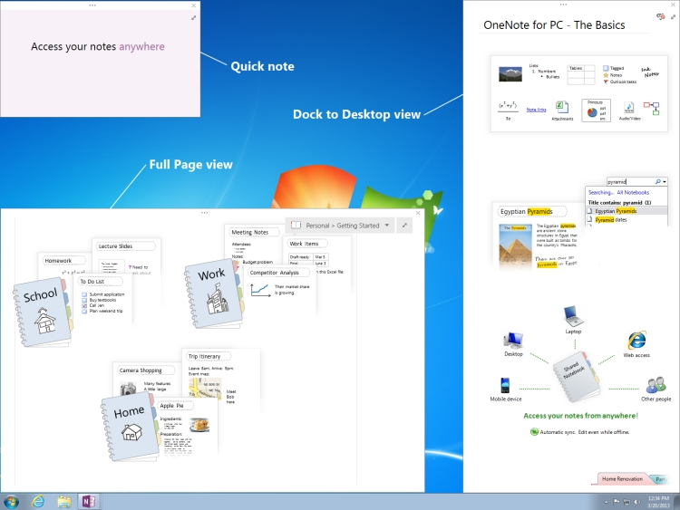

# <a name="window-interfaces-onenote"></a><span data-ttu-id="2d44f-104">窗口接口 （OneNote 2013)</span><span class="sxs-lookup"><span data-stu-id="2d44f-104">Window interfaces (OneNote)</span></span>

<span data-ttu-id="2d44f-p102">**Window**和 **Windows**接口是OneNote 2013 API 对象，使用户能够使用 OneNote 窗口。这些对象允许用户通过 OneNote windows 套枚举并修改某些窗口属性。</span><span class="sxs-lookup"><span data-stu-id="2d44f-p102">The **Window** and **Windows** interfaces are OneNote 2013 API objects that enables users to work with OneNote windows. These objects allow users to enumerate through the set of OneNote windows and modify certain window properties.</span></span> 
  
## <a name="onenote-window-views"></a><span data-ttu-id="2d44f-107">OneNote 窗口视图</span><span class="sxs-lookup"><span data-stu-id="2d44f-107">OneNote window views</span></span>

<span data-ttu-id="2d44f-108">以下列表显示了可用于 OneNote 窗口的四个视图模式：</span><span class="sxs-lookup"><span data-stu-id="2d44f-108">The following list shows the four view modes that you can use for OneNote windows:</span></span> 
  
- <span data-ttu-id="2d44f-109">普通视图 — 显示默认 OneNote 窗口中的笔记本和页上的导航窗格都可见。</span><span class="sxs-lookup"><span data-stu-id="2d44f-109">Normal view—Displays the default OneNote window in which the Notebook and Page navigation panes are visible.</span></span>
    
- <span data-ttu-id="2d44f-110">完整页面视图 — 显示查看其不显示笔记本和页窗格中的最小用户界面 (UI)。</span><span class="sxs-lookup"><span data-stu-id="2d44f-110">Full Page view—Displays a minimal user-interface (UI) view in which the Notebook and Page panes are not displayed.</span></span>
    
- <span data-ttu-id="2d44f-p103">简明 — 显示一个小窗口，使用户能够短添加注释。您通常会通过 Windows 通知区域中的 OneNote 图标来访问简要说明，但您还可以通过在 OneNote 中的 **视图**选项卡访问它们。</span><span class="sxs-lookup"><span data-stu-id="2d44f-p103">Quick note—Displays a small window that allows users to take short notes. You would usually access quick notes through the OneNote icon in the Windows notification area, but you can also access them through the **View** tab in OneNote.</span></span> 
    
- <span data-ttu-id="2d44f-p104">停靠到桌面 — 任何桌面 （类似于任务栏） 的一侧显示可停靠的 OneNote 窗口。此视图可以减少桌面以适应窗口的大小。您可以将只有一个窗口停靠在任何时候，且窗口始终可见不阻止桌面。</span><span class="sxs-lookup"><span data-stu-id="2d44f-p104">Dock to Desktop—Displays a OneNote window that you can dock to any side of the desktop (similar to the taskbar). This view reduces the size of the desktop to fit the window. You can dock only one window at any time, and the window is always visible without blocking the desktop.</span></span> 
    
<span data-ttu-id="2d44f-116">下图显示哪些整页视图，停靠至桌面的视图，并在您的桌面上类似于简要说明。</span><span class="sxs-lookup"><span data-stu-id="2d44f-116">The following figure shows what the Full Page view, Dock to Desktop view, and quick notes look like on your desktop.</span></span>
  
<span data-ttu-id="2d44f-117">**OneNote 视图**</span><span class="sxs-lookup"><span data-stu-id="2d44f-117">**OneNote views**</span></span>

<span data-ttu-id="2d44f-118"></span><span class="sxs-lookup"><span data-stu-id="2d44f-118"></span></span>
  
## <a name="interfaces"></a><span data-ttu-id="2d44f-119">接口</span><span class="sxs-lookup"><span data-stu-id="2d44f-119">Interfaces</span></span>

<span data-ttu-id="2d44f-120">本节列出的接口和成员的可用于以编程方式修改 OneNote 窗口。</span><span class="sxs-lookup"><span data-stu-id="2d44f-120">This section lists the interfaces and members that you can use to modify OneNote windows programmatically.</span></span>
  
### <a name="windows-interface"></a><span data-ttu-id="2d44f-121">Windows 接口</span><span class="sxs-lookup"><span data-stu-id="2d44f-121">Windows interface</span></span>

<span data-ttu-id="2d44f-p105">**Windows**界面允许用户访问的打开的 OneNote 窗口集。它是通过 **Application.Windows**访问的 OneNote **Application**类的属性。这将返回枚举的组的 OneNote 窗口。</span><span class="sxs-lookup"><span data-stu-id="2d44f-p105">The **Windows** interface allows the user to access the set of opened OneNote windows. It is a property of the OneNote **Application** class, accessed through **Application.Windows**. This returns the enumerated set of OneNote windows.</span></span> 
  
<span data-ttu-id="2d44f-125">**属性**</span><span class="sxs-lookup"><span data-stu-id="2d44f-125">**Properties**</span></span>

|<span data-ttu-id="2d44f-126">**名称**</span><span class="sxs-lookup"><span data-stu-id="2d44f-126">**Name**</span></span>|<span data-ttu-id="2d44f-127">**类型**</span><span class="sxs-lookup"><span data-stu-id="2d44f-127">**Type**</span></span>|<span data-ttu-id="2d44f-128">**说明**</span><span class="sxs-lookup"><span data-stu-id="2d44f-128">**Description**</span></span>|
|:-----|:-----|:-----|
|<span data-ttu-id="2d44f-129">**Count**</span><span class="sxs-lookup"><span data-stu-id="2d44f-129">**Count**</span></span> <br/> |<span data-ttu-id="2d44f-130">ulong</span><span class="sxs-lookup"><span data-stu-id="2d44f-130">ulong</span></span>  <br/> |<span data-ttu-id="2d44f-131">获取 **Windows**集中 **Window**对象的数目。</span><span class="sxs-lookup"><span data-stu-id="2d44f-131">Gets the number of **Window** objects in the **Windows** set.</span></span>  <br/> |
|<span data-ttu-id="2d44f-132">**CurrentWindow**</span><span class="sxs-lookup"><span data-stu-id="2d44f-132">**CurrentWindow**</span></span> <br/> |<span data-ttu-id="2d44f-133">**Window**</span><span class="sxs-lookup"><span data-stu-id="2d44f-133">**Window**</span></span> <br/> |<span data-ttu-id="2d44f-134">获取活动的 OneNote 窗口的 **Window**对象。</span><span class="sxs-lookup"><span data-stu-id="2d44f-134">Gets the **Window** object of the active OneNote window.</span></span>  <br/> |
|<span data-ttu-id="2d44f-135">**Items**</span><span class="sxs-lookup"><span data-stu-id="2d44f-135">**Items**</span></span> <br/> |<span data-ttu-id="2d44f-136">**Window**</span><span class="sxs-lookup"><span data-stu-id="2d44f-136">**Window**</span></span> <br/> |<span data-ttu-id="2d44f-p106">返回为传入的索引值相对应的 **Window**对象。此属性不能直接访问。若要返回 **Window**对象，请使用 **Windows [(uint) index]**。 </span><span class="sxs-lookup"><span data-stu-id="2d44f-p106">Returns the **Window** object that corresponds to the index value passed. This property cannot be accessed directly. To return a **Window** object, use **Windows [(uint) index]**.  </span></span><br/> |
   
### <a name="window-interface"></a><span data-ttu-id="2d44f-140">窗口界面</span><span class="sxs-lookup"><span data-stu-id="2d44f-140">Window interface</span></span>

<span data-ttu-id="2d44f-p107">**Window**界面允许用户访问的每个窗口的某些属性。可以通过枚举通过 **Application**类的 **Windows**属性来访问每个 OneNote 窗口。</span><span class="sxs-lookup"><span data-stu-id="2d44f-p107">The **Window** interface allows the user to access certain properties of each window. Each OneNote window can be accessed by enumerating through the **Windows** property of the **Application** class.</span></span> 
  
<span data-ttu-id="2d44f-143">**属性**</span><span class="sxs-lookup"><span data-stu-id="2d44f-143">**Properties**</span></span>

|<span data-ttu-id="2d44f-144">**名称**</span><span class="sxs-lookup"><span data-stu-id="2d44f-144">**Name**</span></span>|<span data-ttu-id="2d44f-145">**类型**</span><span class="sxs-lookup"><span data-stu-id="2d44f-145">**Type**</span></span>|<span data-ttu-id="2d44f-146">**说明**</span><span class="sxs-lookup"><span data-stu-id="2d44f-146">**Description**</span></span>|
|:-----|:-----|:-----|
|<span data-ttu-id="2d44f-147">**Active**</span><span class="sxs-lookup"><span data-stu-id="2d44f-147">**Active**</span></span> <br/> |<span data-ttu-id="2d44f-148">bool</span><span class="sxs-lookup"><span data-stu-id="2d44f-148">bool</span></span>  <br/> |<span data-ttu-id="2d44f-149">获取或设置一个值，指示窗口是否是活动的 OneNote 窗口。</span><span class="sxs-lookup"><span data-stu-id="2d44f-149">Gets or sets a value that indicates whether the window is the active OneNote window.</span></span>  <br/> |
|<span data-ttu-id="2d44f-150">**Application**</span><span class="sxs-lookup"><span data-stu-id="2d44f-150">**Application**</span></span> <br/> |<span data-ttu-id="2d44f-151">**Application**</span><span class="sxs-lookup"><span data-stu-id="2d44f-151">**Application**</span></span> <br/> |<span data-ttu-id="2d44f-152">获取与窗口关联的 OneNote **Application**对象。</span><span class="sxs-lookup"><span data-stu-id="2d44f-152">Gets the OneNote **Application** object that is associated with the window.</span></span>  <br/> |
|<span data-ttu-id="2d44f-153">**CurrentPageId**</span><span class="sxs-lookup"><span data-stu-id="2d44f-153">**CurrentPageId**</span></span> <br/> |<span data-ttu-id="2d44f-154">string</span><span class="sxs-lookup"><span data-stu-id="2d44f-154">string</span></span>  <br/> |<span data-ttu-id="2d44f-155">获取窗口的活动的 OneNote 页面的对象 ID。</span><span class="sxs-lookup"><span data-stu-id="2d44f-155">Gets the object ID of the active OneNote page of the window.</span></span>  <br/> |
|<span data-ttu-id="2d44f-156">**CurrentSectionId**</span><span class="sxs-lookup"><span data-stu-id="2d44f-156">**CurrentSectionId**</span></span> <br/> |<span data-ttu-id="2d44f-157">string</span><span class="sxs-lookup"><span data-stu-id="2d44f-157">string</span></span>  <br/> |<span data-ttu-id="2d44f-158">获取窗口的活动 OneNote 部分的对象 ID。</span><span class="sxs-lookup"><span data-stu-id="2d44f-158">Gets the object ID of the active OneNote section of the window.</span></span>  <br/> |
|<span data-ttu-id="2d44f-159">**CurrentSectionGroupId**</span><span class="sxs-lookup"><span data-stu-id="2d44f-159">**CurrentSectionGroupId**</span></span> <br/> |<span data-ttu-id="2d44f-160">string</span><span class="sxs-lookup"><span data-stu-id="2d44f-160">string</span></span>  <br/> |<span data-ttu-id="2d44f-161">获取窗口的活动的 OneNote 分区组的对象 ID。</span><span class="sxs-lookup"><span data-stu-id="2d44f-161">Gets the object ID of the active OneNote section group of the window.</span></span>  <br/> |
|<span data-ttu-id="2d44f-162">**CurrentNotebookId**</span><span class="sxs-lookup"><span data-stu-id="2d44f-162">**CurrentNotebookId**</span></span> <br/> |<span data-ttu-id="2d44f-163">string</span><span class="sxs-lookup"><span data-stu-id="2d44f-163">string</span></span>  <br/> |<span data-ttu-id="2d44f-164">获取窗口的活动的 OneNote 笔记本的对象 ID。</span><span class="sxs-lookup"><span data-stu-id="2d44f-164">Gets the object ID of the active OneNote notebook of the window.</span></span>  <br/> |
|<span data-ttu-id="2d44f-165">**DockedLocation**</span><span class="sxs-lookup"><span data-stu-id="2d44f-165">**DockedLocation**</span></span> <br/> |<span data-ttu-id="2d44f-166">**DockedLocation**</span><span class="sxs-lookup"><span data-stu-id="2d44f-166">**DockedLocation**</span></span> <br/> |<span data-ttu-id="2d44f-167">获取或设置 OneNote 窗口的停靠的位置。</span><span class="sxs-lookup"><span data-stu-id="2d44f-167">Gets or sets the docked location of the OneNote window.</span></span>  <br/> |
|<span data-ttu-id="2d44f-168">**FullPageView**</span><span class="sxs-lookup"><span data-stu-id="2d44f-168">**FullPageView**</span></span> <br/> |<span data-ttu-id="2d44f-169">bool</span><span class="sxs-lookup"><span data-stu-id="2d44f-169">bool</span></span>  <br/> |<span data-ttu-id="2d44f-170">获取或设置一个值，指示窗口是否是在整页视图 （最少 UI 视图）。</span><span class="sxs-lookup"><span data-stu-id="2d44f-170">Gets or sets a value that indicates whether the window is in Full Page view (minimal UI view).</span></span>  <br/> |
|<span data-ttu-id="2d44f-171">**SideNote**</span><span class="sxs-lookup"><span data-stu-id="2d44f-171">**SideNote**</span></span> <br/> |<span data-ttu-id="2d44f-172">bool</span><span class="sxs-lookup"><span data-stu-id="2d44f-172">bool</span></span>  <br/> |<span data-ttu-id="2d44f-173">获取或设置一个值，指示窗口是否是一个简明窗口。</span><span class="sxs-lookup"><span data-stu-id="2d44f-173">Gets or sets a value that indicates whether the window is a quick note window.</span></span>  <br/> |
|<span data-ttu-id="2d44f-174">**WindowHandle**</span><span class="sxs-lookup"><span data-stu-id="2d44f-174">**WindowHandle**</span></span> <br/> |<span data-ttu-id="2d44f-175">ulong</span><span class="sxs-lookup"><span data-stu-id="2d44f-175">ulong</span></span>  <br/> |<span data-ttu-id="2d44f-176">获取 OneNote 窗口的句柄 ID。</span><span class="sxs-lookup"><span data-stu-id="2d44f-176">Gets the handle ID of the OneNote window.</span></span>  <br/> |
   
<span data-ttu-id="2d44f-177">**方法**</span><span class="sxs-lookup"><span data-stu-id="2d44f-177">**Methods**</span></span>
  
<span data-ttu-id="2d44f-178">可以使用 **Window**接口的以下方法导航到 OneNote 窗口中的指定对象或指定的 Url。</span><span class="sxs-lookup"><span data-stu-id="2d44f-178">You can use the following methods of the **Window** interface to navigate to specified objects in the OneNote window or to specified URLs.</span></span> 
  
<span data-ttu-id="2d44f-179">**NavigateTo**</span><span class="sxs-lookup"><span data-stu-id="2d44f-179">**NavigateTo**</span></span>

|||
|:-----|:-----|
|<span data-ttu-id="2d44f-180">**描述**</span><span class="sxs-lookup"><span data-stu-id="2d44f-180">**Description**</span></span> <br/> |<span data-ttu-id="2d44f-p108">导航到 OneNote 窗口中指定的对象。例如，您可以导航到节、 页面和页中的大纲元素。</span><span class="sxs-lookup"><span data-stu-id="2d44f-p108">Navigates to the specified object in the OneNote window. For example, you can navigate to sections, pages, and outline elements within pages.</span></span>  <br/> |
|<span data-ttu-id="2d44f-183">**语法**</span><span class="sxs-lookup"><span data-stu-id="2d44f-183">**Syntax**</span></span> <br/> | <span data-ttu-id="2d44f-184">`HRESULT NavigateTo(`           ` [in]BSTR bstrHierarchyObjectID, `           ` [in]BSTR bstrObjectID); `</span><span class="sxs-lookup"><span data-stu-id="2d44f-184"></span></span> <br/> |
|<span data-ttu-id="2d44f-185">**参数**</span><span class="sxs-lookup"><span data-stu-id="2d44f-185">**Parameters**</span></span> <br/> | <span data-ttu-id="2d44f-p109">_bstrHierarchyObjectID_— 层次结构 OneNote 您想要导航到的对象 ID。OneNote 笔记本、 节、 节组或页上，可以引用的对象 ID。 </span><span class="sxs-lookup"><span data-stu-id="2d44f-p109">_bstrHierarchyObjectID_—The hierarchy OneNote ID of the object you want to navigate to. The object ID can reference a OneNote notebook, section, section group, or page.  </span></span><br/>  <span data-ttu-id="2d44f-p110">_bstrObjectID_— 的 OneNote ID 的特定对象以导航到 OneNote 页面中。如果用户不希望以导航到页面上的特定对象，此参数设置为 null。 </span><span class="sxs-lookup"><span data-stu-id="2d44f-p110">_bstrObjectID_—The OneNote ID of the specific object to navigate to within a OneNote page. If the user does not want to navigate to a specific object on a page, this parameter is set to null.  </span></span><br/> |
   
<span data-ttu-id="2d44f-190">**NavigateToUrl**</span><span class="sxs-lookup"><span data-stu-id="2d44f-190">**NavigateToUrl**</span></span>

|||
|:-----|:-----|
|<span data-ttu-id="2d44f-191">**描述**</span><span class="sxs-lookup"><span data-stu-id="2d44f-191">**Description**</span></span> <br/> |<span data-ttu-id="2d44f-p111">如果传递的 OneNote 链接 （onenote: / /)，在 OneNote 中打开 OneNote 窗口到相应位置。但是，如果链接是外部链接，例如 http:// 或 file://，将出现一个安全对话框。时开除，OneNote 尝试打开链接，并返回 HResult.hrObjectDoesNotExist 错误。</span><span class="sxs-lookup"><span data-stu-id="2d44f-p111">If passed a OneNote link (onenote://), opens the OneNote window to the corresponding location in OneNote. However, if the link is an external link, such as http:// or file://, a security dialog box will appear. Upon dismissal, OneNote attempts to open up the link and an HResult.hrObjectDoesNotExist error is returned.</span></span>  <br/> |
|<span data-ttu-id="2d44f-195">**语法**</span><span class="sxs-lookup"><span data-stu-id="2d44f-195">**Syntax**</span></span> <br/> | <span data-ttu-id="2d44f-196">`HRESULT NavigateToUrl (`           ` [in]BSTR bstrUrl); `</span><span class="sxs-lookup"><span data-stu-id="2d44f-196"></span></span> <br/> |
|<span data-ttu-id="2d44f-197">**参数**</span><span class="sxs-lookup"><span data-stu-id="2d44f-197">**Parameters**</span></span> <br/> | <span data-ttu-id="2d44f-198">_bstrUrl_— 要导航到的 URL。</span><span class="sxs-lookup"><span data-stu-id="2d44f-198">_bstrUrl_—The URL to navigate to.</span></span>  <br/> |
   
<span data-ttu-id="2d44f-199">**SetDockedLocation**</span><span class="sxs-lookup"><span data-stu-id="2d44f-199">**SetDockedLocation**</span></span>

|||
|:-----|:-----|
|<span data-ttu-id="2d44f-200">**描述**</span><span class="sxs-lookup"><span data-stu-id="2d44f-200">**Description**</span></span> <br/> |<span data-ttu-id="2d44f-201">停靠窗口指定 **dockLocation**和在 **ptMonitor**监视器的位置。</span><span class="sxs-lookup"><span data-stu-id="2d44f-201">Docks the window to the location specified by **dockLocation** and the monitor at **ptMonitor**.</span></span>  <br/> |
|<span data-ttu-id="2d44f-202">**语法**</span><span class="sxs-lookup"><span data-stu-id="2d44f-202">**Syntax**</span></span> <br/> | <span data-ttu-id="2d44f-203">`HRESULT SetDockedLocation`(           `[in] DockLocation dockLocation,`           `[in] POINT ptMonitor);`</span><span class="sxs-lookup"><span data-stu-id="2d44f-203"></span></span> <br/> |
|<span data-ttu-id="2d44f-204">**参数**</span><span class="sxs-lookup"><span data-stu-id="2d44f-204">**Parameters**</span></span> <br/> | <span data-ttu-id="2d44f-205">_dockLocation_ -指示OneNote 2013窗口的停靠的位置。</span><span class="sxs-lookup"><span data-stu-id="2d44f-205">_dockLocation_ - Indicates the docked location of a OneNote 2013 window.</span></span>  <br/>  <span data-ttu-id="2d44f-206">_ptMonitor_ -在 x，其中监视窗口 y 坐标 （可选） 指示应固定。</span><span class="sxs-lookup"><span data-stu-id="2d44f-206">_ptMonitor_ - (Optional) Indicates in x,y co-ordinates which monitor the window should be docked to.</span></span>  <br/> |
   
## <a name="example"></a><span data-ttu-id="2d44f-207">示例</span><span class="sxs-lookup"><span data-stu-id="2d44f-207">Example</span></span>

<span data-ttu-id="2d44f-p112">下面的代码将循环访问 OneNote 窗口，以查找停靠的窗口中。如果没有停靠的窗口存在，该示例将停靠活动窗口。如果没有活动窗口存在，该代码将创建一个新的停靠的窗口。</span><span class="sxs-lookup"><span data-stu-id="2d44f-p112">The following code iterates through the OneNote windows to find a docked window. If no docked window exists, the example docks the active window. If no active window exists, the code creates a new docked window.</span></span>
  
```cs
using System;
using System.Diagnostics;
using Microsoft.Office.Interop.OneNote;
namespace SampleWND
{
    class DockOneNoteWindow
    {
        static void Main(string[] args)
        {
            Microsoft.Office.Interop.OneNote.Application app = new Microsoft.Office.Interop.OneNote.Application();
            // Search through all OneNote windows for a docked window and activate it.
            bool foundDockedWND = false;
            for (int i = 0; i < app.Windows.Count; i++)
            {
                if (app.Windows[(uint) i].DockedLocation != DockLocation.dlNone)
                {
                    foundDockedWND = true;
                    app.Windows[(uint) i].Active = true;
                }
            }
            
            // If no docked window exists, dock the active window.
            if (!foundDockedWND && (app.Windows.Count > 0))
                app.Windows.CurrentWindow.DockedLocation = DockLocation.dlDefault;
            // If no active window exists, create a new docked window.
            if (app.Windows.Count < 1)
            {
                Process oneProc = new Process();
                oneProc.StartInfo.FileName = "onenote.exe";
                oneProc.StartInfo.Arguments = "/docked";
                oneProc.Start();
            }
        }
    }
}

```

## <a name="see-also"></a><span data-ttu-id="2d44f-211">另请参阅</span><span class="sxs-lookup"><span data-stu-id="2d44f-211">See also</span></span>

- [<span data-ttu-id="2d44f-212">OneNote 开发人员参考</span><span class="sxs-lookup"><span data-stu-id="2d44f-212">OneNote developer reference</span></span>](onenote-developer-reference.md)

