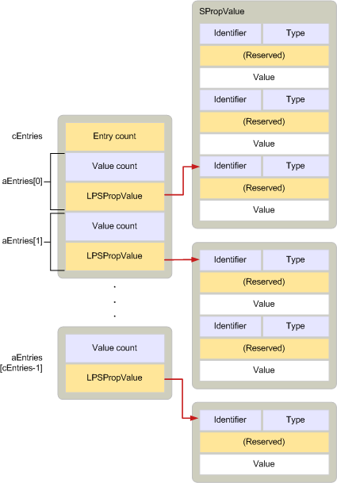

# <a name="adrlist"></a><span data-ttu-id="91c4b-103">ADRLIST</span><span class="sxs-lookup"><span data-stu-id="91c4b-103">ADRLIST</span></span>

<span data-ttu-id="91c4b-104">**适用于**： Outlook</span><span class="sxs-lookup"><span data-stu-id="91c4b-104">**Applies to**: Outlook</span></span> 
  
<span data-ttu-id="91c4b-105">介绍属于一个或多个收件人的零个或多个属性。</span><span class="sxs-lookup"><span data-stu-id="91c4b-105">Describes zero or more properties that belong to one or more recipients.</span></span> 
  
|||
|:-----|:-----|
|<span data-ttu-id="91c4b-106">头文件：</span><span class="sxs-lookup"><span data-stu-id="91c4b-106">Header file:</span></span>  <br/> |<span data-ttu-id="91c4b-107">Mapidefs.h</span><span class="sxs-lookup"><span data-stu-id="91c4b-107">Mapidefs.h</span></span>  <br/> |
|<span data-ttu-id="91c4b-108">相关的宏：</span><span class="sxs-lookup"><span data-stu-id="91c4b-108">Related macros:</span></span>  <br/> |<span data-ttu-id="91c4b-109">[CbADRLIST](cbadrlist.md)， [CbNewADRLIST](cbnewadrlist.md)， [CbNewADRLIST](cbnewadrlist.md)</span><span class="sxs-lookup"><span data-stu-id="91c4b-109">[CbADRLIST](cbadrlist.md), [CbNewADRLIST](cbnewadrlist.md), [CbNewADRLIST](cbnewadrlist.md)</span></span> <br/> |
   
```cpp
typedef struct _ADRLIST
{
  ULONG cEntries;
  ADRENTRY aEntries[MAPI_DIM];
} ADRLIST, FAR *LPADRLIST;

```

## <a name="members"></a><span data-ttu-id="91c4b-110">Members</span><span class="sxs-lookup"><span data-stu-id="91c4b-110">Members</span></span>

<span data-ttu-id="91c4b-111">**cEntries**</span><span class="sxs-lookup"><span data-stu-id="91c4b-111">**cEntries**</span></span>
  
> <span data-ttu-id="91c4b-112">指定由**aEntries**成员的数组中的条目的计数。</span><span class="sxs-lookup"><span data-stu-id="91c4b-112">Count of entries in the array specified by the **aEntries** member.</span></span> 
    
<span data-ttu-id="91c4b-113">**aEntries**</span><span class="sxs-lookup"><span data-stu-id="91c4b-113">**aEntries**</span></span>
  
> <span data-ttu-id="91c4b-114">[ADRENTRY](adrentry.md)结构数组，每个收件人的一个结构。</span><span class="sxs-lookup"><span data-stu-id="91c4b-114">Array of [ADRENTRY](adrentry.md) structures, one structure for each recipient.</span></span> 
    
## <a name="remarks"></a><span data-ttu-id="91c4b-115">说明</span><span class="sxs-lookup"><span data-stu-id="91c4b-115">Remarks</span></span>

<span data-ttu-id="91c4b-116">**ADRLIST**结构包含一个或多个**ADRENTRY**结构，每个描述收件人的属性。</span><span class="sxs-lookup"><span data-stu-id="91c4b-116">An **ADRLIST** structure contains one or more **ADRENTRY** structures, each describing the properties of a recipient.</span></span> <span data-ttu-id="91c4b-117">收件人可以是未解析。</span><span class="sxs-lookup"><span data-stu-id="91c4b-117">A recipient can be unresolved.</span></span> <span data-ttu-id="91c4b-118">这意味着缺少的属性值的数组中的项标识符。</span><span class="sxs-lookup"><span data-stu-id="91c4b-118">This means that it is lacking an entry identifier in its array of property values.</span></span> <span data-ttu-id="91c4b-119">解析的收件人是指**PR\_ENTRYID**包括的 ([PidTagEntryId](pidtagentryid-canonical-property.md)) 属性。</span><span class="sxs-lookup"><span data-stu-id="91c4b-119">A resolved recipient means that the **PR\_ENTRYID** ([PidTagEntryId](pidtagentryid-canonical-property.md)) property is included.</span></span> <span data-ttu-id="91c4b-120">通常，已解析的收件人也有电子邮件地址的**PR_EMAIL_ADDRESS** ([PidTagEmailAddress](pidtagemailaddress-canonical-property.md)) 属性。</span><span class="sxs-lookup"><span data-stu-id="91c4b-120">Typically, resolved recipients also have an email address the **PR_EMAIL_ADDRESS** ([PidTagEmailAddress](pidtagemailaddress-canonical-property.md)) property.</span></span> <span data-ttu-id="91c4b-121">但是，不需要的电子邮件地址。</span><span class="sxs-lookup"><span data-stu-id="91c4b-121">However, the email address is not required.</span></span> <span data-ttu-id="91c4b-122">**ADRLIST**结构用于，例如，描述传出消息和 MAPI 在通讯簿中显示的项的收件人列表。</span><span class="sxs-lookup"><span data-stu-id="91c4b-122">**ADRLIST** structures are used, for example, to describe the recipient list for an outgoing message and by MAPI to display the entries in the address book.</span></span> 
  
<span data-ttu-id="91c4b-123">**ADRLIST**结构类似于[SRowSet](srowset.md)结构用于表示表中的行的结构。</span><span class="sxs-lookup"><span data-stu-id="91c4b-123">**ADRLIST** structures resemble [SRowSet](srowset.md) structures the structures used for representing rows in tables.</span></span> <span data-ttu-id="91c4b-124">实际上，这些两个结构设计，以便可以交替使用它们。</span><span class="sxs-lookup"><span data-stu-id="91c4b-124">In fact, these two structures are designed so that they can be used interchangeably.</span></span> <span data-ttu-id="91c4b-125">同时包含数组的结构，描述了一组属性和值数组中的计数。</span><span class="sxs-lookup"><span data-stu-id="91c4b-125">Both contain an array of structures describing a group of properties and a count of the values in the array.</span></span> <span data-ttu-id="91c4b-126">而在**ADRLIST**结构中，该数组包含[ADRENTRY](adrentry.md)结构， **SRowSet**结构数组中的包含[SRow](srow.md)结构。</span><span class="sxs-lookup"><span data-stu-id="91c4b-126">Whereas in the **ADRLIST** structure, the array contains [ADRENTRY](adrentry.md) structures, in the **SRowSet** structure the array contains [SRow](srow.md) structures.</span></span> <span data-ttu-id="91c4b-127">**ADRENTRY**结构和**SRow**结构是布局中相同的。</span><span class="sxs-lookup"><span data-stu-id="91c4b-127">**ADRENTRY** structures and **SRow** structures are identical in layout.</span></span> <span data-ttu-id="91c4b-128">因为**ADRLIST**和**SRowSet**结构遵循相同的分配规则，则可以强制转换为**ADRLIST**结构从通讯簿容器内容表中检索**SRowSet**结构，并将其原样使用。</span><span class="sxs-lookup"><span data-stu-id="91c4b-128">Because **ADRLIST** and **SRowSet** structures follow the same allocation rules, an **SRowSet** structure that is retrieved from the contents table of an address book container can be cast to an **ADRLIST** structure and used as is.</span></span> 
  
<span data-ttu-id="91c4b-129">下图显示了**ADRLIST**结构的布局。</span><span class="sxs-lookup"><span data-stu-id="91c4b-129">The following illustration shows the layout of an **ADRLIST** structure.</span></span> 
  
<span data-ttu-id="91c4b-130">**ADRLIST 组件**</span><span class="sxs-lookup"><span data-stu-id="91c4b-130">**ADRLIST components**</span></span>
  
<span data-ttu-id="91c4b-131"></span><span class="sxs-lookup"><span data-stu-id="91c4b-131"></span></span>
  
<span data-ttu-id="91c4b-132">**ADRLIST**结构中的**ADRENTRY**和[SPropValue](spropvalue.md)部分必须分配，并可以独立于其他部件释放。</span><span class="sxs-lookup"><span data-stu-id="91c4b-132">The **ADRENTRY** and [SPropValue](spropvalue.md) portions in an **ADRLIST** structure must be allocated and freed independently of the other parts.</span></span> <span data-ttu-id="91c4b-133">即，每个**SPropValue**结构必须分配单独分配内存**ADRENTRY**结构并将其释放之前释放**ADRENTRY**结构之后。</span><span class="sxs-lookup"><span data-stu-id="91c4b-133">That is, each **SPropValue** structure must be allocated individually after memory for the **ADRENTRY** structure has been allocated and freed before the **ADRENTRY** structure is freed.</span></span> <span data-ttu-id="91c4b-134">处理内存此独立性允许收件人和单个收件人属性自由地添加或从地址列表中删除。</span><span class="sxs-lookup"><span data-stu-id="91c4b-134">This independence in handling memory allows recipients and individual recipient properties to be freely added or deleted from the address list.</span></span> 
  
<span data-ttu-id="91c4b-135">[MAPIAllocateBuffer](mapiallocatebuffer.md)和[MAPIFreeBuffer](mapifreebuffer.md)函数必须用于分配和释放**ADRLIST**结构和所有部件。</span><span class="sxs-lookup"><span data-stu-id="91c4b-135">The [MAPIAllocateBuffer](mapiallocatebuffer.md) and [MAPIFreeBuffer](mapifreebuffer.md) functions must be used to allocate and free the **ADRLIST** structure and all its parts.</span></span> 
  
<span data-ttu-id="91c4b-136">如果太长而在内存中的收件人列表，客户端可以调用[IMessage::ModifyRecipients](imessage-modifyrecipients.md)方法用于列表的子集。</span><span class="sxs-lookup"><span data-stu-id="91c4b-136">If a recipient list is too large to fit in memory, clients can call the [IMessage::ModifyRecipients](imessage-modifyrecipients.md) method to work with a subset of the list.</span></span> <span data-ttu-id="91c4b-137">客户端不应使用地址簿常见对话框在此情况下。</span><span class="sxs-lookup"><span data-stu-id="91c4b-137">Clients should not use the address book common dialog boxes in this situation.</span></span> 
  
<span data-ttu-id="91c4b-138">有关如何为**ADRENTRY**结构分配内存的详细信息，请参阅[管理内存 ADRLIST 和 SRowSet 结构](managing-memory-for-adrlist-and-srowset-structures.md)。</span><span class="sxs-lookup"><span data-stu-id="91c4b-138">For more information about how to allocate memory for **ADRENTRY** structures, see [Managing Memory for ADRLIST and SRowSet Structures](managing-memory-for-adrlist-and-srowset-structures.md).</span></span> 
  
## <a name="see-also"></a><span data-ttu-id="91c4b-139">另请参阅</span><span class="sxs-lookup"><span data-stu-id="91c4b-139">See also</span></span>

- [<span data-ttu-id="91c4b-140">ADRENTRY</span><span class="sxs-lookup"><span data-stu-id="91c4b-140">ADRENTRY</span></span>](adrentry.md)  
- [<span data-ttu-id="91c4b-141">CbNewADRLIST</span><span class="sxs-lookup"><span data-stu-id="91c4b-141">CbNewADRLIST</span></span>](cbnewadrlist.md) 
- [<span data-ttu-id="91c4b-142">IMessage::ModifyRecipients</span><span class="sxs-lookup"><span data-stu-id="91c4b-142">IMessage::ModifyRecipients</span></span>](imessage-modifyrecipients.md) 
- [<span data-ttu-id="91c4b-143">SRowSet</span><span class="sxs-lookup"><span data-stu-id="91c4b-143">SRowSet</span></span>](srowset.md)
- [<span data-ttu-id="91c4b-144">MAPI 结构</span><span class="sxs-lookup"><span data-stu-id="91c4b-144">MAPI Structures</span></span>](mapi-structures.md)

