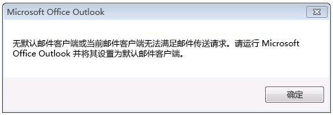
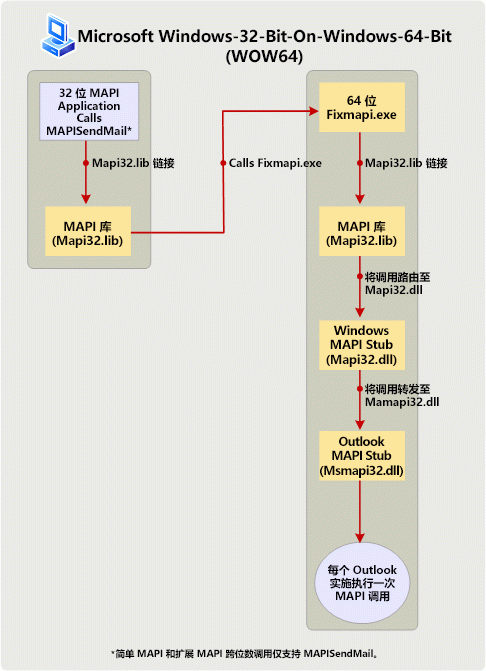

# 在 32 位和 64 位平台上构建 MAPI 应用程序Building MAPI applications on 32-bit and 64-bit platforms

**适用于**： Outlook 2013 |Outlook 2016**Applies to**: Outlook 2013 | Outlook 2016 
  
本主题介绍以更改并重新构建在 64 位平台上，运行 32 位 MAPI 的应用程序和 64 位应用程序在 32 位平台上运行，MAPI 开发人员应采取的操作。This topic describes the actions that MAPI developers should take to change and rebuild 32-bit MAPI applications to run on a 64-bit platform, and 64-bit applications to run on a 32-bit platform. 本主题中的 64 位平台是安装 64 位 Microsoft Outlook 和 64 位 Windows，一台计算机，32 位平台安装 32 位 Outlook 和 32 位或 64 位 Windows 的计算机。In this topic, a 64-bit platform is a computer installed with 64-bit Microsoft Outlook and 64-bit Windows, and a 32-bit platform is a computer installed with a 32-bit Outlook and 32-bit or 64-bit Windows. 
  
## 操作系统和 64 位 Outlook 的 Office 支持Operating system and Office support for 64-bit Outlook

> [!NOTE]
> 术语位数指的是 32 位和 64 位处理器体系结构和关联的应用程序兼容性之间的区别。The term bitness refers to the distinction between 32-bit and 64-bit processor architectures and the associated compatibility of applications. 本主题中 bitness 用于限定 Windows、 Microsoft Office、 Outlook 或 MAPI 应用程序构建以满足计算机的 32 位或 64 位处理器体系结构和可能选择在该计算机运行其他应用程序的版本。In this topic, bitness is used to qualify the version of Windows, Microsoft Office, Outlook, or a MAPI application built to suit a 32-bit or 64-bit processor architecture of a computer, and possibly other applications that run on that computer. 
  
启动 Microsoft Office 2010 中，Outlook 位于为 32 位和 64 位应用程序。Starting in Microsoft Office 2010, Outlook is available as a 32-bit and a 64-bit application. 在同一台计算机上，Outlook 位数取决于位数和 Microsoft Office 的 Windows 操作系统 （x86 或 x64），如果已在该计算机上安装 Office。On the same computer, the bitness of Outlook depends on the bitness of the Windows operating system (x86 or x64), and of Microsoft Office, if Office is already installed on that computer. 下面是 outlook 的一些确定安装 32 位或 64 位版本可行的因素：The following are some of the factors that determine the feasibility of installing a 32-bit or a 64-bit version of Outlook:
  
- 32 位 Office（和 32 位 Outlook）可以安装在 32 位或 64 位版本的 Windows 操作系统上。64 位 Office（和 64 位 Outlook）只能安装在 64 位操作系统上。32-bit Office (and 32-bit Outlook) can be installed on a 32-bit or 64-bit version of the Windows operating system. 64-bit Office (and 64-bit Outlook) can be installed only on a 64-bit operating system.
    
- 在 64 位版本的 Windows 操作系统上，默认安装的 Office 是 32 位 Office。The default installation of Office on a 64-bit version of the Windows operating system is 32-bit Office.
    
- 位数的安装版本始终是 office 的 outlook 的相同，位数如果同一台计算机上安装 Office。The bitness of an installed version of Outlook is always the same as the bitness of Office, if Office is installed on the same computer. 换句话说，不能在已安装，如 Microsoft Word 64 位或 64 位 Microsoft Excel 其他 Office 应用程序的 64 位版本的同一台计算机上安装 32 位版本的 Outlook。In other words, a 32-bit version of Outlook cannot be installed on the same computer that already has 64-bit versions of other Office applications installed, such as 64-bit Microsoft Word or 64-bit Microsoft Excel. 同样，不能在已安装其他 Office 应用程序的 32 位版本的同一台计算机上安装 64 位版本的 Outlook。Similarly, a 64-bit version of Outlook cannot be installed on the same computer that already has 32-bit versions of other Office applications installed.
    
## 准备用于 32 位和 64 位平台的 MAPI 应用程序Preparing MAPI applications for 32-bit and 64-bit platforms

MAPI 应用程序包括独立应用程序，如 Microsoft Communicator 和 MFCMAPI，如通讯簿服务提供程序存储和传输提供程序。MAPI applications include standalone applications such as Microsoft Communicator and MFCMAPI, and service providers such as address book, store, and transport providers. 对于 MAPI 方法和函数的 MAPI 应用程序的位数 （除外一个简单 MAPI 函数，MAPISendMail），MAPI 应用程序中单位电话的呼叫必须是相同的到目标应用程序的计算机上的 MAPI 子系统 bitness上运行。For MAPI method and function calls to work in a MAPI application (with the exception of one Simple MAPI function, MAPISendMail), the bitness of the MAPI application must be the same as the bitness of the MAPI subsystem on the computer that the application is targeted to run on. MAPI 子系统位数反过来，取决于通过以及始终安装的 Outlook 版本位数相同。The bitness of the MAPI subsystem, in turn, is determined by and always the same as the bitness of the installed version of Outlook. 下表总结了必要的操作以准备使用 Office 和 Windows 的各种 bitness 配置的目标计算机上运行的 MAPI 应用程序。The following table summarizes the necessary actions to prepare MAPI applications to run on targeted computers configured with Office and Windows of various bitness.
  
|位元 MAPI 应用程序Bitness of MAPI application|在目标计算机上的 Outlook 的位元Bitness of Outlook on targeted computer|在目标计算机上的 Windows 的位元Bitness of Windows on targeted computer|要启用要在目标计算机上运行的应用程序所需操作Necessary action to enable application to run on targeted computer|
|:-----|:-----|:-----|:-----|
|32 位32-bit    |32 位32-bit    |32 位或 64 位32-bit or 64-bit    |不不需要任何特定操作。No specific action is necessary.    |
|32 位32-bit    |64 位64-bit    |64 位64-bit    |重新生成作为 64 位应用程序的应用程序。Rebuild the application as a 64-bit application. 否则，（除外**MAPISendMail**) 的所有 MAPI 方法和函数调用将都失败。Otherwise, all MAPI method and function calls (except for **MAPISendMail**) will fail.    |
|64 位64-bit    |64 位64-bit    |64 位64-bit    |不不需要任何特定操作。No specific action is necessary.    |
|64 位64-bit    |32 位32-bit    |32 位或 64 位32-bit or 64-bit    |重新生成作为 32 位应用程序的应用程序。Rebuild the application as a 32-bit application. 否则，（除外**MAPISendMail**) 的所有 MAPI 方法和函数调用将都失败。Otherwise, all MAPI method and function calls (except for **MAPISendMail**) will fail.    |
   
以下各节详细介绍每种方案。The following sections further explain each scenario. 需要重建的 MAPI 应用程序的方案，请参阅关于链接到和调用 MAPI 函数的其他信息的[链接到 MAPI 函数](how-to-link-to-mapi-functions.md)。For scenarios that require rebuilding the MAPI application, see [Link to MAPI Functions](how-to-link-to-mapi-functions.md) for additional information regarding linking to and calling MAPI functions. 
  
### 32 位 MAPI 应用程序和 32 位 Outlook32-bit MAPI application and 32-bit Outlook

MAPI 应用程序有 32 位版本的 Outlook，包括 Microsoft Outlook 2013 之前这些版本的 32 位 MAPI 子系统编译继续安装 32 位 Outlook 和 32 位或 64 位 Windows 的计算机上必须支持操作系统。MAPI applications compiled for a 32-bit MAPI subsystem that is available in 32-bit versions of Outlook, including those versions prior to Microsoft Outlook 2013, continue to be supported on computers installed with 32-bit Outlook and a 32-bit or 64-bit Windows operating system. 没有必要的应用程序开发的特定操作。There is no specific action necessary for the application developers.
  
### 32 位 MAPI 应用程序和 64 位 Outlook32-bit MAPI application and 64-bit Outlook

32 位 MAPI 应用程序不支持安装 64 位 Outlook 与 64 位 Windows 的计算机上运行。32-bit MAPI applications are not supported to run on a computer installed with 64-bit Outlook and 64-bit Windows. 应用程序开发人员必须更新并重新生成作为一个用于 64 位平台的 64 位应用程序的应用程序。The application developer must update and rebuild the application as a 64-bit application for the 64-bit platform. 这是因为 32 位应用程序无法加载的 64 位 Msmapi32.dll 文件。This is because a 32-bit application cannot load a 64-bit Msmapi32.dll file. 有少量 API 应用程序开发人员必须包含构建其代码成功的 64 位环境的更改。There are a small number of API changes that application developers must incorporate to build their code successfully for a 64-bit environment. 使用这些改变以支持 64 位平台，MAPI 头文件进行了更新。MAPI header files have been updated with these changes to support the 64-bit platform. 您可以下载这些头文件在[Outlook 2010: MAPI 头文件](http://www.microsoft.com/downloads/details.aspx?FamilyID=f8d01fc8-f7b5-4228-baa3-817488a66db1)。You can download these header files at [Outlook 2010: MAPI Header Files](http://www.microsoft.com/downloads/details.aspx?FamilyID=f8d01fc8-f7b5-4228-baa3-817488a66db1). 开发人员可以使用此一组相同的 MAPI 头文件来构建 32 位和 64 位的 MAPI 应用程序。Developers can use this same set of MAPI header files to build both 32-bit and 64-bit MAPI applications.
  
### 64 位 MAPI 应用程序和 64 位 Outlook64-bit MAPI application and 64-bit Outlook

64 位 MAPI 应用程序支持安装 64 位 Outlook 和 64 位 Windows 的计算机上。64-bit MAPI applications are supported on computers installed with 64-bit Outlook and 64-bit Windows. 没有必要的应用程序开发的特定操作。There is no specific action necessary for the application developers.
  
### 64 位 MAPI 应用程序和 32 位 Outlook64-bit MAPI application and 32-bit Outlook

64 位 MAPI 应用程序不支持在安装 32 位 Outlook 和 32 位或 64 位 Windows 计算机上运行。64-bit MAPI applications are not supported to run on a computer installed with 32-bit Outlook and 32-bit or 64-bit Windows. 应用程序开发人员必须更新并重新生成作为 32 位应用程序以使用 32 位 Outlook 应用程序。The application developer must update and rebuild the application as a 32-bit application to work with 32-bit Outlook. 使用更新的 MAPI 头文件，可以在下载[Outlook 2010: MAPI 头文件](http://www.microsoft.com/downloads/details.aspx?FamilyID=f8d01fc8-f7b5-4228-baa3-817488a66db1)。Use the updated MAPI header files, which you can download at [Outlook 2010: MAPI Header Files](http://www.microsoft.com/downloads/details.aspx?FamilyID=f8d01fc8-f7b5-4228-baa3-817488a66db1). 开发人员可以使用此一组相同的 MAPI 头文件来构建 32 位和 64 位的 MAPI 应用程序。Developers can use this same set of MAPI header files to build both 32-bit and 64-bit MAPI applications.
  
### 异常： MAPISendMailException: MAPISendMail

一般情况下，32 位 MAPI 应用程序必须在上运行 64 位平台 (64 位 Windows 上的 64 位 Outlook) 而无需第一个成为重建与 32 位 Outlook 安装的计算机上未运行 64 位应用程序和 64 位 MAPI 应用程序，必须如和 32 位或 64 位Windows 事先重建作为 32 位应用程序。In general, a 32-bit MAPI application must not run on a 64-bit platform (64-bit Outlook on 64-bit Windows) without first being rebuilt as a 64-bit application, and a 64-bit MAPI application must not run on a computer installed with 32-bit Outlook and 32-bit or 64-bit Windows without first being rebuilt as a 32-bit application. 图 1 显示了是否发生这些方案之一，将显示警报对话框。Figure 1 shows an alert dialog box that would be displayed if either of these scenarios occurs.
  
**图 1。错误消息的大部分跨位元 MAPI 调用。****Figure 1. Error message for most cross-bitness MAPI calls.**

  
但是，将在所有简单 MAPI 和 MAPI 元素， **MAPISendMail**，之间的一个函数调用成功 Windows-32-bit-on-Windows-64-bit (WOW64) 或 Windows-64-bit-on-Windows-32-bit (WOW32) 方案中，不会导致上面的通知。However, one function call among all Simple MAPI and MAPI elements, **MAPISendMail**, would succeed in a Windows-32-bit-on-Windows-64-bit (WOW64) or Windows-64-bit-on-Windows-32-bit (WOW32) scenario and would not result in the above alert. 此 WOW64 方案仅适用于 Windows 7。This WOW64 scenario only applies to Windows 7. 

图 2 显示了其中的 32 位 MAPI 应用程序安装与 64 位 Windows 7 的计算机调用**MAPISendMail** WOW64 方案。Figure 2 shows a WOW64 scenario in which a 32-bit MAPI application calls **MAPISendMail** on a computer installed with 64-bit Windows 7. 在此方案中，MAPI 库进行 COM 调用启动 64-bit Fixmapi 应用程序。In this scenario, the MAPI library makes a COM call to launch a 64-bit Fixmapi application. 到 MAPI 库中，将路由到 Windows MAPI 存根，又将转发到 Outlook MAPI 存根，启用**MAPISendMail**函数调用成功调用的函数调用隐式链接 Fixmapi 应用程序。The Fixmapi application implicitly links to the MAPI library, which routes the function call to the Windows MAPI stub, which in turn forwards the call to the Outlook MAPI stub, enabling the **MAPISendMail** function call to succeed. 
  
**图 2。WOW64 方案中处理 MAPISendMail。****Figure 2. Processing MAPISendMail in a WOW64 scenario.**

  
## 另请参阅See also

- [链接到 MAPI 函数Link to MAPI Functions](how-to-link-to-mapi-functions.md)

