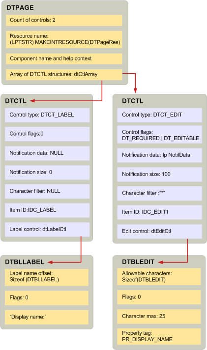

# 创建显示表和相关的结构Creating display tables and related structures
  
**适用于**： Outlook 2013 |Outlook 2016**Applies to**: Outlook 2013 | Outlook 2016 
  
创建显示表是类似于编写脚本语言的程序。Creating a display table is similar to writing a program with a scripting language. 您可以创建显示表通过调用[BuildDisplayTable](builddisplaytable.md)或编写自定义代码以填充的行和列的表。You can create a display table either by calling [BuildDisplayTable](builddisplaytable.md) or writing custom code to populate the rows and columns of the table. 一般情况下，您应使用**BuildDisplayTable**技术，因为它是简单。In general, you should use the **BuildDisplayTable** technique because it is simpler. 
  
您可以调用**BuildDisplayTable**提示 MAPI 创建显示表之前，没有的层次结构，必须建立。Before you can call **BuildDisplayTable** to prompt MAPI to create a display table, there is a hierarchy of structures that you must build. 顶级结构， [DTPAGE](dtpage.md)，描述单个选项卡式的属性页。The top-level structure, [DTPAGE](dtpage.md), describes a single tabbed property page. 在每个**DTPAGE**结构是描述单个控件，例如编辑框或选项按钮的[DTCTL](dtctl.md)结构。In every **DTPAGE** structure is a [DTCTL](dtctl.md) structure that describes a single control, such as an edit box or an option button. 每个**DTCTL**结构包含特定于控件的类型的结构。Each **DTCTL** structure contains a structure that is specific to the type of control. 例如，如果**DTCTL**结构介绍编辑框控件，它将包含**DTBLEDIT**结构。For example, if the **DTCTL** structure describes an edit box control, it will contain a **DTBLEDIT** structure. 选项按钮的**DTCTL**结构包含一个**DTBLRADIOBUTTON**结构。The **DTCTL** structure for an option button contains a **DTBLRADIOBUTTON** structure. 
  
这些结构直接相关**BuildDisplayTable**;拥有此函数的上下文之外没有意义。These structures relate directly to **BuildDisplayTable**; they have no meaning outside the context of this function. 调用**BuildDisplayTable**时，您将作为输入参数传递一个或多个**DTPAGE**结构。When you call **BuildDisplayTable**, you pass one or more **DTPAGE** structures as input parameters. **DTPAGE**结构包含数组**DTCTL**结构和**DTCTL**结构数组中的数目。The **DTPAGE** structures contain an array of **DTCTL** structures and a count of the number of **DTCTL** structures in the array. 没有要显示在对话框中每个控件的一个结构。There is one structure for every control to display in the dialog box. **DTPAGE**结构还具有一个字符字符串，表示相应的帮助文件和对话框框资源的名称。**DTPAGE** structures also have a character string that represents the name of a corresponding Help file and dialog box resource. 
  
**DTPAGE**结构中的每个**DTCTL**结构包含用于设置控件的属性的以下数据：Each **DTCTL** structure in a **DTPAGE** structure contains the following data that is used to set properties for the control: 
  
- 设置**PR_CONTROL_TYPE** ([PidTagControlType](pidtagcontroltype-canonical-property.md)) 控件类型。The control type for setting **PR_CONTROL_TYPE** ([PidTagControlType](pidtagcontroltype-canonical-property.md)).
    
- 用于设置**PR_CONTROL_FLAGS** ([PidTagControlFlags](pidtagcontrolflags-canonical-property.md)) 控制标志。Control flags for setting **PR_CONTROL_FLAGS** ([PidTagControlFlags](pidtagcontrolflags-canonical-property.md)).
    
- 通知设置**PR_CONTROL_ID** ([PidTagControlId](pidtagcontrolid-canonical-property.md)) 的数据。Notification data for setting **PR_CONTROL_ID** ([PidTagControlId](pidtagcontrolid-canonical-property.md)).
    
- 用于设置**PR_CONTROL_STRUCTURE** ([PidTagControlStructure](pidtagcontrolstructure-canonical-property.md)) 控制结构。The control structure for setting **PR_CONTROL_STRUCTURE** ([PidTagControlStructure](pidtagcontrolstructure-canonical-property.md)).
    
**DTCTL**结构还包含资源标识符以及编辑和组合框控件、 字符筛选器。**DTCTL** structures also contain a resource identifier and, for edit and combo box controls, a character filter. 
  
**DTCTL**结构的控制结构成员介绍了唯一的控件的类型的数据。The control structure member of a **DTCTL** structure describes the data that is unique for the type of control. MAPI 定义每个控件类型不同的结构。MAPI defines a different structure for each control type. 例如，编辑控件的数据表示由**DTBLEDIT**结构;由**DTBLLBX**结构表示列表框的数据。For example, the data of an edit control is represented by a **DTBLEDIT** structure; the data of a list box is represented by a **DTBLLBX** structure. 
  
下图中显示三种类型的显示表结构之间的关系。The relationship between the three types of display table structures is shown in the following illustration. 通过此显示表所述的对话框中有两个控件： 标签和编辑控件。The dialog box described by this display table has two controls: a label and an edit control. **DTBLLBX**结构有一个标签偏移的成员，如执行几个控制结构，描述标签的字符串的开始位置。The **DTBLLBX** structure has a label offset member, as do several of the control structures, that describes where the character string for the label begins. 标签字符串通常放置在紧挨结构的内存。Label character strings are typically placed in memory immediately following the structure. 
  
**显示表格结构****Display table structures**
  

  
## 另请参阅See also

- [显示表实现Display table implementation](display-table-implementation.md)

