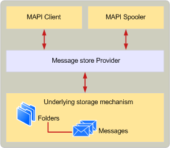

# 开发 MAPI 消息存储提供程序
  
**适用于**： Outlook 
  
与其他 MAPI 服务提供商，类似消息存储库是演示基础存储机制，MAPI 客户端应用程序和 MAPI 后台处理程序的服务的动态链接库 (Dll)。 消息存储提供程序提供了为一组分层的文件夹和 MAPI 客户端和 MAPI 后台处理程序可以使用的邮件基础存储机制。
  
下图显示了基本的 MAPI 邮件存储体系结构。
  
**消息存储体系结构**
  

  
您可以使用任何种类的您喜欢的基础存储机制来实现消息存储提供程序。 但是，您需要注意的性能问题。 此外，必须作为 MAPI 对象的分层集合显示基础存储机制。 这些要求意味着消息存储通常会使用现有数据库产品的数据库中支持的对象的分层存储和具有编程接口或定义完善文件结构的实现。 例如，Microsoft Office Access、 SQL 和 Oracle 数据库可用作基础存储机制。 某些数据库产品具有更加轻松地实现 MAPI 功能，因此您选择的数据库产品可能会影响您的消息存储提供程序需要支持的功能的功能集。
  
为您作用，因为它是通常更轻松地向 MAPI 客户端的存在数据库对象作为 MAPI 对象比若要实现您自己的分层存储机制基础存储机制保存使用现有数据库。 此操作使您能够将 MAPI 操作比如果您实现您自己的分层存储机制更高级别。 例如，搜索特定主题行消息变得相当简单空格构建和提交相应数据库查询，而不是实现复杂例程搜索分层存储机制。
  
消息存储提供程序通信使用 MAPI 客户端和 MAPI 后台处理程序，在文件夹和对象上执行操作。 消息存储提供程序将转换到基础存储机制在较低级别的操作这些操作。 MAPI 后台处理程序通常与进行通信的消息存储提供程序时发送和接收消息。 MAPI 客户端通常相互操作的文件夹层次结构和要阅读、 编辑、 删除和发送消息的消息存储提供程序。
  
与以创建新邮件的消息存储提供程序进行通信的 MAPI 后台处理程序和 MAPI 客户端。 客户端应用程序执行此操作时用户撰写邮件。 MAPI 后台处理程序执行此操作时它会接收传入消息。 在任一情况下，创建新邮件是通常的收件箱文件夹的消息存储库，如果有。
  
消息存储提供程序进行大量使用 MAPI 表、 文件夹、 邮件和属性。 这些对象的实现详细信息均编档在[MAPI 表](mapi-tables.md)、 [MAPI 文件夹](mapi-folders.md)、 [MAPI 邮件](mapi-messages.md)和[MAPI 属性概述](mapi-property-overview.md)。 您应熟悉该材料然后再尝试实现消息存储提供程序。
  
有两种重要类型的消息存储提供程序： 那些可用作用户的默认邮件存储和那些无法。 默认邮件存储区是一个客户端应用程序和 MAPI 后台处理程序可以执行任何消息任务，如接收消息或创建文件夹。 默认消息存储提供程序必须支持多个所需的所有消息存储提供程序的最小数目超过的更多功能。
  
## 另请参阅

- [MAPI 概念](mapi-concepts.md)

