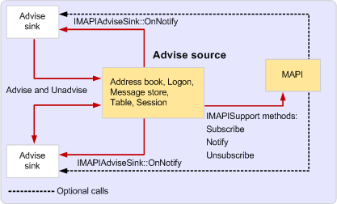

# MAPI 中的事件通知

**适用于**： Outlook 
  
事件通知是信息两个 MAPI 对象之间的通信。 通过一个对象，客户端或服务提供程序注册更改或错误，调用事件，这可能需要其他对象中的位置的通知。 在事件发生后，更改或错误的通知的第一个对象。 接收通知的对象调用通知接收器;负责通知的对象调用 advise 源。
  
有三种类型的 advise 接收器对象 （所有类型都是标准的 MAPI 对象）：
  
- 建议接收器对象。   
- 窗体建议接收器对象。  
- 查看建议接收器对象。
    
建议接收器对象是最常见的类型。 告知客户端应用程序以接收通讯簿和消息存储通知和支持通常实现接收器[IMAPIAdviseSink: IUnknown](imapiadvisesinkiunknown.md)接口。 **IMAPIAdviseSink**包含单个方法， [IMAPIAdviseSink::OnNotify](imapiadvisesink-onnotify.md)。 表单和视图告知接收器并不常见;实现这些接收有关自定义窗体的更改的通知。 窗体告知接收器支持[IMAPIFormAdviseSink: IUnknown](imapiformadvisesinkiunknown.md)接口和视图告知接收器支持[IMAPIViewAdviseSink: IUnknown](imapiviewadvisesinkiunknown.md)接口。 因为大多数客户端实现标准告知接收器对象，则假定的通知的讨论与通讯簿和消息存储通知，而不是窗体通知。 有关表单通知的详细信息，请参阅[MAPI 表单通知](mapi-forms-notifications.md)和[编写窗体服务器代码](writing-form-server-code.md)。
  
建议您按服务提供商和 MAPI 实现对象的源。 并非所有服务提供商都支持事件通知;它是可选的但强烈建议。 消息存储和地址簿提供程序通常支持对象通知的多个对象及其在其内容和层次结构表的表通知。 传输提供程序不支持通知直接;他们依赖于与客户端通信的备用方法。
  
与 advise 接收器不同建议源对象不是唯一的 MAPI 对象类型。 许多 MAPI 对象，如消息存储和表，都可以承担 advise 源的角色。 Advise 源是执行以下任何 MAPI 对象：
  
- 实现**Advise**方法，以接收通知注册。 
    
- 实现**Unadvise**方法，以接收通知取消。 
    
- 生成已注册的调用其**IMAPIAdviseSink::OnNotify**方法的相应 advise 接收器对象的相应类型的通知。 
    
实施客户端告知接收器对象调用**Advise**时所需的通知，在大多数情况下传递中与应进行注册的对象和**Unadvise**的项标识符，当他们想要取消注册注册。 客户端将参数传递给**Advise** ，它指示要监视的事件的多个类型。 **Advise**返回非零值，该值代表通知接收器和 advise 源之间的成功连接。 
  
调用**Advise**之前，客户端可以确定消息存储提供程序是否支持通过检查 STORE_NOTIFY_OK 标志设置中的消息存储**PR_STORE_SUPPORT_MASK** ([PidTagStoreSupportMask](pidtagstoresupportmask-canonical-property.md)) 的通知属性。 没有方法为客户端提早制定确定通讯簿提供程序支持通知。 客户端必须成功注册时，如果尝试失败，他们可以假定通知不受支持。
  
客户端已为其注册事件发生时，advise 源通过调用[IMAPIAdviseSink::OnNotify](imapiadvisesink-onnotify.md)方法与通知数据结构包含有关事件的信息通知通知接收器。 通知接收器实现**OnNotify**可以对通知，例如更新内存中的数据或刷新屏幕显示的响应中执行任务。 
  
服务提供商可以手动实现对通知的支持或利用三种**IMAPISupport**方法中提供的帮助： [IMAPISupport::Subscribe](imapisupport-subscribe.md)、 [IMAPISupport::Unsubscribe](imapisupport-unsubscribe.md)和[IMAPISupport::Notify](imapisupport-notify.md). **Subscribe**和**Unsubscribe**方法处理通知注册和取消注册的提供程序;**Notify**方法处理时适当的发送通知。 
  
要支持对象方法用于通知注册，服务提供商[IMAPISupport::Subscribe](imapisupport-subscribe.md)呼入其**Advise**方法并传递给**Subscribe**客户端将传递给**Advise**advise 接收器指针。 条目标识符作为输入参数指定 advise 源传递，如果服务提供商将其转换为二进制密钥。 **订阅**创建唯一的连接数，返回到客户端的服务提供此号码。 服务提供商可以释放客户端的任何时候完成**Advise**呼叫后建议接收器对象指针。 
  
当客户端调用**Unadvise**取消注册服务提供商任一客户端的引用计数的递减告知接收器指针或呼叫**取消**执行相同。 
  
生成通知的时间时，服务提供商执行任何内部处理与通知并初始化[通知](notification.md)结构通过将所有未使用成员设置为零。 此方法用于初始化**通知**结构可帮助更快，并减少出错**OnNotify**实现创建较短的客户端。 
  
下图显示之间的通信告知接收器对象，告知源对象和 MAPI。 MAPI 时所涉及的仅 advise 源通知支持呼叫**IMAPISupport**方法。 
  
**事件通知调用**
  

  
（使用的 AdviseSink.h 和 AdviseSink.cpp 文件） 的 MFCMAPI **CAdviseSink**类实现所有呼叫**Advise**advise 接收器的对象。 有关 MFCMAPI 的详细信息，请参阅[MFCMAPI 用作代码示例](mfcmapi-as-a-code-sample.md)和[MFCMAPI](http://go.microsoft.com/fwlink/?LinkId=124154)。
  

