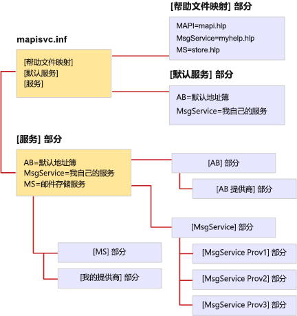

# MapiSvc.inf 文件格式File format of MapiSvc.inf

**适用于**： Outlook 2013 |Outlook 2016**Applies to**: Outlook 2013 | Outlook 2016 
  
MapiSvc.inf 文件作为中央数据库的 MAPI 邮件服务配置信息。The MapiSvc.inf file acts as the central database for MAPI message service configuration information. MapiSvc.inf 包含有关每个工作站、 属于每个邮件服务，服务提供程序的信息和信息的 MAPI 子系统上安装的消息服务的信息。MapiSvc.inf contains information about each of the message services installed on the workstation, information about the service providers that belong to each message service, and information about the MAPI subsystem. MapiSvc.inf 是主要的配置文件信息来源。MapiSvc.inf is the primary source of information for profiles. 即一个新的配置文件生成时或一个现有的修改，为每个消息服务的相关信息或从 MapiSvc.inf 复制服务提供商。That is, when a new profile is being built or an existing one modified, relevant information for each message service or service provider is copied from MapiSvc.inf. 
  
MapiSvc.inf 分为链接的分层部分：MapiSvc.inf is divided into linked hierarchical sections:
  
1. 包含应用于所有配置文件信息的部分。Section containing information that applies to all profiles. 本部分包含三个部分：This section has three parts:
    
   - **[服务]** 部分中，提供服务节的每个后续的消息的链接。**[Services]** section, providing links to each of the subsequent message service sections. 
    
   - **[帮助文件映射]** 部分中，包含有关的信息。HLP 提供消息服务的文件。**[Help File Mappings]** section, containing information about .HLP files provided by message services. 
    
   - **[默认服务]** 部分中，列出组成的默认安装的消息服务。**[Default Services]** section, listing message services that make up a default installation. 
    
2. 部分包含适用于单个消息服务的信息。Section containing information that applies to individual message services. 以下各节中的条目提供了指向后续服务提供程序部分。Entries in these sections provide links to subsequent service provider sections.
    
3. 包含应用于邮件服务中的单个服务提供商的信息的部分。Section containing information that applies to individual service providers in a message service.
    
下图显示了典型的 MapiSvc.inf 文件组织。The following illustration shows the organization of a typical MapiSvc.inf file. 有三种消息服务： AB、 MsgService 和毫秒。There are three message services: AB, MsgService, and MS. 为每个邮件服务上等号的右侧的名称是该服务的显示名称。The name on the right hand side of the equal sign for each message service is the service's display name. 每个消息服务都链接到一个或多个服务提供程序部分文件中其他位置有自己部分。Each message service has its own section elsewhere in the file that is linked to one or more service provider sections. 没有为每个属于邮件服务的服务提供程序的一个服务提供程序部分。There is one service provider section for every service provider that belongs to the message service. AB 和 MS 消息服务是单个提供服务而三种服务提供商属于 MsgService 服务。The AB and MS message services are single provider services whereas three service providers belong to the MsgService service.
  
**MapiSvc.inf 文件组织****MapiSvc.inf file organization**
  

  
MAPI 提供了包含 MAPI 子系统条目的 MapiSvc.inf 文件的基本版本。MAPI provides a skeletal version of the MapiSvc.inf file that contains the entries for the MAPI subsystem. 每个邮件服务实施添加适合其服务和属于其服务的服务提供商的项。Each message service implementer adds entries that are appropriate both for their service and the service providers that belong to their service. 可选其他人时，某些条目是必需的。Some of the entries are required while others are optional. 例如，MAPI 需要邮件服务中指定的名称和每个服务提供商的路径。For example, MAPI requires that you specify the name and path of each of the service providers in your message service. 如果没有此信息，它们无法加载。Without this information, they cannot be loaded.
  
为消息服务和/或服务提供程序部分，您可以在任一部分添加必需的和可选的信息。You can add required and optional information in either the section for your message service and/or to the service provider sections. 放置描述您的消息服务的信息取决于服务中的服务提供程序的数目。Where you put the information describing your message service depends on the number of service providers in the service. 因为此信息适用于每个服务中的服务提供程序，则必须进行访问的所有提供程序。Because this information applies to each service provider in the service, you must make it accessible to all providers. 在邮件服务部分，首选项，或所有服务提供程序部分中，则将其存储。Store it either in the message service section, the preferred option, or in all of the service provider sections. 若要避免不必要的复制和需要保留多个副本同步后存储信息。Store information once to avoid unnecessary replication and the need to keep multiple copies synchronized.
  
如果您的消息服务，单个提供程序服务存储的所有消息服务信息的服务提供程序部分中，而不是在服务部分。If your message service is a single provider service, store all of the message service information in the section for the service provider rather than in the section for the service. 访问服务提供程序部分是更快、 更直接比访问消息服务部分。Accessing the service provider section is faster and more direct than accessing the message service section. 
  
MapiSvc.inf 文件中存储仅公共配置数据。Store only public configuration data in the MapiSvc.inf file. 信息的私人或需要额外的保护，如密码或其他凭据，不应包含在此文件。Information that is private or requires extra protection, such as passwords or other credentials, should not be included in this file. 相反，还可以选择不以根本存储此类型的信息，或者将其配置文件中作为安全属性。Instead, opt either not to store information of this type at all or keep it in the profile as secure properties. 安全属性具有内置的保护功能，如加密。Secure properties have built-in protection features such as encryption.
  

