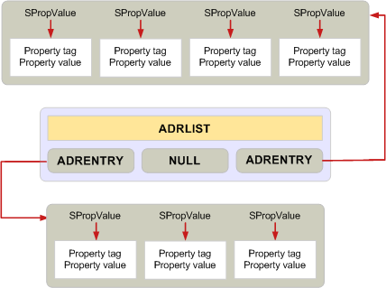

# 管理内存 ADRLIST 和 SRowSet 结构"Managing memory for ADRLIST and SRowSet structures"

**适用于**： Outlook 2013 |Outlook 2016**Applies to**: Outlook 2013 | Outlook 2016 
  
为尽可能使用单个**MAPIAllocateBuffer**呼叫缓冲区分配所有内存要求不适用于时使用的地址列表中或**ADRLIST**，和行集或**SRowSet**，结构。The requirement to allocate all memory for a buffer whenever possible with a single **MAPIAllocateBuffer** call does not apply when using the address list, or **ADRLIST**, and row set, or **SRowSet**, structures. 
  
以下两个结构是分配和释放内存的标准规则例外。These two structures are exceptions to the standard rules for allocating and releasing memory. 它们包含多个层次结构的旨在使单个成员都能添加或删除。They contain multiple levels of structures and are designed to enable individual members to be added or removed. 因此，每个属性必须单独分配。Therefore, each property must be a separate allocation. 

其中大多数结构释放调用一次**MAPIFreeBuffer**，每个**ADRLIST**或**SRowSet**结构中的各个条目，必须释放自己调用**MAPIFreeBuffer**或单个调用**FreeProws**或**FreePadrlist**。Where most structures are freed with one call to **MAPIFreeBuffer**, each individual entry in an **ADRLIST** or **SRowSet** structure must be freed with its own call to **MAPIFreeBuffer** or a single call to either **FreeProws** or **FreePadrlist**. 有关详细信息，请参阅[MAPIFreeBuffer](mapifreebuffer.md)、 [ADRLIST](adrlist.md)和[SRowSet](srowset.md)。For more information, see [MAPIFreeBuffer](mapifreebuffer.md), [ADRLIST](adrlist.md), and [SRowSet](srowset.md). 

**FreeProws**和**FreePadrlist**是由 MAPI 提供的用于简化这些数据结构释放的功能。**FreeProws** and **FreePadrlist** are functions provided by MAPI for simplifying the freeing of these data structures. 有关详细信息，请参阅[FreeProws](freeprows.md)和[FreePadrlist](freepadrlist.md)。For more information, see [FreeProws](freeprows.md) and [FreePadrlist](freepadrlist.md). **FreePadrlist**释放**ADRLIST**结构内存以及所有关联的结构成员; 内存**FreeProws**执行相同的**SRowSet**结构。**FreePadrlist** frees the memory for the **ADRLIST** structure plus all associated memory for the structure members; **FreeProws** does the same for the **SRowSet** structure. 
  
下图显示了指示所需的单独的内存分配**ADRLIST**数据结构的布局。The following diagram shows the layout of an **ADRLIST** data structure, indicating the separate memory allocations required. 灰色框中显示可以分配和释放调用一次使用的内存。The gray boxes show memory that can be allocated and released with one call. 
  
**ADRLIST 内存分配****ADRLIST memory allocation**
  

  
## 另请参阅See also

- [管理 MAPI 中的内存Managing Memory in MAPI](managing-memory-in-mapi.md)

