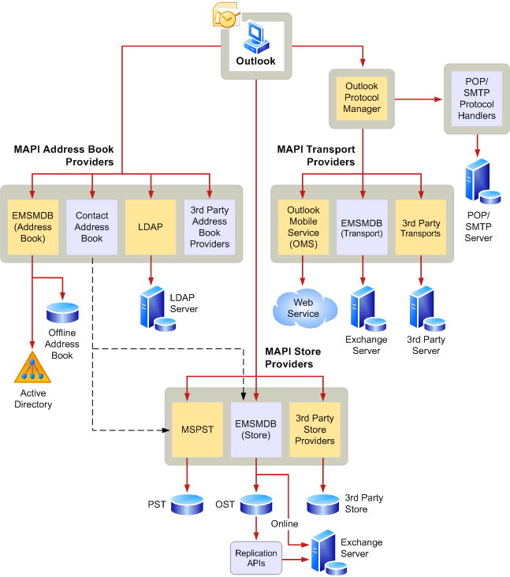

# MAPI 体系结构概述MAPI architecture overview
 
**适用于**：Outlook 2013 | Outlook 2016**Applies to**: Outlook 2013 | Outlook 2016 
  
MAPI 定义了模块化体系结构, 如下图所示。MAPI defines a modular architecture, as shown in the following illustration.  
  

  
mapi 应用程序称为客户端应用程序, 因为它是 mapi 子系统的客户端。The MAPI application is known as a client application because it is a client of the MAPI subsystem. 基于邮件的应用程序将消息传递作为其处理的中心部分, 并提供广泛的邮件功能, 如各种格式的信息交换, 以及在本地保存和组织信息的能力。Messaging-based applications employ messaging as a central part of their processing and offer extensive messaging features, such as the exchange of information of various types in various formats and the ability to save and organize the information locally. 电子邮件、调度和工作流应用程序是基于邮件的应用程序的示例。Email, scheduling, and work flow applications are examples of messaging-based applications.
  
MAPI 子系统由通用用户界面和编程接口组成。The MAPI subsystem is made up of a common user interface and the programming interfaces. 公共用户界面是一组对话框, 为客户端应用程序提供一致的外观和用户一种一致的工作方式。The common user interface is a set of dialog boxes that gives client applications a consistent look and users a consistent way to work.
  
mapi 具有由 MAPI 子系统、客户端软件开发人员和服务提供商开发人员使用的编程接口。MAPI has programming interfaces that are used by the MAPI subsystem, by client software developers, and by service provider developers. MAPI 编程接口是基于对象的主要编程接口。The MAPI programming interface is the main object-based programming interface. mapi 编程接口类似于 OLE 组件对象模型, 由 mapi 子系统和以 c 或 c + + 编写的基于邮件的客户端应用程序使用。The MAPI programming interface is similar to the OLE Component Object Model and is used by the MAPI subsystem and messaging-based client applications written in C or C++. 
  
作为客户端软件开发人员, 您可以直接通过 mapi 编程接口进行 mapi 调用。As a client software developer, you make MAPI calls directly through the MAPI programming interface. 您可以使用单个 MAPI 客户端接口或接口组合来实现邮件传递。You can implement messaging with a single MAPI client interface or a combination of interfaces. 单个应用程序可以调用属于任何接口的方法或函数。A single application can make calls to methods or functions belonging to any of the interfaces.
  
## 另请参阅See also

-[MAPI 功能和体系结构](mapi-features-and-architecture.md)-[MAPI features and architecture](mapi-features-and-architecture.md)

