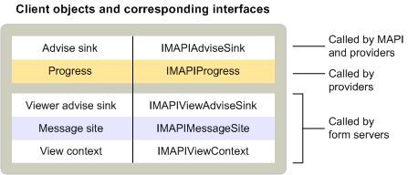

# MAPI 客户端对象MAPI client objects
  
**适用于**：Outlook 2013 | Outlook 2016**Applies to**: Outlook 2013 | Outlook 2016 
  
标准邮件客户端应用程序仅实现一个对象 (即通知接收器)。Standard messaging client applications implement only one object — an advise sink. 通知接收器继承自[IMAPIAdviseSink: IUnknown](imapiadvisesinkiunknown.md)接口, 由 MAPI 和服务提供商用于事件通知。Advise sinks inherit from the [IMAPIAdviseSink : IUnknown](imapiadvisesinkiunknown.md) interface and are used by MAPI and service providers for event notification. 某些客户端也会实施进度对象, 以支持显示进度对话框。Some clients also implement progress objects to support the display of progress dialog boxes. 
  
支持自定义窗体的更复杂的客户端可实现另一个通知接收器对象和一些其他对象, 例如从[IMAPIMessageSite: IUnknown](imapimessagesiteiunknown.md)接口继承的邮件网站对象, 以及从继承自的视图上下文对象[IMAPIViewContext: IUnknown](imapiviewcontextiunknown.md)接口。More complex clients that support custom forms implement another advise sink object and a few other objects, such as the message site object that inherits from the [IMAPIMessageSite : IUnknown](imapimessagesiteiunknown.md) interface and the view context object that inherits from the [IMAPIViewContext : IUnknown](imapiviewcontextiunknown.md) interface. 附加的建议接收器对象继承自[IMAPIViewAdviseSink: IUnknown](imapiviewadvisesinkiunknown.md)接口。The additional advise sink object inherits from the [IMAPIViewAdviseSink : IUnknown](imapiviewadvisesinkiunknown.md) interface. 
  
下表汇总了由标准邮件客户端和支持查看自定义窗体的客户端所实现的 MAPI 对象。The following table summarizes the MAPI objects implemented by standard messaging clients and by clients that support the viewing of custom forms.
  
|**客户端对象****Client object**|**说明****Description**|
|:-----|:-----|
|通知接收器Advise sink    |提供用于在邮件存储区、通讯簿或会话中发生的事件的回调函数。Provides a callback function for events that occur in the message store, address book, or the session.    |
|消息网站Message site    |处理对 form 对象的操作。Handles the manipulation of form objects.    |
|ProgressProgress    |显示用于显示操作进度的对话框。Displays a dialog box to show the progress of an operation.    |
|查看建议接收器View advise sink    |为表单中发生的事件提供回调函数。Provides callback functions for events that occur in a form.    |
|查看上下文View context    |支持用于打印和保存窗体以及在窗体之间导航的命令。Supports commands for printing and saving forms and for navigating between forms.    |
   
下图显示了这些不同客户端对象之间的关系、它们继承的接口以及使用这些对象的 MAPI 组件。The following illustration shows the relationship between these different client objects, the interfaces from which they inherit, and the MAPI components that use them. 
  

  
客户端使用的对象数多于它们实现的对象数。Clients use many more objects than they implement. 所有客户端都使用 session 对象访问 MAPI 实现的各种服务提供程序对象和对象。All clients use a session object to gain access to a wide variety of service provider objects and objects that MAPI implements. 客户端可以通过会话、通讯簿或 MAPI 提供的 status 对象间接与服务提供程序交互, 也可以直接通过特定服务提供程序实现的各种对象进行交互。Clients interact with service providers either indirectly, through the session, the address book, or the status objects that MAPI supplies, or directly through a variety of objects that particular service providers implement. 若要与通讯簿提供商建立直接联系, 客户可以使用通讯簿容器、邮件用户和通讯组列表。To make direct contact with address book providers, clients use address book containers, messaging users, and distribution lists. 若要直接访问邮件存储区提供程序, 客户端需要使用邮件存储对象、文件夹、邮件和附件。To access a message store provider directly, clients use the message store object, folders, messages, and attachments. 当服务提供商支持状态对象时, 客户端可以使用 status 对象监视服务提供程序的状态。When service providers support a status object, clients can use the status object to monitor the service provider's state.
  
支持服务提供程序和邮件服务配置的客户端使用 MAPI 实现的三个对象: 邮件服务管理对象、配置文件管理对象和提供程序管理对象。Clients that support service provider and message service configuration use three objects that MAPI implements: the message service administration object, profile administration object, and provider administration object. 显示自定义窗体的客户端使用表单库提供程序或表单服务器实现的多个表单对象。Clients that display custom forms use several form objects that a form library provider or a form server implements.
  
## 另请参阅See also

- [IMAPIMessageSite : IUnknownIMAPIMessageSite : IUnknown](imapimessagesiteiunknown.md) 
- [IMAPIViewContext : IUnknownIMAPIViewContext : IUnknown](imapiviewcontextiunknown.md)  
- [IMAPIViewAdviseSink : IUnknownIMAPIViewAdviseSink : IUnknown](imapiviewadvisesinkiunknown.md)
- [MAPI 对象和接口概述MAPI Object and Interface Overview](mapi-object-and-interface-overview.md)

