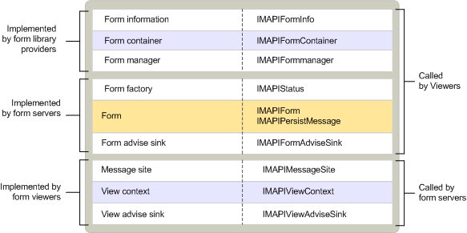

# MAPI 自定义窗体对象
  
**适用于**： Outlook 
  
自定义窗体对象是由三个不同组件实现：
  
- 窗体服务器。
    
- 窗体库提供程序。
    
- 表单查看器。
    
窗体服务器与 OLE 复合文档对象应用程序功能类似。 它是实现窗体; 可执行组件它控制其显示和用户可以执行的操作。 当用户想要查看使用窗体的窗体服务器支持显示邮件类别以及一条消息，则 MAPI 启动根据请求的窗体服务器。 窗体服务器实现三个对象： 窗体中心对象类似于标准的 OLE 类工厂，窗体告知接收器用于处理特定于窗体的事件和窗体本身。 
  
表单库提供程序提供访问的客户端到窗体的属性集、 其容器和链接到的服务器，可以打开该类的窗体的邮件的特定类的对象。 窗体库提供程序实现三个对象： 窗体信息对象、 窗体容器和窗体管理器将一条消息，绑定到基于消息的类的相应窗体服务器。
  
表单查看器是在其文件夹查看器中支持的自定义窗体显示的客户端中包含的组件。 表单查看器不独立 MAPI 组件，如是窗体库提供程序和窗体服务器。 表单查看器启动窗体服务器，并为其提供上下文。 表单查看器实现以下三个对象： 消息网站、 了视图上下文和用于处理特定于视图的事件通知接收器。
  
下表介绍的所有自定义窗体对象。 
  
|**Form 对象**|**说明**|
|:-----|:-----|
|窗体    |控件的显示和查看邮件的特定类的自定义窗体的操作。    |
|窗体告知接收器    |处理从窗体查看器的通知。    |
|窗体工厂    |创建窗体的实例，并允许其在内存中保留的服务器。    |
|窗体容器    |包含表单的信息。    |
|窗体信息    |包含消息以及其他消息容器。    |
|窗体管理器    |提供对集成视图与所有安装的表单的自定义窗体信息的访问。 此外将匹配相应窗体类标识符具有邮件类。    |
|消息网站    |处理的操作的内部客户端，从表单对象，并提供对窗体管理器对象的访问。    |
|视图上下文    |支持窗体命令激活下一个和上一个消息和保存或打印。    |
|查看建议接收器    |处理从窗体服务器的通知。    |
   
下图显示自定义表单组件、 对象和它们可实现的接口和对象的用户的组件之间的关系。 请注意，与大多数其他 MAPI 对象，该窗体对象实现通过直接继承不相关的两个接口。 对象公开了多个独立的接口，具有到一个接口的指针的对象的用户可以检索到的任何其他接口的指针。 导航之间对象的接口实现此功能是一项功能的[IUnknown::QueryInterface](http://msdn.microsoft.com/library/54d5ff80-18db-43f2-b636-f93ac053146d%28Office.15%29.aspx)方法。 
  
**自定义表单组件**
  

  
## 另请参阅

- [MAPI 对象和接口概述](mapi-object-and-interface-overview.md)

