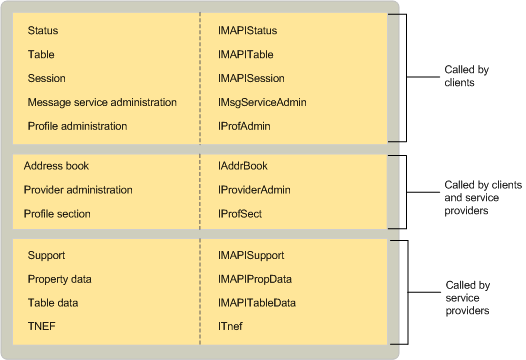

# MAPI 实现的对象MAPI-implemented objects
  
**适用于**： Outlook**Applies to**: Outlook 
  
MAPI 实现供客户端应用程序和服务提供商使用的多个对象。MAPI implements several objects for use by client applications and service providers. 会话对象允许客户端用于会话服务，以访问表，以及与服务提供商进行通信。The session object allows clients to use session services, to access tables, and to communicate with service providers. 通讯簿对象提供对不同的地址簿提供程序的所有客户端集成的访问。The address book object provides clients with integrated access to all of the different address book providers. 
  
MAPI 提供客户端，用于查看和监视会话和服务提供程序信息的多个表和状态的对象。MAPI supplies multiple table and status objects for clients to use for viewing and monitoring session and service provider information. 例如，MAPI 提供了有关所有计算机安装的配置文件信息与配置文件表和消息服务表与有关当前配置文件中的消息服务的所有信息。For example, MAPI provides a profile table with information about all of the profiles that are installed on the computer and a message service table with information about all of the message services in the current profile. MAPI 提供了三个不同的状态对象： 一个值，该值代表总体子系统，一个用于 MAPI 后台处理程序，，一个用于集成的通讯簿。MAPI provides three different status objects: one that represents the overall subsystem, one for the MAPI spooler, and one for the integrated address book. 
  
MAPI 实现用于管理的消息服务、 服务提供商和配置文件配置的四个不同对象。MAPI implements four different objects for managing the configuration of message services, service providers, and profiles. 客户端和服务提供商使用提供程序管理和 profile section 对象;这些对象使用户能够配置服务提供商和访问配置文件属性。Both clients and service providers use provider administration and profile section objects; these objects enable them to configure service providers and access profile properties. 客户端使用仅消息服务和配置文件管理对象，支持管理消息服务和配置文件的对象。Clients use only message service and profile administration objects, the objects that support the administration of message services and profiles. 
  
MAPI 服务提供程序提供了两个对象： 支持对象和 TNEF 对象。MAPI provides two objects for service providers: a support object and a TNEF object. 所有服务提供商都使用一个或多个支持对象;有四个不同的支持对象实现。All service providers use one or more support objects; there are four different support object implementations. MAPI 提供实现以支持配置以及特定的实现，以支持通讯簿、 消息存储和传输提供程序。MAPI supplies an implementation to support configuration as well as specific implementations to support address book, message store, and transport providers. 传输提供程序支持传输中性封装格式 (TNEF) 使用 TNEF 对象。The TNEF object is used by transport providers that support the Transport Neutral Encapsulation Format (TNEF).
  
两个实用程序对象、 表格数据和属性数据通常由服务提供商使用。Two utility objects, table data and property data, are typically used by service providers. 表格数据对象中的 table 对象; 实现帮助属性集和视图属性访问和帮助实现中的数据对象帮助[IMAPIProp: IUnknown](imapipropiunknown.md)，基属性接口。Table data objects help in the implementation of table objects; property data objects help to set and view property access and help in the implementation of [IMAPIProp : IUnknown](imapipropiunknown.md), the base property interface. 
  
下表总结了 MAPI 实现的每个对象的目的。The following table summarizes the purpose for each object that MAPI implements.
  
|**MAPI 对象****MAPI object**|**说明****Description**|
|:-----|:-----|
|通讯簿Address book    |提供对综合视图所属的通讯簿提供程序的活动配置文件中所有的收件人信息的访问。Provides access to the integrated view of recipient information that belongs to all of the address book providers in the active profile.    |
|消息 service 管理Message service administration    |提供对邮件服务信息配置的访问。Provides access to message service information for configuration.    |
|配置文件管理Profile administration    |提供用于配置对配置文件信息的访问。Provides access to profile information for configuration.    |
|配置文件节Profile section    |用来描述一个特定消息服务或服务提供程序配置文件的一部分。A part of a profile used to describe a particular message service or service provider.    |
|属性数据Property data    |维护对属性的访问，并帮助实现**IMAPIProp**。Maintains access to properties and helps implement **IMAPIProp**.    |
|提供程序管理Provider administration    |提供对配置访问服务提供商信息。Provides access to service provider information for configuration.    |
|会话Session    |代表与基础邮件系统的连接和客户端提供对 MAPI 资源的访问。Represents a connection to underlying messaging systems and provides clients with access to MAPI resources.    |
|StatusStatus    |提供对 MAPI 子系统、 通讯簿中或 MAPI 后台处理程序的状态的访问。Provides access to the state of the MAPI subsystem, the address book, or the MAPI spooler.    |
|支持Support    |可帮助处理客户端请求的服务提供商。Helps service providers handle client requests.    |
|TableTable    |提供对行和列的格式，类似于数据库表中的对象数据的摘要视图访问。Provides access to a summary view of object data in row and column format, similar to a database table.    |
|表数据Table data    |维护到基础表数据的访问，并实现 table 对象。Maintains access to underlying table data and implements table objects.    |
|TNEFTNEF    |支持使用的传输中性封装格式 (TNEF)。Supports the use of the Transport Neutral Encapsulation Format (TNEF).    |
   
下图显示 MAPI 实现的对象、 它们继承的接口和使用这些组件之间的关系。The following illustration shows the relationship between the objects that MAPI implements, the interfaces from which they inherit, and the components that use them. 
  
**MAPI 实现的对象****Objects that MAPI implements**
  

  
## 另请参阅See also

- [IMAPIProp : IUnknownIMAPIProp : IUnknown](imapipropiunknown.md)
- [MAPI 对象和接口概述MAPI Object and Interface Overview](mapi-object-and-interface-overview.md)

