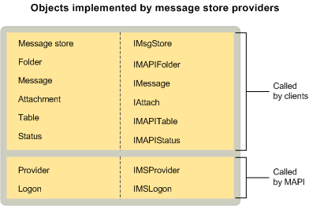

# MAPI 邮件存储提供程序对象MAPI message store provider objects
  
**适用于**：Outlook 2013 | Outlook 2016**Applies to**: Outlook 2013 | Outlook 2016 
  
邮件存储提供程序实现提供程序和登录对象, 就像所有服务提供程序一样。Message store providers implement provider and logon objects, as do all service providers. 它们还实现了邮件存储对象、文件夹、邮件、附件和表。They also implement a message store object, folders, messages, attachments, and tables. 作为选项, 某些邮件存储提供程序实现 status 对象。As an option, some message store providers implement status objects.
  
下图显示了每个邮件存储对象及其对应的接口以及使用它的 MAPI 组件。The following illustration shows each message store object with its corresponding interface and the MAPI component that uses it.
  

  
## 另请参阅See also

- [MAPI 服务提供程序对象MAPI Service Provider Objects](mapi-service-provider-objects.md)

