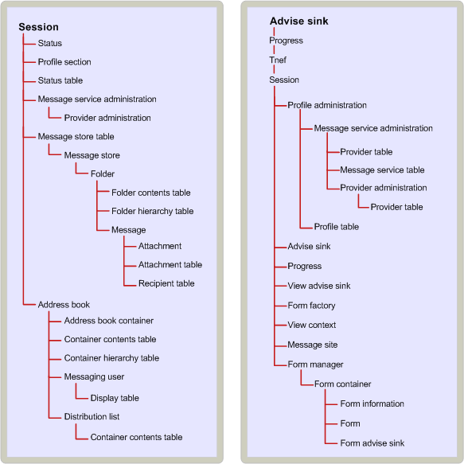

# MAPI 对象包容层次结构
  
**适用于**： Outlook 2013 |Outlook 2016 
  
对象之间的内嵌关系指定具有访问的其他对象的某些对象的依赖关系。 客户端应用程序特定的对象的访问启用向其他人的访问。 在某些情况下，由服务提供商实现的对象的内嵌关系遵循逻辑层次结构。 在其他情况下，它是任意的。 
  
可以使用多个其他对象 （例如，服务提供商和 MAPI 通讯簿） 之前，客户端必须获取 MAPI 会话对象的访问权。
  
消息存储包容基于消息存储区中的对象之间的分层关系： 消息存储对象本身、 文件夹、 邮件和附件。 逻辑上，在文件夹和邮件存储区中的文件夹中的邮件的邮件包含附件。 内嵌关系匹配此逻辑层次结构。 若要访问一条消息，例如，客户端必须首先访问在其中包含邮件文件夹。 配置文件和状态对象是更任意包容关系的示例。 两个对象可通过会话。 
  
与某些对象，容器提供唯一的访问。 附件和收件人是完全取决于其容器的对象的示例。 仅访问附件或收件人是通过其所属的消息。 其他对象具有备用访问路径。 这些对象分配二进制标识符，称为由服务提供程序创建它们的项标识符。 条目标识符可直接访问其对象启用绕过包容树的客户端。 
  
下图显示了 MAPI 包容层次结构。 会话已树的顶部，因为它是通过会话客户端获得访问所有其他对象。 下一步级别包括消息存储表，table 对象，在当前会话和通讯簿提供访问通讯簿提供程序的所有消息存储提供程序的所有列出的属性。 消息存储表和地址簿用于访问显示下一步，包容顺序的特定服务提供程序实现的对象。
  
**MAPI 包容层次结构**
  

  
## 另请参阅

- [MAPI 对象和接口概述](mapi-object-and-interface-overview.md)

