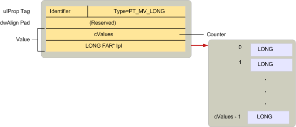

# MAPI 属性类型概述
  
**适用于**： Outlook 
  
属性类型都是通过 MAPI MAPIDEFS 中定义的常量。指示属性值的基础数据类型的 H 头文件。 所有属性，通过 MAPI、 客户端应用程序或服务提供商定义它们是否都使用这些类型之一。 
  
属性类型是用于属性标记为按照类似的命名约定。 许多属性类型具有一个单值和多值版本。 单值的属性包含一个其类型如单个整数或字符的字符串值。 常量，用于表示的单值属性包含两个部分： 前缀 PT_ 和描述的实际类型，如 LONG 或 STRING8 的字符串。 
  
多值属性包含多个与其类型的值。 与 OLE variant 数组，不同多值属性中的每个值都属于同一字段类型。 通过将 MV_FLAG 标志组合与相应的单个值常量表示的基类型创建常量，用于表示多值的属性。 有三个部分： 前缀 PT_ 跟 MV_ 后跟描述类型的字符串。 例如，包含多个包含整数的属性的类型是 PT_MV_LONG，针对多个字符串 PT_MV_STRING8。
  
下图显示了[SPropValue](spropvalue.md)结构来描述的多值整数，PT_MV_LONG 类型的属性的结构。 展开**值**成员时要包含的属性和一个指向这些值的数组中的整数值的数目。 
  
**多值属性**
  

  
尽管支持多值属性是可选的 MAPI 建议的客户端和服务提供商支持两种类型的属性因为执行操作是允许更大 MAPI 兼容的组件之间的交互。
  
下图列出所有显示它们**SPropValue**结构中的存储位置的不同的属性类型常量。 取决于特定类型的**值**成员的大小。 注意，不是所有的单值类型有多个值的等效项。 
  
**属性类型常量**
  

  
客户端和使用属性的服务提供商需要执行两个步骤：
  
1. 确定属性是否可用或不可用。
    
2. 如果可供，检索该属性的值。
    
有时客户端或服务提供程序只需要检查存在属性;其他需要的特定值检查的时间。 例如，传输提供程序必须处理的操作的三个不同的课程**PR\_SEND_RICH_INFO** ([PidTagSendRichInfo](pidtagsendrichinfo-canonical-property.md)) 属性，一个布尔值，该值指示是否应与传输邮件带格式的文本。 如果**PR\_SEND_RICH_INFO**是设置为 TRUE，传输提供程序发送带格式的文本。 如果设置为 FALSE，传输前的格式化的文本将被丢弃。 传输提供程序如果**PR_SEND_RICH_INFO**不可用，即遵循其默认采取的操作，任何特定提供程序。 
  
MAPI 定义的特殊属性类型，PT_UNSPECIFIED，客户端或服务提供程序可用于检索属性时的属性类型是未知。若要检索其类型的高级不知情的情况下一个属性，客户端或服务提供程序调用对象的[IMAPIProp::GetProps](imapiprop-getprops.md)方法，并传递该属性的标识符和 PT_UNSPECIFIED 属性类型组成的属性标记。 **GetProps**返回为属性[SPropValue](spropvalue.md)结构 PT_UNSPECIFIED 替换为相应的类型。 支持 PT_UNSPECIFIED 所需服务提供商实现**GetProps** 。 
  
某些 MAPI 对象支持属性的对象。 对象属性具有 PT_OBJECT 的类型。 而不是使用**IMAPIProp::GetProps**通常访问这些属性、 客户端和服务提供商用户的[IMAPIProp::OpenProperty](imapiprop-openproperty.md)方法在对象上指定相应的接口访问，或方法支持的属性。 
  
因为访问对象属性的值涉及使用的接口之一对象， **GetProps**不正确。 与**GetProps**，呼叫者通过**SPropValue**结构访问属性的值。 使用**IMAPIProp::OpenProperty**，呼叫者会检索可以访问的对象的接口的指针。 **OpenProperty**始终可用于检索的对象属性。 其他选项，该对象，调用方法不可用与每个对象属性。 
  
例如，每个文件夹支持两个表、 层次结构表和内容表。 这些表是属性文件夹中。其属性标记为**PR_CONTAINER_HIERARCHY** ([PidTagContainerHierarchy](pidtagcontainerhierarchy-canonical-property.md)) 和**PR_CONTAINER_CONTENTS** ([PidTagContainerContents](pidtagcontainercontents-canonical-property.md))。 表是需要访问**IMAPITable**接口的对象。 客户端可以调用该文件夹的[IMAPIContainer::GetHierarchyTable](imapicontainer-gethierarchytable.md)方法来访问层次结构表，该文件夹的[IMAPIContainer::GetContentsTable](imapicontainer-getcontentstable.md)方法可访问的内容表或该文件夹的[IMAPIProp::OpenProperty](imapiprop-openproperty.md)方法来访问任意一个表。 若要调用**OpenProperty**，客户端将作为第一个参数和接口标识符的接口，用于访问作为第二个参数传递属性的属性标记。 这些参数将为**PR_CONTAINER_HIERARCHY**或**PR_CONTAINER_CONTENTS**和**IID_IMAPITable**。
  
单值和多值属性类型的完整列表，请参阅[属性类型](property-types.md)。 
  
## 另请参阅

- [MAPI 属性概述](mapi-property-overview.md)

