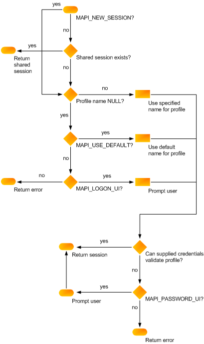

# MAPI 会话MAPI sessions

**适用于**： Outlook**Applies to**: Outlook 
  
客户端应用程序可以调用基础的消息系统之前，它必须建立一个会话或连接，与 MAPI 子系统。Before the client application can call an underlying messaging system, it must establish a session, or connection, with the MAPI subsystem.
  
用户登录后访问有效的配置文件，并验证邮件系统和消息服务凭据的过程启动会话。Sessions are initiated when a user logs on, a process that accesses a valid profile and validates the messaging system and the message service credentials. 然后，此过程可确保所有配置文件的消息服务都正确配置。Then, the process ensures that all of the profile's message services are correctly configured. 您使用的客户端接口确定登录呼叫。The client interface you use determines the logon call. MAPI 客户端调用[MAPILogonEx](mapilogonex.md)函数。MAPI clients call the [MAPILogonEx](mapilogonex.md) function. 
  
登录过程的最重要的部分之一消息服务配置。Message service configuration is one of the most important parts of the logon process. 配置文件是配置信息的初始源。The profile is the initial source for configuration information. 如果缺少特定消息服务的信息，则登录过程会尝试提示用户提供该文件。If information for a particular message service is missing, the logon process tries to prompt the user to supply it. 这并不总是成功原因有二： 首先，提示用户需要的对话框中显示。This is not always successful for two reasons: First, prompting the user requires the display of a dialog box. 使客户端可以通过将一个标志传递到登录呼叫禁用用户界面的显示它。It is possible for clients to disallow the display of a user interface by passing a flag into the logon call. 其次，用户无法取消对话框之前可以添加所需的信息。Second, the user could cancel the dialog box before the needed information can be added.
  
如果登录过程失败一次，用户为失败的通知，并机会重试或更正错误条件。When a logon process fails one time, the user is informed of the failure and given the chance to retry or correct the error condition. 同样，用户界面将显示，如果客户端允许，并且将提示用户输入的任何数据丢失了。Once again, a user interface will be displayed, if the client allows it, and the user will be prompted to enter whatever data is missing. 如果此第二个尝试失败，MAPI 禁用消息服务的会话的持续时间中的所有服务提供商。If this second try is unsuccessful, MAPI disables all service providers in the message service for the duration of the session. 实际上，整个邮件服务被禁用。In effect, the whole message service is disabled. 这意味着无邮件服务的服务提供商可以进行处理。This means that none of the service providers in the message service can work. 这是因为如果一个提供程序失败登录，其他提供程序通常也会失败。This is done because if one provider fails logon, the other providers usually also fail. 由于无效的路径所需的资源，MAPI，不可用的消息服务器或数据损坏的不兼容版本，登录过程可能会失败。The logon process can fail due to an invalid path for a necessary resource, an incompatible version of MAPI, an unavailable messaging server, or data corruption. 
  
客户端可以指定登录呼叫中建立的会话的两种类型之一： 单个会话或共享的会话。Clients can specify one of two types of sessions to be established in the logon call: an individual session or a shared session. 单个会话的专用连接;没有一对一关系的客户端应用程序和它使用的会话。Individual sessions are private connections; there is a one-to-one relationship between a client application and the session it is using. 因此，客户端应用程序共享会话还共享一个配置文件。As a consequence, client applications that share a session also share a profile. 共享的会话建立一次，但可以由其他客户端应用程序需要使用它们。Shared sessions are established once but can be used by other client applications that need to use them. 仅使用初始登录指定的配置文件和凭据。The profile and credentials are specified only with the initial logon. 
  
客户端可以登录多次作为同一个用户或多个用户。Clients can log on multiple times as the same user or as multiple users. MAPI 不阻止此。MAPI does not prevent this. 某些服务提供商，但是，可能不是为灵活，返回错误值 MAPI_E_SESSION_LIMIT 在以后的登录尝试次数。Some service providers, however, might not be as flexible, returning the error value MAPI_E_SESSION_LIMIT on subsequent logon attempts. 与基础硬件限制的服务提供商需要强制实施会话限制。Service providers with underlying hardware limitations can be required to enforce a session limit.
  
建立一个会话的函数调用具有标志和参数的集合，如何创建会话的控制权。The function calls for establishing a session have a collection of flags and parameters that control how the session is created. 客户端指定可选的配置文件的名称和用作父窗口的任何对话框的显示窗口句柄。The client specifies an optional profile name and a window handle that acts as the parent window for any dialog boxes that are displayed. Flags 包括 MAPI_NEW_SESSION，请求，建立新的单个会话 （而不是共享的会话），以及 MAPI_LOGON_UI 用户界面标志。The flags include MAPI_NEW_SESSION, which requests that a new, individual session (rather than a shared session) be established, and the MAPI_LOGON_UI user interface flag. 用户界面标志设置为请求的登录对话框。The user interface flag is set to request a logon dialog box.
  
下图显示了如何这些各种参数和标志建立的 MAPI 会话。The following illustration shows how these various parameters and flags establish a MAPI session.
  
**MAPI 会话流程图****MAPI session flowchart**
  

  
有关处理来自客户端应用程序内的会话的信息，请参阅[MAPI 会话处理](mapi-session-handling.md)For information about handling sessions from within a client application, see [MAPI Session Handling](mapi-session-handling.md)
  
## 另请参阅See also

- [MAPILogonExMAPILogonEx](mapilogonex.md)  
- [IMAPISession : IUnknownIMAPISession : IUnknown](imapisessioniunknown.md)
- [MAPI 会话处理MAPI Session Handling](mapi-session-handling.md)  
- [MAPI 编程概述MAPI Programming Overview](mapi-programming-overview.md)

