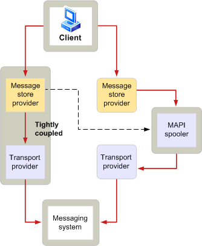

# MAPI 后台处理程序概述 （英文)
  
**适用于**： Outlook 
  
MAPI 后台处理程序是一个函数，负责向发送消息和接收消息从邮件系统的 Microsoft Office Outlook 进程。 MAPI 后台处理程序播放消息接收和发送中的一个重要的角色。 当邮件系统不可用时，MAPI 后台处理程序存储消息，并自动将它们转发在以后。 保留到或发送数据在必要时，此功能称为存储和转发，其中远程连接共有和网络流量较高的环境中的关键功能。 MAPI 后台处理程序作为后台线程在 Outlook 中运行。
  
MAPI 后台处理程序都有与邮件分布相关的其他责任。 以下这些额外的职责：
  
- 跟踪的由特定传输提供程序处理的收件人类型。
    
- 当新邮件已送达告知客户端应用程序。
    
- 预处理和后处理调用消息。
    
- 生成报告指示该邮件传递的发生。
    
- 维护的处理收件人的状态。
    
下图显示了在高级别邮件流动的方式从客户端消息的系统。
  
**传出消息流**
  

  
客户端应用程序的用户向一个或多个收件人发送邮件。 消息存储提供程序启动发送的过程中，设置消息格式与所需的传输的其他信息。
  
MAPI 后台处理程序接收的消息处理如果发生以下情况：
  
- 消息存储提供程序未紧密耦合与传输提供程序。
    
- 邮件需要预处理。
    
- 消息存储和传输提供程序紧密，但不能处理，向其发送邮件的所有收件人。
    
如果 MAPI 后台处理程序接收的消息，它会执行任何所需预处理，并将邮件传递到适当的传输提供程序。 传输提供程序给其消息的系统，将其发送到其预期接收人的邮件。
  
与传入的消息将被颠倒流。 传输提供程序从其邮件系统中收到一条消息，并通知 MAPI 后台处理程序。 后台处理程序执行任何所需的后处理，并通知的消息存储提供程序已到达一个新的邮件。 此通知使客户端刷新其消息显示，使用户可以读取新邮件。
  
## 另请参阅

- [MAPI 功能和体系结构](mapi-features-and-architecture.md)

