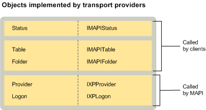

# MAPI 传输提供程序对象MAPI transport provider objects
  
**适用于**： Outlook**Applies to**: Outlook 
  
标准提供程序和所有服务提供程序都实现的登录对象中，除了传输提供程序实现所需状态对象。In addition to the standard provider and logon objects implemented by all service providers, transport providers are required to implement a status object. 对于其他服务提供程序类型，实现状态对象是可选的。For the other service provider types, implementing a status object is optional. 但是，MAPI 要求其传输提供程序。However, MAPI requires it for transport providers. 支持下载邮件头从远程服务器的传输提供程序还实现文件夹和表。Transport providers that support the downloading of message headers from a remote server also implement a folder and a table. 
  
下图显示了每个传输提供程序可以实现与及其相应的接口的对象。The following illustration shows each of the objects that transport providers can implement with their corresponding interfaces. 图还指示 MAPI 或客户端是否对象的用户。The illustration also indicates whether MAPI or a client is the object's user.
  

  
## 另请参阅See also

- [MAPI 服务提供商对象MAPI Service Provider Objects](mapi-service-provider-objects.md)

