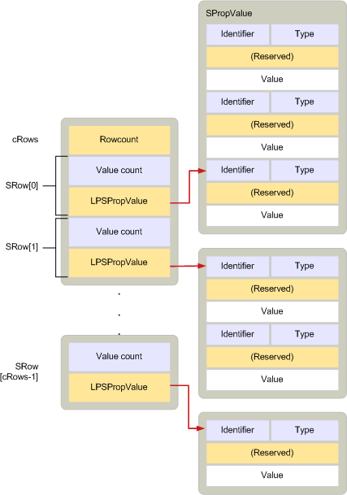

# <a name="srow"></a><span data-ttu-id="ccbd6-103">SRow</span><span class="sxs-lookup"><span data-stu-id="ccbd6-103">SRow</span></span>

<span data-ttu-id="ccbd6-104">**适用于**： Outlook 2013 |Outlook 2016</span><span class="sxs-lookup"><span data-stu-id="ccbd6-104">**Applies to**: Outlook 2013 | Outlook 2016</span></span> 
  
<span data-ttu-id="ccbd6-105">介绍包含特定对象的选定的属性表中的行。</span><span class="sxs-lookup"><span data-stu-id="ccbd6-105">Describes a row from a table that contains selected properties for a specific object.</span></span> 
  
|||
|:-----|:-----|
|<span data-ttu-id="ccbd6-106">头文件：</span><span class="sxs-lookup"><span data-stu-id="ccbd6-106">Header file:</span></span>  <br/> |<span data-ttu-id="ccbd6-107">Mapidefs.h</span><span class="sxs-lookup"><span data-stu-id="ccbd6-107">Mapidefs.h</span></span>  <br/> |
   
```cpp
typedef struct _SRow
{
  ULONG ulAdrEntryPad;
  ULONG cValues;
  LPSPropValue lpProps;
} SRow, FAR *LPSRow;

```

## <a name="members"></a><span data-ttu-id="ccbd6-108">Members</span><span class="sxs-lookup"><span data-stu-id="ccbd6-108">Members</span></span>

<span data-ttu-id="ccbd6-109">**ulAdrEntryPad**</span><span class="sxs-lookup"><span data-stu-id="ccbd6-109">**ulAdrEntryPad**</span></span>
  
> <span data-ttu-id="ccbd6-110">填充字节正确地对齐的属性值指向**lpProps**成员。</span><span class="sxs-lookup"><span data-stu-id="ccbd6-110">Padding bytes to properly align the property values pointed to by the **lpProps** member.</span></span> 
    
<span data-ttu-id="ccbd6-111">**cValues**</span><span class="sxs-lookup"><span data-stu-id="ccbd6-111">**cValues**</span></span>
  
> <span data-ttu-id="ccbd6-112">属性值所指的**lpProps**计数。</span><span class="sxs-lookup"><span data-stu-id="ccbd6-112">Count of property values pointed to by **lpProps**.</span></span> 
    
<span data-ttu-id="ccbd6-113">**lpProps**</span><span class="sxs-lookup"><span data-stu-id="ccbd6-113">**lpProps**</span></span>
  
> <span data-ttu-id="ccbd6-114">指向一个[SPropValue](spropvalue.md)结构描述行中的列的属性值的数组。</span><span class="sxs-lookup"><span data-stu-id="ccbd6-114">Pointer to an array of [SPropValue](spropvalue.md) structures that describe the property values for the columns in the row.</span></span> 
    
## <a name="remarks"></a><span data-ttu-id="ccbd6-115">注解</span><span class="sxs-lookup"><span data-stu-id="ccbd6-115">Remarks</span></span>

<span data-ttu-id="ccbd6-116">**SRow**结构描述表中的行。</span><span class="sxs-lookup"><span data-stu-id="ccbd6-116">An **SRow** structure describes a row in a table.</span></span> <span data-ttu-id="ccbd6-117">它包含附带表通知的[TABLE_NOTIFICATION](table_notification.md)结构中。</span><span class="sxs-lookup"><span data-stu-id="ccbd6-117">It is included in the [TABLE_NOTIFICATION](table_notification.md) structure that accompanies a table notification.</span></span> 
  
<span data-ttu-id="ccbd6-118">**SRow**结构使用以下方法：</span><span class="sxs-lookup"><span data-stu-id="ccbd6-118">**SRow** structures are used in the following methods:</span></span> 
  
- [<span data-ttu-id="ccbd6-119">IAddrBook::GetSearchPath</span><span class="sxs-lookup"><span data-stu-id="ccbd6-119">IAddrBook::GetSearchPath</span></span>](iaddrbook-getsearchpath.md)
    
- [<span data-ttu-id="ccbd6-120">IAddrBook::SetSearchPath</span><span class="sxs-lookup"><span data-stu-id="ccbd6-120">IAddrBook::SetSearchPath</span></span>](iaddrbook-setsearchpath.md)
    
- [<span data-ttu-id="ccbd6-121">IMAPITable::QueryRows</span><span class="sxs-lookup"><span data-stu-id="ccbd6-121">IMAPITable::QueryRows</span></span>](imapitable-queryrows.md)
    
- [<span data-ttu-id="ccbd6-122">IMAPITable::ExpandRow</span><span class="sxs-lookup"><span data-stu-id="ccbd6-122">IMAPITable::ExpandRow</span></span>](imapitable-expandrow.md)
    
- <span data-ttu-id="ccbd6-123">[ITableData: IUnknown](itabledataiunknown.md)（许多方法）</span><span class="sxs-lookup"><span data-stu-id="ccbd6-123">[ITableData : IUnknown](itabledataiunknown.md) (many methods)</span></span> 
    
- [<span data-ttu-id="ccbd6-124">FBadRowSet</span><span class="sxs-lookup"><span data-stu-id="ccbd6-124">FBadRowSet</span></span>](fbadrowset.md)
    
- [<span data-ttu-id="ccbd6-125">FreeProws</span><span class="sxs-lookup"><span data-stu-id="ccbd6-125">FreeProws</span></span>](freeprows.md)
    
- [<span data-ttu-id="ccbd6-126">HrQueryAllRows</span><span class="sxs-lookup"><span data-stu-id="ccbd6-126">HrQueryAllRows</span></span>](hrqueryallrows.md)
    
<span data-ttu-id="ccbd6-127">当多个行需要在所述时，请使用[SRowSet](srowset.md)结构。</span><span class="sxs-lookup"><span data-stu-id="ccbd6-127">When more than one row needs to be described, an [SRowSet](srowset.md) structure is used.</span></span> <span data-ttu-id="ccbd6-128">**SRowSet**结构包含数组**SRow**结构和结构数组中的计数。</span><span class="sxs-lookup"><span data-stu-id="ccbd6-128">An **SRowSet** structure contains an array of **SRow** structures and a count of structures in the array.</span></span> 
  
<span data-ttu-id="ccbd6-129">下图显示**SRow**和**SRowSet**数据结构之间的关系。</span><span class="sxs-lookup"><span data-stu-id="ccbd6-129">The following illustration shows the relationship between an **SRow** and an **SRowSet** data structure.</span></span> 
  
<span data-ttu-id="ccbd6-130">**SRow 和 SRowSet 之间的关系**</span><span class="sxs-lookup"><span data-stu-id="ccbd6-130">**Relationship between SRow and SRowSet**</span></span>
  
<span data-ttu-id="ccbd6-131"></span><span class="sxs-lookup"><span data-stu-id="ccbd6-131"></span></span>
  
<span data-ttu-id="ccbd6-132">**SRow**结构定义[ADRENTRY](adrentry.md)结构相同。</span><span class="sxs-lookup"><span data-stu-id="ccbd6-132">**SRow** structures are defined the same as [ADRENTRY](adrentry.md) structures.</span></span> <span data-ttu-id="ccbd6-133">因此，收件人的表和地址列表中的项的行可以视为相同。</span><span class="sxs-lookup"><span data-stu-id="ccbd6-133">Therefore, a row of a recipient table and an entry in an address list can be treated the same.</span></span> 
  
<span data-ttu-id="ccbd6-134">有关应分配的内存**SRow**结构的方式的信息，请参阅[管理内存 ADRLIST 和 SRowSet 结构](managing-memory-for-adrlist-and-srowset-structures.md)。</span><span class="sxs-lookup"><span data-stu-id="ccbd6-134">For information about how the memory for **SRow** structures should be allocated, see [Managing Memory for ADRLIST and SRowSet Structures](managing-memory-for-adrlist-and-srowset-structures.md).</span></span>
  
## <a name="see-also"></a><span data-ttu-id="ccbd6-135">另请参阅</span><span class="sxs-lookup"><span data-stu-id="ccbd6-135">See also</span></span>

- [<span data-ttu-id="ccbd6-136">ADRENTRY</span><span class="sxs-lookup"><span data-stu-id="ccbd6-136">ADRENTRY</span></span>](adrentry.md)
- [<span data-ttu-id="ccbd6-137">SPropValue</span><span class="sxs-lookup"><span data-stu-id="ccbd6-137">SPropValue</span></span>](spropvalue.md)
- [<span data-ttu-id="ccbd6-138">SRowSet</span><span class="sxs-lookup"><span data-stu-id="ccbd6-138">SRowSet</span></span>](srowset.md)
- [<span data-ttu-id="ccbd6-139">TABLE_NOTIFICATION</span><span class="sxs-lookup"><span data-stu-id="ccbd6-139">TABLE_NOTIFICATION</span></span>](table_notification.md)
- [<span data-ttu-id="ccbd6-140">MAPI 结构</span><span class="sxs-lookup"><span data-stu-id="ccbd6-140">MAPI Structures</span></span>](mapi-structures.md)
- [<span data-ttu-id="ccbd6-141">管理 ADRLIST 和 SRowSet 结构的内存</span><span class="sxs-lookup"><span data-stu-id="ccbd6-141">Managing Memory for ADRLIST and SRowSet Structures</span></span>](managing-memory-for-adrlist-and-srowset-structures.md)

