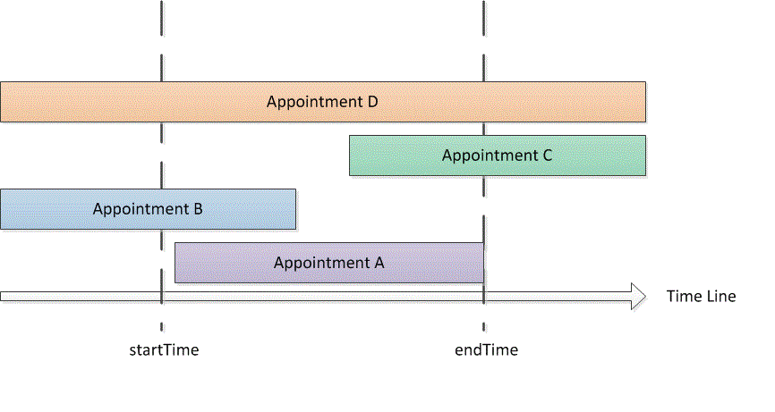

# <a name="search-and-obtain-appointments-in-a-time-range"></a>搜索并获取某个时间范围内的约会

此示例会返回默认 Microsoft Outlook 日历中指定时间范围内的约会。

## <a name="example"></a>示例

此代码示例包含两个方法：DemoAppointmentsInRange 和 GetAppointmentsInRange。 DemoAppointmentsInRange 会获取当前已登录的 Outlook 配置文件的默认日历，从当天凌晨 12:00 开始设置 5 天的日期范围， 调用 GetAppointmentsInRange 来获取该时间范围内的约会并显示返回的每个约会的主题和开始时间。

GetAppointmentsInRange 会接受 Outlook 文件夹以及相应时间范围的开始和结束 **DateTime** 值作为输入参数。 此方法使用了 [Restrict(String)](https://msdn.microsoft.com/library/bb612531\(v=office.15\)) 方法以及一种 Jet 格式字符串筛选器，该筛选器将返回在指定时间范围内开始并结束的约会。 假定 \[Start\] 和 \[End\] 是约会的开始时间和结束时间，startTime 和 endTime 是指定时间范围的开始时间和结束时间，那么 GetAppointmentsInRange 会设置一个筛选器来寻找同时满足 `[Start]>=startTime` 和 `[End]<=endTime` 这两个条件的约会。 以下代码展示了 C\# 形式的 Jet 筛选器。

```csharp
string filter = "[Start] >= '"
    + startTime.ToString("g")
    + "' AND [End] <= '"
    + endTime.ToString("g") + "'";
```

在调用 **Items.Restrict** 方法来搜索约会之前，GetAppointmentsInRange 会执行另外两个操作来包含会在指定时间范围内发生的定期约会：

- 设置 [Items](https://msdn.microsoft.com/library/bb645287\(v=office.15\)) 集合的 [IncludeRecurrences](https://msdn.microsoft.com/library/bb646522\(v=office.15\)) 属性。

- 根据 [Start](https://msdn.microsoft.com/library/bb647263\(v=office.15\)) 属性对指定日历文件夹中的约会项目进行排序。

或者，如果你还对与指定时间范围的部分或全部时间重叠的约会感兴趣，则可以指定一种不同的筛选器来返回其他类型的约会（如图 1 所示）：

- 开始和结束时间均在指定时间范围内的约会（例如约会 A）：<br/><br/>`[Start]>=startTime and [End]<=endTime`

- 开始时间早于指定时间范围，但结束时间在该时间范围内的约会（例如约会 B）：<br/><br/>`[Start]<startTime and [End]<=endTime`

- 开始时间在指定时间范围内，但结束时间晚于该时间范围的约会（例如约会 C）：<br/><br/>`[Start]>=startTime and [End]>endTime`

- 开始时间早于指定时间范围，且结束时间晚于该时间范围的约会（例如约会 D）：<br/><br/>`[Start]<startTime and [End]>endTime`

**图 1. 在某个时间范围内的或与该时间范围重叠的约会的类型**


 

在任何时间范围内，`startTime<=endTime` 这一条件都成立，因此具有 `[Start]<=endTime` 和 `[End]>=startTime` 两个条件的筛选器将会捕捉该时间范围内的前述各种类型的约会。

在 C\# 中，可以将该 Jet 筛选器表示如下。

```csharp
string filter = "[Start] <= '"
    + endTime.ToString("g")
    + "' AND [End] >= '"
    + startTime.ToString("g") + "'";
```

以下代码展示了完整的示例。 如果使用 Visual Studio 测试此代码示例，必须先添加对 Microsoft Outlook 15.0 对象库组件的引用，并在导入 **Microsoft.Office.Interop.Outlook** 命名空间时指定 Outlook 变量。 不得将 **Imports** 或 **using** 语句直接添加到此代码示例中的函数前面，而且这两个语句必须后跟公共类声明。 下面几行代码展示了如何在 Visual Basic 和 C\# 中执行导入和分配操作。

```vb
Imports Outlook = Microsoft.Office.Interop.Outlook
```


```csharp
using Outlook = Microsoft.Office.Interop.Outlook;
```


```csharp
private void DemoAppointmentsInRange()
{
    Outlook.Folder calFolder =
        Application.Session.GetDefaultFolder(
        Outlook.OlDefaultFolders.olFolderCalendar)
        as Outlook.Folder;
    DateTime start = DateTime.Now;
    DateTime end = start.AddDays(5);
    Outlook.Items rangeAppts = GetAppointmentsInRange(calFolder, start, end);
    if (rangeAppts != null)
    {
        foreach (Outlook.AppointmentItem appt in rangeAppts)
        {
            Debug.WriteLine("Subject: " + appt.Subject 
                + " Start: " + appt.Start.ToString("g"));
        }
    }
}

/// <summary>
/// Get recurring appointments in date range.
/// </summary>
/// <param name="folder"></param>
/// <param name="startTime"></param>
/// <param name="endTime"></param>
/// <returns>Outlook.Items</returns>
private Outlook.Items GetAppointmentsInRange(
    Outlook.Folder folder, DateTime startTime, DateTime endTime)
{
    string filter = "[Start] >= '"
        + startTime.ToString("g")
        + "' AND [End] <= '"
        + endTime.ToString("g") + "'";
    Debug.WriteLine(filter);
    try
    {
        Outlook.Items calItems = folder.Items;
        calItems.IncludeRecurrences = true;
        calItems.Sort("[Start]", Type.Missing);
        Outlook.Items restrictItems = calItems.Restrict(filter);
        if (restrictItems.Count > 0)
        {
            return restrictItems;
        }
        else
        {
            return null;
        }
    }
    catch { return null; }
}
```

## <a name="see-also"></a>另请参阅

- [搜索和筛选](search-and-filter.md)

