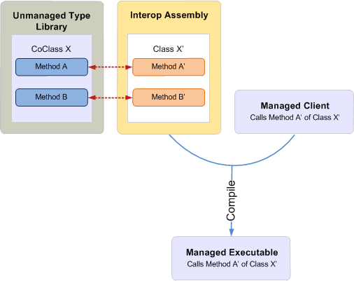

# COM 和 .NET 之间的互操作性简介Introduction to interoperability between COM and .NET

组件对象模型 (COM) 和 .NET 开发具有迥然不同的类型系统以及对象生存期管理、接口创建和接口继承机制。The Component Object Model (COM) and .NET development have vastly different type systems and mechanisms for object lifetime management, interface creation, and interface inheritance. 

例如，COM 中的 **Variant** 类型对应的是 .NET Framework 中的 **System.Object** 数据类型。For example, a **Variant** type in COM is a **System.Object** data type in the .NET Framework. 若要创建对象，COM 客户端会调用 [CoCreateInstance](https://docs.microsoft.com/windows/desktop/api/combaseapi/nf-combaseapi-cocreateinstance)，而托管客户端可以使用内置在托管编程语言中的关键字（如 new 或 New）。To create an object, a COM client calls [CoCreateInstance](https://docs.microsoft.com/windows/desktop/api/combaseapi/nf-combaseapi-cocreateinstance), whereas a managed client can use keywords such as new or New that are built in to a managed programming language. 

同时，COM 不支持传统继承，并且 COM 客户端管理 [IUnknown（该链接可能指向英文页面）](https://docs.microsoft.com/windows/desktop/api/unknwn/nn-unknwn-iunknown) 所提供的内部引用计数以释放 coclass，而托管客户端依赖 .NET Framework 提供的公共语言运行库 (CLR) 垃圾收集器来释放对象。While COM does not support classical inheritance and a COM client manages an internal reference count provided by [IUnknown](https://docs.microsoft.com/windows/desktop/api/unknwn/nn-unknwn-iunknown) to free a coclass, a managed client relies on the common language runtime (CLR) garbage collector provided by the .NET Framework to free an object. 

假定 COM 和 .NET 开发间存在这些差异，那么在 COM 对象模型上开发托管客户端则需要可处理这些差异的机制。Given such differences between COM and .NET development, developing a managed client on a COM object model requires a mechanism that resolves these differences. 运行时可调用包装 (RCW) 就是这样一种机制，它可促进 COM 和托管编程模型之间的透明通信。The Runtime Callable Wrapper (RCW) is a mechanism that promotes transparent communication between COM and the managed programming model.

本主题提供了有关 RCW 如何利用 COM 和托管编程模型之间的通信的高级别描述。This topic gives a high-level description of how the RCW facilitates communication between COM and the managed programming model. 请注意，虽然此主题使用了 Visual Studio 来阐述 RCW 机制，你也可以在 Visual Studio 外部使用互操作程序集来开发托管客户端。Note that even though this topic uses Visual Studio to illustrate the RCW mechanism, you can use an interop assembly outside of Visual Studio to develop a managed client.

## 推动互操作性：互操作程序集和 RCWFacilitating interoperability: the Interop Assembly and RCW

### 编译时Compile time

互操作程序集定义了可以与托管客户端进行交互且映射到基于 COM 的类型库的托管接口。An interop assembly defines managed interfaces that map to a COM-based type library and that a managed client can interact with. 若要在 Visual Studio 中使用互操作程序集，请首先添加对相应 COM 组件的引用。To use an interop assembly in Visual Studio, first add a reference to the corresponding COM component. Visual Studio 将自动生成互操作程序集的本地副本。Visual Studio will automatically generate a local copy of the interop assembly. 互操作程序集包含一个命名空间，后者的下面则是 COM 对象模型中每个 COM 对象的托管等效接口。The interop assembly contains one namespace, under which there is a managed equivalent interface of each COM object in the COM object model. 

图 1 展示了一个希望使用会定义 coclass X 的 COM 类型库的托管客户端。托管客户端会调用类 X，后者是 coclass X 的托管等效接口，正如互操作程序集中所定义的。Figure 1 illustrates a managed client that wants to use a COM type library that defines coclass X. The managed client calls class X, which is the managed equivalent interface for coclass X, as defined in the interop assembly. 在编译时，系统会使用互操作程序集中关于类 X 的信息来编译托管项目。At compile time, the managed project is compiled with information about class X from the interop assembly.

**图 1. 使用与非托管类型库互操作的互操作程序集编译的托管应用程序****Figure 1. A managed application compiled with an interop assembly that interoperates with an unmanaged type library**

  
通常，只要设置对某类型库的引用，Visual Studio 就会为该类型库生成互操作程序集的副本。可以使用任意数量的互操作程序集描述同一 COM 类型。但是，一个类型库只能有一个主互操作程序集 (PIA)，即该类型库所发布的互操作程序集。与其他互操作程序集不同，PIA 并不是在您每次向 Visual Studio 中添加引用时生成的。相反，您可以在计算机上向全局程序集缓存 (GAC) 中安装一次 PIA。添加对类型库的引用时，Visual Studio 会自动加载 PIA。In general, as long as you set a reference to a type library, Visual Studio generates a copy of an interop assembly for that type library. Any number of interop assemblies can exist to describe the same COM type. However, a type library can have only one Primary Interop Assembly (PIA), which is the interop assembly published by the type library. Unlike other interop assemblies, the PIA is not generated every time you add a reference in Visual Studio. Instead, you install the PIA to the global assembly cache (GAC) just once on a computer. When you add a reference to the type library, Visual Studio automatically loads the PIA.

若要编程实现 Outlook 托管解决方案，应使用 Outlook PIA。To program a managed solution for Outlook, you should use the Outlook PIA. 若要将来自 Outlook PIA 的信息纳入托管加载项，首先必须在 GAC 中安装 Outlook PIA。To incorporate information from the Outlook PIA into a managed add-in, first you must install the Outlook PIA in the GAC. 如果使用 Visual Studio 创建托管项目，则在添加对 Outlook 类型库的引用后，Visual Studio 会加载 PIA。If you are using Visual Studio to create the managed project, after adding a reference to the Outlook type library, Visual Studio loads the PIA. 在对象浏览器中的命名空间 Microsoft.Office.Interop.Outlook 下，可以看到具有对应于 Outlook 对象模型中对象的名称的托管接口。In the object browser, under the namespace Microsoft.Office.Interop.Outlook, you can see managed interfaces that have names corresponding to objects in the Outlook object model. 例如，Account 接口对应的是 Outlook 对象模型中的 **Account** 对象。For example, the Account interface corresponds to the **Account** object in the Outlook object model. 编译托管项目时，此信息会被包含在可执行文件中。When you compile the managed project, this information is incorporated in your executable.

### 运行时Run time

在运行时，借助互操作程序集所提供的信息，.NET Framework CLR 将为托管客户端所交互的每个 coclass 创建一个 RCW。请注意，无论客户端从 coclass 获得了多少个接口，运行时只为每个 coclass 创建一个 RCW。RCW 是和 COM coclass 有关的 .NET Framework 类的类型。RCW 可跟踪 coclass 的实例，并且仅在客户端不再需要 RCW 时才释放对这些实例的引用。因此，托管客户端不必按照 COM 下非托管客户端的方式来管理对象生存期。At run time, with the information provided by an interop assembly, the .NET Framework CLR creates an RCW for each coclass the managed client interacts with. Note that the runtime creates only one RCW for each coclass, regardless of how many interfaces the client has obtained from the coclass. The RCW is a .NET Framework class type that wraps around the COM coclass. The RCW keeps track of the instances of the coclass and releases references to them only when the client no longer needs the RCW. This way, a managed client does not have to manage the lifetime of an object the way an unmanaged client would under COM.

图 2 阐述的是：在运行时，RCW 从托管客户端截获 API 调用，并使用互操作程序集信息以透明方式将该调用映射到 COM coclass 中的相应 API。以下过程描述了此操作：Figure 2 illustrates an RCW intercepting an API call from a managed client at run time, and using information from the interop assembly, transparently mapping the call to the corresponding API in the COM coclass. The following process describes how this happens:

1.  如互操作程序集中 COM 类型库的相关定义，托管客户端调用类 X' 的方法 A'。The managed client calls method A' of class X' as defined in the interop assembly for a COM type library.

2.  如果类 X' 尚不具有 RCW，.NET Framework 运行时将使用互操作程序集信息并为类 X' 创建 RCW。If an RCW does not yet exist for class X', the .NET Framework runtime uses information from the interop assembly and creates an RCW for class X'.

3.  RCW 截获对方法 A' 的调用，将参数转换为相应的 COM 类型，并按照 COM 类型库中的定义，调用 coclass X 的方法 A。The RCW intercepts the call to method A', translates the arguments into corresponding COM types, and invokes method A of coclass X as defined in the COM type library.

**图 2. RCW 截获来自托管可执行文件的调用，并将其映射到非托管类型库中的 coclass****Figure 2. An RCW intercepts a call from a managed executable and maps it to a coclass in an unmanaged type library**

  

## 另请参阅See also

- [为什么要使用 Outlook PIAWhy use the Outlook PIA](why-use-the-outlook-pia.md)
- [安装和参考 Outlook PIAInstalling and referencing the Outlook PIA](installing-and-referencing-the-outlook-pia.md)

