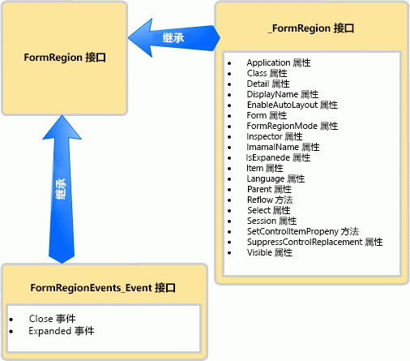

# <a name="methods-and-properties-in-the-outlook-pia"></a><span data-ttu-id="2f0bb-102">Outlook PIA 中的方法和属性</span><span class="sxs-lookup"><span data-stu-id="2f0bb-102">Methods and properties in the Outlook PIA</span></span>

<span data-ttu-id="2f0bb-103">本主题介绍如何通过使用 Outlook 主互操作程序集 (PIA) 来在在托管代码中访问对象的方法和属性。</span><span class="sxs-lookup"><span data-stu-id="2f0bb-103">This topic describes how to access methods and properties of an object in managed code by using the Outlook Primary Interop Assembly (PIA).</span></span>

## <a name="where-helper-objects-come-from"></a><span data-ttu-id="2f0bb-104">帮助程序对象的由来</span><span class="sxs-lookup"><span data-stu-id="2f0bb-104">Where Helper objects come from</span></span>

<span data-ttu-id="2f0bb-p101">为了创建 Outlook PIA，Outlook 将使用 .NET Framework 中的类型库导入程序 (TLBIMP) 将 COM 类型库中的类型定义转换为公共语言运行库 (CLR) 程序集中的等效定义。在 COM 中，对象实际上是包括以下各项的 coclass：</span><span class="sxs-lookup"><span data-stu-id="2f0bb-p101">To create the Outlook PIA, Outlook uses the Type Library Importer (TLBIMP) in the .NET Framework to convert type definitions in the COM type library into equivalent definitions in a common language runtime (CLR) assembly. In COM, an object is actually a coclass that consists of the following:</span></span>

- <span data-ttu-id="2f0bb-107">主接口（如 [\_FormRegion](https://msdn.microsoft.com/library/bb645761\(v=office.15\)) 接口）。</span><span class="sxs-lookup"><span data-stu-id="2f0bb-107">The primary interface (for example, the [\_FormRegion](https://msdn.microsoft.com/library/bb645761\(v=office.15\)) interface).</span></span>

- <span data-ttu-id="2f0bb-108">事件接口（如 [FormRegionEvents](https://msdn.microsoft.com/library/bb611940\(v=office.15\)) 接口）。</span><span class="sxs-lookup"><span data-stu-id="2f0bb-108">The event interface (for example, the [FormRegionEvents](https://msdn.microsoft.com/library/bb611940\(v=office.15\)) interface).</span></span>

<span data-ttu-id="2f0bb-109">TLBIMP 导入每个对象的主接口和事件接口，并创建众多接口、委托和类，其中包括以下各项：</span><span class="sxs-lookup"><span data-stu-id="2f0bb-109">TLBIMP imports the primary interface and the event interface for each object and creates a number of interfaces, delegates, and classes, among which are the following:</span></span>

- <span data-ttu-id="2f0bb-110">.NET 事件接口（如 [FormRegionEvents\_Event](https://msdn.microsoft.com/library/bb647619\(v=office.15\)) 接口）。</span><span class="sxs-lookup"><span data-stu-id="2f0bb-110">The .NET event interface (for example, the [FormRegionEvents\_Event](https://msdn.microsoft.com/library/bb647619\(v=office.15\)) interface).</span></span>

- <span data-ttu-id="2f0bb-111">.NET 类（如 [FormRegionClass](https://msdn.microsoft.com/library/bb624204\(v=office.15\)) 类）。</span><span class="sxs-lookup"><span data-stu-id="2f0bb-111">The .NET class (for example, the [FormRegionClass](https://msdn.microsoft.com/library/bb624204\(v=office.15\)) class).</span></span>

- <span data-ttu-id="2f0bb-112">.NET 接口（如 [FormRegion](https://msdn.microsoft.com/library/bb652633\(v=office.15\)) 接口）。</span><span class="sxs-lookup"><span data-stu-id="2f0bb-112">The .NET interface (for example, the [FormRegion](https://msdn.microsoft.com/library/bb652633\(v=office.15\)) interface).</span></span>

## <a name="what-the-helper-objects-are-for"></a><span data-ttu-id="2f0bb-113">帮助程序对象的用途</span><span class="sxs-lookup"><span data-stu-id="2f0bb-113">What the Helper objects are for</span></span>

<span data-ttu-id="2f0bb-114">继续以 **FormRegion** 对象为例，以下列表检查上述各个接口和类包含的内容。</span><span class="sxs-lookup"><span data-stu-id="2f0bb-114">Continuing to use the **FormRegion** object as an example, the following list examines what each interface and class listed earlier contains.</span></span>

- <span data-ttu-id="2f0bb-115">\_FormRegion 接口定义 FormRegion 的所有方法和属性。</span><span class="sxs-lookup"><span data-stu-id="2f0bb-115">The \_FormRegion interface defines all the methods and properties of FormRegion.</span></span> <span data-ttu-id="2f0bb-116">除下面讨论的一个情况外，通常不在代码中使用此接口。</span><span class="sxs-lookup"><span data-stu-id="2f0bb-116">Typically you do not use this interface in code, except for a condition discussed below.</span></span>

- <span data-ttu-id="2f0bb-117">**FormRegionEvents** 接口定义映射到 FormRegion 的事件的方法。</span><span class="sxs-lookup"><span data-stu-id="2f0bb-117">The **FormRegionEvents** interface defines methods mapping to events of FormRegion.</span></span> <span data-ttu-id="2f0bb-118">请勿在代码中使用此接口。</span><span class="sxs-lookup"><span data-stu-id="2f0bb-118">You do not use this interface in code.</span></span>

- <span data-ttu-id="2f0bb-119">TLBIMP 会进一步处理 **FormRegionEvents** 接口以创建定义 FormRegion 的所有事件的 **FormRegionEvents**\_Event 接口。</span><span class="sxs-lookup"><span data-stu-id="2f0bb-119">TLBIMP further processes the **FormRegionEvents** interface to create the **FormRegionEvents**\_Event interface that defines all the events of FormRegion.</span></span> <span data-ttu-id="2f0bb-120">除下面讨论的一个情况外，通常不在代码中使用此接口。</span><span class="sxs-lookup"><span data-stu-id="2f0bb-120">Typically you do not use this interface in code, except for a condition discussed below.</span></span>

- <span data-ttu-id="2f0bb-p105">FormRegionClass 类定义 FormRegion 的所有方法、属性和事件成员。它是 FormRegion 接口在后台所关联的类，以便您可以编写代码来创建 FormRegion 接口的实例。但是，不要直接在代码中使用此接口。</span><span class="sxs-lookup"><span data-stu-id="2f0bb-p105">The FormRegionClass class defines all the method, property, and event members of FormRegion. This is the class that the FormRegion interface is attributed to associate with behind the scenes so that you can write code to create an instance of the FormRegion interface. However, you do not use this interface directly in code.</span></span>

- <span data-ttu-id="2f0bb-124">FormRegion 接口会继承 \_FormRegion 接口和 **FormRegionEvents**\_Event 接口。</span><span class="sxs-lookup"><span data-stu-id="2f0bb-124">The FormRegion interface inherits the \_FormRegion interface and the **FormRegionEvents**\_Event interface.</span></span> <span data-ttu-id="2f0bb-125">图 1 说明了这个继承关系。</span><span class="sxs-lookup"><span data-stu-id="2f0bb-125">Figure 1 illustrates this inheritance relationship.</span></span>
    
  <span data-ttu-id="2f0bb-126">**图 1. FormRegion 接口继承 \_FormRegion 接口的方法和属性，并继承 FormRegionEvents\_Event 接口的事件**</span><span class="sxs-lookup"><span data-stu-id="2f0bb-126">**Figure 1. The FormRegion interface inherits methods and properties from the \_FormRegion interface, and inherits events from the FormRegionEvents\_Event interface**</span></span>

  
    
  <span data-ttu-id="2f0bb-128">通常，FormRegion 是在托管代码中用于访问对象和 **FormRegion** 对象的方法、属性及事件成员的一个接口。</span><span class="sxs-lookup"><span data-stu-id="2f0bb-128">Typically, FormRegion is the one interface you use in managed code to access the object and the method, property, and event members of the **FormRegion** object.</span></span>

<span data-ttu-id="2f0bb-p107">将 **Application** 对象作为另一个示例，通过 **Application** 接口访问 [Application](https://msdn.microsoft.com/library/bb646615\(v=office.15\)) 对象、方法、属性和事件。但存在三种例外情况，在这些情况下，您必须使用不同的接口，或者需要根据相应语言，使用不同的接口：</span><span class="sxs-lookup"><span data-stu-id="2f0bb-p107">Using the **Application** object as another example, you access the **Application** object, methods, properties, and events through the [Application](https://msdn.microsoft.com/library/bb646615\(v=office.15\)) interface. There are however three exceptions where you must use a different interface, or depending on the language, you would want to use a different interface:</span></span>

- <span data-ttu-id="2f0bb-131">当您访问与事件共用同一名称的方法时，最好是转换为主接口来调用该方法。</span><span class="sxs-lookup"><span data-stu-id="2f0bb-131">When you access a method that shares the same name as an event, a good practice is to cast to the primary interface to call the method.</span></span> <span data-ttu-id="2f0bb-132">例如，**Application** 对象具有 [Quit](https://msdn.microsoft.com/library/bb646614\(v=office.15\)) 方法和 [Quit](https://msdn.microsoft.com/library/bb622595\(v=office.15\)) 事件。</span><span class="sxs-lookup"><span data-stu-id="2f0bb-132">For example, the **Application** object has a [Quit](https://msdn.microsoft.com/library/bb646614\(v=office.15\)) method and a [Quit](https://msdn.microsoft.com/library/bb622595\(v=office.15\)) event.</span></span> <span data-ttu-id="2f0bb-133">在 Visual Basic .NET 中，你可以通过 Application 接口访问 Quit 方法。</span><span class="sxs-lookup"><span data-stu-id="2f0bb-133">In Visual Basic .NET, you can access the Quit method through the Application interface.</span></span> <span data-ttu-id="2f0bb-134">在 C\# 中，可以通过将 Quit 方法转换为主接口来避免出现编译器警告，如下面的代码示例所示：</span><span class="sxs-lookup"><span data-stu-id="2f0bb-134">In C\#, you can avoid a compiler warning by casting the Quit method to the primary interface, as shown in the following code sample:</span></span>
    
   ```csharp
      void DemoApp()
      {
          Outlook.Application myApp = new Outlook.Application();
          // Other application code here
          ((Outlook._Application)myApp).Quit();
      }
   ```

- <span data-ttu-id="2f0bb-135">当您访问与该对象的方法共用同一名称的事件时，必须转换为适当的事件接口才能连接到该事件。</span><span class="sxs-lookup"><span data-stu-id="2f0bb-135">When you access an event that shares the same name as a method of that object, you must cast to the appropriate event interface to connect to the event.</span></span> <span data-ttu-id="2f0bb-136">与上述示例类似，若要连接到 Quit 事件，请转换为 [ApplicationEvents\_11\_Event](https://msdn.microsoft.com/library/bb622725\(v=office.15\)) 接口。</span><span class="sxs-lookup"><span data-stu-id="2f0bb-136">Similar to the example above, to connect to the Quit event, you cast to the [ApplicationEvents\_11\_Event](https://msdn.microsoft.com/library/bb622725\(v=office.15\)) interface.</span></span>

- <span data-ttu-id="2f0bb-137">当您连接到随后在更高版本的 Outlook 中得到扩展的早期版本的事件时，必须连接到早期接口中该版本的事件。</span><span class="sxs-lookup"><span data-stu-id="2f0bb-137">When you connect to an earlier version of an event that has been subsequently extended in a later version of Outlook, you must connect to the version of the event in the earlier interface.</span></span> <span data-ttu-id="2f0bb-138">例如，如果你希望连接到为 Outlook 2002 而非最新版本实现的 **Application** 对象的 Quit 事件版本，请连接到在 [ApplicationEvents\_10\_Event](https://msdn.microsoft.com/library/bb610098\(v=office.15\)) 接口中定义的 [Quit](https://msdn.microsoft.com/library/bb609660\(v=office.15\)) 事件，而不是在 ApplicationEvents\_11\_Event 接口中定义的 Quit 事件。</span><span class="sxs-lookup"><span data-stu-id="2f0bb-138">For example, if you want to connect to the version of the Quit event for the **Application** object implemented for Outlook 2002 instead of the latest version, connect to the [Quit](https://msdn.microsoft.com/library/bb609660\(v=office.15\)) event defined in the [ApplicationEvents\_10\_Event](https://msdn.microsoft.com/library/bb610098\(v=office.15\)) interface, instead of the Quit event defined in the ApplicationEvents\_11\_Event interface.</span></span>

## <a name="see-also"></a><span data-ttu-id="2f0bb-139">另请参阅</span><span class="sxs-lookup"><span data-stu-id="2f0bb-139">See also</span></span>

- [<span data-ttu-id="2f0bb-140">将 Outlook PIA 与对象模型相关联</span><span class="sxs-lookup"><span data-stu-id="2f0bb-140">Relating the Outlook PIA with the object model</span></span>](relating-the-outlook-pia-with-the-object-model.md)
- [<span data-ttu-id="2f0bb-141">Outlook PIA 中的对象</span><span class="sxs-lookup"><span data-stu-id="2f0bb-141">Objects in the Outlook PIA</span></span>](objects-in-the-outlook-pia.md)
- [<span data-ttu-id="2f0bb-142">Outlook PIA 中的事件</span><span class="sxs-lookup"><span data-stu-id="2f0bb-142">Events in the Outlook PIA</span></span>](events-in-the-outlook-pia.md)

