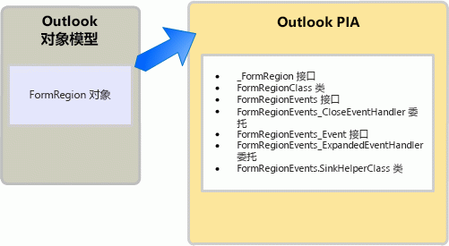

# <a name="objects-in-the-outlook-pia"></a><span data-ttu-id="614db-102">Outlook PIA 中的对象</span><span class="sxs-lookup"><span data-stu-id="614db-102">Objects in the Outlook PIA</span></span>

<span data-ttu-id="614db-103">在对象浏览器中浏览 Outlook 主互操作程序集 (PIA) 时，您可能会注意到许多接口和类的名称都引用了 Outlook 对象模型中的熟悉对象。</span><span class="sxs-lookup"><span data-stu-id="614db-103">When browsing the Outlook Primary Interop Assembly (PIA) in an object browser, you may notice that many interfaces and classes have names referencing familiar objects in the Outlook object model.</span></span> <span data-ttu-id="614db-104">对象模型中的一些对象与 PIA 中的接口具有一对一的映射。</span><span class="sxs-lookup"><span data-stu-id="614db-104">Some objects in the object model have a one-to-one mapping to interfaces in the PIA.</span></span> 

<span data-ttu-id="614db-105">例如， **AddressEntry** 映射到 PIA 中的 [AddressEntry](https://msdn.microsoft.com/library/bb609728\(v=office.15\)) 接口， **AddressList** 对象映射到 [AddressList](https://msdn.microsoft.com/library/bb623538\(v=office.15\)) 接口。</span><span class="sxs-lookup"><span data-stu-id="614db-105">For example, the **AddressEntry** is mapped to the [AddressEntry](https://msdn.microsoft.com/library/bb609728\(v=office.15\)) interface and the **AddressList** object is mapped to the [AddressList](https://msdn.microsoft.com/library/bb623538\(v=office.15\)) interface in the PIA.</span></span> 

<span data-ttu-id="614db-106">但是，其他多数对象都在 PIA 中具有一对多的映射。</span><span class="sxs-lookup"><span data-stu-id="614db-106">However, most other objects have a one-to-many mapping in the PIA.</span></span> <span data-ttu-id="614db-107">此一对多映射适用于在 Microsoft Office Outlook 2007 之前存在的一些对象以及自 Outlook 2007 以来添加的所有对象。</span><span class="sxs-lookup"><span data-stu-id="614db-107">This one-to-many mapping applies to some objects that existed before Microsoft Office Outlook 2007, and all objects added since Outlook 2007.</span></span> <span data-ttu-id="614db-108">本主题列出了映射到 COM 对象的典型 .NET 接口、类和委托，还介绍了如何访问 Outlook PIA 中的对象。</span><span class="sxs-lookup"><span data-stu-id="614db-108">This topic lists the typical .NET interfaces, classes, and delegates that are mapped to a COM object and describes how to access an object in the Outlook PIA.</span></span> <span data-ttu-id="614db-109">它还介绍了 Outlook PIA 中的一些例外，即在基于 COM 的对象模型中对象遭隐藏或弃用的情况。</span><span class="sxs-lookup"><span data-stu-id="614db-109">It also describes a few exceptions in the Outlook PIA where the objects are hidden or deprecated in the COM-based object model.</span></span>

## <a name="helper-objects"></a><span data-ttu-id="614db-110">帮助程序对象</span><span class="sxs-lookup"><span data-stu-id="614db-110">Helper objects</span></span>

<span data-ttu-id="614db-p103">本节使用 **FormRegion** 对象作为示例演示了在 Outlook PIA 中用于对象的典型帮助程序类。在 Outlook 2007 中将 **FormRegion** 对象添加到对象模型中。与 PIA 中的 **FormRegion** 对象相关的是接口、类和委托，如图 1 所示。</span><span class="sxs-lookup"><span data-stu-id="614db-p103">This section illustrates the typical helper classes for an object in the Outlook PIA by using the **FormRegion** object as an example. The **FormRegion** object was added to the object model in Outlook 2007. Related to the **FormRegion** object in the PIA are the interfaces, classes, and delegates, illustrated in Figure 1.</span></span>

<span data-ttu-id="614db-114">**图 1：Outlook 对象模型和 Outlook PIA 中表示的 FormRegion 对象**</span><span class="sxs-lookup"><span data-stu-id="614db-114">**Figure 1. The FormRegion object represented in the Outlook object model and in the Outlook PIA**</span></span>



<span data-ttu-id="614db-116">您在访问 **FormRegion** 对象及其方法、属性和事件成员时最常用的一个接口是 [FormRegion](https://msdn.microsoft.com/library/bb652633\(v=office.15\)) 接口。</span><span class="sxs-lookup"><span data-stu-id="614db-116">The one interface that you most often use to access the **FormRegion** object and its method, property, and event members is the [FormRegion](https://msdn.microsoft.com/library/bb652633\(v=office.15\)) interface.</span></span> <span data-ttu-id="614db-117">不过，不得将 **FormRegion** .NET 接口视为 **FormRegion** COM 对象的确切镜像；如果查看 Visual Studio 中的对象浏览器，便会发现 **FormRegion** 接口继承自另一接口，即 [\_FormRegion](https://msdn.microsoft.com/library/bb645761\(v=office.15\)) 接口。</span><span class="sxs-lookup"><span data-stu-id="614db-117">However, you should not consider the **FormRegion** .NET interface as an exact mirror image of the **FormRegion** COM object; if you look at the Object Browser in Visual Studio, you will find that the **FormRegion** interface inherits from another interface, the [\_FormRegion](https://msdn.microsoft.com/library/bb645761\(v=office.15\)) interface.</span></span> <span data-ttu-id="614db-118">实际上， **FormRegion** 接口只是基于 COM 类型库创建 Outlook PIA 所产生的少数几个接口和类中的一个。</span><span class="sxs-lookup"><span data-stu-id="614db-118">In fact, the **FormRegion** interface is just one of the few interfaces and classes that result from creating the Outlook PIA based on the COM type library.</span></span>

<span data-ttu-id="614db-p105">为了创建 Outlook PIA，Outlook 将使用 .NET Framework 中的类型库导入程序 (TLBIMP) 将 COM 类型库中的类型定义转换为公共语言运行库程序集中的等效定义。在 COM 中， **FormRegion** 对象实际上是一个由以下两个接口组成的 coclass，这两个接口定义 **FormRegion** 对象实现的接口：</span><span class="sxs-lookup"><span data-stu-id="614db-p105">To create the Outlook PIA, Outlook uses the Type Library Importer (TLBIMP) in the .NET Framework to convert type definitions in the COM type library into equivalent definitions in a Common Language Runtime assembly. In COM, the **FormRegion** object is actually a coclass that consists of the following two interfaces defining the interfaces that the **FormRegion** object implements:</span></span>

- <span data-ttu-id="614db-121">主接口 **\_FormRegion**</span><span class="sxs-lookup"><span data-stu-id="614db-121">The primary interface **\_FormRegion**</span></span>

- <span data-ttu-id="614db-122">事件接口 [FormRegionEvents](https://msdn.microsoft.com/library/bb611940\(v=office.15\))</span><span class="sxs-lookup"><span data-stu-id="614db-122">The event interface [FormRegionEvents](https://msdn.microsoft.com/library/bb611940\(v=office.15\))</span></span>

<span data-ttu-id="614db-123">TLBIMP 直接从类型库中导入 **\_FormRegion** 和 **FormRegionEvents**。</span><span class="sxs-lookup"><span data-stu-id="614db-123">TLBIMP directly imports **\_FormRegion** and **FormRegionEvents** from the type library.</span></span>

<span data-ttu-id="614db-p106">除了导入主接口和事件接口外，TLBIMP 还会创建一个与 COM 对象同名的 .NET 接口，以及一个使用该对象的名称并在其后面追加"Class"的 .NET 类。对于 **FormRegion** 对象，TLBIMP 会创建以下内容：</span><span class="sxs-lookup"><span data-stu-id="614db-p106">Other than importing the primary interface and event interface, TLBIMP creates a .NET interface that has the same name as the COM object, and a .NET class that uses the name of the object and appends it with "Class". In the case of the **FormRegion** object, TLBIMP creates the following:</span></span>

- <span data-ttu-id="614db-126">.NET 接口 **FormRegion**</span><span class="sxs-lookup"><span data-stu-id="614db-126">The .NET interface **FormRegion**</span></span>

- <span data-ttu-id="614db-127">.NET 类 [FormRegionClass](https://msdn.microsoft.com/library/bb624204\(v=office.15\))</span><span class="sxs-lookup"><span data-stu-id="614db-127">The .NET class [FormRegionClass](https://msdn.microsoft.com/library/bb624204\(v=office.15\))</span></span>

<span data-ttu-id="614db-p107">对于本主题所提及的 .NET 接口和 .NET 类，您应始终使用 TLBIMP 创建的 .NET 接口来访问对象。例如，为了在 VB 中访问 **FormRegion** 对象，需始终使用 **FormRegion** 接口，如以下代码示例所示：</span><span class="sxs-lookup"><span data-stu-id="614db-p107">Of the .NET interfaces and .NET class mentioned in this topic, you always use the .NET interface that TLBIMP creates to access an object. For example, to access a **FormRegion** object in VB, you always use the **FormRegion** interface, as in the following code example:</span></span>

```vb
Imports Outlook = Microsoft.Office.Interop.Outlook
Sub DemoFormRegion(ByVal Region As Outlook.FormRegion)
    Dim MyFormRegion As Outlook.FormRegion = Region
    ' Additional method code here
End Sub
```

<br/>

```csharp
using Outlook = Microsoft.Office.Interop.Outlook; 
void DemoFormRegion(Outlook.FormRegion region) 
{
    Outlook.FormRegion myFormRegion = region; 
    // Additional method code here
}
```

<span data-ttu-id="614db-130">若要了解 TLBIMP 分别导入和创建的主接口和 .NET 类的用途，请参阅 [Outlook PIA 中的方法和属性](methods-and-properties-in-the-outlook-pia.md)。</span><span class="sxs-lookup"><span data-stu-id="614db-130">For information about the purpose of the primary interface and the .NET class that TLBIMP imports and creates respectively, see [Methods and properties in the Outlook PIA](methods-and-properties-in-the-outlook-pia.md).</span></span> <span data-ttu-id="614db-131">若要了解与事件相关的接口、委托和接收器帮助程序类的用途，请参阅 [Outlook PIA 中的事件](events-in-the-outlook-pia.md)。</span><span class="sxs-lookup"><span data-stu-id="614db-131">For information about the purpose of the event-related interfaces, delegates, and sink helper classes, see [Events in the Outlook PIA](events-in-the-outlook-pia.md).</span></span>

## <a name="deprecated-objects"></a><span data-ttu-id="614db-132">弃用的对象</span><span class="sxs-lookup"><span data-stu-id="614db-132">Deprecated objects</span></span>

<span data-ttu-id="614db-133">Outlook PIA 中公开了类型库中弃用的对象。</span><span class="sxs-lookup"><span data-stu-id="614db-133">Objects deprecated in the type library are exposed in the Outlook PIA.</span></span> <span data-ttu-id="614db-134">例如，**\_DDocSiteControl** 和 **\_DRecipientControl** 对象在类型库中被隐藏，但在 PIA 中却是公开的。</span><span class="sxs-lookup"><span data-stu-id="614db-134">For example, the **\_DDocSiteControl** and **\_DRecipientControl** objects are hidden in the type library but are exposed in the PIA.</span></span>

<span data-ttu-id="614db-135">又例如，**MAPIFolder** 对象已遭弃用。</span><span class="sxs-lookup"><span data-stu-id="614db-135">Another example of a deprecated object is the **MAPIFolder** object.</span></span> <span data-ttu-id="614db-136">从 Outlook 2007 开始， **Folder** 对象替换了对象模型中的 **MAPIFolder** 对象。</span><span class="sxs-lookup"><span data-stu-id="614db-136">Starting in Outlook 2007, the **Folder** object has replaced the **MAPIFolder** object in the object model.</span></span> <span data-ttu-id="614db-137">现有解决方案应通过 **Folder** 替换对 **MAPIFolder** 的引用，Outlook 2007 和更高版本新增的所有解决方案都应只使用 **Folder** 对象。</span><span class="sxs-lookup"><span data-stu-id="614db-137">Existing solutions should replace references to **MAPIFolder** by **Folder**, and all solutions new for Outlook 2007 and after should use only the **Folder** object.</span></span> <span data-ttu-id="614db-138">对于非托管解决方案，Visual Basic 编辑器的对象浏览器不再列出 **MAPIFolder** 对象，甚至不列为隐藏对象。</span><span class="sxs-lookup"><span data-stu-id="614db-138">For unmanaged solutions, the Object Browser of the Visual Basic Editor no longer lists the **MAPIFolder** object, not even as a hidden object.</span></span> 

<span data-ttu-id="614db-139">对于托管解决方案，即使 Outlook PIA 公开可用于访问 [Folder](https://msdn.microsoft.com/library/bb645774\(v=office.15\)) 对象及其成员的 **Folder** 接口，Outlook PIA 也会将 [MAPIFolder](https://msdn.microsoft.com/library/bb624369\(v=office.15\)) 公开为用于定义 **Folder** 对象成员的接口。</span><span class="sxs-lookup"><span data-stu-id="614db-139">For managed solutions, even though the Outlook PIA exposes a [Folder](https://msdn.microsoft.com/library/bb645774\(v=office.15\)) interface through which you access the **Folder** object and its members, the Outlook PIA also exposes [MAPIFolder](https://msdn.microsoft.com/library/bb624369\(v=office.15\)) as an interface that defines the members of the **Folder** object.</span></span>

## <a name="see-also"></a><span data-ttu-id="614db-140">另请参阅</span><span class="sxs-lookup"><span data-stu-id="614db-140">See also</span></span>

- [<span data-ttu-id="614db-141">将 Outlook PIA 与对象模型相关联</span><span class="sxs-lookup"><span data-stu-id="614db-141">Relating the Outlook PIA with the object model</span></span>](relating-the-outlook-pia-with-the-object-model.md)


