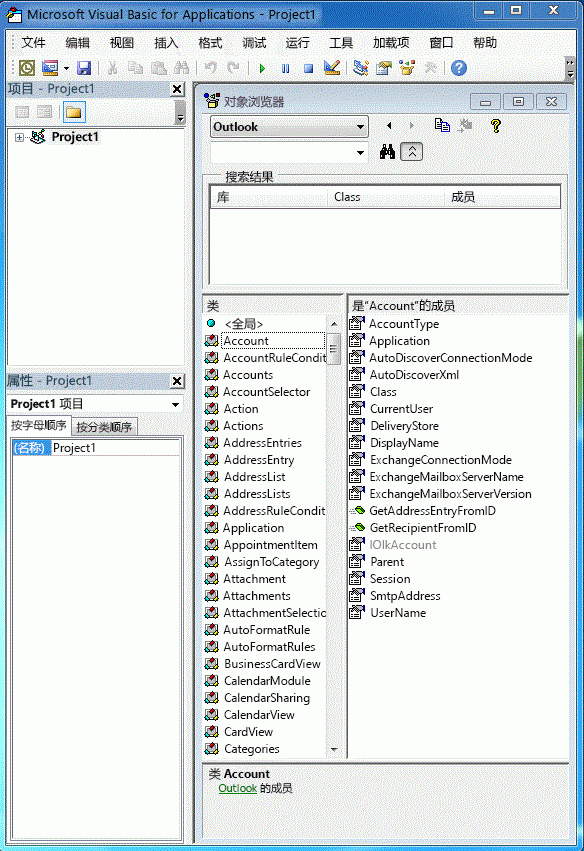
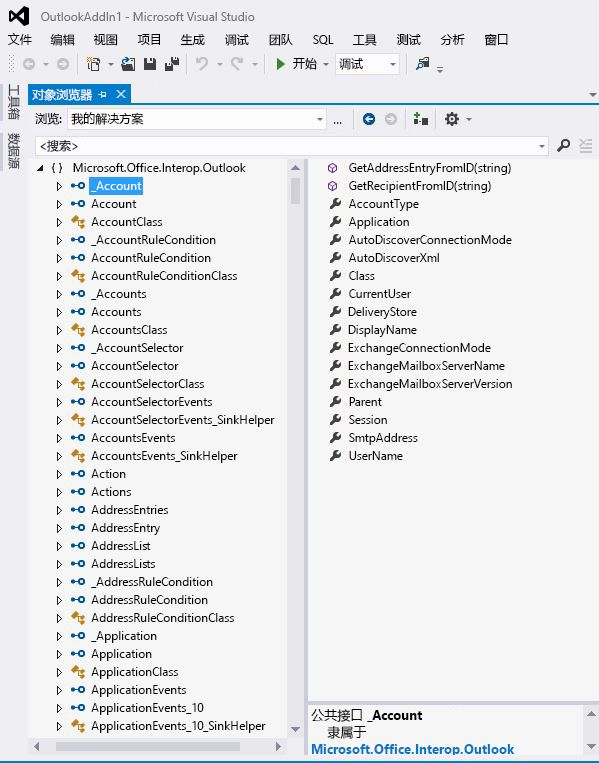

# 将 Outlook PIA 与对象模型相关联

Outlook 主互操作程序集 (PIA) 是 Outlook 正式发布的互操作程序集，为托管加载项定义了用于与基于 COM 的 Outlook 对象模型交互的托管接口。 [COM 和 .NET 之间的互操作性简介](introduction-to-interoperability-between-com-and-net.md)从技术角度介绍了互操作程序集如何支持对基于 COM 的类型库进行托管客户端编程。 本主题概述基于 COM 的 Outlook 对象模型中的对象和成员如何映射到 PIA 中对应的托管接口和类。

## 帮助程序对象

比较 Visual Basic 编辑器对象浏览器中列出的 Outlook 类型库对象（如图 1 所示）与 Visual Studio 对象浏览器中列出的 PIA 对象（如图 2 所示）时，可能会对 PIA 中的大量额外帮助程序对象不知所措。 您可能会注意到，有些对象（如 **Action** 对象）映射到一个接口 - [Action](https://msdn.microsoft.com/library/bb646971\(v=office.15\)) 接口，而其他对象（如 **Account** 对象）则不一定精确映射到 PIA 中的一个对应接口。

**图 1：显示基于 COM 的 Outlook 类型库中对象的对象浏览器**

**图 2：显示 Outlook 中对象的对象浏览器**

在这些接口中，许多接口的名称都以下划线字符（“\_”）开头，后跟对象名称。 例如，在 Visual Studio 对象浏览器中，**Account** 对象映射到公共接口 \_Account 和公共类 Account。 实际上，虽然 Visual Studio 对象浏览器中并未明确显示，但 **Account** 对象仍映射到 PIA 中的两个接口和一个类：即 [\_Account](https://msdn.microsoft.com/library/bb609471\(v=office.15\)) 接口、[Account](https://msdn.microsoft.com/library/bb645103\(v=office.15\)) 组件类和 [AccountClass](https://msdn.microsoft.com/library/bb645768\(v=office.15\)) 类。 

有关这些接口、coclass 和类，它们的来源以及这些对象如何从类型库映射到 PIA 的详细信息，请参阅 [Outlook PIA 中的对象](objects-in-the-outlook-pia.md)。

## 独立事件接口

如果检查有事件的对象，PIA 中的事件不会与该对象的其他方法和属性成员分在一组，而是经过分组形成自己的接口、事件处理程序和类。 

若要详细了解方法和属性如何从类型库映射到 PIA，请参阅 [Outlook PIA 中的方法和属性](methods-and-properties-in-the-outlook-pia.md)。 若要详细了解事件接口、委托和类，请参阅 [Outlook PIA 中的事件](events-in-the-outlook-pia.md)。

## 隐藏和弃用的对象

PIA 还包含 COM 对象模型中已弃用且视需要标记为隐藏的对象、成员和枚举。 其中大多数对象、成员和枚举都在 PIA 中公开。 但是，公开它们的目的是为了使 PIA 更加完整；它们不再供解决方案开发人员使用，因此记录最少。 也存在一些例外情况，如 **\_DocSiteControl** 和 **\_RecipientControl** 对象在类型库中虽然是隐藏的，但在 PIA 参考中却作为第一类对象进行公开和记录。 

若要详细了解 **\_DocSiteControl** 对象，请参阅 [\_DDocSiteControl](https://msdn.microsoft.com/library/bb609520\(v=office.15\))。 若要详细了解 **\_RecipientControl** 对象，请参阅 [\_DRecipientControl](https://msdn.microsoft.com/library/bb609501\(v=office.15\))。

