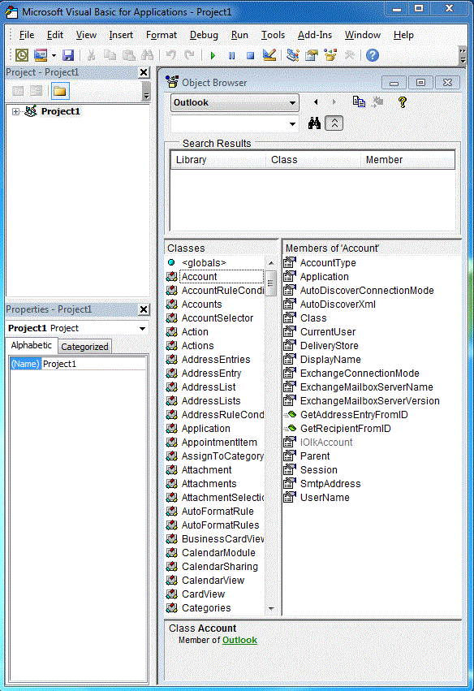

# 将 Outlook PIA 与对象模型相关联Relating the Outlook PIA with the Object Model

Outlook 主互操作程序集 (PIA) 是 Outlook 正式发布的互操作程序集，为托管加载项定义了用于与基于 COM 的 Outlook 对象模型交互的托管接口。The Outlook Primary Interop Assembly (PIA) is an interop assembly officially published by Microsoft Outlook defining a managed interface for managed add-ins to interact with the COM-based Outlook object model. [COM 和 .NET 之间的互操作性简介](introduction-to-interoperability-between-com-and-net.md)从技术角度介绍了互操作程序集如何支持对基于 COM 的类型库进行托管客户端编程。Introduction to Interoperability Between COM and .NET describes technically how an interop assembly supports a managed client programming against a COM-based type library. 本主题概述基于 COM 的 Outlook 对象模型中的对象和成员如何映射到 PIA 中对应的托管接口和类。This topic gives an overview of how objects and members in the COM-based Outlook object model are mapped to corresponding managed interfaces and classes in the PIA.

## 帮助程序对象Helper Objects

比较 Visual Basic 编辑器对象浏览器中列出的 Outlook 类型库对象（如图 1 所示）与 Visual Studio 对象浏览器中列出的 PIA 对象（如图 2 所示）时，可能会对 PIA 中的大量额外帮助程序对象不知所措。When you compare the objects of the Outlook type library listed in the object browser of the Visual Basic Editor, as in Figure 1, with the objects of the PIA listed in the object browser of Microsoft Visual Studio, as in Figure 2, you might be overwhelmed by the large number of extra helper objects that exist in the PIA. 您可能会注意到，有些对象（如 **Action** 对象）映射到一个接口 - [Action](https://msdn.microsoft.com/library/bb646971\(v=office.15\)) 接口，而其他对象（如 **Account** 对象）则不一定精确映射到 PIA 中的一个对应接口。You might notice that some objects, such as the **Action** object, maps to one interface, the [Action](https://msdn.microsoft.com/library/bb646971\(v=office.15\)) interface, but other objects, like the **Account** object, do not necessarily map to exactly one corresponding interface in the PIA.

**图 1：显示基于 COM 的 Outlook 类型库中对象的对象浏览器****Figure 1. Object browser showing objects in the COM-based Outlook 2007 type library**

**图 2：显示 Outlook 中对象的对象浏览器****Figure 2. Object browser showing objects in Outlook 2007 PIA.**

在这些接口中，许多接口的名称都以下划线字符（“\_”）开头，后跟对象名称。Among these interfaces, many of them have names that begin with an underscore ('_') followed by an object name. 例如，在 Visual Studio 对象浏览器中，**Account** 对象映射到公共接口 \_Account 和公共类 Account。For example, the Account object maps to a public interface _Account and a public class Account in the Visual Studio object browser. 实际上，虽然 Visual Studio 对象浏览器中并未明确显示，但 **Account** 对象仍映射到 PIA 中的两个接口和一个类：即 [\_Account](https://msdn.microsoft.com/library/bb609471\(v=office.15\)) 接口、[Account](https://msdn.microsoft.com/library/bb645103\(v=office.15\)) 组件类和 [AccountClass](https://msdn.microsoft.com/library/bb645768\(v=office.15\)) 类。In fact, though not shown explicitly in the Visual Studio object browser, the **Account** object is mapped to two interfaces and one class in the PIA: an _Account interface, an [Account](https://msdn.microsoft.com/library/bb609471\(v=office.15\)) coclass, and an [AccountClass](https://msdn.microsoft.com/library/bb645768\(v=office.15\)) class. 

有关这些接口、coclass 和类，它们的来源以及这些对象如何从类型库映射到 PIA 的详细信息，请参阅 [Outlook PIA 中的对象](objects-in-the-outlook-pia.md)。For more information about these interfaces, coclasses and classes, where they come from, and how objects are mapped from the type library to the PIA, see [Objects in the Outlook PIA](objects-in-the-outlook-pia.md).

## 独立事件接口Separate Event Interfaces

如果检查有事件的对象，PIA 中的事件不会与该对象的其他方法和属性成员分在一组，而是经过分组形成自己的接口、事件处理程序和类。If you examine objects that have events, events in the PIA are not grouped together with other method and property members of that object, but are grouped to form their own interfaces, event handlers, and classes. 

若要详细了解方法和属性如何从类型库映射到 PIA，请参阅 [Outlook PIA 中的方法和属性](methods-and-properties-in-the-outlook-pia.md)。For more information about how methods and properties are mapped from the type library to the PIA, see [Methods and Properties in the Outlook PIA](methods-and-properties-in-the-outlook-pia.md). 若要详细了解事件接口、委托和类，请参阅 [Outlook PIA 中的事件](events-in-the-outlook-pia.md)。For more information about event interfaces, delegates, and classes, see [Events in the Outlook PIA](events-in-the-outlook-pia.md).

## 隐藏和弃用的对象Hidden and Deprecated Objects

PIA 还包含 COM 对象模型中已弃用且视需要标记为隐藏的对象、成员和枚举。The PIA also contains objects, members, and enumerations that have been deprecated and optionally marked as hidden in the COM object model. 其中大多数对象、成员和枚举都在 PIA 中公开。Most of these objects, members, and enumerations are exposed in the PIA. 但是，公开它们的目的是为了使 PIA 更加完整；它们不再供解决方案开发人员使用，因此记录最少。However, they are exposed for the completeness of the PIA; they are no longer intended to be used by solution developers and are therefore minimally documented. 也存在一些例外情况，如 **\_DocSiteControl** 和 **\_RecipientControl** 对象在类型库中虽然是隐藏的，但在 PIA 参考中却作为第一类对象进行公开和记录。A few exceptions exist such as the _DocSiteControl and _RecipientControl objects, which are hidden in the type library but are exposed and documented as first class objects in the PIA reference. 

若要详细了解 **\_DocSiteControl** 对象，请参阅 [\_DDocSiteControl](https://msdn.microsoft.com/library/bb609520\(v=office.15\))。For more information about the **\_DocSiteControl** object, see [\_DDocSiteControl](https://msdn.microsoft.com/library/bb609520\(v=office.15\)). 若要详细了解 **\_RecipientControl** 对象，请参阅 [\_DRecipientControl](https://msdn.microsoft.com/library/bb609501\(v=office.15\))。For more information about the **\_RecipientControl** object, see [\_DRecipientControl](https://msdn.microsoft.com/library/bb609501\(v=office.15\)).

