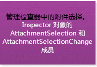

# 选择某个 API 或技术开发适用于 Outlook 的解决方案

本文介绍 API 和相关技术，用户可以将它们用于扩展 Outlook 2013 和 Outlook 2016，并帮助决定适用于用户方案的 API 或技术。
  
Microsoft 支持各类 API 以及扩展 Outlook 的技术： 
  
- 从 Office 2013 开始，适用于 Office 平台的应用为在桌面、平板电脑和智能手机上跨 Outlook 客户端扩展 Outlook 功能提供了实现的可能。此平台包括适用于 Office 的 JavaScript API 和适用于应用清单的架构。
    
- 对象模型、相应的 Outlook 主互操作程序集 (PIA) 和消息传递 API (MAPI) 已是 Outlook 解决方案中最常使用的 API。
    
- 辅助 API 在几种方案中补充了 MAPI。
    
- Outlook Social Connector (OSC) 提供程序可扩展性和天气栏可扩展性服务于其间隙市场的特定方案。
    
这篇文章介绍适用于 Office 外接程序平台、对象模型、PIA 和 MAPI 的选择条件。请注意，Office 外接程序使用适用于 Office 的 JavaScript API 并且不会调用对象模型，反之亦然。使用其他 API 的解决方案可以使用一个或多个 API。例如，在 C++ 中编写的 COM 外接程序可以在同一个解决方案中使用对象模型、MAPI 和辅助 API。
  
要从这篇文章获得最大收益，您应熟悉用户级别的 Outlook 并具备常规软件开发的知识。但是，不需要您全面了解这些 API 或相关技术支持的功能。本文可帮助回答下列问题：
  
- 如果您仅对您的解决方案的目标、目标市场和可用资源有所了解，那么在选择 API 时您还要考虑哪些其他条件？
    
- 为什么您要考虑 Office 外接程序，您应在何时选择创建应用程序而不是外接程序？
    
- 如果您的解决方案必须在早期版本的 Outlook（包括 Outlook 2003）中运行，那么它将对您的 API 选择有何影响？
    
- 如果您的解决方案必须在包含数千个项目的 Outlook 文件夹中循环执行操作，同时您需要修改这些项目，那么哪种 API 是最适合的？
    
- 如果您的解决方案非常依赖于 Outlook 业务逻辑，并且还与其他 Office 应用程序进行交互，那么 Outlook 对象模型是否为最佳选择？
    
- 对象模型和 MAPI 允许您在 Outlook 中扩展哪些项？
    
- 如果可以使用对象模型或 MAPI 来完成任务，那么应如何决定使用哪个 API 呢？

## 目标评估条件

此部分描述了可用于比较 Office 外接程序平台、对象模型、PIA 和 MAPI 的条件以确定哪一个可以更好地满足您的需求。不同条件的重要性的增减取决于您的项目和可用的资源。
  
此部分中的表格定义了以下类别的评估条件：
  
- 功能条件 - 介绍您可以或不可以借助技术执行的操作。
    
- 开发条件 - 介绍使用技术所需的开发工具或信息
    
- 安全条件 - 介绍与技术相关的安全和权限问题。
    
- 部署条件 - 介绍针对技术推荐的部署和分发方法。

### 适用于 Office 平台的相关应用的目标评估条件

从 Office 2013 开始，开发人员可以使用 Office 外接程序平台将 Web 服务和内容扩展到 Office 富客户端和 Web 客户端的上下文环境中。Office 外接程序是一个使用常见 Web 技术开发的网页，它托管在 Office 客户端应用程序（如 Outlook）中，并可在本地或在云中运行。在几种 Office 外接程序类型当中，Outlook 支持的类型被称为邮件应用程序。虽然对象模型、PIA 和 MAPI 通常用于在应用程序级别自动化 Outlook，然而您可以使用适用于 Office 的 JavaScript API 在项目级别与电子邮件的内容和属性、会议请求或约会进行交互。您可以将邮件应用程序发布到 Office 商店或内部 Exchange 目录。 
  
最终用户和管理员可以在 Exchange 邮箱上安装邮件应用程序，并在 Outlook 富客户端和 Outlook Web App 中使用邮件应用程序。作为开发人员，您可以选择仅限在桌面上使用的邮件应用程序，也可选择在平板电脑或智能手机上使用。图 1 显示了在[示例：创建邮件应用程序以查看 Outlook 中的 YouTube 视频](https://docs.microsoft.com/samples/browse/?redirectedfrom=MSDN-samples)中详细介绍的 YouTube 邮件应用程序的示例。YouTube 邮件应用程序允许最终用户选择 YouTube 视频的 URL 并在台式机或平板电脑上观看 Outlook 或 Outlook Web App 中的视频。
  
**图 1. 选定的邮件的 YouTube 邮件应用程序处于活动状态，其中包含指向 YouTube.com 上视频的 URL**

  
在用户安装邮件应用程序后，如果当前上下文与应用程序指定的激活条件匹配，则该应用程序可在应用程序栏中使用。邮件应用程序允许您指定有关当前所选项目的规则，以便仅在满足特定条件时才激活邮件应用程序。例如，仅当所选的 Outlook 项目包含一个指向 YouTube.com 上某个视频的 URL 时，才会关联使您可以在 Outlook 中播放 YouTube 视频的 YouTube 邮件应用程序。在这种情况下，您应指定仅在所选的邮件包含此类 URL 时该应用程序才应处于活动状态。
  
下表显示 Office 外接程序平台的评估条件。
  
#### 功能条件

|**条件**|**Office 平台的应用程序中提供的邮件应用程序支持**|
|:-----|:-----|
|应用程序域    |The scope of activity of a mail app is virtually any supported message or appointment item in the user's Exchange mailbox that the user has selected and that satisfies the activation conditions. The permissions of a mail app determine its access to the properties and specific entities (such as an email address or telephone number) that exist for that item. For example, a mail app requesting the **read/write mailbox** permission can read and write all the properties of any item in the user's mailbox; create, read, and write to any folder or item; and send an item from that mailbox.    |
|主要对象    |适用于 Office 的 JavaScript API 提供了由所有类型的 Office 外接程序共享的最高级别的一些对象：[Office](https://msdn.microsoft.com/library/c490b13d-ee52-4291-af5d-f4a5a11d3af0%28Office.15%29.aspx)、[Context](https://msdn.microsoft.com/library/662883d5-b86f-4bdc-99f0-9ee9129ed16c%28Office.15%29.aspx) 和 [AysncResult](https://msdn.microsoft.com/library/540c114f-0398-425c-baf3-7363f2f6bc47%28Office.15%29.aspx)。适用且特定于邮件应用程序的 API 中的下一个级别的对象包括 [Mailbox](https://msdn.microsoft.com/library/a3880d3b-8a09-4cf9-9274-f2682cb3b769%28Office.15%29.aspx)、[Item](https://msdn.microsoft.com/library/ad288df1-3ca2-474c-bea4-c51f46e6fc43%28Office.15%29.aspx) 和 [UserProfile](https://msdn.microsoft.com/library/6d0a36ec-0d5c-40e3-9f6f-9a7fcf0ac3d8%28Office.15%29.aspx) 对象，它们支持访问有关当前在用户邮箱中选定的用户和项目的信息。在数据级别， [CustomProperties](https://msdn.microsoft.com/library/95a69bd6-c4dc-429a-8b27-e2b68f74f3e3%28Office.15%29.aspx) 和 [RoamingSettings](https://msdn.microsoft.com/library/cf21bb08-7274-4ad6-ae9e-b2c12f92abc9%28Office.15%29.aspx) 对象都支持保留邮件应用程序分别为所选的项目和用户的邮箱设置的属性。项目级对象包括从 [Item](https://msdn.microsoft.com/library/08ebffff-eb52-4e21-9d4e-8f79e426f992%28Office.15%29.aspx) 继承的 [Appointment](https://msdn.microsoft.com/library/909ad9eb-a1bc-4caa-b51e-fd59a02b9569%28Office.15%29.aspx)和 **Message** 对象，以及从 [Message](https://msdn.microsoft.com/library/c658fa3d-1138-4a67-9a4b-c9edd11f8385%28Office.15%29.aspx) 继承的 **MeetingRequest** 对象。这些表示支持邮件应用程序的 Outlook 项目的类型：约会和会议的日历项和诸如电子邮件、会议请求、响应和取消等邮件项目。API 中除此级别外，还有项目级属性（如 [Appointment.subject](https://msdn.microsoft.com/library/ffa6812c-34b8-4b0a-8f92-22c3580c8379%28Office.15%29.aspx)） 以及支持某些已知的 [Entities](https://msdn.microsoft.com/library/1a06c8d1-dafe-46f4-967e-dd9b1d5b20e9%28Office.15%29.aspx) 对象（例如 [Contact](https://msdn.microsoft.com/library/2604b44c-7b79-47f0-ac3e-7d99bc9e6751%28Office.15%29.aspx)、[MeetingSuggestion](https://msdn.microsoft.com/library/9726fbff-0f4f-4b70-8deb-effc14607d4e%28Office.15%29.aspx)、[PhoneNumber](https://msdn.microsoft.com/library/cc86426a-2730-4774-9067-0611e5c8e9c1%28Office.15%29.aspx) 和 [TaskSuggestion](https://msdn.microsoft.com/library/16b0c3d6-adf4-4a88-ad09-4bb5565816b1%28Office.15%29.aspx)）的对象和属性。    请参阅[Outlook 外接程序体系结构和功能概述](https://msdn.microsoft.com/library/2cd5641b-492b-4431-8388-7fc589163e9c%28Office.15%29.aspx)，了解有关邮件应用程序支持的功能摘要。    |
|数据访问模型    |适用于 Office 的 JavaScript API 表示可作为一组分层对象的下列功能：应用程序的运行时环境、用户的邮箱和配置文件和与某个项目相关的数据。    |
|线程模型    |每个邮件应用程序都在独立于 Outlook 进程的自身进程中执行操作。    |
|应用程序体系结构    |在 Outlook 中，邮件应用程序是作为单独的进程托管在 Web 浏览器控件内的一组 HTML 和 JavaScript 网页，反过来，它们也可托管在提供安全和性能隔离的应用程序运行时进程内。    |
|远程使用情况    |邮件应用程序使用适用于 Office 的 JavaScript API 来访问有关当前用户、邮箱和存储在相应 Exchange Server 上的选定项目的数据。如果它们具有相应的权限并使用相应技术跨域进行访问，则邮件应用程序还可以调用 Exchange Web 服务和其他第三方 Web 服务来扩展其功能。    |
|事务    |适用于 Office 的 JavaScript API 不支持事务。    |
|可用性    |从 Outlook 2013 开始，适用于 Office 的 JavaScript API 可供 Exchange Server 2013 上的邮箱使用。    |
   
#### 开发条件

|**条件**|**Office 平台的应用程序中提供的邮件应用程序支持**|
|:-----|:-----|
|语言和工具    |您可以使用任何常见的 Web 技术（包括 HTML5、JavaScript、CSS3、XML 和 REST API）来实现邮件应用程序。您可以使用您的首选的 Web 开发工具。或者，使用 Napa、Visual Studio 2008，或这些工具的更高版本来提供了便利，节省您的开发时间。    |
|托管实现    |如果适用于您方案，则您可以使用托管的 .aspx 页来实现适用于您的邮件应用程序的服务器端代码。    |
|可脚本化    |适用于 Office 的 JavaScript API 可在脚本中直接使用。    |
|测试和调试工具    |您可以使用您喜欢的任何 Web 开发工具。Napa 和 Visual Studio 提供了方便进行应用程序测试和调试的集成开发环境。[排查 Outlook 外接程序激活问题](https://msdn.microsoft.com/library/da5b56c9-7fd1-4556-8c0e-f489c4c9e9b6%28Office.15%29.aspx)和[示例：Outlook 项目的调试属性](https://code.msdn.microsoft.com/office/Mail-apps-for-Outlook-faca78cd)提供了有关进行故障排除和调试邮件应用程序的更多帮助。    |
|专家可用性    |具有所需的 Web 开发专业技能级别的 Office 外接程序程序员相对比较容易找到。该平台适用于专业开发人员和非专业开发人员。    |
|可查看的信息    |有关开发和发布 Office 外接程序的信息可在[构建适用于 Office 和 SharePoint 的应用程序](https://msdn.microsoft.com/office/apps/fp160950.aspx)中找到。适用于邮件应用程序的特定文档可在[Outlook 外接程序](https://msdn.microsoft.com/library/71e64bc9-e347-4f5d-8948-0a47b5dd93e6%28Office.15%29.aspx)中找到。    |
|开发人员和部署许可    |请参阅 [许可 Office 和 SharePoint 加载项](https://msdn.microsoft.com/library/3e0e8ff6-66d6-44ff-b0c2-59108ebd9181%28Office.15%29.aspx)，了解有关 Office 外接程序应用程序许可证框架的信息。    |
   
#### 安全条件

|**条件**|**Office 平台的应用程序中提供的邮件应用程序支持**|
|:-----|:-----|
|设计时权限    |开发邮件应用程序不需要任何特定的权限。    |
|安装权限    |默认情况下，最终用户和管理员可以安装低信任度的需要“受限”**** 或“读取项”**** 权限的邮件应用程序，而管理员可以安装高信任度的需要“读/写邮箱”**** 权限的邮件应用程序。    |
|运行时权限    |邮件应用请求基于三层权限模型的特定权限级别：**受限**、**读取项**和**读/写邮箱**。    |
|内置的安全功能    | Office 外接程序运行时提供以下优越功能来阻止应用程序破坏最终用户的环境：     隔离应用程序在其中运行的进程。     不涉及 .dll 或 .exe 替换项或 ActiveX 组件。     让最终用户可以轻松安装或卸载应用程序。     管理员和最终用户有权控制可提供的邮件应用程序以及控制在安装邮件应用程序之前是否授予请求的权限。     在有富客户端的情况下，管理对内存和 CPU 的使用以防止受到拒绝服务的恶意攻击。    |
|安全监视功能    | 对于邮件应用程序，将监视以下资源：     CPU 内核使用率。     内存使用率。     故障数。     阻止应用程序的时长。     正则表达式响应时间。     重新计算正则表达式的次数。     管理员可以覆盖控制资源使用率的默认设置。    |
   
#### 部署条件

|**条件**|**Office 平台的应用程序中提供的邮件应用程序支持**|
|:-----|:-----|
|服务器平台要求    |为其安装邮件应用程序的用户邮箱必须使用的是 Exchange Server 2013 或更高版本。    |
|客户端平台要求    |对于将运行在 Outlook 富客户端、Outlook 2013 和 Internet Explorer 9 上或运行在这些应用程序的更高版本上的邮件应用程序，要求必须安装在本地计算机上。    |
|部署方法    |您可以将邮件应用程序发布到 Office 商店或发布到对该 Exchange Server 上的用户提供该应用程序的 Exchange 目录。然后，管理员或用户可以通过使用 Exchange 管理中心 (EAC) 或通过运行远程 Windows PowerShell cmdlet，选择从 Office 商店或 Exchange 目录安装邮件应用程序。您可以从 Outlook Backstage 视图或 Outlook Web App，或通过直接登录到您邮箱的 EAC 来访问 EAC。    有关详细信息，请参阅[部署和安装 Outlook 外接程序以进行测试](https://msdn.microsoft.com/library/d6eea4c4-bb21-4f24-bcba-1eccbb4e12dd%28Office.15%29.aspx)。    |
|部署说明    |一旦您在 Outlook 或 Outlook Web App 上安装了邮件应用程序，该邮件应用程序即可在这两个 Outlook 客户端上供该邮箱使用。    |

### 对象模型和 PIA 的目标评估条件

在客户端计算机上运行的解决方案可以使用 Outlook 对象模型或 PIA 以编程方式访问 Outlook 项目，如联系人、邮件、日历项目、会议请求和任务。与 MAPI 不同，Outlook 对象模型和 PIA 可以提供 Outlook 用户界面更改的事件通知，例如更改当前文件夹或显示 Outlook 检查器。
  
> [!NOTE]
> 对于访问 Microsoft Exchange 邮箱或个人文件夹 (.pst) 文件中存储的数据的解决方案，必须在运行应用程序的客户端计算机上安装并配置 Outlook。> Outlook 对象模型和 PIA 支持相同的功能来扩展 Outlook。PIA 定义托管接口，此接口可映射到基于 COM 的对象模型，并能与托管解决方案交互。在本节后面的讨论中，大部分功能、安全性和部署条件都以相同方式应用于对象模型和 PIA。若要详细了解 PIA 如何促进实现 COM 和 .NET Framework 之间的互操作性，请参阅 [COM 和 .NET 之间的互操作性简介](https://msdn.microsoft.com/library/6b2d099a-ec6f-4099-aaf6-e61003fe5a32%28Office.15%29.aspx)和 [Outlook PIA 体系结构](https://msdn.microsoft.com/library/89577d14-e6e2-4270-8e72-b0adba378667%28Office.15%29.aspx)。 
  
下表显示 Outlook 对象模型和 PIA 的评估条件。
  
#### 功能条件

|**条件**|**Outlook 对象模型或 PIA**|
|:-----|:-----|
|应用程序域    |使用 Outlook 对象模型或 PIA 的外接程序或独立的应用程序通常处理特定于用户的邮件、自定义 Outlook 用户界面，或创建适用于特定解决方案（如与 Outlook 集成的客户关系管理 (CRM) 解决方案）的自定义项类型。Outlook 对象模型或 PIA 有时会在非正式的工作流过程中（尤其是在不允许在 Microsoft Exchange 服务器上进行应用程序开发时）用于邮件处理。与基于浏览器的客户端不同的是，当用户在处于脱机状态或与公司网络断开连接时，缓存模式操作允许执行 Outlook 解决方案。    |
|主要对象    |Outlook 对象模型和 PIA 中的顶级对象为 Outlook [Application](https://msdn.microsoft.com/library/797003e7-ecd1-eccb-eaaf-32d6ddde8348%28Office.15%29.aspx) 对象。 [Explorers](https://msdn.microsoft.com/library/8398532a-1fad-7390-6778-109ac5e6c67c%28Office.15%29.aspx)、[Conversation](https://msdn.microsoft.com/library/2705d38a-ebc0-e5a7-208b-ffe1f5446b1b%28Office.15%29.aspx)、[Inspectors](https://msdn.microsoft.com/library/b65475d6-a212-fc96-459d-47390dfe5ee5%28Office.15%29.aspx)、[Views](https://msdn.microsoft.com/library/5dd7edc2-12a2-f4c2-d158-8053d80e8dc9%28Office.15%29.aspx)、[NavigationPane](https://msdn.microsoft.com/library/b6538c72-6115-99fc-c926-e0532a747823%28Office.15%29.aspx)、[SolutionsModule](https://msdn.microsoft.com/library/4597765e-a95d-bf07-2ac4-103218ebc696%28Office.15%29.aspx)、[FormRegion](https://msdn.microsoft.com/library/3a0b83eb-4076-9cb3-86a9-68f9e44df89f%28Office.15%29.aspx) 和相关的对象表示 Outlook 用户界面的元素。 [NameSpace](https://msdn.microsoft.com/library/f0dcaa19-07f5-5d42-a3bf-2e42b7885644%28Office.15%29.aspx)、[Stores](https://msdn.microsoft.com/library/8915a8e4-9c22-21d5-c492-051d393ce5f7%28Office.15%29.aspx)、[Folders](https://msdn.microsoft.com/library/0c814c3c-74fc-414c-982d-a0097fcb35c2%28Office.15%29.aspx)、[Accounts](https://msdn.microsoft.com/library/2510b7d7-5062-8ea3-dda4-b544d2882a2b%28Office.15%29.aspx)、[AccountSelector](https://msdn.microsoft.com/library/846f176e-5680-a214-7624-75f3a524c989%28Office.15%29.aspx)、[AddressEntries](https://msdn.microsoft.com/library/db91b717-07c6-d1f2-c545-b766ee1f0c6b%28Office.15%29.aspx)、[ExchangeUser](https://msdn.microsoft.com/library/6ec117d1-7fdb-aa36-b567-1242f8238df0%28Office.15%29.aspx) 和相关的对象支持扩展 Outlook 会话、配置文件、用户帐户、邮件存储和文件夹。在数据级别，大量的项目级对象，例如 [MailItem](https://msdn.microsoft.com/library/14197346-05d2-0250-fa4c-4a6b07daf25f%28Office.15%29.aspx)、[AppointmentItem](https://msdn.microsoft.com/library/204a409d-654e-27aa-643a-8344c631b82d%28Office.15%29.aspx)、[ContactItem](https://msdn.microsoft.com/library/8e32093c-a678-f1fd-3f35-c2d8994d166f%28Office.15%29.aspx) 和 [TaskItem](https://msdn.microsoft.com/library/5df8cfa5-5460-a5a1-a130-ba5bca1a0091%28Office.15%29.aspx) 表示内置的 Outlook 项类型。 [PropertyAccessor](https://msdn.microsoft.com/library/2fc91e13-703c-3ec9-9066-ffee7144306c%28Office.15%29.aspx)、[Table](https://msdn.microsoft.com/library/0affaafd-93fe-227a-acee-e09a86cadc20%28Office.15%29.aspx)、[Search](https://msdn.microsoft.com/library/226a5d49-3caf-90dd-725c-265404d1939f%28Office.15%29.aspx)、[ItemProperties](https://msdn.microsoft.com/library/34a110ed-6617-72da-1e98-a9773c705b40%28Office.15%29.aspx)、[UserDefinedProperties](https://msdn.microsoft.com/library/196e5d4c-22be-02d3-95e0-3ea7594c2e4b%28Office.15%29.aspx)、[Attachments](https://msdn.microsoft.com/library/4cc96a5f-a822-8ad5-6f61-e996bee8ba22%28Office.15%29.aspx)、[Categories](https://msdn.microsoft.com/library/319efa26-269d-9f2f-c8ec-33082e80a9e2%28Office.15%29.aspx)、[Recipients](https://msdn.microsoft.com/library/774f56b7-4de8-9584-60cd-4fbf361f4c85%28Office.15%29.aspx)、[RecurrencePattern](https://msdn.microsoft.com/library/36c098f7-59fb-879a-5173-ed0260d13fa4%28Office.15%29.aspx)、[Reminders](https://msdn.microsoft.com/library/66b94251-7fe4-886b-7c29-7feac4440dee%28Office.15%29.aspx)、[Rules](https://msdn.microsoft.com/library/dd41b4de-bf5f-5532-46c9-394a5d078bec%28Office.15%29.aspx) 和相关的对象支持自定义和处理项目级对象。    |
|数据访问模型    |Outlook 对象模型和 PIA 表示作为带有层次结构的一组对象和集合的所有数据。    |
|线程模型    |在 Outlook 的主前台线程上执行所有对 Outlook 对象模型和 PIA 的调用。Outlook 对象模型支持的唯一线程模型是单线程单元 (STA)。从后台线程调用 Outlook 对象模型或 PIA 是不受支持的并且会导致您的解决方案出错和出现意外的结果。    |
|应用程序体系结构    |通常，COM 外接程序和其他 Office 应用程序使用 Outlook 对象模型扩展 Outlook。托管的解决方案可以使用 Visual Studio 和.NET Framework 的 Outlook PIA 和 COM 互操作性层来访问 Outlook 对象模型。Visual Studio 提供模板和其他类库和清单以方便使用 Office 文档和应用程序自定义项。有关使用 Visual Studio 为 Outlook 开发托管的外接程序的详细信息，请参阅[Architecture of Application-Level Add-Ins](https://msdn.microsoft.com/library/978f102f-15c6-44e4-84e8-80b161408324.aspx)和 [Outlook Solutions](https://msdn.microsoft.com/library/2ae3cd9c-bf31-4efa-8b18-b6b1c34a8d93.aspx)。Outlook 对象模型还支持 Visual Basic for Applications (VBA) 宏和 Windows Scripting Host (WSH)，但不支持 Windows 服务应用程序。    |
|远程使用情况    |可以仅在安装了 Outlook 的计算机上使用 Outlook 对象模型和 PIA。可以使用 Outlook 对象模型来访问存储在 Exchange 中的可在 Outlook 应用程序中使用的信息。    |
|事务    |Outlook 对象模型和 PIA 不支持事务。    |
|可用性    |Outlook 对象模型当前可在 Outlook 的所有版本中使用。从 Outlook 2003 开始，PIA 可在 Outlook 版本中使用。每个新版本的 Outlook 中都具有扩展项和改进项。    |
   
#### 开发条件

|**条件**|**Outlook 对象模型或 PIA**|
|:-----|:-----|
|语言和工具    |可使用任意 COM 或自动化兼容语言（例如 Visual Basic 或 C#）及非 COM 语言（例如本机 C 或 C++）实现 Outlook 对象模型应用程序。Microsoft Visual Studio 2010 中的 Microsoft Office 开发工具是用于针对 Outlook 2010 和 Outlook 2007 开发托管加载项的首选工具。适用于 Microsoft Office 系统的 Microsoft Visual Studio 2005 工具是 Outlook 2003 的首选工具。你还可使用 Visual Studio 2010 中的 Office 开发工具创建适合 32 位和 64 位版本 Outlook 的解决方案。使用 Visual Studio 2010 中的 Office 开发工具或适用于 Microsoft Office 系统的 Microsoft Visual Studio 工具构建解决方案时，请对同时适合 32 位和 64 位版本 Outlook 2010 的托管解决方案中的目标执行结果指定“**任意 CPU**”选项。  |
|托管实现    |Outlook PIA 使 Outlook 对象模型可用在托管代码环境中，它将受到一组类库和支持技术的支持，从而可处理对 VBA 和 COM 外接程序的多个限制。PIA 是充当托管环境和 COM 环境之间桥梁的 COM 包装。有关详细信息，请参阅[为什么要使用 Outlook PIA](https://msdn.microsoft.com/library/5cc9085e-7c97-4698-8cb9-e33e427c02e7%28Office.15%29.aspx)。    |
|可脚本化    |可以在脚本中使用 Outlook 对象模型。    |
|测试和调试工具    |使用 Outlook 对象模型或 PIA 不需要任何特殊的调试工具。另一方面，您可以使用 Visual Studio 提供方便进行应用程序测试和调试的集成开发环境。    |
|专家可用性    |通过使用 Outlook 对象模型或 PIA 成功地开发应用程序的开发人员相对容易找到。Outlook 对象模型和 PIA 适用于使用常用的开发工具（如 Visual Studio）创建的外接程序。这些工具提供可简化开发过程的设计时环境。    |
|可查看的信息    |Microsoft 和第三方资源提供了有关通过使用 Outlook 对象模型进行编程的信息。有关 Outlook 对象模型的详细信息，请参阅 [Outlook 2010 开发人员参考](https://msdn.microsoft.com/library/75e4ad96-62a2-49d2-bc51-48ceab50634c%28Office.15%29.aspx)。有关 Outlook PIA 的详细信息，请参阅 [Outlook 2010 主互操作程序集引用](https://msdn.microsoft.com/library/54bdde85-8dc9-4498-a1ac-f72eaf8f0cd3%28Office.15%29.aspx)。有关通过在 Visual Studio 中使用 Office 开发工具开发的托管 Outlook 解决方案的示例，请参阅[使用 Visual Studio 创建的 Outlook 解决方案](https://msdn.microsoft.com/vsto/dd162450.aspx)。    |
|开发人员和部署许可    |请参阅您的 Exchange 和 Microsoft Developer Network (MSDN) 订阅许可协议以确定在您的应用程序中使用 Outlook 和 Outlook 对象模型是否需要其他许可证。    |
   
#### 安全条件

|**条件**|**Outlook 对象模型或 PIA**|
|:-----|:-----|
|设计时权限    |通过使用 Outlook 对象模型或 PIA 开发应用程序不需要任何特殊的权限。    |
|安装权限    |安装使用 Outlook 对象模型或 PIA 的应用程序不需要任何特殊权限。但是，安装 Office 和 Outlook 需要本地管理员权限。    |
|运行时权限    |运行使用 Outlook 对象模型或 PIA 的应用程序不需要任何特殊权限。    |
|内置的安全功能    |Outlook 对象模型和 PIA 通过使用 MAPI 与 Exchange 进行通信，通过使用 Active Directory 服务接口 (ADSI) 与 Active Directory 进行通信。运行应用程序的用户的当前安全上下文可用于确定代码可访问的资源。默认情况下，信任外接程序对 Outlook 对象模型或 PIA 中的所有对象、属性和方法具有完全访问权限。IT 管理员可以控制哪些外接程序和对象可以访问 Outlook 对象模型或 PIA。Outlook 对象模型和 PIA 阻止运行在 Outlook 进程外部的代码访问安全对象和方法。    |
|安全监视功能    | Outlook 监视外接程序的下列指标以确定是否应禁用该外接程序：     启动     关闭     文件夹切换     项目打开    **Invoke** 频率     管理员可以使用组策略覆盖用户设置，并控制在用户计算机上运行的外接程序。     有关详细信息，请参阅 [保持启用外接程序的性能标准](https://msdn.microsoft.com/library/office/4c6d44d2-238b-42d8-896b-51d513c9e14c#ol15WhatsNew_AddinDisabling)。    |
   
#### 部署条件

|**条件**|**Outlook 对象模型或 PIA**|
|:-----|:-----|
|服务器平台要求    |Outlook 对象模型和 PIA 是客户端技术。    |
|客户端平台要求    |使用 Outlook 对象模型或 PIA 访问 Exchange 数据的应用程序要求在本地计算机上安装 Outlook。    |
|部署方法    |使用 Outlook 对象模型或 PIA 的应用程序通过使用标准的应用程序安装软件进行分发。    |
|部署说明    |因为不应在 Exchange Server 上安装 Outlook，所以使用 Outlook 对象模型或 PIA 的应用程序无法在 Exchange Server 上运行。    |

### MAPI 的目标评估标准

您可以使用 MAPI 来访问公用和私人存储中的项目和文件夹，以及访问通过每个项目存储的属性。所有版本的 Outlook 都使用 MAPI。您可以创建使用 MAPI 的客户端，也可以创建 MAPI 服务器和 MAPI 窗体处理程序。此部分中的信息仅适用于 MAPI 客户端应用程序。
  
> [!NOTE]
> MAPI 是用于访问在 Exchange 或个人文件夹 (.pst) 文件中的信息的成熟机制，并且 MAPI 提供了一些在任何其他 API 中不提供的功能。但是，在 Intranet 外部 MAPI 不起作用，而且它在 MAPI 会话持续进行的时间段中还要维护打开的连接，同时 MAPI 学起来也比较难。MAPI 不会强制执行 Outlook 业务逻辑，因此您必须特别小心以确保对 Outlook 业务逻辑的维持。 
  
下表显示了对 MAPI 的评估条件。
  
#### 功能条件

|**条件**|**MAPI**|
|:-----|:-----|
|应用程序域    |使用 MAPI 的客户端应用程序访问存储在 Exchange 中的用户邮箱或公用文件夹信息以及存储在 Active Directory 中的用户目录信息。使用 MAPI 的客户端应用程序通常是电子邮件客户端（如 Outlook）和需要进行复杂电子邮件处理的应用程序。    |
|主要对象    |MAPI 对象全部通过 [IMAPISession： IUnknown](https://msdn.microsoft.com/library/5650fa2a-6e62-451c-964e-363f7bee2344%28Office.15%29.aspx) 界面获取。会话对象提供对对象的客户端访问，以使用 MAPI 配置文件、状态、邮件服务提供程序管理、邮件存储表和通讯簿。邮件存储表包含有关邮件存储、文件夹、邮件、附件和收件人的对象。地址簿表包含有关邮件用户和通讯组列表的对象。    |
|数据访问模型    |MAPI 表示作为一组分层对象的邮件和用户。    |
|线程模型    |没有特定的线程处理限制。但是，由于封送对象的成本较高，使用自由线程的应用程序应避免在多个线程中共享 MAPI 对象。MAPI 和 MAPI 服务提供程序使用自由线程。    |
|应用程序体系结构    |MAPI 客户端应用程序通常是基于 Windows 窗体的客户端应用程序。但是，您可以使用 MAPI 编写 N 层应用程序。    |
|远程使用情况    |MAPI 使用远程过程调用 (RPC) 与 Exchange Server 进行通信。通常有意阻止 RPC 通过 Internet 防火墙。    |
|事务    |MAPI 不支持事务。    |
|可用性    |MAPI 存根当前附带 Windows 的所有版本。在安装 Outlook 时，Office 安装它自己的 MAPI 子系统。此时预计不会对 MAPI 进行任何更改。    |
   
#### 开发条件

|**条件**|**MAPI**|
|:-----|:-----|
|语言和工具    |您可以通过使用 C 或 C++ 来直接访问 MAPI。可以访问 C/C++ 调用会议的其他语言可能无法访问 MAPI。不支持使用托管语言，如 Visual Basic 或 C# 。您必须为 32 位和 64 位版本的 Outlook 编译单独的 MAPI 解决方案。    |
|托管实现    |MAPI 是一个非托管的组件。在 Visual Studio 和.NET Framework 的 COM 互操作性层下不支持使用 MAPI。有关托管组件的 MAPI 支持的详细信息，请参阅知识库文章 [266353：客户端消息开发的支持准则](https://go.microsoft.com/fwlink/?LinkId=133254)。    |
|可脚本化    |不能在脚本中直接使用 MAPI。    |
|测试和调试工具    |不需要任何特殊的调试工具来调试使用 MAPI 的应用程序。另一方面，您可以使用 [MFCMAPI](https://mfcmapi.codeplex.com/)。MFCMAPI 通过图形用户界面使用 MAPI 来提供对 MAPI 存储的访问，当您通过使用 MAPI 来扩展 Outlook 时还能促进对问题进行调查。    |
|专家可用性    |专家 MAPI 编程人员可能很难找，并且学习该技术可能需要很长时间。除了 Microsoft 社区，只有一小部分高质量的第三方网站提供了有关 MAPI 开发的有用信息。    |
|可查看的信息    |介绍 MAPI 编程的 Microsoft 和第三方书籍均可用。    |
|开发人员和部署许可    |开发使用 MAPI 的应用程序不需要特殊许可。    |
   
#### 安全条件

|**条件**|**MAPI**|
|:-----|:-----|
|设计时权限    |开发人员必须有权访问 Exchange 存储中的数据。Exchange 会将用户和通讯组列表信息存储在 Active Directory 中，因此创建访问该信息的 MAPI 客户端应用程序的开发人员必须能够检索和设置该信息。    |
|安装权限    |设置基于 MAPI 的应用程序通常要求用户是本地管理员或有权安装软件。    |
|运行时权限    |运行基于 MAPI 的应用程序通常仅需要用户具有足够的权限来访问 Exchange 存储或个人文件夹 (.pst) 文件上的数据。    |
|内置的安全功能    |MAPI 配置文件在大多数平台上受密码保护。    |
   
#### 部署条件

|**条件**|**MAPI**|
|:-----|:-----|
|服务器平台要求    |为 MAPI 客户端应用程序的用户存储用户数据所在的 Exchange Server 必须经过正确配置，以允许 MAPI 客户端进行访问。    |
|客户端平台要求    |客户端应用程序安装程序应该验证 MAPI 的正确版本是否可在计算机上使用，是否通过使用 Mapisvc.inf 文件正确完成了配置。    |
|部署方法    |可以通过使用标准的软件分发技术将使用 MAPI 的应用程序部署到客户端计算机。    |
|部署说明    |安装程序应该验证正确版本的 MAPI 是否可用。    |

## 适用于 Office 平台的应用的决定因素

因为 Office 外接程序使用 Web 技术，所以它们最适合连接到云或本地服务，并将服务引入富客户端和 Web 客户端的上下文环境。通过请求适当的权限，邮件应用程序还允许在邮箱中执行读取、写入或发送邮件的操作。
  
与外接程序相比，邮件应用程序是开发人员的更好选择的常见原因如下：
  
- 您可以使用现有知识和 Web 技术（如 HTML、JavaScript 和 CSS）的优点。对于高级用户和开发人员新手来说，提升 XML、HTML 和 JavaScript 技能所需的时间比起基于 COM 的 API（包括对象模型和 MAPI）要少很多。
    
- 您可以使用简单的 Web 部署模型来更新 Web 服务器上的邮件应用程序（包括应用程序使用的 Web 服务）而无需在 Outlook 客户端上执行任何复杂的安装。事实上，对邮件应用程序（应用程序清单除外）的任何更新都不需要在 Office 客户端上进行任何更新。您只需在 Web 服务器上就可以方便地对邮件应用程序的代码或用户界面进行更新。这在更新外接程序所涉及的管理开销方面提供了明显的优势。
    
- 您可以对邮件应用程序使用常见的 Web 开发平台，使它能够在桌面、平板电脑和智能手机上跨 Outlook 富客户端和 Outlook Web App 进行漫游。另一方面，外接程序使用 Outlook 富客户端的对象模型，只能在台式机设备类型上的该富客户端上运行。
    
- 通过 Office 商店，您可以快速完成生成和发布应用程序操作。
    
- 由于三层权限模型的原因，用户和管理员会觉得邮件应用程序比外接程序具有更好的安全性和隐私性，它对用户的配置文件中的每个帐户的内容都具有完全访问权限。因此反过来，也会促进用户使用该应用程序。
    
- 根据您的方案，将存在一些您可以使用但外接程序不支持的专用于邮件应用程序的功能：
    
  - 您可以只针对某些上下文环境指定要激活的邮件应用程序（例如，仅当用户选定的约会的邮件类是 IPM.Appointment.Contoso，或者电子邮件的正文包含程序包跟踪号码或客户标识符时，Outlook 才将该应用程序显示在应用程序栏中）。
    
  - 如果所选的邮件中包含一些已知的实体，如地址、联系人、电子邮件地址、会议建议或任务建议，则您可以激活某个邮件应用程序。
    
  - 您可以充分利用标识令牌的身份验证功能以及 Exchange Web 服务。
    
但是，以下功能仅针对外接程序，因此在某些情况下可能使得您选择外接程序比选择邮件应用程序更合适：
  
- 您可以在应用程序级别使用外接程序来扩展或自动化 Outlook，因为对象模型和 PIA 已经广泛地与 Outlook 功能（如所有 Outlook 项类型、用户界面、会话和规则）实现了集成。在项目级别，外接程序可以在阅读或撰写模式下与项目进行交互。使用邮件应用程序，您就不能在应用程序级别自动化 Outlook，并且在用户邮箱中，您只能在受支持的项目（邮件和约会）的只读模式上下文环境中扩展 Outlook 的功能。
    
- 您可以指定新项目类型的自定义业务逻辑。
    
- 您可以在功能区和 Backstage 视图中修改并添加自定义命令。
    
- 您可以显示自定义窗体页或窗体区域。
    
- 您可以检测事件，如发送邮件或修改邮件属性。
    
- 可以在 Outlook 2013 和 Exchange Server 2013 以及 Outlook 和 Exchange 的早期版本上使用加载项。另一方面，从 Outlook 2013 和 Exchange Server 2013 开始，邮件应用程序可以使用 Outlook 和 Exchange，而不能使用它们较早的版本。
    
有关对象模型和 PIA 支持的方案的详细信息，请参阅下一节[对象模型或 PIA 的决定因素](#OLSelectAPI_FactorsOM)。有关对 Office 外接程序平台与其他 Office 相关扩展性技术的比较，请参阅 [Office 和 SharePoint 相关应用程序的背景](https://blogs.msdn.com/b/officeapps/archive/2012/07/23/introducing-apps-for-the-new-office-and-sharepoint.aspx)。

## 对象模型或 PIA 的决定因素

### Outlook 对象模型或 PIA 支持的主要基准方案

一般情况下，如果解决方案自定义 Outlook 用户界面或依赖于 Outlook 的业务逻辑，请使用对象模型或 PIA。 以下是 Outlook 解决方案使用对象模型或 PIA 时对应的主要基准方案。 
  
- [自定义 Outlook 用户界面](#OLSelectAPI_CustomizeTheOutlookInterface)
- [添加、删除、读取、写入、筛选、搜索或排序 Outlook 项目](https://docs.microsoft.com/office/vba/outlook/How-to/Items-Folders-and-Stores/outlook-item-objects)
- [自定义项目属性、字段和窗体](#OLSelectAPI_ItemPropFieldsForms)
- [处理 Outlook 事件，如切换文件夹或打开项目](#OLSelectAPI_Events)
- [自动运行 Outlook 并与其他 Office 应用程序集成](#OLSelectAPI_AutomateOutlook)

<!--Images removed because we can't add a link to the images. If someone figures out a way to do this, you can add them back in but they're not really needed; I replaced them with a bulleted list here and after the next paragraph: 

-->

### 从 Outlook 2007 开始，对象模型或 PIA 支持的方案

除了这些基准方案，如果你的 Outlook 解决方案支持以下列表中的任一方案并且你的解决方案适合运行在 Outlook 2007 或更高版本，而非早期版本上，那么你可以使用对象模型或 PIA。 本节指定你可以在 Outlook 对象模型中用来扩展每种方案的主对象或成员（Visual Studio 自动化对象模型中的 [IDTExtensibility2](https://docs.microsoft.com/dotnet/api/extensibility.idtextensibility2?view=visualstudiosdk-2017) 接口和 Office 对象模型中的 [IRibbonExtensibility](https://docs.microsoft.com/office/vba/api/Office.IRibbonExtensibility) 接口除外，你可以将这些接口与 Outlook 对象模型进行集成）。 

- [自定义 Outlook UI：Office Fluent 功能区、导航窗格、任务窗格](#OLSelectAPI_CustomizeTheOutlookInterface)
- [将窗体自定义为窗体区域并通过加载项进行部署](#OLSelectAPI_CustomFormRegions)
- [设置和获取未在对象模型中公开的内置项目级属性](#OLSelectAPI_CustomizingProperties)
- [枚举和查看文件夹中的多个项目](#OLSelectAPI_Enumerating)
- [将项目标记为任务](#OLSelectAPI_ItemsFlag)
- [共享日历、RSS 源和文件夹](#OLSelectAPI_Sharing)
- [添加、删除、保存和获取区块级别、路径、大小和附件类型](#OLSelectAPI_Attachments)
- [管理规则、时区和视图](#OLSelectAPI_Misc)
- [向当前配置文件的主类别列表添加或删除类别](#OLSelectAPI_Categories)
- [获取当前配置文件中帐户的详细信息](#OLSelectAPI_PrimaryAccount)
- [将 Exchange 通讯组列表或用户的详细信息作为地址条目获取](#OLSelectAPI_AddressBook)
- [存储解决方案的专用数据](#OLSelectAPI_StoringData)

<!--More removed images

-->

### 从 Outlook 2010 开始，对象模型或 PIA 支持的方案

如果你的 Outlook 解决方案适合运行在 Outlook 2010 上，而不是早期版本上，则可以选择使用对象模型或 PIA 来支持下一节所示的方案。 本节指定你可以在 Outlook 对象模型中用来扩展每种方案的主对象或成员（Office 对象模型中的 [IRibbonControl](https://docs.microsoft.com/office/vba/api/Office.IRibbonControl)、[IRibbonExtensibility](https://docs.microsoft.com/office/vba/api/Office.IRibbonExtensibility) 和 [IRibbonUI](https://docs.microsoft.com/office/vba/api/Office.IRibbonUI) 接口除外，你可以将这些接口与 Outlook 对象模型集成）。 
   
- [自定义 Outlook 2010 UI，如 Office Backstage 视图和上下文菜单](#OLSelectAPI_CustomizingUIOutlook2010)
- [管理和访问对话中的异类项目](#OLSelectAPI_Conversations)
- [在资源管理器中管理项目选择或查找所选项目](#OLSelectAPI_ItemSelection)
- [管理检查器中的附件选择](#OLSelectAPI_AttachmentSelection)
- [在一个配置文件中支持多个 Exchange 帐户](#OLSelectAPI_MultipleAccounts)
- [为地址条目创建联系人卡片](https://docs.microsoft.com/office/vba/api/Outlook.NameSpace.CreateContactCard)
- [在解决方案模块中组织特定于解决方案的文件夹](#OLSelectAPI_Folders)

<!--more removed images:

-->

### 从 Outlook 2013 开始，对象模型或 PIA 支持的方案

如果你的解决方案适合运行在 Outlook 2013 上，而不是早期版本上，则可以使用对象模型或 PIA 来支持以下资源中所示的方案。

- [显示当前文件夹中所有联系人的视图](https://docs.microsoft.com/office/vba/api/Outlook.peopleview)
- [在阅读窗格中选择内联响应](#OLSelectAPI_InlineResponse)
- [显示联系人的检查地址或全名对话框](#OLSelectAPI_ContactCheckDialogs)
- [检测是否已完成读取项目属性](https://docs.microsoft.com/office/vba/outlook/How-to/Items-Folders-and-Stores/outlook-item-objects)

<!--more removed images:

-->

## MAPI 的决定因素

通常情况下，您使用 MAPI 来访问基于 MAPI 的服务器上的数据（如 Microsoft Exchange Server）并执行以下任务：
  
- 创建自定义服务提供程序，如通讯簿提供程序、传输提供程序或存储提供程序。
    
- 创建一个接收器进程。
    
- 创建或管理配置文件。
    
- 运行作为 Windows NT 服务的应用程序。
    
- 在后台线程上运行任务。例如，枚举文件夹中的多个项目和修改后台线程中项目的属性可以优化性能。
    
有关详细信息和代码示例，请参阅 [Outlook MAPI 引用](https://msdn.microsoft.com/library/3d980b86-7001-4869-9780-121c6bfc7275%28Office.15%29.aspx)和 [MFCMAPI](https://mfcmapi.codeplex.com/)。
  
此外，如果您的解决方案运行在早于 Outlook 2007 的 Outlook 版本上，并且如下所示的方案已应用到您的解决方案，则您应使用 MAPI 来扩展这些方案。
  
- 设置和获取未在对象模型中公开的内置项目级属性。
    
- 管理帐户、附件、Exchange 通讯组列表、Exchange 用户或存储。
    
- 存储解决方案的专用数据。
    
- 管理帐户的邮件存储。
    
从 Outlook 2007 开始，对象模型可以支持许多功能，而在 Outlook 2007 之前，开发人员将不得不求助于 MAPI 或其他 API（如 Microsoft 协作数据对象 (CDO) 1.2.1 和 Microsoft Exchange 客户端扩展）。因此如果上面列表中的任何方案适用于您的解决方案，但您的解决方案运行在 Outlook 2007 或 Outlook 2010 中，您可以并且应该使用 Outlook 对象模型或 PIA 来支持这些方案。有关可统一 Outlook 开发技术的 Outlook 2007 增强功能的详细信息，请参阅 [What's New for Developers in Outlook 2007 (Part 1 of 2)](https://msdn.microsoft.com/library/76e3f0b7-ef2b-4e9f-8515-3002d75d7721%28Office.15%29.aspx)。

## 辅助 API 的决定因素

在对象模型或 MAPI 不提供解决方案的某些情况下，可以将 Outlook 辅助 API 与 Outlook 业务逻辑或 MAPI 进行集成。在下列情况中使用 Outlook 辅助 API：
  
- 帐户管理：管理帐户信息、管理帐户、提供有关帐户更改的通知和保护帐户免受垃圾邮件的影响。 
    
- 数据降级：使用首选的字符格式包装对象，而不是使用其本身的格式公开对象。
    
- 重定日历和时区的基本值支持：重定 Outlook 日历基本值以支持夏令时。
    
- 忙/闲状态：在日历上提供忙/闲信息。
    
- 联系人图片：确定 Outlook 中对联系人图片的显示。
    
- 项目货币：确定 Outlook 项是否存在未保存的更改。
    
- 对项目的分类：发送项目后对 Outlook 项进行分类。
    
有关辅助 API 的详细信息，请参阅[其他资源 - 辅助 API](#OLSelectAPI_AdditionalResourcesAuxAPIs) 部分。 

## 通过进程内和进程外的解决方案实现 Outlook 自动化

> [!NOTE]
> 本节和下节中对自动化 Outlook 的讨论超出了 Office 外接程序（旨在扩展 Office 客户端或 Web 应用程序功能而非实现自动执行功能）的范围。 
  
Outlook 支持自动化，通过使用运行在与 Outlook 进程相同的前台进程中的外接程序以及通过使用运行在 Outlook 进程之外的独立进程中的独立解决方案来实现。通常，若要使 Outlook 自动运行，可以通过对象模型、PIA 或 MAPI 来使用外接程序与 Outlook 进行交互，在少数情况下，可通过辅助 API（如 [HrProcessConvActionForSentItem](auxiliary/hrprocessconvactionforsentitem.md)）进行。仅在必要时（例如，当您正在编写 MAPI 客户端应用程序 - 该应用程序使用 Tzmovelib.dll 文件重定客户的 Outlook 日历基本值；或当枚举文件夹中的多个项目并修改后台线程中用于优化性能的项目属性时）才使用进程外的解决方案。 
  
外接程序是自动化 Outlook 的首选解决方案，因为在外接程序的 [OnConnection(Object, ext_ConnectMode, Object, Array)](https://msdn.microsoft.com/library/797003e7-ecd1-eccb-eaaf-32d6ddde8348%28Office.15%29.aspx) 事件持续进行期间，Outlook 仅信任传递给外接程序的 [Application](https://msdn.microsoft.com/library/Extensibility.IDTExtensibility2.OnConnection.aspx) 对象。您可以通过从此 **Application** 对象派生出所有对象、属性和方法来避免显示对象模型保护的安全警告。如果外接程序创建了 **Application** 对象的新实例，Outlook 将不信任该对象，即使该外接程序位于受信任的外接程序列表中。从此 **Application** 对象派生的任何对象、属性和方法都不会受到信任，被阻止的属性和方法将调用安全警告。有关 Outlook 对象模型保护的详细信息，请参阅 [Outlook 对象模型的安全行为](https://msdn.microsoft.com/library/4aa3b7c7-5f3f-41ce-bbf3-75d8ecbd6d4f%28Office.15%29.aspx)。

## 根据托管和非托管解决方案自动化 Outlook

Outlook 支持使用托管或非托管语言编写的外接程序和独立应用程序的自动化操作。使用频率较高的托管语言是 C# 和 Visual Basic。C++ 和 Delphi 工具在非托管开发中较为常见。当在托管和非托管开发之间进行选择时，可用的专业技能是一个要考虑的因素。 
  
如果您的解决方案仅使用对象模型，则可以考虑使用 PIA 或使用 Visual Studio 中的 Office 开发工具来开发托管的解决方案。Visual Studio 中的 Office 开发工具提供了项目模板和可视化设计器，从而简化了创建自定义用户界面和开发 Office 解决方案的方法。

此外，由于 MAPI 的开发比 .NET Framework 早了好几年，并且 Microsoft 不为 MAPI 提供托管的包装，因此 Microsoft 不支持在托管代码中使用 MAPI。如果您使用的是 MAPI，则必须开发非托管的解决方案。有关详细信息，请参阅[客户端邮件开发的支持准则](https://support.office.com/article/Best-practices-for-Outlook-f90e5f69-8832-4d89-95b3-bfdf76c82ef8)。
  
## 间隙 API 和技术

## 间隙 API 和技术

Outlook Social Connector (OSC) 和天气栏支持在 Outlook 中扩展非常具体的方案。 
  
### Outlook Social Connector (OSC) 提供程序扩展性

Outlook Social Connector (OSC) 提供程序扩展支持为社交网络开发提供程序以允许用户在 Outlook 和其他 Office 客户端应用程序中查看该社交网络上的朋友和活动更新。图 6 中显示了 OSC，它可以在人员窗格中显示社交网络网站中某个人员的活动。
  
**图 6. 在人员窗格中显示社交网络数据的 OSC**

  
Outlook 中的 OSC 允许用户在人员窗格中查看从 Outlook 中的某个人员发来电子邮件、附件和会议请求的聚合。在组织环境中，在 SharePoint 网站进行协作的用户可以在 SharePoint 网站上看到此人的文档更新和其他网站活动。Outlook Social Connector 提供程序扩展支持开发可用于同步和显示 Outlook 中的社交网络更新的 OSC 提供程序。在默认情况下，常见的 OSC 提供程序（如 Facebook 和 LinkedIn）将通过 Outlook 进行安装。根据 Outlook 用户已登录的社交网络网站，用户可以在人员窗格中看到相应的社交网络上的照片、状态和活动等更新信息。 
  
### 天气栏可扩展性

从 Outlook 2013 开始，天气栏使开发人员能够为天气栏插入第三方天气 Web 服务，以便提供用户选择位置的天气状况数据。Outlook 中的天气栏显示某个地理位置的天气情况和天气预报。用户可以选择一个或多个位置，并方便地在日历模块中查看天气栏中的天气数据。图 7 显示的天气栏显示纽约州的纽约市未来三天的天气预报。 
  
**图 7. Outlook 中的天气栏**

  
在默认情况下，Outlook 使用 MSN 天气提供的天气数据。天气栏支持第三方天气数据 Web 服务，该服务需遵守已定义的与 Outlook 进行通信的协议。只要第三方天气数据服务支持该协议，则用户可以选择该天气数据服务，从而在天气栏中提供天气数据。
  
请参阅[其他资源 - 主要引用、资源和代码示例](#OLSelectAPI_AdditionalResourcesRefCode)部分，了解有关使用 OSC 提供程序扩展和天气栏可扩展性的详细信息。 

## 总结

若要确定适用于您的解决方案的最佳 API 或技术，您必须首先定义您的解决方案的目标： 
  
- 规划您的解决方案支持的 Outlook 版本。
    
- 您的解决方案的高优先级方案。您的解决方案主要与邮件或约会项目的内容和属性进行交互吗？或者您的解决方案是否在应用程序级别自动化 Outlook？如果是这样，那么这些方案是否涉及枚举、筛选或修改包含许多 Outlook 项目的文件夹？
    
首先，验证邮件应用程序支持在 Office 外接程序平台上是否满足您的需求。请参阅[适用于 Office 平台的相关应用程序的目标评估条件](#OLSelectAPI_ObjectiveEvalCritApps)中的功能条件部分，以确定主要对象和功能是否支持您的方案。请参阅 [适用于 Office 平台的应用程序的决定因素](#OLSelectAPI_FactorsApps)部分，以验证与外接程序相比，邮件应用程序是否是您的方案更好的选择。通常情况下，如果可能，将您的解决方案作为应用程序进行开发，以使用不同设备类型跨 Outlook 客户端实现充分利用该平台支持的目的。 
  
如果您的方案不仅仅需要您扩展邮件和约会项目，或要求您在应用程序级别自动化 Outlook，请尝试将您的方案与[对象模型或 PIA 的决定因素](#OLSelectAPI_FactorsOM)部分中列出的那些项进行匹配。如果您的目标 Outlook 版本的对象模型（或 PIA）支持您的方案，并且您的解决方案不管理包含许多项目的文件夹，则您应该使用托管或非托管语言将您的解决方案作为外接程序来实现。 
  
如果目标 Outlook 版本的对象模型（或 PIA）不支持您的某些方案，请验证这些方案在 [MAPI 的决定因素](#OLSelectAPI_FactorsMAPI)或[辅助 API 的决定因素](#OLSelectAPI_FactorsAux)部分中是否满足您的需求。如果 MAPI 满足您的需求，则应在非托管代码中实现您的解决方案。如果辅助 API 可解决您的某个方案，则您可以使用托管代码或非托管代码。 
  
如果您的解决方案使用 MAPI，您必须在非托管代码（如 C++）中实现它。否则，确定使用托管代码或非托管代码来创建解决方案通常取决于您的可用资源及其专业知识。至于确定是否将解决方案作为外接程序或独立的应用程序来实现，请选择外接程序以避免用户不断调用 Outlook 对象模型保护，除非您的方案需要管理包含许多项目的文件夹。在后一种方案中，将解决方案作为后台线程来运行可以优化 Outlook 性能。
  
如果您的方案中包含显示 Outlook 中的社交网络信息或更新，您应使用 OSC 提供程序扩展来创建 COM 可见的 DLL。您可以使用托管或非托管语言来执行此操作。
  
如果您有兴趣向天气栏插入第三方天气数据服务，您可以按照天气栏可扩展性定义的协议执行操作并提供适当的 Web 服务。您可以使用托管语言创建这些 Web 服务。
  
在您决定在您的解决方案中使用 API 或技术之后，您可以参考[其他资源 - 主要引用、资源和代码示例](#OLSelectAPI_AdditionalResourcesRefCode)部分中的其他文档和代码示例，以了解详细信息。 

[Office 加载项平台概述](https://docs.microsoft.com/office/dev/add-ins/overview/office-add-ins?redirectedfrom=MSDN)提供了对 Office 外接程序的详细介绍，包括体系结构和开发生命周期。 
  
有关开发邮件应用的详细资源路线图，请参阅 [ Outlook 加载项](https://docs.microsoft.com/outlook/add-ins/?redirectedfrom=MSDN)。 
  
## 另请参阅：对象模型和 PIA

## 另请参阅：对象模型和 PIA

以下资源提供有关使用对象模型和 PIA 的详细信息。

- [Account](https://docs.microsoft.com/office/vba/api/Outlook.Account) 对象 

    
- [NameSpace.Accounts](https://msdn.microsoft.com/library/80e969ea-d2cc-966d-5fe4-68d59951b5c9%28Office.15%29.aspx) 属性 

### 帐户 - 配置文件中的多个帐户

- [Account](https://msdn.microsoft.com/library/f624438c-4e45-2822-18b6-bfe8074a33c0%28Office.15%29.aspx) 对象 
    
- [对同一个 Outlook 配置文件使用多个帐户](https://msdn.microsoft.com/library/9e06e076-d62a-37c8-4502-709da5a0b104%28Office.15%29.aspx)
    
- [获取多个帐户的信息](https://msdn.microsoft.com/library/af587ee2-429a-252f-ecb6-2f058b9a37a8%28Office.15%29.aspx)
    
- [在 Outlook 2010 中操作多个 Exchange 帐户](https://msdn.microsoft.com/library/b5a80da9-102d-4617-8a06-49ded01a237a%28Office.15%29.aspx)

### 通讯簿和 Exchange 用户

- [显示通讯簿中的姓名](https://msdn.microsoft.com/library/32e7179c-8133-ee20-ecf6-52c9275f205f%28Office.15%29.aspx)
    
- [访问通讯簿中的 Exchange 用户或通讯组列表信息](https://msdn.microsoft.com/library/077a8666-09c5-e641-0b9b-7d83133d931f%28Office.15%29.aspx)
    
- [列出我的经理所属的组](https://msdn.microsoft.com/library/2f0ff92c-e026-4f62-c039-fbda9aaf1546%28Office.15%29.aspx)
    
- [列出 Exchange 通讯组列表中每个经理的姓名和办公室位置](https://msdn.microsoft.com/library/abc26854-62db-be7f-4025-46acbcb42541%28Office.15%29.aspx)
    
- [AddressEntries](https://msdn.microsoft.com/library/db91b717-07c6-d1f2-c545-b766ee1f0c6b%28Office.15%29.aspx) 对象 
    
- [AddressLists](https://msdn.microsoft.com/library/b8c5ce75-3030-0179-45bb-f44fe6628074%28Office.15%29.aspx) 对象 
    
- [ExchangeDistributionList](https://msdn.microsoft.com/library/2830dfba-6c0a-a81f-6b98-92ac2aafb59d%28Office.15%29.aspx) 对象 
    
- [ExchangeUser](https://msdn.microsoft.com/library/6ec117d1-7fdb-aa36-b567-1242f8238df0%28Office.15%29.aspx) 对象 
    
- [SelectNamesDialog](https://msdn.microsoft.com/library/1522736a-3cad-9f1c-4da9-b52a3a01731c%28Office.15%29.aspx) 对象 

### 附件

- [向邮件项附加文件](https://msdn.microsoft.com/library/1d94629b-e713-92cb-32de-c8910612e861%28Office.15%29.aspx)
    
- [附件文件类型受限于 Outlook 2010](https://technet.microsoft.com/zh-CN/library/cc179163.aspx)
    
- [Attachment](https://msdn.microsoft.com/library/3e11582b-ac90-0948-bc37-506570bb287b%28Office.15%29.aspx) 对象 
    
- [AttachmentSelection](https://msdn.microsoft.com/library/398cf106-a904-9048-e627-e47aaadf1105%28Office.15%29.aspx) 对象 
    
- 每个项目对象的 **AttachmentAdd** 事件 
    
- 每个项目对象的 **AttachmentRead** 事件 
    
- 每个项目对象的 **AttachmentRemove** 事件 
    
- 每个项目对象的 **BeforeAttachmentAdd** 事件 
    
- 每个项目对象的 **BeforeAttachmentPreview** 事件 
    
- 每个项目对象的 **BeforeAttachmentRead** 事件 
    
- 每个项目对象的 **BeforeAttachmentSave** 事件 
    
- 每个项目对象的 **BeforeAttachmentWrite** 事件 

### 附件：检查器中的所选内容

- [Inspector.AttachmentSelection](https://msdn.microsoft.com/library/19466ce7-def8-4cce-1776-dcea1df9f15d%28Office.15%29.aspx) 属性 
    
- [Inspector.AttachmentSelectionChange](https://msdn.microsoft.com/library/1250045d-bcb3-b823-31d5-ec31c64ad59e%28Office.15%29.aspx) 事件 

### 自动化 Outlook

- [使用 COM 加载项自定义 Outlook](https://msdn.microsoft.com/library/84a4f616-3ace-0139-57d5-f0c070064ab2%28Office.15%29.aspx)
    
- [为 Outlook 2010 构建 C++ 加载项](https://msdn.microsoft.com/library/70b308e7-d713-4a26-9892-5021f7320674%28Office.15%29.aspx)
    
- [COM 和 .NET 之间的互操作性简介](https://msdn.microsoft.com/library/6b2d099a-ec6f-4099-aaf6-e61003fe5a32%28Office.15%29.aspx)
    
- [为什么使用 Outlook PIA](https://msdn.microsoft.com/library/5cc9085e-7c97-4698-8cb9-e33e427c02e7%28Office.15%29.aspx)
    
- [托管 Outlook 加载项开发最佳做法](https://msdn.microsoft.com/library/a03246f6-2ca5-4fcb-8e63-a11cfbc8d9a0%28Office.15%29.aspx)
    
- [获取并登录 Outlook 实例](https://msdn.microsoft.com/library/ef369364-6500-2759-3ef4-ed4411112e96%28Office.15%29.aspx)
    
- [通过 Visual Basic 应用程序自动运行 Outlook](https://msdn.microsoft.com/library/623f91af-cd50-1ff0-9519-5a39cbcf5d18%28Office.15%29.aspx)
    
- [通过其他 Office 应用程序使 Outlook 实现自动化](https://msdn.microsoft.com/library/d3e44f80-df67-2d28-94dc-14d7a8c8c26c%28Office.15%29.aspx)

### 类别

- [对 Outlook 项目进行分类](https://msdn.microsoft.com/library/e8cfb450-b8b0-bee6-fdf0-d0a92bf9af56%28Office.15%29.aspx)
    
- [Category](https://msdn.microsoft.com/library/143ef095-54b0-cbe2-e356-632029061ac2%28Office.15%29.aspx) 对象 
    
- [NameSpace.Categories](https://msdn.microsoft.com/library/3963afca-3a7e-38d7-1347-7e1467be3a10%28Office.15%29.aspx) 属性 

### 联系人：检查地址和全名

- [ContactItem.ShowCheckAddressDialog](https://msdn.microsoft.com/library/773a1a3c-1247-fd48-399a-728766e56570%28Office.15%29.aspx) 方法 
    
- [ContactItem.ShowCheckFullNameDialog](https://msdn.microsoft.com/library/d42632e3-6f50-cce7-80c6-cf846be1f925%28Office.15%29.aspx) 方法 

### 对话

- [管理对话形式的 Outlook 项](https://msdn.microsoft.com/library/d91959d7-07b2-7952-8e6d-a39422d355e0%28Office.15%29.aspx)
    
- [获取并枚举选定对话](https://msdn.microsoft.com/library/3bba1e98-b2eb-c53d-354a-bdd899b65a59%28Office.15%29.aspx)
    
- [Conversation](https://msdn.microsoft.com/library/2705d38a-ebc0-e5a7-208b-ffe1f5446b1b%28Office.15%29.aspx) 对象 
    
- [ConversationHeader](https://msdn.microsoft.com/library/5142d5f7-55c1-4d9d-3a11-d25c8763fcb7%28Office.15%29.aspx) 对象 
    
- [SimpleItems](https://msdn.microsoft.com/library/b929ae28-fe5f-607e-37b5-ed6a304d4896%28Office.15%29.aspx) 对象 
    
- 每个项目对象的 **ConversationID** 属性 

### 事件

- [使用 Outlook 事件](https://msdn.microsoft.com/library/514f8f31-8047-2a9f-cbac-d0a23218f49c%28Office.15%29.aspx)
    
- [为检查器实现包装并在每个检查器中跟踪项目级事件](https://msdn.microsoft.com/library/8021dd2b-c36c-492b-b281-783e85140ad8%28Office.15%29.aspx)

### 资源管理器：内嵌响应

- [Explorer.ActiveInlineResponse](https://msdn.microsoft.com/library/fc38314d-7cff-44f4-9151-6129f918a721%28Office.15%29.aspx) 属性 
    
- [Explorer.ActiveInlineResponseWordEditor](https://msdn.microsoft.com/library/b9058694-ab8f-4962-ab7d-afac1704dd29%28Office.15%29.aspx) 属性 
    
- [Explorer.InlineResponse](https://msdn.microsoft.com/library/5dbaddbd-e6cd-4776-b417-c67f51b12812%28Office.15%29.aspx) 事件 

### 项目：基本属性、字段和窗体

- [Outlook 项目对象](https://msdn.microsoft.com/library/6ea4babf-facf-4018-ef5a-4a484e55153a%28Office.15%29.aspx)
    
- [ItemProperties](https://msdn.microsoft.com/library/34a110ed-6617-72da-1e98-a9773c705b40%28Office.15%29.aspx) 对象 
    
- [UserProperties](https://msdn.microsoft.com/library/20b49c86-d74f-9bda-382c-559af278c148%28Office.15%29.aspx) 对象 
    
- [标准字段概述](https://msdn.microsoft.com/library/f0d903a3-f404-8511-af3d-d4f3e30f0779%28Office.15%29.aspx)
    
- [Outlook 字段和等同属性](https://msdn.microsoft.com/library/acc5d2c5-f579-0a60-5676-3faa63f26c0e%28Office.15%29.aspx)
    
- [自定义字段和数据类型概述](https://msdn.microsoft.com/library/a85a7bc2-2b85-1782-04a3-0104e0df32aa%28Office.15%29.aspx)
    
- [自定义窗体页面和窗体区域](https://msdn.microsoft.com/library/c8c2d080-66a8-b761-bdc0-527b209e0bd1%28Office.15%29.aspx)

### 项目：自定义属性

- [属性概述](https://msdn.microsoft.com/library/242c9e89-a0c5-ff89-0d2a-410bd42a3461%28Office.15%29.aspx)
    
- [Efficiently Getting and Setting Custom Properties in a Contact Folder in Outlook 2010](https://msdn.microsoft.com/library/bb49f7a6-ec0a-483a-a27e-e843c6af781b%28Office.15%29.aspx)（通过 Outlook 2010 在联系人文件夹中高效获取和设置的自定义属性）
    
- [PropertyAccessor](https://msdn.microsoft.com/library/2fc91e13-703c-3ec9-9066-ffee7144306c%28Office.15%29.aspx) 对象 

### 项目：枚举、筛选和排序

- [存储 Outlook 项目](https://msdn.microsoft.com/library/e4a639a4-10b2-7665-9261-19d6e7707e48%28Office.15%29.aspx)
    
- [Table 对象中显示的默认属性](https://msdn.microsoft.com/library/649c64f3-2d1e-23f1-bf13-3368da79e62b%28Office.15%29.aspx)
    
- [Efficiently Filtering Contact Items in a Contact Folder in Outlook 2010](https://msdn.microsoft.com/library/b8dd39e7-d716-4acd-873b-d2b0faaff30d%28Office.15%29.aspx)（通过 Outlook 2010 在联系人文件夹中高效筛选联系人项）
    
- [枚举、搜索和筛选文件夹中的项目](https://msdn.microsoft.com/library/d786d292-7a0e-0e1a-e132-affbfde37744%28Office.15%29.aspx)
    
- [对文件夹中的项目进行排序](https://msdn.microsoft.com/library/bc3651da-cfdb-4301-4034-bb848f371e55%28Office.15%29.aspx)
    
- [Table](https://msdn.microsoft.com/library/0affaafd-93fe-227a-acee-e09a86cadc20%28Office.15%29.aspx) 对象 

### 项目：标记为任务的标记

请参阅某些项目对象（如 [MailItem](https://msdn.microsoft.com/library/14197346-05d2-0250-fa4c-4a6b07daf25f%28Office.15%29.aspx) 对象）中与任务相关的以下属性： 
  
- [TaskCompleteDate](https://msdn.microsoft.com/library/4bee35d4-1f1e-0b77-2021-84d4916bef8e%28Office.15%29.aspx) 属性 
    
- [TaskDueDate](https://msdn.microsoft.com/library/161ed0ed-0e3f-2e4c-7e63-daad4e918dd6%28Office.15%29.aspx) 属性 
    
- [TaskStartDate](https://msdn.microsoft.com/library/76b7109f-55fc-b7e2-63dc-bf7804a709f5%28Office.15%29.aspx) 属性 
    
- [TaskSubject](https://msdn.microsoft.com/library/f7e4629f-ad47-b455-9fee-b5e537602a34%28Office.15%29.aspx) 属性 
    
- [ToDoTaskOrdinal](https://msdn.microsoft.com/library/d1ccb01a-0792-3779-3f94-eb5195a39bb0%28Office.15%29.aspx) 属性 

### 项目：资源管理器中的所选内容

- [Selection.GetSelection](https://msdn.microsoft.com/library/c6af6665-d97d-3833-1014-5b43282bafc2%28Office.15%29.aspx) 方法 
    
- [Selection.Location](https://msdn.microsoft.com/library/8a2db72a-8db0-840e-349e-5d9d22f3affb%28Office.15%29.aspx) 属性 

### 杂项：名片、规则和视图

- [自定义和共享名片](https://msdn.microsoft.com/library/d29fd962-ea5f-040d-e9af-e8ab70595832%28Office.15%29.aspx)
    
- [管理 Outlook 对象模型中的规则](https://msdn.microsoft.com/library/05ddd643-e9bd-a37d-b680-b8519960a5f6%28Office.15%29.aspx)
    
- [创建将特定电子邮件移到文件夹的规则](https://msdn.microsoft.com/library/e72fa307-8224-c2d2-1318-a18cd8e9f22f%28Office.15%29.aspx)
    
- [Rules](https://msdn.microsoft.com/library/dd41b4de-bf5f-5532-46c9-394a5d078bec%28Office.15%29.aspx) 对象 
    
- [RuleActions](https://msdn.microsoft.com/library/82ba76cd-86a4-3372-cb51-2df1d58c8b71%28Office.15%29.aspx) 对象 
    
- [RuleConditions](https://msdn.microsoft.com/library/b2af6ebf-f9f8-8106-20a3-1725c3b78174%28Office.15%29.aspx) 对象 
    
- [TimeZones](https://msdn.microsoft.com/library/c68f8589-44e9-3c12-45c1-96943fa9bcb7%28Office.15%29.aspx) 对象 
    
- [Outlook 视图](https://msdn.microsoft.com/library/cbaa3192-6c27-26c0-ebd6-f6489c2e812e%28Office.15%29.aspx)
    
- [Views](https://msdn.microsoft.com/library/5dd7edc2-12a2-f4c2-d158-8053d80e8dc9%28Office.15%29.aspx) 对象 

### 安全性

- [Outlook 对象模型的安全行为](https://msdn.microsoft.com/library/4aa3b7c7-5f3f-41ce-bbf3-75d8ecbd6d4f%28Office.15%29.aspx)
    
- [Outlook 2010 中有关关闭的更改](https://msdn.microsoft.com/library/1b154d46-8d13-4c65-91e3-180b22603d03%28Office.15%29.aspx)
    
- [受 Outlook 2010 限制的附件文件类型](https://technet.microsoft.com/zh-CN/library/cc179163.aspx)
    
- [Application Shutdown Changes in Outlook 2007 SP2](https://msdn.microsoft.com/library/795a8237-7804-4da4-9d04-2bb663d300d9%28Office.15%29.aspx)（Outlook 2007 SP2 中的应用程序关闭更改）
    
- [Code Security Changes in Outlook 2007](https://msdn.microsoft.com/library/26a9fd8f-6277-48ac-a92f-3ff46e1d883a%28Office.15%29.aspx)

### 共享

- [共享日历](https://msdn.microsoft.com/library/03e0b693-5446-ca62-f868-69a583087966%28Office.15%29.aspx)
    
- [共享联机日历、RSS 源、Microsoft SharePoint Foundation 文件夹和 Exchange 文件夹](https://msdn.microsoft.com/library/e579e026-bd10-37bb-eb3e-5c9f042fa0fa%28Office.15%29.aspx)
    
- [SharingItem](https://msdn.microsoft.com/library/63dd3451-44f3-7cc4-c6e2-7dad5835a7d2%28Office.15%29.aspx) 对象 

### 解决方案：特定于解决方案的文件夹

- [Outlook 2010 解决方案模块编程](https://msdn.microsoft.com/library/5989a3da-2f2a-4abd-87b0-cc0e1560dd59%28Office.15%29.aspx)
    
- [SolutionsModule](https://msdn.microsoft.com/library/4597765e-a95d-bf07-2ac4-103218ebc696%28Office.15%29.aspx) 对象 

### 解决方案：存储数据

- [存储解决方案的数据](https://msdn.microsoft.com/library/58e69983-5718-4dde-64fc-858abd80c9e5%28Office.15%29.aspx)
    
- [StorageItem](https://msdn.microsoft.com/library/41776bc3-b838-2755-fd6b-3b5012fb9ae5%28Office.15%29.aspx) 对象 

### 用户界面：自定义窗体区域

- [自定义窗体页面和窗体区域](https://msdn.microsoft.com/library/c8c2d080-66a8-b761-bdc0-527b209e0bd1%28Office.15%29.aspx)
    
- [窗体区域](https://msdn.microsoft.com/library/66e80f83-60db-e3b1-47e9-097f855f6512%28Office.15%29.aspx)
    
- [创建窗体区域](https://msdn.microsoft.com/library/695b95a5-c795-cb4a-8d35-ba12b0007b1f%28Office.15%29.aspx)
    
- [演练：向现有窗体页添加窗体区域](https://msdn.microsoft.com/library/3c988dac-f171-966d-cf9a-17139353d604%28Office.15%29.aspx)
    
- [Building an Outlook 2007 Form Region with a Managed Add-In](https://msdn.microsoft.com/library/cc8503c2-9e17-4718-a757-9f0b7d42f0ee%28Office.15%29.aspx)（使用托管加载项构建 Outlook 2007 表单区域）
    
- [Implementing a Form Region to Display Email Headers in Outlook 2010](https://msdn.microsoft.com/library/243a4e64-d4ea-4cfc-871e-af19d622fb1b%28Office.15%29.aspx)（在 Outlook 2010 中实现表单区域以显示电子邮件头）
    
- [FormRegion](https://msdn.microsoft.com/library/3a0b83eb-4076-9cb3-86a9-68f9e44df89f%28Office.15%29.aspx) 对象 
    
- [FormRegionStartup](https://msdn.microsoft.com/library/948ea6b7-2962-57e7-618d-fa0977b65651%28Office.15%29.aspx) 对象 

### 用户界面：自 Outlook 2007 以来进行自定义

- [自定义功能区概述](https://msdn.microsoft.com/library/ee49751d-9eae-357c-5fa9-0b2dd4ff0890%28Office.15%29.aspx)
    
- [Customizing the Ribbon in Outlook 2007](https://msdn.microsoft.com/library/946e97ea-f556-4e84-8fac-01cd9214e170%28Office.15%29.aspx)
    
- [Developing Interfaces in Outlook 2007](https://msdn.microsoft.com/library/e50257a3-98dd-498f-b9ff-dbfb6705a95a%28Office.15%29.aspx)
    
- [Custom Task Panes Overview](https://msdn.microsoft.com/library/9a415109-5333-433e-95c6-3d59ce9c4d02.aspx)
    
- [将用户界面解决方案面向 2007 版本和 2010 版本的 Microsoft Office](https://msdn.microsoft.com/library/98726fb2-5d5c-44be-80c3-cfef926471f9%28Office.15%29.aspx)
    
- [自定义导航窗格](https://msdn.microsoft.com/library/426c3d1c-13b5-cac5-702d-87dfe71f2478%28Office.15%29.aspx)
    
- [Outlook 视图控件对象模型参考](https://msdn.microsoft.com/library/36fa9303-2135-6fcc-b93c-05eef37af3ec%28Office.15%29.aspx)
    
- [IDTExtensibility2](https://msdn.microsoft.com/library/Extensibility.IDTExtensibility2.aspx) 接口 
    
- [IRibbonExtensibility](https://msdn.microsoft.com/library/b27a7576-b6f5-031e-e307-78ef5f8507e0%28Office.15%29.aspx) 对象 
    
- [NavigationPane](https://msdn.microsoft.com/library/b6538c72-6115-99fc-c926-e0532a747823%28Office.15%29.aspx) 对象 

### 用户界面：自 Outlook 2010 以来进行自定义

- [在 Outlook 2010 中扩展用户界面](https://msdn.microsoft.com/library/00b504b0-e897-43b9-8615-44276166823f%28Office.15%29.aspx)
    
- [Outlook 的 Office Fluent 用户界面扩展性](https://msdn.microsoft.com/library/8496c52e-1f9d-16ef-2fd8-c1bca1a96816%28Office.15%29.aspx)
    
- [Outlook 2010 解决方案模块编程](https://msdn.microsoft.com/library/5989a3da-2f2a-4abd-87b0-cc0e1560dd59%28Office.15%29.aspx)
    
- [Customizing the Context Menu of a Contact Card in Outlook 2010](https://msdn.microsoft.com/library/8513c8de-15d7-4396-8ced-f5f56f4cd9b3%28Office.15%29.aspx)
    
- [IRibbonControl](https://msdn.microsoft.com/library/63aef709-e1d3-b1a6-76af-b568ad0e69ae%28Office.15%29.aspx) 对象 
    
- [IRibbonExtensibility](https://msdn.microsoft.com/library/b27a7576-b6f5-031e-e307-78ef5f8507e0%28Office.15%29.aspx) 对象 
    
- [IRibbonUI](https://msdn.microsoft.com/library/d323aa21-de74-e821-c914-db71ef3b9c5e%28Office.15%29.aspx) 对象 

### 用户界面：特定于解决方案的文件夹

- [Outlook 2010 解决方案模块编程](https://msdn.microsoft.com/library/5989a3da-2f2a-4abd-87b0-cc0e1560dd59%28Office.15%29.aspx)
    
- [Adding Solution-Specific Folders to the Solutions Module in Outlook 2010](https://msdn.microsoft.com/library/9709af57-1577-4497-8c9c-3d239353e2ed%28Office.15%29.aspx)
    
- [SolutionsModule](https://msdn.microsoft.com/library/4597765e-a95d-bf07-2ac4-103218ebc696%28Office.15%29.aspx) 对象 

## 另请参阅：辅助 API

以下资源提供有关 Outlook 辅助 API 的详细信息。
  
### 帐户管理

- [有关帐户管理 API](auxiliary/about-the-account-management-api.md)
    
- [帐户管理 API 参考](auxiliary/account-management-api-reference.md)
    
- [有关反垃圾邮件设置](auxiliary/about-anti-spam-settings.md)
    
### 对项目进行分类

- [HrProcessConvActionForSentItem](auxiliary/hrprocessconvactionforsentitem.md)
    
### 联系人图片

- [指定是否要在 Outlook（Outlook 辅助参考）中显示联系人的图片](https://msdn.microsoft.com/library/office/gg262879.aspx)
    
### 数据下降

- [有关数据下降层 API](auxiliary/about-the-data-degradation-layer-api.md)
    
- [数据下降层 API 参考](auxiliary/data-degradation-layer-api-reference.md)
    
### 忙/闲状态

- [关于忙/闲 API](auxiliary/about-the-free-busy-api.md)
    
- [使用访问忙/闲数据的相对时间](auxiliary/how-to-use-relative-time-to-access-free-busy-data.md)
    
- [忙/闲 API 参考](auxiliary/free-busy-api-reference.md)
    
### 项目货币

- [确定某个 Outlook 项目是否已修改但未保存（Outlook 辅助参考）](auxiliary/how-to-determine-if-outlook-item-has-been-modified-but-not-saved.md)
    
### 重定基址日历

- [有关重定基址日历以编程方式为夏时制](auxiliary/about-rebasing-calendars-programmatically-for-daylight-saving-time.md)
    
- [关于将 TZDEFINITION 保存到流以提交到二进制属性](auxiliary/about-persisting-tzdefinition-to-a-stream-to-commit-to-a-binary-property.md)
    
- [分析二进制属性读取 TZDEFINITION 结构的流](auxiliary/how-to-parse-stream-from-binary-property-to-read-tzdefinition-structure.md)
    
- [分析二进制属性读取 TZREG 结构的流](auxiliary/how-to-parse-a-stream-from-a-binary-property-to-read-the-tzreg-structure.md)
    
- [从约会中读取时区属性](auxiliary/how-to-read-time-zone-properties-from-an-appointment.md)

## 另请参阅：主引用、资源和代码示例

以下资源提供有关主 Outlook 引用、资源和代码示例的详细信息。
  
### 主要引用和资源

- [Office 加载项](https://docs.microsoft.com/office/dev/add-ins/overview/office-add-ins)   
- [Outlook 2013 开发人员参考](https://docs.microsoft.com/office/vba/api/overview/outlook)   
- [Outlook 2010 主互操作程序集引用](https://docs.microsoft.com/office/client-developer/outlook/pia/welcome-to-the-outlook-primary-interop-assembly-reference)   
- [Outlook MAPI 引用](https://docs.microsoft.com/office/client-developer/outlook/mapi/outlook-mapi-reference)   
- [Outlook 2013 辅助参考](auxiliary/welcome-to-the-outlook-auxiliary-reference.md)   
- [Outlook Social Connector 提供程序引用](social-connector/outlook-social-connector-provider-reference.md)   
- [扩展 Outlook 中的天气栏](weather/extending-the-weather-bar-in-outlook.md)   
- [Outlook Weather Information XML Schema](weather/outlook-weather-information-xml-schema.md)   
- [Outlook Weather Location XML Schema](weather/outlook-weather-location-xml-schema.md)   
- [Outlook 2010 的 XML 架构中的新增功能](https://docs.microsoft.com/previous-versions/office/developer/office-2010/ff697175(v=office.14))   
- [Outlook 2010：XML 架构参考](https://www.microsoft.com/download/details.aspx?id=22609)   
- [为 32 位和 64 位系统开发 Outlook 2010 解决方案](https://docs.microsoft.com/previous-versions/office/developer/office-2010/gg549122(v=office.14))
    
### 代码示例

- [邮件应用程序示例](https://developer.microsoft.com/outlook/gallery/?filterBy=Outlook,Samples)   
- 对象模型代码示例：[如何在 Outlook 中操作](https://docs.microsoft.com/office/vba/outlook/concepts/miscellaneous/how-do-i-outlook-vba-reference)  
- PIA 代码示例：[在 Outlook 2010 中如何实现...](https://docs.microsoft.com/office/client-developer/outlook/pia/how-do-i-outlook-2013-pia-reference?redirectedfrom=MSDN)  
- [MAPI 示例](https://docs.microsoft.com/office/client-developer/outlook/mapi/mapi-samples)
- 辅助 API 代码示例：[示例任务](auxiliary/sample-tasks.md)
    

