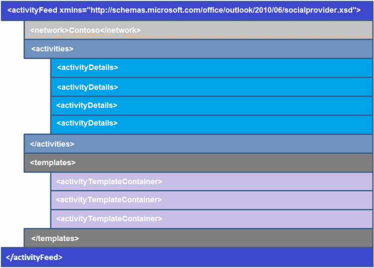

# 概述 XML 的活动订阅源

活动源包括社交网络上发生的一个或多个活动。 每个活动源由**activityFeed**元素，并具有以下三个信息特征： 
  
- **网络**— 活动产生的社交网络的名称。
    
- **活动**-活动上登录的用户的帐户的社交网络上发生的情况的容器。
    
- **模板**— 用于显示相应的活动项目中**活动**的模板的容器。
    
若要创建活动源项目，必须符合 Outlook Social Connector (OSC) 提供程序扩展性 XML 架构。 图 1 显示活动的源 XML 结构。
  
**图 1。活动源 XML 结构**

  
每个活动订阅源，此架构的两个最重要部分是**activityDetails**和**activityTemplateContainer**要素： 
  
- **ActivityDetails**元素存储每个活动源项目，如活动所有者的名称或图片上载的 URL 的特定信息。 
    
- 为每个活动的布局源项目或**activityTemplateContainer**元素存储格式。 它包含模板，由单个**activityTemplate**元素，表示可重用的多个源的项目。 
    
为单个活动订阅源， **activityTemplate**元素指定信息的以下四个部分： 
  
- **图标**— 指定图标的 URL，以显示活动订阅源。
    
- **标题**— 介绍的活动订阅源。
    
- **类型**— 指定活动，如状态、 照片或文档更新的类型。
    
- **数据**— 指定显示与活动订阅源的任何额外信息。
    
> [!TIP]
> 活动源中显示的图标始终是**ISocialProvider::SocialNetworkIcon**属性返回的提供程序图标相同。 
  
请参阅以下主题有关**activityDetails**元素、 **activityTemplateContainer**元素、 模板令牌和模板变量的详细信息： 
  
- [activityDetails 元素](activitydetails-element.md)
    
- [activityTemplateContainer 元素](activitytemplatecontainer-element.md)
    
- [模板变量](template-variables.md)
    
- [正确显示活动的指南](guidelines-for-properly-displaying-activities.md)
    
示例活动的源 XML，请参阅[活动源 XML 示例](activity-feed-xml-example.md)。
  
## 另请参阅

- [活动的 XML](xml-for-activities.md) 
- [Outlook Social Connector 提供程序的 XML 架构](outlook-social-connector-provider-xml-schema.md)
- [开发 OSC XML 架构的提供程序](developing-a-provider-with-the-osc-xml-schema.md)

