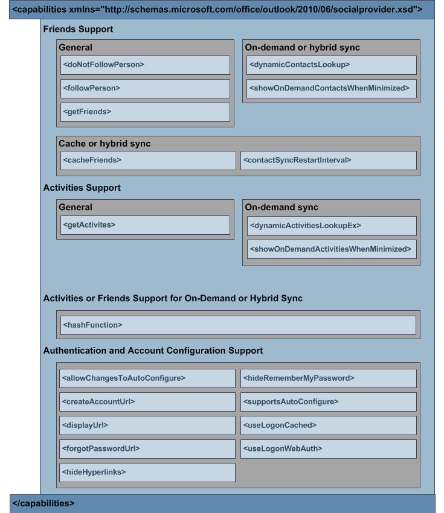

# 功能的 XMLXML for capabilities

OSC (XML 架构) **capabilities** 元素允许 OSC 提供程序指定其功能。The **capabilities** element in the (OSC) provider XML schema allows an OSC provider to specify its functionality. 此类功能包括：Such functionality includes the following: 
  
- 提供程序是否支持从社交网络获取、缓存或动态查找好友和活动。Whether the provider supports getting, caching, or dynamically looking up friends and activities from the social network.
    
- OSC 应如何显示某些登录用户界面。How the OSC should display certain logon user interfaces.
    
- OSC 是应该使用基于表单的身份验证，还是自动配置社交网络和社交网络上的用户日志。Whether the OSC should use forms-based authentication or automatically configure the social network and logs on the user on the social network.
    
功能的 XML **架构** 至关重要，因为它向 OSC 标识提供程序支持的功能。The XML schema for **capabilities** is critical because it identifies to the OSC the functionality supported by the provider. OSC 提供程序必须实现返回结果字符串的 [ISocialProvider：：GetCapabilities](isocialprovider-getcapabilities.md)_方法。_An OSC provider must implement the [ISocialProvider::GetCapabilities](isocialprovider-getcapabilities.md) method that returns a  _result_ string. OSC 调用 **ISocialProvider：：GetCapabilities** 以获取有关结果字符串中 OSC 提供程序的功能的信息，这符合 **capabilities** 元素的 XML 架构定义。The OSC calls **ISocialProvider::GetCapabilities** to obtain information about the capabilities of the OSC provider in the  _result_ string, which complies with the XML schema definition for the **capabilities** element. 此信息使从 OSC 到 OSC 提供程序的后续调用能够正常运行。This information enables subsequent calls from the OSC to the OSC provider to operate correctly. 
  
若要将 OSC 提供程序的功能指定为 **ISocialProvider：：GetCapabilities** 方法的输出参数，必须符合 OSC 提供程序扩展性 XML 架构。To specify capabilities of an OSC provider as an output parameter of the **ISocialProvider::GetCapabilities** method, you must conform to the OSC provider extensibility XML schema. 下图显示了 **功能** XML 结构。The following figure shows the **capabilities** XML structure. 
  
**图 1. \<capabilities \> XML 结构****Figure 1. \<capabilities\> XML structure**

  
有关 **capabilities** 元素的子元素的详细说明，请参阅 [Capabilities XML Elements。](capabilities-xml-elements.md)For detailed descriptions of child elements of the **capabilities** element, see [Capabilities XML Elements](capabilities-xml-elements.md). 有关功能 XML **的示例** ，请参阅 [Capabilities XML Example](capabilities-xml-example.md)。For an example of **capabilities** XML, see [Capabilities XML Example](capabilities-xml-example.md). 有关 OSC 提供程序 XML 架构的完整定义，包括哪些元素是必需的或可选的，请参阅Outlook[连接器提供程序 XML 架构。](outlook-social-connector-provider-xml-schema.md)For a complete definition of the OSC provider XML schema, including which elements are required or optional, see [Outlook Social Connector Provider XML Schema](outlook-social-connector-provider-xml-schema.md).
  
## 另请参阅See also

- [Capabilities XML 示例Capabilities XML Example](capabilities-xml-example.md)  
- [同步好友和活动Synchronizing Friends and Activities](synchronizing-friends-and-activities.md)  
- [好友 XMLXML for Friends](xml-for-friends.md)  
- [活动的 XMLXML for Activities](xml-for-activities.md)
- [使用 OSC XML 架构开发提供程序Developing a Provider with the OSC XML Schema](developing-a-provider-with-the-osc-xml-schema.md)

