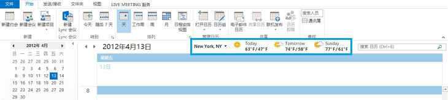
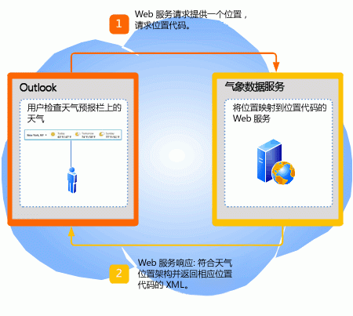
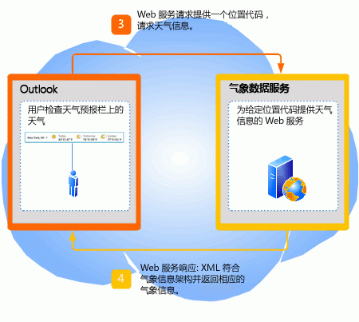

# <a name="extending-the-weather-bar-in-outlook"></a><span data-ttu-id="37709-103">扩展 Outlook 中的天气栏</span><span class="sxs-lookup"><span data-stu-id="37709-103">Extending the Weather Bar in Outlook</span></span>

<span data-ttu-id="37709-104">了解在 Outlook 2013 中如何在天气栏中插入第三方天气 Web 服务，以提供用户所选位置的天气状况。</span><span class="sxs-lookup"><span data-stu-id="37709-104">Learn how to plug in a third-party weather web service for the Weather Bar in Outlook 2013, to provide weather conditions data for a user-chosen location.</span></span>
  
## <a name="weather-bar-overview"></a><span data-ttu-id="37709-105">天气栏概述</span><span class="sxs-lookup"><span data-stu-id="37709-105">Weather Bar overview</span></span>
<span data-ttu-id="37709-106"><a name="ol15_weatherbar_overview"> </a></span><span class="sxs-lookup"><span data-stu-id="37709-106"><a name="ol15_weatherbar_overview"> </a></span></span>

<span data-ttu-id="37709-p101">Outlook 中的天气栏显示某个地理位置的天气状况和预报。用户可以选择一个或多个位置，并在日历模块的天气栏中方便地查看天气数据。图 1 显示了天气栏，其中显示了纽约未来三天的天气预报。</span><span class="sxs-lookup"><span data-stu-id="37709-p101">The Weather Bar in Outlook displays weather conditions and forecast for a geographic location. A user can choose one or multiple locations, and conveniently see weather data in the Weather Bar in the calendar module. Figure 1 shows the Weather Bar displaying a three-day forecast for New York, NY.</span></span> 
  
<span data-ttu-id="37709-110">**图 1. Outlook 中的天气栏**</span><span class="sxs-lookup"><span data-stu-id="37709-110">**Figure 1. Weather Bar in Outlook**</span></span>


  
<span data-ttu-id="37709-p102">天气栏的设置与用户的配置文件一起保存。根据 Outlook 帐户的类型，设置可能会随用户在其使用相同配置文件登录的所有计算机上漫游，这与 Exchange 帐户一样。或者，用户也可以像 IMAP/POP 帐户一样，在每台计算机上对设置进行自定义。</span><span class="sxs-lookup"><span data-stu-id="37709-p102">Settings for the Weather Bar are saved with the user's profile. Depending on the type of Outlook account, the settings may roam with the user on all computers that the user logs on to with the same profile, as in the case of Exchange accounts. Alternatively, the user can customize settings on each computer, as in the case of IMAP/POP accounts.</span></span>
  
<span data-ttu-id="37709-p103">默认情况下，Outlook 使用 MSN 天气提供的天气数据。天气栏支持遵循指定协议与 Outlook 通信的第三方天气数据 Web 服务。只要第三方天气数据服务支持该协议，用户就可以选择由该天气数据服务在天气栏中提供天气数据。本文介绍了第三方天气服务用于与天气栏中的 Outlook 集成的协议。</span><span class="sxs-lookup"><span data-stu-id="37709-p103">By default, Outlook uses weather data provided by MSN Weather. The Weather Bar supports third-party weather data web services that follow a defined protocol to communicate with Outlook. As long as a third-party weather data service supports this protocol, users can choose that weather data service to provide weather data in the Weather Bar. This article describes the protocol for third-party weather services to integrate with Outlook in the Weather Bar.</span></span>
  
## <a name="weather-bar-protocol"></a><span data-ttu-id="37709-119">天气栏协议</span><span class="sxs-lookup"><span data-stu-id="37709-119">Weather Bar protocol</span></span>
<span data-ttu-id="37709-120"><a name="ol15_weatherbar_theprotocol"> </a></span><span class="sxs-lookup"><span data-stu-id="37709-120"><a name="ol15_weatherbar_theprotocol"> </a></span></span>

<span data-ttu-id="37709-121">用户可以为天气栏指定不同的天气数据服务，只要该天气数据服务实施的 Web 服务支持以下协议以与 Outlook 通信：</span><span class="sxs-lookup"><span data-stu-id="37709-121">A user can specify a different weather data service for the Weather Bar, as long as that weather data service implements a web service that supports the following protocol to communicate with Outlook:</span></span>
  
1. <span data-ttu-id="37709-p104">天气数据服务支持 Web 服务的基 URL。例如，Contoso 天气 Web 服务的基 URL 可能为 https://service.contoso.com/data.aspx。</span><span class="sxs-lookup"><span data-stu-id="37709-p104">The weather data service supports a base URL to a web service. For example, a Contoso Weather web service can have a base URL of https://service.contoso.com/data.aspx.</span></span>
    
2. <span data-ttu-id="37709-124">Web 服务允许 Outlook 将以下参数附加到基 URL，以请求位置代码：</span><span class="sxs-lookup"><span data-stu-id="37709-124">The web service allows Outlook to append the following parameters to the base URL, to request a location code:</span></span> 
    
   - <span data-ttu-id="37709-125">outputview=search：此参数指示该请求是位置搜索。</span><span class="sxs-lookup"><span data-stu-id="37709-125">outputview=search: This parameter indicates that the request is a location search.</span></span>
    
   - <span data-ttu-id="37709-126">weasearchstr= _city_：此参数指示位置，_城市_（例如，伦敦），用户需要了解该位置的天气预报。</span><span class="sxs-lookup"><span data-stu-id="37709-126">weasearchstr= _city_: This parameter indicates the location,  _city_, for which the user wants a weather forecast (for example, London).</span></span>
    
   - <span data-ttu-id="37709-127">culture= _LCID_：此参数指示在该计算机上为用户安装的 Office 版本的区域的。</span><span class="sxs-lookup"><span data-stu-id="37709-127">culture= _LCID_: This parameter indicates the culture of the version of Office installed for the user on that computer.</span></span> <span data-ttu-id="37709-128">LCID 值是在[用于识别语言的 [RFC4646] 标签](https://www.ietf.org/rfc/rfc4646.txt)中定义的</span><span class="sxs-lookup"><span data-stu-id="37709-128">The LCID value is defined in [[RFC4646] Tags for Identifying Languages](https://www.ietf.org/rfc/rfc4646.txt)</span></span>
    
   - <span data-ttu-id="37709-129">src=outlook：此参数指明 Outlook 是请求服务的客户端应用程序。</span><span class="sxs-lookup"><span data-stu-id="37709-129">src=outlook: This parameter indicates that Outlook is the client application requesting the service.</span></span>
    
   <span data-ttu-id="37709-p106">这些参数允许 Outlook 提取用户感兴趣的位置，并搜索天气数据服务支持的相关位置代码。Web 服务应在 XML 中提供符合 [Outlook Weather Location XML Schema](outlook-weather-location-xml-schema.md)的位置代码，以响应 Outlook。图 2 汇总了位置代码的 Web 服务请求和响应。</span><span class="sxs-lookup"><span data-stu-id="37709-p106">These parameters allow Outlook to take the location that the user is interested in and search for the associated location code as supported by the weather data service. The web service should respond to Outlook with a location code in XML that follows the [Outlook Weather Location XML Schema](outlook-weather-location-xml-schema.md). Figure 2 summarizes the web service request and response for a location code.</span></span>
    
   <span data-ttu-id="37709-133">**图 2. 位置代码的 Web 服务请求和响应**</span><span class="sxs-lookup"><span data-stu-id="37709-133">**Figure 2. Web service request and response for a location code**</span></span>

   
  
3. <span data-ttu-id="37709-135">Web 服务还允许 Outlook 附加以下参数，以请求某个位置代码的预测信息：</span><span class="sxs-lookup"><span data-stu-id="37709-135">The web service also allows Outlook to append the following parameters, to request forecast information for a location code:</span></span>
    
   - <span data-ttu-id="37709-136">wealocations= _code_：此参数中的 _code_ 是 Outlook 从步骤 2 中获取的位置代码，该位置代码映射到用户感兴趣的位置。</span><span class="sxs-lookup"><span data-stu-id="37709-136">wealocations= _code_: _code_ in this parameter is a location code that Outlook obtains from Step 2, and that maps to the location that the user is interested in.</span></span> 
    
   - <span data-ttu-id="37709-137">weadegreetype= _degreetype_：此参数指定对温度使用公制还是英制度量单位。</span><span class="sxs-lookup"><span data-stu-id="37709-137">weadegreetype= _degreetype_: This parameter specifies whether to use metric or imperial units of measurement for temperature.</span></span> <span data-ttu-id="37709-138">对于 _degreetype_，指定 c 表示公制，f 表示英制。</span><span class="sxs-lookup"><span data-stu-id="37709-138">Specify c for metric, f for imperial for  _degreetype_.</span></span> <span data-ttu-id="37709-139">此参数为可选项，web 服务请求中并不始终会出现此参数。</span><span class="sxs-lookup"><span data-stu-id="37709-139">This parameter is optional and does not always exist in the web service request.</span></span>
    
   - <span data-ttu-id="37709-140">culture= _LCID_：此参数指示在该计算机上为用户安装的 Office 版本的区域的。</span><span class="sxs-lookup"><span data-stu-id="37709-140">culture= _LCID_: This parameter indicates the culture of the version of Office installed for the user on that computer.</span></span> <span data-ttu-id="37709-141">LCID 值是在[用于识别语言的 [RFC4646] 标签](https://www.ietf.org/rfc/rfc4646.txt)中定义的</span><span class="sxs-lookup"><span data-stu-id="37709-141">The LCID value is defined in [[RFC4646] Tags for Identifying Languages](https://www.ietf.org/rfc/rfc4646.txt)</span></span>
    
   - <span data-ttu-id="37709-142">src=outlook：此参数指明 Outlook 是请求服务的客户端应用程序。</span><span class="sxs-lookup"><span data-stu-id="37709-142">src=outlook: This parameter indicates that Outlook is the client application requesting the service.</span></span>
    
   <span data-ttu-id="37709-p109">这些参数允许 Outlook 使用从步骤 2 返回的位置代码，并请求天气数据服务提供预报。Web 服务应在 XML 中提供符合[Outlook Weather Information XML Schema](outlook-weather-information-xml-schema.md) 的相应天气数据，以响应 Outlook。图 3 汇总了指定位置代码的天气数据 Web 服务请求和响应。</span><span class="sxs-lookup"><span data-stu-id="37709-p109">These parameters allow Outlook to take the location code returned from Step 2 and request the weather data service for the forecast. The web service should respond to Outlook with the corresponding weather data in XML that follows the [Outlook Weather Information XML Schema](outlook-weather-information-xml-schema.md). Figure 3 summarizes the web service request and response for weather data given a location code.</span></span>
    
   <span data-ttu-id="37709-146">**图 3. 天气信息的 Web 服务请求和响应**</span><span class="sxs-lookup"><span data-stu-id="37709-146">**Figure 3. Web service request and response for weather information**</span></span>

   
  
## <a name="setting-the-weather-bar-to-use-a-weather-service"></a><span data-ttu-id="37709-148">将天气栏设置为使用天气服务</span><span class="sxs-lookup"><span data-stu-id="37709-148">Setting the Weather Bar to use a weather service</span></span>
<span data-ttu-id="37709-149"><a name="ol15_weatherbar_setting"> </a></span><span class="sxs-lookup"><span data-stu-id="37709-149"><a name="ol15_weatherbar_setting"> </a></span></span>

<span data-ttu-id="37709-p110">管理员或高级用户可以使用 **WeatherServiceUrl** 注册表项对天气栏进行自定义，以使用特定的天气服务。例如，如果 Contoso 天气服务的基 URL 为 https://service.contoso.com/data.aspx，您可以将 **WeatherServiceUrl** 注册表项设置为该 URL。</span><span class="sxs-lookup"><span data-stu-id="37709-p110">The administrator or power user can use the **WeatherServiceUrl** registry key to customize the Weather Bar to use a specific weather service. For example, if the base URL for a Contoso weather service is https://service.contoso.com/data.aspx, you can set the **WeatherServiceUrl** key to that URL.</span></span> 
  
<span data-ttu-id="37709-152">下表介绍了 **WeatherServiceUrl** 注册表项。</span><span class="sxs-lookup"><span data-stu-id="37709-152">The following table describes the **WeatherServiceUrl** key.</span></span> 
  
|||
|:-----|:-----|
|<span data-ttu-id="37709-153">**键**</span><span class="sxs-lookup"><span data-stu-id="37709-153">**Key**</span></span> <br/> |<span data-ttu-id="37709-154">HKCU\Software\Microsoft\Office\15.0\Outlook\Options\Calendar</span><span class="sxs-lookup"><span data-stu-id="37709-154">HKCU\Software\Microsoft\Office\15.0\Outlook\Options\Calendar</span></span>  <br/> |
|<span data-ttu-id="37709-155">**值名称**</span><span class="sxs-lookup"><span data-stu-id="37709-155">**Value name**</span></span> <br/> |<span data-ttu-id="37709-156">**WeatherServiceUrl**</span><span class="sxs-lookup"><span data-stu-id="37709-156">**WeatherServiceUrl**</span></span> <br/> |
|<span data-ttu-id="37709-157">**值类型**</span><span class="sxs-lookup"><span data-stu-id="37709-157">**Value type**</span></span> <br/> |<span data-ttu-id="37709-158">REG_SZ</span><span class="sxs-lookup"><span data-stu-id="37709-158">REG_SZ</span></span>  <br/> |
|<span data-ttu-id="37709-159">**默认值**</span><span class="sxs-lookup"><span data-stu-id="37709-159">**Default value**</span></span> <br/> |<span data-ttu-id="37709-160">EMPTY_STRING</span><span class="sxs-lookup"><span data-stu-id="37709-160">EMPTY_STRING</span></span>  <br/> |
|<span data-ttu-id="37709-161">**说明**</span><span class="sxs-lookup"><span data-stu-id="37709-161">**Description**</span></span> <br/> |<span data-ttu-id="37709-162">天气数据服务的 URL。</span><span class="sxs-lookup"><span data-stu-id="37709-162">URL to a weather data service.</span></span>  <br/> |
   
## <a name="dependent-conditions"></a><span data-ttu-id="37709-163">相关条件</span><span class="sxs-lookup"><span data-stu-id="37709-163">Dependent conditions</span></span>
<span data-ttu-id="37709-164"><a name="ol15_weatherbar_dependentconditions"> </a></span><span class="sxs-lookup"><span data-stu-id="37709-164"><a name="ol15_weatherbar_dependentconditions"> </a></span></span>

<span data-ttu-id="37709-p111">默认情况下，Outlook 2013 将显示天气栏。本部分介绍了天气栏为何不显示的几个原因。</span><span class="sxs-lookup"><span data-stu-id="37709-p111">Outlook 2013 displays the Weather Bar by default. This section describes a few reasons why the Weather Bar might not be visible.</span></span>
  
### <a name="weather-bar-is-disabled"></a><span data-ttu-id="37709-167">天气栏已禁用</span><span class="sxs-lookup"><span data-stu-id="37709-167">Weather Bar is disabled</span></span>

<span data-ttu-id="37709-168">首先，确认已在“**Outlook 选项**”对话框的“**日历**”选项卡中选中“**在日历中显示天气**”。</span><span class="sxs-lookup"><span data-stu-id="37709-168">First, verify that **Show weather on the calendar** is selected in the **Calendar** tab in the **Outlook Options** dialog box.</span></span> 
  
<span data-ttu-id="37709-169">请注意，管理员还可以使用组策略在 Outlook 2013 中完全禁用天气栏，方法是在 Windows 注册表中设置以下项：</span><span class="sxs-lookup"><span data-stu-id="37709-169">Note that an administrator can also use Group Policy to disable the Weather Bar in Outlook 2013 entirely by setting the following key in the Windows registry:</span></span>
  
|||
|:-----|:-----|
|<span data-ttu-id="37709-170">**键**</span><span class="sxs-lookup"><span data-stu-id="37709-170">**Key**</span></span> <br/> |<span data-ttu-id="37709-171">HKCU\Software\Microsoft\Office\15.0\Outlook\Options\Calendar</span><span class="sxs-lookup"><span data-stu-id="37709-171">HKCU\Software\Microsoft\Office\15.0\Outlook\Options\Calendar</span></span>  <br/> |
|<span data-ttu-id="37709-172">**值名称**</span><span class="sxs-lookup"><span data-stu-id="37709-172">**Value name**</span></span> <br/> |<span data-ttu-id="37709-173">**DisableWeather**</span><span class="sxs-lookup"><span data-stu-id="37709-173">**DisableWeather**</span></span> <br/> |
|<span data-ttu-id="37709-174">**值类型**</span><span class="sxs-lookup"><span data-stu-id="37709-174">**Value type**</span></span> <br/> |<span data-ttu-id="37709-175">REG_DWORD</span><span class="sxs-lookup"><span data-stu-id="37709-175">REG_DWORD</span></span>  <br/> |
|<span data-ttu-id="37709-176">**默认值**</span><span class="sxs-lookup"><span data-stu-id="37709-176">**Default value**</span></span> <br/> |<span data-ttu-id="37709-177">0</span><span class="sxs-lookup"><span data-stu-id="37709-177">0</span></span>  <br/> |
|<span data-ttu-id="37709-178">**说明**</span><span class="sxs-lookup"><span data-stu-id="37709-178">**Description**</span></span> <br/> |<span data-ttu-id="37709-179">值为 0 将启用天气栏，任何其他值将禁用天气栏。</span><span class="sxs-lookup"><span data-stu-id="37709-179">A value of 0 enables the Weather Bar; any other value disables the Weather Bar.</span></span>  <br/> |
   
<span data-ttu-id="37709-p112">如果天气栏功能已被组策略禁用，“日历”\*\*\*\* 选项卡将不包括“在日历中显示天气”\*\*\*\* 复选框。请与管理员联系以启用此功能。</span><span class="sxs-lookup"><span data-stu-id="37709-p112">If the Weather Bar feature has been disabled by Group Policy, the **Calendar** tab does not include the **Show weather on the calendar** check box. Consult with the administrator to turn the feature back on.</span></span> 
  
### <a name="office-is-disconnected-from-the-internet"></a><span data-ttu-id="37709-182">Office 已从 Internet 断开连接</span><span class="sxs-lookup"><span data-stu-id="37709-182">Office is disconnected from the Internet</span></span>

<span data-ttu-id="37709-183">确认 Office 已启用以连接到 Internet—在 Backstage 视图中，转到“信任中心”\*\*\*\* 的“隐私选项”\*\*\*\* 选项卡，确保已选中“允许 Office 连接到 Internet”\*\*\*\*。</span><span class="sxs-lookup"><span data-stu-id="37709-183">Verify that Office is enabled to connect to the Internet—go to the **Privacy options** tab of the **Trust Center** in the Backstage view, and ensure that **Allow Office to connect to the Internet** is selected.</span></span> 
  
<span data-ttu-id="37709-184">如果用户已选择不接收 Office 更新，也会禁用天气栏。</span><span class="sxs-lookup"><span data-stu-id="37709-184">If the user has chosen to not receive updates for Office, the Weather Bar is also disabled.</span></span>
  
<span data-ttu-id="37709-185">管理员还可以使用组策略禁用所有联机内容，包括天气栏，方法是在 Windows 注册表中设置以下项：</span><span class="sxs-lookup"><span data-stu-id="37709-185">An administrator can also use Group Policy to disable all online content, including the Weather Bar, by setting the following key in the Windows registry:</span></span>
  
|||
|:-----|:-----|
|<span data-ttu-id="37709-186">**键**</span><span class="sxs-lookup"><span data-stu-id="37709-186">**Key**</span></span> <br/> |<span data-ttu-id="37709-187">HKCU\Software\Microsoft\Office\15.0\Common\Internet</span><span class="sxs-lookup"><span data-stu-id="37709-187">HKCU\Software\Microsoft\Office\15.0\Common\Internet</span></span>  <br/> |
|<span data-ttu-id="37709-188">**值名称**</span><span class="sxs-lookup"><span data-stu-id="37709-188">**Value name**</span></span> <br/> |<span data-ttu-id="37709-189">**UseOnlineContent**</span><span class="sxs-lookup"><span data-stu-id="37709-189">**UseOnlineContent**</span></span> <br/> |
|<span data-ttu-id="37709-190">**值类型**</span><span class="sxs-lookup"><span data-stu-id="37709-190">**Value type**</span></span> <br/> |<span data-ttu-id="37709-191">REG_DWORD</span><span class="sxs-lookup"><span data-stu-id="37709-191">REG_DWORD</span></span>  <br/> |
|<span data-ttu-id="37709-192">**默认值**</span><span class="sxs-lookup"><span data-stu-id="37709-192">**Default value**</span></span> <br/> |<span data-ttu-id="37709-193">2</span><span class="sxs-lookup"><span data-stu-id="37709-193">2</span></span>  <br/> |
|<span data-ttu-id="37709-194">**说明**</span><span class="sxs-lookup"><span data-stu-id="37709-194">**Description**</span></span> <br/> |<span data-ttu-id="37709-195">值为 2 将启用天气栏，任何其他值将禁用天气栏。</span><span class="sxs-lookup"><span data-stu-id="37709-195">A value of 2 enables the Weather Bar; any other value disables the Weather Bar.</span></span>  <br/> |
   
<span data-ttu-id="37709-p113">如果天气栏功能已被组策略禁用，“日历”\*\*\*\* 选项卡将不包括“在日历中显示天气”\*\*\*\* 复选框。请与管理员联系以启用此功能。</span><span class="sxs-lookup"><span data-stu-id="37709-p113">If the Weather Bar feature has been disabled by Group Policy, the **Calendar** tab does not include the **Show weather on the calendar** check box. Consult with the administrator to turn the feature back on.</span></span> 
  
## <a name="weather-bar-example"></a><span data-ttu-id="37709-198">天气栏示例</span><span class="sxs-lookup"><span data-stu-id="37709-198">Weather Bar example</span></span>
<span data-ttu-id="37709-199"><a name="ol15_weatherbar_example"> </a></span><span class="sxs-lookup"><span data-stu-id="37709-199"><a name="ol15_weatherbar_example"> </a></span></span>

<span data-ttu-id="37709-p114">本节显示了 Contoso 天气服务的一个示例，该服务遵循前面的协议与 Outlook 通信。对于用户选择的任何位置，Outlook 首先从 Contoso 天气获取该位置的位置代码，然后使用该位置代码调用 Contoso 天气服务以获取天气数据。</span><span class="sxs-lookup"><span data-stu-id="37709-p114">This section shows an example of a Contoso Weather service that follows the preceding protocol to communicate with Outlook. For any location that the user selects, Outlook first gets a location code for that location from Contoso Weather, then using that location code, calls the Contoso Weather service to get the weather data.</span></span>
  
### <a name="base-url"></a><span data-ttu-id="37709-202">基 URL</span><span class="sxs-lookup"><span data-stu-id="37709-202">Base URL</span></span>

<span data-ttu-id="37709-203">Contoso 天气为其天气数据服务提供了以下基 URL：</span><span class="sxs-lookup"><span data-stu-id="37709-203">Contoso Weather provides the following base URL for their weather data service:</span></span>
  
https://service.contoso.com/data.aspx
  
### <a name="getting-a-location-code"></a><span data-ttu-id="37709-204">获取位置代码</span><span class="sxs-lookup"><span data-stu-id="37709-204">Getting a location code</span></span>

<span data-ttu-id="37709-205">Outlook 将步骤 2 中所述的参数附加到基 URL，以获取地理位置  _city_ 的位置代码：</span><span class="sxs-lookup"><span data-stu-id="37709-205">Outlook appends the parameters described in Step 2 above to the base URL to obtain the location code for a geographic location  _city_:</span></span>
  
<span data-ttu-id="37709-206">https://service.contoso.com/data.aspx?outputview=search&amp;weasearchstr= _city_</span><span class="sxs-lookup"><span data-stu-id="37709-206">https://service.contoso.com/data.aspx?outputview=search&amp;weasearchstr= _city_</span></span>
  
<span data-ttu-id="37709-207">例如，如果用户在天气栏中选择了 Tokyo，Outlook 将使用以下 URL 从 Contoso 天气获取东京的位置代码：</span><span class="sxs-lookup"><span data-stu-id="37709-207">As an example, if the user has selected Tokyo in the Weather Bar, Outlook uses the following URL to obtain the location code for Tokyo from Contoso Weather:</span></span> 
  
<span data-ttu-id="37709-208">https://weather.service.contoso.com/data.aspx?outputview=search&amp;weasearchstr=tokyo</span><span class="sxs-lookup"><span data-stu-id="37709-208">https://weather.service.contoso.com/data.aspx?outputview=search&amp;weasearchstr=tokyo</span></span>
  
<span data-ttu-id="37709-p115">Contoso 天气使用以下 XML 进行响应，以提供东京的位置代码。XML 符合 Outlook 天气位置 XML 架构。请注意，天气服务通常会返回多个位置的数据（例如，如果所选位置是一个较大的大城市区）。在此示例中，对东京的响应包括两个位置，分别包含在 [weather](weather-element-weatherdata-elementoutlook-weather-location-schema.md) 元素内。相应的位置代码如下所示：</span><span class="sxs-lookup"><span data-stu-id="37709-p115">Contoso Weather responds with the following XML to provide the location code for Tokyo. The XML conforms to the Outlook Weather Location XML Schema. Note that it is common for weather services to return data for more than one location (for example, if the selected location is a greater metropolitan area). In this example, the response for Tokyo includes two locations, each enclosed in a [weather](weather-element-weatherdata-elementoutlook-weather-location-schema.md) element. The corresponding location codes are as follows:</span></span> 
  
- <span data-ttu-id="37709-214">wc:JAXX0085 表示 **weatherlocationname** 属性为  `Tokyo, JPN`</span><span class="sxs-lookup"><span data-stu-id="37709-214">wc:JAXX0085 for the **weatherlocationname** attribute being  `Tokyo, JPN`</span></span>
    
- <span data-ttu-id="37709-215">wc:10038604 表示 **weatherlocationname** 属性为  `Shinjuku-ku, Tokyo, Japan`</span><span class="sxs-lookup"><span data-stu-id="37709-215">wc:10038604 for the **weatherlocationname** attribute being  `Shinjuku-ku, Tokyo, Japan`</span></span>
    
```XML
<?xml version="1.0" ?>
<weatherdata>
  <weather weatherlocationcode="wc:JAXX0085" 
    weatherlocationname="Tokyo, JPN">
  </weather>
  <weather weatherlocationcode="wc:10038604" 
    weatherlocationname="Shinjuku-ku, JPN">
  </weather>
</weatherdata>

```

### <a name="getting-weather-information-for-a-location-code"></a><span data-ttu-id="37709-216">获取位置代码的天气信息</span><span class="sxs-lookup"><span data-stu-id="37709-216">Getting weather information for a location code</span></span>

<span data-ttu-id="37709-217">获取位置的位置代码后，Outlook 会将步骤 3 中的参数附加到基 URL，以获取该位置代码的天气信息。</span><span class="sxs-lookup"><span data-stu-id="37709-217">After obtaining the location code for a location, Outlook appends the parameters described in Step 3 above to the base URL to obtain weather information for that location code.</span></span>
  
<span data-ttu-id="37709-218">https://service.contoso.com/data.aspx?wealocations= _code_</span><span class="sxs-lookup"><span data-stu-id="37709-218">https://service.contoso.com/data.aspx?wealocations= _code_</span></span>
  
<span data-ttu-id="37709-219">例如，如果 Outlook 已从 Contoso 天气为 Tokyo 获取位置代码 wc:JAXX0085，Outlook 将在以下 URL 中使用此位置代码获取天气信息。</span><span class="sxs-lookup"><span data-stu-id="37709-219">As an example, if Outlook has obtained the location code wc:JAXX0085 from Contoso Weather for Tokyo, Outlook uses this location code in the following URL to get the weather information.</span></span>
  
https://service.contoso.com/data.aspx?wealocations=wc:JAXX0085
  
<span data-ttu-id="37709-p116">Contoso 天气使用以下 XML 进行响应，以提供东京的位置代码的天气信息。 XML 符合 Outlook 天气信息 XML 架构。</span><span class="sxs-lookup"><span data-stu-id="37709-p116">Contoso Weather responds with the following XML to provide the weather information for the location code for Tokyo. The XML conforms to the Outlook Weather Information XML Schema.</span></span>
  
```XML
<?xml version="1.0"?>
<weatherdata>
  <weather timezone="9" attribution="Data provided by Trey Research" 
    degreetype="F" imagerelativeurl="https://contoso.com/images/en-us/" 
    url="https://contoso.com/weather.aspx?eid=33568&amp;q=Tokyo-JPN" 
    weatherlocationname="Tokyo, JPN" 
    weatherlocationcode="wc:JAXX0085">
      <current winddisplay="9 mph NNW" windspeed="9" humidity="90" feelslike="44" 
        observationpoint="Tokyo" observationtime="06:00:00" 
        shortday="Sat" day="Saturday" date="2012-04-14" skytext="Rain" skycode="11" 
        temperature="48"/>
      <forecast shortday="Sat" day="Saturday" date="2012-04-14" precip="95" skytextday="Rain"
        skycodeday="11" high="55" low="47"/>
      <forecast shortday="Sun" day="Sunday" date="2012-04-15" precip="5" skytextday="Partly Cloudy" 
        skycodeday="30" high="65" low="43"/>
      <forecast shortday="Mon" day="Monday" date="2012-04-16" precip="5" skytextday="Partly Cloudy" 
        skycodeday="30" high="64" low="52"/>
      <forecast shortday="Tue" day="Tuesday" date="2012-04-17" precip="70" skytextday="Showers / Clear" 
        skycodeday="39" high="66" low="53"/>
      <forecast shortday="Wed" day="Wednesday" date="2012-04-18" precip="55" skytextday="Showers / Clear" 
        skycodeday="39" high="68" low="51"/>
  </weather>
</weatherdata>

```

### <a name="resetting-outlook-to-use-msn-weather"></a><span data-ttu-id="37709-222">将 Outlook 重置为使用 MSN 天气</span><span class="sxs-lookup"><span data-stu-id="37709-222">Resetting Outlook to use MSN Weather</span></span>

<span data-ttu-id="37709-p117">尽管 Outlook 默认使用 MSN 天气，但是如果用户对天气栏进行自定义以使用其他天气服务，随后又想使用 MSN 天气，用户只需在 Windows 注册表中删除 **WeatherServiceUrl** 项即可。删除此注册表项即可将 Outlook 重置为使用 MSN 天气。</span><span class="sxs-lookup"><span data-stu-id="37709-p117">Even though Outlook uses MSN Weather by default, if a user has customized the Weather Bar to use a different weather service and subsequently wants to use MSN Weather again, the user can simply delete the **WeatherServiceUrl** key in the Windows Registry. Deleting that registry key resets Outlook to use MSN Weather.</span></span> 
  
## <a name="conclusion"></a><span data-ttu-id="37709-225">结束语</span><span class="sxs-lookup"><span data-stu-id="37709-225">Conclusion</span></span>
<span data-ttu-id="37709-226"><a name="ol15_weatherbar_conclusion"> </a></span><span class="sxs-lookup"><span data-stu-id="37709-226"><a name="ol15_weatherbar_conclusion"> </a></span></span>

<span data-ttu-id="37709-p118">Outlook 日历中的天气栏默认使用 MSN 天气来提供指定位置的天气预报。用户可以方便地查看所关注位置的天气信息。如果第三方天气数据服务支持 Outlook 天气位置 XML 架构和 Outlook 天气信息 XML 架构，并遵循与 Outlook 的简单 Web 服务协议，则也可与天气栏集成。</span><span class="sxs-lookup"><span data-stu-id="37709-p118">The Weather Bar in the Outlook calendar uses MSN Weather by default to provide the weather forecast for a specified location. Users can conveniently see weather information for the locations they care about. Third-party weather data services can also integrate with the Weather Bar by supporting the Outlook Weather Location XML Schema and Outlook Weather Information XML Schema and following a simple web service protocol with Outlook.</span></span>
  
## <a name="see-also"></a><span data-ttu-id="37709-230">另请参阅</span><span class="sxs-lookup"><span data-stu-id="37709-230">See also</span></span>

- [<span data-ttu-id="37709-231">Outlook 天气位置 XML 架构</span><span class="sxs-lookup"><span data-stu-id="37709-231">Outlook Weather Location XML Schema</span></span>](outlook-weather-location-xml-schema.md)   
- [<span data-ttu-id="37709-232">Outlook Weather Information XML Schema</span><span class="sxs-lookup"><span data-stu-id="37709-232">Outlook Weather Information XML Schema</span></span>](outlook-weather-information-xml-schema.md)
    

