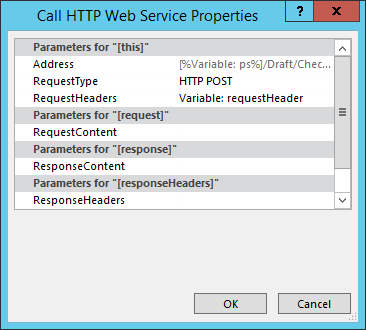

# 批量更新自定义字段并通过 Project Online 中的工作流创建项目网站Bulk update custom fields and create project sites from a workflow in Project Online

为帮助客户充分利用 project online 并提高服务可扩展性和灵活性, 我们为客户端对象模型添加了两种方法, 可在 Project Online 应用程序和工作流中使用。To help customers get the most out of Project Online and improve our service extensibility and flexibility, we've added two methods to the client-side object model that you can use in Project Online apps and workflows.
  
|||
|:-----|:-----|
|**UpdateCustomFields****UpdateCustomFields**   |批量更新项目自定义域。Bulk updates project custom fields. 仅适用于 Project Online。For Project Online only. 仅适用于 REST API。Available only in the REST API.    |
|**CreateProjectSite****CreateProjectSite**   | 创建项目网站。Creates a Project site. 仅适用于 Project Online。For Project Online only. 在 REST API、托管客户端对象模型和 JavaScript 客户端对象模型中可用。Available in the REST API, managed client object model, and JavaScript client object model.    |
   
除了提供更大的灵活性之外, 在工作流中保存和发布项目时, 这些方法还会显著提高性能。In addition to providing more flexibility, these methods also offer significant performance improvements when saving and publishing projects in a workflow. 本文介绍如何使用 REST API 中的方法, 并提供有关创建批量更新自定义字段和创建项目网站的工作流的工作流的说明。This article describes how to use the methods in the REST API and provides instructions for creating a workflow that bulk updates custom fields and a workflow that creates a Project site.
  
> [!NOTE]
> 若要了解有关从 sharepoint 2013 工作流调用 REST api 的详细信息, 请参阅[使用 sharepoint REST 服务从具有 POST 方法的工作流](https://mysharepointinsight.blogspot.com/2013/05/using-sharepoint-rest-services-from.mdl)和[从 sharepoint Designer 工作流调用 sharepoint 2013 REST API](https://sergeluca.wordpress.com/2013/04/09/calling-the-sharepoint-2013-rest-api-from-a-sharepoint-designer-workflow/)。To learn more about calling REST APIs from SharePoint 2013 workflows, see [Using SharePoint REST services from workflow with POST method](https://mysharepointinsight.blogspot.com/2013/05/using-sharepoint-rest-services-from.mdl) and [Calling the SharePoint 2013 Rest API from a SharePoint Designer Workflow](https://sergeluca.wordpress.com/2013/04/09/calling-the-sharepoint-2013-rest-api-from-a-sharepoint-designer-workflow/). 
  
## 从工作流批量更新项目自定义域Bulk update project custom fields from a workflow

以前, 工作流一次只能更新一个自定义字段。Previously, workflows could only update one custom field at a time. 一次更新一个项目自定义域会导致用户在项目详细信息页面之间过渡时遇到较差的最终用户体验。Updating project custom fields one at a time can result in a poor end-user experience when users transition between Project Detail Pages. 每次更新都需要使用**设置项目域**操作和更新多个自定义字段在高延迟 (低带宽网络) 上的单独服务器请求, 从而产生无意义的开销。Each update required a separate server request using the **Set Project Field** action, and updating multiple custom fields on a high-latency, low-bandwidth network resulted in a non-trivial overhead. 若要解决此问题, 我们向 REST API 添加了**UpdateCustomFields**方法, 该方法允许您批量更新自定义字段。To resolve this issue, we added the **UpdateCustomFields** method to the REST API that lets you bulk update custom fields. 若要使用**UpdateCustomFields**, 请在包含要更新的所有自定义域的名称和值的词典中进行传递。To use **UpdateCustomFields**, you pass in a dictionary that contains the names and values of all the custom fields you want to update.
  
可以在以下终结点找到 REST 方法:The REST method can be found at the following endpoint:
  
`https://<site-url>/_api/ProjectServer/Projects('<guid>')/Draft/UpdateCustomFields()`
  
> [!NOTE]
> 将示例`<site-url>`中的占位符替换为 project Web App (PWA) 网站的 URL, 并将`<guid>`占位符替换为项目 UID。Replace the  `<site-url>` placeholder in the examples with the URL of your Project Web App (PWA) site and the  `<guid>` placeholder with your project UID. 
  
本节介绍如何创建批量更新项目的自定义字段的工作流。This section describes how to create a workflow that bulk updates custom fields for a project. 工作流遵循以下高级别步骤:The workflow follows these high-level steps:
  
- 等待要更新的项目以供签入Wait for the project that you want to update to get checked in
    
- 构建一个定义项目的所有自定义字段更新的数据集Build a data set that defines all your custom field updates for the project
    
- 签出项目Check out the project
    
- 调用**UpdateCustomFields**以将自定义字段更新应用于项目Call **UpdateCustomFields** to apply the custom field updates to the project 
    
- 将相关信息记录到工作流历史记录列表中 (如果需要)Log relevant information to the workflow history list (if required)
    
- 发布项目Publish the project
    
- 签入项目Check in the project
    
最终的端到端工作流如下所示:The final, end-to-end workflow looks like this:
  

  
### 创建批量更新自定义字段的工作流To create a workflow that bulk updates custom fields

1. 可选。Optional. 将项目的完整 URL 存储在可在整个工作流中使用的变量中。Store the full URL of your project in a variable that you can use throughout the workflow.
    
    
  
2. 将 "**等待项目事件**" 操作添加到工作流, 并选择 "在事件**中检查项目时**"。Add the **Wait for Project Event** action to the workflow and choose the **When a project is checked in** event. 
    
    
  
3. 使用 "**生成字典**" 操作创建**requestHeader**字典。Create a **requestHeader** dictionary using the **Build dictionary** action. 您将对此工作流中的所有 web 服务调用使用相同的请求标头。You'll use the same request header for all the web service calls in this workflow. 
    
    
  
4. 将以下两个项添加到字典中。Add the following two items to the dictionary.
    
    |名称Name|类型Type|值Value|
    |:-----|:-----|:-----|
    |AcceptAccept    |字符串String    |application/json;odata = verboseapplication/json; odata=verbose    |
    |Content-TypeContent-Type    |字符串String    |application/json;odata = verboseapplication/json; odata=verbose    |
   
    
  
5. 使用 "**生成字典**" 操作创建**requestBody**字典。Create a **requestBody** dictionary using the **Build dictionary** action. 此字典存储要应用的所有域更新。This dictionary stores all the field updates that you want to apply. 
    
    每个自定义字段更新需要四行: 字段的 (1) 元数据类型、(2) 键、(3) 值和 (4) 值类型。Each custom field update requires four rows: the field's (1) metadata type, (2) key, (3) value, and (4) value type.
    
    - **__metadata/type**字段的元数据类型。**__metadata/type** The field's metadata type. 此记录始终是相同的, 并使用以下值:This record is always the same and uses the following values: 
    
       - Name: customFieldDictionary (i)/__metadata/type (其中**i**是字典中每个自定义字段的索引, 从0开始)Name: customFieldDictionary(i)/__metadata/type (where **i** is the index of each custom field in the dictionary, starting with 0) 
            
       - 类型：字符串Type: String
            
       - Value: SP。键值Value: SP.KeyValue
    
       
  
    - **键**自定义字段的内部名称, 格式为: *Custom_ce23fbf43fa0e411941000155d3c8201***Key** The internal name of the custom field, in the format: *Custom_ce23fbf43fa0e411941000155d3c8201* 
    
       您可以通过导航到自定义字段的**InternalName**终结点来查找该自定义字段的内部名称:`https://<site-url>/_api/ProjectServer/CustomFields('<guid>')/InternalName`You can find the internal name of a custom field by navigating to it's **InternalName** endpoint: `https://<site-url>/_api/ProjectServer/CustomFields('<guid>')/InternalName`
    
       如果手动创建自定义字段, 则这些值将不同于网站。If you created your custom fields manually, the values will differ from site to site. 如果您计划跨多个网站重用工作流, 请确保自定义域 id 正确。If you plan to reuse the workflow across multiple sites, make sure the custom field IDs are correct.
    
    - **值**要分配给自定义域的值。**Value** The value to assign to the custom field. 对于链接到查阅表格的自定义域, 您需要使用查阅表格条目的内部名称, 而不是实际的查阅表格值。For custom fields that are linked to lookup tables, you need to use the internal names of the lookup table entries instead of the actual lookup table values. 
    
       您可以在以下终结点查找查找表条目的内部名称:`https://<site-url>/_api/ProjectServer/CustomFields('<guid>')/LookupEntries('<guid>')/InternalName`You can find the internal name of the lookup table entry at the following endpoint: `https://<site-url>/_api/ProjectServer/CustomFields('<guid>')/LookupEntries('<guid>')/InternalName`
    
       如果有一个查阅表格自定义字段设置为接受多个值, 请`;#`使用连接值 (如下面的示例字典所示)。If you have a lookup table custom field set up to accept multiple values, use  `;#` to concatenate values (as shown in the example dictionary below). 
    
    - **ValueType**您要更新的自定义域的类型。**ValueType** The type of the custom field you are updating. 
    
       - 对于 "文本"、"持续时间"、"标志" 和 "LookupTable" 字段, 使用 Edm. StringFor Text, Duration, Flag, and LookupTable fields, use Edm.String
    
       - 对于 Number 字段, 请使用 Edm、edm 或任何其他 OData-接受的数字类型For Number fields, use Edm.Int32, Edm.Double, or any other OData-accepted number type
    
       - 对于 "日期" 字段, 使用 Edm. DateTimeFor Date fields, use Edm.DateTime
    
       下面的示例字典定义了三个自定义域的更新。The example dictionary below defines updates for three custom fields. 第一个是针对多值查阅表格自定义域, 第二个用于 "数字" 字段, 第三个用于 "日期" 字段。The first is for a multiple value lookup table custom field, the second is for a number field, and the third is for a date field. 请注意**customFieldDictionary**索引是如何递增的。Note how the **customFieldDictionary** index increments. 
    
       > [!NOTE]
       > 这些值仅用于说明目的。These values are for illustration purposes only. 您将使用的键值对取决于 PWA 数据。The key-value pairs you'll use depend on your PWA data. 
  
       |名称Name|类型Type|值Value|
       |:-----|:-----|:-----|
       |customFieldDictionary (0)/__metadata/typecustomFieldDictionary(0)/__metadata/type    |字符串String    |SP.键值SP.KeyValue    |
       |customFieldDictionary (0)/KeycustomFieldDictionary(0)/Key    |字符串String    |自\_定义 ce23fbf43fa0e411941000155d3c8201Custom\_ce23fbf43fa0e411941000155d3c8201    |
       |customFieldDictionary (0)/ValuecustomFieldDictionary(0)/Value    |字符串String    |条目\_b9a2fd69279de411940f00155d3c8201; #Entry\_baa2fd69279de411940f00155d3c8201Entry\_b9a2fd69279de411940f00155d3c8201;#Entry\_baa2fd69279de411940f00155d3c8201    |
       |customFieldDictionary (0)/ValueTypecustomFieldDictionary(0)/ValueType    |字符串String    |Edm.StringEdm.String    |
       |customFieldDictionary (1)/__metadata/typecustomFieldDictionary(1)/__metadata/type    |字符串String    |SP.键值SP.KeyValue    |
       |customFieldDictionary (1)/KeycustomFieldDictionary(1)/Key    |字符串String    |Custom_c7f114c97098e411940f00155d3c8201Custom_c7f114c97098e411940f00155d3c8201    |
       |customFieldDictionary (1)/ValuecustomFieldDictionary(1)/Value    |字符串String    |90。590.5    |
       |customFieldDictionary (1)/ValueTypecustomFieldDictionary(1)/ValueType    |字符串String    |Edm.DoubleEdm.Double    |
       |customFieldDictionary (2)/__metadata/typecustomFieldDictionary(2)/__metadata/type    |字符串String    |SP.键值SP.KeyValue    |
       |customFieldDictionary (2)/KeycustomFieldDictionary(2)/Key    |字符串String    |Custom_c6fb67e0b9a1e411941000155d3c8201Custom_c6fb67e0b9a1e411941000155d3c8201    |
       |customFieldDictionary (2)/ValuecustomFieldDictionary(2)/Value    |字符串String    |2015-04-01T00:00: 00.00000002015-04-01T00:00:00.0000000    |
       |customFieldDictionary (2)/ValueTypecustomFieldDictionary(2)/ValueType    |字符串String    |Edm.DateTimeEdm.DateTime    |
   
       
  
6. 添加 "**调用 HTTP Web 服务**" 操作以签出项目。Add a **Call HTTP Web Service** action to check the project out. 
    
    
  
7. 编辑 web 服务调用的属性, 以指定请求标头。Edit the properties of the web service call to specify the request header. 若要打开 "**属性**" 对话框, 请右键单击该操作, 然后选择 "**属性**"。To open the **Properties** dialog box, right-click the action and choose **Properties**.
    
    
  
8. 添加 "**调用 HTTP Web 服务**" 操作以调用**UpdateCustomFields**方法。Add a **Call HTTP Web Service** action to call the **UpdateCustomFields** method. 
    
    
  
    记下`/Draft/` web 服务 URL 中的段。Note the  `/Draft/` segment in the web service URL. 完整的 URL 应如下所示:`https://<site-url>/_api/ProjectServer/Projects('<guid>')/Draft/UpdateCustomFields()`The full URL should look like this: `https://<site-url>/_api/ProjectServer/Projects('<guid>')/Draft/UpdateCustomFields()`
    
    
  
9. 编辑 web 服务调用的属性, 将**RequestHeader**和**RequestContent**参数绑定到您创建的词典。Edit the properties of the web service call to bind the **RequestHeader** and **RequestContent** parameters to the dictionaries you created. 您还可以创建新变量来存储**ResponseContent**。You can also create a new variable to store the **ResponseContent**.
    
    
  
10. 可选。Optional. 从响应字典中读取以检查队列作业的状态, 并将信息记录在 "工作流历史记录" 列表中。Read from the response dictionary to check the state of the queue job and log the information in the workflow history list.
    
    
  
11. 将 web 服务调用添加到**发布**终结点以发布项目。Add a web service call to the **Publish** endpoint to publish the project. 始终使用相同的请求标头。Always use the same request header. 
    
    
  
    
  
12. 向**签入**终结点添加最终 web 服务调用, 以检查中的项目。Add a final web service call to the **Checkin** endpoint to check the project in. 
    
    
  
    

## 从工作流创建项目网站Create a Project site from a workflow

每个项目都可以拥有自己的专用 SharePoint 网站, 工作组成员可以在其中进行协作、共享文档、提出问题等。Every project can have its own dedicated SharePoint sites where team members can collaborate, share documents, raise issues, and so on. 以前, 只有在 project Professional 中的项目经理或由 PWA 设置中的管理员手动发布或手动创建网站时, 才能自动创建网站, 否则这些网站可能会被禁用。Previously, sites could only be created automatically on first publish or manually by the project manager in Project Professional or by the administrator in PWA settings, or they could be disabled.
  
我们已经添加了**CreateProjectSite**方法, 以便您可以选择何时创建项目网站。We've added the **CreateProjectSite** method so you can choose when to create project sites. 对于希望在项目建议到达预定义工作流中的特定阶段 (而不是第一次发布) 时自动创建其网站的组织而言, 这一点尤其有用。This is particularly useful for organizations who want to create their sites automatically when a project proposal reaches a specific stage in a pre-defined workflow, rather than on first publish. 推迟创建项目网站可大大提高项目的创建性能。Postponing project site creation significantly improves the performance of creating a project. 
  
**先决条件:** 在使用**CreateProjectSite**之前, 必须为在**PWA 设置**> \* \* 连接的 SharePoint 网站 \* \* >**设置**中的项目网站创建设置 "**允许用户选择**设置"。**Prerequisite:** Before you can use **CreateProjectSite**, the **Allow users to choose** setting must be set for project site creation in **PWA Settings** > \*\* Connected SharePoint Sites \*\* > **Settings**.
  

  
### 创建创建项目网站的工作流To create a workflow that creates a Project site

1. 创建或编辑现有工作流, 然后选择要在其中创建项目网站的步骤。Create or edit an existing workflow and select the step where you want to create your Project sites.
    
2. 使用 "**生成字典**" 操作创建**requestHeader**字典。Create a **requestHeader** dictionary using the **Build dictionary** action. 
    
    
  
3. 将以下两个项添加到字典中。Add the following two items to the dictionary.
    
    |名称Name|类型Type|值Value|
    |:-----|:-----|:-----|
    |AcceptAccept    |字符串String    |application/json;odata = verboseapplication/json; odata=verbose    |
    |Content-TypeContent-Type    |字符串String    |application/json;odata = verboseapplication/json; odata=verbose    |
   
    
  
4. 添加 "**调用 HTTP Web 服务**" 操作。Add the **Call HTTP Web Service** action. 将请求类型更改为使用**POST**, 并使用以下格式设置 URL:Change the request type to use **POST**, and set the URL using the following format:
    
    `https://<site-url>/_api/ProjectServer/Projects('<guid>')/CreateProjectSite('New web name')`
    
    
  
    将项目网站的名称作为字符串传递给**CreateProjectSite**方法。Pass the name of the Project site to the **CreateProjectSite** method as a string. 若要将项目名称用作网站名称, 请传递一个空字符串。To use the project name as the site name, pass an empty string. 请务必使用唯一名称, 以便您创建的下一个项目网站能够正常工作。Be sure to use unique names so the next project site you create will work. 
    
5. 编辑 web 服务调用的属性, 将**RequestHeader**参数绑定到您创建的词典。Edit the properties of the web service call to bind the **RequestHeader** parameter to the dictionary you created. 
    
    将![字典绑定到请求]将(media/61a5a0a8-405f-44eb-b5e7-80b11f7caec3.png "字典绑定到请求")
  
## 另请参阅See also

- [Project 编程任务Project programming tasks](project-programming-tasks.md)
- [Project 2013 的客户端对象模型 (CSOM)Client-side object model (CSOM) for Project 2013](client-side-object-model-csom-for-project-2013.md)
- [SharePoint 2013 中的工作流Workflows in SharePoint 2013](https://msdn.microsoft.com/library/e0602371-ae22-44be-8a7e-9e47e9f046d6%28Office.15%29.aspx)
    

