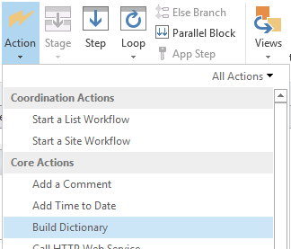
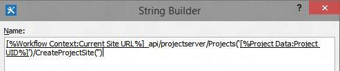

# 批量更新自定义字段并从 Project Online 中的工作流创建项目网站Bulk update custom fields and create project sites from a workflow in Project Online

为帮助客户充分利用 Project Online 和改进我们的服务扩展性和灵活性，我们为添加了两种方法可以在 Project Online 的应用程序和工作流中使用的客户端对象模型。To help customers get the most out of Project Online and improve our service extensibility and flexibility, we've added two methods to the client-side object model that you can use in Project Online apps and workflows.
  
|||
|:-----|:-----|
|**UpdateCustomFields****UpdateCustomFields**   |批量更新项目自定义域。Bulk updates project custom fields. 对于仅 Project Online。For Project Online only. 仅在 REST API 中可用。Available only in the REST API.    |
|**CreateProjectSite****CreateProjectSite**   | 创建项目网站。Creates a Project site. 对于仅 Project Online。For Project Online only. 在 REST API、 托管客户端对象模型和 JavaScript 客户端对象模型中可用。Available in the REST API, managed client object model, and JavaScript client object model.    |
   
除了提供更大的灵活性，这些方法还提供了显著的性能改进保存和发布工作流中的项目时。In addition to providing more flexibility, these methods also offer significant performance improvements when saving and publishing projects in a workflow. 本文介绍如何使用 REST API 中的方法，并提供用于创建工作流的批量更新自定义字段和创建项目网站的工作流的说明。This article describes how to use the methods in the REST API and provides instructions for creating a workflow that bulk updates custom fields and a workflow that creates a Project site.
  
> [!NOTE]
> 若要了解更多 REST Api 调用从 SharePoint 2013 工作流，请参阅[从 POST 方法与工作流的使用 SharePoint REST 服务](https://mysharepointinsight.blogspot.com/2013/05/using-sharepoint-rest-services-from.mdl)和[调用从 SharePoint Designer 工作流的 SharePoint 2013 Rest API](https://sergeluca.wordpress.com/2013/04/09/calling-the-sharepoint-2013-rest-api-from-a-sharepoint-designer-workflow/)。To learn more about calling REST APIs from SharePoint 2013 workflows, see [Using SharePoint REST services from workflow with POST method](https://mysharepointinsight.blogspot.com/2013/05/using-sharepoint-rest-services-from.mdl) and [Calling the SharePoint 2013 Rest API from a SharePoint Designer Workflow](https://sergeluca.wordpress.com/2013/04/09/calling-the-sharepoint-2013-rest-api-from-a-sharepoint-designer-workflow/). 
  
## 批量更新项目从工作流的自定义字段Bulk update project custom fields from a workflow

以前，工作流仅一次更新一个自定义字段。Previously, workflows could only update one custom field at a time. 一次更新项目自定义域一个会导致时用户转换项目详细信息页面之间的差的最终用户体验。Updating project custom fields one at a time can result in a poor end-user experience when users transition between Project Detail Pages. 每个更新所需使用**设置项目域**操作，一个单独的服务器请求和更新多个自定义字段在高延迟低带宽网络导致不常用的开销。Each update required a separate server request using the **Set Project Field** action, and updating multiple custom fields on a high-latency, low-bandwidth network resulted in a non-trivial overhead. 若要解决此问题，我们**UpdateCustomFields**方法添加到允许您批量更新自定义字段 REST API。To resolve this issue, we added the **UpdateCustomFields** method to the REST API that lets you bulk update custom fields. 若要使用**UpdateCustomFields**，您将传递包含的名称和您要更新的所有自定义字段值词典中。To use **UpdateCustomFields**, you pass in a dictionary that contains the names and values of all the custom fields you want to update.
  
下面的终结点上可以找到 REST 方法：The REST method can be found at the following endpoint:
  
`https://<site-url>/_api/ProjectServer/Projects('<guid>')/Draft/UpdateCustomFields()`
  
> [!NOTE]
> 替换`<site-url>`的 Project Web App (PWA) 网站的 url 示例中的占位符和`<guid>`与您的项目 UID 的占位符。Replace the  `<site-url>` placeholder in the examples with the URL of your Project Web App (PWA) site and the  `<guid>` placeholder with your project UID. 
  
本节介绍如何创建工作流的批量更新项目的自定义域。This section describes how to create a workflow that bulk updates custom fields for a project. 工作流包括以下高级步骤：The workflow follows these high-level steps:
  
- 等待要更新，以获取签入项目Wait for the project that you want to update to get checked in
    
- 构建一个定义项目的所有自定义字段更新的数据集Build a data set that defines all your custom field updates for the project
    
- 签出项目Check out the project
    
- 调用**UpdateCustomFields**自定义字段更新应用到项目Call **UpdateCustomFields** to apply the custom field updates to the project 
    
- 登录相关信息的工作流历史记录列表 （如果需要）Log relevant information to the workflow history list (if required)
    
- 发布项目Publish the project
    
- 签入项目Check in the project
    
最终的端到端工作流如下所示：The final, end-to-end workflow looks like this:
  

  
### 创建工作流的批量更新自定义字段To create a workflow that bulk updates custom fields

1. 可选。Optional. 您可以使用整个工作流变量中存储项目的完整的 URL。Store the full URL of your project in a variable that you can use throughout the workflow.
    
    
  
2. 将**等待项目事件**操作添加到工作流，并选择**一个项目签入时**事件。Add the **Wait for Project Event** action to the workflow and choose the **When a project is checked in** event. 
    
    
  
3. 创建使用**生成字典**操作**requestHeader**词典。Create a **requestHeader** dictionary using the **Build dictionary** action. 所有 web 服务调用该工作流中，您可以使用相同的请求标头。You'll use the same request header for all the web service calls in this workflow. 
    
    
  
4. 将以下两项添加到词典。Add the following two items to the dictionary.
    
    |名称Name|类型Type|值Value|
    |:-----|:-----|:-----|
    |AcceptAccept    |StringString    |应用程序/json;odata = verboseapplication/json; odata=verbose    |
    |Content-TypeContent-Type    |StringString    |应用程序/json;odata = verboseapplication/json; odata=verbose    |
   
    
  
5. 创建使用**生成字典**操作**requestBody**词典。Create a **requestBody** dictionary using the **Build dictionary** action. 该词典存储要应用的所有字段更新。This dictionary stores all the field updates that you want to apply. 
    
    每个自定义字段更新需要四行： 该字段的 （1） 元数据类型、 （2） 密钥、 （3） 值和 （4） 值类型。Each custom field update requires four rows: the field's (1) metadata type, (2) key, (3) value, and (4) value type.
    
    - **__metadata/类型**该字段的元数据类型。**__metadata/type** The field's metadata type. 此记录始终是相同，并使用以下值：This record is always the same and uses the following values: 
    
       - 名称： customFieldDictionary （i）/__metadata/类型 （其中**i**是中每个自定义字段的词典，从 0 开始进行索引）Name: customFieldDictionary(i)/__metadata/type (where **i** is the index of each custom field in the dictionary, starting with 0) 
            
       - 类型：字符串Type: String
            
       - 值： sp。KeyValueValue: SP.KeyValue
    
       
  
    - **键**格式中的自定义字段的内部名称： *Custom_ce23fbf43fa0e411941000155d3c8201***Key** The internal name of the custom field, in the format: *Custom_ce23fbf43fa0e411941000155d3c8201* 
    
       您可以通过导航到它的**InternalName**终结点中找到的自定义字段的内部名称：`https://<site-url>/_api/ProjectServer/CustomFields('<guid>')/InternalName`You can find the internal name of a custom field by navigating to it's **InternalName** endpoint: `https://<site-url>/_api/ProjectServer/CustomFields('<guid>')/InternalName`
    
       如果手动创建自定义域，值将不同站点到站点。If you created your custom fields manually, the values will differ from site to site. 如果您打算在多个网站重用工作流，请确保自定义字段 Id 正确。If you plan to reuse the workflow across multiple sites, make sure the custom field IDs are correct.
    
    - **值**要分配自定义域的值。**Value** The value to assign to the custom field. 链接到查阅表格的自定义域，您需要使用而不是实际的查阅表格值的查找表条目的内部名称。For custom fields that are linked to lookup tables, you need to use the internal names of the lookup table entries instead of the actual lookup table values. 
    
       您可以找到以下端点处的查阅表格项的内部名称：`https://<site-url>/_api/ProjectServer/CustomFields('<guid>')/LookupEntries('<guid>')/InternalName`You can find the internal name of the lookup table entry at the following endpoint: `https://<site-url>/_api/ProjectServer/CustomFields('<guid>')/LookupEntries('<guid>')/InternalName`
    
       如果您具有查找表自定义字段设置为接受多个值，请使用`;#`来连接值 （如下面的示例词典中所示）。If you have a lookup table custom field set up to accept multiple values, use  `;#` to concatenate values (as shown in the example dictionary below). 
    
    - **ValueType**要更新的自定义字段类型。**ValueType** The type of the custom field you are updating. 
    
       - 对于文本、 工期、 标志和 LookupTable 字段，使用 Edm.StringFor Text, Duration, Flag, and LookupTable fields, use Edm.String
    
       - 对于数字字段，使用 Edm.Int32、 Edm.Double 或任何其他 OData 接受数字类型For Number fields, use Edm.Int32, Edm.Double, or any other OData-accepted number type
    
       - 对于日期字段中，使用 Edm.DateTimeFor Date fields, use Edm.DateTime
    
       下面的示例词典定义三个自定义域的更新。The example dictionary below defines updates for three custom fields. 第一个是多值查找表自定义字段、 第二个是数字字段，和第三个是日期字段。The first is for a multiple value lookup table custom field, the second is for a number field, and the third is for a date field. 注意如何**customFieldDictionary**索引增量。Note how the **customFieldDictionary** index increments. 
    
       > [!NOTE]
       > 这些值是仅用于图。These values are for illustration purposes only. 您可以使用的键 / 值对取决于您的 PWA 数据。The key-value pairs you'll use depend on your PWA data. 
  
       |名称Name|类型Type|值Value|
       |:-----|:-----|:-----|
       |customFieldDictionary (0) / __metadata/类型customFieldDictionary(0)/__metadata/type    |StringString    |SP。KeyValueSP.KeyValue    |
       |customFieldDictionary (0) / 键customFieldDictionary(0)/Key    |StringString    |自定义\_ce23fbf43fa0e411941000155d3c8201Custom\_ce23fbf43fa0e411941000155d3c8201    |
       |customFieldDictionary (0) / 值customFieldDictionary(0)/Value    |StringString    |条目\_b9a2fd69279de411940f00155d3c8201; #Entry\_baa2fd69279de411940f00155d3c8201Entry\_b9a2fd69279de411940f00155d3c8201;#Entry\_baa2fd69279de411940f00155d3c8201    |
       |customFieldDictionary (0) / ValueTypecustomFieldDictionary(0)/ValueType    |StringString    |Edm.StringEdm.String    |
       |customFieldDictionary （1）/__metadata/类型customFieldDictionary(1)/__metadata/type    |StringString    |SP。KeyValueSP.KeyValue    |
       |customFieldDictionary （1）/键customFieldDictionary(1)/Key    |StringString    |Custom_c7f114c97098e411940f00155d3c8201Custom_c7f114c97098e411940f00155d3c8201    |
       |customFieldDictionary （1）/值customFieldDictionary(1)/Value    |StringString    |90.590.5    |
       |customFieldDictionary （1) / ValueTypecustomFieldDictionary(1)/ValueType    |StringString    |Edm.DoubleEdm.Double    |
       |customFieldDictionary （2）/__metadata/类型customFieldDictionary(2)/__metadata/type    |StringString    |SP。KeyValueSP.KeyValue    |
       |customFieldDictionary （2）/键customFieldDictionary(2)/Key    |StringString    |Custom_c6fb67e0b9a1e411941000155d3c8201Custom_c6fb67e0b9a1e411941000155d3c8201    |
       |customFieldDictionary （2）/值customFieldDictionary(2)/Value    |StringString    |2015-04-01T00:00:00.00000002015-04-01T00:00:00.0000000    |
       |customFieldDictionary （2) / ValueTypecustomFieldDictionary(2)/ValueType    |StringString    |Edm.DateTimeEdm.DateTime    |
   
       
  
6. 添加**调用 HTTP Web 服务**操作签出的项目。Add a **Call HTTP Web Service** action to check the project out. 
    
    
  
7. 编辑 web 服务调用指定请求标头的属性。Edit the properties of the web service call to specify the request header. 要打开**属性**对话框，请右键单击操作，然后选择**属性**。To open the **Properties** dialog box, right-click the action and choose **Properties**.
    
    
  
8. 添加**调用 HTTP Web 服务**操作调用**UpdateCustomFields**方法。Add a **Call HTTP Web Service** action to call the **UpdateCustomFields** method. 
    
    
  
    注意`/Draft/`段中的 web 服务 URL。Note the  `/Draft/` segment in the web service URL. 完整的 URL 应如下所示：`https://<site-url>/_api/ProjectServer/Projects('<guid>')/Draft/UpdateCustomFields()`The full URL should look like this: `https://<site-url>/_api/ProjectServer/Projects('<guid>')/Draft/UpdateCustomFields()`
    
    
  
9. 编辑 web 服务调用将**RequestHeader**和**RequestContent**参数绑定词典您创建的属性。Edit the properties of the web service call to bind the **RequestHeader** and **RequestContent** parameters to the dictionaries you created. 您还可以创建的新变量来存储**ResponseContent**。You can also create a new variable to store the **ResponseContent**.
    
    
  
10. 可选。Optional. 读取响应字典来检查队列作业的状态和日志中的工作流历史记录列表的信息。Read from the response dictionary to check the state of the queue job and log the information in the workflow history list.
    
    
  
11. 添加到**发布**的终结点的 web 服务调用，以发布项目。Add a web service call to the **Publish** endpoint to publish the project. 始终使用相同的请求标头。Always use the same request header. 
    
    
  
    
  
12. 添加对**Checkin**终结点的最后一个 web 服务调用，签入项目。Add a final web service call to the **Checkin** endpoint to check the project in. 
    
    
  
    

## 从工作流创建项目网站Create a Project site from a workflow

每个项目都可以具有自己专用的 SharePoint 网站，其中工作组成员可以协作、 共享文档、 提出问题，等等。Every project can have its own dedicated SharePoint sites where team members can collaborate, share documents, raise issues, and so on. 以前，无法仅创建网站上自动首先发布或手动按项目经理在 Project Professional 或 PWA 中的管理员设置，也无法被禁用。Previously, sites could only be created automatically on first publish or manually by the project manager in Project Professional or by the administrator in PWA settings, or they could be disabled.
  
我们已添加**CreateProjectSite**方法，以便您可以选择何时创建项目网站。We've added the **CreateProjectSite** method so you can choose when to create project sites. 这是对要项目建议达到预定义工作流中的特定容器时自动创建其网站，而不是第一个发布的组织特别有用。This is particularly useful for organizations who want to create their sites automatically when a project proposal reaches a specific stage in a pre-defined workflow, rather than on first publish. 推迟项目网站创建会显著提高了创建项目的性能。Postponing project site creation significantly improves the performance of creating a project. 
  
**必备：** 您可以使用**CreateProjectSite**之前，必须**设置 PWA**中创建的项目网站设置**允许用户选择**设置 > \* \* 连接的 SharePoint 网站 \* \* >**设置**。**Prerequisite:** Before you can use **CreateProjectSite**, the **Allow users to choose** setting must be set for project site creation in **PWA Settings** > \*\* Connected SharePoint Sites \*\* > **Settings**.
  

  
### 创建工作流创建项目网站To create a workflow that creates a Project site

1. 创建或编辑现有工作流和选择想要创建项目网站的步骤。Create or edit an existing workflow and select the step where you want to create your Project sites.
    
2. 创建使用**生成字典**操作**requestHeader**词典。Create a **requestHeader** dictionary using the **Build dictionary** action. 
    
    
  
3. 将以下两项添加到词典。Add the following two items to the dictionary.
    
    |名称Name|类型Type|值Value|
    |:-----|:-----|:-----|
    |AcceptAccept    |StringString    |应用程序/json;odata = verboseapplication/json; odata=verbose    |
    |Content-TypeContent-Type    |StringString    |应用程序/json;odata = verboseapplication/json; odata=verbose    |
   
    
  
4. 添加**调用 HTTP Web 服务**操作。Add the **Call HTTP Web Service** action. 更改要使用**POST**请求类型，并设置使用以下格式的 URL:Change the request type to use **POST**, and set the URL using the following format:
    
    `https://<site-url>/_api/ProjectServer/Projects('<guid>')/CreateProjectSite('New web name')`
    
    
  
    作为字符串传递给**CreateProjectSite**方法的项目网站的名称。Pass the name of the Project site to the **CreateProjectSite** method as a string. 若要作为网站名称中使用的项目名称，传递一个空字符串。To use the project name as the site name, pass an empty string. 请务必使用唯一的名称，因此您创建的下一个项目网站将起作用。Be sure to use unique names so the next project site you create will work. 
    
5. 编辑将**RequestHeader**参数绑定到字典 web 服务呼叫您创建的属性。Edit the properties of the web service call to bind the **RequestHeader** parameter to the dictionary you created. 
    
    
  
## 另请参阅See also

- [Project 编程任务Project programming tasks](project-programming-tasks.md)
- [Project 2013 的客户端对象模型 (CSOM)Client-side object model (CSOM) for Project 2013](client-side-object-model-csom-for-project-2013.md)
- [SharePoint 2013 中的工作流Workflows in SharePoint 2013](https://msdn.microsoft.com/library/e0602371-ae22-44be-8a7e-9e47e9f046d6%28Office.15%29.aspx)
    

