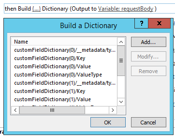

# 批量更新自定义字段并从 Project Online 中的工作流创建项目网站

为帮助客户充分利用 Project Online 和改进我们的服务扩展性和灵活性，我们为添加了两种方法可以在 Project Online 的应用程序和工作流中使用的客户端对象模型。
  
|||
|:-----|:-----|
|**UpdateCustomFields**   |批量更新项目自定义域。 对于仅 Project Online。 仅在 REST API 中可用。    |
|**CreateProjectSite**   | 创建项目网站。 对于仅 Project Online。 在 REST API、 托管客户端对象模型和 JavaScript 客户端对象模型中可用。    |
   
除了提供更大的灵活性，这些方法还提供了显著的性能改进保存和发布工作流中的项目时。 本文介绍如何使用 REST API 中的方法，并提供用于创建工作流的批量更新自定义字段和创建项目网站的工作流的说明。
  
> [!NOTE]
> 若要了解更多 REST Api 调用从 SharePoint 2013 工作流，请参阅[从 POST 方法与工作流的使用 SharePoint REST 服务](https://mysharepointinsight.blogspot.com/2013/05/using-sharepoint-rest-services-from.mdl)和[调用从 SharePoint Designer 工作流的 SharePoint 2013 Rest API](https://sergeluca.wordpress.com/2013/04/09/calling-the-sharepoint-2013-rest-api-from-a-sharepoint-designer-workflow/)。 
  
## 批量更新项目从工作流的自定义字段

以前，工作流仅一次更新一个自定义字段。 一次更新项目自定义域一个会导致时用户转换项目详细信息页面之间的差的最终用户体验。 每个更新所需使用**设置项目域**操作，一个单独的服务器请求和更新多个自定义字段在高延迟低带宽网络导致不常用的开销。 若要解决此问题，我们**UpdateCustomFields**方法添加到允许您批量更新自定义字段 REST API。 若要使用**UpdateCustomFields**，您将传递包含的名称和您要更新的所有自定义字段值词典中。
  
下面的终结点上可以找到 REST 方法：
  
`https://<site-url>/_api/ProjectServer/Projects('<guid>')/Draft/UpdateCustomFields()`
  
> [!NOTE]
> 替换`<site-url>`的 Project Web App (PWA) 网站的 url 示例中的占位符和`<guid>`与您的项目 UID 的占位符。 
  
本节介绍如何创建工作流的批量更新项目的自定义域。 工作流包括以下高级步骤：
  
- 等待要更新，以获取签入项目
    
- 构建一个定义项目的所有自定义字段更新的数据集
    
- 签出项目
    
- 调用**UpdateCustomFields**自定义字段更新应用到项目 
    
- 登录相关信息的工作流历史记录列表 （如果需要）
    
- 发布项目
    
- 签入项目
    
最终的端到端工作流如下所示：
  

  
### 创建工作流的批量更新自定义字段

1. 可选。 您可以使用整个工作流变量中存储项目的完整的 URL。
    
    
  
2. 将**等待项目事件**操作添加到工作流，并选择**一个项目签入时**事件。 
    
    
  
3. 创建使用**生成字典**操作**requestHeader**词典。 所有 web 服务调用该工作流中，您可以使用相同的请求标头。 
    
    
  
4. 将以下两项添加到词典。
    
    |名称|类型|值|
    |:-----|:-----|:-----|
    |Accept    |String    |应用程序/json;odata = verbose    |
    |Content-Type    |String    |应用程序/json;odata = verbose    |
   
    
  
5. 创建使用**生成字典**操作**requestBody**词典。 该词典存储要应用的所有字段更新。 
    
    每个自定义字段更新需要四行： 该字段的 （1） 元数据类型、 （2） 密钥、 （3） 值和 （4） 值类型。
    
    - **__metadata/类型**该字段的元数据类型。 此记录始终是相同，并使用以下值： 
    
       - 名称： customFieldDictionary （i）/__metadata/类型 （其中**i**是中每个自定义字段的词典，从 0 开始进行索引） 
            
       - 类型：字符串
            
       - 值： sp。KeyValue
    
       
  
    - **键**格式中的自定义字段的内部名称： *Custom_ce23fbf43fa0e411941000155d3c8201* 
    
       您可以通过导航到它的**InternalName**终结点中找到的自定义字段的内部名称：`https://<site-url>/_api/ProjectServer/CustomFields('<guid>')/InternalName`
    
       如果手动创建自定义域，值将不同站点到站点。 如果您打算在多个网站重用工作流，请确保自定义字段 Id 正确。
    
    - **值**要分配自定义域的值。 链接到查阅表格的自定义域，您需要使用而不是实际的查阅表格值的查找表条目的内部名称。 
    
       您可以找到以下端点处的查阅表格项的内部名称：`https://<site-url>/_api/ProjectServer/CustomFields('<guid>')/LookupEntries('<guid>')/InternalName`
    
       如果您具有查找表自定义字段设置为接受多个值，请使用`;#`来连接值 （如下面的示例词典中所示）。 
    
    - **ValueType**要更新的自定义字段类型。 
    
       - 对于文本、 工期、 标志和 LookupTable 字段，使用 Edm.String
    
       - 对于数字字段，使用 Edm.Int32、 Edm.Double 或任何其他 OData 接受数字类型
    
       - 对于日期字段中，使用 Edm.DateTime
    
       下面的示例词典定义三个自定义域的更新。 第一个是多值查找表自定义字段、 第二个是数字字段，和第三个是日期字段。 注意如何**customFieldDictionary**索引增量。 
    
       > [!NOTE]
       > 这些值是仅用于图。 您可以使用的键 / 值对取决于您的 PWA 数据。 
  
       |名称|类型|值|
       |:-----|:-----|:-----|
       |customFieldDictionary (0) / __metadata/类型    |String    |SP。KeyValue    |
       |customFieldDictionary (0) / 键    |String    |自定义\_ce23fbf43fa0e411941000155d3c8201    |
       |customFieldDictionary (0) / 值    |String    |条目\_b9a2fd69279de411940f00155d3c8201; #Entry\_baa2fd69279de411940f00155d3c8201    |
       |customFieldDictionary (0) / ValueType    |String    |Edm.String    |
       |customFieldDictionary （1）/__metadata/类型    |String    |SP。KeyValue    |
       |customFieldDictionary （1）/键    |String    |Custom_c7f114c97098e411940f00155d3c8201    |
       |customFieldDictionary （1）/值    |String    |90.5    |
       |customFieldDictionary （1) / ValueType    |String    |Edm.Double    |
       |customFieldDictionary （2）/__metadata/类型    |String    |SP。KeyValue    |
       |customFieldDictionary （2）/键    |String    |Custom_c6fb67e0b9a1e411941000155d3c8201    |
       |customFieldDictionary （2）/值    |String    |2015-04-01T00:00:00.0000000    |
       |customFieldDictionary （2) / ValueType    |String    |Edm.DateTime    |
   
       
  
6. 添加**调用 HTTP Web 服务**操作签出的项目。 
    
    
  
7. 编辑 web 服务调用指定请求标头的属性。 要打开**属性**对话框，请右键单击操作，然后选择**属性**。
    
    
  
8. 添加**调用 HTTP Web 服务**操作调用**UpdateCustomFields**方法。 
    
    
  
    注意`/Draft/`段中的 web 服务 URL。 完整的 URL 应如下所示：`https://<site-url>/_api/ProjectServer/Projects('<guid>')/Draft/UpdateCustomFields()`
    
    
  
9. 编辑 web 服务调用将**RequestHeader**和**RequestContent**参数绑定词典您创建的属性。 您还可以创建的新变量来存储**ResponseContent**。
    
    
  
10. 可选。 读取响应字典来检查队列作业的状态和日志中的工作流历史记录列表的信息。
    
    
  
11. 添加到**发布**的终结点的 web 服务调用，以发布项目。 始终使用相同的请求标头。 
    
    
  
    
  
12. 添加对**Checkin**终结点的最后一个 web 服务调用，签入项目。 
    
    
  
    

## 从工作流创建项目网站

每个项目都可以具有自己专用的 SharePoint 网站，其中工作组成员可以协作、 共享文档、 提出问题，等等。 以前，无法仅创建网站上自动首先发布或手动按项目经理在 Project Professional 或 PWA 中的管理员设置，也无法被禁用。
  
我们已添加**CreateProjectSite**方法，以便您可以选择何时创建项目网站。 这是对要项目建议达到预定义工作流中的特定容器时自动创建其网站，而不是第一个发布的组织特别有用。 推迟项目网站创建会显著提高了创建项目的性能。 
  
**必备：** 您可以使用**CreateProjectSite**之前，必须**设置 PWA**中创建的项目网站设置**允许用户选择**设置 > * * 连接的 SharePoint 网站 * * >**设置**。
  

  
### 创建工作流创建项目网站

1. 创建或编辑现有工作流和选择想要创建项目网站的步骤。
    
2. 创建使用**生成字典**操作**requestHeader**词典。 
    
    
  
3. 将以下两项添加到词典。
    
    |名称|类型|值|
    |:-----|:-----|:-----|
    |Accept    |String    |应用程序/json;odata = verbose    |
    |Content-Type    |String    |应用程序/json;odata = verbose    |
   
    
  
4. 添加**调用 HTTP Web 服务**操作。 更改要使用**POST**请求类型，并设置使用以下格式的 URL:
    
    `https://<site-url>/_api/ProjectServer/Projects('<guid>')/CreateProjectSite('New web name')`
    
    
  
    作为字符串传递给**CreateProjectSite**方法的项目网站的名称。 若要作为网站名称中使用的项目名称，传递一个空字符串。 请务必使用唯一的名称，因此您创建的下一个项目网站将起作用。 
    
5. 编辑将**RequestHeader**参数绑定到字典 web 服务呼叫您创建的属性。 
    
    
  
## 另请参阅

- [Project 编程任务](project-programming-tasks.md)
- [Project 2013 的客户端对象模型 (CSOM)](client-side-object-model-csom-for-project-2013.md)
- [SharePoint 2013 中的工作流](https://msdn.microsoft.com/library/e0602371-ae22-44be-8a7e-9e47e9f046d6%28Office.15%29.aspx)
    

