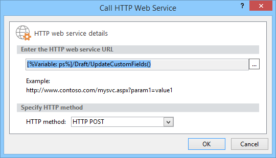

# 批量更新自定义字段并通过 Project Online 中的工作流创建项目网站

为帮助客户充分利用 project online 并提高服务可扩展性和灵活性, 我们为客户端对象模型添加了两种方法, 可在 Project Online 应用程序和工作流中使用。
  
|||
|:-----|:-----|
|**UpdateCustomFields**   |批量更新项目自定义域。 仅适用于 Project Online。 仅适用于 REST API。    |
|**CreateProjectSite**   | 创建项目网站。 仅适用于 Project Online。 在 REST API、托管客户端对象模型和 JavaScript 客户端对象模型中可用。    |
   
除了提供更大的灵活性之外, 在工作流中保存和发布项目时, 这些方法还会显著提高性能。 本文介绍如何使用 REST API 中的方法, 并提供有关创建批量更新自定义字段和创建项目网站的工作流的工作流的说明。
  
> [!NOTE]
> 若要了解有关从 sharepoint 2013 工作流调用 REST api 的详细信息, 请参阅[使用 sharepoint REST 服务从具有 POST 方法的工作流](https://mysharepointinsight.blogspot.com/2013/05/using-sharepoint-rest-services-from.mdl)和[从 sharepoint Designer 工作流调用 sharepoint 2013 REST API](https://sergeluca.wordpress.com/2013/04/09/calling-the-sharepoint-2013-rest-api-from-a-sharepoint-designer-workflow/)。 
  
## 从工作流批量更新项目自定义域

以前, 工作流一次只能更新一个自定义字段。 一次更新一个项目自定义域会导致用户在项目详细信息页面之间过渡时遇到较差的最终用户体验。 每次更新都需要使用**设置项目域**操作和更新多个自定义字段在高延迟 (低带宽网络) 上的单独服务器请求, 从而产生无意义的开销。 若要解决此问题, 我们向 REST API 添加了**UpdateCustomFields**方法, 该方法允许您批量更新自定义字段。 若要使用**UpdateCustomFields**, 请在包含要更新的所有自定义域的名称和值的词典中进行传递。
  
可以在以下终结点找到 REST 方法:
  
`https://<site-url>/_api/ProjectServer/Projects('<guid>')/Draft/UpdateCustomFields()`
  
> [!NOTE]
> 将示例`<site-url>`中的占位符替换为 project Web App (PWA) 网站的 URL, 并将`<guid>`占位符替换为项目 UID。 
  
本节介绍如何创建批量更新项目的自定义字段的工作流。 工作流遵循以下高级别步骤:
  
- 等待要更新的项目以供签入
    
- 构建一个定义项目的所有自定义字段更新的数据集
    
- 签出项目
    
- 调用**UpdateCustomFields**以将自定义字段更新应用于项目 
    
- 将相关信息记录到工作流历史记录列表中 (如果需要)
    
- 发布项目
    
- 签入项目
    
最终的端到端工作流如下所示:
  

  
### 创建批量更新自定义字段的工作流

1. 可选。 将项目的完整 URL 存储在可在整个工作流中使用的变量中。
    
    
  
2. 将 "**等待项目事件**" 操作添加到工作流, 并选择 "在事件**中检查项目时**"。 
    
    
  
3. 使用 "**生成字典**" 操作创建**requestHeader**字典。 您将对此工作流中的所有 web 服务调用使用相同的请求标头。 
    
    
  
4. 将以下两个项添加到字典中。
    
    |名称|类型|值|
    |:-----|:-----|:-----|
    |Accept    |字符串    |application/json;odata = verbose    |
    |Content-Type    |字符串    |application/json;odata = verbose    |
   
    
  
5. 使用 "**生成字典**" 操作创建**requestBody**字典。 此字典存储要应用的所有域更新。 
    
    每个自定义字段更新需要四行: 字段的 (1) 元数据类型、(2) 键、(3) 值和 (4) 值类型。
    
    - **__metadata/type**字段的元数据类型。 此记录始终是相同的, 并使用以下值: 
    
       - Name: customFieldDictionary (i)/__metadata/type (其中**i**是字典中每个自定义字段的索引, 从0开始) 
            
       - 类型：字符串
            
       - Value: SP。键值
    
       
  
    - **键**自定义字段的内部名称, 格式为: *Custom_ce23fbf43fa0e411941000155d3c8201* 
    
       您可以通过导航到自定义字段的**InternalName**终结点来查找该自定义字段的内部名称:`https://<site-url>/_api/ProjectServer/CustomFields('<guid>')/InternalName`
    
       如果手动创建自定义字段, 则这些值将不同于网站。 如果您计划跨多个网站重用工作流, 请确保自定义域 id 正确。
    
    - **值**要分配给自定义域的值。 对于链接到查阅表格的自定义域, 您需要使用查阅表格条目的内部名称, 而不是实际的查阅表格值。 
    
       您可以在以下终结点查找查找表条目的内部名称:`https://<site-url>/_api/ProjectServer/CustomFields('<guid>')/LookupEntries('<guid>')/InternalName`
    
       如果有一个查阅表格自定义字段设置为接受多个值, 请`;#`使用连接值 (如下面的示例字典所示)。 
    
    - **ValueType**您要更新的自定义域的类型。 
    
       - 对于 "文本"、"持续时间"、"标志" 和 "LookupTable" 字段, 使用 Edm. String
    
       - 对于 Number 字段, 请使用 Edm、edm 或任何其他 OData-接受的数字类型
    
       - 对于 "日期" 字段, 使用 Edm. DateTime
    
       下面的示例字典定义了三个自定义域的更新。 第一个是针对多值查阅表格自定义域, 第二个用于 "数字" 字段, 第三个用于 "日期" 字段。 请注意**customFieldDictionary**索引是如何递增的。 
    
       > [!NOTE]
       > 这些值仅用于说明目的。 您将使用的键值对取决于 PWA 数据。 
  
       |名称|类型|值|
       |:-----|:-----|:-----|
       |customFieldDictionary (0)/__metadata/type    |字符串    |SP.键值    |
       |customFieldDictionary (0)/Key    |字符串    |自\_定义 ce23fbf43fa0e411941000155d3c8201    |
       |customFieldDictionary (0)/Value    |字符串    |条目\_b9a2fd69279de411940f00155d3c8201; #Entry\_baa2fd69279de411940f00155d3c8201    |
       |customFieldDictionary (0)/ValueType    |字符串    |Edm.String    |
       |customFieldDictionary (1)/__metadata/type    |字符串    |SP.键值    |
       |customFieldDictionary (1)/Key    |字符串    |Custom_c7f114c97098e411940f00155d3c8201    |
       |customFieldDictionary (1)/Value    |字符串    |90。5    |
       |customFieldDictionary (1)/ValueType    |字符串    |Edm.Double    |
       |customFieldDictionary (2)/__metadata/type    |字符串    |SP.键值    |
       |customFieldDictionary (2)/Key    |字符串    |Custom_c6fb67e0b9a1e411941000155d3c8201    |
       |customFieldDictionary (2)/Value    |字符串    |2015-04-01T00:00: 00.0000000    |
       |customFieldDictionary (2)/ValueType    |字符串    |Edm.DateTime    |
   
       
  
6. 添加 "**调用 HTTP Web 服务**" 操作以签出项目。 
    
    
  
7. 编辑 web 服务调用的属性, 以指定请求标头。 若要打开 "**属性**" 对话框, 请右键单击该操作, 然后选择 "**属性**"。
    
    
  
8. 添加 "**调用 HTTP Web 服务**" 操作以调用**UpdateCustomFields**方法。 
    
    
  
    记下`/Draft/` web 服务 URL 中的段。 完整的 URL 应如下所示:`https://<site-url>/_api/ProjectServer/Projects('<guid>')/Draft/UpdateCustomFields()`
    
    
  
9. 编辑 web 服务调用的属性, 将**RequestHeader**和**RequestContent**参数绑定到您创建的词典。 您还可以创建新变量来存储**ResponseContent**。
    
    
  
10. 可选。 从响应字典中读取以检查队列作业的状态, 并将信息记录在 "工作流历史记录" 列表中。
    
    
  
11. 将 web 服务调用添加到**发布**终结点以发布项目。 始终使用相同的请求标头。 
    
    
  
    
  
12. 向**签入**终结点添加最终 web 服务调用, 以检查中的项目。 
    
    
  
    

## 从工作流创建项目网站

每个项目都可以拥有自己的专用 SharePoint 网站, 工作组成员可以在其中进行协作、共享文档、提出问题等。 以前, 只有在 project Professional 中的项目经理或由 PWA 设置中的管理员手动发布或手动创建网站时, 才能自动创建网站, 否则这些网站可能会被禁用。
  
我们已经添加了**CreateProjectSite**方法, 以便您可以选择何时创建项目网站。 对于希望在项目建议到达预定义工作流中的特定阶段 (而不是第一次发布) 时自动创建其网站的组织而言, 这一点尤其有用。 推迟创建项目网站可大大提高项目的创建性能。 
  
**先决条件:** 在使用**CreateProjectSite**之前, 必须为在**PWA 设置**> * * 连接的 SharePoint 网站 * * >**设置**中的项目网站创建设置 "**允许用户选择**设置"。
  

  
### 创建创建项目网站的工作流

1. 创建或编辑现有工作流, 然后选择要在其中创建项目网站的步骤。
    
2. 使用 "**生成字典**" 操作创建**requestHeader**字典。 
    
    
  
3. 将以下两个项添加到字典中。
    
    |名称|类型|值|
    |:-----|:-----|:-----|
    |Accept    |字符串    |application/json;odata = verbose    |
    |Content-Type    |字符串    |application/json;odata = verbose    |
   
    
  
4. 添加 "**调用 HTTP Web 服务**" 操作。 将请求类型更改为使用**POST**, 并使用以下格式设置 URL:
    
    `https://<site-url>/_api/ProjectServer/Projects('<guid>')/CreateProjectSite('New web name')`
    
    
  
    将项目网站的名称作为字符串传递给**CreateProjectSite**方法。 若要将项目名称用作网站名称, 请传递一个空字符串。 请务必使用唯一名称, 以便您创建的下一个项目网站能够正常工作。 
    
5. 编辑 web 服务调用的属性, 将**RequestHeader**参数绑定到您创建的词典。 
    
    将![字典绑定到请求]将(media/61a5a0a8-405f-44eb-b5e7-80b11f7caec3.png "字典绑定到请求")
  
## 另请参阅

- [Project 编程任务](project-programming-tasks.md)
- [Project 2013 的客户端对象模型 (CSOM)](client-side-object-model-csom-for-project-2013.md)
- [SharePoint 2013 中的工作流](https://msdn.microsoft.com/library/e0602371-ae22-44be-8a7e-9e47e9f046d6%28Office.15%29.aspx)
    

