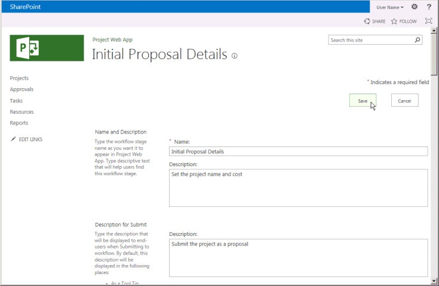
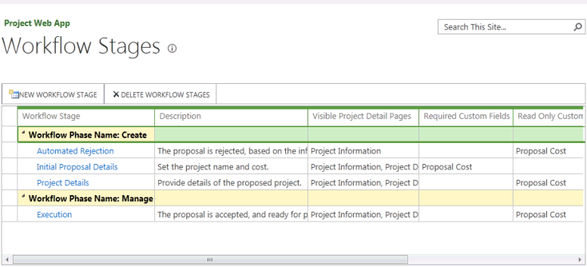
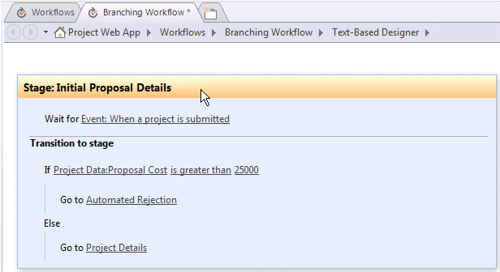
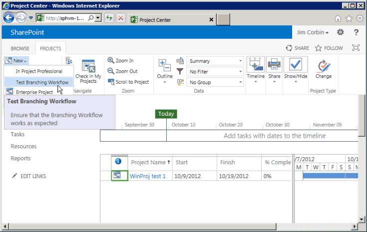
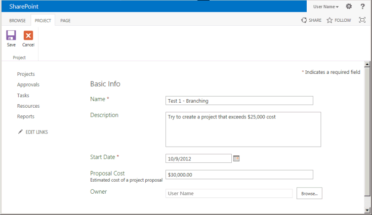
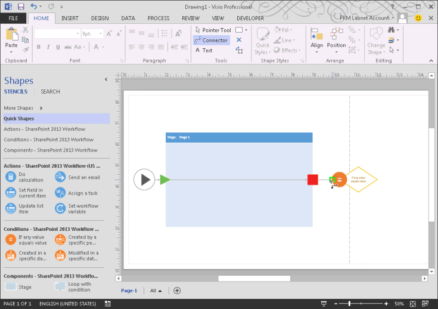
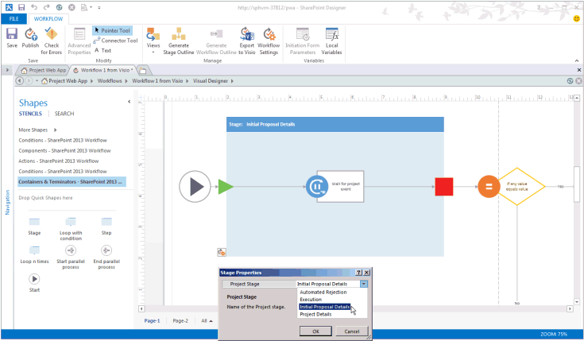

# 创建 Project Server 工作流的需求管理Create a Project Server workflow for demand management

本文介绍如何使用 SharePoint Designer 2013 中创建简单的工作流。This article describes how to create a simple workflow by using SharePoint Designer 2013. 您可以导出到 Visio 2013 的工作流可视化和编辑，或设计 Project Server 2013 工作流中使用 Visio 2013 和导入 SharePoint Designer 2013 到 Project Web App 的出版物的设计。You can export the workflow to Visio 2013 for visualization and editing, or use Visio 2013 to design Project Server 2013 workflows and import the design into SharePoint Designer 2013 for publication to Project Web App. 有关 SharePoint 工作流平台和使用 Visio 2013 和 SharePoint Designer 2013 创建工作流的详细信息，请参阅 SharePoint 2013 开发人员文档中的[Workflows in SharePoint 2013](http://msdn.microsoft.com/en-us/library/jj163986%28office.15%29.aspx)文章。For more information about the SharePoint workflow platform and creating workflows with Visio 2013 and SharePoint Designer 2013, see the [Workflows in SharePoint 2013](http://msdn.microsoft.com/en-us/library/jj163986%28office.15%29.aspx) articles in the SharePoint 2013 developer documentation. 
  
有关准备 Project Server 工作流的信息，请参阅[开始： 设置并配置 SharePoint 2013 工作流管理器](http://msdn.microsoft.com/en-us/library/jj163276%28office.15%29.aspx)。For information about preparing Project Server for workflows, see [Start: Set up and configure SharePoint 2013 Workflow Manager](http://msdn.microsoft.com/en-us/library/jj163276%28office.15%29.aspx).

## 创建常规工作流Creating a general workflow

使用以下步骤使用 SharePoint Designer 2013 创建 Project Server 2013 工作流。Use the following steps to create a Project Server 2013 workflow by using SharePoint Designer 2013. 工作流专为需求管理的项目建议。The workflow is designed for demand management of project proposals.
  
详细步骤，请参阅[创建分支工作流](#pj15_CreateWorkflowSPD_Detailed)一节。For detailed steps, see the [Creating a branching workflow](#pj15_CreateWorkflowSPD_Detailed) section. 
  
### 创建 Project Server 工作流（常规过程）To create a Project Server workflow (general procedure)

1. 确定需求，然后设计工作流。将工作流组织到阶段和容器，并确定工作流将使用的自定义域。Determine the requirements, and then design the workflow. Organize it into phases and stages, and determine the custom fields that the workflow will use.
    
2. Project Web App 中创建工作流需要的实体：In Project Web App, create the entities that the workflow requires:
    
    1. 查看现有工作流阶段；创建必要的阶段。Review the existing workflow phases; create phases as necessary.
        
    2. 创建工作流将使用的企业自定义域。自定义域必须由工作流控制才能在工作流容器使用。Create the enterprise custom fields that the workflow will use. To be available in a workflow stage, a custom field must be controlled by a workflow.
        
    3. 编辑或创建您的工作流容器将用于收集项目信息的项目详细信息页 (PDP)。在本示例中，容器将使用编辑为包含新的自定义域的默认 PDP。Edit or create the project detail pages (PDPs) that your workflow stages will use to collect information for the project. In this example, the stages use default PDPs that are edited to include a new custom field.
        
    4. 创建必要的工作流容器，然后将每个工作流容器与对应的阶段关联。Create the necessary workflow stages, and then associate each workflow stage with the correct phase.
    
3. SharePoint Designer 2013 中**基于文本的设计器**中使用声明性语句来构造工作流：In SharePoint Designer 2013, construct the workflow by using declarative statements in the **Text-Based Designer**:
    
    > [!NOTE]
    > 您还可以切换到 SharePoint Designer 2013 中的**可视化设计器**或从 Visio 2013 中导入现有工作流。You can also switch to the **Visual Designer** in SharePoint Designer 2013, or import an existing workflow from Visio 2013. 按照以下步骤使用**基于文本的设计器**：Follow these steps to use the **Text-Based Designer**: 
    > 
    > 1. 打开 Project Web App 网站，然后再创建使用**SharePoint 2013 工作流-Project Server**工作流平台的网站工作流。Open the Project Web App site, and then create a site workflow that uses the **SharePoint 2013 Workflow - Project Server** workflow platform. 
    > 2. 添加工作流使用的容器。Add the stages that the workflow uses.
    > 3. 插入每个容器中所需的工作流步骤、条件、操作和循环。Insert the workflow steps, conditions, actions, and loops that are required in each stage.
    > 4. 检查任何工作流错误并纠正您找到的所有错误。Check for any workflow errors and fix any that you find.
    > 5. （可选）将视图切换到**可视化设计器**中，或将工作流导出到 Visio 2013 文件。(Optional) Switch the view to the **Visual Designer**, or export the workflow to a Visio 2013 file. 您可以修改 Visio 视图，并将更改保存到当前工作流。You can modify the Visio view and save changes to the current workflow. 您可以编辑 Visio 文件，并将其导入在 SharePoint Designer 2013 创建其他工作流。You can edit the Visio file and import it in SharePoint Designer 2013 to create other workflows.
    > 6. 发布工作流。Publish the workflow. 发布后，工作流显示在列表中的 Project Web App 网站工作流。After it is published, the workflow shows in the list of workflows for the Project Web App site.
    
4. Project Web App 中使用的需求管理的项目建议工作流：In Project Web App, use the workflow for demand management of project proposals:
    
    1. 创建使用工作流的企业项目模板 (EPT)。Create an enterprise project template (EPT) that uses the workflow.
        
    2. 在“项目中心”页上，创建使用工作流的 EPT 的项目，然后继续完成其他工作流容器。On the Project Center page, create a project that uses the EPT for the workflow, and then follow through the workflow stages.
        
    3. 全面测试工作流。Test the workflow thoroughly.
        
    4. 将工作流部署到生产服务器。Deploy the workflow to a production server.

## 创建分支工作流Creating a branching workflow

您可以使用 SharePoint Designer 2013 创建 Project Server 工作流之前，必须配置工作流管理器客户端 1.0 服务用于 Project Server 2013 工作流活动。Before you can use SharePoint Designer 2013 to create a Project Server workflow, the Workflow Manager Client 1.0 service must be configured to use the Project Server 2013 workflow activities. 有关如何配置工作流管理器客户端 1.0 的信息，请参阅 SharePoint Server 2013 开发人员文档中的[Workflows in SharePoint 2013](http://msdn.microsoft.com/en-us/library/jj163986%28office.15%29.aspx)文章。For information about how to configure Workflow Manager Client 1.0, see the [Workflows in SharePoint 2013](http://msdn.microsoft.com/en-us/library/jj163986%28office.15%29.aspx) articles in the SharePoint Server 2013 developer documentation. 
  
下面的详细的过程包含相同的步骤，如[创建常规工作流](#pj15_CreateWorkflowSPD_General)部分中所示。The following detailed procedure includes the same steps as in the [Creating a general workflow](#pj15_CreateWorkflowSPD_General) section. 
  
### 创建 Project Server 分支工作流（详细过程）To create a Project Server branching workflow (detailed procedure)

#### 1.规划和设计工作流。1. Plan and design the workflow.

Project Server 工作流可以集成具有多个阶段和阶段中的需求管理过程。A Project Server workflow can integrate with multiple stages and phases in a demand-management process. 因为工作流可以很复杂，您必须了解的业务要求，并仔细规划工作流。Because workflows can be complex, you must understand the business requirements and plan a workflow carefully. 对于简单示例，设计使用项目建议的估计的成本来确定是否接受建议的分支工作流。For a simple example, design a branching workflow that uses the estimated cost of a project proposal to determine whether the proposal is accepted. 如果估计的成本更高版本比 25000 美元，拒绝此建议;否则为接受建议，并创建项目。If the estimated cost is greater than $25,000 USD, reject the proposal; otherwise, accept the proposal and create the project.
    
因为您可以使用 Visio 2013 和 SharePoint Designer 2013 来帮助设计和 Project Server 2013 中创建工作流，您可以更轻松地尝试与工作流可以使用 Project Server 2010。Because you can use Visio 2013 and SharePoint Designer 2013 to help design and create workflows for Project Server 2013, you can more easily experiment with workflows than is possible with Project Server 2010. 本文中的示例工作流设计是[创建分支工作流](http://msdn.microsoft.com/library/a02cafdc-d881-4271-b446-d8b2cd456a52%28Office.15%29.aspx)文章 Project 2010 SDK 中相同。The sample workflow design in this article is the same as in the [Create a branching workflow](http://msdn.microsoft.com/library/a02cafdc-d881-4271-b446-d8b2cd456a52%28Office.15%29.aspx) article in the Project 2010 SDK. 您可以设计并使用 Project Web App 的测试实例的远程计算机上创建测试工作流 — 不需要直接在 Project Server 2013 计算机上创建工作流。You can design and create a test workflow on a remote computer using a test instance of Project Web App—you do not have to create workflows directly on a Project Server 2013 computer. 
    
#### 2.创建工作流需要的实体。2. Create the entities that your workflow requires.

Project Web App 中查看可用工作流阶段和容器，可用的企业自定义域。In Project Web App, review the available workflow phases and stages, and the enterprise custom fields that are available. 如有必要，创建工作流要求，如以下步骤中所示的实体：If necessary, create the entities that your workflow requires, as in the following steps:
    
1. **工作流阶段**默认安装的 Project Web App 包括创建、 选择、 计划、 管理和完成的阶段。**Workflow phases** The default installation of Project Web App includes the Create, Select, Plan, Manage, and Finished phases. 对于分支工作流示例中，您不需要创建其他阶段。For the branching workflow example, you do not have to create other phases. 
        
2. **企业自定义域**分支工作流需要项目成本自定义域的工作流控制。**Enterprise custom fields** The branching workflow requires a project cost custom field that is workflow-controlled. 在工作流使用 PDP 中设置工作流控制的自定义字段的值。The value of a workflow-controlled custom field is set in a PDP that the workflow uses. 例如，选择**设置**图标在右上角的 Project Web App 页上，选择**PWA 的设置**，然后选择**企业自定义域和查阅表格**。For example, choose the **Settings** icon at the top-right of a Project Web App page, choose **PWA Settings**, and then choose **Enterprise Custom Fields and Lookup Tables**.
        
   创建自定义字段**项目**实体，用于名为 Proposal Cost 并选择**成本**的类型。Create a custom field named Proposal Cost for the **Project** entity, and select the type **Cost**. 有关说明，键入项目建议估计成本。For the description, type Estimated cost of a project proposal. 在**行为**部分中，选择**由工作流控制的行为**。In the **Behavior** section, choose **Behavior controlled by workflow**.
        
3. **项目详细信息页面**编辑或创建的工作流阶段将使用 Pdp。**Project detail pages** Edit or create the PDPs that the workflow stages will use. 例如，请执行以下步骤：For example, do the following steps: 
        
    1. 选择“服务器设置”页上的“项目详细信息页”****，然后选择“ProjectInformation”**** PDP。Choose **Project Detail Pages** on the Server Settings page, and then choose the **ProjectInformation** PDP. 
            
    2. 在功能区的“页面”**** 选项卡上的“编辑”**** 组中，选择“编辑页面”****。On the **PAGE** tab of the ribbon, in the **Edit** group, choose **Edit Page**.
            
    3. 选择右上角的**基本信息**web 部件中，向下箭头，然后选择**编辑 web 部件**。Choose the down arrow at the top-right of the **Basic Info** web part, and then choose **Edit web part**. 或者，在功能区中，在**属性**组中的**WEB 部件**选项卡上选择**属性 web 部件**以显示编辑器部分。Or, on the **WEB PART** tab of the ribbon, in the **Properties** group, choose **web part Properties** to show the editor part. 
            
    4. 在编辑器部分的“显示的项目域”**** 部分（见图 1），选择“修改”****。In the **Displayed Project Fields** section of the editor part (see Figure 1), choose **Modify**.
            
    5. 添加**Proposal Cost**自定义域中，将其移动上面**选定的项目域**列表中，在**所有者**字段，然后选择**确定**（见图 1）。Add the **Proposal Cost** custom field, move it above the **Owner** field in the **Selected Project Fields** list, and then choose **OK** (see Figure 1).
      
    6. 在编辑器部分中选择“确定”****，然后在功能区的“页面”**** 选项卡上的“编辑”**** 组中，选择“停止编辑”****。图 2 显示了添加到项目信息 PDP 的 **Proposal Cost** 自定义域。In the editor part, choose **OK**, and then choose **Stop Editing** in the **Edit** group, on the **PAGE** tab of the ribbon. Figure 2 shows the **Proposal Cost** custom field that is added to the Project Information PDP. 

    **图 1。编辑 PDP 中的项目字段 web 部件****Figure 1. Editing the Project Fields web part in a PDP**

    

    **图 2. 编辑后的 PDP 包括 建议成本 自定义域****Figure 2. The edited PDP includes the Proposal Cost custom field**

    
  
4. **工作流阶段**创建工作流的每个阶段的所需的阶段。**Workflow stages** Create the stages that are required for each phase of the workflow. 在服务器设置页上选择**工作流容器**，然后选择**新工作流容器**。On the Server Settings page, choose **Workflow Stages**, and then choose **NEW WORKFLOW STAGE**. 图 3 显示了添加工作流阶段页上的一部分。Figure 3 shows part of the Add Workflow Stage page.
    
    **图 3. 在 Project Web App 中添加工作流容器****Figure 3. Adding a workflow stage in Project Web App**

    
  
    分支工作流示例使用表 1 中显示的四个容器。The branching workflow example uses the four stages that are shown in Table 1. 在添加工作流阶段页 （未显示在图 3） 的**可见的项目详细信息页面的其他设置**部分中，值是可选的;在工作流状态页上提供的详细信息。In the **Additional Settings for the Visible Project Detail Page** section of the Add Workflow Stage page (not shown in Figure 3), values are optional; they provide more information on the Workflow Status page. 例如，由于初始建议详细信息 PDP 要求用户输入，您可以选择**项目详细信息页需要注意**复选框，并将特定描述，如设置项目名称和成本此 PDP。For example, because the Initial Proposal Details PDP requires user input, you can select the **The Project Detail Page requires attention** check box, and then add a specific description such as Set the project name and cost for this PDP.
    
    图 4 显示了“工作流容器”页上已完成的四个容器。Figure 4 shows the four stages completed on the Workflow Stages page.
    
    **图 1. 分支工作流的容器****Table 1. Stages for the branching workflow**

    |名称Name|说明Description|提交说明Description for Submit|阶段Phase|可视 PDPVisible PDPs|自定义域Custom Fields|
    |:-----|:-----|:-----|:-----|:-----|:-----|
    |建议初始详细信息Initial Proposal Details    |设置项目名称和成本。Set the project name and cost.    |将项目作为建议提交。Submit the project as a proposal.    |创建Create    |项目信息Project Information    项目详细信息Project Details    |建议成本（必需）Proposal Cost (required)    |
    |项目详细信息Project Details    |提供建议的项目的详细信息。Provide details of the proposed project.    |提交详细信息以继续执行项目。Submit details to continue with the project.    |创建Create    |项目信息Project Information    项目详细信息Project Details    |建议成本（只读）Proposal Cost (read-only)    |
    |自动拒绝Automated Rejection    |根据提供的信息拒绝建议。The proposal is rejected, based on the information that is provided.    |   |创建Create    |项目信息Project Information    |建议成本（只读）Proposal Cost (read-only)    |
    |执行Execution    |接受建议，并为项目管理做好了准备。The proposal is accepted, and ready for project management.    |   |管理Manage    |项目信息Project Information    项目详细信息Project Details    |建议成本（只读）Proposal Cost (read-only)    |
   
    **图 4. Project Web App 中的工作流容器的列表****Figure 4. List of the workflow stages in Project Web App**

    
  
#### 3.构造基于文本的设计器中的工作流。3. Construct the workflow in the Text-Based Designer.

SharePoint Designer 2013 中基于文本的设计器中使用声明性语句来构造工作流。In SharePoint Designer 2013, construct the workflow by using declarative statements in the Text-Based Designer. 您可以开始键入在橙色插入行以获取上下文相关的自动完成语句的工作流逻辑和步骤，也可以使用功能区的**工作流**选项卡上的**插入**组中的控件插入的逻辑和步骤。You can start typing at the orange insertion line to get context-sensitive auto-completion statements for the workflow logic and steps, or you can insert the logic and steps by using controls in the **Insert** group on the **WORKFLOW** tab of the ribbon. 
    
1. 在 SharePoint Designer 2013 Backstage 视图中，选择**打开网站**。In the Backstage view of SharePoint Designer 2013, choose **Open Site**. 例如，打开`http://ServerName/pwa`。For example, open  `http://ServerName/pwa`. 在**导航**窗格中，选择**工作流**。In the **Navigation** pane, choose **Workflows**. 然后，在功能区中，在**新建**组中的**工作流**选项卡上选择**网站工作流**。Then, on the **WORKFLOWS** tab of the ribbon, in the **New** group, choose **Site Workflow**. 对于此示例，命名为工作流分支工作流。For this example, name the workflow Branching Workflow. 确保**平台类型**下拉列表中选择了**SharePoint 2013 工作流-Project Server** （参见图 5）。Ensure that **SharePoint 2013 Workflow - Project Server** is selected in the **Platform Type** drop-down list (see Figure 5). 
    
    **图 5. 创建 Project Server 网站工作流****Figure 5. Creating a Project Server site workflow**

    
  
2. 选择“分支工作流”**** 选项卡。然后，在功能区的“工作流”**** 选项卡上的“管理”**** 组中的“视图”**** 下拉列表中，选择“基于文本的设计器”****。若要显示具有闪烁的橙色插入行的视图（见图 6），请在视图中单击。Select the **Branching Workflow** tab. Then, on the **WORKFLOW** tab of the ribbon, in the **Manage** group, in the **Views** drop-down list, choose **Text-Based Designer**. To show the view with the blinking orange insertion line (see Figure 6), click within the view.
    
    **图 6. 使用工作流的基于文本的设计器视图****Figure 6. Using the Text-Based Designer view for the workflow**

    
  
3. 在“基于文本的设计器”**** 视图中，添加工作流使用的容器。在功能区的“工作流”**** 选项卡上的“插入”**** 组中，在“创建”**** 下的“容器”**** 下拉列表中，选择“建议初始详细信息”****。In the **Text-Based Designer** view, add the stages that the workflow uses. On the **WORKFLOW** tab of the ribbon, in the **Insert** group, in the **Stage** drop-down list under **Create**, choose **Initial Proposal Details**.
    
    同样，将橙色插入行置于“容器: 建议初始详细信息”**** 框的下方，并添加工作流使用的其他容器：“项目详细信息”****、“自动拒绝”**** 和“执行”****（见图 7）。Similarly, place the orange insertion line below the **Stage: Initial Proposal Details** box, and add the other stages that the workflow uses: **Project Details**, **Automated Rejection**, and **Execution** (see Figure 7). 
    
    **图 7. 在 SharePoint Designer 中向工作流添加容器****Figure 7. Adding a stage to a workflow in SharePoint Designer**

    
  
4. 在每个容器中添加工作流步骤和逻辑：Add the workflow steps and logic within each stage: 
    
    1. 在“	建议初始详细信息”**** 容器中，将橙色插入行置于容器正文的顶部。在功能区上的“插入”**** 组中，选择“操作”****，向下滚动到“Project Web App 操作”****，然后选择“等待项目事件”****。选择“此项目事件”****，然后在下拉列表中选择“事件: 提交项目时”****。In the **Initial Proposal Details** stage, place the orange insertion line at the top of the stage body. In the **Insert** group on the ribbon, choose **Action**, scroll down to **Project Web App Actions**, and then choose **Wait for Project Event**. Choose **this project event**, and then select **Event: When a project is submitted** in the drop-down list. 
    
    2. 在“建议初始详细信息”**** 容器的“切换到容器”**** 部分中，插入“如果任何值等于值”****。您可以开始键入语句或使用功能区上的“插入”**** 组中的“条件”**** 控件。In the **Transition to stage** section of the **Initial Proposal Details** stage, insert **If any value equals value**. You can start typing the statement or use the **Condition** control in the **Insert** group on the ribbon. 
    
    3. 选择第一个“值”**** 控件，然后选择“fx”**** 以显示“定义工作流查找”**** 对话框（见图 8）。在“数据源”**** 下拉列表中，选择“项目数据”****。在“源中的域”**** 下拉列表中，选择“建议成本”****。Choose the first **value** control, and then choose **fx** to show the **Define Workflow Lookup** dialog box (see Figure 8). In the **Data source** drop-down list, select **Project Data**. In the **Field from source** drop-down list, select **Proposal Cost**.
    
       **图 8. 定义工作流中的查找值****Figure 8. Defining a lookup value in the workflow**

       
  
    4. 完成`If`语句以使其显示以下：**如果 Project Data: Proposal Cost 大于 25000**Complete the  `If` statement so that it shows the following: **If Project Data:Proposal Cost is greater than 25000**
    
       > [!NOTE]
       > 您也可以创建工作流变量，将变量设置为自定义域值，然后将变量与值比较。例如，从功能区上的“局部变量”**** 下拉列表中，创建一个类型为 **Number** 的名为 **TotalCost**（无空格）的变量。在“定义工作流查找”**** 对话框中，选择“工作流变量和参数”**** 作为数据源，然后选择“变量: TotalCost”**** 作为域。“If”**** 语句将为：“If Variable: TotalCost is greater than 25000”****Alternately, you could create a workflow variable, set the variable to the custom field value, and then compare the variable with a value. For example, from the **Local Variables** drop-down list on the ribbon, create a variable named **TotalCost** (no spaces) of type **Number**. In the **Define Workflow Lookup** dialog box, select **Workflow Variables and Parameters** for the data source, and then select **Variable: TotalCost** as the field. The **If** statement would then be: **If Variable: TotalCost is greater than 25000**
  
    5. 将橙色插入行内的置于`If`分支，，然后插入使用功能区上的**插入**组中的**操作**控件中，**转到的阶段**。Place the orange insertion line within the  `If` branch, and then insert **Go to a stage** by using the **Action** control, in the **Insert** group on the ribbon. **一个阶段**下拉控件并选择**自动拒绝**容器。Choose the **a stage** drop-down control and select the **Automated Rejection** stage. 
    
       类似地，在`Else`分支，插入**转到项目详细信息**语句。Similarly, in the  `Else` branch, insert the **Go to Project Details** statement. 图 9 显示已完成的**建议初始详细信息**容器。Figure 9 shows the completed **Initial Proposal Details** stage. 
    
       **图 9.“建议初始详细信息”容器的已完成逻辑****Figure 9. Completed logic for the Initial Proposal Details stage**

       
  
    6. 在“自动拒绝”**** 容器中，除非您需要暂停工作流并在 PDP 中显示部分数据，否则请将第一个部分保留为空。“切换到容器”**** 部分必须包含一个转换；由于在拒绝后无其他任何容器，因此请为该语句键入 Go to End of Workflow。In the **Automated Rejection** stage, unless you want to pause the workflow and show some data in a PDP, leave the first section empty. The **Transition to stage** section must contain a transition; because there is no other stage following a rejection, type Go to End of Workflow for the statement. 
    
    7. 在“项目详细信息”**** 容器中，在“切换到容器”**** 部分中添加 Go to Execution。除非需要添加其他数据，或者您需要暂停工作流，否则不一定需要等待提交事件。In the **Project Details** stage, add Go to Execution in the **Transition to stage** section. Unless there is additional data to add, or you want to pause the workflow, it is not necessary to wait for a submitted event. 
    
    8. 在“执行”**** 容器中，除非您需要暂停工作流，否则请将容器操作部分保留为空。在“切换到容器”**** 部分中，添加“Go to End of Workflow”****。In the **Execution** stage, unless you want to pause the workflow, leave the stage action section empty. In the **Transition to stage** section, add **Go to End of Workflow**.
    
5. 在功能区上的“保存”**** 组中，选择“检查错误”**** 以检查工作流错误（见图 10）。纠正所有错误，然后选择“保存”****。In the **Save** group on the ribbon, choose **Check for Errors** to check for workflow errors (see Figure 10). Fix any errors, and then choose **Save**.
    
    **图 10. 在 SharePoint Designer 中检查工作流错误****Figure 10. Checking the workflow for errors in SharePoint Designer**

    
  
6. （可选）在功能区上的“管理”组**** 中的“视图”**** 下拉菜单中，选择“可视化设计器”****。在图 11 中，该视图将缩小 50%。(Optional) In the **Manage** group on the ribbon, in the **Views** drop-down menu, choose **Visual Designer**. In Figure 11, the view is zoomed out to 50%.
    
    可以使用可视化设计器在工作流中编辑项目。例如，选择“如果任何值等于值”**** 条件，选择该条件左下角的工具图标，然后选择“值”**** 以在“属性”**** 对话框中显示比较条件。You can edit items in the workflow by using the Visual Designer. For example, select the **If any value equals value** condition, choose the tool icon at the bottom-left of the condition, and then select **Value** to show the comparison conditions in the **Properties** dialog box. 
    
    **图 11. 使用工作流的可视化设计器****Figure 11. Using the Visual Designer for a workflow**

    
  
    在工作流可视化设计器视图中时，作为备份 Visio 2013 (.vsdx) 文件中保存工作流或对于稍后使用，您可以选择**将导出到 Visio**。When the workflow is in the Visual Designer view, to save the workflow in a Visio 2013 (.vsdx) file as a backup or for later use, you can choose **Export to Visio**.
    
7. 发布工作流。Publish the workflow. 当使用 SharePoint Designer 2013 将工作流发布到活动的 Project Web App 网站时，工作流注册到 SharePoint 网站或 Azure 中和有空 Project Web App 中的新 Ept。When you use SharePoint Designer 2013 to publish the workflow to the active Project Web App site, the workflow is registered to the SharePoint site or in Azure and becomes available within Project Web App for new EPTs.

#### 4.创建工作流，EPT，然后测试工作流。4. Create an EPT for the workflow, and then test the workflow.

Project Web App 中创建的工作流，EPT，然后通过创建项目建议来测试工作流：In Project Web App, create an EPT for the workflow, and then test the workflow by creating a project proposal:
    
1. 在 PWA 的设置页上，选择**企业项目类型**，然后再创建 EPT 名为测试分支工作流。On the PWA Settings page, choose **Enterprise Project Types**, and then create an EPT named Test Branching Workflow. 清除**作为 SharePoint 任务列表项目创建新项目**复选框，以便在 Project Server 将保持的 EPT 创建项目的完全控制。Clear the **Create new projects as SharePoint Tasks List Projects** check box so that Project Server will maintain full control of projects that are created by the EPT. 在**网站工作流关联**下拉列表中，选择**分支工作流**，然后选择将工作流显示的第一页**新项目页面**下拉列表中的**项目信息**PDP。Select **Branching Workflow** in the **Site Workflow Association** drop-down list, and then select the **Project Information** PDP in the **New Project Page** drop-down list to be the first page that the workflow shows. 
    
    **图 12. 添加工作流的 EPT****Figure 12. Adding an EPT for the workflow**

    
  
    > [!NOTE]
    > 企业项目类型的表中的“SharePoint 任务列表项目”**** 列中的值“是”**** 指创建 SharePoint 任务列表的 EPT，其中任务列表在 Project Web App 中可见，而 SharePoint 将保留对项目的控制。有关将项目作为 SharePoint 任务列表进行管理的更多信息，请参阅 [Project Server 2013 architecture](project-server-2013-architecture.md)。A **Yes** value in the **SharePoint Tasks List Project** column in the table of enterprise project types refers to an EPT that creates a SharePoint tasks list, where the tasks list is visible in Project Web App but SharePoint maintains control of the project. For more information about managing projects as SharePoint tasks lists, see [Project Server 2013 architecture](project-server-2013-architecture.md). 
  
2. Project Web App 中打开项目页上，然后使用新的 EPT 创建项目 （见图 13）。Open the Projects page in Project Web App, and then create a project by using the new EPT (see Figure 13). 由于**测试分支工作流**与**分支工作流**关联，因此项目创建启动工作流的控制之下。Because **Test Branching Workflow** is associated with **Branching Workflow**, project creation starts under control of the workflow.
    
    **图 13. 使用测试分支工作流 EPT 创建项目****Figure 13. Creating a project with the Test Branching Workflow EPT**

    
  
3. 当工作流显示**的项目信息**PDP 时，将数据添加到的项目字段。When the workflow displays the **Project Information** PDP, add data to the project fields. 例如，输入 30000 **Proposal Cost**值。For example, enter a **Proposal Cost** value of 30000. 美国英语版本的 Project Server 更改要显示 $30000 的域 （见图 14）。The U.S. English version of Project Server changes the field to show $30,000 (see Figure 14).
    
    **图 14. 使用编辑后的项目信息 PDP****Figure 14. Using the edited Project Information PDP**

    
  
4. 在功能区的“项目”**** 选项卡上的“项目”**** 组中，选择“保存”****。Project Server 会将 PDP 中的数据添加到项目，然后显示“工作流状态”页（见图 15）。要查看工作流状态图中“建议初始详细信息”容器的完整说明，请将指针悬停在工作流可视化图中的容器上。On the **PROJECT** tab of the ribbon, in the **Project** group, choose **Save**. Project Server adds the data in the PDP to the project, and then shows the Workflow Status page (see Figure 15). To see the full description of the Initial Proposal Details stage in the workflow status diagram, hover the pointer over the stage in the workflow visualization diagram.
    
    “所有工作流容器”**** 网格使用绿色箭头指明“建议初始详细信息”容器正在等待输入。这是因为工作流等待“建议初始详细信息”容器中的提交事件。如果工作流未等待提交事件，则可以选择“页面”**** 组中的“下一步”**** 以进入下一个 PDP。The **All Workflow Stages** grid uses a green arrow to show that the Initial Proposal Details stage is waiting for input. This is because the workflow waits for a submit event in the Initial Proposal Details stage. If the workflow did not wait for a submit event, you could choose **Next** in the **Page** group to advance to the next PDP. 
    
    **图 15. 使用“建议初始详细信息”容器中的“工作流状态”页****Figure 15. Using the Workflow Status page in the Initial Proposal Details stage**

    
  
    工作流可视化图表用绿色显示当前容器。在“创建”**** 阶段中，“建议初始详细信息”容器为当前容器。The workflow visualization diagram shows the current stage in a green color. In the **Create** phase, the Initial Proposal Details stage is the current stage. 
    
5. 在功能区上的“工作流”**** 组中，选择“提交”****。On the ribbon, in the **Workflow** group, choose **Submit**.
    
    > [!TIP]
    > 如果禁用了“提交”**** 控件，请刷新页面。If the **Submit** control is disabled, refresh the page. 
  
    如果“建议成本”**** 值大于 $25,000 USD，则工作流将移动到“自动拒绝”容器。图 16 显示了当您再次选择“提交”**** 时的“自动拒绝”容器状态。如果“建议成本”**** 为 $25,000 USD 或更小，则工作流将移动到“项目详细信息”容器（见图 17）。If the **Proposal Cost** value is greater than $25,000 USD, the workflow moves to the Automated Rejection stage. Figure 16 shows the Automated Rejection stage status when you choose **Submit** again. If the **Proposal Cost** is $25,000 USD or less, the workflow moves to the Project Details stage (see Figure 17). 
    
    **图 16. 在“自动拒绝”容器中完成工作流****Figure 16. The workflow is completed in the Automated Rejection stage**

    
  
    图 17 显示项目建议名为另一个测试**测试 2-分支**，其中的项目详细信息阶段是当前在创建阶段。Figure 17 shows another test with a project proposal named **Test 2 - Branching**, where the Project Details stage is current in the Create phase. 管理阶段中浅色放映蓝色颜色，这表明该阶段尚未未处于活动状态。The Manage phase shows in a light blue color, which indicates that phase is not yet active.
    
    **图 17. 如果成本少于 $25,000，则工作流将继续进行“项目详细信息”容器****Figure 17. The workflow continues to the Project Details stage if the cost is less than $25,000**

    
  
6. 如果您进入“项目详细信息”容器，则默认页面中不会添加任何其他数据。再次选择“提交”**** 以进入“执行”容器（见图 18）。If you advance to the Project Details stage, there is no additional data to add in the default page. Choose **Submit** again to advance to the Execution stage (see Figure 18). 
    
    **图 18. 工作流已准备好在“执行”容器中进行管理****Figure 18. The workflow is ready to manage in the Execution stage**

    
  
在“项目详细信息”容器中，工作流不会等待提交事件。如果项目详细信息 PDP 包括其他必需域，则在继续“执行”容器之前，Project Server 将一直等待，直到您向域添加数据。根据分支工作流中的定义，“执行”容器也不会等待提交事件。在“执行”容器中，您可以项目经理的身份编辑项目，或者在功能区的“项目”**** 选项卡中选择“关闭”****。当您选择“关闭”**** 时，您可以签入项目并在稍后对其进行编辑或将项目保留签出状态。In the Project Details stage, the workflow does not wait for a submit event. If the Project Details PDP includes additional required fields, Project Server waits until you add data to the fields before continuing to the Execution stage. As defined in the Branching Workflow, the Execution stage also does not wait for a submit event. In the Execution stage, you can edit the project as a project manager or choose **Close** in the **PROJECT** tab of the ribbon. When you choose **Close**, you can check in the project and edit it later or leave the project checked out.

“分支工作流”**** 项目是一个仅具有一个比较测试的简单示例。工作流涵盖了“创建”阶段中的三个容器以及需求管理的“管理”阶段中的一个容器。若要全面测试工作流，您应该测试工作流的所有分支并使用极值和典型值来查看行为是否符合预期。The **Branching Workflow** project is a simple example that has only one comparison test. The workflow involves three stages in the Create phase and one stage in the Manage phase of Demand Management. To thoroughly test a workflow, you should test all branches of the workflow and use extreme and typical values to see whether the behavior is as expected. 

## 从 Visio 导入工作流Importing a workflow from Visio

若要更改工作流，您可以创建或修改工作流控制的自定义域和创建或修改工作流阶段。To change the workflow, you can create or modify workflow-controlled custom fields and create or modify workflow phases and stages. 您可以使用 SharePoint Designer 2013 中添加条件、 操作、 循环和阶段，然后保存并重新发布工作流。You can use SharePoint Designer 2013 to add conditions, actions, loops, and stages, and then save and republish the workflow. 若要重复使用或保存工作流的备份，您可以将其导出到 Visio 2013 文件中。To reuse or keep a backup of a workflow, you can export it to a Visio 2013 file. 
  
您还可以创建或编辑 Visio 2013 中的工作流并将文件导入 SharePoint Designer 2013，以供 Project Web App。You can also create or edit the workflow in Visio 2013 and import the file into SharePoint Designer 2013 for use by Project Web App. 若要使用的未修改的工作流，Project Web App 实例必须包含相同的原始的 Project Web App 实例中的工作流阶段属性。To use an unmodified workflow, the Project Web App instance must include workflow stage properties that are the same as those in the original Project Web App instance. 有关使用 Visio 来帮助创建工作流的详细信息，请参阅[在 SharePoint Designer 2013 和 Visio 2013 中的工作流开发](http://msdn.microsoft.com/en-us/library/jj163272%28office.15%29.aspx)。For more information about using Visio to help create workflows, see [Workflow development in SharePoint Designer 2013 and Visio 2013](http://msdn.microsoft.com/en-us/library/jj163272%28office.15%29.aspx).
  
> [!NOTE]
> 到 Project Web App 的不同实例导入 Visio 2013 文件时，阶段将具有不同的容器 Guid，即使阶段名称相同。When you import a Visio 2013 file to a different instance of Project Web App, the stages have different stage GUIDs, even if the stage names are the same. 导入工作流后，您必须配置要使用特定于 Project Web App 实例的值的阶段和操作的属性。After you import the workflow, you must configure the stage and action properties to use values that are specific to the Project Web App instance. 
> 
> 如果您在 Visio 2013 中创建工作流的阶段和操作具有因为 Visio 不会与 Project Web App 连接特定的 Project Web App 实例的任何属性。If you create a workflow in Visio 2013, the stages and actions have no properties that are specific for a Project Web App instance because Visio does not connect with Project Web App. Project Web app 连接 SharePoint Designer 2013 时，创建工作流，然后导入 VSDX 文件，覆盖活动的工作流。When you connect SharePoint Designer 2013 with Project Web App, create a workflow, and then import the VSDX file, you overwrite the active workflow. 然后，您必须配置要与 SharePoint Designer 2013 获取从 Project Web App 的值匹配的阶段和操作的属性。You must then configure the stage and action properties to match the values that SharePoint Designer 2013 gets from Project Web App. 
  
### 将工作流从 Visio 导入到 SharePoint DesignerTo import a workflow from Visio to SharePoint Designer

1. 在 Visio 2013 中创建简单的工作流。In Visio 2013, create a simple workflow. 例如，请执行以下步骤：For example, do the following steps:
    
   1. 打开 Visio，然后创建一个工作流。为新工作流选择“类别”**** 窗格，选择“流程图”****，在“新建”窗格中选择“Microsoft SharePoint 2013 工作流”******** 模板，然后选择“创建”****。工作流将使用名为“容器 1”**** 的容器形状打开。工作流包括“开始”组件，其容器形状包括“进入”形状和“退出”形状。Open Visio, and then create a workflow. Choose the **CATEGORIES** pane for a new workflow, choose **Flowchart**, choose the **Microsoft SharePoint 2013 Workflow** template in the **New** pane, and then choose **Create**. The workflow opens with a Stage shape named **Stage 1**. The workflow includes a Start component, and an Enter shape and Exit shape as part of the Stage shape.
    
      当您将鼠标悬停在容器形状，并选择**属性**图标时，所选内容被禁用。When you hover over the Stage shape and choose the **Properties** icon, the selection is disabled. 向 SharePoint Designer 2013 中导入工作流关系图之后，可以设置的阶段和操作属性。You can set the stage and action properties after you import the workflow diagram to SharePoint Designer 2013. 
    
      > [!NOTE]
      >  您唯一应该使用的形状模具如以下工作流形状列表中所示：The only shape stencils you should use are the following in the list of Flowchart shapes: 
      > - **操作-SharePoint 2013 工作流****Actions - SharePoint 2013 Workflow**
      > - **组件的 SharePoint 2013 工作流****Components - SharePoint 2013 Workflow**
      > - **条件-SharePoint 2013 工作流****Conditions - SharePoint 2013 Workflow**
  
   2. 在“形状”**** 窗格中，选择“快速形状”****，然后将名为“如果任何值等于值”**** 的“条件”形状拖放到“容器”形状右侧。In the **Shapes** pane, choose **Quick Shapes**, and then drag the Condition shape named **If any value equals value** to the right of the Stage shape. 
    
   3. 在功能区的“主页”**** 选项卡上，选择“连接器”**** 工具，然后将容器上的“退出”形状与“条件”形状连接起来（见图 19）。On the **HOME** tab of the ribbon, choose the **Connector** tool, and then connect the Exit shape on the stage with the Condition shape (see Figure 19). 
    
      **图 19. 在 Visio 工作流图中将“容器”形状与“条件”形状连接起来****Figure 19. Connecting a Stage shape with a Condition shape in a Visio workflow diagram**

      
  
   4. 将另外两个“容器”形状拖放到“条件”形状右侧。形状命名为“容器 2”**** 和“容器 3”****。Drag two more Stage shapes to the right of the condition shape. The shapes are named **Stage 2** and **Stage 3**.
    
   5. 使用**连接器**工具，连接到**第 2 阶段**的 Enter 形状条件形状右侧。Using the **Connector** tool, connect the right side of the Condition shape to the Enter shape of **Stage 2**. 选择**指针**工具，双击要显示的名称文本框的连接，然后命名是的连接。Choose the **Pointer** tool, double-click the connection to show a textbox for the name, and then name the connection Yes.
    
   6. 将“条件”形状底部连接到“容器 3”**** 的“进入”形状。使用“指针”**** 工具，右键单击连接，然后选择“否”****。两种方法均适用于命名连接器“是”**** 或“否”****。Connect the bottom of the Condition shape to the Enter shape of **Stage 3**. With the **Pointer** tool, right-click the connection, and then choose **No**. Either method works for naming the connectors **Yes** or **No**.
    
   7. 在**形状**窗格中，选择**操作-SharePoint 2013 工作流**，并将**等待项目事件**操作到形状的中间**容器**1 （见图 20）。In the **Shapes** pane, choose **Actions - SharePoint 2013 Workflow**, and then drag the **Wait for project event** action to the middle of the shape for **Stage 1** (see Figure 20). 
    
      **图 20. 在 Visio 中完成工作流****Figure 20. Completing the workflow in Visio**

      
  
   8. 在功能区中的**图表验证**组中，**进程**选项卡上选择**检查图表**。On the **PROCESS** tab of the ribbon, in the **Diagram Validation** group, choose **Check Diagram**. 修复所有错误，然后保存该绘图。Fix any errors, and then save the drawing. 例如，名称从 Visio.vsdx 文件测试工作流。For example, name the file Test workflow from Visio.vsdx.
    
      有关修复工作流错误的信息，请参阅[Visio 2013 中的解决 SharePoint Server 2013 工作流验证错误](http://msdn.microsoft.com/en-us/library/jj163971%28v=office.15%29.aspx)。For information about fixing workflow errors, see [Troubleshooting SharePoint Server 2013 workflow validation errors in Visio 2013](http://msdn.microsoft.com/en-us/library/jj163971%28v=office.15%29.aspx).
    
2. 打开 SharePoint Designer 2013，然后打开对于**分支工作流**的示例使用同一个 Project Web App 网站。Open SharePoint Designer 2013, and then open the same Project Web App site that you used for the **Branching Workflow** example. 
    
3. 在**导航**窗格中，选择**工作流**，然后创建网站工作流 （功能区的**工作流**选项卡上的选择**网站工作流**）。Choose **Workflows** in the **Navigation** pane, and then create a site workflow (choose **Site Workflow** on the **WORKFLOWS** tab of the ribbon). 例如，工作流简单工作流从 Visio 命名。For example, name the workflow Simple workflow from Visio.
    
   在**创建网站工作流**对话框中，确保平台类型是**SharePoint 2013 工作流-Project Server**。In the **Create Site Workflow** dialog box, ensure that the platform type is **SharePoint 2013 Workflow - Project Server**. 选择**创建**，并 SharePoint 设计器将打开新工作流**基于文本的设计器**窗格。Choose **Create**, and SharePoint Designer opens the **Text-Based Designer** pane for the new workflow. 
    
4. 在功能区“工作流”**** 选项卡上的“管理”**** 组中，选择“工作流设置”****。In the **Manage** group on the **WORKFLOW** tab of the ribbon, choose **Workflow Settings**.
    
5. 在功能区的**工作流设置**选项卡上的**管理**组，选择**从 Visio 导入**，，然后导入以前保存的**测试工作流从 Visio.vsdx**文件。In the **Manage** group on the **WORKFLOW SETTINGS** tab of the ribbon, choose **Import from Visio**, and then import the **Test workflow from Visio.vsdx** file that you previously saved. **Microsoft SharePoint Designer**对话框提示您要导入的图表包含任何工作流属性，，询问是否要覆盖当前工作流。A **Microsoft SharePoint Designer** dialog box warns that the diagram you are importing contains no workflow properties, and asks whether to overwrite the current workflow. 选择**是**;SharePoint Designer 导入工作流关系图，生成模具形状，并显示包含导入工作流的**可视化设计器**窗格。Choose **Yes**; SharePoint Designer imports the workflow diagram, generates stencils for the shapes, and displays the **Visual Designer** pane that contains the imported workflow. 
    
6. 设置工作流中的每个阶段形状的属性。Set the properties of each stage shape in the workflow. 例如，第一个容器形状名为**第 1 阶段 （无效）**，因为它不代表中已连接的 Project Web App 实例的有效容器。For example, the first stage shape is named **Stage 1 (Invalid)**, because it does not represent a valid stage in the connected Project Web App instance. 当您选择，或将鼠标悬停在讲台时，您可以选择在左下角的**属性**图标以显示**阶段属性**对话框的阶段形状框 （请参阅图 21）。When you select or hover over the stage, you can choose the **Properties** icon at the lower left of the stage shape to show the **Stage Properties** dialog box (see Figure 21). 在**项目阶段**下拉列表中，选择**建议初始详细信息**容器，然后选择**确定**。Select the **Initial Proposal Details** stage in the **Project Stage** drop-down list, and then choose **OK**. SharePoint Designer 重命名阶段。SharePoint Designer renames the stage.
    
   **图 21. 在 SharePoint Designer 中设置容器属性****Figure 21. Setting the stage property in SharePoint Designer**

   
  
   对于第二个容器，将“项目容器”**** 属性设置为“自动拒绝”****。对于第三个容器，将“项目容器”**** 属性设置为“执行”****。For the second stage, set the **Project Stage** property to **Automated Rejection**. For the third stage, set the **Project Stage** property to **Execution**.
    
7. 同样，对于“等待项目事件”**** 操作，将“事件名称”**** 属性设置为“事件: 提交项目时”****。Similarly, for the **Wait for project event** action, set the **Event Name** property to **Event: When a project is submitted**.
    
8. 同样，设置的**如果任何值等于值**条件的属性。Similarly, set the properties of the **If any value equals value** condition. 例如，将第一个**Value**属性设置为**Project Data: Proposal Cost**。For example, set the first **Value** property to **Project Data:Proposal Cost**. **Operator**属性设置为**是小于**。Set the **Operator** property to **is less than**. 将第二个**Value**属性设置为 5000。Set the second **Value** property to 5000.
    
9. 检查工作流中是否存在错误，然后保存工作流。如果没有错误，您可以将视图更改为“基于文本的设计器”****（见图 22）。Check the workflow for errors, and then save the workflow. If there are no errors, you can change the view to the **Text-Based Designer** (see Figure 22). 
    
   **图 22. 在基于文本的设计器中查看导入的工作流****Figure 22. Viewing the imported workflow in the Text-Based Designer**

   
  
10. 发布工作流。如果您保存了工作流但未发布，则当您创建企业项目类型时工作流将不可用。Publish the workflow. If you save the workflow but do not publish it, the workflow will not be available when you create an enterprise project type.
    
11. 若要测试**简单工作流从 Visio**导入的 Project Web App 中，创建使用工作流，EPT，然后再创建使用新的 EPT，就像**分支工作流**例如的项目。To test the imported **Simple workflow from Visio** in Project Web App, create an EPT that uses the workflow, and then create projects that use the new EPT as you did for the **Branching Workflow** example. 在这种情况下，但是，少于 5,000 美元成本的项目被拒绝。In this case, however, projects that are less than $5,000 cost are rejected. 
    
在演练这篇文章，创建和使用 SharePoint Designer 2013 直接设置阶段、 条件和操作的工作流使用测试简单分支工作流。In working through this article, you created and tested a simple branching workflow by using SharePoint Designer 2013 to directly set the stages, conditions, and actions that the workflow uses. 您还可以使用 Visio 2013 创建甚至更简单分支工作流的图。You also created a diagram for an even simpler branching workflow by using Visio 2013. 您导入 SharePoint Designer 2013，您可以在其中设置每个阶段、 条件和操作从 Project Web app 连接的属性的 Visio 工作流关系图。You imported the Visio workflow diagram into SharePoint Designer 2013, where you set the properties of each stage, condition, and action from the connection with Project Web App.
  
Visio 2013 和 SharePoint Designer 一起提供了针对设计人员、 项目经理、 工作流开发人员和测试人员来创建、 共享和自定义工作流设计的 Project Server 2013 和 Project Online 的不同安装方便的方法。Visio 2013 and SharePoint Designer together provide convenient ways for designers, project managers, workflow developers, and testers to create, share, and customize workflow designs for different installations of Project Server 2013 and Project Online. 对于需要对 SharePoint Designer 不提供的 Project Server 编程访问权限的工作流，您可以使用 Visual Studio 2012 客户端对象模型 (CSOM)。For workflows that require programmatic access to Project Server that SharePoint Designer does not provide, you can use Visual Studio 2012 with the client-side object model (CSOM).
  
## 另请参阅See also

- [Project Server 2013 体系结构Project Server 2013 architecture](project-server-2013-architecture.md)
- [入门：设置和配置 SharePoint 2013 工作流管理器Start: Set up and configure SharePoint 2013 Workflow Manager](http://msdn.microsoft.com/en-us/library/jj163276%28office.15%29.aspx)
- [了解如何在 SharePoint 2013 中打包和部署工作流Understanding how to package and deploy workflow in SharePoint 2013](http://msdn.microsoft.com/en-us/library/jj819316%28office.15%29.aspx)
- [SharePoint 2013 中的工作流Workflows in SharePoint 2013](http://msdn.microsoft.com/en-us/library/jj163986%28office.15%29.aspx)
- [Workflow development in SharePoint Designer 2013 and Visio 2013Workflow development in SharePoint Designer 2013 and Visio 2013](http://msdn.microsoft.com/en-us/library/jj163272%28office.15%29.aspx)
- [纠正 Visio 2013 中的 SharePoint Server 2013 工作流验证错误Troubleshooting SharePoint Server 2013 workflow validation errors in Visio 2013](http://msdn.microsoft.com/en-us/library/jj163971%28v=office.15%29.aspx)
- [工作流和需求管理Workflow and Demand Management](http://msdn.microsoft.com/library/cf7433a3-a531-4467-ac0c-df0c5d6881ae%28Office.15%29.aspx)

