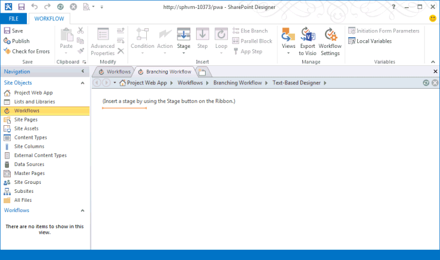

# 创建 Project Server 工作流以用于需求管理Create a Project Server workflow for demand management

本文介绍如何使用 SharePoint Designer 2013 创建简单的工作流。This article describes how to create a simple workflow by using SharePoint Designer 2013. 您可以将工作流导出到 Visio 2013 以进行可视化和编辑, 或使用 Visio 2013 设计 project Server 2013 工作流, 并将设计导入到 SharePoint Designer 2013 中, 以便发布到 Project Web App。You can export the workflow to Visio 2013 for visualization and editing, or use Visio 2013 to design Project Server 2013 workflows and import the design into SharePoint Designer 2013 for publication to Project Web App. 有关 sharepoint 工作流平台和使用 Visio 2013 和 SharePoint Designer 2013 创建工作流的详细信息, 请参阅 sharepoint 2013 开发人员文档中的[sharepoint 2013 文章中的工作流](https://msdn.microsoft.com/library/jj163986%28office.15%29.aspx)。For more information about the SharePoint workflow platform and creating workflows with Visio 2013 and SharePoint Designer 2013, see the [Workflows in SharePoint 2013](https://msdn.microsoft.com/library/jj163986%28office.15%29.aspx) articles in the SharePoint 2013 developer documentation. 
  
有关为工作流准备 Project Server 的信息, 请参阅[Start: Set up and configure SharePoint 2013 Workflow Manager](https://msdn.microsoft.com/library/jj163276%28office.15%29.aspx)。For information about preparing Project Server for workflows, see [Start: Set up and configure SharePoint 2013 Workflow Manager](https://msdn.microsoft.com/library/jj163276%28office.15%29.aspx).

## 创建常规工作流Creating a general workflow

使用以下步骤可通过使用 SharePoint Designer 2013 创建 Project Server 2013 工作流。Use the following steps to create a Project Server 2013 workflow by using SharePoint Designer 2013. 工作流旨在管理项目建议的需求。The workflow is designed for demand management of project proposals.
  
有关详细步骤, 请参阅[创建分支工作流](#pj15_CreateWorkflowSPD_Detailed)部分。For detailed steps, see the [Creating a branching workflow](#pj15_CreateWorkflowSPD_Detailed) section. 
  
### 创建 Project Server 工作流 (常规过程)To create a Project Server workflow (general procedure)

1. 确定要求, 然后设计工作流。Determine the requirements, and then design the workflow. 将其组织到阶段和阶段, 并确定工作流将使用的自定义域。Organize it into phases and stages, and determine the custom fields that the workflow will use.
    
2. 在 Project Web App 中, 创建工作流所需的实体:In Project Web App, create the entities that the workflow requires:
    
    1. 查看现有工作流阶段;根据需要创建阶段。Review the existing workflow phases; create phases as necessary.
        
    2. 创建工作流将使用的企业自定义域。Create the enterprise custom fields that the workflow will use. 若要在工作流容器中可用, 自定义字段必须由工作流控制。To be available in a workflow stage, a custom field must be controlled by a workflow.
        
    3. 编辑或创建工作流阶段将用于收集项目信息的项目详细信息页面 (pdp)。Edit or create the project detail pages (PDPs) that your workflow stages will use to collect information for the project. 在此示例中, 阶段使用的是编辑的默认 pdp 以包含新的自定义域。In this example, the stages use default PDPs that are edited to include a new custom field.
        
    4. 创建必要的工作流容器, 然后将每个工作流容器与正确的阶段相关联。Create the necessary workflow stages, and then associate each workflow stage with the correct phase.
    
3. 在 SharePoint Designer 2013 中, 在**基于文本的设计器**中使用声明性语句构造工作流:In SharePoint Designer 2013, construct the workflow by using declarative statements in the **Text-Based Designer**:
    
    > [!NOTE]
    > 您还可以切换到 SharePoint designer 2013 中的**可视化设计器**, 或从 Visio 2013 导入现有工作流。You can also switch to the **Visual Designer** in SharePoint Designer 2013, or import an existing workflow from Visio 2013. 按照以下步骤使用**基于文本的设计器**:Follow these steps to use the **Text-Based Designer**: 
    > 
    > 1. 打开 Project Web App 网站, 然后创建使用**SharePoint 2013 工作流-Project Server**工作流平台的网站工作流。Open the Project Web App site, and then create a site workflow that uses the **SharePoint 2013 Workflow - Project Server** workflow platform. 
    > 2. 添加工作流使用的阶段。Add the stages that the workflow uses.
    > 3. 插入每个阶段中所需的工作流步骤、条件、操作和循环。Insert the workflow steps, conditions, actions, and loops that are required in each stage.
    > 4. 检查是否存在任何工作流错误, 并修复所发现的任何错误。Check for any workflow errors and fix any that you find.
    > 5. Optional将视图切换到**可视设计器**, 或将工作流导出到 Visio 2013 文件中。(Optional) Switch the view to the **Visual Designer**, or export the workflow to a Visio 2013 file. 您可以修改 Visio 视图并保存对当前工作流所做的更改。You can modify the Visio view and save changes to the current workflow. 您可以编辑 Visio 文件并将其导入到 SharePoint Designer 2013 以创建其他工作流。You can edit the Visio file and import it in SharePoint Designer 2013 to create other workflows.
    > 6. 发布工作流。Publish the workflow. 发布后, 工作流会显示在 Project Web App 网站的工作流列表中。After it is published, the workflow shows in the list of workflows for the Project Web App site.
    
4. 在 project Web App 中, 使用工作流对项目建议的需求管理:In Project Web App, use the workflow for demand management of project proposals:
    
    1. 创建使用工作流的企业项目模板 (EPT)。Create an enterprise project template (EPT) that uses the workflow.
        
    2. 在 "项目中心" 页上, 创建一个使用工作流的 EPT 的项目, 然后执行工作流容器。On the Project Center page, create a project that uses the EPT for the workflow, and then follow through the workflow stages.
        
    3. 全面测试工作流。Test the workflow thoroughly.
        
    4. 将工作流部署到生产服务器。Deploy the workflow to a production server.

## 创建分支工作流Creating a branching workflow

必须先将工作流管理器客户端1.0 服务配置为使用 project server 2013 工作流活动, 然后才能使用 SharePoint Designer 2013 创建 project server 工作流。Before you can use SharePoint Designer 2013 to create a Project Server workflow, the Workflow Manager Client 1.0 service must be configured to use the Project Server 2013 workflow activities. 有关如何配置工作流管理器客户端1.0 的信息, 请参阅 sharepoint Server 2013 开发人员文档中的[sharepoint 2013 文章中的工作流](https://msdn.microsoft.com/library/jj163986%28office.15%29.aspx)。For information about how to configure Workflow Manager Client 1.0, see the [Workflows in SharePoint 2013](https://msdn.microsoft.com/library/jj163986%28office.15%29.aspx) articles in the SharePoint Server 2013 developer documentation. 
  
下面的详细过程包括在 "[创建常规工作流](#pj15_CreateWorkflowSPD_General)" 部分中执行的相同步骤。The following detailed procedure includes the same steps as in the [Creating a general workflow](#pj15_CreateWorkflowSPD_General) section. 
  
### 创建 Project Server 分支工作流 (详细过程)To create a Project Server branching workflow (detailed procedure)

#### 1. 规划和设计工作流。1. Plan and design the workflow.

Project Server 工作流可与需求管理流程中的多个阶段和阶段集成。A Project Server workflow can integrate with multiple stages and phases in a demand-management process. 由于工作流可能很复杂, 因此您必须了解业务要求并仔细规划工作流。Because workflows can be complex, you must understand the business requirements and plan a workflow carefully. 对于一个简单的示例, 请设计一个使用项目建议的估计成本的分支工作流, 以确定是否接受建议。For a simple example, design a branching workflow that uses the estimated cost of a project proposal to determine whether the proposal is accepted. 如果估计成本大于 $25000 USD, 则拒绝建议;否则, 接受建议并创建项目。If the estimated cost is greater than $25,000 USD, reject the proposal; otherwise, accept the proposal and create the project.
    
由于您可以使用 Visio 2013 和 SharePoint Designer 2013 帮助设计和创建 project server 2013 的工作流, 因此您可以更轻松地使用 project server 2010 对工作流进行实验。Because you can use Visio 2013 and SharePoint Designer 2013 to help design and create workflows for Project Server 2013, you can more easily experiment with workflows than is possible with Project Server 2010. 本文中的示例工作流设计与在 Project 2010 SDK 中[创建分支工作流一](https://msdn.microsoft.com/library/a02cafdc-d881-4271-b446-d8b2cd456a52%28Office.15%29.aspx)文中的示例相同。The sample workflow design in this article is the same as in the [Create a branching workflow](https://msdn.microsoft.com/library/a02cafdc-d881-4271-b446-d8b2cd456a52%28Office.15%29.aspx) article in the Project 2010 SDK. 您可以使用 project Web App 的测试实例在远程计算机上设计和创建测试工作流, 而无需直接在 project Server 2013 计算机上创建工作流。You can design and create a test workflow on a remote computer using a test instance of Project Web App—you do not have to create workflows directly on a Project Server 2013 computer. 
    
#### 2. 创建工作流所需的实体。2. Create the entities that your workflow requires.

在 Project Web App 中, 查看可用的工作流阶段和阶段, 以及可用的企业自定义域。In Project Web App, review the available workflow phases and stages, and the enterprise custom fields that are available. 如有必要, 请创建工作流所需的实体, 如以下步骤所示:If necessary, create the entities that your workflow requires, as in the following steps:
    
1. **工作流阶段**Project Web App 的默认安装包括 "创建"、"选择"、"规划"、"管理" 和 "已完成" 阶段。**Workflow phases** The default installation of Project Web App includes the Create, Select, Plan, Manage, and Finished phases. 对于分支工作流示例, 无需创建其他阶段。For the branching workflow example, you do not have to create other phases. 
        
2. **企业自定义域**分支工作流需要一个受工作流控制的项目成本自定义字段。**Enterprise custom fields** The branching workflow requires a project cost custom field that is workflow-controlled. 工作流控制的自定义域的值在工作流使用的 PDP 中设置。The value of a workflow-controlled custom field is set in a PDP that the workflow uses. 例如, 选择 "Project Web App" 页面右上角的 "**设置**" 图标, 选择 " **PWA 设置**", 然后选择 "**企业自定义域" 和 "查阅表格**"。For example, choose the **Settings** icon at the top-right of a Project Web App page, choose **PWA Settings**, and then choose **Enterprise Custom Fields and Lookup Tables**.
        
   为**项目**实体创建名为 "建议成本" 的自定义字段, 并选择 "**成本**" 类型。Create a custom field named Proposal Cost for the **Project** entity, and select the type **Cost**. 有关说明, 请键入项目建议的估计成本。For the description, type Estimated cost of a project proposal. 在 "**行为**" 部分, 选择 "**由工作流控制的行为**"。In the **Behavior** section, choose **Behavior controlled by workflow**.
        
3. **项目详细信息页面**编辑或创建工作流阶段将使用的 pdp。**Project detail pages** Edit or create the PDPs that the workflow stages will use. 例如，执行下列步骤：For example, do the following steps: 
        
    1. 选择 "服务器设置" 页上的 "**项目详细信息页面**", 然后选择**ProjectInformation** PDP。Choose **Project Detail Pages** on the Server Settings page, and then choose the **ProjectInformation** PDP. 
            
    2. 在功能区的 "**页面**" 选项卡上的 "**编辑**" 组中, 选择 "**编辑页面**"。On the **PAGE** tab of the ribbon, in the **Edit** group, choose **Edit Page**.
            
    3. 选择 "**基本信息**" web 部件右上角的向下箭头, 然后选择 "**编辑 web 部件**"。Choose the down arrow at the top-right of the **Basic Info** web part, and then choose **Edit web part**. 或者, 在功能区的 " **WEB 部件**" 选项卡上的 "**属性**" 组中, 选择 " **WEB 部件属性**" 以显示编辑器部件。Or, on the **WEB PART** tab of the ribbon, in the **Properties** group, choose **web part Properties** to show the editor part. 
            
    4. 在编辑器部件的 "**显示的项目域**" 部分 (请参阅图 1) 中, 选择 "**修改**"。In the **Displayed Project Fields** section of the editor part (see Figure 1), choose **Modify**.
            
    5. 添加 "**建议成本**" 自定义域, 将其移到 "选定的**项目域**" 列表中 "**所有者**" 字段的上方, 然后选择 **"确定"** (请参阅图 1)。Add the **Proposal Cost** custom field, move it above the **Owner** field in the **Selected Project Fields** list, and then choose **OK** (see Figure 1).
      
    6. 在编辑器部件中, 选择 **"确定**", 然后在功能区的 "**页面**" 选项卡上的 "**编辑**" 组中选择 "**停止编辑**"。In the editor part, choose **OK**, and then choose **Stop Editing** in the **Edit** group, on the **PAGE** tab of the ribbon. 图2显示添加到项目信息 PDP 的 "**建议成本**" 自定义域。Figure 2 shows the **Proposal Cost** custom field that is added to the Project Information PDP. 

    **图1。在 PDP 中编辑 "项目域" web 部件****Figure 1. Editing the Project Fields web part in a PDP**

    

    **图2。编辑的 PDP 包括 "建议成本" 自定义域****Figure 2. The edited PDP includes the Proposal Cost custom field**

    
  
4. **工作流容器**创建工作流的每个阶段所需的阶段。**Workflow stages** Create the stages that are required for each phase of the workflow. 在 "服务器设置" 页上, 选择 "**工作流容器**", 然后选择 "**新建工作流容器**"。On the Server Settings page, choose **Workflow Stages**, and then choose **NEW WORKFLOW STAGE**. 图3显示了 "添加工作流容器" 页面的一部分。Figure 3 shows part of the Add Workflow Stage page.
    
    **图3。在 Project Web App 中添加工作流容器****Figure 3. Adding a workflow stage in Project Web App**

    
  
    分支工作流示例使用表1中所示的四个阶段。The branching workflow example uses the four stages that are shown in Table 1. 在 "添加工作流容器" 页面的 "**可见项目详细信息页面**" 部分的 "其他设置" (图3中未显示) 中, 值是可选的;它们提供了有关工作流状态页的详细信息。In the **Additional Settings for the Visible Project Detail Page** section of the Add Workflow Stage page (not shown in Figure 3), values are optional; they provide more information on the Workflow Status page. 例如, 由于初始建议详细信息 PDP 需要用户输入, 因此您可以选中 "**项目详细信息页需要引起注意**" 复选框, 然后添加特定说明 (如设置此 PDP 的项目名称和成本)。For example, because the Initial Proposal Details PDP requires user input, you can select the **The Project Detail Page requires attention** check box, and then add a specific description such as Set the project name and cost for this PDP.
    
    图4显示了 "工作流阶段" 页上完成的四个阶段。Figure 4 shows the four stages completed on the Workflow Stages page.
    
    **表1。分支工作流的阶段****Table 1. Stages for the branching workflow**

    |名称Name|说明Description|提交说明Description for Submit|阶段Phase|可见的 pdpVisible PDPs|自定义字段Custom Fields|
    |:-----|:-----|:-----|:-----|:-----|:-----|
    |建议的初始详细信息Initial Proposal Details    |设置项目名称和成本。Set the project name and cost.    |将项目作为建议提交。Submit the project as a proposal.    |创建Create    |项目信息Project Information    项目详细信息Project Details    |建议成本 (必需)Proposal Cost (required)    |
    |项目详细信息Project Details    |提供建议项目的详细信息。Provide details of the proposed project.    |提交详细信息以继续执行项目。Submit details to continue with the project.    |创建Create    |项目信息Project Information    项目详细信息Project Details    |建议成本 (只读)Proposal Cost (read-only)    |
    |自动拒绝Automated Rejection    |根据提供的信息, 建议将被拒绝。The proposal is rejected, based on the information that is provided.    |   |创建Create    |项目信息Project Information    |建议成本 (只读)Proposal Cost (read-only)    |
    |操作Execution    |接受建议, 并准备好进行项目管理。The proposal is accepted, and ready for project management.    |   |管理Manage    |项目信息Project Information    项目详细信息Project Details    |建议成本 (只读)Proposal Cost (read-only)    |
   
    **图4。Project Web App 中的工作流容器的列表****Figure 4. List of the workflow stages in Project Web App**

    
  
#### 3. 在基于文本的设计器中构造工作流。3. Construct the workflow in the Text-Based Designer.

在 SharePoint Designer 2013 中, 在基于文本的设计器中使用声明性语句构造工作流。In SharePoint Designer 2013, construct the workflow by using declarative statements in the Text-Based Designer. 您可以在橙色插入行开始键入, 以获取工作流逻辑和步骤的上下文相关自动完成语句, 也可以使用功能区的 "**工作流**" 选项卡上的 "**插入**" 组中的控件插入逻辑和步骤。You can start typing at the orange insertion line to get context-sensitive auto-completion statements for the workflow logic and steps, or you can insert the logic and steps by using controls in the **Insert** group on the **WORKFLOW** tab of the ribbon. 
    
1. 在 SharePoint Designer 2013 的 Backstage 视图中, 选择 "**打开网站**"。In the Backstage view of SharePoint Designer 2013, choose **Open Site**. 例如, 打开`https://ServerName/pwa`。For example, open  `https://ServerName/pwa`. 在**导航**窗格中, 选择 "**工作流**"。In the **Navigation** pane, choose **Workflows**. 然后, 在功能区的 "**工作流**" 选项卡上的 "**新建**" 组中, 选择 "**网站工作流**"。Then, on the **WORKFLOWS** tab of the ribbon, in the **New** group, choose **Site Workflow**. 对于此示例, 请将工作流命名为 "分支工作流"。For this example, name the workflow Branching Workflow. 确保在 "**平台类型**" 下拉列表中选择了 " **SharePoint 2013 工作流-Project Server** " (参见图 5)。Ensure that **SharePoint 2013 Workflow - Project Server** is selected in the **Platform Type** drop-down list (see Figure 5). 
    
    **图5。创建 Project Server 网站工作流****Figure 5. Creating a Project Server site workflow**

    
  
2. 选择 "**分支工作流**" 选项卡。然后, 在功能区的 "**工作流**" 选项卡上的 "**管理**" 组中的 "**视图**" 下拉列表中, 选择 "**基于文本的设计器**"。Select the **Branching Workflow** tab. Then, on the **WORKFLOW** tab of the ribbon, in the **Manage** group, in the **Views** drop-down list, choose **Text-Based Designer**. 若要显示带黄色闪烁的插入线的视图 (请参阅图 6), 请在视图中单击。To show the view with the blinking orange insertion line (see Figure 6), click within the view.
    
    **图6。对工作流使用基于文本的设计器视图****Figure 6. Using the Text-Based Designer view for the workflow**

    
  
3. 在**基于文本的设计器**视图中, 添加工作流使用的阶段。In the **Text-Based Designer** view, add the stages that the workflow uses. 在功能区的 "**工作流**" 选项卡上的 "**插入**" 组中, 在 "**创建**" 下的 "**暂存**" 下拉列表中, 选择 "**初始建议详细信息**"。On the **WORKFLOW** tab of the ribbon, in the **Insert** group, in the **Stage** drop-down list under **Create**, choose **Initial Proposal Details**.
    
    同样, 将橙色插入线放在**舞台下面: 初始建议详细信息**框, 并添加工作流使用的其他阶段:**项目详细信息**、**自动拒绝**和**执行**(见图 7)。Similarly, place the orange insertion line below the **Stage: Initial Proposal Details** box, and add the other stages that the workflow uses: **Project Details**, **Automated Rejection**, and **Execution** (see Figure 7). 
    
    **图7。将阶段添加到 SharePoint Designer 中的工作流****Figure 7. Adding a stage to a workflow in SharePoint Designer**

    
  
4. 在每个阶段中添加工作流步骤和逻辑:Add the workflow steps and logic within each stage: 
    
    1. 在 "**初始建议详细信息**" 阶段, 将橙色插入行放置在舞台正文的顶部。In the **Initial Proposal Details** stage, place the orange insertion line at the top of the stage body. 在功能区上的 "**插入**" 组中, 选择 "**操作**", 向下滚动到 " **project Web App 操作**", 然后选择 "**等待项目事件**"。In the **Insert** group on the ribbon, choose **Action**, scroll down to **Project Web App Actions**, and then choose **Wait for Project Event**. 选择 "**此项目事件**", 然后选择 "事件: 在下拉列表中**提交项目时**"。Choose **this project event**, and then select **Event: When a project is submitted** in the drop-down list. 
    
    2. 在 "**初始建议详细信息**" 阶段的 "**转换到分段**" 部分, 插入 "**如果任何值等于值**"。In the **Transition to stage** section of the **Initial Proposal Details** stage, insert **If any value equals value**. 您可以开始键入语句或使用功能区上的 "**插入**" 组中的 "**条件**" 控件。You can start typing the statement or use the **Condition** control in the **Insert** group on the ribbon. 
    
    3. 选择第一个**值**控件, 然后选择 " **fx** " 以显示 "**定义工作流查找**" 对话框 (见图 8)。Choose the first **value** control, and then choose **fx** to show the **Define Workflow Lookup** dialog box (see Figure 8). 在 "**数据源**" 下拉列表中, 选择 "**项目数据**"。In the **Data source** drop-down list, select **Project Data**. 在 "**源中的字段**" 下拉列表中, 选择 "**建议成本**"。In the **Field from source** drop-down list, select **Proposal Cost**.
    
       **图8。在工作流中定义查阅值****Figure 8. Defining a lookup value in the workflow**

       
  
    4. 完成`If`语句, 使其显示以下内容:**如果项目数据: 建议成本大于 25000**Complete the  `If` statement so that it shows the following: **If Project Data:Proposal Cost is greater than 25000**
    
       > [!NOTE]
       > 或者, 也可以创建工作流变量, 将变量设置为自定义字段值, 然后将变量与值进行比较。Alternately, you could create a workflow variable, set the variable to the custom field value, and then compare the variable with a value. 例如, 从功能区上的 "**局部变量**" 下拉列表中, 创建一个名为 " **TotalCost** " (无空格) 的变量, 其类型为**Number**。For example, from the **Local Variables** drop-down list on the ribbon, create a variable named **TotalCost** (no spaces) of type **Number**. 在 "**定义工作流查找**" 对话框中, 选择数据源的 "**工作流变量和参数**", 然后选择 "**变量: TotalCost** " 作为字段。In the **Define Workflow Lookup** dialog box, select **Workflow Variables and Parameters** for the data source, and then select **Variable: TotalCost** as the field. **if**语句随后将为:**如果变量: TotalCost 大于 25000**The **If** statement would then be: **If Variable: TotalCost is greater than 25000**
  
    5. 将橙色插入线放置在`If`分支中, 然后使用**操作**控件在功能区上的 "**插入**" 组中插入 "**转到阶段**"。Place the orange insertion line within the  `If` branch, and then insert **Go to a stage** by using the **Action** control, in the **Insert** group on the ribbon. 选择 "**阶段**" 下拉控件并选择 "**自动拒绝**" 阶段。Choose the **a stage** drop-down control and select the **Automated Rejection** stage. 
    
       同样, 在`Else`分支中, 插入 "**转到项目详细信息**" 语句。Similarly, in the  `Else` branch, insert the **Go to Project Details** statement. 图9显示了已完成的**初始建议详细信息**阶段。Figure 9 shows the completed **Initial Proposal Details** stage. 
    
       **图9。"初始建议详细信息" 阶段的 "已完成" 逻辑****Figure 9. Completed logic for the Initial Proposal Details stage**

       
  
    6. 在**自动拒绝**阶段, 除非您希望暂停工作流并在 PDP 中显示一些数据, 否则请将第一部分留空。In the **Automated Rejection** stage, unless you want to pause the workflow and show some data in a PDP, leave the first section empty. "**转到阶段**" 部分必须包含一个转换;由于拒绝之后没有其他任何阶段, 请键入语句的工作流结束。The **Transition to stage** section must contain a transition; because there is no other stage following a rejection, type Go to End of Workflow for the statement. 
    
    7. 在 "**项目详细信息**" 阶段, 在 "转**至舞台**" 部分中添加 "转到执行"。In the **Project Details** stage, add Go to Execution in the **Transition to stage** section. 除非有要添加的其他数据, 或者您希望暂停工作流, 否则不需要等待提交的事件。Unless there is additional data to add, or you want to pause the workflow, it is not necessary to wait for a submitted event. 
    
    8. 在**执行**阶段中, 除非您希望暂停工作流, 否则请将 "暂存操作" 部分保留为空。In the **Execution** stage, unless you want to pause the workflow, leave the stage action section empty. 在 "**转换到分段**" 部分, 添加 "**转至工作流结束**"。In the **Transition to stage** section, add **Go to End of Workflow**.
    
5. 在功能区上的 "**保存**" 组中, 选择 "**检查错误**" 以检查工作流错误 (请参阅图 10)。In the **Save** group on the ribbon, choose **Check for Errors** to check for workflow errors (see Figure 10). 修复所有错误, 然后选择 "**保存**"。Fix any errors, and then choose **Save**.
    
    **图10。在 SharePoint Designer 中检查工作流错误****Figure 10. Checking the workflow for errors in SharePoint Designer**

    
  
6. Optional在功能区上的 "**管理**" 组中的 "**视图**" 下拉菜单中, 选择 "**可视设计器**"。(Optional) In the **Manage** group on the ribbon, in the **Views** drop-down menu, choose **Visual Designer**. 在图11中, 视图缩小到 50%。In Figure 11, the view is zoomed out to 50%.
    
    您可以使用可视化设计器编辑工作流中的项目。You can edit items in the workflow by using the Visual Designer. 例如, 选择 "**如果任何值等于值**" 条件, 选择条件左下角的工具图标, 然后在 "**属性**" 对话框中选择 "**值**" 以显示比较条件。For example, select the **If any value equals value** condition, choose the tool icon at the bottom-left of the condition, and then select **Value** to show the comparison conditions in the **Properties** dialog box. 
    
    **图11。对工作流使用可视化设计器****Figure 11. Using the Visual Designer for a workflow**

    
  
    当工作流位于可视设计器视图中时, 若要将 Visio 2013 (.vsdx) 文件中的工作流另存为备份或以后使用, 则可以选择 "**导出到 Visio**"。When the workflow is in the Visual Designer view, to save the workflow in a Visio 2013 (.vsdx) file as a backup or for later use, you can choose **Export to Visio**.
    
7. 发布工作流。Publish the workflow. 使用 SharePoint Designer 2013 将工作流发布到活动的 Project Web App 网站时, 工作流将注册到 SharePoint 网站或 Azure 中, 并在 Project Web app 中适用于新的 ept。When you use SharePoint Designer 2013 to publish the workflow to the active Project Web App site, the workflow is registered to the SharePoint site or in Azure and becomes available within Project Web App for new EPTs.

#### 4. 为工作流创建 EPT, 然后测试工作流。4. Create an EPT for the workflow, and then test the workflow.

在 project Web App 中, 为工作流创建 EPT, 然后通过创建项目建议来测试工作流:In Project Web App, create an EPT for the workflow, and then test the workflow by creating a project proposal:
    
1. 在 "PWA 设置" 页上, 选择 "**企业项目类型**", 然后创建一个名为 "测试分支工作流" 的 EPT。On the PWA Settings page, choose **Enterprise Project Types**, and then create an EPT named Test Branching Workflow. 清除 "将**新项目创建为 SharePoint 任务列表项目**" 复选框, 以便 Project Server 将维护由 EPT 创建的项目的 "完全控制"。Clear the **Create new projects as SharePoint Tasks List Projects** check box so that Project Server will maintain full control of projects that are created by the EPT. 在 "**网站工作流关联**" 下拉列表中选择 "**分支工作流**", 然后在 "**新建项目页**" 下拉列表中选择 "**项目信息**" PDP, 作为工作流显示的第一个页面。Select **Branching Workflow** in the **Site Workflow Association** drop-down list, and then select the **Project Information** PDP in the **New Project Page** drop-down list to be the first page that the workflow shows. 
    
    **图12。为工作流添加 EPT****Figure 12. Adding an EPT for the workflow**

    
  
    > [!NOTE]
    > 企业项目类型表中的**sharepoint 任务列表项目**列中的**Yes**值是指一个 EPT, 它创建一个 SharePoint 任务列表, 其中任务列表在 project Web App 中可见, 但 SharePoint 保持对项目的控制.A **Yes** value in the **SharePoint Tasks List Project** column in the table of enterprise project types refers to an EPT that creates a SharePoint tasks list, where the tasks list is visible in Project Web App but SharePoint maintains control of the project. 有关将项目作为 SharePoint 任务列表进行管理的详细信息, 请参阅[Project Server 2013 体系结构](project-server-2013-architecture.md)。For more information about managing projects as SharePoint tasks lists, see [Project Server 2013 architecture](project-server-2013-architecture.md). 
  
2. 打开 project Web App 中的 "项目" 页, 然后使用新的 EPT 创建一个项目 (见图 13)。Open the Projects page in Project Web App, and then create a project by using the new EPT (see Figure 13). 由于**测试分支工作流**与**分支工作流**相关联, 因此项目创建将在工作流的控制下启动。Because **Test Branching Workflow** is associated with **Branching Workflow**, project creation starts under control of the workflow.
    
    **图13。使用测试分支工作流创建项目 EPT****Figure 13. Creating a project with the Test Branching Workflow EPT**

    
  
3. 当工作流显示**项目信息**PDP 时, 将数据添加到项目字段中。When the workflow displays the **Project Information** PDP, add data to the project fields. 例如, 输入**建议成本**值为30000。For example, enter a **Proposal Cost** value of 30000. Project Server 的美国英语版本将字段更改为显示 "$30000" (见图 14)。The U.S. English version of Project Server changes the field to show $30,000 (see Figure 14).
    
    **图14。使用已编辑的项目信息 PDP****Figure 14. Using the edited Project Information PDP**

    
  
4. 在功能区的 "**项目**" 选项卡上的 "**项目**" 组中, 选择 "**保存**"。On the **PROJECT** tab of the ribbon, in the **Project** group, choose **Save**. project Server 将 PDP 中的数据添加到项目中, 然后显示 "工作流状态" 页 (参见图 15)。Project Server adds the data in the PDP to the project, and then shows the Workflow Status page (see Figure 15). 若要查看工作流状态图表中的 "建议的初始详细信息" 阶段的完整说明, 请将指针悬停在工作流可视化关系图中的舞台上。To see the full description of the Initial Proposal Details stage in the workflow status diagram, hover the pointer over the stage in the workflow visualization diagram.
    
    "**所有工作流阶段**" 网格使用绿色箭头显示 "初始建议详细信息" 阶段正在等待输入。The **All Workflow Stages** grid uses a green arrow to show that the Initial Proposal Details stage is waiting for input. 这是因为工作流在初始建议详细信息阶段等待提交事件。This is because the workflow waits for a submit event in the Initial Proposal Details stage. 如果工作流没有等待提交事件, 则可以在**页面**组中选择 "**下一步**" 以前进到下一个 PDP。If the workflow did not wait for a submit event, you could choose **Next** in the **Page** group to advance to the next PDP. 
    
    **图15。在初始 "建议详细信息" 阶段使用 "工作流状态" 页****Figure 15. Using the Workflow Status page in the Initial Proposal Details stage**

    
  
    工作流可视化关系图以绿色的颜色显示当前阶段。The workflow visualization diagram shows the current stage in a green color. 在 "**创建**" 阶段, "初始建议详细信息" 阶段是当前阶段。In the **Create** phase, the Initial Proposal Details stage is the current stage. 
    
5. 在功能区上的 "**工作流**" 组中, 选择 "**提交**"。On the ribbon, in the **Workflow** group, choose **Submit**.
    
    > [!TIP]
    > 如果 "**提交**" 控件已禁用, 请刷新页面。If the **Submit** control is disabled, refresh the page. 
  
    如果**建议成本**值大于 $25000 USD, 则工作流将移动到自动拒绝阶段。If the **Proposal Cost** value is greater than $25,000 USD, the workflow moves to the Automated Rejection stage. 图16显示了再次选择 "**提交**" 时的自动拒绝阶段状态。Figure 16 shows the Automated Rejection stage status when you choose **Submit** again. 如果**建议成本**为 $25000 USD 或更低, 则工作流将移至 "项目详细信息" 阶段 (见图 17)。If the **Proposal Cost** is $25,000 USD or less, the workflow moves to the Project Details stage (see Figure 17). 
    
    **图16。在自动拒绝阶段完成工作流****Figure 16. The workflow is completed in the Automated Rejection stage**

    
  
    图17显示了一个名为 "**测试 2-分支**" 的项目建议的另一个测试, 其中 "项目详细信息" 阶段是 "创建" 阶段中的当前阶段。Figure 17 shows another test with a project proposal named **Test 2 - Branching**, where the Project Details stage is current in the Create phase. "管理" 阶段以浅蓝色显示, 表示该阶段尚未处于活动状态。The Manage phase shows in a light blue color, which indicates that phase is not yet active.
    
    **图17。如果成本低于 $25000, 工作流将继续到 "项目详细信息" 阶段****Figure 17. The workflow continues to the Project Details stage if the cost is less than $25,000**

    
  
6. 如果转到 "项目详细信息" 阶段, 则默认页面中没有要添加的其他数据。If you advance to the Project Details stage, there is no additional data to add in the default page. 再次选择 "**提交**" 以转到执行阶段 (参见图 18)。Choose **Submit** again to advance to the Execution stage (see Figure 18). 
    
    **图18。工作流准备就绪, 可以在执行阶段中进行管理****Figure 18. The workflow is ready to manage in the Execution stage**

    
  
在 "项目详细信息" 阶段, 工作流不会等待提交事件。In the Project Details stage, the workflow does not wait for a submit event. 如果项目详细信息 PDP 包含其他必填字段, 则 project Server 将一直等待, 直到您将数据添加到字段中, 然后再继续执行阶段。If the Project Details PDP includes additional required fields, Project Server waits until you add data to the fields before continuing to the Execution stage. 如分支工作流中所定义, 执行阶段也不会等待提交事件。As defined in the Branching Workflow, the Execution stage also does not wait for a submit event. 在执行阶段中, 可以将项目编辑为项目经理或在功能区的 "**项目**" 选项卡中选择 "**关闭**"。In the Execution stage, you can edit the project as a project manager or choose **Close** in the **PROJECT** tab of the ribbon. 选择 "**关闭**" 时, 可以签入该项目并在稍后对其进行编辑或使项目保持签出状态。When you choose **Close**, you can check in the project and edit it later or leave the project checked out.

**分支工作流**项目是仅有一个比较测试的简单示例。The **Branching Workflow** project is a simple example that has only one comparison test. 工作流涉及创建阶段中的三个阶段和 "管理阶段的需求管理" 阶段中的一个阶段。The workflow involves three stages in the Create phase and one stage in the Manage phase of Demand Management. 若要全面测试工作流, 应测试工作流的所有分支并使用极端和典型值来查看行为是否与预期相同。To thoroughly test a workflow, you should test all branches of the workflow and use extreme and typical values to see whether the behavior is as expected. 

## 从 Visio 导入工作流Importing a workflow from Visio

若要更改工作流, 您可以创建或修改工作流控制的自定义字段, 并创建或修改工作流阶段和阶段。To change the workflow, you can create or modify workflow-controlled custom fields and create or modify workflow phases and stages. 您可以使用 SharePoint Designer 2013 添加条件、操作、循环和阶段, 然后保存并重新发布工作流。You can use SharePoint Designer 2013 to add conditions, actions, loops, and stages, and then save and republish the workflow. 若要重用或保留工作流的备份, 可以将其导出到 Visio 2013 文件中。To reuse or keep a backup of a workflow, you can export it to a Visio 2013 file. 
  
您还可以在 Visio 2013 中创建或编辑工作流, 并将该文件导入到 SharePoint Designer 2013 中, 以供 Project Web App 使用。You can also create or edit the workflow in Visio 2013 and import the file into SharePoint Designer 2013 for use by Project Web App. 若要使用未修改的工作流, Project web app 实例必须包含与原始 Project Web app 实例中的工作流阶段属性相同。To use an unmodified workflow, the Project Web App instance must include workflow stage properties that are the same as those in the original Project Web App instance. 有关使用 Visio 帮助创建工作流的详细信息, 请参阅[SharePoint Designer 2013 和 Visio 2013 中的工作流开发](https://msdn.microsoft.com/library/jj163272%28office.15%29.aspx)。For more information about using Visio to help create workflows, see [Workflow development in SharePoint Designer 2013 and Visio 2013](https://msdn.microsoft.com/library/jj163272%28office.15%29.aspx).
  
> [!NOTE]
> 将 Visio 2013 文件导入到 Project Web App 的其他实例时, 这些阶段将具有不同的阶段 guid, 即使阶段名称相同也是如此。When you import a Visio 2013 file to a different instance of Project Web App, the stages have different stage GUIDs, even if the stage names are the same. 导入工作流后, 必须将 stage 和操作属性配置为使用特定于 Project Web App 实例的值。After you import the workflow, you must configure the stage and action properties to use values that are specific to the Project Web App instance. 
> 
> 如果在 visio 2013 中创建工作流, 则这些阶段和操作不具有特定于 project web app 实例的属性, 因为 Visio 不会连接 project web app。If you create a workflow in Visio 2013, the stages and actions have no properties that are specific for a Project Web App instance because Visio does not connect with Project Web App. 当您将 SharePoint Designer 2013 与 Project Web App 连接, 创建工作流, 然后导入 .vsdx 文件时, 将覆盖活动工作流。When you connect SharePoint Designer 2013 with Project Web App, create a workflow, and then import the VSDX file, you overwrite the active workflow. 然后, 您必须配置 stage 和操作属性, 以匹配 SharePoint Designer 2013 从 Project Web App 获取的值。You must then configure the stage and action properties to match the values that SharePoint Designer 2013 gets from Project Web App. 
  
### 将工作流从 Visio 导入到 SharePoint DesignerTo import a workflow from Visio to SharePoint Designer

1. 在 Visio 2013 中, 创建一个简单的工作流。In Visio 2013, create a simple workflow. 例如，执行下列步骤：For example, do the following steps:
    
   1. 打开 Visio, 然后创建一个工作流。Open Visio, and then create a workflow. 选择新工作流的 "**类别**" 窗格, 选择 "**流程图**", 在 "**新建**" 窗格中选择 " **Microsoft SharePoint 2013 工作流**" 模板, 然后选择 "**创建**"。Choose the **CATEGORIES** pane for a new workflow, choose **Flowchart**, choose the **Microsoft SharePoint 2013 Workflow** template in the **New** pane, and then choose **Create**. 将打开工作流, 其中包含一个名为**stage 1**的阶段形状。The workflow opens with a Stage shape named **Stage 1**. 工作流包含一个开始组件, 并将一个 Enter 形状和退出形状作为舞台形状的一部分。The workflow includes a Start component, and an Enter shape and Exit shape as part of the Stage shape.
    
      当您将鼠标悬停在 "舞台" 形状上并选择 "**属性**" 图标时, 所选内容将被禁用。When you hover over the Stage shape and choose the **Properties** icon, the selection is disabled. 您可以在将工作流图表导入到 SharePoint Designer 2013 之后设置 stage 和 action 属性。You can set the stage and action properties after you import the workflow diagram to SharePoint Designer 2013. 
    
      > [!NOTE]
      >  在流程图形状列表中, 唯一应使用的形状模具如下所示:The only shape stencils you should use are the following in the list of Flowchart shapes: 
      > - **操作-SharePoint 2013 工作流****Actions - SharePoint 2013 Workflow**
      > - **组件-SharePoint 2013 工作流****Components - SharePoint 2013 Workflow**
      > - **条件-SharePoint 2013 工作流****Conditions - SharePoint 2013 Workflow**
  
   2. 在 "**形状**" 窗格中, 选择 "**快速形状**", 然后拖动名为 "**如果任何值等于**舞台形状右侧的值" 的 "条件" 形状。In the **Shapes** pane, choose **Quick Shapes**, and then drag the Condition shape named **If any value equals value** to the right of the Stage shape. 
    
   3. 在功能区的 "**主页**" 选项卡上, 选择 "**连接线**" 工具, 然后使用 "条件" 形状连接舞台上的 "退出" 形状 (请参阅图 19)。On the **HOME** tab of the ribbon, choose the **Connector** tool, and then connect the Exit shape on the stage with the Condition shape (see Figure 19). 
    
      **图19。将阶段形状与 Visio 工作流图表中的条件形状连接****Figure 19. Connecting a Stage shape with a Condition shape in a Visio workflow diagram**

      
  
   4. 将两个 "更多" 舞台形状拖到 "条件" 形状的右侧。Drag two more Stage shapes to the right of the condition shape. 这些形状被命名为第**2 阶段**和**第3阶段**。The shapes are named **Stage 2** and **Stage 3**.
    
   5. 使用 "**连接线**" 工具, 将 "条件" 形状的右侧连接到**第2阶段**的 "进入" 形状。Using the **Connector** tool, connect the right side of the Condition shape to the Enter shape of **Stage 2**. 选择 "**指针**" 工具, 双击该连接以显示名称的 textbox, 然后将该连接命名为 "是"。Choose the **Pointer** tool, double-click the connection to show a textbox for the name, and then name the connection Yes.
    
   6. 将 "条件" 形状的底部连接到**第3阶段**的 "进入" 形状。Connect the bottom of the Condition shape to the Enter shape of **Stage 3**. 使用 "**指针**" 工具右键单击该连接, 然后选择 "**否**"。With the **Pointer** tool, right-click the connection, and then choose **No**. 这两种方法都适用于将连接器命名为 **"是" 或 "** **否**"。Either method works for naming the connectors **Yes** or **No**.
    
   7. 在 "**形状**" 窗格中, 选择 "**操作"-"SharePoint 2013 工作流**", 然后将 "**等待项目事件**" 操作拖到**第1阶段**的形状中间 (请参阅图 20)。In the **Shapes** pane, choose **Actions - SharePoint 2013 Workflow**, and then drag the **Wait for project event** action to the middle of the shape for **Stage 1** (see Figure 20). 
    
      **图20。在 Visio 中完成工作流****Figure 20. Completing the workflow in Visio**

      
  
   8. 在功能区的 "**进程**" 选项卡上, 在 "**图表验证**" 组中, 选择 "**检查图表**"。On the **PROCESS** tab of the ribbon, in the **Diagram Validation** group, choose **Check Diagram**. 修复所有错误, 然后保存绘图。Fix any errors, and then save the drawing. 例如, 将文件测试工作流命名为 "从 .vsdx"。For example, name the file Test workflow from Visio.vsdx.
    
      有关修复工作流错误的信息, 请参阅[Visio 2013 中的 SharePoint Server 2013 工作流验证错误疑难解答](https://msdn.microsoft.com/library/jj163971%28v=office.15%29.aspx)。For information about fixing workflow errors, see [Troubleshooting SharePoint Server 2013 workflow validation errors in Visio 2013](https://msdn.microsoft.com/library/jj163971%28v=office.15%29.aspx).
    
2. 打开 "SharePoint Designer 2013", 然后打开您用于 "**分支工作流**" 示例的同一个 Project Web App 网站。Open SharePoint Designer 2013, and then open the same Project Web App site that you used for the **Branching Workflow** example. 
    
3. 在**导航**窗格中选择 "**工作流**", 然后创建网站工作流 (在功能区的 "**工作流**" 选项卡上选择 "**网站工作流**")。Choose **Workflows** in the **Navigation** pane, and then create a site workflow (choose **Site Workflow** on the **WORKFLOWS** tab of the ribbon). 例如, 将工作流简单命名为 Visio 的简单工作流。For example, name the workflow Simple workflow from Visio.
    
   在 "**创建网站工作流**" 对话框中, 确保 "平台类型" 为 " **SharePoint 2013 工作流-Project Server**"。In the **Create Site Workflow** dialog box, ensure that the platform type is **SharePoint 2013 Workflow - Project Server**. 选择 "**创建**", SharePoint Designer 将为新工作流打开**基于文本的设计器**窗格。Choose **Create**, and SharePoint Designer opens the **Text-Based Designer** pane for the new workflow. 
    
4. 在功能区的 "**工作流**" 选项卡上的 "**管理**" 组中, 选择 "**工作流设置**"。In the **Manage** group on the **WORKFLOW** tab of the ribbon, choose **Workflow Settings**.
    
5. 在功能区的 "**工作流设置**" 选项卡上的 "**管理**" 组中, 选择 "**从 visio 导入**", 然后从先前保存的 ".vsdx" 文件中导入**测试工作流**。In the **Manage** group on the **WORKFLOW SETTINGS** tab of the ribbon, choose **Import from Visio**, and then import the **Test workflow from Visio.vsdx** file that you previously saved. **Microsoft SharePoint Designer**对话框警告您要导入的关系图中不包含工作流属性, 并询问是否覆盖当前工作流。A **Microsoft SharePoint Designer** dialog box warns that the diagram you are importing contains no workflow properties, and asks whether to overwrite the current workflow. 选择 **"是"**;SharePoint designer 导入工作流图表, 生成形状的模具, 并显示包含导入的工作流的**可视化设计器**窗格。Choose **Yes**; SharePoint Designer imports the workflow diagram, generates stencils for the shapes, and displays the **Visual Designer** pane that contains the imported workflow. 
    
6. 设置工作流中每个阶段形状的属性。Set the properties of each stage shape in the workflow. 例如, 第一个阶段形状被命名为**stage 1 (无效)**, 因为它不代表连接的 Project Web App 实例中的有效阶段。For example, the first stage shape is named **Stage 1 (Invalid)**, because it does not represent a valid stage in the connected Project Web App instance. 当您在舞台上选择或悬停时, 可以选择位于舞台形状左下角的 "**属性**" 图标, 以显示 "**舞台属性**" 对话框 (见图 21)。When you select or hover over the stage, you can choose the **Properties** icon at the lower left of the stage shape to show the **Stage Properties** dialog box (see Figure 21). 在 "**项目阶段**" 下拉列表中选择 "**初始建议详细信息**" 阶段, 然后选择 **"确定"**。Select the **Initial Proposal Details** stage in the **Project Stage** drop-down list, and then choose **OK**. SharePoint Designer 重命名舞台。SharePoint Designer renames the stage.
    
   **图21。在 SharePoint Designer 中设置 stage 属性****Figure 21. Setting the stage property in SharePoint Designer**

   
  
   对于第二个阶段, 将 "**项目阶段**" 属性设置为 "**自动拒绝**"。For the second stage, set the **Project Stage** property to **Automated Rejection**. 对于第三个阶段, 将 "**项目阶段**" 属性设置为 "**执行**"。For the third stage, set the **Project Stage** property to **Execution**.
    
7. 同样, 对于 "**等待项目事件**" 操作, 将 "**事件名称**" 属性设置为 "**事件: 提交项目时**"。Similarly, for the **Wait for project event** action, set the **Event Name** property to **Event: When a project is submitted**.
    
8. 同样, 设置 " **If any value = value** " 条件的属性。Similarly, set the properties of the **If any value equals value** condition. 例如, 将 "第一个**Value** " 属性设置为 "**项目数据: 建议成本**"。For example, set the first **Value** property to **Project Data:Proposal Cost**. 将**Operator**属性设置为**小于**。Set the **Operator** property to **is less than**. 将第二个**Value**属性设置为5000。Set the second **Value** property to 5000.
    
9. 检查工作流的错误, 然后保存工作流。Check the workflow for errors, and then save the workflow. 如果没有任何错误, 则可以将视图更改为**基于文本的设计器**(请参阅图 22)。If there are no errors, you can change the view to the **Text-Based Designer** (see Figure 22). 
    
   **图22。在基于文本的设计器中查看导入的工作流****Figure 22. Viewing the imported workflow in the Text-Based Designer**

   
  
10. 发布工作流。Publish the workflow. 如果保存工作流但不发布它, 则在创建企业项目类型时工作流将不可用。If you save the workflow but do not publish it, the workflow will not be available when you create an enterprise project type.
    
11. 若要在 Project Web App 中测试从 Visio 导入的**简单工作流**, 请创建一个使用工作流的 EPT, 然后创建使用新的 EPT 的项目, 就像对**分支工作流**示例执行的操作一样。To test the imported **Simple workflow from Visio** in Project Web App, create an EPT that uses the workflow, and then create projects that use the new EPT as you did for the **Branching Workflow** example. 但在这种情况下, 将拒绝低于 $5000 成本的项目。In this case, however, projects that are less than $5,000 cost are rejected. 
    
在本文中, 通过使用 SharePoint Designer 2013 直接设置工作流使用的阶段、条件和操作, 您可以创建并测试简单的分支工作流。In working through this article, you created and tested a simple branching workflow by using SharePoint Designer 2013 to directly set the stages, conditions, and actions that the workflow uses. 此外, 还为使用 Visio 2013 创建了一个更简单的分支工作流的关系图。You also created a diagram for an even simpler branching workflow by using Visio 2013. 您已将 Visio 工作流图表导入到 SharePoint Designer 2013, 您可以在其中设置每个阶段、条件和操作与 Project Web App 的连接的属性。You imported the Visio workflow diagram into SharePoint Designer 2013, where you set the properties of each stage, condition, and action from the connection with Project Web App.
  
Visio 2013 和 SharePoint Designer 结合在一起, 为设计人员、项目经理、工作流开发人员和测试人员提供了为 project Server 2013 和 project Online 的不同安装创建、共享和自定义工作流设计的便利方法。Visio 2013 and SharePoint Designer together provide convenient ways for designers, project managers, workflow developers, and testers to create, share, and customize workflow designs for different installations of Project Server 2013 and Project Online. 对于需要对 SharePoint Designer 不提供的 Project Server 进行编程访问的工作流, 可以将 Visual Studio 2012 与客户端对象模型 (CSOM) 结合使用。For workflows that require programmatic access to Project Server that SharePoint Designer does not provide, you can use Visual Studio 2012 with the client-side object model (CSOM).
  
## 另请参阅See also

- [Project Server 2013 体系结构Project Server 2013 architecture](project-server-2013-architecture.md)
- [开始: 设置和配置 SharePoint 2013 工作流管理器Start: Set up and configure SharePoint 2013 Workflow Manager](https://msdn.microsoft.com/library/jj163276%28office.15%29.aspx)
- [了解如何在 SharePoint 2013 中打包和部署工作流Understanding how to package and deploy workflow in SharePoint 2013](https://msdn.microsoft.com/library/jj819316%28office.15%29.aspx)
- [SharePoint 2013 中的工作流Workflows in SharePoint 2013](https://msdn.microsoft.com/library/jj163986%28office.15%29.aspx)
- [SharePoint Designer 2013 和 Visio 2013 中的工作流开发Workflow development in SharePoint Designer 2013 and Visio 2013](https://msdn.microsoft.com/library/jj163272%28office.15%29.aspx)
- [解决 Visio 2013 中的 SharePoint Server 2013 工作流验证错误Troubleshooting SharePoint Server 2013 workflow validation errors in Visio 2013](https://msdn.microsoft.com/library/jj163971%28v=office.15%29.aspx)
- [工作流和需求管理Workflow and Demand Management](https://msdn.microsoft.com/library/cf7433a3-a531-4467-ac0c-df0c5d6881ae%28Office.15%29.aspx)

