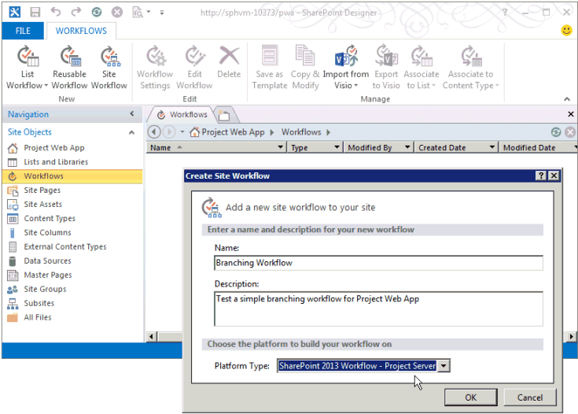

# 创建 Project Server 工作流的需求管理

本文介绍如何使用 SharePoint Designer 2013 中创建简单的工作流。 您可以导出到 Visio 2013 的工作流可视化和编辑，或设计 Project Server 2013 工作流中使用 Visio 2013 和导入 SharePoint Designer 2013 到 Project Web App 的出版物的设计。 有关 SharePoint 工作流平台和使用 Visio 2013 和 SharePoint Designer 2013 创建工作流的详细信息，请参阅 SharePoint 2013 开发人员文档中的[Workflows in SharePoint 2013](https://msdn.microsoft.com/library/jj163986%28office.15%29.aspx)文章。 
  
有关准备 Project Server 工作流的信息，请参阅[开始： 设置并配置 SharePoint 2013 工作流管理器](https://msdn.microsoft.com/library/jj163276%28office.15%29.aspx)。

## 创建常规工作流

使用以下步骤使用 SharePoint Designer 2013 创建 Project Server 2013 工作流。 工作流专为需求管理的项目建议。
  
详细步骤，请参阅[创建分支工作流](#pj15_CreateWorkflowSPD_Detailed)一节。 
  
### 创建 Project Server 工作流（常规过程）

1. 确定需求，然后设计工作流。将工作流组织到阶段和容器，并确定工作流将使用的自定义域。
    
2. Project Web App 中创建工作流需要的实体：
    
    1. 查看现有工作流阶段；创建必要的阶段。
        
    2. 创建工作流将使用的企业自定义域。自定义域必须由工作流控制才能在工作流容器使用。
        
    3. 编辑或创建您的工作流容器将用于收集项目信息的项目详细信息页 (PDP)。在本示例中，容器将使用编辑为包含新的自定义域的默认 PDP。
        
    4. 创建必要的工作流容器，然后将每个工作流容器与对应的阶段关联。
    
3. SharePoint Designer 2013 中**基于文本的设计器**中使用声明性语句来构造工作流：
    
    > [!NOTE]
    > 您还可以切换到 SharePoint Designer 2013 中的**可视化设计器**或从 Visio 2013 中导入现有工作流。 按照以下步骤使用**基于文本的设计器**： 
    > 
    > 1. 打开 Project Web App 网站，然后再创建使用**SharePoint 2013 工作流-Project Server**工作流平台的网站工作流。 
    > 2. 添加工作流使用的容器。
    > 3. 插入每个容器中所需的工作流步骤、条件、操作和循环。
    > 4. 检查任何工作流错误并纠正您找到的所有错误。
    > 5. （可选）将视图切换到**可视化设计器**中，或将工作流导出到 Visio 2013 文件。 您可以修改 Visio 视图，并将更改保存到当前工作流。 您可以编辑 Visio 文件，并将其导入在 SharePoint Designer 2013 创建其他工作流。
    > 6. 发布工作流。 发布后，工作流显示在列表中的 Project Web App 网站工作流。
    
4. Project Web App 中使用的需求管理的项目建议工作流：
    
    1. 创建使用工作流的企业项目模板 (EPT)。
        
    2. 在“项目中心”页上，创建使用工作流的 EPT 的项目，然后继续完成其他工作流容器。
        
    3. 全面测试工作流。
        
    4. 将工作流部署到生产服务器。

## 创建分支工作流

您可以使用 SharePoint Designer 2013 创建 Project Server 工作流之前，必须配置工作流管理器客户端 1.0 服务用于 Project Server 2013 工作流活动。 有关如何配置工作流管理器客户端 1.0 的信息，请参阅 SharePoint Server 2013 开发人员文档中的[Workflows in SharePoint 2013](https://msdn.microsoft.com/library/jj163986%28office.15%29.aspx)文章。 
  
下面的详细的过程包含相同的步骤，如[创建常规工作流](#pj15_CreateWorkflowSPD_General)部分中所示。 
  
### 创建 Project Server 分支工作流（详细过程）

#### 1.规划和设计工作流。

Project Server 工作流可以集成具有多个阶段和阶段中的需求管理过程。 因为工作流可以很复杂，您必须了解的业务要求，并仔细规划工作流。 对于简单示例，设计使用项目建议的估计的成本来确定是否接受建议的分支工作流。 如果估计的成本更高版本比 25000 美元，拒绝此建议;否则为接受建议，并创建项目。
    
因为您可以使用 Visio 2013 和 SharePoint Designer 2013 来帮助设计和 Project Server 2013 中创建工作流，您可以更轻松地尝试与工作流可以使用 Project Server 2010。 本文中的示例工作流设计是[创建分支工作流](https://msdn.microsoft.com/library/a02cafdc-d881-4271-b446-d8b2cd456a52%28Office.15%29.aspx)文章 Project 2010 SDK 中相同。 您可以设计并使用 Project Web App 的测试实例的远程计算机上创建测试工作流 — 不需要直接在 Project Server 2013 计算机上创建工作流。 
    
#### 2.创建工作流需要的实体。

Project Web App 中查看可用工作流阶段和容器，可用的企业自定义域。 如有必要，创建工作流要求，如以下步骤中所示的实体：
    
1. **工作流阶段**默认安装的 Project Web App 包括创建、 选择、 计划、 管理和完成的阶段。 对于分支工作流示例中，您不需要创建其他阶段。 
        
2. **企业自定义域**分支工作流需要项目成本自定义域的工作流控制。 在工作流使用 PDP 中设置工作流控制的自定义字段的值。 例如，选择**设置**图标在右上角的 Project Web App 页上，选择**PWA 的设置**，然后选择**企业自定义域和查阅表格**。
        
   创建自定义字段**项目**实体，用于名为 Proposal Cost 并选择**成本**的类型。 有关说明，键入项目建议估计成本。 在**行为**部分中，选择**由工作流控制的行为**。
        
3. **项目详细信息页面**编辑或创建的工作流阶段将使用 Pdp。 例如，请执行以下步骤： 
        
    1. 选择“服务器设置”页上的“项目详细信息页”****，然后选择“ProjectInformation”**** PDP。 
            
    2. 在功能区的“页面”**** 选项卡上的“编辑”**** 组中，选择“编辑页面”****。
            
    3. 选择右上角的**基本信息**web 部件中，向下箭头，然后选择**编辑 web 部件**。 或者，在功能区中，在**属性**组中的**WEB 部件**选项卡上选择**属性 web 部件**以显示编辑器部分。 
            
    4. 在编辑器部分的“显示的项目域”**** 部分（见图 1），选择“修改”****。
            
    5. 添加**Proposal Cost**自定义域中，将其移动上面**选定的项目域**列表中，在**所有者**字段，然后选择**确定**（见图 1）。
      
    6. 在编辑器部分中选择“确定”****，然后在功能区的“页面”**** 选项卡上的“编辑”**** 组中，选择“停止编辑”****。图 2 显示了添加到项目信息 PDP 的 **Proposal Cost** 自定义域。 

    **图 1。编辑 PDP 中的项目字段 web 部件**

    

    **图 2. 编辑后的 PDP 包括 建议成本 自定义域**

    
  
4. **工作流阶段**创建工作流的每个阶段的所需的阶段。 在服务器设置页上选择**工作流容器**，然后选择**新工作流容器**。 图 3 显示了添加工作流阶段页上的一部分。
    
    **图 3. 在 Project Web App 中添加工作流容器**

    
  
    分支工作流示例使用表 1 中显示的四个容器。 在添加工作流阶段页 （未显示在图 3） 的**可见的项目详细信息页面的其他设置**部分中，值是可选的;在工作流状态页上提供的详细信息。 例如，由于初始建议详细信息 PDP 要求用户输入，您可以选择**项目详细信息页需要注意**复选框，并将特定描述，如设置项目名称和成本此 PDP。
    
    图 4 显示了“工作流容器”页上已完成的四个容器。
    
    **图 1. 分支工作流的容器**

    |名称|说明|提交说明|阶段|可视 PDP|自定义域|
    |:-----|:-----|:-----|:-----|:-----|:-----|
    |建议初始详细信息    |设置项目名称和成本。    |将项目作为建议提交。    |创建    |项目信息    项目详细信息    |建议成本（必需）    |
    |项目详细信息    |提供建议的项目的详细信息。    |提交详细信息以继续执行项目。    |创建    |项目信息    项目详细信息    |建议成本（只读）    |
    |自动拒绝    |根据提供的信息拒绝建议。    |   |创建    |项目信息    |建议成本（只读）    |
    |执行    |接受建议，并为项目管理做好了准备。    |   |管理    |项目信息    项目详细信息    |建议成本（只读）    |
   
    **图 4. Project Web App 中的工作流容器的列表**

    
  
#### 3.构造基于文本的设计器中的工作流。

SharePoint Designer 2013 中基于文本的设计器中使用声明性语句来构造工作流。 您可以开始键入在橙色插入行以获取上下文相关的自动完成语句的工作流逻辑和步骤，也可以使用功能区的**工作流**选项卡上的**插入**组中的控件插入的逻辑和步骤。 
    
1. 在 SharePoint Designer 2013 Backstage 视图中，选择**打开网站**。 例如，打开`https://ServerName/pwa`。 在**导航**窗格中，选择**工作流**。 然后，在功能区中，在**新建**组中的**工作流**选项卡上选择**网站工作流**。 对于此示例，命名为工作流分支工作流。 确保**平台类型**下拉列表中选择了**SharePoint 2013 工作流-Project Server** （参见图 5）。 
    
    **图 5. 创建 Project Server 网站工作流**

    
  
2. 选择“分支工作流”**** 选项卡。然后，在功能区的“工作流”**** 选项卡上的“管理”**** 组中的“视图”**** 下拉列表中，选择“基于文本的设计器”****。若要显示具有闪烁的橙色插入行的视图（见图 6），请在视图中单击。
    
    **图 6. 使用工作流的基于文本的设计器视图**

    
  
3. 在“基于文本的设计器”**** 视图中，添加工作流使用的容器。在功能区的“工作流”**** 选项卡上的“插入”**** 组中，在“创建”**** 下的“容器”**** 下拉列表中，选择“建议初始详细信息”****。
    
    同样，将橙色插入行置于“容器: 建议初始详细信息”**** 框的下方，并添加工作流使用的其他容器：“项目详细信息”****、“自动拒绝”**** 和“执行”****（见图 7）。 
    
    **图 7. 在 SharePoint Designer 中向工作流添加容器**

    
  
4. 在每个容器中添加工作流步骤和逻辑： 
    
    1. 在“	建议初始详细信息”**** 容器中，将橙色插入行置于容器正文的顶部。在功能区上的“插入”**** 组中，选择“操作”****，向下滚动到“Project Web App 操作”****，然后选择“等待项目事件”****。选择“此项目事件”****，然后在下拉列表中选择“事件: 提交项目时”****。 
    
    2. 在“建议初始详细信息”**** 容器的“切换到容器”**** 部分中，插入“如果任何值等于值”****。您可以开始键入语句或使用功能区上的“插入”**** 组中的“条件”**** 控件。 
    
    3. 选择第一个“值”**** 控件，然后选择“fx”**** 以显示“定义工作流查找”**** 对话框（见图 8）。在“数据源”**** 下拉列表中，选择“项目数据”****。在“源中的域”**** 下拉列表中，选择“建议成本”****。
    
       **图 8. 定义工作流中的查找值**

       
  
    4. 完成`If`语句以使其显示以下：**如果 Project Data: Proposal Cost 大于 25000**
    
       > [!NOTE]
       > 您也可以创建工作流变量，将变量设置为自定义域值，然后将变量与值比较。例如，从功能区上的“局部变量”**** 下拉列表中，创建一个类型为 **Number** 的名为 **TotalCost**（无空格）的变量。在“定义工作流查找”**** 对话框中，选择“工作流变量和参数”**** 作为数据源，然后选择“变量: TotalCost”**** 作为域。“If”**** 语句将为：“If Variable: TotalCost is greater than 25000”****
  
    5. 将橙色插入行内的置于`If`分支，，然后插入使用功能区上的**插入**组中的**操作**控件中，**转到的阶段**。 **一个阶段**下拉控件并选择**自动拒绝**容器。 
    
       类似地，在`Else`分支，插入**转到项目详细信息**语句。 图 9 显示已完成的**建议初始详细信息**容器。 
    
       **图 9.“建议初始详细信息”容器的已完成逻辑**

       
  
    6. 在“自动拒绝”**** 容器中，除非您需要暂停工作流并在 PDP 中显示部分数据，否则请将第一个部分保留为空。“切换到容器”**** 部分必须包含一个转换；由于在拒绝后无其他任何容器，因此请为该语句键入 Go to End of Workflow。 
    
    7. 在“项目详细信息”**** 容器中，在“切换到容器”**** 部分中添加 Go to Execution。除非需要添加其他数据，或者您需要暂停工作流，否则不一定需要等待提交事件。 
    
    8. 在“执行”**** 容器中，除非您需要暂停工作流，否则请将容器操作部分保留为空。在“切换到容器”**** 部分中，添加“Go to End of Workflow”****。
    
5. 在功能区上的“保存”**** 组中，选择“检查错误”**** 以检查工作流错误（见图 10）。纠正所有错误，然后选择“保存”****。
    
    **图 10. 在 SharePoint Designer 中检查工作流错误**

    
  
6. （可选）在功能区上的“管理”组**** 中的“视图”**** 下拉菜单中，选择“可视化设计器”****。在图 11 中，该视图将缩小 50%。
    
    可以使用可视化设计器在工作流中编辑项目。例如，选择“如果任何值等于值”**** 条件，选择该条件左下角的工具图标，然后选择“值”**** 以在“属性”**** 对话框中显示比较条件。 
    
    **图 11. 使用工作流的可视化设计器**

    
  
    在工作流可视化设计器视图中时，作为备份 Visio 2013 (.vsdx) 文件中保存工作流或对于稍后使用，您可以选择**将导出到 Visio**。
    
7. 发布工作流。 当使用 SharePoint Designer 2013 将工作流发布到活动的 Project Web App 网站时，工作流注册到 SharePoint 网站或 Azure 中和有空 Project Web App 中的新 Ept。

#### 4.创建工作流，EPT，然后测试工作流。

Project Web App 中创建的工作流，EPT，然后通过创建项目建议来测试工作流：
    
1. 在 PWA 的设置页上，选择**企业项目类型**，然后再创建 EPT 名为测试分支工作流。 清除**作为 SharePoint 任务列表项目创建新项目**复选框，以便在 Project Server 将保持的 EPT 创建项目的完全控制。 在**网站工作流关联**下拉列表中，选择**分支工作流**，然后选择将工作流显示的第一页**新项目页面**下拉列表中的**项目信息**PDP。 
    
    **图 12. 添加工作流的 EPT**

    
  
    > [!NOTE]
    > 企业项目类型的表中的“SharePoint 任务列表项目”**** 列中的值“是”**** 指创建 SharePoint 任务列表的 EPT，其中任务列表在 Project Web App 中可见，而 SharePoint 将保留对项目的控制。有关将项目作为 SharePoint 任务列表进行管理的更多信息，请参阅 [Project Server 2013 architecture](project-server-2013-architecture.md)。 
  
2. Project Web App 中打开项目页上，然后使用新的 EPT 创建项目 （见图 13）。 由于**测试分支工作流**与**分支工作流**关联，因此项目创建启动工作流的控制之下。
    
    **图 13. 使用测试分支工作流 EPT 创建项目**

    
  
3. 当工作流显示**的项目信息**PDP 时，将数据添加到的项目字段。 例如，输入 30000 **Proposal Cost**值。 美国英语版本的 Project Server 更改要显示 $30000 的域 （见图 14）。
    
    **图 14. 使用编辑后的项目信息 PDP**

    
  
4. 在功能区的“项目”**** 选项卡上的“项目”**** 组中，选择“保存”****。Project Server 会将 PDP 中的数据添加到项目，然后显示“工作流状态”页（见图 15）。要查看工作流状态图中“建议初始详细信息”容器的完整说明，请将指针悬停在工作流可视化图中的容器上。
    
    “所有工作流容器”**** 网格使用绿色箭头指明“建议初始详细信息”容器正在等待输入。这是因为工作流等待“建议初始详细信息”容器中的提交事件。如果工作流未等待提交事件，则可以选择“页面”**** 组中的“下一步”**** 以进入下一个 PDP。 
    
    **图 15. 使用“建议初始详细信息”容器中的“工作流状态”页**

    
  
    工作流可视化图表用绿色显示当前容器。在“创建”**** 阶段中，“建议初始详细信息”容器为当前容器。 
    
5. 在功能区上的“工作流”**** 组中，选择“提交”****。
    
    > [!TIP]
    > 如果禁用了“提交”**** 控件，请刷新页面。 
  
    如果“建议成本”**** 值大于 $25,000 USD，则工作流将移动到“自动拒绝”容器。图 16 显示了当您再次选择“提交”**** 时的“自动拒绝”容器状态。如果“建议成本”**** 为 $25,000 USD 或更小，则工作流将移动到“项目详细信息”容器（见图 17）。 
    
    **图 16. 在“自动拒绝”容器中完成工作流**

    
  
    图 17 显示项目建议名为另一个测试**测试 2-分支**，其中的项目详细信息阶段是当前在创建阶段。 管理阶段中浅色放映蓝色颜色，这表明该阶段尚未未处于活动状态。
    
    **图 17. 如果成本少于 $25,000，则工作流将继续进行“项目详细信息”容器**

    
  
6. 如果您进入“项目详细信息”容器，则默认页面中不会添加任何其他数据。再次选择“提交”**** 以进入“执行”容器（见图 18）。 
    
    **图 18. 工作流已准备好在“执行”容器中进行管理**

    
  
在“项目详细信息”容器中，工作流不会等待提交事件。如果项目详细信息 PDP 包括其他必需域，则在继续“执行”容器之前，Project Server 将一直等待，直到您向域添加数据。根据分支工作流中的定义，“执行”容器也不会等待提交事件。在“执行”容器中，您可以项目经理的身份编辑项目，或者在功能区的“项目”**** 选项卡中选择“关闭”****。当您选择“关闭”**** 时，您可以签入项目并在稍后对其进行编辑或将项目保留签出状态。

“分支工作流”**** 项目是一个仅具有一个比较测试的简单示例。工作流涵盖了“创建”阶段中的三个容器以及需求管理的“管理”阶段中的一个容器。若要全面测试工作流，您应该测试工作流的所有分支并使用极值和典型值来查看行为是否符合预期。 

## 从 Visio 导入工作流

若要更改工作流，您可以创建或修改工作流控制的自定义域和创建或修改工作流阶段。 您可以使用 SharePoint Designer 2013 中添加条件、 操作、 循环和阶段，然后保存并重新发布工作流。 若要重复使用或保存工作流的备份，您可以将其导出到 Visio 2013 文件中。 
  
您还可以创建或编辑 Visio 2013 中的工作流并将文件导入 SharePoint Designer 2013，以供 Project Web App。 若要使用的未修改的工作流，Project Web App 实例必须包含相同的原始的 Project Web App 实例中的工作流阶段属性。 有关使用 Visio 来帮助创建工作流的详细信息，请参阅[在 SharePoint Designer 2013 和 Visio 2013 中的工作流开发](https://msdn.microsoft.com/library/jj163272%28office.15%29.aspx)。
  
> [!NOTE]
> 到 Project Web App 的不同实例导入 Visio 2013 文件时，阶段将具有不同的容器 Guid，即使阶段名称相同。 导入工作流后，您必须配置要使用特定于 Project Web App 实例的值的阶段和操作的属性。 
> 
> 如果您在 Visio 2013 中创建工作流的阶段和操作具有因为 Visio 不会与 Project Web App 连接特定的 Project Web App 实例的任何属性。 Project Web app 连接 SharePoint Designer 2013 时，创建工作流，然后导入 VSDX 文件，覆盖活动的工作流。 然后，您必须配置要与 SharePoint Designer 2013 获取从 Project Web App 的值匹配的阶段和操作的属性。 
  
### 将工作流从 Visio 导入到 SharePoint Designer

1. 在 Visio 2013 中创建简单的工作流。 例如，请执行以下步骤：
    
   1. 打开 Visio，然后创建一个工作流。为新工作流选择“类别”**** 窗格，选择“流程图”****，在“新建”窗格中选择“Microsoft SharePoint 2013 工作流”******** 模板，然后选择“创建”****。工作流将使用名为“容器 1”**** 的容器形状打开。工作流包括“开始”组件，其容器形状包括“进入”形状和“退出”形状。
    
      当您将鼠标悬停在容器形状，并选择**属性**图标时，所选内容被禁用。 向 SharePoint Designer 2013 中导入工作流关系图之后，可以设置的阶段和操作属性。 
    
      > [!NOTE]
      >  您唯一应该使用的形状模具如以下工作流形状列表中所示： 
      > - **操作-SharePoint 2013 工作流**
      > - **组件的 SharePoint 2013 工作流**
      > - **条件-SharePoint 2013 工作流**
  
   2. 在“形状”**** 窗格中，选择“快速形状”****，然后将名为“如果任何值等于值”**** 的“条件”形状拖放到“容器”形状右侧。 
    
   3. 在功能区的“主页”**** 选项卡上，选择“连接器”**** 工具，然后将容器上的“退出”形状与“条件”形状连接起来（见图 19）。 
    
      **图 19. 在 Visio 工作流图中将“容器”形状与“条件”形状连接起来**

      
  
   4. 将另外两个“容器”形状拖放到“条件”形状右侧。形状命名为“容器 2”**** 和“容器 3”****。
    
   5. 使用**连接器**工具，连接到**第 2 阶段**的 Enter 形状条件形状右侧。 选择**指针**工具，双击要显示的名称文本框的连接，然后命名是的连接。
    
   6. 将“条件”形状底部连接到“容器 3”**** 的“进入”形状。使用“指针”**** 工具，右键单击连接，然后选择“否”****。两种方法均适用于命名连接器“是”**** 或“否”****。
    
   7. 在**形状**窗格中，选择**操作-SharePoint 2013 工作流**，并将**等待项目事件**操作到形状的中间**容器**1 （见图 20）。 
    
      **图 20. 在 Visio 中完成工作流**

      
  
   8. 在功能区中的**图表验证**组中，**进程**选项卡上选择**检查图表**。 修复所有错误，然后保存该绘图。 例如，名称从 Visio.vsdx 文件测试工作流。
    
      有关修复工作流错误的信息，请参阅[Visio 2013 中的解决 SharePoint Server 2013 工作流验证错误](https://msdn.microsoft.com/library/jj163971%28v=office.15%29.aspx)。
    
2. 打开 SharePoint Designer 2013，然后打开对于**分支工作流**的示例使用同一个 Project Web App 网站。 
    
3. 在**导航**窗格中，选择**工作流**，然后创建网站工作流 （功能区的**工作流**选项卡上的选择**网站工作流**）。 例如，工作流简单工作流从 Visio 命名。
    
   在**创建网站工作流**对话框中，确保平台类型是**SharePoint 2013 工作流-Project Server**。 选择**创建**，并 SharePoint 设计器将打开新工作流**基于文本的设计器**窗格。 
    
4. 在功能区“工作流”**** 选项卡上的“管理”**** 组中，选择“工作流设置”****。
    
5. 在功能区的**工作流设置**选项卡上的**管理**组，选择**从 Visio 导入**，，然后导入以前保存的**测试工作流从 Visio.vsdx**文件。 **Microsoft SharePoint Designer**对话框提示您要导入的图表包含任何工作流属性，，询问是否要覆盖当前工作流。 选择**是**;SharePoint Designer 导入工作流关系图，生成模具形状，并显示包含导入工作流的**可视化设计器**窗格。 
    
6. 设置工作流中的每个阶段形状的属性。 例如，第一个容器形状名为**第 1 阶段 （无效）**，因为它不代表中已连接的 Project Web App 实例的有效容器。 当您选择，或将鼠标悬停在讲台时，您可以选择在左下角的**属性**图标以显示**阶段属性**对话框的阶段形状框 （请参阅图 21）。 在**项目阶段**下拉列表中，选择**建议初始详细信息**容器，然后选择**确定**。 SharePoint Designer 重命名阶段。
    
   **图 21. 在 SharePoint Designer 中设置容器属性**

   
  
   对于第二个容器，将“项目容器”**** 属性设置为“自动拒绝”****。对于第三个容器，将“项目容器”**** 属性设置为“执行”****。
    
7. 同样，对于“等待项目事件”**** 操作，将“事件名称”**** 属性设置为“事件: 提交项目时”****。
    
8. 同样，设置的**如果任何值等于值**条件的属性。 例如，将第一个**Value**属性设置为**Project Data: Proposal Cost**。 **Operator**属性设置为**是小于**。 将第二个**Value**属性设置为 5000。
    
9. 检查工作流中是否存在错误，然后保存工作流。如果没有错误，您可以将视图更改为“基于文本的设计器”****（见图 22）。 
    
   **图 22. 在基于文本的设计器中查看导入的工作流**

   
  
10. 发布工作流。如果您保存了工作流但未发布，则当您创建企业项目类型时工作流将不可用。
    
11. 若要测试**简单工作流从 Visio**导入的 Project Web App 中，创建使用工作流，EPT，然后再创建使用新的 EPT，就像**分支工作流**例如的项目。 在这种情况下，但是，少于 5,000 美元成本的项目被拒绝。 
    
在演练这篇文章，创建和使用 SharePoint Designer 2013 直接设置阶段、 条件和操作的工作流使用测试简单分支工作流。 您还可以使用 Visio 2013 创建甚至更简单分支工作流的图。 您导入 SharePoint Designer 2013，您可以在其中设置每个阶段、 条件和操作从 Project Web app 连接的属性的 Visio 工作流关系图。
  
Visio 2013 和 SharePoint Designer 一起提供了针对设计人员、 项目经理、 工作流开发人员和测试人员来创建、 共享和自定义工作流设计的 Project Server 2013 和 Project Online 的不同安装方便的方法。 对于需要对 SharePoint Designer 不提供的 Project Server 编程访问权限的工作流，您可以使用 Visual Studio 2012 客户端对象模型 (CSOM)。
  
## 另请参阅

- [Project Server 2013 体系结构](project-server-2013-architecture.md)
- [入门：设置和配置 SharePoint 2013 工作流管理器](https://msdn.microsoft.com/library/jj163276%28office.15%29.aspx)
- [了解如何在 SharePoint 2013 中打包和部署工作流](https://msdn.microsoft.com/library/jj819316%28office.15%29.aspx)
- [SharePoint 2013 中的工作流](https://msdn.microsoft.com/library/jj163986%28office.15%29.aspx)
- [Workflow development in SharePoint Designer 2013 and Visio 2013](https://msdn.microsoft.com/library/jj163272%28office.15%29.aspx)
- [纠正 Visio 2013 中的 SharePoint Server 2013 工作流验证错误](https://msdn.microsoft.com/library/jj163971%28v=office.15%29.aspx)
- [工作流和需求管理](https://msdn.microsoft.com/library/cf7433a3-a531-4467-ac0c-df0c5d6881ae%28Office.15%29.aspx)

