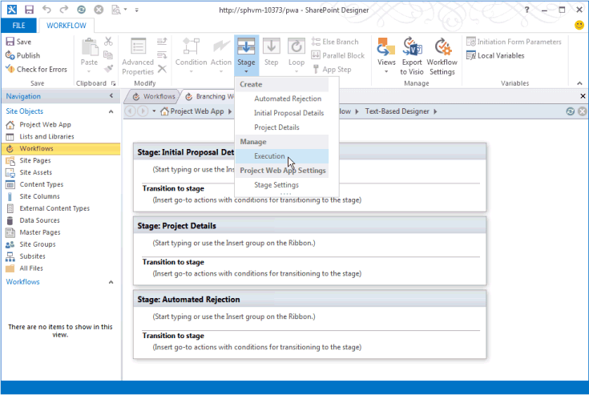

# 创建 Project Server 工作流以用于需求管理Create a Project Server workflow for demand management

本文介绍如何使用 Designer 2013 SharePoint简单工作流。This article describes how to create a simple workflow by using SharePoint Designer 2013. 您可以将工作流导出到 Visio 2013 进行可视化和编辑，或使用 Visio 2013 设计 Project Server 2013 工作流，将设计导入 SharePoint Designer 2013 中以发布给 Project Web App。You can export the workflow to Visio 2013 for visualization and editing, or use Visio 2013 to design Project Server 2013 workflows and import the design into SharePoint Designer 2013 for publication to Project Web App. 有关 SharePoint 工作流平台以及使用 Visio 2013 和 SharePoint Designer 2013 创建工作流的信息，请参阅 SharePoint [2013](https://msdn.microsoft.com/library/jj163986%28office.15%29.aspx)开发人员文档中的 workflows in SharePoint 2013 文章。For more information about the SharePoint workflow platform and creating workflows with Visio 2013 and SharePoint Designer 2013, see the [Workflows in SharePoint 2013](https://msdn.microsoft.com/library/jj163986%28office.15%29.aspx) articles in the SharePoint 2013 developer documentation. 
  
有关为工作流准备 Project Server 的信息，请参阅[Start： Set up and configure SharePoint 2013 工作流管理器。](https://msdn.microsoft.com/library/jj163276%28office.15%29.aspx)For information about preparing Project Server for workflows, see [Start: Set up and configure SharePoint 2013 Workflow Manager](https://msdn.microsoft.com/library/jj163276%28office.15%29.aspx).

## 创建常规工作流Creating a general workflow

使用以下步骤通过 Project Designer 2013 创建 SharePoint Server 2013 工作流。Use the following steps to create a Project Server 2013 workflow by using SharePoint Designer 2013. 工作流设计用于项目建议的需求管理。The workflow is designed for demand management of project proposals.
  
有关详细步骤，请参阅 [创建分支工作流部分](#pj15_CreateWorkflowSPD_Detailed) 。For detailed steps, see the [Creating a branching workflow](#pj15_CreateWorkflowSPD_Detailed) section. 
  
### 若要创建 Project Server 工作流 (一) To create a Project Server workflow (general procedure)

1. 确定要求，然后设计工作流。Determine the requirements, and then design the workflow. 将工作流组织到阶段和阶段，并确定工作流将使用的自定义域。Organize it into phases and stages, and determine the custom fields that the workflow will use.
    
2. 在Project Web App中，创建工作流所需的实体：In Project Web App, create the entities that the workflow requires:
    
    1. 查看现有工作流阶段;创建阶段。Review the existing workflow phases; create phases as necessary.
        
    2. 创建工作流将使用的企业自定义域。Create the enterprise custom fields that the workflow will use. 若要在工作流阶段可用，自定义域必须受工作流控制。To be available in a workflow stage, a custom field must be controlled by a workflow.
        
    3. 编辑或创建 PDP (项目详细信息) ，您的工作流阶段将使用这些页面来收集项目的信息。Edit or create the project detail pages (PDPs) that your workflow stages will use to collect information for the project. 本示例中，阶段使用编辑的默认 PDP 来包括新的自定义域。In this example, the stages use default PDPs that are edited to include a new custom field.
        
    4. 创建必要的工作流阶段，然后将每个工作流阶段与正确的阶段关联。Create the necessary workflow stages, and then associate each workflow stage with the correct phase.
    
3. 在 SharePoint Designer 2013 中，使用基于文本的设计器中的声明性 **语句构造工作流**：In SharePoint Designer 2013, construct the workflow by using declarative statements in the **Text-Based Designer**:
    
    > [!NOTE]
    > 您还可以切换到 SharePoint Designer  2013 中的可视化设计器，或从 Visio 2013 导入现有工作流。You can also switch to the **Visual Designer** in SharePoint Designer 2013, or import an existing workflow from Visio 2013. 请按照以下步骤使用基于 **文本的设计器**：Follow these steps to use the **Text-Based Designer**: 
    > 
    > 1. 打开 Project Web App 网站，然后创建一个使用 **SharePoint 2013 Workflow - Project Server 工作流** 平台的网站工作流。Open the Project Web App site, and then create a site workflow that uses the **SharePoint 2013 Workflow - Project Server** workflow platform. 
    > 2. 添加工作流使用的阶段。Add the stages that the workflow uses.
    > 3. 插入每个阶段所需的工作流步骤、条件、操作和循环。Insert the workflow steps, conditions, actions, and loops that are required in each stage.
    > 4. 检查是否有工作流错误，并修复您找到的任何错误。Check for any workflow errors and fix any that you find.
    > 5.  (可选) 将视图切换到 **可视化** 设计器，或将工作流导出到 Visio 2013 文件。(Optional) Switch the view to the **Visual Designer**, or export the workflow to a Visio 2013 file. 您可以修改Visio视图，并保存对当前工作流的更改。You can modify the Visio view and save changes to the current workflow. 您可以编辑该Visio文件，并导入到 SharePoint Designer 2013 中以创建其他工作流。You can edit the Visio file and import it in SharePoint Designer 2013 to create other workflows.
    > 6. 发布工作流。Publish the workflow. 发布后，工作流会显示在网站工作流Project Web App列表中。After it is published, the workflow shows in the list of workflows for the Project Web App site.
    
4. 在Project Web App中，使用工作流进行项目建议的需求管理：In Project Web App, use the workflow for demand management of project proposals:
    
    1. 使用工作流的 EPT (创建) 模板。Create an enterprise project template (EPT) that uses the workflow.
        
    2. 在Project中心"页上，创建一个对工作流使用 EPT 的项目，然后执行工作流阶段。On the Project Center page, create a project that uses the EPT for the workflow, and then follow through the workflow stages.
        
    3. 全面测试工作流。Test the workflow thoroughly.
        
    4. 将工作流部署到生产服务器。Deploy the workflow to a production server.

## 创建分支工作流Creating a branching workflow

必须先将 工作流管理器 Client 1.0 服务配置为使用 Project Server 2013 工作流活动，然后才能使用 SharePoint Designer 2013 创建 Project Server 工作流。Before you can use SharePoint Designer 2013 to create a Project Server workflow, the Workflow Manager Client 1.0 service must be configured to use the Project Server 2013 workflow activities. 若要了解如何配置 工作流管理器 Client 1.0，请参阅 SharePoint Server [2013 开发人员文档中的 SharePoint 2013](https://msdn.microsoft.com/library/jj163986%28office.15%29.aspx)中的工作流文章。For information about how to configure Workflow Manager Client 1.0, see the [Workflows in SharePoint 2013](https://msdn.microsoft.com/library/jj163986%28office.15%29.aspx) articles in the SharePoint Server 2013 developer documentation. 
  
以下详细过程包含的步骤与"创建常规工作流" [部分的步骤](#pj15_CreateWorkflowSPD_General) 相同。The following detailed procedure includes the same steps as in the [Creating a general workflow](#pj15_CreateWorkflowSPD_General) section. 
  
### 若要创建 Project Server 分支工作流， (过程) To create a Project Server branching workflow (detailed procedure)

#### 1. 规划并设计工作流。1. Plan and design the workflow.

一Project服务器工作流可以在需求管理过程中与多个阶段集成。A Project Server workflow can integrate with multiple stages and phases in a demand-management process. 由于工作流可能很复杂，因此您必须了解业务要求并仔细规划工作流。Because workflows can be complex, you must understand the business requirements and plan a workflow carefully. 对于简单示例，设计一个分支工作流，该工作流使用项目建议的估计成本来确定建议是否被接受。For a simple example, design a branching workflow that uses the estimated cost of a project proposal to determine whether the proposal is accepted. 如果估计成本大于 25，000 美元，则拒绝该建议;否则，接受建议并创建项目。If the estimated cost is greater than $25,000 USD, reject the proposal; otherwise, accept the proposal and create the project.
    
因为您可以使用 Visio 2013 和 SharePoint Designer 2013 来帮助设计和创建 Project Server 2013 的工作流，所以与 Project Server 2010 一样，您可以更轻松地对工作流进行试验。Because you can use Visio 2013 and SharePoint Designer 2013 to help design and create workflows for Project Server 2013, you can more easily experiment with workflows than is possible with Project Server 2010. 本文中的示例工作流设计与 Project 2010 SDK 中的创建分支工作流一文相同。 The sample workflow design in this article is the same as in the [Create a branching workflow](https://msdn.microsoft.com/library/a02cafdc-d881-4271-b446-d8b2cd456a52%28Office.15%29.aspx) article in the Project 2010 SDK. 您可以使用 Project Web App 测试实例在远程计算机上设计和创建测试工作流，而不需要在 Project Server 2013 计算机上直接创建工作流。You can design and create a test workflow on a remote computer using a test instance of Project Web App—you do not have to create workflows directly on a Project Server 2013 computer. 
    
#### 2. 创建工作流所需的实体。2. Create the entities that your workflow requires.

在Project Web App中，查看可用的工作流阶段和阶段以及可用的企业自定义域。In Project Web App, review the available workflow phases and stages, and the enterprise custom fields that are available. 如有必要，创建工作流所需的实体，如以下步骤所示：If necessary, create the entities that your workflow requires, as in the following steps:
    
1. **工作流阶段** 默认安装的 Project Web App包括创建、选择、计划、管理和完成阶段。**Workflow phases** The default installation of Project Web App includes the Create, Select, Plan, Manage, and Finished phases. 对于分支工作流示例，不需要创建其他阶段。For the branching workflow example, you do not have to create other phases. 
        
2. **Enterprise自定义字段** 分支工作流需要一个受工作流控制的项目成本自定义域。**Enterprise custom fields** The branching workflow requires a project cost custom field that is workflow-controlled. 工作流控制的自定义域的值在工作流使用的 PDP 中设置。The value of a workflow-controlled custom field is set in a PDP that the workflow uses. 例如，选择设置页面右上角的"Project Web App"图标，选择"PWA 设置"，然后选择"自定义Enterprise字段和查找 **表"。**For example, choose the **Settings** icon at the top-right of a Project Web App page, choose **PWA Settings**, and then choose **Enterprise Custom Fields and Lookup Tables**.
        
   为实体创建一个名为"建议成本 **Project，然后选择** 类型 **Cost**。Create a custom field named Proposal Cost for the **Project** entity, and select the type **Cost**. 对于说明，键入项目建议的估计成本。For the description, type Estimated cost of a project proposal. 在"**行为"** 部分，选择 **"工作流控制的行为"。**In the **Behavior** section, choose **Behavior controlled by workflow**.
        
3. **Project详细信息页面** 编辑或创建工作流阶段将使用的 PDP。**Project detail pages** Edit or create the PDPs that the workflow stages will use. 例如，执行下列步骤：For example, do the following steps: 
        
    1. 在 **"Project"** 页上选择"设置详细信息页面"，然后选择 **"ProjectInformation** PDP"。Choose **Project Detail Pages** on the Server Settings page, and then choose the **ProjectInformation** PDP. 
            
    2. 在功能 **区的"页面**"选项卡上的"编辑 **"** 组中，选择"编辑 **页面"。**On the **PAGE** tab of the ribbon, in the **Edit** group, choose **Edit Page**.
            
    3. 选择基本信息 Web 部件右上方的向下箭头，然后选择"编辑 Web **部件"。**Choose the down arrow at the top-right of the **Basic Info** web part, and then choose **Edit web part**. 或者，在功能区的 **"WEB 部件**"选项卡上的"属性"组中，选择 **"Web** 部件属性"以显示编辑器部件。Or, on the **WEB PART** tab of the ribbon, in the **Properties** group, choose **web part Properties** to show the editor part. 
            
    4. 在编辑器 **Project** 的"显示字段"部分 (图 1) "修改 **"。**In the **Displayed Project Fields** section of the editor part (see Figure 1), choose **Modify**.
            
    5. 添加"**建议** 成本"自定义域，将其移动到"所选字段"列表中的"所有者 **"Project"** 上方，然后选择"确定 (参见图 1) 。Add the **Proposal Cost** custom field, move it above the **Owner** field in the **Selected Project Fields** list, and then choose **OK** (see Figure 1).
      
    6. 在编辑器部件中，选择"**确定**"，然后在功能区的"**页面**"选项卡上的"编辑"组中选择"停止编辑"。In the editor part, choose **OK**, and then choose **Stop Editing** in the **Edit** group, on the **PAGE** tab of the ribbon. 图 2 显示了添加到"建议 **成本**"自定义域Project信息 PDP。Figure 2 shows the **Proposal Cost** custom field that is added to the Project Information PDP. 

    **图 1.编辑 PDP Project字段 Web 部件****Figure 1. Editing the Project Fields web part in a PDP**

    ![编辑 PDP Project]字段 Web 部件(media/pj15_CreateWorkflowSPD_EditPDP.gif "编辑 PDP") Project字段 Web 部件

    **图 2.编辑的 PDP 包括"建议成本"自定义域****Figure 2. The edited PDP includes the Proposal Cost custom field**

    ![编辑的 PDP 包括"建议成本"字段]编辑的(media/pj15_CreateWorkflowSPD_EditedPDP.gif "PDP 包括\"建议成本\"字段")
  
4. **工作流阶段** 创建工作流每个阶段所需的阶段。**Workflow stages** Create the stages that are required for each phase of the workflow. 在"服务器设置"页上，选择"**工作流阶段"，** 然后选择"**新建工作流阶段"。**On the Server Settings page, choose **Workflow Stages**, and then choose **NEW WORKFLOW STAGE**. 图 3 显示了"添加工作流阶段"页的一部分。Figure 3 shows part of the Add Workflow Stage page.
    
    **图 3.在工作流中添加工作流Project Web App****Figure 3. Adding a workflow stage in Project Web App**

    
  
    分支工作流示例使用表 1 中显示的四个阶段。The branching workflow example uses the four stages that are shown in Table 1. 在图 3 **设置** 中未 ("添加工作流阶段"页的"可见Project详细信息页"部分，) 可选;它们在"工作流状态"页上提供了详细信息。In the **Additional Settings for the Visible Project Detail Page** section of the Add Workflow Stage page (not shown in Figure 3), values are optional; they provide more information on the Workflow Status page. 例如，由于"初始建议详细信息"PDP 需要用户输入，因此可以选中 **"Project 详细信息** 页面需要关注"复选框，然后添加特定说明，如设置此 PDP 的项目名称和成本。For example, because the Initial Proposal Details PDP requires user input, you can select the **The Project Detail Page requires attention** check box, and then add a specific description such as Set the project name and cost for this PDP.
    
    图 4 显示了"工作流阶段"页上完成的四个阶段。Figure 4 shows the four stages completed on the Workflow Stages page.
    
    **表 1.分支工作流的阶段****Table 1. Stages for the branching workflow**

    |名称Name|说明Description|提交说明Description for Submit|阶段Phase|可见的 PDPVisible PDPs|自定义字段Custom Fields|
    |:-----|:-----|:-----|:-----|:-----|:-----|
    |初始建议详细信息Initial Proposal Details    |设置项目名称和成本。Set the project name and cost.    |将项目作为建议提交。Submit the project as a proposal.    |创建Create    |Project信息Project Information    Project详细信息Project Details    |建议所需的 (成本) Proposal Cost (required)    |
    |Project详细信息Project Details    |提供建议项目的详细信息。Provide details of the proposed project.    |提交详细信息以继续项目。Submit details to continue with the project.    |创建Create    |Project信息Project Information    Project详细信息Project Details    |建议 (只读) Proposal Cost (read-only)    |
    |自动拒绝Automated Rejection    |根据提供的信息，将拒绝建议。The proposal is rejected, based on the information that is provided.    |   |创建Create    |Project信息Project Information    |建议 (只读) Proposal Cost (read-only)    |
    |执行Execution    |该建议被接受，并且已准备好进行项目管理。The proposal is accepted, and ready for project management.    |   |管理Manage    |Project信息Project Information    Project详细信息Project Details    |建议 (只读) Proposal Cost (read-only)    |
   
    **图 4.工作流中的工作流Project Web App****Figure 4. List of the workflow stages in Project Web App**

    中的工作流阶段列表Project Web App
  
#### 3. 在工作流设计器中Text-Based工作流。3. Construct the workflow in the Text-Based Designer.

在 SharePoint Designer 2013 中，使用 Text-Based Designer 中的声明性语句构造工作流。In SharePoint Designer 2013, construct the workflow by using declarative statements in the Text-Based Designer. 可以在橙色插入行开始键入，获取工作流逻辑和步骤的上下文相关自动完成语句，或者可以使用功能区"工作流"选项卡上的"插入"组中控件插入逻辑和步骤。  You can start typing at the orange insertion line to get context-sensitive auto-completion statements for the workflow logic and steps, or you can insert the logic and steps by using controls in the **Insert** group on the **WORKFLOW** tab of the ribbon. 
    
1. 在 SharePoint Designer 2013 的 Backstage 视图中，选择"**打开网站"。**In the Backstage view of SharePoint Designer 2013, choose **Open Site**. 例如，打开  `https://ServerName/pwa` 。For example, open  `https://ServerName/pwa`. 在导航 **窗格中**，选择"工作流 **"。**In the **Navigation** pane, choose **Workflows**. 然后，在功能区的 **"工作流**"选项卡上的 **"新建"** 组中，选择"网站 **工作流"。**Then, on the **WORKFLOWS** tab of the ribbon, in the **New** group, choose **Site Workflow**. 对于此示例，将工作流命名为 Branching Workflow。For this example, name the workflow Branching Workflow. 确保 **"SharePoint 2013 工作流 - Project 服务器**"在"平台类型"下拉列表中选中 (请参阅图 5) 。Ensure that **SharePoint 2013 Workflow - Project Server** is selected in the **Platform Type** drop-down list (see Figure 5). 
    
    **图 5.创建 Project Server 网站工作流****Figure 5. Creating a Project Server site workflow**

    
  
2. 选择"**分支工作流"** 选项卡。然后，在功能 **区的"工作流**"选项卡上的"管理"组中，在"视图"下拉列表中，选择"**基于文本的设计器"。**Select the **Branching Workflow** tab. Then, on the **WORKFLOW** tab of the ribbon, in the **Manage** group, in the **Views** drop-down list, choose **Text-Based Designer**. 若要使用闪烁的橙色插入行显示视图 (请参阅图 6) ，请单击视图内。To show the view with the blinking orange insertion line (see Figure 6), click within the view.
    
    **图 6.使用Text-Based设计器视图****Figure 6. Using the Text-Based Designer view for the workflow**

    ![Using the Text-Based Designer view]Using the Text-Based Designer(media/pj15_CreateWorkflowSPD_TextBasedDesigner.gif "view")
  
3. 在" **基于文本的设计器"** 视图中，添加工作流使用的阶段。In the **Text-Based Designer** view, add the stages that the workflow uses. 在功能 **区的"工作流**"选项卡上的"插入"组中，在"创建"下的"阶段"下拉列表中，选择"初始 **建议详细信息"。** On the **WORKFLOW** tab of the ribbon, in the **Insert** group, in the **Stage** drop-down list under **Create**, choose **Initial Proposal Details**.
    
    同样，将橙色插入行放在"阶段 **：** 初始建议详细信息"框下方，并添加工作流使用的其他阶段 **：Project Details、Automated** **Rejection** 和 **Execution** (请参阅图 7) 。Similarly, place the orange insertion line below the **Stage: Initial Proposal Details** box, and add the other stages that the workflow uses: **Project Details**, **Automated Rejection**, and **Execution** (see Figure 7). 
    
    **图 7.在工作流设计器中向工作流SharePoint阶段****Figure 7. Adding a stage to a workflow in SharePoint Designer**

    
  
4. 在每个阶段中添加工作流步骤和逻辑：Add the workflow steps and logic within each stage: 
    
    1. 在" **初始建议详细信息** "阶段，将橙色插入行放在阶段正文的顶部。In the **Initial Proposal Details** stage, place the orange insertion line at the top of the stage body. 在功能 **区上的**"插入"组中，选择"操作"，向下滚动到"Project Web App **操作**"，然后选择"等待 **Project事件"。**In the **Insert** group on the ribbon, choose **Action**, scroll down to **Project Web App Actions**, and then choose **Wait for Project Event**. 选择 **此项目事件**，然后选择" **事件： 在** 下拉列表中提交项目时"。Choose **this project event**, and then select **Event: When a project is submitted** in the drop-down list. 
    
    2. 在"**初始建议详细信息**"阶段的"转换到阶段 **"部分，** 插入 **"如果任何值等于值"。**In the **Transition to stage** section of the **Initial Proposal Details** stage, insert **If any value equals value**. 您可以开始键入语句或使用功能区上的"插入"**组中"** 条件"控件。You can start typing the statement or use the **Condition** control in the **Insert** group on the ribbon. 
    
    3. 选择第一 **个值** 控件，然后选择 **fx** 以显示"定义工作流查找" (请参阅图 8) 。Choose the first **value** control, and then choose **fx** to show the **Define Workflow Lookup** dialog box (see Figure 8). 在"**数据源"** 下拉列表中，选择"Project **数据"。**In the **Data source** drop-down list, select **Project Data**. 在"**源域"** 下拉列表中，选择"**建议成本"。**In the **Field from source** drop-down list, select **Proposal Cost**.
    
       **图 8.在工作流中定义查找值****Figure 8. Defining a lookup value in the workflow**

       
  
    4. 完成 `If` 该语句，以便显示以下内容：如果 **Project：建议成本大于 25000**Complete the  `If` statement so that it shows the following: **If Project Data:Proposal Cost is greater than 25000**
    
       > [!NOTE]
       > 或者，您可以创建一个工作流变量，将该变量设置为自定义字段值，然后将该变量与值进行比较。Alternately, you could create a workflow variable, set the variable to the custom field value, and then compare the variable with a value. 例如，从功能 **区** 上的"局部变量"下拉列表中，创建一个名为 **"TotalCost"** 的变量， (") "类型的 **变量**。For example, from the **Local Variables** drop-down list on the ribbon, create a variable named **TotalCost** (no spaces) of type **Number**. 在"**定义工作流查找**"对话框中，为数据源选择"工作流变量和参数"，然后选择"**变量： TotalCost"** 作为字段。In the **Define Workflow Lookup** dialog box, select **Workflow Variables and Parameters** for the data source, and then select **Variable: TotalCost** as the field. If 语句随后为 **：If Variable： TotalCost 大于 25000**The **If** statement would then be: **If Variable: TotalCost is greater than 25000**
  
    5. 将橙色插入行放在分支中，然后使用"操作"控件在功能区上的"插入"组中插入"转到 `If` 阶段"。   Place the orange insertion line within the  `If` branch, and then insert **Go to a stage** by using the **Action** control, in the **Insert** group on the ribbon. 选择 **"阶段"** 下拉列表控件并选择"自动 **拒绝"** 阶段。Choose the **a stage** drop-down control and select the **Automated Rejection** stage. 
    
       同样，在 `Else` 分支中，插入"转到 **Project Details"** 语句。Similarly, in the  `Else` branch, insert the **Go to Project Details** statement. 图 9 显示了已完成的初始 **建议详细信息** 阶段。Figure 9 shows the completed **Initial Proposal Details** stage. 
    
       **图 9.初始建议详细信息阶段的已完成逻辑****Figure 9. Completed logic for the Initial Proposal Details stage**

       ![初始建议详细信息的]已完成逻辑(media/pj15_CreateWorkflowSPD_InitialStageLogic.gif "初始建议详细信息的已完成逻辑")
  
    6. 在 **"自动拒绝"** 阶段，除非您希望暂停工作流，在 PDP 中显示一些数据，否则请保留第一部分为空。In the **Automated Rejection** stage, unless you want to pause the workflow and show some data in a PDP, leave the first section empty. " **转换到阶段** "部分必须包含转换;由于拒绝后没有其他阶段，请为语句键入"转到工作流结束"。The **Transition to stage** section must contain a transition; because there is no other stage following a rejection, type Go to End of Workflow for the statement. 
    
    7. 在 **"Project详细信息**"阶段，在"转换到阶段 **"部分添加"执行**"。In the **Project Details** stage, add Go to Execution in the **Transition to stage** section. 除非有要添加的其他数据，或者您希望暂停工作流，否则无需等待已提交事件。Unless there is additional data to add, or you want to pause the workflow, it is not necessary to wait for a submitted event. 
    
    8. 在 **"执行** "阶段，除非您希望暂停工作流，否则请保留"阶段操作"部分为空。In the **Execution** stage, unless you want to pause the workflow, leave the stage action section empty. 在"**转换到阶段"** 部分，添加 **"转到工作流结束"。**In the **Transition to stage** section, add **Go to End of Workflow**.
    
5. 在功能 **区上的"** 保存"组中，选择"检查错误"以检查工作流 (请参阅图 10) 。In the **Save** group on the ribbon, choose **Check for Errors** to check for workflow errors (see Figure 10). 修复所有错误，然后选择"保存 **"。**Fix any errors, and then choose **Save**.
    
    **图 10.在工作流设计器中检查SharePoint错误****Figure 10. Checking the workflow for errors in SharePoint Designer**

    
  
6.  (可选) 在功能区的"管理"组中，在"视图"下拉菜单中，选择"**可视化设计器"。**(Optional) In the **Manage** group on the ribbon, in the **Views** drop-down menu, choose **Visual Designer**. 在图 11 中，视图缩小到 50%。In Figure 11, the view is zoomed out to 50%.
    
    您可以使用可视化设计器编辑工作流中的项目。You can edit items in the workflow by using the Visual Designer. 例如，选择"如果 **任何值等于** 值"条件，选择条件左下角的工具图标，然后选择"值"以显示"属性"对话框中 **的比较条件**。For example, select the **If any value equals value** condition, choose the tool icon at the bottom-left of the condition, and then select **Value** to show the comparison conditions in the **Properties** dialog box. 
    
    **图 11.将可视化设计器用于工作流****Figure 11. Using the Visual Designer for a workflow**

    ![使用Visio设计视图]使用工作流的Visio(media/pj15_CreateWorkflowSPD_SwitchView.gif "设计视图")
  
    当工作流位于可视化设计器视图中时，若要将 Visio 2013 (.vsdx) 文件保存为备份或供以后使用，您可以选择"导出到 **Visio"。**When the workflow is in the Visual Designer view, to save the workflow in a Visio 2013 (.vsdx) file as a backup or for later use, you can choose **Export to Visio**.
    
7. 发布工作流。Publish the workflow. 当您使用 SharePoint Designer 2013 将工作流发布到活动的 Project Web App 网站时，工作流将注册到 SharePoint 网站或 Azure 中，并且将在 Project Web App 中用于新的 ETS。When you use SharePoint Designer 2013 to publish the workflow to the active Project Web App site, the workflow is registered to the SharePoint site or in Azure and becomes available within Project Web App for new EPTs.

#### 4. 为工作流创建 EPT，然后测试工作流。4. Create an EPT for the workflow, and then test the workflow.

在Project Web App中，为工作流创建 EPT，然后通过创建项目建议来测试工作流：In Project Web App, create an EPT for the workflow, and then test the workflow by creating a project proposal:
    
1. On the PWA 设置 page， choose **Enterprise Project Types**， and then create an EPT named Test Branching Workflow.On the PWA Settings page, choose **Enterprise Project Types**, and then create an EPT named Test Branching Workflow. 清除 **"新建项目SharePoint** 任务列表项目"复选框，以便 Project Server 将保持对 EPT 所创建项目的完全控制。Clear the **Create new projects as SharePoint Tasks List Projects** check box so that Project Server will maintain full control of projects that are created by the EPT. 在"网站工作流关联"下拉列表中选择"分支工作流"，然后选择"新建 **Project** 页面"**下拉列表中的"Project** 信息 PDP"作为工作流显示的第一页。Select **Branching Workflow** in the **Site Workflow Association** drop-down list, and then select the **Project Information** PDP in the **New Project Page** drop-down list to be the first page that the workflow shows. 
    
    **图 12.为工作流添加 EPT****Figure 12. Adding an EPT for the workflow**

    
  
    > [!NOTE]
    > 企业 **项目类型** 表中的"SharePoint 任务列表 **Project"** 列中的"是"值是指创建 SharePoint 任务列表的 EPT，其中任务列表在 Project Web App 中可见，但 SharePoint 维护对项目的控制。A **Yes** value in the **SharePoint Tasks List Project** column in the table of enterprise project types refers to an EPT that creates a SharePoint tasks list, where the tasks list is visible in Project Web App but SharePoint maintains control of the project. 有关将项目作为任务列表SharePoint，请参阅 Project [Server 2013 体系结构](project-server-2013-architecture.md)。For more information about managing projects as SharePoint tasks lists, see [Project Server 2013 architecture](project-server-2013-architecture.md). 
  
2. 打开项目中的"项目"Project Web App，然后使用新的 EPT (创建项目，请参阅图 13) 。Open the Projects page in Project Web App, and then create a project by using the new EPT (see Figure 13). 因为 **测试分支工作流** 与分支 **工作流关联**，所以项目创建在工作流的控制下开始。Because **Test Branching Workflow** is associated with **Branching Workflow**, project creation starts under control of the workflow.
    
    **图 13.使用测试分支工作流 EPT 创建项目****Figure 13. Creating a project with the Test Branching Workflow EPT**

    
  
3. 当工作流显示"Project **信息** PDP"时，将数据添加到项目字段。When the workflow displays the **Project Information** PDP, add data to the project fields. 例如，输入建议 **成本** 值 30000。For example, enter a **Proposal Cost** value of 30000. 美国英语版本的 Project Server 将字段更改为显示 $30，000 (请参阅图 14) 。The U.S. English version of Project Server changes the field to show $30,000 (see Figure 14).
    
    **图 14.使用已编辑Project信息 PDP****Figure 14. Using the edited Project Information PDP**

    
  
4. 在功能 **区的"项目**"选项卡上的 **"Project"组中**，选择"保存 **"。**On the **PROJECT** tab of the ribbon, in the **Project** group, choose **Save**. Project服务器将 PDP 中的数据添加到项目中，然后显示"工作流状态"页 (图 15) 。Project Server adds the data in the PDP to the project, and then shows the Workflow Status page (see Figure 15). To see the full description of the Initial Proposal Details stage in the workflow status diagram， hover the pointer over the stage in the workflow visualization diagram.To see the full description of the Initial Proposal Details stage in the workflow status diagram, hover the pointer over the stage in the workflow visualization diagram.
    
    " **所有工作流阶段"** 网格使用绿色箭头显示"初始建议详细信息"阶段正在等待输入。The **All Workflow Stages** grid uses a green arrow to show that the Initial Proposal Details stage is waiting for input. 这是因为工作流在"初始建议详细信息"阶段等待提交事件。This is because the workflow waits for a submit event in the Initial Proposal Details stage. 如果工作流未等待提交事件，可以在"页面"组中选择"下一步"以前进到下一个 PDP。If the workflow did not wait for a submit event, you could choose **Next** in the **Page** group to advance to the next PDP. 
    
    **图 15.使用"初始建议详细信息"阶段中的"工作流状态"页****Figure 15. Using the Workflow Status page in the Initial Proposal Details stage**

    
  
    工作流可视化图以绿色显示当前阶段。The workflow visualization diagram shows the current stage in a green color. 在" **创建** "阶段，"初始建议详细信息"阶段是当前阶段。In the **Create** phase, the Initial Proposal Details stage is the current stage. 
    
5. 在功能区的"**工作流"组中**，选择"提交 **"。**On the ribbon, in the **Workflow** group, choose **Submit**.
    
    > [!TIP]
    > 如果 **"提交** "控件被禁用，则刷新页面。If the **Submit** control is disabled, refresh the page. 
  
    如果 **"建议成本** "值大于 25，000 美元，工作流将移动到"自动拒绝"阶段。If the **Proposal Cost** value is greater than $25,000 USD, the workflow moves to the Automated Rejection stage. 图 16 显示再次选择"提交"时"自动拒绝 **"阶段** 状态。Figure 16 shows the Automated Rejection stage status when you choose **Submit** again. 如果 **建议成本** 为 25，000 美元或更少，则工作流将移至 Project 详细信息 (参见图 17) 。If the **Proposal Cost** is $25,000 USD or less, the workflow moves to the Project Details stage (see Figure 17). 
    
    **图 16.工作流在"自动拒绝"阶段完成****Figure 16. The workflow is completed in the Automated Rejection stage**

    
  
    图 17 显示了另一个包含名为 **Test 2 - Branching** 的项目建议的测试，其中Project详细信息阶段是"创建"阶段中的当前阶段。Figure 17 shows another test with a project proposal named **Test 2 - Branching**, where the Project Details stage is current in the Create phase. "管理"阶段以浅蓝色显示，这表示阶段尚未处于活动状态。The Manage phase shows in a light blue color, which indicates that phase is not yet active.
    
    **图 17.如果成本低于 25，000 美元Project工作流将继续进入"详细信息"阶段****Figure 17. The workflow continues to the Project Details stage if the cost is less than $25,000**

    "阶段的工作流Project状态
  
6. 如果前进到"Project"阶段，则默认页面中不会添加其他数据。If you advance to the Project Details stage, there is no additional data to add in the default page. 再次 **选择"** 提交"以前进到"执行 (请参阅图 18) 。Choose **Submit** again to advance to the Execution stage (see Figure 18). 
    
    **图 18.工作流已准备好在"执行"阶段管理****Figure 18. The workflow is ready to manage in the Execution stage**

    
  
在Project详细信息"阶段，工作流不会等待提交事件。In the Project Details stage, the workflow does not wait for a submit event. 如果Project详细信息 PDP 包含其他必填字段，Project服务器将一直等待，直到向字段添加数据，然后再继续执行阶段。If the Project Details PDP includes additional required fields, Project Server waits until you add data to the fields before continuing to the Execution stage. 如分支工作流中的定义，执行阶段也不等待提交事件。As defined in the Branching Workflow, the Execution stage also does not wait for a submit event. 在"执行"阶段，您可以作为项目经理编辑项目，或在功能区的"**项目**"选项卡中选择"关闭"。In the Execution stage, you can edit the project as a project manager or choose **Close** in the **PROJECT** tab of the ribbon. When you choose **Close**， you can check in the project and edit it later or leave the project checked out.When you choose **Close**, you can check in the project and edit it later or leave the project checked out.

分支 **工作流** 项目是一个只有一个比较测试的简单示例。The **Branching Workflow** project is a simple example that has only one comparison test. 工作流涉及"创建"阶段的三个阶段和需求管理的"管理"阶段的一个阶段。The workflow involves three stages in the Create phase and one stage in the Manage phase of Demand Management. 若要全面测试工作流，应测试工作流的所有分支，并使用极端和典型的值查看行为是否如预期一样。To thoroughly test a workflow, you should test all branches of the workflow and use extreme and typical values to see whether the behavior is as expected. 

## 从工作流导入VisioImporting a workflow from Visio

若要更改工作流，您可以创建或修改工作流控制的自定义域，以及创建或修改工作流阶段和阶段。To change the workflow, you can create or modify workflow-controlled custom fields and create or modify workflow phases and stages. 您可以使用 SharePoint Designer 2013 添加条件、操作、循环和阶段，然后保存和重新发布工作流。You can use SharePoint Designer 2013 to add conditions, actions, loops, and stages, and then save and republish the workflow. 若要重用或保留工作流的备份，您可以将它导出到 Visio 2013 文件中。To reuse or keep a backup of a workflow, you can export it to a Visio 2013 file. 
  
您还可以在 Visio 2013 创建或编辑工作流，将该文件导入 SharePoint Designer 2013 中供 Project Web App。You can also create or edit the workflow in Visio 2013 and import the file into SharePoint Designer 2013 for use by Project Web App. 若要使用未经修改的工作流，Project Web App实例必须包含与原始工作流实例中的工作流Project Web App属性相同。To use an unmodified workflow, the Project Web App instance must include workflow stage properties that are the same as those in the original Project Web App instance. 有关使用工作流Visio创建工作流的信息，请参阅[Workflow development in SharePoint Designer 2013 and Visio 2013。](https://msdn.microsoft.com/library/jj163272%28office.15%29.aspx)For more information about using Visio to help create workflows, see [Workflow development in SharePoint Designer 2013 and Visio 2013](https://msdn.microsoft.com/library/jj163272%28office.15%29.aspx).
  
> [!NOTE]
> 当您将 Visio 2013 文件导入到 Project Web App 的不同实例时，即使阶段名称相同，阶段也具有不同的阶段 GUID。When you import a Visio 2013 file to a different instance of Project Web App, the stages have different stage GUIDs, even if the stage names are the same. 导入工作流后，必须将阶段属性和操作属性配置为使用特定于该工作流实例Project Web App值。After you import the workflow, you must configure the stage and action properties to use values that are specific to the Project Web App instance. 
> 
> 如果您在 Visio 2013 中创建了工作流，则阶段和操作没有特定于 Project Web App 实例的属性，因为 Visio 未与 Project Web App 连接。If you create a workflow in Visio 2013, the stages and actions have no properties that are specific for a Project Web App instance because Visio does not connect with Project Web App. 当您将 SharePoint Designer 2013 与 Project Web App、创建工作流，然后导入 VSDX 文件时，将覆盖活动工作流。When you connect SharePoint Designer 2013 with Project Web App, create a workflow, and then import the VSDX file, you overwrite the active workflow. 然后，您必须配置阶段和操作属性，以匹配 Designer 2013 SharePoint 2013 Project Web App。You must then configure the stage and action properties to match the values that SharePoint Designer 2013 gets from Project Web App. 
  
### 将工作流从 Visio 导入SharePoint DesignerTo import a workflow from Visio to SharePoint Designer

1. 在 Visio 2013 中，创建一个简单的工作流。In Visio 2013, create a simple workflow. 例如，执行下列步骤：For example, do the following steps:
    
   1. 打开Visio，然后创建工作流。Open Visio, and then create a workflow. 选择新工作流的 **"类别**"窗格，选择"流程图"，在"新建"窗格中选择 **"Microsoft SharePoint 2013** 工作流"模板，然后选择"创建 **"。** Choose the **CATEGORIES** pane for a new workflow, choose **Flowchart**, choose the **Microsoft SharePoint 2013 Workflow** template in the **New** pane, and then choose **Create**. 工作流将打开一个名为 Stage **1** 的 Stage 形状。The workflow opens with a Stage shape named **Stage 1**. 工作流包括"开始"组件以及进入形状和退出形状作为阶段形状的一部分。The workflow includes a Start component, and an Enter shape and Exit shape as part of the Stage shape.
    
      当您将鼠标悬停在"阶段"形状上并选择" **属性** "图标时，将禁用所选内容。When you hover over the Stage shape and choose the **Properties** icon, the selection is disabled. 在将工作流图导入到 Designer 2013 后，可以设置SharePoint和操作属性。You can set the stage and action properties after you import the workflow diagram to SharePoint Designer 2013. 
    
      > [!NOTE]
      >  您唯一应该使用的形状模具是流程图形状列表中的以下形状：The only shape stencils you should use are the following in the list of Flowchart shapes: 
      > - **操作 - SharePoint 2013 工作流****Actions - SharePoint 2013 Workflow**
      > - **组件 - SharePoint 2013 工作流****Components - SharePoint 2013 Workflow**
      > - **条件 - SharePoint 2013 工作流****Conditions - SharePoint 2013 Workflow**
  
   2. 在"**形状"** 窗格中，选择"**快速** 形状"，然后将名为"如果任何值等于值的条件"形状拖到"阶段"形状的右侧。In the **Shapes** pane, choose **Quick Shapes**, and then drag the Condition shape named **If any value equals value** to the right of the Stage shape. 
    
   3. 在功能 **区的"** 开始"选项卡上，选择"连接线"工具，然后将阶段中的退出形状与"条件"形状 (请参阅图 19) 。On the **HOME** tab of the ribbon, choose the **Connector** tool, and then connect the Exit shape on the stage with the Condition shape (see Figure 19). 
    
      **图 19.在工作流程图中将阶段形状与条件Visio连接****Figure 19. Connecting a Stage shape with a Condition shape in a Visio workflow diagram**

      
  
   4. 将两个其他阶段形状拖动到条件形状的右侧。Drag two more Stage shapes to the right of the condition shape. 这些形状名为 Stage **2** 和 **Stage 3。**The shapes are named **Stage 2** and **Stage 3**.
    
   5. 使用 **连接器** 工具，将条件形状的右侧连接到进入第 **2 阶段的形状**。Using the **Connector** tool, connect the right side of the Condition shape to the Enter shape of **Stage 2**. 选择 **指针** 工具，双击连接以显示名称的文本框，然后将连接名称为"是"。Choose the **Pointer** tool, double-click the connection to show a textbox for the name, and then name the connection Yes.
    
   6. 连接条件形状的底部到进入第 **3 阶段的形状**。Connect the bottom of the Condition shape to the Enter shape of **Stage 3**. 使用指针 **工具**，右键单击连接，**然后选择否。**With the **Pointer** tool, right-click the connection, and then choose **No**. 这两种方法都适用于将连接器 **命名为"是**"或"**否"。**Either method works for naming the connectors **Yes** or **No**.
    
   7. 在"形状"窗格中，选择"操作 - **SharePoint 2013** 工作流"，然后将"等待项目事件"操作拖到第 **1** 阶段的形状中间 (请参阅图 20) 。In the **Shapes** pane, choose **Actions - SharePoint 2013 Workflow**, and then drag the **Wait for project event** action to the middle of the shape for **Stage 1** (see Figure 20). 
    
      **图 20.在工作流中Visio****Figure 20. Completing the workflow in Visio**

      
  
   8. 在功能 **区的"流程**"选项卡上的 **"图表验证**"组中，选择"**检查图表"。**On the **PROCESS** tab of the ribbon, in the **Diagram Validation** group, choose **Check Diagram**. 修复所有错误，然后保存绘图。Fix any errors, and then save the drawing. 例如，将文件从 Visio.vsdx 命名。For example, name the file Test workflow from Visio.vsdx.
    
      有关修复工作流错误的信息，请参阅[Troubleshooting SharePoint Server 2013 workflow validation errors in Visio 2013](https://msdn.microsoft.com/library/jj163971%28v=office.15%29.aspx)。For information about fixing workflow errors, see [Troubleshooting SharePoint Server 2013 workflow validation errors in Visio 2013](https://msdn.microsoft.com/library/jj163971%28v=office.15%29.aspx).
    
2. 打开SharePoint Designer 2013"，然后打开Project Web App"分支工作流"示例所使用的同一 **网站**。Open SharePoint Designer 2013, and then open the same Project Web App site that you used for the **Branching Workflow** example. 
    
3. 在 **导航** 窗格中 **选择"** 工作流"，然后创建网站工作流 **(功能区的**"工作流"选项卡上的"网站工作流") 。Choose **Workflows** in the **Navigation** pane, and then create a site workflow (choose **Site Workflow** on the **WORKFLOWS** tab of the ribbon). 例如，从"简单工作流"中将工作流Visio。For example, name the workflow Simple workflow from Visio.
    
   在"**创建网站工作流**"对话框中，确保平台类型为 SharePoint **2013 Workflow - Project Server。**In the **Create Site Workflow** dialog box, ensure that the platform type is **SharePoint 2013 Workflow - Project Server**. 选择 **"创建**"，SharePoint"**设计器"打开** 新工作流的"基于文本的设计器"窗格。Choose **Create**, and SharePoint Designer opens the **Text-Based Designer** pane for the new workflow. 
    
4. 在功能 **区的**"**工作流"选项卡** 上的"管理"组中，选择"工作流 **设置"。**In the **Manage** group on the **WORKFLOW** tab of the ribbon, choose **Workflow Settings**.
    
5. 在功能 **区的**"**工作流设置**"选项卡上的"管理"组中，选择"从 Visio 导入 **"，** 然后从之前保存的 **Visio.vsdx** 文件导入测试工作流。In the **Manage** group on the **WORKFLOW SETTINGS** tab of the ribbon, choose **Import from Visio**, and then import the **Test workflow from Visio.vsdx** file that you previously saved. "Microsoft **SharePoint** 设计器"对话框警告您导入的图表不包含工作流属性，并询问是否覆盖当前工作流。A **Microsoft SharePoint Designer** dialog box warns that the diagram you are importing contains no workflow properties, and asks whether to overwrite the current workflow. 选择 **"是";选择"是"。** SharePoint设计器导入工作流图表，为形状生成模具，并显示包含导入的工作流的 **可视化** 设计器窗格。Choose **Yes**; SharePoint Designer imports the workflow diagram, generates stencils for the shapes, and displays the **Visual Designer** pane that contains the imported workflow. 
    
6. 设置工作流中每个阶段形状的属性。Set the properties of each stage shape in the workflow. 例如，第一个阶段形状名为 Stage **1 (Invalid)**，因为它不表示连接的形状实例中的Project Web App阶段。For example, the first stage shape is named **Stage 1 (Invalid)**, because it does not represent a valid stage in the connected Project Web App instance. 选择或悬停在阶段上时，可以选择阶段形状左下角的"属性"图标以显示"阶段属性"对话框 (参阅图 21) 。When you select or hover over the stage, you can choose the **Properties** icon at the lower left of the stage shape to show the **Stage Properties** dialog box (see Figure 21). 在"**阶段"** 下拉列表 **中选择"初始** Project详细信息"阶段，然后选择"确定 **"。**Select the **Initial Proposal Details** stage in the **Project Stage** drop-down list, and then choose **OK**. SharePoint设计器重命名阶段。SharePoint Designer renames the stage.
    
   **图 21.在设计器中设置SharePoint属性****Figure 21. Setting the stage property in SharePoint Designer**

   
  
   对于第二阶段，将 Project **Stage** 属性设置为 **自动拒绝**。For the second stage, set the **Project Stage** property to **Automated Rejection**. 对于第三阶段，将 Project **Stage** 属性设置为 **Execution**。For the third stage, set the **Project Stage** property to **Execution**.
    
7. 同样，对于 **"等待项目事件"** 操作，将"**事件名称**"属性设置为 **"事件： 提交项目时"。**Similarly, for the **Wait for project event** action, set the **Event Name** property to **Event: When a project is submitted**.
    
8. 同样，设置 **If 任何值等于值条件** 的属性。Similarly, set the properties of the **If any value equals value** condition. 例如，将第一 **个 Value** 属性设置为 **Project Data：Proposal Cost 。**For example, set the first **Value** property to **Project Data:Proposal Cost**. 将 **Operator** 属性设置为 **小于**。Set the **Operator** property to **is less than**. 将第二 **个 Value** 属性设置为 5000。Set the second **Value** property to 5000.
    
9. 检查工作流中的错误，然后保存工作流。Check the workflow for errors, and then save the workflow. 如果没有错误，您可以将视图更改为基于文本的 **设计器** (图 22) 。If there are no errors, you can change the view to the **Text-Based Designer** (see Figure 22). 
    
   **图 22.在工作流设计器中查看Text-Based工作流****Figure 22. Viewing the imported workflow in the Text-Based Designer**

   
  
10. 发布工作流。Publish the workflow. 如果已保存工作流但不发布它，则当您创建企业项目类型时，工作流将不可用。If you save the workflow but do not publish it, the workflow will not be available when you create an enterprise project type.
    
11. 若要测试 Project Web App中从 Visio 导入的简单工作流，请创建一个使用该工作流的 EPT，然后创建使用新 EPT 的项目，就像对分支工作流示例一样。To test the imported **Simple workflow from Visio** in Project Web App, create an EPT that uses the workflow, and then create projects that use the new EPT as you did for the **Branching Workflow** example. 但是，在这种情况下，成本低于 5，000 美元的项目将被拒绝。In this case, however, projects that are less than $5,000 cost are rejected. 
    
在阅读本文时，您通过使用 SharePoint Designer 2013 直接设置工作流使用的阶段、条件和操作，创建并测试了一个简单的分支工作流。In working through this article, you created and tested a simple branching workflow by using SharePoint Designer 2013 to directly set the stages, conditions, and actions that the workflow uses. 您还可以使用 2013 为更简单的分支工作流创建Visio图。You also created a diagram for an even simpler branching workflow by using Visio 2013. 您将工作流Visio导入到 SharePoint Designer 2013 中，其中您通过与 Project Web App 的连接设置每个阶段、条件和操作Project Web App。You imported the Visio workflow diagram into SharePoint Designer 2013, where you set the properties of each stage, condition, and action from the connection with Project Web App.
  
Visio 2013 和 SharePoint Designer 共同为设计人员、项目经理、工作流开发人员和测试人员提供了一种便捷方式，以便创建、共享和自定义不同安装的 Project Server 2013 和 Project Online 的工作流设计。Visio 2013 and SharePoint Designer together provide convenient ways for designers, project managers, workflow developers, and testers to create, share, and customize workflow designs for different installations of Project Server 2013 and Project Online. 对于需要以编程方式访问 Project SharePoint Designer 不提供的 Project Server 的工作流，可以将 Visual Studio 2012 与客户端对象模型 (CSOM) 。For workflows that require programmatic access to Project Server that SharePoint Designer does not provide, you can use Visual Studio 2012 with the client-side object model (CSOM).
  
## 另请参阅See also

- [Project Server 2013 体系结构Project Server 2013 architecture](project-server-2013-architecture.md)
- [开始：设置和配置 SharePoint 2013 工作流管理器Start: Set up and configure SharePoint 2013 Workflow Manager](https://msdn.microsoft.com/library/jj163276%28office.15%29.aspx)
- [了解如何在 SharePoint 2013 中打包和部署工作流Understanding how to package and deploy workflow in SharePoint 2013](https://msdn.microsoft.com/library/jj819316%28office.15%29.aspx)
- [SharePoint 2013 中的工作流Workflows in SharePoint 2013](https://msdn.microsoft.com/library/jj163986%28office.15%29.aspx)
- [SharePoint Designer 2013 和 Visio 2013 中的工作流开发Workflow development in SharePoint Designer 2013 and Visio 2013](https://msdn.microsoft.com/library/jj163272%28office.15%29.aspx)
- [2013 SharePoint Server 2013 工作流验证Visio疑难解答Troubleshooting SharePoint Server 2013 workflow validation errors in Visio 2013](https://msdn.microsoft.com/library/jj163971%28v=office.15%29.aspx)
- [工作流和需求管理Workflow and Demand Management](https://msdn.microsoft.com/library/cf7433a3-a531-4467-ac0c-df0c5d6881ae%28Office.15%29.aspx)

