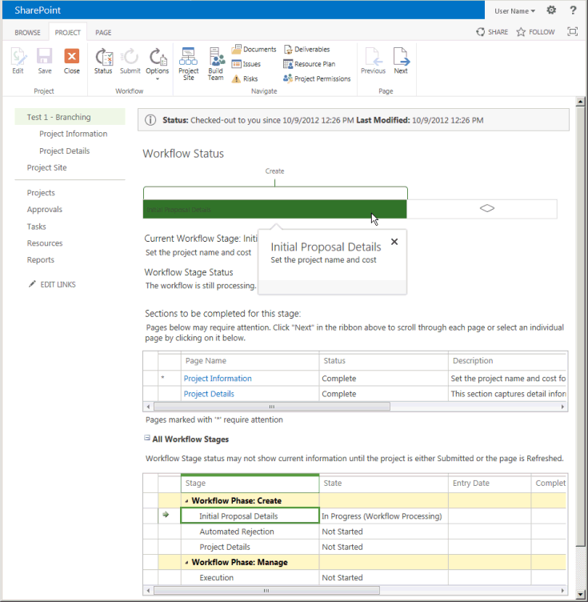

# 创建 Project Server 工作流以用于需求管理

本文介绍如何使用 SharePoint Designer 2013 创建简单的工作流。 您可以将工作流导出到 Visio 2013 以进行可视化和编辑, 或使用 Visio 2013 设计 project Server 2013 工作流, 并将设计导入到 SharePoint Designer 2013 中, 以便发布到 Project Web App。 有关 sharepoint 工作流平台和使用 Visio 2013 和 SharePoint Designer 2013 创建工作流的详细信息, 请参阅 sharepoint 2013 开发人员文档中的[sharepoint 2013 文章中的工作流](https://msdn.microsoft.com/library/jj163986%28office.15%29.aspx)。 
  
有关为工作流准备 Project Server 的信息, 请参阅[Start: Set up and configure SharePoint 2013 Workflow Manager](https://msdn.microsoft.com/library/jj163276%28office.15%29.aspx)。

## 创建常规工作流

使用以下步骤可通过使用 SharePoint Designer 2013 创建 Project Server 2013 工作流。 工作流旨在管理项目建议的需求。
  
有关详细步骤, 请参阅[创建分支工作流](#pj15_CreateWorkflowSPD_Detailed)部分。 
  
### 创建 Project Server 工作流 (常规过程)

1. 确定要求, 然后设计工作流。 将其组织到阶段和阶段, 并确定工作流将使用的自定义域。
    
2. 在 Project Web App 中, 创建工作流所需的实体:
    
    1. 查看现有工作流阶段;根据需要创建阶段。
        
    2. 创建工作流将使用的企业自定义域。 若要在工作流容器中可用, 自定义字段必须由工作流控制。
        
    3. 编辑或创建工作流阶段将用于收集项目信息的项目详细信息页面 (pdp)。 在此示例中, 阶段使用的是编辑的默认 pdp 以包含新的自定义域。
        
    4. 创建必要的工作流容器, 然后将每个工作流容器与正确的阶段相关联。
    
3. 在 SharePoint Designer 2013 中, 在**基于文本的设计器**中使用声明性语句构造工作流:
    
    > [!NOTE]
    > 您还可以切换到 SharePoint designer 2013 中的**可视化设计器**, 或从 Visio 2013 导入现有工作流。 按照以下步骤使用**基于文本的设计器**: 
    > 
    > 1. 打开 Project Web App 网站, 然后创建使用**SharePoint 2013 工作流-Project Server**工作流平台的网站工作流。 
    > 2. 添加工作流使用的阶段。
    > 3. 插入每个阶段中所需的工作流步骤、条件、操作和循环。
    > 4. 检查是否存在任何工作流错误, 并修复所发现的任何错误。
    > 5. Optional将视图切换到**可视设计器**, 或将工作流导出到 Visio 2013 文件中。 您可以修改 Visio 视图并保存对当前工作流所做的更改。 您可以编辑 Visio 文件并将其导入到 SharePoint Designer 2013 以创建其他工作流。
    > 6. 发布工作流。 发布后, 工作流会显示在 Project Web App 网站的工作流列表中。
    
4. 在 project Web App 中, 使用工作流对项目建议的需求管理:
    
    1. 创建使用工作流的企业项目模板 (EPT)。
        
    2. 在 "项目中心" 页上, 创建一个使用工作流的 EPT 的项目, 然后执行工作流容器。
        
    3. 全面测试工作流。
        
    4. 将工作流部署到生产服务器。

## 创建分支工作流

必须先将工作流管理器客户端1.0 服务配置为使用 project server 2013 工作流活动, 然后才能使用 SharePoint Designer 2013 创建 project server 工作流。 有关如何配置工作流管理器客户端1.0 的信息, 请参阅 sharepoint Server 2013 开发人员文档中的[sharepoint 2013 文章中的工作流](https://msdn.microsoft.com/library/jj163986%28office.15%29.aspx)。 
  
下面的详细过程包括在 "[创建常规工作流](#pj15_CreateWorkflowSPD_General)" 部分中执行的相同步骤。 
  
### 创建 Project Server 分支工作流 (详细过程)

#### 1. 规划和设计工作流。

Project Server 工作流可与需求管理流程中的多个阶段和阶段集成。 由于工作流可能很复杂, 因此您必须了解业务要求并仔细规划工作流。 对于一个简单的示例, 请设计一个使用项目建议的估计成本的分支工作流, 以确定是否接受建议。 如果估计成本大于 $25000 USD, 则拒绝建议;否则, 接受建议并创建项目。
    
由于您可以使用 Visio 2013 和 SharePoint Designer 2013 帮助设计和创建 project server 2013 的工作流, 因此您可以更轻松地使用 project server 2010 对工作流进行实验。 本文中的示例工作流设计与在 Project 2010 SDK 中[创建分支工作流一](https://msdn.microsoft.com/library/a02cafdc-d881-4271-b446-d8b2cd456a52%28Office.15%29.aspx)文中的示例相同。 您可以使用 project Web App 的测试实例在远程计算机上设计和创建测试工作流, 而无需直接在 project Server 2013 计算机上创建工作流。 
    
#### 2. 创建工作流所需的实体。

在 Project Web App 中, 查看可用的工作流阶段和阶段, 以及可用的企业自定义域。 如有必要, 请创建工作流所需的实体, 如以下步骤所示:
    
1. **工作流阶段**Project Web App 的默认安装包括 "创建"、"选择"、"规划"、"管理" 和 "已完成" 阶段。 对于分支工作流示例, 无需创建其他阶段。 
        
2. **企业自定义域**分支工作流需要一个受工作流控制的项目成本自定义字段。 工作流控制的自定义域的值在工作流使用的 PDP 中设置。 例如, 选择 "Project Web App" 页面右上角的 "**设置**" 图标, 选择 " **PWA 设置**", 然后选择 "**企业自定义域" 和 "查阅表格**"。
        
   为**项目**实体创建名为 "建议成本" 的自定义字段, 并选择 "**成本**" 类型。 有关说明, 请键入项目建议的估计成本。 在 "**行为**" 部分, 选择 "**由工作流控制的行为**"。
        
3. **项目详细信息页面**编辑或创建工作流阶段将使用的 pdp。 例如，执行下列步骤： 
        
    1. 选择 "服务器设置" 页上的 "**项目详细信息页面**", 然后选择**ProjectInformation** PDP。 
            
    2. 在功能区的 "**页面**" 选项卡上的 "**编辑**" 组中, 选择 "**编辑页面**"。
            
    3. 选择 "**基本信息**" web 部件右上角的向下箭头, 然后选择 "**编辑 web 部件**"。 或者, 在功能区的 " **WEB 部件**" 选项卡上的 "**属性**" 组中, 选择 " **WEB 部件属性**" 以显示编辑器部件。 
            
    4. 在编辑器部件的 "**显示的项目域**" 部分 (请参阅图 1) 中, 选择 "**修改**"。
            
    5. 添加 "**建议成本**" 自定义域, 将其移到 "选定的**项目域**" 列表中 "**所有者**" 字段的上方, 然后选择 **"确定"** (请参阅图 1)。
      
    6. 在编辑器部件中, 选择 **"确定**", 然后在功能区的 "**页面**" 选项卡上的 "**编辑**" 组中选择 "**停止编辑**"。 图2显示添加到项目信息 PDP 的 "**建议成本**" 自定义域。 

    **图1。在 PDP 中编辑 "项目域" web 部件**

    

    **图2。编辑的 PDP 包括 "建议成本" 自定义域**

    
  
4. **工作流容器**创建工作流的每个阶段所需的阶段。 在 "服务器设置" 页上, 选择 "**工作流容器**", 然后选择 "**新建工作流容器**"。 图3显示了 "添加工作流容器" 页面的一部分。
    
    **图3。在 Project Web App 中添加工作流容器**

    
  
    分支工作流示例使用表1中所示的四个阶段。 在 "添加工作流容器" 页面的 "**可见项目详细信息页面**" 部分的 "其他设置" (图3中未显示) 中, 值是可选的;它们提供了有关工作流状态页的详细信息。 例如, 由于初始建议详细信息 PDP 需要用户输入, 因此您可以选中 "**项目详细信息页需要引起注意**" 复选框, 然后添加特定说明 (如设置此 PDP 的项目名称和成本)。
    
    图4显示了 "工作流阶段" 页上完成的四个阶段。
    
    **表1。分支工作流的阶段**

    |名称|说明|提交说明|阶段|可见的 pdp|自定义字段|
    |:-----|:-----|:-----|:-----|:-----|:-----|
    |建议的初始详细信息    |设置项目名称和成本。    |将项目作为建议提交。    |创建    |项目信息    项目详细信息    |建议成本 (必需)    |
    |项目详细信息    |提供建议项目的详细信息。    |提交详细信息以继续执行项目。    |创建    |项目信息    项目详细信息    |建议成本 (只读)    |
    |自动拒绝    |根据提供的信息, 建议将被拒绝。    |   |创建    |项目信息    |建议成本 (只读)    |
    |操作    |接受建议, 并准备好进行项目管理。    |   |管理    |项目信息    项目详细信息    |建议成本 (只读)    |
   
    **图4。Project Web App 中的工作流容器的列表**

    
  
#### 3. 在基于文本的设计器中构造工作流。

在 SharePoint Designer 2013 中, 在基于文本的设计器中使用声明性语句构造工作流。 您可以在橙色插入行开始键入, 以获取工作流逻辑和步骤的上下文相关自动完成语句, 也可以使用功能区的 "**工作流**" 选项卡上的 "**插入**" 组中的控件插入逻辑和步骤。 
    
1. 在 SharePoint Designer 2013 的 Backstage 视图中, 选择 "**打开网站**"。 例如, 打开`https://ServerName/pwa`。 在**导航**窗格中, 选择 "**工作流**"。 然后, 在功能区的 "**工作流**" 选项卡上的 "**新建**" 组中, 选择 "**网站工作流**"。 对于此示例, 请将工作流命名为 "分支工作流"。 确保在 "**平台类型**" 下拉列表中选择了 " **SharePoint 2013 工作流-Project Server** " (参见图 5)。 
    
    **图5。创建 Project Server 网站工作流**

    
  
2. 选择 "**分支工作流**" 选项卡。然后, 在功能区的 "**工作流**" 选项卡上的 "**管理**" 组中的 "**视图**" 下拉列表中, 选择 "**基于文本的设计器**"。 若要显示带黄色闪烁的插入线的视图 (请参阅图 6), 请在视图中单击。
    
    **图6。对工作流使用基于文本的设计器视图**

    
  
3. 在**基于文本的设计器**视图中, 添加工作流使用的阶段。 在功能区的 "**工作流**" 选项卡上的 "**插入**" 组中, 在 "**创建**" 下的 "**暂存**" 下拉列表中, 选择 "**初始建议详细信息**"。
    
    同样, 将橙色插入线放在**舞台下面: 初始建议详细信息**框, 并添加工作流使用的其他阶段:**项目详细信息**、**自动拒绝**和**执行**(见图 7)。 
    
    **图7。将阶段添加到 SharePoint Designer 中的工作流**

    
  
4. 在每个阶段中添加工作流步骤和逻辑: 
    
    1. 在 "**初始建议详细信息**" 阶段, 将橙色插入行放置在舞台正文的顶部。 在功能区上的 "**插入**" 组中, 选择 "**操作**", 向下滚动到 " **project Web App 操作**", 然后选择 "**等待项目事件**"。 选择 "**此项目事件**", 然后选择 "事件: 在下拉列表中**提交项目时**"。 
    
    2. 在 "**初始建议详细信息**" 阶段的 "**转换到分段**" 部分, 插入 "**如果任何值等于值**"。 您可以开始键入语句或使用功能区上的 "**插入**" 组中的 "**条件**" 控件。 
    
    3. 选择第一个**值**控件, 然后选择 " **fx** " 以显示 "**定义工作流查找**" 对话框 (见图 8)。 在 "**数据源**" 下拉列表中, 选择 "**项目数据**"。 在 "**源中的字段**" 下拉列表中, 选择 "**建议成本**"。
    
       **图8。在工作流中定义查阅值**

       
  
    4. 完成`If`语句, 使其显示以下内容:**如果项目数据: 建议成本大于 25000**
    
       > [!NOTE]
       > 或者, 也可以创建工作流变量, 将变量设置为自定义字段值, 然后将变量与值进行比较。 例如, 从功能区上的 "**局部变量**" 下拉列表中, 创建一个名为 " **TotalCost** " (无空格) 的变量, 其类型为**Number**。 在 "**定义工作流查找**" 对话框中, 选择数据源的 "**工作流变量和参数**", 然后选择 "**变量: TotalCost** " 作为字段。 **if**语句随后将为:**如果变量: TotalCost 大于 25000**
  
    5. 将橙色插入线放置在`If`分支中, 然后使用**操作**控件在功能区上的 "**插入**" 组中插入 "**转到阶段**"。 选择 "**阶段**" 下拉控件并选择 "**自动拒绝**" 阶段。 
    
       同样, 在`Else`分支中, 插入 "**转到项目详细信息**" 语句。 图9显示了已完成的**初始建议详细信息**阶段。 
    
       **图9。"初始建议详细信息" 阶段的 "已完成" 逻辑**

       
  
    6. 在**自动拒绝**阶段, 除非您希望暂停工作流并在 PDP 中显示一些数据, 否则请将第一部分留空。 "**转到阶段**" 部分必须包含一个转换;由于拒绝之后没有其他任何阶段, 请键入语句的工作流结束。 
    
    7. 在 "**项目详细信息**" 阶段, 在 "转**至舞台**" 部分中添加 "转到执行"。 除非有要添加的其他数据, 或者您希望暂停工作流, 否则不需要等待提交的事件。 
    
    8. 在**执行**阶段中, 除非您希望暂停工作流, 否则请将 "暂存操作" 部分保留为空。 在 "**转换到分段**" 部分, 添加 "**转至工作流结束**"。
    
5. 在功能区上的 "**保存**" 组中, 选择 "**检查错误**" 以检查工作流错误 (请参阅图 10)。 修复所有错误, 然后选择 "**保存**"。
    
    **图10。在 SharePoint Designer 中检查工作流错误**

    
  
6. Optional在功能区上的 "**管理**" 组中的 "**视图**" 下拉菜单中, 选择 "**可视设计器**"。 在图11中, 视图缩小到 50%。
    
    您可以使用可视化设计器编辑工作流中的项目。 例如, 选择 "**如果任何值等于值**" 条件, 选择条件左下角的工具图标, 然后在 "**属性**" 对话框中选择 "**值**" 以显示比较条件。 
    
    **图11。对工作流使用可视化设计器**

    
  
    当工作流位于可视设计器视图中时, 若要将 Visio 2013 (.vsdx) 文件中的工作流另存为备份或以后使用, 则可以选择 "**导出到 Visio**"。
    
7. 发布工作流。 使用 SharePoint Designer 2013 将工作流发布到活动的 Project Web App 网站时, 工作流将注册到 SharePoint 网站或 Azure 中, 并在 Project Web app 中适用于新的 ept。

#### 4. 为工作流创建 EPT, 然后测试工作流。

在 project Web App 中, 为工作流创建 EPT, 然后通过创建项目建议来测试工作流:
    
1. 在 "PWA 设置" 页上, 选择 "**企业项目类型**", 然后创建一个名为 "测试分支工作流" 的 EPT。 清除 "将**新项目创建为 SharePoint 任务列表项目**" 复选框, 以便 Project Server 将维护由 EPT 创建的项目的 "完全控制"。 在 "**网站工作流关联**" 下拉列表中选择 "**分支工作流**", 然后在 "**新建项目页**" 下拉列表中选择 "**项目信息**" PDP, 作为工作流显示的第一个页面。 
    
    **图12。为工作流添加 EPT**

    
  
    > [!NOTE]
    > 企业项目类型表中的**sharepoint 任务列表项目**列中的**Yes**值是指一个 EPT, 它创建一个 SharePoint 任务列表, 其中任务列表在 project Web App 中可见, 但 SharePoint 保持对项目的控制. 有关将项目作为 SharePoint 任务列表进行管理的详细信息, 请参阅[Project Server 2013 体系结构](project-server-2013-architecture.md)。 
  
2. 打开 project Web App 中的 "项目" 页, 然后使用新的 EPT 创建一个项目 (见图 13)。 由于**测试分支工作流**与**分支工作流**相关联, 因此项目创建将在工作流的控制下启动。
    
    **图13。使用测试分支工作流创建项目 EPT**

    
  
3. 当工作流显示**项目信息**PDP 时, 将数据添加到项目字段中。 例如, 输入**建议成本**值为30000。 Project Server 的美国英语版本将字段更改为显示 "$30000" (见图 14)。
    
    **图14。使用已编辑的项目信息 PDP**

    
  
4. 在功能区的 "**项目**" 选项卡上的 "**项目**" 组中, 选择 "**保存**"。 project Server 将 PDP 中的数据添加到项目中, 然后显示 "工作流状态" 页 (参见图 15)。 若要查看工作流状态图表中的 "建议的初始详细信息" 阶段的完整说明, 请将指针悬停在工作流可视化关系图中的舞台上。
    
    "**所有工作流阶段**" 网格使用绿色箭头显示 "初始建议详细信息" 阶段正在等待输入。 这是因为工作流在初始建议详细信息阶段等待提交事件。 如果工作流没有等待提交事件, 则可以在**页面**组中选择 "**下一步**" 以前进到下一个 PDP。 
    
    **图15。在初始 "建议详细信息" 阶段使用 "工作流状态" 页**

    
  
    工作流可视化关系图以绿色的颜色显示当前阶段。 在 "**创建**" 阶段, "初始建议详细信息" 阶段是当前阶段。 
    
5. 在功能区上的 "**工作流**" 组中, 选择 "**提交**"。
    
    > [!TIP]
    > 如果 "**提交**" 控件已禁用, 请刷新页面。 
  
    如果**建议成本**值大于 $25000 USD, 则工作流将移动到自动拒绝阶段。 图16显示了再次选择 "**提交**" 时的自动拒绝阶段状态。 如果**建议成本**为 $25000 USD 或更低, 则工作流将移至 "项目详细信息" 阶段 (见图 17)。 
    
    **图16。在自动拒绝阶段完成工作流**

    
  
    图17显示了一个名为 "**测试 2-分支**" 的项目建议的另一个测试, 其中 "项目详细信息" 阶段是 "创建" 阶段中的当前阶段。 "管理" 阶段以浅蓝色显示, 表示该阶段尚未处于活动状态。
    
    **图17。如果成本低于 $25000, 工作流将继续到 "项目详细信息" 阶段**

    
  
6. 如果转到 "项目详细信息" 阶段, 则默认页面中没有要添加的其他数据。 再次选择 "**提交**" 以转到执行阶段 (参见图 18)。 
    
    **图18。工作流准备就绪, 可以在执行阶段中进行管理**

    
  
在 "项目详细信息" 阶段, 工作流不会等待提交事件。 如果项目详细信息 PDP 包含其他必填字段, 则 project Server 将一直等待, 直到您将数据添加到字段中, 然后再继续执行阶段。 如分支工作流中所定义, 执行阶段也不会等待提交事件。 在执行阶段中, 可以将项目编辑为项目经理或在功能区的 "**项目**" 选项卡中选择 "**关闭**"。 选择 "**关闭**" 时, 可以签入该项目并在稍后对其进行编辑或使项目保持签出状态。

**分支工作流**项目是仅有一个比较测试的简单示例。 工作流涉及创建阶段中的三个阶段和 "管理阶段的需求管理" 阶段中的一个阶段。 若要全面测试工作流, 应测试工作流的所有分支并使用极端和典型值来查看行为是否与预期相同。 

## 从 Visio 导入工作流

若要更改工作流, 您可以创建或修改工作流控制的自定义字段, 并创建或修改工作流阶段和阶段。 您可以使用 SharePoint Designer 2013 添加条件、操作、循环和阶段, 然后保存并重新发布工作流。 若要重用或保留工作流的备份, 可以将其导出到 Visio 2013 文件中。 
  
您还可以在 Visio 2013 中创建或编辑工作流, 并将该文件导入到 SharePoint Designer 2013 中, 以供 Project Web App 使用。 若要使用未修改的工作流, Project web app 实例必须包含与原始 Project Web app 实例中的工作流阶段属性相同。 有关使用 Visio 帮助创建工作流的详细信息, 请参阅[SharePoint Designer 2013 和 Visio 2013 中的工作流开发](https://msdn.microsoft.com/library/jj163272%28office.15%29.aspx)。
  
> [!NOTE]
> 将 Visio 2013 文件导入到 Project Web App 的其他实例时, 这些阶段将具有不同的阶段 guid, 即使阶段名称相同也是如此。 导入工作流后, 必须将 stage 和操作属性配置为使用特定于 Project Web App 实例的值。 
> 
> 如果在 visio 2013 中创建工作流, 则这些阶段和操作不具有特定于 project web app 实例的属性, 因为 Visio 不会连接 project web app。 当您将 SharePoint Designer 2013 与 Project Web App 连接, 创建工作流, 然后导入 .vsdx 文件时, 将覆盖活动工作流。 然后, 您必须配置 stage 和操作属性, 以匹配 SharePoint Designer 2013 从 Project Web App 获取的值。 
  
### 将工作流从 Visio 导入到 SharePoint Designer

1. 在 Visio 2013 中, 创建一个简单的工作流。 例如，执行下列步骤：
    
   1. 打开 Visio, 然后创建一个工作流。 选择新工作流的 "**类别**" 窗格, 选择 "**流程图**", 在 "**新建**" 窗格中选择 " **Microsoft SharePoint 2013 工作流**" 模板, 然后选择 "**创建**"。 将打开工作流, 其中包含一个名为**stage 1**的阶段形状。 工作流包含一个开始组件, 并将一个 Enter 形状和退出形状作为舞台形状的一部分。
    
      当您将鼠标悬停在 "舞台" 形状上并选择 "**属性**" 图标时, 所选内容将被禁用。 您可以在将工作流图表导入到 SharePoint Designer 2013 之后设置 stage 和 action 属性。 
    
      > [!NOTE]
      >  在流程图形状列表中, 唯一应使用的形状模具如下所示: 
      > - **操作-SharePoint 2013 工作流**
      > - **组件-SharePoint 2013 工作流**
      > - **条件-SharePoint 2013 工作流**
  
   2. 在 "**形状**" 窗格中, 选择 "**快速形状**", 然后拖动名为 "**如果任何值等于**舞台形状右侧的值" 的 "条件" 形状。 
    
   3. 在功能区的 "**主页**" 选项卡上, 选择 "**连接线**" 工具, 然后使用 "条件" 形状连接舞台上的 "退出" 形状 (请参阅图 19)。 
    
      **图19。将阶段形状与 Visio 工作流图表中的条件形状连接**

      
  
   4. 将两个 "更多" 舞台形状拖到 "条件" 形状的右侧。 这些形状被命名为第**2 阶段**和**第3阶段**。
    
   5. 使用 "**连接线**" 工具, 将 "条件" 形状的右侧连接到**第2阶段**的 "进入" 形状。 选择 "**指针**" 工具, 双击该连接以显示名称的 textbox, 然后将该连接命名为 "是"。
    
   6. 将 "条件" 形状的底部连接到**第3阶段**的 "进入" 形状。 使用 "**指针**" 工具右键单击该连接, 然后选择 "**否**"。 这两种方法都适用于将连接器命名为 **"是" 或 "** **否**"。
    
   7. 在 "**形状**" 窗格中, 选择 "**操作"-"SharePoint 2013 工作流**", 然后将 "**等待项目事件**" 操作拖到**第1阶段**的形状中间 (请参阅图 20)。 
    
      **图20。在 Visio 中完成工作流**

      
  
   8. 在功能区的 "**进程**" 选项卡上, 在 "**图表验证**" 组中, 选择 "**检查图表**"。 修复所有错误, 然后保存绘图。 例如, 将文件测试工作流命名为 "从 .vsdx"。
    
      有关修复工作流错误的信息, 请参阅[Visio 2013 中的 SharePoint Server 2013 工作流验证错误疑难解答](https://msdn.microsoft.com/library/jj163971%28v=office.15%29.aspx)。
    
2. 打开 "SharePoint Designer 2013", 然后打开您用于 "**分支工作流**" 示例的同一个 Project Web App 网站。 
    
3. 在**导航**窗格中选择 "**工作流**", 然后创建网站工作流 (在功能区的 "**工作流**" 选项卡上选择 "**网站工作流**")。 例如, 将工作流简单命名为 Visio 的简单工作流。
    
   在 "**创建网站工作流**" 对话框中, 确保 "平台类型" 为 " **SharePoint 2013 工作流-Project Server**"。 选择 "**创建**", SharePoint Designer 将为新工作流打开**基于文本的设计器**窗格。 
    
4. 在功能区的 "**工作流**" 选项卡上的 "**管理**" 组中, 选择 "**工作流设置**"。
    
5. 在功能区的 "**工作流设置**" 选项卡上的 "**管理**" 组中, 选择 "**从 visio 导入**", 然后从先前保存的 ".vsdx" 文件中导入**测试工作流**。 **Microsoft SharePoint Designer**对话框警告您要导入的关系图中不包含工作流属性, 并询问是否覆盖当前工作流。 选择 **"是"**;SharePoint designer 导入工作流图表, 生成形状的模具, 并显示包含导入的工作流的**可视化设计器**窗格。 
    
6. 设置工作流中每个阶段形状的属性。 例如, 第一个阶段形状被命名为**stage 1 (无效)**, 因为它不代表连接的 Project Web App 实例中的有效阶段。 当您在舞台上选择或悬停时, 可以选择位于舞台形状左下角的 "**属性**" 图标, 以显示 "**舞台属性**" 对话框 (见图 21)。 在 "**项目阶段**" 下拉列表中选择 "**初始建议详细信息**" 阶段, 然后选择 **"确定"**。 SharePoint Designer 重命名舞台。
    
   **图21。在 SharePoint Designer 中设置 stage 属性**

   
  
   对于第二个阶段, 将 "**项目阶段**" 属性设置为 "**自动拒绝**"。 对于第三个阶段, 将 "**项目阶段**" 属性设置为 "**执行**"。
    
7. 同样, 对于 "**等待项目事件**" 操作, 将 "**事件名称**" 属性设置为 "**事件: 提交项目时**"。
    
8. 同样, 设置 " **If any value = value** " 条件的属性。 例如, 将 "第一个**Value** " 属性设置为 "**项目数据: 建议成本**"。 将**Operator**属性设置为**小于**。 将第二个**Value**属性设置为5000。
    
9. 检查工作流的错误, 然后保存工作流。 如果没有任何错误, 则可以将视图更改为**基于文本的设计器**(请参阅图 22)。 
    
   **图22。在基于文本的设计器中查看导入的工作流**

   
  
10. 发布工作流。 如果保存工作流但不发布它, 则在创建企业项目类型时工作流将不可用。
    
11. 若要在 Project Web App 中测试从 Visio 导入的**简单工作流**, 请创建一个使用工作流的 EPT, 然后创建使用新的 EPT 的项目, 就像对**分支工作流**示例执行的操作一样。 但在这种情况下, 将拒绝低于 $5000 成本的项目。 
    
在本文中, 通过使用 SharePoint Designer 2013 直接设置工作流使用的阶段、条件和操作, 您可以创建并测试简单的分支工作流。 此外, 还为使用 Visio 2013 创建了一个更简单的分支工作流的关系图。 您已将 Visio 工作流图表导入到 SharePoint Designer 2013, 您可以在其中设置每个阶段、条件和操作与 Project Web App 的连接的属性。
  
Visio 2013 和 SharePoint Designer 结合在一起, 为设计人员、项目经理、工作流开发人员和测试人员提供了为 project Server 2013 和 project Online 的不同安装创建、共享和自定义工作流设计的便利方法。 对于需要对 SharePoint Designer 不提供的 Project Server 进行编程访问的工作流, 可以将 Visual Studio 2012 与客户端对象模型 (CSOM) 结合使用。
  
## 另请参阅

- [Project Server 2013 体系结构](project-server-2013-architecture.md)
- [开始: 设置和配置 SharePoint 2013 工作流管理器](https://msdn.microsoft.com/library/jj163276%28office.15%29.aspx)
- [了解如何在 SharePoint 2013 中打包和部署工作流](https://msdn.microsoft.com/library/jj819316%28office.15%29.aspx)
- [SharePoint 2013 中的工作流](https://msdn.microsoft.com/library/jj163986%28office.15%29.aspx)
- [SharePoint Designer 2013 和 Visio 2013 中的工作流开发](https://msdn.microsoft.com/library/jj163272%28office.15%29.aspx)
- [解决 Visio 2013 中的 SharePoint Server 2013 工作流验证错误](https://msdn.microsoft.com/library/jj163971%28v=office.15%29.aspx)
- [工作流和需求管理](https://msdn.microsoft.com/library/cf7433a3-a531-4467-ac0c-df0c5d6881ae%28Office.15%29.aspx)

