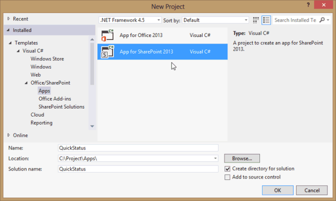
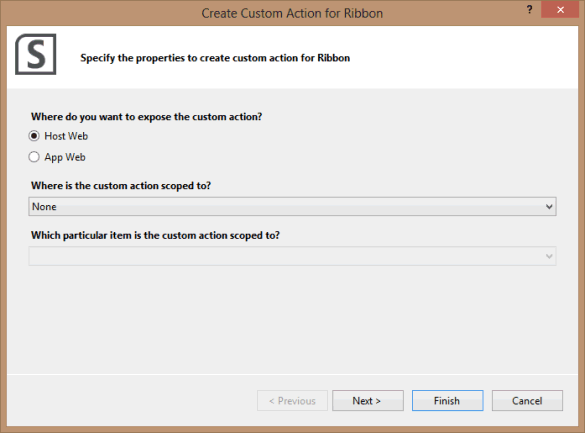
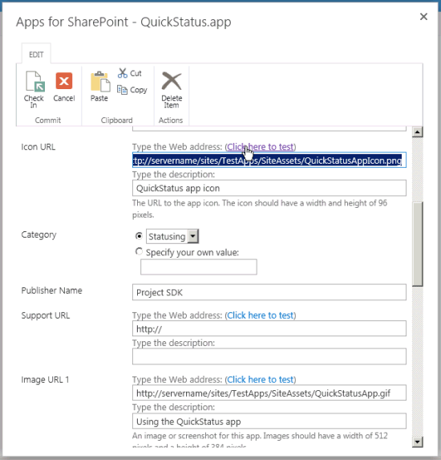

# <a name="create-a-sharepoint-hosted-project-server-add-in"></a>创建 SharePoint 托管的 Project Server 加载项

您可以创建 for Project Online （自动承载、 提供程序承载和 SharePoint 承载） 的应用程序的三种类型，SharePoint 承载的应用程序是最简单创建和部署。 SharePoint 承载的应用程序不需要 OAuth 身份验证和不使用 Azure 或需要的提供程序承载的资源的本地网站的维护。 在 Visual Studio 中的**SharePoint 2013 相关应用程序**模板是用于开发应用程序可以发布和销售的 Office 商店或部署到 SharePoint 上专用应用程序目录的一个方便框架。 
  
在项目中，状态是任务的其中团队成员可用于任务页 Project Web App 中提交分配，如工作的用于此任务工作周中每一天的小时数的状态的过程。 工作分配所有者 （通常项目经理） 可以批准或拒绝状态。 当状态为 approved 时，Project 会重新计算计划。 将**QuickStatus**应用程序显示分配的任务，其中用户可以快速更新的完成百分比和提交以供审批所选工作分配的状态。 虽然 Project Web App 中的任务页上有多个功能，将**QuickStatus**应用程序是提供简化的接口的示例。 
  
将**QuickStatus**应用程序是一个示例面向开发人员;它不是为在生产环境中使用。 主要用途是显示 for Project Online 中，无法创建一个完善的进展状况应用程序的应用程序开发的示例。 Statusing 的更好方法，请参阅[下一步骤](#pj15_StatusingApp_NextSteps)中的建议。
  
Statusing 的常规信息，请参阅[任务进度](https://support.office.com/article/Find-information-about-Project-Server-2013-8b08a414-15a7-4076-b2db-c90d0214ea7f?ui=en-US&rs=en-US&ad=US#BKMK_TaskProgress)。 有关 SharePoint 和 Project Server 开发加载项的详细信息，请参阅[SharePoint 加载项](http://msdn.microsoft.com/en-us/library/jj163230.aspx)。

<a name="pj15_StatusingApp_Prerequisites"> </a>

## <a name="prerequisites-for-creating-an-app-for-project-server-2013"></a>Project Server 2013 中创建的应用程序的先决条件

若要开发可以部署到 Project Online 或向 Project Server 2013 的本地安装的相对简单应用程序，可以使用 Napa，它提供一个联机开发环境的信息。 对于更复杂的应用程序，修改 Project Web App 功能区和更轻松调试在开发期间，您可以使用 Visual Studio 2012 或 Visual Studio 2013。 例如，与在本地安装，您可以手动检查草稿数据表的 Project Server 数据库中的更改。 本文介绍如何使用 Visual studio 创建的应用程序开发。
  
使用 Visual studio 创建的 Project Server 应用程序的开发有以下要求：
  
- 确保您已在本地开发计算机上安装最新的 Service Pack 和 Windows 更新。操作系统可以是 Windows 7、Windows 8、Windows Server 2008 或 Windows Server 2012。
    
- 您必须具有已 SharePoint Server 2013 和 Project Server 2013 安装，其中将计算机配置为应用程序隔离和 sideloading 的应用程序的计算机。 Sideloading 启用 Visual Studio 暂时安装应用程序进行调试。 您可以使用 SharePoint 和 Project Server 的本地安装。 有关详细信息，请参阅[设置 SharePoint 相关应用程序的本地开发环境](http://msdn.microsoft.com/en-us/library/fp179923%28Office.15%29.aspx)。
    
   > [!NOTE]
   > 在本地安装，独立的应用程序域配置*之前*创建企业应用程序目录。 
  
- 开发计算机可以是已安装 Visual Studio 2012 Office 开发人员工具的远程计算机。 确保安装了最新版本;请参阅*工具*部分中的[Office 和 SharePoint 相关应用程序下载](http://msdn.microsoft.com/en-us/office/apps/fp123627.aspx)。
    
- 验证 Project Web App 实例您将使用的开发和测试是在浏览器中访问。
    
有关使用联机工具的信息，请参阅[设置用于开发 Office 365 上的 SharePoint 相关应用程序的环境](http://msdn.microsoft.com/en-us/library/fp161179.aspx)。 使用在线工具的 Project server 构建的简单应用程序的演练，请参阅 EPMSource 博客系列，[构建您的第一个 Project Server 应用程序](http://epmsource.com/2012/11/20/building-your-first-project-server-app-part-zerothe-introduction/)。

<a name="pj15_StatusingApp_UsingVisualStudio"> </a>

## <a name="using-visual-studio-to-create-a-project-server-app"></a>使用 Visual Studio 创建的 Project Server 应用程序

Visual Studio 2012 office 开发人员工具包括可用于 Project Server 2013 的 SharePoint 应用程序模板。 创建应用程序解决方案时，此解决方案包括自定义代码的以下文件：
  
- **AppManifest.xml**包括应用程序标题、 权限请求范围和其他属性的设置。 过程 1 包括步骤使用清单设计器中设置的属性。 
    
- 页面文件夹中的**Default.aspx**是应用程序的主页。 步骤 2 演示如何添加对**QuickStatus**应用程序的 HTML5 内容。 
    
- 脚本文件夹中的**App.js**是主要的自定义 JavaScript 代码文件。 步骤 3 介绍**QuickStatus**应用程序的 JavaScript 代码。 
    
   如果添加商业如 jQuery 基于网格或日期选取器控件，则可以在 Default.aspx 文件中添加其他 JavaScript 文件的引用。
    
- **App.css**中内容的文件夹是自定义 CSS3 样式的主文件。 步骤 2 和步骤 3 包含有关对**QuickStatus**应用程序的级联样式表 (CSS) 样式。 可以在 Default.aspx 文件中添加其他 CSS 文件的引用。 
    
- **AppIcon.png**图像文件夹中是应用程序将显示在 Office 商店或应用程序目录中的 96 x 96 图标。 
    
修改 Project Web App 功能区，您可以添加功能区自定义操作。 [对 QuickStatus 应用程序的示例代码](#pj15_StatusingApp_Example)部分包括已修改 Default.aspx、 App.js、 App.css、 Elements.xml，和 AppManifest.xml 文件的完整代码。 
  
### <a name="procedure-1-to-create-an-app-project-in-visual-studio"></a>过程 1。 在 Visual Studio 中创建应用程序项目

1. 以管理员身份运行 Visual Studio 2012，然后选择开始页上的**新建项目**。 
    
2. 在**新建项目**对话框中，展开**模板**、 **Visual C#** 和**Office/SharePoint**节点，然后选择**应用程序**。 在顶部 （见图 1） 的中心窗格中，然后选择**SharePoint 2013 相关应用程序**中使用目标框架下拉列表中的默认 **.NET Framework 4.5** 。 
    
3. 在**名称**字段中，键入 QuickStatus，浏览到要保存应用程序，然后选择**确定**的位置。
    
   **图 1。创建项目 Visual Studio 中的服务器应用程序**

   
  
4. 在**新的 SharePoint 应用程序**对话框中，填写下列三个字段： 
    
   - 在顶部文本框中，键入希望显示 Project Web App 中应用程序的名称。 例如，键入快速状态更新。
    
   - 要用于调试的网站，键入 Project Web App 实例的 URL。 例如，键入`https://ServerName/ProjectServerName`（将_ServerName_和_ProjectServerName_替换您自己的值），然后选择**验证**。 如果运行正常，Visual Studio 将显示**成功连接**。 如果您收到一条错误消息，请确保 Project Web App 的 URL 正确以及为应用程序隔离和 sideloading 的应用程序配置了 Project Server 计算机。 有关详细信息，请参阅[创建 Project Server 2013 的应用程序的先决条件](#pj15_StatusingApp_Prerequisites)部分。 
    
   - 在**您希望如何承载 SharePoint 相关应用程序**下拉列表中，选择**SharePoint 承载**。
    
   > [!CAUTION]
   > 如果您错误地选择默认**提供程序承载**的项目类型，Visual Studio 解决方案中创建两个项目： **QuickStatus**项目和**QuickStatusWeb**项目。 如果您看到两个项目，则删除该解决方案，然后重新启动。 
  
5. 选择**确定**以创建**QuickStatus**解决方案、 **QuickStatus**项目和默认文件。 
    
6. 打开清单设计器视图 （例如，双击 AppManifest.xml 文件）。 在**常规**选项卡，**标题**文本框中应显示在步骤 4 中键入应用程序名称。 选择**权限**选项卡添加应用程序的以下权限请求 （见图 2）： 
    
   - 第一行的**权限请求**列表中，在**范围**列中下拉列表中选择**状态**。 在**权限**列中，选择**SubmitStatus**。
    
   - 添加的行其中**范围**是**多个项目**，则**读取****权限**。
    
   **图 2。设置状态应用程序的权限范围**

   
  
将**QuickStatus**应用程序允许 Project Web App 用户读取多个项目的该用户分配和更改工作分配完成百分比，请提交更新。 图 2 中下拉列表中显示的其他权限请求范围不需要此应用程序。 权限请求作用域是代表用户请求应用程序的权限。 如果用户在 Project Web App 中没有这些权限，应用程序不运行。 应用程序可以有多个权限请求作用域，包括有关其他 SharePoint 权限，但应具有的应用程序功能所需的最小。 以下是与 Project Server 权限请求作用域： 

- **企业资源**： 资源管理器权限，以读取或写入其他 Project Web App 用户的信息。
    
- **多个项目**： 读取或写入到多个项目，其中用户具有请求的权限。
    
- **Project Server**： 要求应用程序用户具有 Project Web app 的管理员权限。
    
- **报告**： 读取 Project Web App （需要 Project Web App 登录权限） 的**ProjectData** OData 服务。 
    
- **单个项目**： 读取或写入到用户请求的权限在其上一个项目。
    
- **Statusing**： 提交的工作分配状态的更新，如有效的时间百分比完成后，和新的工作分配。
    
- **工作流**： 具有工作流的提升权限如果用户具有的权限来运行 Project Server 工作流，然后运行应用程序。
    
有关 Project Server 2013 的权限请求作用域的详细信息，请参阅[Project 2013 中面向开发人员的更新](updates-for-developers-in-project-2013.md)和[SharePoint 2013 中的应用程序权限](http://msdn.microsoft.com/library/fp142383.aspx)中的*Project 应用程序*一节。


<a name="pj15_StatusingApp_HTML"> </a>

### <a name="creating-the-html-content-for-the-quickstatus-app"></a>创建 HTML 内容对 QuickStatus 应用程序

在开始编写代码的 HTML 内容之前，设计用户界面和 （图 3 显示了已完成页上的示例） 对 QuickStatus 应用程序的用户体验。 设计还可以包括交互的 HTML 代码 JavaScript 函数的分级显示。 常规信息，请参阅[SharePoint 2013 中的应用程序的 UX 设计](http://msdn.microsoft.com/library/fp179934.aspx)。
  
**图 3。QuickStatus 应用程序页的设计**


  
应用程序显示在顶部，这是 AppManifest.xml 中的**Title**元素的值的显示名称。 
  
默认情况下，页上使用 HTML5。 以下是**QuickStatus**应用程序页的正文中包含的主要 UI 对象的标准 HTML 元素： 
  
- **Form**元素包含所有其他用户界面元素。 
    
- **字段集**元素创建的容器和边框的工作分配; 表子**图例**元素提供一个标签的容器。 
    
- **表**元素包括标题和仅表格标题。 JavaScript 函数更改表标题，并添加将工作分配行。 
    
   > [!NOTE]
   > 若要方便地添加分页和排序，生产应用程序可能需要而不是表中使用商业基于 jQuery 网格控件。 
  
   表包含的项目名称、 复选框、 实际工时、 完整的剩余工时百分比，任务名称的列和工作分配的完成日期。 JavaScript 函数创建复选框和百分比的文本输入的字段完成每项任务。
    
- 在文本框中的**输入**元素设置 %完成所有所选工作分配。 
    
- **Button**元素提交状态更改。 
    
- **Button**元素刷新页面。 
    
- **Button**元素退出应用程序，并返回到 Project Web App 中的任务页。 
    
底部文本框和按钮元素是在**div**元素内，因此 CSS 可以方便地管理的位置和外观的 UI 对象。 JavaScript 函数添加一个段落，包含的成功结果的页面的底部或失败状态更新。 
  
### <a name="procedure-2-to-create-the-html-content"></a>步骤 2。 创建 HTML 内容

1. 在 Visual Studio 中，打开 Default.aspx 文件。
    
   该文件包含两个**asp: Content**元素： 将元素`ContentPlaceHolderID="PlaceHolderAdditionalPageHead"`页眉，并将元素内添加特性`ContentPlaceHolderID="PlaceHolderMain"`属性位于页面**body**元素。 
    
2. 在`<asp:Content ContentPlaceHolderID="PlaceHolderAdditionalPageHead" runat="server">`控件的页面页眉中，添加对 Project Server 计算机上的 PS.js 文件的引用。 用于测试和调试，您可以使用 PS.debug.js。 
    
   ```HTML
     <script type="text/javascript" src="/_layouts/15/ps.debug.js"></script>
   ```

   应用程序基础结构使用`/_layouts/15/`在 IIS 中的 SharePoint 网站的虚拟目录。 物理文件是`%ProgramFiles%\Common Files\Microsoft Shared\Web Server Extensions\15\TEMPLATE\LAYOUTS\PS.debug.js`。
    
   > [!NOTE]
   > 部署用于生产用途的应用程序之前，请删除`.debug`从的脚本引用以提高性能。 
  
3. 在`<asp:Content ContentPlaceHolderID="PlaceHolderMain" runat="server">`控制页面正文，删除生成的**div**元素，然后添加 UI 对象的 HTML 代码。 **表**元素包含仅标题行。 **任务名称**列中包含的复选框输入的控件。 由**onGetUserNameSuccess**回调的 App.js 文件中的**getUserInfo**函数替换**标题**元素的文本。 
    
    ```HTML
    <form>
        <fieldset>
        <legend>Select assigned tasks</legend>
        <table id="assignmentsTable">
            <caption id="tableCaption">Replace caption</caption>
            <thead>
            <tr id="headerRow">
                <th>Project name</th>
                <th><input type="checkbox" id="headercheckbox" checked="checked" />Task name</th>
                <th>Actual work</th>
                <th>% complete</th>
                <th>Remaining work</th>
                <th>Due date</th>
            </tr>
            </thead>
        </table>
        </fieldset>
        <div id="inputPercentComplete" >
        Set percent complete for all selected assignments, or leave this
        <br /> field blank and set percent complete for individual assignments: 
        <input type="text" name="percentComplete" id="pctComplete" size="4"  maxlength="4" />
        </div>
        <div id="submitResult">
        <p><button id="btnSubmitUpdate" type="button" class="bottomButtons" ></button></p>
        <p id="message"></p>
        </div>
        <div id="refreshPage">
        <p><button id="btnRefresh" type="button" class="bottomButtons" >Refresh</button></p>
        </div>
        <div id="exitPage">
        <p><button id="btnExit" type="button" class="bottomButtons" >Exit</button></p>
        </div>
    </form>
    ```

4. 在 App.css 文件中，添加位置和用户界面元素的外观的 CSS 代码。 将**QuickStatus**应用程序的完整 CSS 代码，请参阅[QuickStatus 应用程序的示例代码](#pj15_StatusingApp_Example)部分。 
    
步骤 3 添加 JavaScript 函数读取分配和创建的表格行，以及更改和更新工作分配的完成百分比。 实际步骤多迭代开发应用程序，其中您另外创建的 HTML 代码一些、 添加和测试相关的样式和 JavaScript 函数修改或添加更多的 HTML 代码，然后重复该过程。

<a name="pj15_StatusingApp_JavaScript"> </a>

### <a name="creating-the-javascript-functions-for-the-quickstatus-app"></a>创建对 QuickStatus 应用程序的 JavaScript 函数

SharePoint 应用程序的 Visual Studio 模板包括的 App.js 文件，其中包含默认初始化代码获取 SharePoint 客户端上下文和演示基本获取和设置的应用程序页上的操作。 SharePoint 客户端 SP.js 库的 JavaScript 命名空间为**SP**。 Project Server 应用程序使用 PS.js 库，因为应用程序将使用**PS**命名空间获取客户端上下文和 JSOM 访问 Project server。 
  
将**QuickStatus**应用程序中的 JavaScript 函数包括： 
  
- 文档对象模型 (DOM) 实例化时，将运行文档**准备**事件处理程序。 **准备好**的事件处理程序执行以下四个步骤操作： 
    
    1. Project Server JSOM 和**pwaWeb**全局变量初始化与客户端上下文**projContext**全局变量。 
        
    2. 调用**getUserInfo**函数初始化**projUser**全局变量。 
        
    3. 调用**getAssignments**函数，其获取指定用户的工作分配数据。 
        
    4. 绑定单击事件处理程序向表头复选框，和表格的每一行中的复选框。 在用户选中或清除任何表中的复选框时，click 事件处理程序管理复选框的**选中**属性。 
    
- 如果**getAssignments**函数运行成功，则调用**onGetAssignmentsSuccess**函数。 函数每个工作分配，表中插入一行初始化 HTML 控件中的每一行，然后初始化底部按钮属性。 
    
- **更新**按钮的**onClick**事件处理程序调用**updateAssignments**函数。 函数获取完成百分比值应用于每个选定的工作分配;如果百分比完整文本框为空，函数获取或百分比的每个选定的工作分配完成表中。 **UpdateAssignments**函数然后保存提交状态更新和写入一条消息有关结果页的底部。 
    
### <a name="procedure-3-to-create-the-javascript-functions"></a>步骤 3。 若要创建 JavaScript 函数

1. 在 Visual Studio 中，打开 App.js 文件，然后删除文件中的所有内容。
    
2. 添加全局变量和文档**准备**事件处理程序。 使用 jQuery 函数可访问的**document**对象。 
    
   表头复选框 click 事件处理程序设置行复选框的选中的状态。 如果选择了所有行复选框或都清除，click 事件处理程序行复选框设置标题复选框的选中的状态。 Click 事件处理程序还设置底部的为空字符串页上的结果消息。
    
   ```js
    var projContext;
    var pwaWeb;
    var projUser;
    // This code runs when the DOM is ready and creates a ProjectContext object.
    // The ProjectContext object is required to use the JSOM for Project Server.
    $(document).ready(function () {
        projContext = PS.ProjectContext.get_current();
        pwaWeb = projContext.get_web();
        getUserInfo();
        getAssignments();
        // Bind a click event handler to the table header check box, which sets the row check boxes
        // to the checked state of the header check box, and sets the results message to an empty string.
        $('#headercheckbox').live('click', function (event) {
            $('input:checkbox:not(#headercheckbox)').attr('checked', this.checked);
            $get("message").innerText = "";
        });
        // Bind a click event handler to the row check boxes. If any row check box is cleared, clear
        // the header check box. If all of the row check boxes are selected, select the header check box.
        $('input:checkbox:not(#headercheckbox)').live('click', function (event) {
            var isChecked = true;
            $('input:checkbox:not(#headercheckbox)').each(function () {
                if (this.checked == false) isChecked = false;
                $get("message").innerText = "";
            });
            $("#headercheckbox").attr('checked', isChecked);
        });
    });
   ```

3. 添加**getUserInfo**函数，如果查询成功调用**onGetUserNameSuccess** 。 **OnGetUserNameSuccess**函数替换为表格标题包含用户名**标题**段落的内容。 
    
   ```js
        // Get information about the current user.
        function getUserInfo() {
            projUser = pwaWeb.get_currentUser();
            projContext.load(projUser);
            projContext.executeQueryAsync(onGetUserNameSuccess,
                // Anonymous function to execute if getUserInfo fails.
                function (sender, args) {
                    alert('Failed to get user name. Error: ' + args.get_message());
            });
        } 
        // This function is executed if the getUserInfo call is successful.
        function onGetUserNameSuccess() {
            var prefaceInfo = 'Assignments for ' + projUser.get_title();
            $('#tableCaption').text(prefaceInfo);
        }
   ```

4. 添加**getAssignments**函数，调用**onGetAssignmentsSuccess** （请参阅第 5 步） 如果工作分配查询成功。 返回指定的字段将查询限制**包括**选项。 
    
   ```js
    // Get the collection of assignments for the current user.
    function getAssignments() {
        assignments = PS.EnterpriseResource.getSelf(projContext).get_assignments();
        // Register the request that you want to run on the server. The optional "Include" parameter 
        // requests only the specified properties for each assignment in the collection.
        projContext.load(assignments,
            'Include(Project, Name, ActualWork, ActualWorkMilliseconds, PercentComplete, RemainingWork, Finish, Task)');
        // Run the request on the server.
        projContext.executeQueryAsync(onGetAssignmentsSuccess,
            // Anonymous function to execute if getAssignments fails.
            function (sender, args) {
                alert('Failed to get assignments. Error: ' + args.get_message());
            });
    }
   ```

5. 添加**onGetAssignmentsSuccess**函数，向表中添加每个工作分配行。 **PrevProjName**变量用于确定行是否为不同的项目。 以粗体; 如果是这样，显示项目名称如果没有，项目名称设置为空字符串。 
    
   > [!NOTE]
   > JSOM 不包括 CSOM 包含，如**ActualWorkTimeSpan** **TimeSpan**属性。 而是 JSOM 用于毫秒，如[PS.数属性StatusAssignment.actualWorkMilliseconds](http://msdn.microsoft.com/library/736bce1e-f734-0efe-6c5f-e0e891ab00ef%28Office.15%29.aspx)属性。 若要获取的属性的方法是**获取\_actualWorkMilliseconds**，其返回一个整数值。 > **Get_actualWork**方法返回一个字符串，例如"3 h"。 您无法在**QuickStatus**应用程序中，使用其中任何一个值，但不同显示。 分配查询包括两个属性，因此您可以在调试过程中测试值。 如果您删除**actualWork**变量，您还可以在分配查询删除**ActualWork**属性。 
  
   最后， **onGetAssignmentsSuccess**函数初始化**更新**按钮，并使用**刷新**按钮的 click 事件处理程序。 **更新**按钮的文本值也无法 HTML 代码中设置。 
    
   ```js
        // Get the enumerator, iterate through the assignment collection, 
        // and add each assignment to the table.
        function onGetAssignmentsSuccess(sender, args) {
            if (assignments.get_count() > 0) {
                var assignmentsEnumerator = assignments.getEnumerator();
                var projName = "";
                var prevProjName = "3D2A8045-4920-4B31-B3E7-9D0C5195FC70"; // Any unique name.
                var taskNum = 0;
                var chkTask = "";
                var txtPctComplete = "";
                // Constants for creating input controls in the table.
                var INPUTCHK = '<input type="checkbox" class="chkTask" checked="checked" id="chk';
                var LBLCHK = '<label for="chk';
                var INPUTTXT = '<input type="text" size="4"  maxlength="4" class="txtPctComplete" id="txt';
                while (assignmentsEnumerator.moveNext()) {
                    var statusAssignment = assignmentsEnumerator.get_current();
                    projName = statusAssignment.get_project().get_name();
                    // Get an integer, such as 3600000.
                    var actualWorkMilliseconds = statusAssignment.get_actualWorkMilliseconds(); 
                    // Get a string, such as "1h". Not used here.
                    var actualWork = statusAssignment.get_actualWork();
                    if (projName === prevProjName) {
                        projName = "";
                    }
                    prevProjName = statusAssignment.get_project().get_name();
                    // Create a row for the assignment information.
                    var row = assignmentsTable.insertRow();
                    taskNum++;
                    // Create an HTML string with a check box and task name label, for example:
                    // <input type="checkbox" class="chkTask" checked="checked" id="chk1" /> <label for="chk1">Task 1</label>
                    chkTask = INPUTCHK + taskNum + '" /> ' + LBLCHK + taskNum + '">' 
                        + statusAssignment.get_name() + '</label>';
                    txtPctComplete = INPUTTXT + taskNum + '" />';
                    // Insert cells for the assignment properties.
                    row.insertCell().innerHTML = '<strong>' + projName + '</strong>';
                    row.insertCell().innerHTML = chkTask;
                    row.insertCell().innerText = actualWorkMilliseconds / 3600000 + 'h';
                    row.insertCell().innerHTML = txtPctComplete;
                    row.insertCell().innerText = statusAssignment.get_remainingWork();
                    row.insertCell().innerText = statusAssignment.get_finish();
                    // Initialize the percent complete cell.
                    $get("txt" + taskNum).innerText = statusAssignment.get_percentComplete() + '%'
                }
            }
            else {
                $('p#message').attr('style', 'color: #0f3fdb');     // Blue text.
                $get("message").innerText = projUser.get_title() + ' has no assignments'
            }
            // Initialize the button properties.
            $get("btnSubmitUpdate").onclick = function() { updateAssignments(); };
            $get("btnSubmitUpdate").innerText = 'Update';
            $get('btnRefresh').onclick = function () { window.location.reload(true); };
            $get('btnExit').onclick = function () { exitToPwa(); };
        }
   ```

6. 添加**updateAssignments**单击**更新**按钮的事件处理程序。 当用户更改任务的完成百分比的值，或在**完成百分比**文本框中添加一个值时，则无法若干种格式，例如"60"、"60%，"或"60%"中输入的值。 **GetNumericValue**方法返回的数值的输入的文本。 
    
   > [!NOTE]
   > 在应用程序有适用于生产使用中，输入的值的数值信息应包括字段验证和其他错误检查。 
  
   **UpdateAssignments**示例包括一些基本错误检查，并显示在页面底部的**邮件**段落中的信息 — 如果更新查询是成功，如果没有输入的错误或更新查询的红色是绿色失败。 
    
   使用**submitAllStatusUpdates**方法之前，应用程序必须更新通过保存到服务器使用**PS.StatusAssignmentCollection.update**方法。 
    
   ```js
        // Update all checked assignments. If the bottom percent complete field is blank,
        // use the value in the % complete field of each selected row in the table.
        function updateAssignments() {
            // Get percent complete from the bottom text box.
            var pctCompleteMain = getNumericValue($('#pctComplete').val()).trim();
            var pctComplete = pctCompleteMain;
            var assignmentsEnumerator = assignments.getEnumerator();
            var taskNum = 0;
            var taskRow = "";
            var indexPercent = "";
            var doSubmit = true;
            while (assignmentsEnumerator.moveNext()) {
                var pctCompleteRow = "";
                taskRow = "chk" + ++taskNum;
                if ($get(taskRow).checked) {
                    var statusAssignment = assignmentsEnumerator.get_current();
                    if (pctCompleteMain === "") {
                        // Get percent complete from the text box field in the table row.
                        pctCompleteRow = getNumericValue($('#txt' + taskNum).val());
                        pctComplete = pctCompleteRow;
                    }
                    // If both percent complete fields are empty, show an error.
                    if (pctCompleteMain === "" && pctCompleteRow === "") {
                        $('p#message').attr('style', 'color: #e11500');     // Red text.
                        $get("message").innerHTML =
                            '<b>Error:</b> Both <i>Percent complete</i> fields are empty, in row '
                            + taskNum
                            + ' and in the bottom textbox.<br/>One of those fields must have a valid percent.'
                            + '<p>Please refresh the page and try again.</p>';
                        doSubmit = false;
                        taskNum = 0;
                        break;
                    }
                    if (doSubmit) statusAssignment.set_percentComplete(pctComplete);
                }
            } 
            // Save and submit the assignment updates.
            if (doSubmit) {
                assignments.update();
                assignments.submitAllStatusUpdates();
                projContext.executeQueryAsync(function (source, args) {
                    $('p#message').attr('style', 'color: #0faa0d');     // Green text.
                    $get("message").innerText = 'Assignments have been updated.';
                }, function (source, args) {
                    $('p#message').attr('style', 'color: #e11500');     // Red text.
                    $get("message").innerText = 'Error updating assignments: ' + args.get_message();
                });
            }
        }
        // Get the numeric part for percent complete, from a string. For example, with "20 %", return "20".
        function getNumericValue(pctComplete) {
            pctComplete = pctComplete.trim();
            pctComplete = pctComplete.replace(/ /g, "");    // Remove interior spaces.
            indexPercent = pctComplete.indexOf('%', 0);
            if (indexPercent > -1) pctComplete = pctComplete.substring(0, indexPercent);
            return pctComplete;
        }
   ```

7. 添加**exitToPwa**函数， **SPHostUrl**查询字符串参数用于承载 Project Web App 网站的 URL。 若要导航回任务页，请将`"/Tasks.aspx"`的 url。 例如，将**spHostUrl**变量设置为`https://ServerName/ProjectServerName/Tasks.aspx`。
    
   **GetQueryStringParameter**函数拆分**QuickStatus**页的 URL，以提取并在 URL 选项中返回指定的参数。 以下是**文档的示例。URL** **QuickStatus**文档 （所有一个行上） 的值： 
    
   ```HTML
    https://app-ef98082fa37e3c.servername.officeapps.selfhost.corp.microsoft.com/pwa/
        QuickStatus/Pages/Default.aspx
        ?SPHostUrl=https%3A%2F%2Fsphvm%2D85178%2Fpwa
        &SPLanguage=en%2DUS
        &SPClientTag=1
        &SPProductNumber=15%2E0%2E4420%2E1022
        &SPAppWebUrl=https%3A%2F%2Fapp%2Def98082fa37e3c%2Eservername
            %2Eofficeapps%2Eselfhost%2Ecorp%2Emicrosoft%2Ecom%2Fpwa%2FQuickStatus
   ```

   对于以前的 URL， **getQueryStringParameter**函数返回**SPHostUrl**查询字符串值， `https://ServerName/pwa`。 
    
   ```js
        // Exit the QuickStatus page and go back to the Tasks page in Project Web App.
        function exitToPwa() {
            // Get the SharePoint host URL, which is the top page of PWA, and add the Tasks page.
            var spHostUrl = decodeURIComponent(getQueryStringParameter('SPHostUrl'))
                            + "/Tasks.aspx";
            // Set the top window for the QuickStatus IFrame to the Tasks page.
            window.top.location.href = spHostUrl;
        }
        // Get a specified query string parameter from the {StandardTokens} URL option string.
        function getQueryStringParameter(urlParameterKey) {
            var docUrl = document.URL;
            var params = docUrl.split('?')[1].split('&');
            for (var i = 0; i < params.length; i++) {
                var theParam = params[i].split('=');
                if (theParam[0] == urlParameterKey)
                    return decodeURIComponent(theParam[1]);
            }
        }
   ```

如果您此时发布**QuickStatus**应用程序，并将其添加到 Project Web App，可以从网站内容页上，运行应用程序，但它并不方便地对用户可用。 为了帮助用户查找和运行应用程序，您可以向功能区任务页上为其添加一个按钮。 过程 4 演示如何添加功能区自定义操作。 

<a name="pj15_StatusingApp_ribbon"> </a>

### <a name="adding-a-ribbon-custom-action"></a>添加功能区自定义操作

功能区选项卡、 群组和控件的 Project Web App 指定在 pwaribbon.xml 文件中，其安装在`[Program Files]\Common Files\Microsoft Shared\Web Server Extensions\15\TEMPLATE\FEATURES\PWARibbon\listtemplates`目录运行 Project Server 的计算机上。 为了帮助的 Project Web App 功能区设计自定义操作，Project 2013 SDK 下载包括 pwaribbon.xml 的副本。 
  
Project Web App 的任务页上，具体取决于 Project Web App 实例是否使用单输入模式，使用户能够输入时间表和任务状态的值使用不同的功能区定义。 如果您有 Project Web app 的管理权限，以确定输入模式中，选择**PWA 的设置**页面的右上角的下拉列表设置菜单中。 在 PWA 的设置页上，选择**时间表设置值和默认值**，然后查看页面底部**单输入模式**复选框。 
  
时单输入模式处于关闭状态，由 pwaribbon.xml 中的我的工作区域定义功能区任务页上： 
  
```XML
   <!-- REGION My Work Ribbon-->
   <CustomAction
      Id="Ribbon.ContextualTabs.MyWork"
      . . .
```

打开单输入模式时，由 pwaribbon.xml 中的关联模式区域定义任务页功能区： 
  
```XML
   <!-- REGION Tied Mode Ribbon-->
   <CustomAction
      Id="Ribbon.ContextualTabs.TiedMode"
      . . .
```

虽然组和每个区域中的控件类似，绑定模式的控件可以非绑定模式调用比的相同控件不同的功能。 过程 4 演示如何添加对**QuickStatus**应用程序按钮控件时单输入模式处于关闭状态 （**单输入模式**复选框已清除）。 
  
> [!NOTE]
> 有关将自定义操作添加到功能区或菜单中的 SharePoint 应用程序的常规信息，请参阅[创建自定义操作，以部署 SharePoint 相关应用程序](http://msdn.microsoft.com/en-us/library/jj163954.aspx)。 
  
### <a name="procedure-4-to-add-a-ribbon-custom-action-to-the-tasks-page"></a>步骤 4。 将功能区自定义操作添加到任务页

1. 检查 Project Web App 中任务页上的功能区。 选择功能区上的**任务**选项卡，并计划如何对其进行修改。 有七个组，例如**提交**、**任务**和**时间段**。 **提交**组具有两个控件、**保存**按钮和**发送状态**下拉菜单。 您可以在组中的任意位置添加控件、**任务**选项卡中的任意位置添加具有一个新的控件的组或添加具有自定义组和控件的另一个功能区选项卡。 本示例中，我们将第三个按钮添加到**提交**组，其中按钮调用**QuickStatus**应用程序的 URL。 
    
2. 在 Visual Studio 中的**解决方案资源管理器**窗格中，右键单击**QuickStatus**项目，然后添加新项。 在**添加新项**对话框中，选择**功能区自定义操作**（参见图 4）。 例如，自定义操作 RibbonQuickStatusAction，命名，然后选择**添加**。
    
   **图 4。添加功能区自定义操作**

   
  
3. **创建自定义操作功能区**向导的第一页，则保持选中**主机 Web**选项，选择**无**为自定义操作范围下拉列表中，然后选择**下一步**（参见图 5）。 下拉列表中的项目中的相关性到 SharePoint 上，而不是 Project Server。 我们将替换大部分自定义操作生成的 XML，以便它适用于 Project Server。 
    
   **图 5。指定功能区自定义操作的属性**

   
  
4. 在**功能区的创建自定义操作**向导的下一页上，保留所有设置的默认值，然后选择**完成时间**（参见图 6）。 Visual Studio 创建**RibbonQuickStatusAction**文件夹，其中包含一个 Elements.xml 文件。 
    
   **图 6。指定一个按钮控件的设置**

   
  
5. 修改功能区自定义操作的 Elements.xml 文件中的默认生成代码。 以下是默认 XML 代码：
    
   ```XML
    <?xml version="1.0" encoding="utf-8"?>
    <Elements xmlns="http://schemas.microsoft.com/sharepoint/">
        <CustomAction Id="21ea3aaf-79e5-4aac-9479-8eef14b4d9df.RibbonQuickStatusAction"
                    Location="CommandUI.Ribbon"
                    Sequence="10001"
                    Title="Invoke &apos;RibbonQuickStatusAction&apos; action">
        <CommandUIExtension>
            <!-- 
            Update the UI definitions below with the controls and the command actions
            that you want to enable for the custom action.
            -->
            <CommandUIDefinitions>
            <CommandUIDefinition Location="Ribbon.ListItem.Actions.Controls._children">
                <Button Id="Ribbon.ListItem.Actions.RibbonQuickStatusActionButton"
                        Alt="Request RibbonQuickStatusAction"
                        Sequence="100"
                        Command="Invoke_RibbonQuickStatusActionButtonRequest"
                        LabelText="Request RibbonQuickStatusAction"
                        TemplateAlias="o1"
                        Image32by32="_layouts/15/images/placeholder32x32.png"
                        Image16by16="_layouts/15/images/placeholder16x16.png" />
            </CommandUIDefinition>
            </CommandUIDefinitions>
            <CommandUIHandlers>
            <CommandUIHandler Command="Invoke_RibbonQuickStatusActionButtonRequest"
                                CommandAction="~appWebUrl/Pages/Default.aspx"/>
            </CommandUIHandlers>
        </CommandUIExtension >
        </CustomAction>
    </Elements>
   ```

   1. 在**CustomAction**元素中，删除**Sequence**属性并将**Title**属性。 
    
   2. 若要将控件添加到**提交**组中，查找中的第一个组`Ribbon.ContextualTabs.MyWork.Home.Groups`在 pwaribbon.xml 文件中，即开始的元素的集合`<Group Id="Ribbon.ContextualTabs.MyWork.Home.Page" Command="PageGroup" Sequence="10" Title="$Resources:pwafeatures,PAGE_PDP_CM_SUBMIT"`。 将子控件添加到**提交**组，下面的代码，请演示的 Elements.xml 文件中的正确**CommandUIDefinition**元素的**Location**属性： 
    
      ```XML
        <CommandUIDefinitions>
          <CommandUIDefinition Location="Ribbon.ContextualTabs.MyWork.Home.Page.Controls._children">
             . . .
          </CommandUIDefinition>
        </CommandUIDefinitions>
      ```

   3. 更改子**Button**元素的属性值，如下所示： 
    
       ```XML
            <Button Id="Ribbon.ContextualTabs.MyWork.Home.Page.QuickStatus"
                    Alt="Quick Status app"
                    Sequence="30"
                    Command="Invoke_QuickStatus"
                    LabelText="Quick Status"
                    TemplateAlias="o1"
                    Image16by16="_layouts/15/1033/images/ps16x16.png" 
                    Image16by16Left="-80"
                    Image16by16Top="-144"
                    Image32by32="_layouts/15/1033/images/ps32x32.png" 
                    Image32by32Left="-32"
                    Image32by32Top="-288" 
                    ToolTipTitle="QuickStatus"
                    ToolTipDescription="Run the QuickStatus app" />
       ```

       - 若要使按钮的组中的第三个控件， **Sequence**属性可以是任何数字大于`Sequence="20"`现有**发送状态**控件 （这是在 pwaribbon.xml **FlyoutAnchor**元素） 的值。 按照惯例，群组和控件的序列号是`10, 20, 30, …`，这样的元素插入在中间位置。
    
       - **Command**属性指定运行**CommandUIHandler**元素中的命令 （请参阅以下步骤 5.d）。 您可以简化使其更易于下一步开发人员的命令名称。 例如`Command="Invoke_QuickStatus"`是更容易阅读比`Command="Invoke_RibbonQuickStatusActionButtonRequest"`。
    
       - 图像属性指定 16 x 16 像素的图标和按钮控件的 32 x 32 像素图标。 在默认 Elements.xml 文件中，`Image32by32="_layouts/15/images/placeholder32x32.png"`指定橙色点。 您可以从安装中的图像映射文件 （ps16x16.png 和 ps32x32.png） 提取图标`[Program Files]\Common Files\Microsoft Shared\Web Server Extensions\15\TEMPLATE\LAYOUTS\1033\IMAGES`目录运行 Project Server 的计算机上。 例如，32 x 32 像素的图标已从左侧和第十个行的图标，第二列为关闭从 ps32x32.png 图像映射的顶部 (顶部图标是第九个结束后行; 9 行 x 32 像素/行 = 288 像素为单位)。 
    
       - 若要显示按钮控件工具提示，请添加**ToolTipTitle**属性和**ToolTipDescription**属性。 
    
    4. 更改**CommandUIHandler**元素的属性。 例如，确保**命令**属性匹配**Button**元素的**命令**属性值。 对于**commandaction 触发**属性，`~appWebUrl`是一个占位符**QuickStatus**网页的 url。 **{StandardTokens}** 标记的功能区按钮在调用时将**QuickStatus**应用程序，由 URL 选项，包括**SPHostUrl**、 **SPLanguage**、 **SPClientTag**、 **SPProductNumber**和**SPAppWebUrl 替换**.
    
        ```XML
            <CommandUIHandlers>
                <CommandUIHandler Command="Invoke_QuickStatus"
                                  CommandAction="~appWebUrl/Pages/Default.aspx?{StandardTokens}"/>
            </CommandUIHandlers>
        ```

6. 在**解决方案资源管理器**中，打开**Feature1.feature**设计器中，并将从**解决方案中的项目**窗格的**RibbonQuickStatusAction**项目移动到**功能中的项目**窗格。 然后，您可以打开**Package.package**设计器中，如果**RibbonQuickStatusAction**项将**程序包中的项目**窗格中。 
    
开发应用程序和添加功能区按钮时，您通常会测试应用程序和调试 JavaScript 代码中设置断点。 当您按**F5**开始进行调试时，Visual Studio 编译应用程序，将其部署到网站中的**QuickStatus**项目的**Site URL**属性指定并显示一个页面，询问您是否信任应用程序。 当您将继续，然后退出**QuickStatus**应用程序时，它将返回到 Project Web App 中的任务页。 

> [!NOTE]
> 图 7 所示，在功能区的**任务**选项卡上**快速状态**按钮被禁用。 许多调试使用 Visual Studio 部署后，继续调试或部署相同的测试服务器上的已发布应用程序时，可以阻止自定义功能区控件。 要启用按钮，删除**RibbonQuickStatusAction**项在 Visual Studio 中，并创建新的功能区操作具有不同的名称和 id。 如果，不能解决问题，请尝试从 Project Web App 测试实例中，删除应用程序，然后重新创建应用程序使用不同的应用程序 id。 
  
**图 7。查看禁用快速状态按钮的工具提示**


  
5 的过程演示如何部署和安装**QuickStatus**应用程序。 过程 6 中测试应用程序在安装了之后显示一些额外的步骤。 

<a name="pj15_StatusingApp_Deploying"> </a>

## <a name="deploying-the-quickstatus-app"></a>部署 QuickStatus 应用程序

有几种方法可以将应用程序部署到的 SharePoint web 应用程序，如 Project Web App。 您使用的部署将取决于是否要将应用程序发布到专用 SharePoint 目录或公共 Office 商店，以及是否安装了 SharePoint 内部部署或是 online 租户。 5 的过程演示如何将**QuickStatus**应用程序部署到专用应用程序目录中的本地安装。 有关详细信息，请参阅[安装和管理 SharePoint 2013 相关应用程序](http://technet.microsoft.com/library/fp161232.aspx)和[发布 SharePoint 相关应用程序](http://msdn.microsoft.com/library/jj164070.aspx)
  
> [!NOTE]
> 向 SharePoint 目录添加应用程序需要 SharePoint 管理员权限。 
  
### <a name="procedure-5-to-deploy-the-quickstatus-app"></a>步骤 5。 部署 QuickStatus 应用程序

1. 在 Visual Studio 中，保存所有文件，然后右键单击**解决方案资源管理器**中的**QuickStatus**项目并选择**发布**。
    
2. 由于**QuickStatus**应用程序是 SharePoint 承载，有很少选项用于发布 （见图 8）。 在**发布 Office 和 SharePoint 的应用程序**对话框中，选择**完成**。
    
   **图 8。发布 QuickStatus 应用程序**

   
  
3. 复制从 QuickStatus.app 文件`~\QuickStatus\bin\Debug\app.publish\1.0.0.0`目录到本地计算机上的方便目录 （或 SharePoint 计算机的本地安装）。 
    
4. 在 SharePoint 管理中心内，在快速启动中选择**应用程序**，然后选择**管理应用程序目录**。
    
5. 如果应用程序目录不存在，请按照[管理 SharePoint 2013 中应用程序目录](http://technet.microsoft.com/library/fp161234.aspx)中的*配置 web 应用程序的应用程序目录网站*部分创建应用程序目录网站集。
    
   如果应用程序目录存在，导航到管理应用程序目录页上的网站 URL。 例如，在下列步骤中，应用程序目录网站是`http://ServerName/sites/TestApps`。
    
6. 在应用程序目录页上，在快速启动中选择**SharePoint 相关应用程序**。 在应用程序 SharePoint 页功能区的**文件**选项卡上选择**上载文档**。
    
7. **添加文档**对话框中，浏览 QuickStatus.app 文件和添加注释的版本，然后选择**确定**。
    
8. 添加应用程序后，您还可以添加应用程序说明、 图标和其他信息的本地信息。 在**SharePoint-QuickStatus.app 相关应用程序**对话框中，添加您想要显示的 SharePoint 网站集的应用程序的信息。 例如，添加以下信息： 
    
   1. **简短说明**字段： 类型快速状态测试应用程序。
    
   2. **说明**字段： 类型测试应用程序更新多个项目中任务的完成百分比。
    
   3. **图标 URL**字段： 向应用程序目录网站资产中添加应用程序图标 96 x 96 像素图像。 例如，导航到`http://ServerName/sites/TestApps`、 中**设置**下拉列表菜单中选择**网站内容**、 选择**网站资产**，然后添加 quickStatusApp.png 图像。 右键单击**quickStatusApp**项目，选择**属性**，然后在**属性**对话框中复制的**地址 (URL)** 值。 例如，复制`http://ServerName/sites/TestApps/SiteAssets/QuickStatusApp.png`，然后将值粘贴**图标 URL** web 地址字段中。 为图标，如 （如图 9)，键入说明键入 QuickStatus 应用程序图标。 测试 URL 有效。
    
      **图 9。添加对 QuickStatus 应用程序的图标 URL**

      
  
   4. **Category**字段： 选择现有类别，或指定您自己的值。 例如，键入进展状况。
    
      > [!NOTE]
      > 名为**Statusing**的类别是仅出于测试目的。 **项目管理**的 Project Server 应用程序典型类别。 
  
   5. **Publisher 名称**字段： 键入发行者的名称。 本示例中，键入 Project SDK。
    
   6. **启用**字段： 若要使应用程序到 Project Web App 网站管理员安装可见，请选中**启用**复选框。 
    
   7. 其他字段是可选的。 例如，您可以添加的支持 URL 和应用程序详细信息页的多个帮助图像。 图 9 中的**图像 URL 1**字段包含的 URL 的应用程序屏幕截图和屏幕截图的说明。 
    
   8. 在**SharePoint-QuickStatus.app 相关应用程序**对话框中，选择**保存**。 图 9 中应用程序中的**快速状态更新**项目的 SharePoint 库已签出，以供编辑，以此类推对话框框功能区的**编辑**选项卡**签入**以完成该过程, 选择 （参见图 10）。 
    
      **图 10。将 QuickStatus 应用程序添加到应用程序 SharePoint 库中。**

      
  
9. Project Web App 中的**设置**下拉列表菜单，选择**添加应用程序**。 在您的应用程序页上，在快速启动中，选择**来自您的组织**，，然后选择**快速状态更新**应用程序的**应用程序详细信息**。 图 11 显示的应用程序图标、 屏幕截图，与您在上一步中添加其他信息的详细信息页。 
    
   **图 11。使用 Project Web App 中的快速的状态更新的详细信息页**

   
  
10. 在快速状态更新的详细信息页上，选择**添加**。 Project Web App 显示一个对话框，列出 QuickStatus 应用程序可执行 （参见图 12） 的操作。 从 AppManifest.xml 文件中的**会在 AppPermissionRequest**元素派生的操作列表。 
    
    **图 12。验证您信任快速状态应用程序**

    
  
11. 在**您信任快速状态更新**对话框中，选择**信任它**。 应用程序添加到 Project Web App 网站内容页 （见图 13）。
    
    **图 13。在网站内容页上查看快速状态应用程序**

    
  
在网站内容页中，您可以选择运行应用程序的**快速状态更新**图标。

> [!NOTE]
> 在网站内容页上提供有关应用程序的信息的其他命令，选择包含的**快速状态更新**名称和省略号 （...） 的区域。您可以查看关于页上的应用程序、 查看应用程序详细信息页包含有关应用程序错误的信息、 查看应用程序权限页中，或删除 Project Web App 的应用程序。 
  
在 Project Web App 中的任务页上 （见图 14），应在功能区上启用**QuickStatus**按钮。 如果禁用**快速状态**按钮，则尝试为图 7 所述的注释中的操作。 

**图 14。从任务选项卡启动 QuickStatus 应用程序**


  
过程 6 演示某些测试，以便将 QuickStatus 应用程序。

<a name="pj15_StatusingApp_Testing"> </a>

## <a name="testing-the-quickstatus-app"></a>测试 QuickStatus 应用程序

在测试安装的 Project Server 部署到生产服务器或 Project online 生产租户的应用程序之前，应测试用户可能尝试将**QuickStatus**应用程序中的每个操作。 测试安装，可以更改和删除的用户分配，而不影响实际的项目。 测试还应涉及多个用户拥有不同的权限，如管理员、 项目经理和团队成员集。 彻底测试可以发现应在应用程序中，所做的未在开发过程中测试明显的更改。 过程 6 列出了几项测试**QuickStatus**应用程序，但不包括详尽系列测试。 
  
### <a name="procedure-6-to-test-the-quickstatus-app"></a>步骤 6。 测试 QuickStatus 应用程序

1. 用户没有分配在其上运行**QuickStatus**应用程序。 应用程序应显示在页上，例如，**用户名具有没有工作分配**的底部蓝色消息。
    
   选择**更新**，并对**已更新分配**绿色的消息更改。
    
   > [!NOTE]
   > 应更改的应用程序行为，以便没有分配时禁用**更新**按钮。 
  
2. 运行应用程序用户其中几个不同的项目中有多个工作分配，并且不完整一些工作分配。 通知应用程序的外观并执行操作，如下所示 （请参阅图 15）：
    
   1. **OnGetAssignmentsSuccess**函数在当前用户的每个工作分配的表中创建一个行。 项目名称仅执行一次，显示在加粗字体的每个项目中的第一个工作分配。 
    
   2. 清除**任务名称**列标题中的复选框。 表格标题单击事件处理程序清除的任务行中的所有其他复选框。 
    
   3. 选择的所有任务。 Click 事件处理程序的每一行确定是否选择了所有行，，如果跟随，则选择**任务名称**列标题。 
    
   4. 同样，清除所有复选框，然后选择一个具有一些剩余工时的分配。 如图 15 显示首要任务 T1 具有剩余工时完成的 20%。
    
   5. 在**设置完成百分比**文本框中，键入 80，，然后选择**更新**。 页面底部应该显示绿色消息，**分配进行了更新**。
    
      **图 15。更新 QuickStatus 应用程序中的工作分配**

      
  
3. 选择**刷新**（参见图 16）。 同样，选择的所有任务并首要任务显示 80%完成。 
    
      **图 16。刷新快速状态更新页**

      
  
4. 清除所有复选框，然后选择另一项任务。 例如，选择**从 PWA 的新任务**。 将**设置完成百分比**文本框中保留为空，删除所选任务的**完成百分比**列中的所有文本，然后选择**更新**。 因为这两个文本框为空，该应用程序显示红色的错误消息 （见图 17）。
    
      **图 17。测试错误消息**

      
  
5. 更新在上一任务完成后，80%，然后选择**退出**。 **ExitToPwa**函数更改为 SharePoint 主机应用程序中的任务页上的浏览器窗口的位置 (即，将 URL 更改为https://ServerName/pwa/Tasks.aspx)。 图 18 显示， **T1**任务和**从 PWA 的新任务**任务显示 80%完成。 
    
      **图 18。Project Web App 中验证的任务更新**

      
  
6. 更新的状态显示在 Project Professional 2013 之前，必须提交供审批，然后批准项目经理所做的更改。
    
测试中发现其他应所做的改进的可用性将**QuickStatus**应用程序中的多项更改。 例如：

- 应该有其他错误检查和验证的文本框值。 目前，用户可以输入非数字值或完成百分比，请为负值这会导致友好的错误消息。 例如，负值，错误消息是**更新分配时出错： PJClientCallableException: StatusingSetDataValueInvalid**。
    
- 空文本框的错误消息可以列出的项目和任务中，除了的行号。
    
- 成功消息可能包括更新; 任务列表或者，如果**updateAssignments**函数运行成功，无法执行自动页面刷新并显示不同的颜色和加粗字体中的更新的任务或百分比。 
    
- 若要避免非常大的表，应为表中的工作分配限制为少于 100%完成的任务。 或者，添加一个选项以显示所有任务。 此外可以使用基于 jQuery 网格而不是一个表，其中您可轻松实施筛选和网格解决此问题分页。
    
- 将**QuickStatus**应用程序不提交状态，因为功能区的**任务**选项卡上的**快速状态**图标更有逻辑将为**任务**组中的第一个图标，而不是**提交**组中的最后一个图标。 
    
- 这是由于**onGetAssignmentsSuccess**函数初始化**btnSubmitUpdate**按钮文本，而其他按钮的文本值的 HTML 格式的初始化，该页仍保留在时**getAssignments**部分初始化状态运行函数。 页上的按钮将显示的文本值已初始化 HTML 格式的更具一致性。 
    
最重要的是，应在生产应用程序中修订**QuickStatus**应用程序使用，其中更改 %完成的工作分配的方法。 有关详细信息，请参阅[下一步](#pj15_StatusingApp_NextSteps)部分。 

<a name="pj15_StatusingApp_Example"> </a>

## <a name="example-code-for-the-quickstatus-app"></a>将 QuickStatus 应用程序的示例代码

### <a name="defaultaspx-file"></a>Default.aspx 文件

下面的代码位于`Pages\Default.aspx` **QuickStatus**项目文件： 
  
```HTML
    <%-- The following lines are ASP.NET directives needed when using SharePoint components --%>
    <%@ Page Inherits="Microsoft.SharePoint.WebPartPages.WebPartPage, Microsoft.SharePoint, Version=15.0.0.0, 
    Culture=neutral, PublicKeyToken=71e9bce111e9429c" MasterPageFile="~masterurl/default.master" Language="C#" %>
    <%@ Register TagPrefix="Utilities" Namespace="Microsoft.SharePoint.Utilities" Assembly="Microsoft.SharePoint, Version=15.0.0.0, 
    Culture=neutral, PublicKeyToken=71e9bce111e9429c" %>
    <%@ Register TagPrefix="WebPartPages" Namespace="Microsoft.SharePoint.WebPartPages" Assembly="Microsoft.SharePoint, Version=15.0.0.0, 
    Culture=neutral, PublicKeyToken=71e9bce111e9429c" %>
    <%@ Register TagPrefix="SharePoint" Namespace="Microsoft.SharePoint.WebControls" Assembly="Microsoft.SharePoint, Version=15.0.0.0, 
    Culture=neutral, PublicKeyToken=71e9bce111e9429c" %>
    <%-- The markup and script in the following Content element will be placed in the <head> of the page.
        For production deployment, change the .debug.js JavaScript references to .js. --%>
    <asp:Content ContentPlaceHolderID="PlaceHolderAdditionalPageHead" runat="server">
    <script type="text/javascript" src="../Scripts/jquery-1.7.1.min.js"></script>
    <script type="text/javascript" src="/_layouts/15/sp.runtime.debug.js"></script>
    <script type="text/javascript" src="/_layouts/15/sp.debug.js"></script>
    <script type="text/javascript" src="/_layouts/15/ps.debug.js"></script>
    <!-- CSS styles -->
    <link rel="Stylesheet" type="text/css" href="../Content/App.css" />
    <!-- Add your JavaScript to the following file -->
    <script type="text/javascript" src="../Scripts/App.js"></script>
    </asp:Content>
    <%-- The markup and script in the following Content element will be placed in the <body> of the page --%>
    <asp:Content ContentPlaceHolderID="PlaceHolderMain" runat="server">
    <form>
        <fieldset>
        <legend>Select assigned tasks</legend>
        <table id="assignmentsTable">
            <caption id="tableCaption">Replace caption</caption>
            <thead>
            <tr id="headerRow">
                <th>Project name</th>
                <th><input type="checkbox" id="headercheckbox" checked="checked" />Task name</th>
                <th>Actual work</th>
                <th>% complete</th>
                <th>Remaining work</th>
                <th>Due date</th>
            </tr>
            </thead>
        </table>
        </fieldset>
        <div id="inputPercentComplete" >
        Set percent complete for all selected assignments, or leave this
        <br /> field blank and set percent complete for individual assignments: 
        <input type="text" name="percentComplete" id="pctComplete" size="4"  maxlength="4" />
        </div>
        <div id="submitResult">
        <p><button id="btnSubmitUpdate" type="button" class="bottomButtons" ></button></p>
        <p id="message"></p>
        </div>
        <div id="refreshPage">
        <p><button id="btnRefresh" type="button" class="bottomButtons" >Refresh</button></p>
        </div>
    <div id="exitPage">
        <p><button id="btnExit" type="button" class="bottomButtons" >Exit</button></p>
    </div>
    </form>
    </asp:Content>
```

<br/>

### <a name="appjs-file"></a>App.js 文件

下面的代码位于`Scripts\App.js` **QuickStatus**项目文件： 
  
```js
    var projContext;
    var pwaWeb;
    var projUser;
    // This code runs when the DOM is ready and creates a ProjectContext object.
    // The ProjectContext object is required to use the JSOM for Project Server.
    $(document).ready(function () {
        projContext = PS.ProjectContext.get_current();
        pwaWeb = projContext.get_web();
        getUserInfo();
        getAssignments();
        // Bind a click event handler to the table header check box, which sets the row check boxes
        // to the selected state of the header check box, and sets the results message to an empty string.
        $('#headercheckbox').live('click', function (event) {
            $('input:checkbox:not(#headercheckbox)').attr('checked', this.checked);
            $get("message").innerText = "";
        });
        // Bind a click event handler to the row check boxes. If any row check box is cleared, clear
        // the header check box. If all of the row check boxes are selected, select the header check box.
        $('input:checkbox:not(#headercheckbox)').live('click', function (event) {
            var isChecked = true;
            $('input:checkbox:not(#headercheckbox)').each(function () {
                if (this.checked == false) isChecked = false;
                $get("message").innerText = "";
            });
            $("#headercheckbox").attr('checked', isChecked);
        });
    });
    // Get information about the current user.
    function getUserInfo() {
        projUser = pwaWeb.get_currentUser();
        projContext.load(projUser);
        projContext.executeQueryAsync(onGetUserNameSuccess,
            // Anonymous function to execute if getUserInfo fails.
            function (sender, args) {
                alert('Failed to get user name. Error: ' + args.get_message());
        });
    }
    // This function is executed if the getUserInfo call is successful.
    // Replace the contents of the 'caption' paragraph with the project user name.
    function onGetUserNameSuccess() {
        var prefaceInfo = 'Assignments for ' + projUser.get_title();
        $('#tableCaption').text(prefaceInfo);
    }
    // Get the collection of assignments for the current user.
    function getAssignments() {
        assignments = PS.EnterpriseResource.getSelf(projContext).get_assignments();
        // Register the request that you want to run on the server. The optional "Include" parameter 
        // requests only the specified properties for each assignment in the collection.
        projContext.load(assignments,
            'Include(Project, Name, ActualWork, ActualWorkMilliseconds, PercentComplete, RemainingWork, Finish, Task)');
        // Run the request on the server.
        projContext.executeQueryAsync(onGetAssignmentsSuccess,
            // Anonymous function to execute if getAssignments fails.
            function (sender, args) {
                alert('Failed to get assignments. Error: ' + args.get_message());
            });
    }
    // Get the enumerator, iterate through the assignment collection, 
    // and add each assignment to the table.
    function onGetAssignmentsSuccess(sender, args) {
        if (assignments.get_count() > 0) {
            var assignmentsEnumerator = assignments.getEnumerator();
            var projName = "";
            var prevProjName = "3D2A8045-4920-4B31-B3E7-9D0C5195FC70"; // Any unique name.
            var taskNum = 0;
            var chkTask = "";
            var txtPctComplete = "";
            // Constants for creating input controls in the table.
            var INPUTCHK = '<input type="checkbox" class="chkTask" checked="checked" id="chk';
            var LBLCHK = '<label for="chk';
            var INPUTTXT = '<input type="text" size="4"  maxlength="4" class="txtPctComplete" id="txt';
            while (assignmentsEnumerator.moveNext()) {
                var statusAssignment = assignmentsEnumerator.get_current();
                projName = statusAssignment.get_project().get_name();
                // Get an integer value for the number of milliseconds of actual work, such as 3600000.
                var actualWorkMilliseconds = statusAssignment.get_actualWorkMilliseconds();
                // Get a string value for the assignment actual work, such as "1h". Not used here.
                var actualWork = statusAssignment.get_actualWork();                         
                if (projName === prevProjName) {
                    projName = "";
                }
                prevProjName = statusAssignment.get_project().get_name();
                // Create a row for the assignment information.
                var row = assignmentsTable.insertRow();
                taskNum++;
                // Create an HTML string with a check box and task name label, for example:
                //     <input type="checkbox" class="chkTask" checked="checked" id="chk1" /> 
                //     <label for="chk1">Task 1</label>
                chkTask = INPUTCHK + taskNum + '" /> ' + LBLCHK + taskNum + '">'
                    + statusAssignment.get_name() + '</label>';
                txtPctComplete = INPUTTXT + taskNum + '" />';
                // Insert cells for the assignment properties.
                row.insertCell().innerHTML = '<strong>' + projName + '</strong>';
                row.insertCell().innerHTML = chkTask;
                row.insertCell().innerText = actualWorkMilliseconds / 3600000 + 'h';
                row.insertCell().innerHTML = txtPctComplete;
                row.insertCell().innerText = statusAssignment.get_remainingWork();
                row.insertCell().innerText = statusAssignment.get_finish();
                // Initialize the percent complete cell.
                $get("txt" + taskNum).innerText = statusAssignment.get_percentComplete() + '%'
            }
        }
        else {
            $('p#message').attr('style', 'color: #0f3fdb');     // Blue text.
            $get("message").innerText = projUser.get_title() + ' has no assignments'
        }
        // Initialize the button properties.
        $get("btnSubmitUpdate").onclick = function() { updateAssignments(); };
        $get("btnSubmitUpdate").innerText = 'Update';
        $get('btnRefresh').onclick = function () { window.location.reload(true); };
        $get('btnExit').onclick = function () { exitToPwa(); };
    }
    // Update all selected assignments. If the bottom percent complete field is blank,
    // use the value in the % complete field of each selected row in the table.
    function updateAssignments() {
        // Get percent complete from the bottom text box.
        var pctCompleteMain = getNumericValue($('#pctComplete').val()).trim();
        var pctComplete = pctCompleteMain;
        var assignmentsEnumerator = assignments.getEnumerator();
        var taskNum = 0;
        var taskRow = "";
        var indexPercent = "";
        var doSubmit = true;
        while (assignmentsEnumerator.moveNext()) {
            var pctCompleteRow = "";
            taskRow = "chk" + ++taskNum;
            if ($get(taskRow).checked) {
                var statusAssignment = assignmentsEnumerator.get_current();
                if (pctCompleteMain === "") {
                    // Get percent complete from the text box field in the table row.
                    pctCompleteRow = getNumericValue($('#txt' + taskNum).val());
                    pctComplete = pctCompleteRow;
                }
                // If both percent complete fields are empty, show an error.
                if (pctCompleteMain === "" && pctCompleteRow === "") {
                    $('p#message').attr('style', 'color: #e11500');     // Red text.
                    $get("message").innerHTML =
                        '<b>Error:</b> Both <i>Percent complete</i> fields are empty, in row '
                        + taskNum
                        + ' and in the bottom textbox.<br/>One of those fields must have a valid percent.'
                        + '<p>Please refresh the page and try again.</p>';
                    doSubmit = false;
                    taskNum = 0;
                    break;
                }
                if (doSubmit) statusAssignment.set_percentComplete(pctComplete);
            }
        } 
        // Save and submit the assignment updates.
        if (doSubmit) {
            assignments.update();
            assignments.submitAllStatusUpdates();
            projContext.executeQueryAsync(function (source, args) {
                $('p#message').attr('style', 'color: #0faa0d');     // Green text.
                $get("message").innerText = 'Assignments have been updated.';
            }, function (source, args) {
                $('p#message').attr('style', 'color: #e11500');     // Red text.
                $get("message").innerText = 'Error updating assignments: ' + args.get_message();
            });
        }
    }
    // Get the numeric part for percent complete, from a string. 
    // For example, with "20 %", return "20".
    function getNumericValue(pctComplete) {
        pctComplete = pctComplete.trim();
        pctComplete = pctComplete.replace(/ /g, "");    // Remove interior spaces.
        indexPercent = pctComplete.indexOf('%', 0);
        if (indexPercent > -1) pctComplete = pctComplete.substring(0, indexPercent);
        return pctComplete;
    }
    // Exit the QuickStatus page and go back to the Tasks page in Project Web App.
    function exitToPwa() {
        // Get the SharePoint host URL, which is the top page of PWA, and add the Tasks page.
        var spHostUrl = decodeURIComponent(getQueryStringParameter('SPHostUrl'))
                        + "/Tasks.aspx";
        // Set the top window for the QuickStatus IFrame to the Tasks page.
        window.top.location.href = spHostUrl;
    }
    // Get a specified query string parameter from the {StandardTokens} URL option string.
    function getQueryStringParameter(urlParameterKey) {
        var docUrl = document.URL;
        var params = docUrl.split('?')[1].split('&');
        for (var i = 0; i < params.length; i++) {
            var theParam = params[i].split('=');
            if (theParam[0] == urlParameterKey)
                return decodeURIComponent(theParam[1]);
        }
    }
```

<br/>

### <a name="appcss-file"></a>App.css 文件

下面的 CSS 代码位于`Content\App.css` **QuickStatus**项目文件： 
  
```css
    /* Custom styles for the QuickStatus app. */
    /*============= Table elements ========================================*/
    table {
        width: 90%;
    }
    caption {
        font-size: 16px;
        padding-bottom: 5px;
        font-weight: bold;
        color: gray;
    }
    table th {
        background-color: gray;
        color: white;
    }
    table td, th {
        width: auto;
        text-align: left;
        padding: 2px;
        border: solid 1px whitesmoke;
        color: gray;
    }
    /*=== Class for check boxes added to rows 
    */
    .chkTask {
        width: 12px;
        height: 12px;
        color: gray;
    }
    /*========== DIV id for the Percent Complete text box ================*/
    #inputPercentComplete {
        position: fixed;
        top: auto;
        height: auto;
        padding-top: 20px;
        margin-left: 30px;
    }
    /*========== DIV id for the Submit Result button ====================*/
    #submitResult {
        position: fixed;
        top: auto;
        height: auto;
        padding-top: 60px;
    }
    /*========== DIV id for the Refresh Page button ====================*/
    #refreshPage {
        position: fixed;
        top: auto;
        height: auto;
        padding-top: 60px;
        margin-left: 120px;
    }
    /*========== DIV id for the Exit Page button ====================*/
    #exitPage {
        position: fixed;
        top: auto;
        height: auto;
        padding-top: 60px;
        margin-left: 240px;
    }
    /*========== Class for the buttons at the bottom of the page =======*/
    .bottomButtons {
        color: gray;
        font-weight: bold; 
        font-size: 12px; 
        border-color: darkgreen;
        border-width: thin;
    }
```

<br/>

### <a name="elementsxml-file-for-the-ribbon"></a>功能区的 Elements.xml 文件

下面的 XML 定义中，在功能区上的**任务**选项卡上的添加按钮位于`RibbonQuickStatusAction\Elements.xml` **QuickStatus**项目文件： 
  
```XML
    <?xml version="1.0" encoding="utf-8"?>
    <Elements xmlns="http://schemas.microsoft.com/sharepoint/">
    <CustomAction Id="21ea3aaf-79e5-4aac-9479-8eef14b4d9df.RibbonQuickStatusAction"
                    Location="CommandUI.Ribbon">
        <CommandUIExtension>
        <!-- 
        Add a button that invokes the QuickStatus app. The Quick Status button is displayed as  
        the third control in the Page group (the group title is "Submit").
        -->
        <CommandUIDefinitions>
            <CommandUIDefinition Location="Ribbon.ContextualTabs.MyWork.Home.Page.Controls._children">
            <Button Id="Ribbon.ContextualTabs.MyWork.Home.Page.QuickStatus"
                    Alt="Quick Status app"
                    Sequence="30"
                    Command="Invokae_QuickStatus"
                    LabelText="Quick Status"
                    TemplateAlias="o1"
                    Image16by16="_layouts/15/1033/images/ps16x16.png" 
                    Image16by16Left="-80"
                    Image16by16Top="-144"
                    Image32by32="_layouts/15/1033/images/ps32x32.png" 
                    Image32by32Left="-32"
                    Image32by32Top="-288" 
                    ToolTipTitle="Quick Status"
                    ToolTipDescription="Run the QuickStatus app" />
            </CommandUIDefinition>
        </CommandUIDefinitions>
        <CommandUIHandlers>
            <CommandUIHandler Command="Invoke_QuickStatus"
                            CommandAction="~appWebUrl/Pages/Default.aspx?{StandardTokens}"/>
        </CommandUIHandlers>
        </CommandUIExtension >
    </CustomAction>
    </Elements>
```

<br/>

### <a name="appmanifestxml-file"></a>AppManifest.xml 文件

以下是**QuickStatus**项目，其中包括两个的权限请求作用域所需的更新多个项目中的应用程序用户的工作分配状态的应用程序清单的 XML: 
  
```XML
    <?xml version="1.0" encoding="utf-8" ?>
    <!--Created:cb85b80c-f585-40ff-8bfc-12ff4d0e34a9-->
    <App xmlns="http://schemas.microsoft.com/sharepoint/2012/app/manifest"
        Name="QuickStatus"
        ProductID="{bbc497e7-1221-4d7b-a0ae-141a99546008}"
        Version="1.0.0.0"
        SharePointMinVersion="15.0.0.0"
    >
    <Properties>
        <Title>Quick Status Update</Title>
        <StartPage>~appWebUrl/Pages/Default.aspx?{StandardTokens}</StartPage>
    </Properties>
    <AppPrincipal>
        <Internal />
    </AppPrincipal>
    <AppPermissionRequests>
        <AppPermissionRequest Scope="http://sharepoint/projectserver/statusing" Right="SubmitStatus" />
        <AppPermissionRequest Scope="http://sharepoint/projectserver/projects" Right="Read" />
    </AppPermissionRequests>
    </App>
```

<br/>

### <a name="appiconpng-file"></a>AppIcon.png 文件

将**QuickStatus**应用程序的完整 Visual Studio 解决方案包括自定义 AppIcon.png 文件。 解决方案将包括 Project 2013 SDK 下载中。 

<a name="pj15_StatusingApp_NextSteps"> </a>

## <a name="next-steps"></a>后续步骤

将**QuickStatus**应用程序是如何编写可以安装在 Project Server 2013 和 Project Online 的应用程序的相对简单示例。 [测试 QuickStatus 应用程序](#pj15_StatusingApp_Testing)一节列出了可用于更好的可用性的几个改进。 将**QuickStatus**应用程序使用 JavaScript 函数来更新 Project Web app 的工作分配状态。 但是，更改完成工作分配百分比并不是推荐的项目管理做法。 另一种方法将更新的实际开始日期和分配任务的剩余工期。 问题的讨论，请参阅 MPUG 新闻稿中的[更新更好](http://www.mpug.com/articles/update-better)。 

<a name="pj15_StatusingApp_AdditionalResources"> </a>

## <a name="see-also"></a>另请参阅

- [Project Server 编程任务](project-programming-tasks.md)
- [SharePoint 加载项](http://msdn.microsoft.com/library/jj163230.aspx)
- [管理 Project Web App 中的任务更新](https://technet.microsoft.com/en-us/library/hh767481%28v=office.14%29.aspx)
- [创建自定义操作以部署 SharePoint 外接程序](http://msdn.microsoft.com/library/jj163954.aspx)
    

