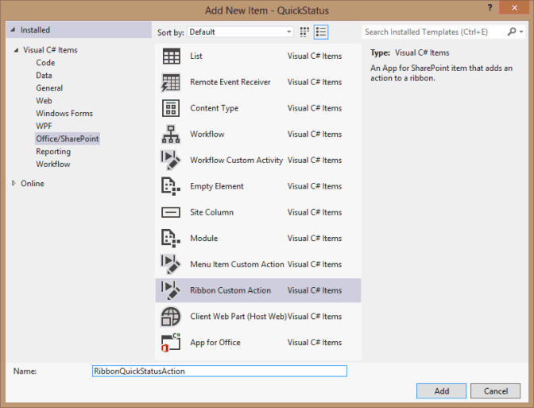

# <a name="create-a-sharepoint-hosted-project-server-add-in"></a><span data-ttu-id="1cb38-103">创建 SharePoint 托管的 Project Server 加载项</span><span class="sxs-lookup"><span data-stu-id="1cb38-103">Create a SharePoint-hosted Project Server add-in</span></span>

<span data-ttu-id="1cb38-104">您可以创建 for Project Online （自动承载、 提供程序承载和 SharePoint 承载） 的应用程序的三种类型，SharePoint 承载的应用程序是最简单创建和部署。</span><span class="sxs-lookup"><span data-stu-id="1cb38-104">Of the three types of apps that you can create for Project Online (autohosted, provider-hosted, and SharePoint-hosted), the SharePoint-hosted app is the simplest to create and deploy.</span></span> <span data-ttu-id="1cb38-105">SharePoint 承载的应用程序不需要 OAuth 身份验证和不使用 Azure 或需要的提供程序承载的资源的本地网站的维护。</span><span class="sxs-lookup"><span data-stu-id="1cb38-105">A SharePoint-hosted app does not require OAuth authentication, and does not use Azure or require maintenance of a local site for the provider-hosted resources.</span></span> <span data-ttu-id="1cb38-106">在 Visual Studio 中的**SharePoint 2013 相关应用程序**模板是用于开发应用程序可以发布和销售的 Office 商店或部署到 SharePoint 上专用应用程序目录的一个方便框架。</span><span class="sxs-lookup"><span data-stu-id="1cb38-106">The **App for SharePoint 2013** template in Visual Studio is a convenient framework for developing apps that can be published and sold in the Office Store or deployed to a private app catalog on SharePoint.</span></span> 
  
<span data-ttu-id="1cb38-107">在项目中，状态是任务的其中团队成员可用于任务页 Project Web App 中提交分配，如工作的用于此任务工作周中每一天的小时数的状态的过程。</span><span class="sxs-lookup"><span data-stu-id="1cb38-107">In Project, statusing is a process where a team member can use the Tasks page in Project Web App to submit the status of an assigned task, such as the number of hours worked each day of a week spent working on the task.</span></span> <span data-ttu-id="1cb38-108">工作分配所有者 （通常项目经理） 可以批准或拒绝状态。</span><span class="sxs-lookup"><span data-stu-id="1cb38-108">The assignment owner (usually the project manager) can approve or reject the status.</span></span> <span data-ttu-id="1cb38-109">当状态为 approved 时，Project 会重新计算计划。</span><span class="sxs-lookup"><span data-stu-id="1cb38-109">When the status is approved, Project recalculates the schedule.</span></span> <span data-ttu-id="1cb38-110">将**QuickStatus**应用程序显示分配的任务，其中用户可以快速更新的完成百分比和提交以供审批所选工作分配的状态。</span><span class="sxs-lookup"><span data-stu-id="1cb38-110">The **QuickStatus** app displays assigned tasks, where the user can quickly update percent complete and submit status of the selected assignments for approval.</span></span> <span data-ttu-id="1cb38-111">虽然 Project Web App 中的任务页上有多个功能，将**QuickStatus**应用程序是提供简化的接口的示例。</span><span class="sxs-lookup"><span data-stu-id="1cb38-111">Although the Tasks page in Project Web App has much more functionality, the **QuickStatus** app is an example that provides a simplified interface.</span></span> 
  
<span data-ttu-id="1cb38-112">将**QuickStatus**应用程序是一个示例面向开发人员;它不是为在生产环境中使用。</span><span class="sxs-lookup"><span data-stu-id="1cb38-112">The **QuickStatus** app is a sample for developers; it is not intended for use in a production environment.</span></span> <span data-ttu-id="1cb38-113">主要用途是显示 for Project Online 中，无法创建一个完善的进展状况应用程序的应用程序开发的示例。</span><span class="sxs-lookup"><span data-stu-id="1cb38-113">The primary purpose is to show an example of app development for Project Online, not to create a fully functional statusing app.</span></span> <span data-ttu-id="1cb38-114">Statusing 的更好方法，请参阅[下一步骤](#pj15_StatusingApp_NextSteps)中的建议。</span><span class="sxs-lookup"><span data-stu-id="1cb38-114">For a better approach to statusing, see the recommendation in [Next steps](#pj15_StatusingApp_NextSteps).</span></span>
  
<span data-ttu-id="1cb38-115">Statusing 的常规信息，请参阅[任务进度](https://support.office.com/article/Find-information-about-Project-Server-2013-8b08a414-15a7-4076-b2db-c90d0214ea7f?ui=en-US&rs=en-US&ad=US#BKMK_TaskProgress)。</span><span class="sxs-lookup"><span data-stu-id="1cb38-115">For general information about statusing, see [Task progress](https://support.office.com/article/Find-information-about-Project-Server-2013-8b08a414-15a7-4076-b2db-c90d0214ea7f?ui=en-US&rs=en-US&ad=US#BKMK_TaskProgress).</span></span> <span data-ttu-id="1cb38-116">有关 SharePoint 和 Project Server 开发加载项的详细信息，请参阅[SharePoint 加载项](https://msdn.microsoft.com/library/jj163230.aspx)。</span><span class="sxs-lookup"><span data-stu-id="1cb38-116">For more information about developing add-ins for SharePoint and Project Server, see [SharePoint Add-ins](https://msdn.microsoft.com/library/jj163230.aspx).</span></span>

<span data-ttu-id="1cb38-117"><a name="pj15_StatusingApp_Prerequisites"> </a></span><span class="sxs-lookup"><span data-stu-id="1cb38-117"></span></span>

## <a name="prerequisites-for-creating-an-app-for-project-server-2013"></a><span data-ttu-id="1cb38-118">Project Server 2013 中创建的应用程序的先决条件</span><span class="sxs-lookup"><span data-stu-id="1cb38-118">Prerequisites for creating an app for Project Server 2013</span></span>

<span data-ttu-id="1cb38-119">若要开发可以部署到 Project Online 或向 Project Server 2013 的本地安装的相对简单应用程序，可以使用 Napa，它提供一个联机开发环境的信息。</span><span class="sxs-lookup"><span data-stu-id="1cb38-119">To develop relatively simple apps that can be deployed to Project Online or to an on-premises installation of Project Server 2013, you can use the Napa, which provide an online development environment.</span></span> <span data-ttu-id="1cb38-120">对于更复杂的应用程序，修改 Project Web App 功能区和更轻松调试在开发期间，您可以使用 Visual Studio 2012 或 Visual Studio 2013。</span><span class="sxs-lookup"><span data-stu-id="1cb38-120">For more complex apps, modifying the Project Web App ribbon, and easier debugging during development, you can use Visual Studio 2012 or Visual Studio 2013.</span></span> <span data-ttu-id="1cb38-121">例如，与在本地安装，您可以手动检查草稿数据表的 Project Server 数据库中的更改。</span><span class="sxs-lookup"><span data-stu-id="1cb38-121">For example, with an on-premises installation, you can manually check the Drafts datatables for changes in the Project Server database.</span></span> <span data-ttu-id="1cb38-122">本文介绍如何使用 Visual studio 创建的应用程序开发。</span><span class="sxs-lookup"><span data-stu-id="1cb38-122">This article shows how to do app development with Visual Studio.</span></span>
  
<span data-ttu-id="1cb38-123">使用 Visual studio 创建的 Project Server 应用程序的开发有以下要求：</span><span class="sxs-lookup"><span data-stu-id="1cb38-123">Development of Project Server apps with Visual Studio requires the following:</span></span>
  
- <span data-ttu-id="1cb38-p106">确保您已在本地开发计算机上安装最新的 Service Pack 和 Windows 更新。操作系统可以是 Windows 7、Windows 8、Windows Server 2008 或 Windows Server 2012。</span><span class="sxs-lookup"><span data-stu-id="1cb38-p106">Ensure that you have installed the most recent service packs and Windows updates on your local development computer. The operating system can be Windows 7, Windows 8, Windows Server 2008, or Windows Server 2012.</span></span>
    
- <span data-ttu-id="1cb38-126">您必须具有已 SharePoint Server 2013 和 Project Server 2013 安装，其中将计算机配置为应用程序隔离和 sideloading 的应用程序的计算机。</span><span class="sxs-lookup"><span data-stu-id="1cb38-126">You must have a computer that has SharePoint Server 2013 and Project Server 2013 installed, where the computer is configured for app isolation and sideloading of apps.</span></span> <span data-ttu-id="1cb38-127">Sideloading 启用 Visual Studio 暂时安装应用程序进行调试。</span><span class="sxs-lookup"><span data-stu-id="1cb38-127">Sideloading enables Visual Studio to temporarily install the app for debugging.</span></span> <span data-ttu-id="1cb38-128">您可以使用 SharePoint 和 Project Server 的本地安装。</span><span class="sxs-lookup"><span data-stu-id="1cb38-128">You can use an on-premises installation of SharePoint and Project Server.</span></span> <span data-ttu-id="1cb38-129">有关详细信息，请参阅[设置 SharePoint 相关应用程序的本地开发环境](https://msdn.microsoft.com/library/fp179923%28Office.15%29.aspx)。</span><span class="sxs-lookup"><span data-stu-id="1cb38-129">For more information, see [Set up an on-premises development environment for apps for SharePoint](https://msdn.microsoft.com/library/fp179923%28Office.15%29.aspx).</span></span>
    
   > [!NOTE]
   > <span data-ttu-id="1cb38-130">在本地安装，独立的应用程序域配置*之前*创建企业应用程序目录。</span><span class="sxs-lookup"><span data-stu-id="1cb38-130">For an on-premises installation, configure an isolated app domain  *before*  you create a corporate app catalog.</span></span> 
  
- <span data-ttu-id="1cb38-131">开发计算机可以是已安装 Visual Studio 2012 Office 开发人员工具的远程计算机。</span><span class="sxs-lookup"><span data-stu-id="1cb38-131">The development computer can be a remote computer that has Office Developer Tools for Visual Studio 2012 installed.</span></span> <span data-ttu-id="1cb38-132">确保安装了最新版本;请参阅*工具*部分中的[Office 和 SharePoint 相关应用程序下载](https://msdn.microsoft.com/office/apps/fp123627.aspx)。</span><span class="sxs-lookup"><span data-stu-id="1cb38-132">Ensure that you have installed the most recent version; see the  *Tools*  section of the [Apps for Office and SharePoint downloads](https://msdn.microsoft.com/office/apps/fp123627.aspx).</span></span>
    
- <span data-ttu-id="1cb38-133">验证 Project Web App 实例您将使用的开发和测试是在浏览器中访问。</span><span class="sxs-lookup"><span data-stu-id="1cb38-133">Verify that the Project Web App instance you will be using for development and testing is accessible in the browser.</span></span>
    
<span data-ttu-id="1cb38-134">有关使用联机工具的信息，请参阅[设置用于开发 Office 365 上的 SharePoint 相关应用程序的环境](https://msdn.microsoft.com/library/fp161179.aspx)。</span><span class="sxs-lookup"><span data-stu-id="1cb38-134">For information about using the online tools, see [Set up an environment for developing apps for SharePoint on Office 365](https://msdn.microsoft.com/library/fp161179.aspx).</span></span> <span data-ttu-id="1cb38-135">使用在线工具的 Project server 构建的简单应用程序的演练，请参阅 EPMSource 博客系列，[构建您的第一个 Project Server 应用程序](https://epmsource.com/2012/11/20/building-your-first-project-server-app-part-zerothe-introduction/)。</span><span class="sxs-lookup"><span data-stu-id="1cb38-135">For a walkthrough of building a simple app for Project Server that uses the online tools, see the EPMSource blog series, [Building your first Project Server app](https://epmsource.com/2012/11/20/building-your-first-project-server-app-part-zerothe-introduction/).</span></span>

<span data-ttu-id="1cb38-136"><a name="pj15_StatusingApp_UsingVisualStudio"> </a></span><span class="sxs-lookup"><span data-stu-id="1cb38-136"></span></span>

## <a name="using-visual-studio-to-create-a-project-server-app"></a><span data-ttu-id="1cb38-137">使用 Visual Studio 创建的 Project Server 应用程序</span><span class="sxs-lookup"><span data-stu-id="1cb38-137">Using Visual Studio to create a Project Server app</span></span>

<span data-ttu-id="1cb38-138">Visual Studio 2012 office 开发人员工具包括可用于 Project Server 2013 的 SharePoint 应用程序模板。</span><span class="sxs-lookup"><span data-stu-id="1cb38-138">Office Developer Tools for Visual Studio 2012 includes a template for SharePoint apps that can be used with Project Server 2013.</span></span> <span data-ttu-id="1cb38-139">创建应用程序解决方案时，此解决方案包括自定义代码的以下文件：</span><span class="sxs-lookup"><span data-stu-id="1cb38-139">When you create an app solution, the solution includes the following files for your custom code:</span></span>
  
- <span data-ttu-id="1cb38-140">**AppManifest.xml**包括应用程序标题、 权限请求范围和其他属性的设置。</span><span class="sxs-lookup"><span data-stu-id="1cb38-140">**AppManifest.xml** includes settings for the app title, permission request scope, and other properties.</span></span> <span data-ttu-id="1cb38-141">过程 1 包括步骤使用清单设计器中设置的属性。</span><span class="sxs-lookup"><span data-stu-id="1cb38-141">Procedure 1 includes steps to set the properties by using the Manifest Designer.</span></span> 
    
- <span data-ttu-id="1cb38-142">页面文件夹中的**Default.aspx**是应用程序的主页。</span><span class="sxs-lookup"><span data-stu-id="1cb38-142">**Default.aspx** in the Pages folder is the main page of the app.</span></span> <span data-ttu-id="1cb38-143">步骤 2 演示如何添加对**QuickStatus**应用程序的 HTML5 内容。</span><span class="sxs-lookup"><span data-stu-id="1cb38-143">Procedure 2 shows how to add HTML5 content for the **QuickStatus** app.</span></span> 
    
- <span data-ttu-id="1cb38-144">脚本文件夹中的**App.js**是主要的自定义 JavaScript 代码文件。</span><span class="sxs-lookup"><span data-stu-id="1cb38-144">**App.js** in the Scripts folder is the primary file for the custom JavaScript code.</span></span> <span data-ttu-id="1cb38-145">步骤 3 介绍**QuickStatus**应用程序的 JavaScript 代码。</span><span class="sxs-lookup"><span data-stu-id="1cb38-145">Procedure 3 explains the JavaScript code for the **QuickStatus** app.</span></span> 
    
   <span data-ttu-id="1cb38-146">如果添加商业如 jQuery 基于网格或日期选取器控件，则可以在 Default.aspx 文件中添加其他 JavaScript 文件的引用。</span><span class="sxs-lookup"><span data-stu-id="1cb38-146">If you add commercial controls such as a jQuery-based grid or date picker, you can add references to additional JavaScript files in the Default.aspx file.</span></span>
    
- <span data-ttu-id="1cb38-147">**App.css**中内容的文件夹是自定义 CSS3 样式的主文件。</span><span class="sxs-lookup"><span data-stu-id="1cb38-147">**App.css** in the Content folder is the primary file for custom CSS3 styles.</span></span> <span data-ttu-id="1cb38-148">步骤 2 和步骤 3 包含有关对**QuickStatus**应用程序的级联样式表 (CSS) 样式。</span><span class="sxs-lookup"><span data-stu-id="1cb38-148">Procedure 2 and Procedure 3 include information about cascading style sheets (CSS) styles for the **QuickStatus** app.</span></span> <span data-ttu-id="1cb38-149">可以在 Default.aspx 文件中添加其他 CSS 文件的引用。</span><span class="sxs-lookup"><span data-stu-id="1cb38-149">You can add references to additional CSS files in the Default.aspx file.</span></span> 
    
- <span data-ttu-id="1cb38-150">**AppIcon.png**图像文件夹中是应用程序将显示在 Office 商店或应用程序目录中的 96 x 96 图标。</span><span class="sxs-lookup"><span data-stu-id="1cb38-150">**AppIcon.png** in the Images folder is the 96 x 96 icon that the app displays in the Office Store or the app catalog.</span></span> 
    
<span data-ttu-id="1cb38-151">修改 Project Web App 功能区，您可以添加功能区自定义操作。</span><span class="sxs-lookup"><span data-stu-id="1cb38-151">To modify the Project Web App ribbon, you can add a ribbon custom action.</span></span> <span data-ttu-id="1cb38-152">[对 QuickStatus 应用程序的示例代码](#pj15_StatusingApp_Example)部分包括已修改 Default.aspx、 App.js、 App.css、 Elements.xml，和 AppManifest.xml 文件的完整代码。</span><span class="sxs-lookup"><span data-stu-id="1cb38-152">The [Example code for the QuickStatus app](#pj15_StatusingApp_Example) section includes the complete code for the modified Default.aspx, App.js, App.css, Elements.xml, and AppManifest.xml files.</span></span> 
  
### <a name="procedure-1-to-create-an-app-project-in-visual-studio"></a><span data-ttu-id="1cb38-153">过程 1。</span><span class="sxs-lookup"><span data-stu-id="1cb38-153">Procedure 1.</span></span> <span data-ttu-id="1cb38-154">在 Visual Studio 中创建应用程序项目</span><span class="sxs-lookup"><span data-stu-id="1cb38-154">To create an app project in Visual Studio</span></span>

1. <span data-ttu-id="1cb38-155">以管理员身份运行 Visual Studio 2012，然后选择开始页上的**新建项目**。</span><span class="sxs-lookup"><span data-stu-id="1cb38-155">Run Visual Studio 2012 as an administrator, and then select **New Project** on the Start page.</span></span> 
    
2. <span data-ttu-id="1cb38-156">在**新建项目**对话框中，展开**模板**、 **Visual C#** 和**Office/SharePoint**节点，然后选择**应用程序**。</span><span class="sxs-lookup"><span data-stu-id="1cb38-156">In the **New Project** dialog box, expand the **Templates**, **Visual C#**, and **Office/SharePoint** nodes, and then select **Apps**.</span></span> <span data-ttu-id="1cb38-157">在顶部 （见图 1） 的中心窗格中，然后选择**SharePoint 2013 相关应用程序**中使用目标框架下拉列表中的默认 **.NET Framework 4.5** 。</span><span class="sxs-lookup"><span data-stu-id="1cb38-157">Use the default **.NET Framework 4.5** in the target framework drop-down list at the top of the center pane, and then select **App for SharePoint 2013** (see Figure 1).</span></span> 
    
3. <span data-ttu-id="1cb38-158">在**名称**字段中，键入 QuickStatus，浏览到要保存应用程序，然后选择**确定**的位置。</span><span class="sxs-lookup"><span data-stu-id="1cb38-158">In the **Name** field, type QuickStatus, browse to the location where you want to save the app, and then choose **OK**.</span></span>
    
   <span data-ttu-id="1cb38-159">**图 1。创建项目 Visual Studio 中的服务器应用程序**</span><span class="sxs-lookup"><span data-stu-id="1cb38-159">**Figure 1. Creating a Project Server app in Visual Studio**</span></span>

   <span data-ttu-id="1cb38-160"></span><span class="sxs-lookup"><span data-stu-id="1cb38-160"></span></span>
  
4. <span data-ttu-id="1cb38-161">在**新的 SharePoint 应用程序**对话框中，填写下列三个字段：</span><span class="sxs-lookup"><span data-stu-id="1cb38-161">In the **New app for SharePoint** dialog box, fill in the following three fields:</span></span> 
    
   - <span data-ttu-id="1cb38-162">在顶部文本框中，键入希望显示 Project Web App 中应用程序的名称。</span><span class="sxs-lookup"><span data-stu-id="1cb38-162">In the top text box, type the name that you want the app to display in Project Web App.</span></span> <span data-ttu-id="1cb38-163">例如，键入快速状态更新。</span><span class="sxs-lookup"><span data-stu-id="1cb38-163">For example, type Quick Status Update.</span></span>
    
   - <span data-ttu-id="1cb38-164">要用于调试的网站，键入 Project Web App 实例的 URL。</span><span class="sxs-lookup"><span data-stu-id="1cb38-164">For the site to use for debugging, type the URL of the Project Web App instance.</span></span> <span data-ttu-id="1cb38-165">例如，键入`https://ServerName/ProjectServerName`（将_ServerName_和_ProjectServerName_替换您自己的值），然后选择**验证**。</span><span class="sxs-lookup"><span data-stu-id="1cb38-165">For example, type  `https://ServerName/ProjectServerName` (replacing  _ServerName_ and  _ProjectServerName_ with your own values), and then choose **Validate**.</span></span> <span data-ttu-id="1cb38-166">如果运行正常，Visual Studio 将显示**成功连接**。</span><span class="sxs-lookup"><span data-stu-id="1cb38-166">If all goes well, Visual Studio shows **Connection successful**.</span></span> <span data-ttu-id="1cb38-167">如果您收到一条错误消息，请确保 Project Web App 的 URL 正确以及为应用程序隔离和 sideloading 的应用程序配置了 Project Server 计算机。</span><span class="sxs-lookup"><span data-stu-id="1cb38-167">If you get an error message, ensure that the Project Web App URL is correct and that the Project Server computer is configured for app isolation and sideloading of apps.</span></span> <span data-ttu-id="1cb38-168">有关详细信息，请参阅[创建 Project Server 2013 的应用程序的先决条件](#pj15_StatusingApp_Prerequisites)部分。</span><span class="sxs-lookup"><span data-stu-id="1cb38-168">For more information, see the [Prerequisites for creating an app for Project Server 2013](#pj15_StatusingApp_Prerequisites) section.</span></span> 
    
   - <span data-ttu-id="1cb38-169">在**您希望如何承载 SharePoint 相关应用程序**下拉列表中，选择**SharePoint 承载**。</span><span class="sxs-lookup"><span data-stu-id="1cb38-169">In the **How do you want to host your app for SharePoint** drop-down list, choose **SharePoint-hosted**.</span></span>
    
   > [!CAUTION]
   > <span data-ttu-id="1cb38-170">如果您错误地选择默认**提供程序承载**的项目类型，Visual Studio 解决方案中创建两个项目： **QuickStatus**项目和**QuickStatusWeb**项目。</span><span class="sxs-lookup"><span data-stu-id="1cb38-170">If you choose the default **Provider-hosted** project type by mistake, Visual Studio creates two projects in the solution: a **QuickStatus** project and a **QuickStatusWeb** project.</span></span> <span data-ttu-id="1cb38-171">如果您看到两个项目，则删除该解决方案，然后重新启动。</span><span class="sxs-lookup"><span data-stu-id="1cb38-171">If you see two projects, delete that solution and start again.</span></span> 
  
5. <span data-ttu-id="1cb38-172">选择**确定**以创建**QuickStatus**解决方案、 **QuickStatus**项目和默认文件。</span><span class="sxs-lookup"><span data-stu-id="1cb38-172">Choose **OK** to create the **QuickStatus** solution, **QuickStatus** project, and default files.</span></span> 
    
6. <span data-ttu-id="1cb38-173">打开清单设计器视图 （例如，双击 AppManifest.xml 文件）。</span><span class="sxs-lookup"><span data-stu-id="1cb38-173">Open the Manifest Designer view (for example, double-click the AppManifest.xml file).</span></span> <span data-ttu-id="1cb38-174">在**常规**选项卡，**标题**文本框中应显示在步骤 4 中键入应用程序名称。</span><span class="sxs-lookup"><span data-stu-id="1cb38-174">On the **General** tab, the **Title** text box should show the app name that you typed in step 4.</span></span> <span data-ttu-id="1cb38-175">选择**权限**选项卡添加应用程序的以下权限请求 （见图 2）：</span><span class="sxs-lookup"><span data-stu-id="1cb38-175">Choose the **Permissions** tab to add the following permission requests for the app (see Figure 2):</span></span> 
    
   - <span data-ttu-id="1cb38-176">第一行的**权限请求**列表中，在**范围**列中下拉列表中选择**状态**。</span><span class="sxs-lookup"><span data-stu-id="1cb38-176">In the first row of the **Permission requests** list, in the **Scope** column, choose **Statusing** in the drop-down list.</span></span> <span data-ttu-id="1cb38-177">在**权限**列中，选择**SubmitStatus**。</span><span class="sxs-lookup"><span data-stu-id="1cb38-177">In the **Permission** column, choose **SubmitStatus**.</span></span>
    
   - <span data-ttu-id="1cb38-178">添加的行其中**范围**是**多个项目**，则**读取\*\*\*\*权限**。</span><span class="sxs-lookup"><span data-stu-id="1cb38-178">Add a row where the **Scope** is **Multiple Projects** and the **Permission** is **Read**.</span></span>
    
   <span data-ttu-id="1cb38-179">**图 2。设置状态应用程序的权限范围**</span><span class="sxs-lookup"><span data-stu-id="1cb38-179">**Figure 2. Setting the permission scope for a statusing app**</span></span>

   <span data-ttu-id="1cb38-180"></span><span class="sxs-lookup"><span data-stu-id="1cb38-180"></span></span>
  
<span data-ttu-id="1cb38-181">将**QuickStatus**应用程序允许 Project Web App 用户读取多个项目的该用户分配和更改工作分配完成百分比，请提交更新。</span><span class="sxs-lookup"><span data-stu-id="1cb38-181">The **QuickStatus** app enables a Project Web App user to read assignments for that user from multiple projects, change the assignment percent complete, and submit the update.</span></span> <span data-ttu-id="1cb38-182">图 2 中下拉列表中显示的其他权限请求范围不需要此应用程序。</span><span class="sxs-lookup"><span data-stu-id="1cb38-182">The other permission request scopes shown in the drop-down list in Figure 2 are not required for this app.</span></span> <span data-ttu-id="1cb38-183">权限请求作用域是代表用户请求应用程序的权限。</span><span class="sxs-lookup"><span data-stu-id="1cb38-183">The permission request scopes are the permissions that the app requests on behalf of the user.</span></span> <span data-ttu-id="1cb38-184">如果用户在 Project Web App 中没有这些权限，应用程序不运行。</span><span class="sxs-lookup"><span data-stu-id="1cb38-184">If the user does not have those permissions in Project Web App, the app does not run.</span></span> <span data-ttu-id="1cb38-185">应用程序可以有多个权限请求作用域，包括有关其他 SharePoint 权限，但应具有的应用程序功能所需的最小。</span><span class="sxs-lookup"><span data-stu-id="1cb38-185">An app can have multiple permission request scopes, including those for other SharePoint permissions, but should have only the minimum necessary for the app functionality.</span></span> <span data-ttu-id="1cb38-186">以下是与 Project Server 权限请求作用域：</span><span class="sxs-lookup"><span data-stu-id="1cb38-186">Following are the permission request scopes that are related to Project Server:</span></span> 

- <span data-ttu-id="1cb38-187">**企业资源**： 资源管理器权限，以读取或写入其他 Project Web App 用户的信息。</span><span class="sxs-lookup"><span data-stu-id="1cb38-187">**Enterprise Resources**: Resource manager permissions, to read or write information about other Project Web App users.</span></span>
    
- <span data-ttu-id="1cb38-188">**多个项目**： 读取或写入到多个项目，其中用户具有请求的权限。</span><span class="sxs-lookup"><span data-stu-id="1cb38-188">**Multiple Projects**: Read or write to more than one project, where the user has the permissions requested.</span></span>
    
- <span data-ttu-id="1cb38-189">**Project Server**： 要求应用程序用户具有 Project Web app 的管理员权限。</span><span class="sxs-lookup"><span data-stu-id="1cb38-189">**Project Server**: Requires the app user to have administrator permissions for Project Web App.</span></span>
    
- <span data-ttu-id="1cb38-190">**报告**： 读取 Project Web App （需要 Project Web App 登录权限） 的**ProjectData** OData 服务。</span><span class="sxs-lookup"><span data-stu-id="1cb38-190">**Reporting**: Read the **ProjectData** OData service for Project Web App (requires only log on permission for Project Web App).</span></span> 
    
- <span data-ttu-id="1cb38-191">**单个项目**： 读取或写入到用户请求的权限在其上一个项目。</span><span class="sxs-lookup"><span data-stu-id="1cb38-191">**Single Project**: Read or write to a project where the user has the permissions requested.</span></span>
    
- <span data-ttu-id="1cb38-192">**Statusing**： 提交的工作分配状态的更新，如有效的时间百分比完成后，和新的工作分配。</span><span class="sxs-lookup"><span data-stu-id="1cb38-192">**Statusing**: Submit updates for status of assignments, such as times worked, percent complete, and new assignments.</span></span>
    
- <span data-ttu-id="1cb38-193">**工作流**： 具有工作流的提升权限如果用户具有的权限来运行 Project Server 工作流，然后运行应用程序。</span><span class="sxs-lookup"><span data-stu-id="1cb38-193">**Workflow**: If the user has permission to run Project Server workflows, the app then runs with elevated permissions for the workflow.</span></span>
    
<span data-ttu-id="1cb38-194">有关 Project Server 2013 的权限请求作用域的详细信息，请参阅[Project 2013 中面向开发人员的更新](updates-for-developers-in-project-2013.md)和[SharePoint 2013 中的应用程序权限](https://msdn.microsoft.com/library/fp142383.aspx)中的*Project 应用程序*一节。</span><span class="sxs-lookup"><span data-stu-id="1cb38-194">For more information about permission request scopes for Project Server 2013, see the  *Project apps*  section in [Updates for developers in Project 2013](updates-for-developers-in-project-2013.md) and [App permissions in SharePoint 2013](https://msdn.microsoft.com/library/fp142383.aspx).</span></span>


<span data-ttu-id="1cb38-195"><a name="pj15_StatusingApp_HTML"> </a></span><span class="sxs-lookup"><span data-stu-id="1cb38-195"></span></span>

### <a name="creating-the-html-content-for-the-quickstatus-app"></a><span data-ttu-id="1cb38-196">创建 HTML 内容对 QuickStatus 应用程序</span><span class="sxs-lookup"><span data-stu-id="1cb38-196">Creating the HTML content for the QuickStatus app</span></span>

<span data-ttu-id="1cb38-197">在开始编写代码的 HTML 内容之前，设计用户界面和 （图 3 显示了已完成页上的示例） 对 QuickStatus 应用程序的用户体验。</span><span class="sxs-lookup"><span data-stu-id="1cb38-197">Before you start coding the HTML content, design the user interface and user experience for the QuickStatus app (Figure 3 shows an example of the completed page).</span></span> <span data-ttu-id="1cb38-198">设计还可以包括交互的 HTML 代码 JavaScript 函数的分级显示。</span><span class="sxs-lookup"><span data-stu-id="1cb38-198">A design can also include an outline of the JavaScript functions that interact with the HTML code.</span></span> <span data-ttu-id="1cb38-199">常规信息，请参阅[SharePoint 2013 中的应用程序的 UX 设计](https://msdn.microsoft.com/library/fp179934.aspx)。</span><span class="sxs-lookup"><span data-stu-id="1cb38-199">For general information, see [UX design for apps in SharePoint 2013](https://msdn.microsoft.com/library/fp179934.aspx).</span></span>
  
<span data-ttu-id="1cb38-200">**图 3。QuickStatus 应用程序页的设计**</span><span class="sxs-lookup"><span data-stu-id="1cb38-200">**Figure 3. Design of the QuickStatus app page**</span></span>

<span data-ttu-id="1cb38-201"></span><span class="sxs-lookup"><span data-stu-id="1cb38-201"></span></span>
  
<span data-ttu-id="1cb38-202">应用程序显示在顶部，这是 AppManifest.xml 中的**Title**元素的值的显示名称。</span><span class="sxs-lookup"><span data-stu-id="1cb38-202">The app shows the display name at the top, which is the value of the **Title** element in AppManifest.xml.</span></span> 
  
<span data-ttu-id="1cb38-203">默认情况下，页上使用 HTML5。</span><span class="sxs-lookup"><span data-stu-id="1cb38-203">By default, the page uses HTML5.</span></span> <span data-ttu-id="1cb38-204">以下是**QuickStatus**应用程序页的正文中包含的主要 UI 对象的标准 HTML 元素：</span><span class="sxs-lookup"><span data-stu-id="1cb38-204">Following are the standard HTML elements for the main UI objects that the **QuickStatus** app contains in the body of the page:</span></span> 
  
- <span data-ttu-id="1cb38-205">**Form**元素包含所有其他用户界面元素。</span><span class="sxs-lookup"><span data-stu-id="1cb38-205">A **form** element contains all of the other UI elements.</span></span> 
    
- <span data-ttu-id="1cb38-206">**字段集**元素创建的容器和边框的工作分配; 表子**图例**元素提供一个标签的容器。</span><span class="sxs-lookup"><span data-stu-id="1cb38-206">A **fieldset** element creates a container and border for the table of assignments; the child **legend** element provides a label for the container.</span></span> 
    
- <span data-ttu-id="1cb38-207">**表**元素包括标题和仅表格标题。</span><span class="sxs-lookup"><span data-stu-id="1cb38-207">A **table** element includes a caption and only a table header.</span></span> <span data-ttu-id="1cb38-208">JavaScript 函数更改表标题，并添加将工作分配行。</span><span class="sxs-lookup"><span data-stu-id="1cb38-208">JavaScript functions change the table caption and add rows for the assignments.</span></span> 
    
   > [!NOTE]
   > <span data-ttu-id="1cb38-209">若要方便地添加分页和排序，生产应用程序可能需要而不是表中使用商业基于 jQuery 网格控件。</span><span class="sxs-lookup"><span data-stu-id="1cb38-209">To easily add paging and sorting, a production app would probably use a commercial jQuery-based grid control instead of a table.</span></span> 
  
   <span data-ttu-id="1cb38-210">表包含的项目名称、 复选框、 实际工时、 完整的剩余工时百分比，任务名称的列和工作分配的完成日期。</span><span class="sxs-lookup"><span data-stu-id="1cb38-210">The table includes columns for the project name, task name with a check box, actual work, percent complete, remaining work, and the assignment finish date.</span></span> <span data-ttu-id="1cb38-211">JavaScript 函数创建复选框和百分比的文本输入的字段完成每项任务。</span><span class="sxs-lookup"><span data-stu-id="1cb38-211">JavaScript functions create the check box and the text input field for the percent complete of each task.</span></span>
    
- <span data-ttu-id="1cb38-212">在文本框中的**输入**元素设置 %完成所有所选工作分配。</span><span class="sxs-lookup"><span data-stu-id="1cb38-212">An **input** element for a text box sets percent complete for all selected assignments.</span></span> 
    
- <span data-ttu-id="1cb38-213">**Button**元素提交状态更改。</span><span class="sxs-lookup"><span data-stu-id="1cb38-213">A **button** element submits the status changes.</span></span> 
    
- <span data-ttu-id="1cb38-214">**Button**元素刷新页面。</span><span class="sxs-lookup"><span data-stu-id="1cb38-214">A **button** element refreshes the page.</span></span> 
    
- <span data-ttu-id="1cb38-215">**Button**元素退出应用程序，并返回到 Project Web App 中的任务页。</span><span class="sxs-lookup"><span data-stu-id="1cb38-215">A **button** element exits the app and returns to the Tasks page in Project Web App.</span></span> 
    
<span data-ttu-id="1cb38-216">底部文本框和按钮元素是在**div**元素内，因此 CSS 可以方便地管理的位置和外观的 UI 对象。</span><span class="sxs-lookup"><span data-stu-id="1cb38-216">The bottom text box and button elements are within **div** elements, so that CSS can easily manage the position and appearance of the UI objects.</span></span> <span data-ttu-id="1cb38-217">JavaScript 函数添加一个段落，包含的成功结果的页面的底部或失败状态更新。</span><span class="sxs-lookup"><span data-stu-id="1cb38-217">A JavaScript function adds a paragraph at the bottom of the page that contains results for success or failure of the status update.</span></span> 
  
### <a name="procedure-2-to-create-the-html-content"></a><span data-ttu-id="1cb38-218">步骤 2。</span><span class="sxs-lookup"><span data-stu-id="1cb38-218">Procedure 2.</span></span> <span data-ttu-id="1cb38-219">创建 HTML 内容</span><span class="sxs-lookup"><span data-stu-id="1cb38-219">To create the HTML content</span></span>

1. <span data-ttu-id="1cb38-220">在 Visual Studio 中，打开 Default.aspx 文件。</span><span class="sxs-lookup"><span data-stu-id="1cb38-220">In Visual Studio, open the Default.aspx file.</span></span>
    
   <span data-ttu-id="1cb38-221">该文件包含两个**asp: Content**元素： 将元素`ContentPlaceHolderID="PlaceHolderAdditionalPageHead"`页眉，并将元素内添加特性`ContentPlaceHolderID="PlaceHolderMain"`属性位于页面**body**元素。</span><span class="sxs-lookup"><span data-stu-id="1cb38-221">The file includes two **asp:Content** elements: The element with the  `ContentPlaceHolderID="PlaceHolderAdditionalPageHead"` attribute is added within the page header, and the element with the  `ContentPlaceHolderID="PlaceHolderMain"` attribute is placed within the page **body** element.</span></span> 
    
2. <span data-ttu-id="1cb38-222">在`<asp:Content ContentPlaceHolderID="PlaceHolderAdditionalPageHead" runat="server">`控件的页面页眉中，添加对 Project Server 计算机上的 PS.js 文件的引用。</span><span class="sxs-lookup"><span data-stu-id="1cb38-222">In the  `<asp:Content ContentPlaceHolderID="PlaceHolderAdditionalPageHead" runat="server">` control for the page header, add a reference to the PS.js file on the Project Server computer.</span></span> <span data-ttu-id="1cb38-223">用于测试和调试，您可以使用 PS.debug.js。</span><span class="sxs-lookup"><span data-stu-id="1cb38-223">For testing and debugging, you can use PS.debug.js.</span></span> 
    
   ```HTML
     <script type="text/javascript" src="/_layouts/15/ps.debug.js"></script>
   ```

   <span data-ttu-id="1cb38-224">应用程序基础结构使用`/_layouts/15/`在 IIS 中的 SharePoint 网站的虚拟目录。</span><span class="sxs-lookup"><span data-stu-id="1cb38-224">The app infrastructure uses the `/_layouts/15/` virtual directory for the SharePoint site in IIS.</span></span> <span data-ttu-id="1cb38-225">物理文件是`%ProgramFiles%\Common Files\Microsoft Shared\Web Server Extensions\15\TEMPLATE\LAYOUTS\PS.debug.js`。</span><span class="sxs-lookup"><span data-stu-id="1cb38-225">The physical file is  `%ProgramFiles%\Common Files\Microsoft Shared\Web Server Extensions\15\TEMPLATE\LAYOUTS\PS.debug.js`.</span></span>
    
   > [!NOTE]
   > <span data-ttu-id="1cb38-226">部署用于生产用途的应用程序之前，请删除`.debug`从的脚本引用以提高性能。</span><span class="sxs-lookup"><span data-stu-id="1cb38-226">Before you deploy the app for production use, remove  `.debug` from the script references to improve performance.</span></span> 
  
3. <span data-ttu-id="1cb38-227">在`<asp:Content ContentPlaceHolderID="PlaceHolderMain" runat="server">`控制页面正文，删除生成的**div**元素，然后添加 UI 对象的 HTML 代码。</span><span class="sxs-lookup"><span data-stu-id="1cb38-227">In the  `<asp:Content ContentPlaceHolderID="PlaceHolderMain" runat="server">` control for the page body, delete the generated **div** element, and then add the HTML code for the UI objects.</span></span> <span data-ttu-id="1cb38-228">**表**元素包含仅标题行。</span><span class="sxs-lookup"><span data-stu-id="1cb38-228">The **table** element contains only a header row.</span></span> <span data-ttu-id="1cb38-229">**任务名称**列中包含的复选框输入的控件。</span><span class="sxs-lookup"><span data-stu-id="1cb38-229">The **Task name** column includes a check box input control.</span></span> <span data-ttu-id="1cb38-230">由**onGetUserNameSuccess**回调的 App.js 文件中的**getUserInfo**函数替换**标题**元素的文本。</span><span class="sxs-lookup"><span data-stu-id="1cb38-230">Text for the **caption** element is replaced by the **onGetUserNameSuccess** callback for the **getUserInfo** function in the App.js file.</span></span> 
    
    ```HTML
    <form>
        <fieldset>
        <legend>Select assigned tasks</legend>
        <table id="assignmentsTable">
            <caption id="tableCaption">Replace caption</caption>
            <thead>
            <tr id="headerRow">
                <th>Project name</th>
                <th><input type="checkbox" id="headercheckbox" checked="checked" />Task name</th>
                <th>Actual work</th>
                <th>% complete</th>
                <th>Remaining work</th>
                <th>Due date</th>
            </tr>
            </thead>
        </table>
        </fieldset>
        <div id="inputPercentComplete" >
        Set percent complete for all selected assignments, or leave this
        <br /> field blank and set percent complete for individual assignments: 
        <input type="text" name="percentComplete" id="pctComplete" size="4"  maxlength="4" />
        </div>
        <div id="submitResult">
        <p><button id="btnSubmitUpdate" type="button" class="bottomButtons" ></button></p>
        <p id="message"></p>
        </div>
        <div id="refreshPage">
        <p><button id="btnRefresh" type="button" class="bottomButtons" >Refresh</button></p>
        </div>
        <div id="exitPage">
        <p><button id="btnExit" type="button" class="bottomButtons" >Exit</button></p>
        </div>
    </form>
    ```

4. <span data-ttu-id="1cb38-231">在 App.css 文件中，添加位置和用户界面元素的外观的 CSS 代码。</span><span class="sxs-lookup"><span data-stu-id="1cb38-231">In the App.css file, add CSS code for the position and appearance of the UI elements.</span></span> <span data-ttu-id="1cb38-232">将**QuickStatus**应用程序的完整 CSS 代码，请参阅[QuickStatus 应用程序的示例代码](#pj15_StatusingApp_Example)部分。</span><span class="sxs-lookup"><span data-stu-id="1cb38-232">For the complete CSS code of the **QuickStatus** app, see the [Example code for the QuickStatus app](#pj15_StatusingApp_Example) section.</span></span> 
    
<span data-ttu-id="1cb38-233">步骤 3 添加 JavaScript 函数读取分配和创建的表格行，以及更改和更新工作分配的完成百分比。</span><span class="sxs-lookup"><span data-stu-id="1cb38-233">Procedure 3 adds the JavaScript functions to read the assignments and create the table rows, and to change and update the assignment percent complete.</span></span> <span data-ttu-id="1cb38-234">实际步骤多迭代开发应用程序，其中您另外创建的 HTML 代码一些、 添加和测试相关的样式和 JavaScript 函数修改或添加更多的 HTML 代码，然后重复该过程。</span><span class="sxs-lookup"><span data-stu-id="1cb38-234">The actual steps are more iterative in developing an app, where you alternately create some of the HTML code, add and test related styles and JavaScript functions, modify or add more HTML code, and then repeat the process.</span></span>

<span data-ttu-id="1cb38-235"><a name="pj15_StatusingApp_JavaScript"> </a></span><span class="sxs-lookup"><span data-stu-id="1cb38-235"></span></span>

### <a name="creating-the-javascript-functions-for-the-quickstatus-app"></a><span data-ttu-id="1cb38-236">创建对 QuickStatus 应用程序的 JavaScript 函数</span><span class="sxs-lookup"><span data-stu-id="1cb38-236">Creating the JavaScript functions for the QuickStatus app</span></span>

<span data-ttu-id="1cb38-237">SharePoint 应用程序的 Visual Studio 模板包括的 App.js 文件，其中包含默认初始化代码获取 SharePoint 客户端上下文和演示基本获取和设置的应用程序页上的操作。</span><span class="sxs-lookup"><span data-stu-id="1cb38-237">The Visual Studio template for a SharePoint app includes the App.js file, which contains default initialization code that gets the SharePoint client context and demonstrates basic get and set actions for the app page.</span></span> <span data-ttu-id="1cb38-238">SharePoint 客户端 SP.js 库的 JavaScript 命名空间为**SP**。</span><span class="sxs-lookup"><span data-stu-id="1cb38-238">The JavaScript namespace for the SharePoint client-side SP.js library is **SP**.</span></span> <span data-ttu-id="1cb38-239">Project Server 应用程序使用 PS.js 库，因为应用程序将使用**PS**命名空间获取客户端上下文和 JSOM 访问 Project server。</span><span class="sxs-lookup"><span data-stu-id="1cb38-239">Because a Project Server app uses the PS.js library, the app uses the **PS** namespace to get the client context and access the JSOM for Project Server.</span></span> 
  
<span data-ttu-id="1cb38-240">将**QuickStatus**应用程序中的 JavaScript 函数包括：</span><span class="sxs-lookup"><span data-stu-id="1cb38-240">JavaScript functions in the **QuickStatus** app include the following:</span></span> 
  
- <span data-ttu-id="1cb38-241">文档对象模型 (DOM) 实例化时，将运行文档**准备**事件处理程序。</span><span class="sxs-lookup"><span data-stu-id="1cb38-241">The document **ready** event handler runs when the document object model (DOM) is instantiated.</span></span> <span data-ttu-id="1cb38-242">**准备好**的事件处理程序执行以下四个步骤操作：</span><span class="sxs-lookup"><span data-stu-id="1cb38-242">The **ready** event handler does the following four steps:</span></span> 
    
    1. <span data-ttu-id="1cb38-243">Project Server JSOM 和**pwaWeb**全局变量初始化与客户端上下文**projContext**全局变量。</span><span class="sxs-lookup"><span data-stu-id="1cb38-243">Initializes the **projContext** global variable with the client context for the Project Server JSOM and the **pwaWeb** global variable.</span></span> 
        
    2. <span data-ttu-id="1cb38-244">调用**getUserInfo**函数初始化**projUser**全局变量。</span><span class="sxs-lookup"><span data-stu-id="1cb38-244">Calls the **getUserInfo** function to initialize the **projUser** global variable.</span></span> 
        
    3. <span data-ttu-id="1cb38-245">调用**getAssignments**函数，其获取指定用户的工作分配数据。</span><span class="sxs-lookup"><span data-stu-id="1cb38-245">Calls the **getAssignments** function, which gets specified assignment data for the user.</span></span> 
        
    4. <span data-ttu-id="1cb38-246">绑定单击事件处理程序向表头复选框，和表格的每一行中的复选框。</span><span class="sxs-lookup"><span data-stu-id="1cb38-246">Binds click event handlers to the table header check box, and to the check boxes in each row of the table.</span></span> <span data-ttu-id="1cb38-247">在用户选中或清除任何表中的复选框时，click 事件处理程序管理复选框的**选中**属性。</span><span class="sxs-lookup"><span data-stu-id="1cb38-247">The click event handlers manage the **checked** attribute of the check boxes when the user selects or clears any check box in the table.</span></span> 
    
- <span data-ttu-id="1cb38-248">如果**getAssignments**函数运行成功，则调用**onGetAssignmentsSuccess**函数。</span><span class="sxs-lookup"><span data-stu-id="1cb38-248">If the **getAssignments** function is successful, it calls the **onGetAssignmentsSuccess** function.</span></span> <span data-ttu-id="1cb38-249">函数每个工作分配，表中插入一行初始化 HTML 控件中的每一行，然后初始化底部按钮属性。</span><span class="sxs-lookup"><span data-stu-id="1cb38-249">That function inserts a row in the table for each assignment, initializes the HTML controls in each row, and then initializes the bottom button properties.</span></span> 
    
- <span data-ttu-id="1cb38-250">**更新**按钮的**onClick**事件处理程序调用**updateAssignments**函数。</span><span class="sxs-lookup"><span data-stu-id="1cb38-250">The **onClick** event handler for the **Update** button calls the **updateAssignments** function.</span></span> <span data-ttu-id="1cb38-251">函数获取完成百分比值应用于每个选定的工作分配;如果百分比完整文本框为空，函数获取或百分比的每个选定的工作分配完成表中。</span><span class="sxs-lookup"><span data-stu-id="1cb38-251">That function gets the percent complete value that is applied to each selected assignment; or if the percent complete text box is empty, the function gets the percent complete of each selected assignment in the table.</span></span> <span data-ttu-id="1cb38-252">**UpdateAssignments**函数然后保存提交状态更新和写入一条消息有关结果页的底部。</span><span class="sxs-lookup"><span data-stu-id="1cb38-252">The **updateAssignments** function then saves and submits the status updates and writes a message about the results to the bottom of the page.</span></span> 
    
### <a name="procedure-3-to-create-the-javascript-functions"></a><span data-ttu-id="1cb38-253">步骤 3。</span><span class="sxs-lookup"><span data-stu-id="1cb38-253">Procedure 3.</span></span> <span data-ttu-id="1cb38-254">若要创建 JavaScript 函数</span><span class="sxs-lookup"><span data-stu-id="1cb38-254">To create the JavaScript functions</span></span>

1. <span data-ttu-id="1cb38-255">在 Visual Studio 中，打开 App.js 文件，然后删除文件中的所有内容。</span><span class="sxs-lookup"><span data-stu-id="1cb38-255">In Visual Studio, open the App.js file, and then delete all the content in the file.</span></span>
    
2. <span data-ttu-id="1cb38-256">添加全局变量和文档**准备**事件处理程序。</span><span class="sxs-lookup"><span data-stu-id="1cb38-256">Add the global variables and the document **ready** event handler.</span></span> <span data-ttu-id="1cb38-257">使用 jQuery 函数可访问的**document**对象。</span><span class="sxs-lookup"><span data-stu-id="1cb38-257">The **document** object is accessed by using a jQuery function.</span></span> 
    
   <span data-ttu-id="1cb38-258">表头复选框 click 事件处理程序设置行复选框的选中的状态。</span><span class="sxs-lookup"><span data-stu-id="1cb38-258">The click event handler for the table header check box sets the checked state of the row check boxes.</span></span> <span data-ttu-id="1cb38-259">如果选择了所有行复选框或都清除，click 事件处理程序行复选框设置标题复选框的选中的状态。</span><span class="sxs-lookup"><span data-stu-id="1cb38-259">If all of the row check boxes are selected or all are clear, the click event handler for the row check boxes sets the checked state of the header check box.</span></span> <span data-ttu-id="1cb38-260">Click 事件处理程序还设置底部的为空字符串页上的结果消息。</span><span class="sxs-lookup"><span data-stu-id="1cb38-260">The click event handlers also set the results message at the bottom of the page to an empty string.</span></span>
    
   ```js
    var projContext;
    var pwaWeb;
    var projUser;
    // This code runs when the DOM is ready and creates a ProjectContext object.
    // The ProjectContext object is required to use the JSOM for Project Server.
    $(document).ready(function () {
        projContext = PS.ProjectContext.get_current();
        pwaWeb = projContext.get_web();
        getUserInfo();
        getAssignments();
        // Bind a click event handler to the table header check box, which sets the row check boxes
        // to the checked state of the header check box, and sets the results message to an empty string.
        $('#headercheckbox').live('click', function (event) {
            $('input:checkbox:not(#headercheckbox)').attr('checked', this.checked);
            $get("message").innerText = "";
        });
        // Bind a click event handler to the row check boxes. If any row check box is cleared, clear
        // the header check box. If all of the row check boxes are selected, select the header check box.
        $('input:checkbox:not(#headercheckbox)').live('click', function (event) {
            var isChecked = true;
            $('input:checkbox:not(#headercheckbox)').each(function () {
                if (this.checked == false) isChecked = false;
                $get("message").innerText = "";
            });
            $("#headercheckbox").attr('checked', isChecked);
        });
    });
   ```

3. <span data-ttu-id="1cb38-261">添加**getUserInfo**函数，如果查询成功调用**onGetUserNameSuccess** 。</span><span class="sxs-lookup"><span data-stu-id="1cb38-261">Add the **getUserInfo** function, which calls **onGetUserNameSuccess** if the query is successful.</span></span> <span data-ttu-id="1cb38-262">**OnGetUserNameSuccess**函数替换为表格标题包含用户名**标题**段落的内容。</span><span class="sxs-lookup"><span data-stu-id="1cb38-262">The **onGetUserNameSuccess** function replaces the contents of the **caption** paragraph with a table caption that includes the user name.</span></span> 
    
   ```js
        // Get information about the current user.
        function getUserInfo() {
            projUser = pwaWeb.get_currentUser();
            projContext.load(projUser);
            projContext.executeQueryAsync(onGetUserNameSuccess,
                // Anonymous function to execute if getUserInfo fails.
                function (sender, args) {
                    alert('Failed to get user name. Error: ' + args.get_message());
            });
        } 
        // This function is executed if the getUserInfo call is successful.
        function onGetUserNameSuccess() {
            var prefaceInfo = 'Assignments for ' + projUser.get_title();
            $('#tableCaption').text(prefaceInfo);
        }
   ```

4. <span data-ttu-id="1cb38-263">添加**getAssignments**函数，调用**onGetAssignmentsSuccess** （请参阅第 5 步） 如果工作分配查询成功。</span><span class="sxs-lookup"><span data-stu-id="1cb38-263">Add the **getAssignments** function, which calls **onGetAssignmentsSuccess** (see step 5) if the assignment query is successful.</span></span> <span data-ttu-id="1cb38-264">返回指定的字段将查询限制**包括**选项。</span><span class="sxs-lookup"><span data-stu-id="1cb38-264">The **Include** option limits the query to return only the fields specified.</span></span> 
    
   ```js
    // Get the collection of assignments for the current user.
    function getAssignments() {
        assignments = PS.EnterpriseResource.getSelf(projContext).get_assignments();
        // Register the request that you want to run on the server. The optional "Include" parameter 
        // requests only the specified properties for each assignment in the collection.
        projContext.load(assignments,
            'Include(Project, Name, ActualWork, ActualWorkMilliseconds, PercentComplete, RemainingWork, Finish, Task)');
        // Run the request on the server.
        projContext.executeQueryAsync(onGetAssignmentsSuccess,
            // Anonymous function to execute if getAssignments fails.
            function (sender, args) {
                alert('Failed to get assignments. Error: ' + args.get_message());
            });
    }
   ```

5. <span data-ttu-id="1cb38-265">添加**onGetAssignmentsSuccess**函数，向表中添加每个工作分配行。</span><span class="sxs-lookup"><span data-stu-id="1cb38-265">Add the **onGetAssignmentsSuccess** function, which adds a row for each assignment to the table.</span></span> <span data-ttu-id="1cb38-266">**PrevProjName**变量用于确定行是否为不同的项目。</span><span class="sxs-lookup"><span data-stu-id="1cb38-266">The **prevProjName** variable is used to determine whether a row is for a different project.</span></span> <span data-ttu-id="1cb38-267">以粗体; 如果是这样，显示项目名称如果没有，项目名称设置为空字符串。</span><span class="sxs-lookup"><span data-stu-id="1cb38-267">If so, the project name is shown in a bold font; if not, the project name is set to an empty string.</span></span> 
    
   > [!NOTE]
   > <span data-ttu-id="1cb38-268">JSOM 不包括 CSOM 包含，如**ActualWorkTimeSpan** **TimeSpan**属性。</span><span class="sxs-lookup"><span data-stu-id="1cb38-268">The JSOM does not include **TimeSpan** properties that the CSOM includes, such as **ActualWorkTimeSpan**.</span></span> <span data-ttu-id="1cb38-269">而是 JSOM 用于毫秒，如[PS.数属性StatusAssignment.actualWorkMilliseconds](https://msdn.microsoft.com/library/736bce1e-f734-0efe-6c5f-e0e891ab00ef%28Office.15%29.aspx)属性。</span><span class="sxs-lookup"><span data-stu-id="1cb38-269">Instead, the JSOM uses properties for the number of milliseconds, such as the [PS.StatusAssignment.actualWorkMilliseconds](https://msdn.microsoft.com/library/736bce1e-f734-0efe-6c5f-e0e891ab00ef%28Office.15%29.aspx) property.</span></span> <span data-ttu-id="1cb38-270">若要获取的属性的方法是**获取\_actualWorkMilliseconds**，其返回一个整数值。</span><span class="sxs-lookup"><span data-stu-id="1cb38-270">The method to get that property is **get\_actualWorkMilliseconds**, which returns an integer value.</span></span> <span data-ttu-id="1cb38-271">> **Get_actualWork**方法返回一个字符串，例如"3 h"。</span><span class="sxs-lookup"><span data-stu-id="1cb38-271">> The **get_actualWork** method returns a string such as "3h".</span></span> <span data-ttu-id="1cb38-272">您无法在**QuickStatus**应用程序中，使用其中任何一个值，但不同显示。</span><span class="sxs-lookup"><span data-stu-id="1cb38-272">You could use either value in the **QuickStatus** app, but display it differently.</span></span> <span data-ttu-id="1cb38-273">分配查询包括两个属性，因此您可以在调试过程中测试值。</span><span class="sxs-lookup"><span data-stu-id="1cb38-273">The assignments query includes both properties, so you can test the value during debugging.</span></span> <span data-ttu-id="1cb38-274">如果您删除**actualWork**变量，您还可以在分配查询删除**ActualWork**属性。</span><span class="sxs-lookup"><span data-stu-id="1cb38-274">If you remove the **actualWork** variable, you can also remove the **ActualWork** property in the assignments query.</span></span> 
  
   <span data-ttu-id="1cb38-275">最后， **onGetAssignmentsSuccess**函数初始化**更新**按钮，并使用**刷新**按钮的 click 事件处理程序。</span><span class="sxs-lookup"><span data-stu-id="1cb38-275">Finally, the **onGetAssignmentsSuccess** function initializes the **Update** button and the **Refresh** button with click event handlers.</span></span> <span data-ttu-id="1cb38-276">**更新**按钮的文本值也无法 HTML 代码中设置。</span><span class="sxs-lookup"><span data-stu-id="1cb38-276">The text value of the **Update** button could also be set in the HTML code.</span></span> 
    
   ```js
        // Get the enumerator, iterate through the assignment collection, 
        // and add each assignment to the table.
        function onGetAssignmentsSuccess(sender, args) {
            if (assignments.get_count() > 0) {
                var assignmentsEnumerator = assignments.getEnumerator();
                var projName = "";
                var prevProjName = "3D2A8045-4920-4B31-B3E7-9D0C5195FC70"; // Any unique name.
                var taskNum = 0;
                var chkTask = "";
                var txtPctComplete = "";
                // Constants for creating input controls in the table.
                var INPUTCHK = '<input type="checkbox" class="chkTask" checked="checked" id="chk';
                var LBLCHK = '<label for="chk';
                var INPUTTXT = '<input type="text" size="4"  maxlength="4" class="txtPctComplete" id="txt';
                while (assignmentsEnumerator.moveNext()) {
                    var statusAssignment = assignmentsEnumerator.get_current();
                    projName = statusAssignment.get_project().get_name();
                    // Get an integer, such as 3600000.
                    var actualWorkMilliseconds = statusAssignment.get_actualWorkMilliseconds(); 
                    // Get a string, such as "1h". Not used here.
                    var actualWork = statusAssignment.get_actualWork();
                    if (projName === prevProjName) {
                        projName = "";
                    }
                    prevProjName = statusAssignment.get_project().get_name();
                    // Create a row for the assignment information.
                    var row = assignmentsTable.insertRow();
                    taskNum++;
                    // Create an HTML string with a check box and task name label, for example:
                    // <input type="checkbox" class="chkTask" checked="checked" id="chk1" /> <label for="chk1">Task 1</label>
                    chkTask = INPUTCHK + taskNum + '" /> ' + LBLCHK + taskNum + '">' 
                        + statusAssignment.get_name() + '</label>';
                    txtPctComplete = INPUTTXT + taskNum + '" />';
                    // Insert cells for the assignment properties.
                    row.insertCell().innerHTML = '<strong>' + projName + '</strong>';
                    row.insertCell().innerHTML = chkTask;
                    row.insertCell().innerText = actualWorkMilliseconds / 3600000 + 'h';
                    row.insertCell().innerHTML = txtPctComplete;
                    row.insertCell().innerText = statusAssignment.get_remainingWork();
                    row.insertCell().innerText = statusAssignment.get_finish();
                    // Initialize the percent complete cell.
                    $get("txt" + taskNum).innerText = statusAssignment.get_percentComplete() + '%'
                }
            }
            else {
                $('p#message').attr('style', 'color: #0f3fdb');     // Blue text.
                $get("message").innerText = projUser.get_title() + ' has no assignments'
            }
            // Initialize the button properties.
            $get("btnSubmitUpdate").onclick = function() { updateAssignments(); };
            $get("btnSubmitUpdate").innerText = 'Update';
            $get('btnRefresh').onclick = function () { window.location.reload(true); };
            $get('btnExit').onclick = function () { exitToPwa(); };
        }
   ```

6. <span data-ttu-id="1cb38-277">添加**updateAssignments**单击**更新**按钮的事件处理程序。</span><span class="sxs-lookup"><span data-stu-id="1cb38-277">Add the **updateAssignments** click event handler for the **Update** button.</span></span> <span data-ttu-id="1cb38-278">当用户更改任务的完成百分比的值，或在**完成百分比**文本框中添加一个值时，则无法若干种格式，例如"60"、"60%，"或"60%"中输入的值。</span><span class="sxs-lookup"><span data-stu-id="1cb38-278">When the user changes a value for percent complete of a task, or adds a value in the **percentComplete** text box, the value could be entered in several formats such as "60", "60%", or "60 %".</span></span> <span data-ttu-id="1cb38-279">**GetNumericValue**方法返回的数值的输入的文本。</span><span class="sxs-lookup"><span data-stu-id="1cb38-279">The **getNumericValue** method returns the numeric value of the input text.</span></span> 
    
   > [!NOTE]
   > <span data-ttu-id="1cb38-280">在应用程序有适用于生产使用中，输入的值的数值信息应包括字段验证和其他错误检查。</span><span class="sxs-lookup"><span data-stu-id="1cb38-280">In an app that is designed for production use, input values for numeric information should include field validation and additional error checking.</span></span> 
  
   <span data-ttu-id="1cb38-281">**UpdateAssignments**示例包括一些基本错误检查，并显示在页面底部的**邮件**段落中的信息 — 如果更新查询是成功，如果没有输入的错误或更新查询的红色是绿色失败。</span><span class="sxs-lookup"><span data-stu-id="1cb38-281">The **updateAssignments** example includes some basic error checking, and displays information in the **message** paragraph at the bottom of the page—green if the update query is successful and red if there is an input error or the update query is unsuccessful.</span></span> 
    
   <span data-ttu-id="1cb38-282">使用**submitAllStatusUpdates**方法之前，应用程序必须更新通过保存到服务器使用**PS.StatusAssignmentCollection.update**方法。</span><span class="sxs-lookup"><span data-stu-id="1cb38-282">Before using the **submitAllStatusUpdates** method, the app must save the updates to the server by using the **PS.StatusAssignmentCollection.update** method.</span></span> 
    
   ```js
        // Update all checked assignments. If the bottom percent complete field is blank,
        // use the value in the % complete field of each selected row in the table.
        function updateAssignments() {
            // Get percent complete from the bottom text box.
            var pctCompleteMain = getNumericValue($('#pctComplete').val()).trim();
            var pctComplete = pctCompleteMain;
            var assignmentsEnumerator = assignments.getEnumerator();
            var taskNum = 0;
            var taskRow = "";
            var indexPercent = "";
            var doSubmit = true;
            while (assignmentsEnumerator.moveNext()) {
                var pctCompleteRow = "";
                taskRow = "chk" + ++taskNum;
                if ($get(taskRow).checked) {
                    var statusAssignment = assignmentsEnumerator.get_current();
                    if (pctCompleteMain === "") {
                        // Get percent complete from the text box field in the table row.
                        pctCompleteRow = getNumericValue($('#txt' + taskNum).val());
                        pctComplete = pctCompleteRow;
                    }
                    // If both percent complete fields are empty, show an error.
                    if (pctCompleteMain === "" && pctCompleteRow === "") {
                        $('p#message').attr('style', 'color: #e11500');     // Red text.
                        $get("message").innerHTML =
                            '<b>Error:</b> Both <i>Percent complete</i> fields are empty, in row '
                            + taskNum
                            + ' and in the bottom textbox.<br/>One of those fields must have a valid percent.'
                            + '<p>Please refresh the page and try again.</p>';
                        doSubmit = false;
                        taskNum = 0;
                        break;
                    }
                    if (doSubmit) statusAssignment.set_percentComplete(pctComplete);
                }
            } 
            // Save and submit the assignment updates.
            if (doSubmit) {
                assignments.update();
                assignments.submitAllStatusUpdates();
                projContext.executeQueryAsync(function (source, args) {
                    $('p#message').attr('style', 'color: #0faa0d');     // Green text.
                    $get("message").innerText = 'Assignments have been updated.';
                }, function (source, args) {
                    $('p#message').attr('style', 'color: #e11500');     // Red text.
                    $get("message").innerText = 'Error updating assignments: ' + args.get_message();
                });
            }
        }
        // Get the numeric part for percent complete, from a string. For example, with "20 %", return "20".
        function getNumericValue(pctComplete) {
            pctComplete = pctComplete.trim();
            pctComplete = pctComplete.replace(/ /g, "");    // Remove interior spaces.
            indexPercent = pctComplete.indexOf('%', 0);
            if (indexPercent > -1) pctComplete = pctComplete.substring(0, indexPercent);
            return pctComplete;
        }
   ```

7. <span data-ttu-id="1cb38-283">添加**exitToPwa**函数， **SPHostUrl**查询字符串参数用于承载 Project Web App 网站的 URL。</span><span class="sxs-lookup"><span data-stu-id="1cb38-283">Add the **exitToPwa** function, which uses the **SPHostUrl** query string parameter for the URL of the host Project Web App site.</span></span> <span data-ttu-id="1cb38-284">若要导航回任务页，请将`"/Tasks.aspx"`的 url。</span><span class="sxs-lookup"><span data-stu-id="1cb38-284">To navigate back to the Tasks page, append  `"/Tasks.aspx"` to the URL.</span></span> <span data-ttu-id="1cb38-285">例如，将**spHostUrl**变量设置为`https://ServerName/ProjectServerName/Tasks.aspx`。</span><span class="sxs-lookup"><span data-stu-id="1cb38-285">For example, the **spHostUrl** variable would be set to  `https://ServerName/ProjectServerName/Tasks.aspx`.</span></span>
    
   <span data-ttu-id="1cb38-286">**GetQueryStringParameter**函数拆分**QuickStatus**页的 URL，以提取并在 URL 选项中返回指定的参数。</span><span class="sxs-lookup"><span data-stu-id="1cb38-286">The **getQueryStringParameter** function splits the URL of the **QuickStatus** page to extract and return the specified parameter in the URL options.</span></span> <span data-ttu-id="1cb38-287">以下是**文档的示例。URL** **QuickStatus**文档 （所有一个行上） 的值：</span><span class="sxs-lookup"><span data-stu-id="1cb38-287">Following is an example of the **document.URL** value for the **QuickStatus** document (all on one line):</span></span> 
    
   ```HTML
    https://app-ef98082fa37e3c.servername.officeapps.selfhost.corp.microsoft.com/pwa/
        QuickStatus/Pages/Default.aspx
        ?SPHostUrl=https%3A%2F%2Fsphvm%2D85178%2Fpwa
        &SPLanguage=en%2DUS
        &SPClientTag=1
        &SPProductNumber=15%2E0%2E4420%2E1022
        &SPAppWebUrl=https%3A%2F%2Fapp%2Def98082fa37e3c%2Eservername
            %2Eofficeapps%2Eselfhost%2Ecorp%2Emicrosoft%2Ecom%2Fpwa%2FQuickStatus
   ```

   <span data-ttu-id="1cb38-288">对于以前的 URL， **getQueryStringParameter**函数返回**SPHostUrl**查询字符串值， `https://ServerName/pwa`。</span><span class="sxs-lookup"><span data-stu-id="1cb38-288">For the previous URL, the **getQueryStringParameter** function returns the **SPHostUrl** query string value,  `https://ServerName/pwa`.</span></span> 
    
   ```js
        // Exit the QuickStatus page and go back to the Tasks page in Project Web App.
        function exitToPwa() {
            // Get the SharePoint host URL, which is the top page of PWA, and add the Tasks page.
            var spHostUrl = decodeURIComponent(getQueryStringParameter('SPHostUrl'))
                            + "/Tasks.aspx";
            // Set the top window for the QuickStatus IFrame to the Tasks page.
            window.top.location.href = spHostUrl;
        }
        // Get a specified query string parameter from the {StandardTokens} URL option string.
        function getQueryStringParameter(urlParameterKey) {
            var docUrl = document.URL;
            var params = docUrl.split('?')[1].split('&');
            for (var i = 0; i < params.length; i++) {
                var theParam = params[i].split('=');
                if (theParam[0] == urlParameterKey)
                    return decodeURIComponent(theParam[1]);
            }
        }
   ```

<span data-ttu-id="1cb38-289">如果您此时发布**QuickStatus**应用程序，并将其添加到 Project Web App，可以从网站内容页上，运行应用程序，但它并不方便地对用户可用。</span><span class="sxs-lookup"><span data-stu-id="1cb38-289">If you publish the **QuickStatus** app at this point and add it to Project Web App, the app can be run from the Site Contents page, but it is not easily available to users.</span></span> <span data-ttu-id="1cb38-290">为了帮助用户查找和运行应用程序，您可以向功能区任务页上为其添加一个按钮。</span><span class="sxs-lookup"><span data-stu-id="1cb38-290">To help users find and run the app, you can add a button for it to the ribbon on the Tasks page.</span></span> <span data-ttu-id="1cb38-291">过程 4 演示如何添加功能区自定义操作。</span><span class="sxs-lookup"><span data-stu-id="1cb38-291">Procedure 4 shows how to add a ribbon custom action.</span></span> 

<span data-ttu-id="1cb38-292"><a name="pj15_StatusingApp_ribbon"> </a></span><span class="sxs-lookup"><span data-stu-id="1cb38-292"></span></span>

### <a name="adding-a-ribbon-custom-action"></a><span data-ttu-id="1cb38-293">添加功能区自定义操作</span><span class="sxs-lookup"><span data-stu-id="1cb38-293">Adding a ribbon custom action</span></span>

<span data-ttu-id="1cb38-294">功能区选项卡、 群组和控件的 Project Web App 指定在 pwaribbon.xml 文件中，其安装在`[Program Files]\Common Files\Microsoft Shared\Web Server Extensions\15\TEMPLATE\FEATURES\PWARibbon\listtemplates`目录运行 Project Server 的计算机上。</span><span class="sxs-lookup"><span data-stu-id="1cb38-294">Ribbon tabs, groups, and controls for Project Web App are specified in the pwaribbon.xml file, which is installed in the  `[Program Files]\Common Files\Microsoft Shared\Web Server Extensions\15\TEMPLATE\FEATURES\PWARibbon\listtemplates` directory on the computer running Project Server.</span></span> <span data-ttu-id="1cb38-295">为了帮助的 Project Web App 功能区设计自定义操作，Project 2013 SDK 下载包括 pwaribbon.xml 的副本。</span><span class="sxs-lookup"><span data-stu-id="1cb38-295">To help design custom actions for the Project Web App ribbon, the Project 2013 SDK download includes a copy of pwaribbon.xml.</span></span> 
  
<span data-ttu-id="1cb38-296">Project Web App 的任务页上，具体取决于 Project Web App 实例是否使用单输入模式，使用户能够输入时间表和任务状态的值使用不同的功能区定义。</span><span class="sxs-lookup"><span data-stu-id="1cb38-296">Project Web App uses different ribbon definitions for the Tasks page, depending on whether the Project Web App instance uses single entry mode that enables users to enter values for both the timesheet and task status.</span></span> <span data-ttu-id="1cb38-297">如果您有 Project Web app 的管理权限，以确定输入模式中，选择**PWA 的设置**页面的右上角的下拉列表设置菜单中。</span><span class="sxs-lookup"><span data-stu-id="1cb38-297">If you have administrative permissions for Project Web App, to determine the entry mode, choose **PWA Settings** in the drop-down settings menu at the top-right corner of the page.</span></span> <span data-ttu-id="1cb38-298">在 PWA 的设置页上，选择**时间表设置值和默认值**，然后查看页面底部**单输入模式**复选框。</span><span class="sxs-lookup"><span data-stu-id="1cb38-298">On the PWA Settings page, choose **Timesheet Settings and Defaults**, and then look at the **Single Entry Mode** check box at the bottom of the page.</span></span> 
  
<span data-ttu-id="1cb38-299">时单输入模式处于关闭状态，由 pwaribbon.xml 中的我的工作区域定义功能区任务页上：</span><span class="sxs-lookup"><span data-stu-id="1cb38-299">When single entry mode is off, the ribbon on the Tasks page is defined by the My Work region in pwaribbon.xml:</span></span> 
  
```XML
   <!-- REGION My Work Ribbon-->
   <CustomAction
      Id="Ribbon.ContextualTabs.MyWork"
      . . .
```

<span data-ttu-id="1cb38-300">打开单输入模式时，由 pwaribbon.xml 中的关联模式区域定义任务页功能区：</span><span class="sxs-lookup"><span data-stu-id="1cb38-300">When single entry mode is on, the Tasks page ribbon is defined by the Tied Mode region in pwaribbon.xml:</span></span> 
  
```XML
   <!-- REGION Tied Mode Ribbon-->
   <CustomAction
      Id="Ribbon.ContextualTabs.TiedMode"
      . . .
```

<span data-ttu-id="1cb38-301">虽然组和每个区域中的控件类似，绑定模式的控件可以非绑定模式调用比的相同控件不同的功能。</span><span class="sxs-lookup"><span data-stu-id="1cb38-301">Although the groups and controls in each region look similar, a control for the tied mode can call a different function than the same control for the non-tied mode.</span></span> <span data-ttu-id="1cb38-302">过程 4 演示如何添加对**QuickStatus**应用程序按钮控件时单输入模式处于关闭状态 （**单输入模式**复选框已清除）。</span><span class="sxs-lookup"><span data-stu-id="1cb38-302">Procedure 4 shows how to add a button control for the **QuickStatus** app when single entry mode is off (the **Single Entry Mode** check box is clear).</span></span> 
  
> [!NOTE]
> <span data-ttu-id="1cb38-303">有关将自定义操作添加到功能区或菜单中的 SharePoint 应用程序的常规信息，请参阅[创建自定义操作，以部署 SharePoint 相关应用程序](https://msdn.microsoft.com/library/jj163954.aspx)。</span><span class="sxs-lookup"><span data-stu-id="1cb38-303">For general information about adding custom actions to a ribbon or to a menu in a SharePoint application, see [Create custom actions to deploy with apps for SharePoint](https://msdn.microsoft.com/library/jj163954.aspx).</span></span> 
  
### <a name="procedure-4-to-add-a-ribbon-custom-action-to-the-tasks-page"></a><span data-ttu-id="1cb38-304">步骤 4。</span><span class="sxs-lookup"><span data-stu-id="1cb38-304">Procedure 4.</span></span> <span data-ttu-id="1cb38-305">将功能区自定义操作添加到任务页</span><span class="sxs-lookup"><span data-stu-id="1cb38-305">To add a ribbon custom action to the Tasks page</span></span>

1. <span data-ttu-id="1cb38-306">检查 Project Web App 中任务页上的功能区。</span><span class="sxs-lookup"><span data-stu-id="1cb38-306">Examine the ribbon on the Tasks page in Project Web App.</span></span> <span data-ttu-id="1cb38-307">选择功能区上的**任务**选项卡，并计划如何对其进行修改。</span><span class="sxs-lookup"><span data-stu-id="1cb38-307">Select the **TASKS** tab on the ribbon and plan how to modify it.</span></span> <span data-ttu-id="1cb38-308">有七个组，例如**提交**、**任务**和**时间段**。</span><span class="sxs-lookup"><span data-stu-id="1cb38-308">There are seven groups, such as **Submit**, **Tasks**, and **Period**.</span></span> <span data-ttu-id="1cb38-309">**提交**组具有两个控件、**保存**按钮和**发送状态**下拉菜单。</span><span class="sxs-lookup"><span data-stu-id="1cb38-309">The **Submit** group has two controls, a **Save** button and a **Send Status** drop-down menu.</span></span> <span data-ttu-id="1cb38-310">您可以在组中的任意位置添加控件、**任务**选项卡中的任意位置添加具有一个新的控件的组或添加具有自定义组和控件的另一个功能区选项卡。</span><span class="sxs-lookup"><span data-stu-id="1cb38-310">You can add a control at any location in a group, add a group with a new control at any location in the **TASKS** tab, or add another ribbon tab that has custom groups and controls.</span></span> <span data-ttu-id="1cb38-311">本示例中，我们将第三个按钮添加到**提交**组，其中按钮调用**QuickStatus**应用程序的 URL。</span><span class="sxs-lookup"><span data-stu-id="1cb38-311">In this example, we add a third button to the **Submit** group, where the button invokes the URL of the **QuickStatus** app.</span></span> 
    
2. <span data-ttu-id="1cb38-312">在 Visual Studio 中的**解决方案资源管理器**窗格中，右键单击**QuickStatus**项目，然后添加新项。</span><span class="sxs-lookup"><span data-stu-id="1cb38-312">In the **Solution Explorer** pane in Visual Studio, right-click the **QuickStatus** project, and then add a new item.</span></span> <span data-ttu-id="1cb38-313">在**添加新项**对话框中，选择**功能区自定义操作**（参见图 4）。</span><span class="sxs-lookup"><span data-stu-id="1cb38-313">In the **Add New Item** dialog box, choose **Ribbon Custom Action** (see Figure 4).</span></span> <span data-ttu-id="1cb38-314">例如，自定义操作 RibbonQuickStatusAction，命名，然后选择**添加**。</span><span class="sxs-lookup"><span data-stu-id="1cb38-314">For example, name the custom action RibbonQuickStatusAction, and then choose **Add**.</span></span>
    
   <span data-ttu-id="1cb38-315">**图 4。添加功能区自定义操作**</span><span class="sxs-lookup"><span data-stu-id="1cb38-315">**Figure 4. Adding a ribbon custom action**</span></span>

   <span data-ttu-id="1cb38-316"></span><span class="sxs-lookup"><span data-stu-id="1cb38-316"></span></span>
  
3. <span data-ttu-id="1cb38-317">**创建自定义操作功能区**向导的第一页，则保持选中**主机 Web**选项，选择**无**为自定义操作范围下拉列表中，然后选择**下一步**（参见图 5）。</span><span class="sxs-lookup"><span data-stu-id="1cb38-317">On the first page of the **Create Custom Action for Ribbon** wizard, leave the **Host Web** option selected, choose **None** in the drop-down list for the custom action scope, and then choose **Next** (see Figure 5).</span></span> <span data-ttu-id="1cb38-318">下拉列表中的项目中的相关性到 SharePoint 上，而不是 Project Server。</span><span class="sxs-lookup"><span data-stu-id="1cb38-318">The items in the drop-down lists are relevant to SharePoint, not to Project Server.</span></span> <span data-ttu-id="1cb38-319">我们将替换大部分自定义操作生成的 XML，以便它适用于 Project Server。</span><span class="sxs-lookup"><span data-stu-id="1cb38-319">We will replace most of the generated XML for the custom action so that it applies to Project Server.</span></span> 
    
   <span data-ttu-id="1cb38-320">**图 5。指定功能区自定义操作的属性**</span><span class="sxs-lookup"><span data-stu-id="1cb38-320">**Figure 5. Specifying properties for the ribbon custom action**</span></span>

   <span data-ttu-id="1cb38-321"></span><span class="sxs-lookup"><span data-stu-id="1cb38-321"></span></span>
  
4. <span data-ttu-id="1cb38-322">在**功能区的创建自定义操作**向导的下一页上，保留所有设置的默认值，然后选择**完成时间**（参见图 6）。</span><span class="sxs-lookup"><span data-stu-id="1cb38-322">On the next page of the **Create Custom Action for Ribbon** wizard, leave all the default values for the settings, and then choose **Finish** (see Figure 6).</span></span> <span data-ttu-id="1cb38-323">Visual Studio 创建**RibbonQuickStatusAction**文件夹，其中包含一个 Elements.xml 文件。</span><span class="sxs-lookup"><span data-stu-id="1cb38-323">Visual Studio creates the **RibbonQuickStatusAction** folder, which contains an Elements.xml file.</span></span> 
    
   <span data-ttu-id="1cb38-324">**图 6。指定一个按钮控件的设置**</span><span class="sxs-lookup"><span data-stu-id="1cb38-324">**Figure 6. Specifying the settings for a button control**</span></span>

   <span data-ttu-id="1cb38-325"></span><span class="sxs-lookup"><span data-stu-id="1cb38-325"></span></span>
  
5. <span data-ttu-id="1cb38-326">修改功能区自定义操作的 Elements.xml 文件中的默认生成代码。</span><span class="sxs-lookup"><span data-stu-id="1cb38-326">Modify the default generated code in the Elements.xml file for the ribbon custom action.</span></span> <span data-ttu-id="1cb38-327">以下是默认 XML 代码：</span><span class="sxs-lookup"><span data-stu-id="1cb38-327">Following is the default XML code:</span></span>
    
   ```XML
    <?xml version="1.0" encoding="utf-8"?>
    <Elements xmlns="https://schemas.microsoft.com/sharepoint/">
        <CustomAction Id="21ea3aaf-79e5-4aac-9479-8eef14b4d9df.RibbonQuickStatusAction"
                    Location="CommandUI.Ribbon"
                    Sequence="10001"
                    Title="Invoke &apos;RibbonQuickStatusAction&apos; action">
        <CommandUIExtension>
            <!-- 
            Update the UI definitions below with the controls and the command actions
            that you want to enable for the custom action.
            -->
            <CommandUIDefinitions>
            <CommandUIDefinition Location="Ribbon.ListItem.Actions.Controls._children">
                <Button Id="Ribbon.ListItem.Actions.RibbonQuickStatusActionButton"
                        Alt="Request RibbonQuickStatusAction"
                        Sequence="100"
                        Command="Invoke_RibbonQuickStatusActionButtonRequest"
                        LabelText="Request RibbonQuickStatusAction"
                        TemplateAlias="o1"
                        Image32by32="_layouts/15/images/placeholder32x32.png"
                        Image16by16="_layouts/15/images/placeholder16x16.png" />
            </CommandUIDefinition>
            </CommandUIDefinitions>
            <CommandUIHandlers>
            <CommandUIHandler Command="Invoke_RibbonQuickStatusActionButtonRequest"
                                CommandAction="~appWebUrl/Pages/Default.aspx"/>
            </CommandUIHandlers>
        </CommandUIExtension >
        </CustomAction>
    </Elements>
   ```

   1. <span data-ttu-id="1cb38-328">在**CustomAction**元素中，删除**Sequence**属性并将**Title**属性。</span><span class="sxs-lookup"><span data-stu-id="1cb38-328">In the **CustomAction** element, delete the **Sequence** attribute and the **Title** attribute.</span></span> 
    
   2. <span data-ttu-id="1cb38-329">若要将控件添加到**提交**组中，查找中的第一个组`Ribbon.ContextualTabs.MyWork.Home.Groups`在 pwaribbon.xml 文件中，即开始的元素的集合`<Group Id="Ribbon.ContextualTabs.MyWork.Home.Page" Command="PageGroup" Sequence="10" Title="$Resources:pwafeatures,PAGE_PDP_CM_SUBMIT"`。</span><span class="sxs-lookup"><span data-stu-id="1cb38-329">To add a control to the **Submit** group, find the first group in the  `Ribbon.ContextualTabs.MyWork.Home.Groups` collection in the pwaribbon.xml file, which is the element that begins,  `<Group Id="Ribbon.ContextualTabs.MyWork.Home.Page" Command="PageGroup" Sequence="10" Title="$Resources:pwafeatures,PAGE_PDP_CM_SUBMIT"`.</span></span> <span data-ttu-id="1cb38-330">将子控件添加到**提交**组，下面的代码，请演示的 Elements.xml 文件中的正确**CommandUIDefinition**元素的**Location**属性：</span><span class="sxs-lookup"><span data-stu-id="1cb38-330">To add a child control to the **Submit** group, the following code shows the correct **Location** attribute of the **CommandUIDefinition** element in the Elements.xml file:</span></span> 
    
      ```XML
        <CommandUIDefinitions>
          <CommandUIDefinition Location="Ribbon.ContextualTabs.MyWork.Home.Page.Controls._children">
             . . .
          </CommandUIDefinition>
        </CommandUIDefinitions>
      ```

   3. <span data-ttu-id="1cb38-331">更改子**Button**元素的属性值，如下所示：</span><span class="sxs-lookup"><span data-stu-id="1cb38-331">Change the attribute values of the child **Button** element as follows:</span></span> 
    
       ```XML
            <Button Id="Ribbon.ContextualTabs.MyWork.Home.Page.QuickStatus"
                    Alt="Quick Status app"
                    Sequence="30"
                    Command="Invoke_QuickStatus"
                    LabelText="Quick Status"
                    TemplateAlias="o1"
                    Image16by16="_layouts/15/1033/images/ps16x16.png" 
                    Image16by16Left="-80"
                    Image16by16Top="-144"
                    Image32by32="_layouts/15/1033/images/ps32x32.png" 
                    Image32by32Left="-32"
                    Image32by32Top="-288" 
                    ToolTipTitle="QuickStatus"
                    ToolTipDescription="Run the QuickStatus app" />
       ```

       - <span data-ttu-id="1cb38-332">若要使按钮的组中的第三个控件， **Sequence**属性可以是任何数字大于`Sequence="20"`现有**发送状态**控件 （这是在 pwaribbon.xml **FlyoutAnchor**元素） 的值。</span><span class="sxs-lookup"><span data-stu-id="1cb38-332">To make the button the third control in the group, the **Sequence** attribute can be any number higher than the  `Sequence="20"` value of the existing **Send Status** control (which is a **FlyoutAnchor** element in pwaribbon.xml).</span></span> <span data-ttu-id="1cb38-333">按照惯例，群组和控件的序列号是`10, 20, 30, …`，这样的元素插入在中间位置。</span><span class="sxs-lookup"><span data-stu-id="1cb38-333">By convention, the sequence numbers of groups and controls are  `10, 20, 30, …`, which enables elements to be inserted in intermediate positions.</span></span>
    
       - <span data-ttu-id="1cb38-334">**Command**属性指定运行**CommandUIHandler**元素中的命令 （请参阅以下步骤 5.d）。</span><span class="sxs-lookup"><span data-stu-id="1cb38-334">The **Command** attribute specifies the command to run in the **CommandUIHandler** element (see the following step 5.d).</span></span> <span data-ttu-id="1cb38-335">您可以简化使其更易于下一步开发人员的命令名称。</span><span class="sxs-lookup"><span data-stu-id="1cb38-335">You can simplify the command name to make it easier for the next developer.</span></span> <span data-ttu-id="1cb38-336">例如`Command="Invoke_QuickStatus"`是更容易阅读比`Command="Invoke_RibbonQuickStatusActionButtonRequest"`。</span><span class="sxs-lookup"><span data-stu-id="1cb38-336">For example  `Command="Invoke_QuickStatus"` is easier to read than  `Command="Invoke_RibbonQuickStatusActionButtonRequest"`.</span></span>
    
       - <span data-ttu-id="1cb38-337">图像属性指定 16 x 16 像素的图标和按钮控件的 32 x 32 像素图标。</span><span class="sxs-lookup"><span data-stu-id="1cb38-337">The image attributes specify the 16 x 16-pixel icon and the 32 x 32-pixel icon for the button control.</span></span> <span data-ttu-id="1cb38-338">在默认 Elements.xml 文件中，`Image32by32="_layouts/15/images/placeholder32x32.png"`指定橙色点。</span><span class="sxs-lookup"><span data-stu-id="1cb38-338">In the default Elements.xml file,  `Image32by32="_layouts/15/images/placeholder32x32.png"` specifies an orange dot.</span></span> <span data-ttu-id="1cb38-339">您可以从安装中的图像映射文件 （ps16x16.png 和 ps32x32.png） 提取图标`[Program Files]\Common Files\Microsoft Shared\Web Server Extensions\15\TEMPLATE\LAYOUTS\1033\IMAGES`目录运行 Project Server 的计算机上。</span><span class="sxs-lookup"><span data-stu-id="1cb38-339">You can extract icons from the image map files (ps16x16.png and ps32x32.png) that are installed in the  `[Program Files]\Common Files\Microsoft Shared\Web Server Extensions\15\TEMPLATE\LAYOUTS\1033\IMAGES` directory on the computer running Project Server.</span></span> <span data-ttu-id="1cb38-340">例如，32 x 32 像素的图标已从左侧和第十个行的图标，第二列为关闭从 ps32x32.png 图像映射的顶部 (顶部图标是第九个结束后行; 9 行 x 32 像素/行 = 288 像素为单位)。</span><span class="sxs-lookup"><span data-stu-id="1cb38-340">For example, the 32 x 32-pixel icon is in the second column of icons from the left and the tenth row down from the top of the ps32x32.png image map (the top of the icon is after the end of the ninth row; 9 rows x 32 pixels/row = 288 pixels).</span></span> 
    
       - <span data-ttu-id="1cb38-341">若要显示按钮控件工具提示，请添加**ToolTipTitle**属性和**ToolTipDescription**属性。</span><span class="sxs-lookup"><span data-stu-id="1cb38-341">To show a tool tip for the button control, add the **ToolTipTitle** attribute and the **ToolTipDescription** attribute.</span></span> 
    
    4. <span data-ttu-id="1cb38-342">更改**CommandUIHandler**元素的属性。</span><span class="sxs-lookup"><span data-stu-id="1cb38-342">Change the attributes of the **CommandUIHandler** element.</span></span> <span data-ttu-id="1cb38-343">例如，确保**命令**属性匹配**Button**元素的**命令**属性值。</span><span class="sxs-lookup"><span data-stu-id="1cb38-343">For example, ensure that the **Command** attribute matches the **Command** attribute value for the **Button** element.</span></span> <span data-ttu-id="1cb38-344">对于**commandaction 触发**属性，`~appWebUrl`是一个占位符**QuickStatus**网页的 url。</span><span class="sxs-lookup"><span data-stu-id="1cb38-344">For the **CommandAction** attribute,  `~appWebUrl` is a placeholder for the URL of the **QuickStatus** webpage.</span></span> <span data-ttu-id="1cb38-345">**{StandardTokens}** 标记的功能区按钮在调用时将**QuickStatus**应用程序，由 URL 选项，包括**SPHostUrl**、 **SPLanguage**、 **SPClientTag**、 **SPProductNumber**和**SPAppWebUrl 替换**.</span><span class="sxs-lookup"><span data-stu-id="1cb38-345">When the ribbon button invokes the **QuickStatus** app, the **{StandardTokens}** token is replaced by URL options that include **SPHostUrl**, **SPLanguage**, **SPClientTag**, **SPProductNumber**, and **SPAppWebUrl**.</span></span>
    
        ```XML
            <CommandUIHandlers>
                <CommandUIHandler Command="Invoke_QuickStatus"
                                  CommandAction="~appWebUrl/Pages/Default.aspx?{StandardTokens}"/>
            </CommandUIHandlers>
        ```

6. <span data-ttu-id="1cb38-346">在**解决方案资源管理器**中，打开**Feature1.feature**设计器中，并将从**解决方案中的项目**窗格的**RibbonQuickStatusAction**项目移动到**功能中的项目**窗格。</span><span class="sxs-lookup"><span data-stu-id="1cb38-346">In **Solution Explorer**, open the **Feature1.feature** designer, and move the **RibbonQuickStatusAction** item from the **Items in the Solution** pane to the **Items in the Feature** pane.</span></span> <span data-ttu-id="1cb38-347">然后，您可以打开**Package.package**设计器中，如果**RibbonQuickStatusAction**项将**程序包中的项目**窗格中。</span><span class="sxs-lookup"><span data-stu-id="1cb38-347">If you then open the **Package.package** designer, the **RibbonQuickStatusAction** item will be in the **Items in the Package** pane.</span></span> 
    
<span data-ttu-id="1cb38-348">开发应用程序和添加功能区按钮时，您通常会测试应用程序和调试 JavaScript 代码中设置断点。</span><span class="sxs-lookup"><span data-stu-id="1cb38-348">As you develop the app and add a ribbon button, you normally test the app and set breakpoints in the JavaScript code for debugging.</span></span> <span data-ttu-id="1cb38-349">当您按**F5**开始进行调试时，Visual Studio 编译应用程序，将其部署到网站中的**QuickStatus**项目的**Site URL**属性指定并显示一个页面，询问您是否信任应用程序。</span><span class="sxs-lookup"><span data-stu-id="1cb38-349">When you press **F5** to start debugging, Visual Studio compiles the app, deploys it to the site that is specified in the **Site URL** property of the **QuickStatus** project, and displays a page that asks whether you trust the app.</span></span> <span data-ttu-id="1cb38-350">当您将继续，然后退出**QuickStatus**应用程序时，它将返回到 Project Web App 中的任务页。</span><span class="sxs-lookup"><span data-stu-id="1cb38-350">When you proceed and then exit the **QuickStatus** app, it returns to the Tasks page in Project Web App.</span></span> 

> [!NOTE]
> <span data-ttu-id="1cb38-351">图 7 所示，在功能区的**任务**选项卡上**快速状态**按钮被禁用。</span><span class="sxs-lookup"><span data-stu-id="1cb38-351">Figure 7 shows that the **Quick Status** button on the **TASKS** tab of the ribbon is disabled.</span></span> <span data-ttu-id="1cb38-352">许多调试使用 Visual Studio 部署后，继续调试或部署相同的测试服务器上的已发布应用程序时，可以阻止自定义功能区控件。</span><span class="sxs-lookup"><span data-stu-id="1cb38-352">After many debug deployments with Visual Studio, custom ribbon controls can be blocked when you continue to debug or deploy the published app on the same test server.</span></span> <span data-ttu-id="1cb38-353">要启用按钮，删除**RibbonQuickStatusAction**项在 Visual Studio 中，并创建新的功能区操作具有不同的名称和 id。</span><span class="sxs-lookup"><span data-stu-id="1cb38-353">To enable the button, delete the **RibbonQuickStatusAction** item in Visual Studio, and then create a new ribbon action that has a different name and ID.</span></span> <span data-ttu-id="1cb38-354">如果，不能解决问题，请尝试从 Project Web App 测试实例中，删除应用程序，然后重新创建应用程序使用不同的应用程序 id。</span><span class="sxs-lookup"><span data-stu-id="1cb38-354">If that doesn't solve the problem, try removing the app from the Project Web App test instance, and then recreate the app with a different app ID.</span></span> 
  
<span data-ttu-id="1cb38-355">**图 7。查看禁用快速状态按钮的工具提示**</span><span class="sxs-lookup"><span data-stu-id="1cb38-355">**Figure 7. Viewing the tooltip of the disabled Quick Status button**</span></span>

<span data-ttu-id="1cb38-356"></span><span class="sxs-lookup"><span data-stu-id="1cb38-356"></span></span>
  
<span data-ttu-id="1cb38-357">5 的过程演示如何部署和安装**QuickStatus**应用程序。</span><span class="sxs-lookup"><span data-stu-id="1cb38-357">Procedure 5 shows how to deploy and install the **QuickStatus** app.</span></span> <span data-ttu-id="1cb38-358">过程 6 中测试应用程序在安装了之后显示一些额外的步骤。</span><span class="sxs-lookup"><span data-stu-id="1cb38-358">Procedure 6 shows some additional steps in testing the app after you have installed it.</span></span> 

<span data-ttu-id="1cb38-359"><a name="pj15_StatusingApp_Deploying"> </a></span><span class="sxs-lookup"><span data-stu-id="1cb38-359"></span></span>

## <a name="deploying-the-quickstatus-app"></a><span data-ttu-id="1cb38-360">部署 QuickStatus 应用程序</span><span class="sxs-lookup"><span data-stu-id="1cb38-360">Deploying the QuickStatus app</span></span>

<span data-ttu-id="1cb38-361">有几种方法可以将应用程序部署到的 SharePoint web 应用程序，如 Project Web App。</span><span class="sxs-lookup"><span data-stu-id="1cb38-361">There are several ways to deploy an app to a SharePoint web application such as Project Web App.</span></span> <span data-ttu-id="1cb38-362">您使用的部署将取决于是否要将应用程序发布到专用 SharePoint 目录或公共 Office 商店，以及是否安装了 SharePoint 内部部署或是 online 租户。</span><span class="sxs-lookup"><span data-stu-id="1cb38-362">Which deployment you use will depend on whether you want to publish the app to a private SharePoint catalog or to the public Office Store, and whether SharePoint is installed on-premises or is an online tenancy.</span></span> <span data-ttu-id="1cb38-363">5 的过程演示如何将**QuickStatus**应用程序部署到专用应用程序目录中的本地安装。</span><span class="sxs-lookup"><span data-stu-id="1cb38-363">Procedure 5 shows how to deploy the **QuickStatus** app to an on-premises installation in a private app catalog.</span></span> <span data-ttu-id="1cb38-364">有关详细信息，请参阅[安装和管理 SharePoint 2013 相关应用程序](https://technet.microsoft.com/library/fp161232.aspx)和[发布 SharePoint 相关应用程序](https://msdn.microsoft.com/library/jj164070.aspx)</span><span class="sxs-lookup"><span data-stu-id="1cb38-364">For more information, see [Install and manage apps for SharePoint 2013](https://technet.microsoft.com/library/fp161232.aspx) and [Publish apps for SharePoint](https://msdn.microsoft.com/library/jj164070.aspx)</span></span>
  
> [!NOTE]
> <span data-ttu-id="1cb38-365">向 SharePoint 目录添加应用程序需要 SharePoint 管理员权限。</span><span class="sxs-lookup"><span data-stu-id="1cb38-365">Adding an app to a SharePoint catalog requires SharePoint administrator permissions.</span></span> 
  
### <a name="procedure-5-to-deploy-the-quickstatus-app"></a><span data-ttu-id="1cb38-366">步骤 5。</span><span class="sxs-lookup"><span data-stu-id="1cb38-366">Procedure 5.</span></span> <span data-ttu-id="1cb38-367">部署 QuickStatus 应用程序</span><span class="sxs-lookup"><span data-stu-id="1cb38-367">To deploy the QuickStatus app</span></span>

1. <span data-ttu-id="1cb38-368">在 Visual Studio 中，保存所有文件，然后右键单击**解决方案资源管理器**中的**QuickStatus**项目并选择**发布**。</span><span class="sxs-lookup"><span data-stu-id="1cb38-368">In Visual Studio, save all of the files, and then right-click the **QuickStatus** project in the **Solution Explorer** and choose **Publish**.</span></span>
    
2. <span data-ttu-id="1cb38-369">由于**QuickStatus**应用程序是 SharePoint 承载，有很少选项用于发布 （见图 8）。</span><span class="sxs-lookup"><span data-stu-id="1cb38-369">Because the **QuickStatus** app is SharePoint-hosted, there are very few options for publishing (see Figure 8).</span></span> <span data-ttu-id="1cb38-370">在**发布 Office 和 SharePoint 的应用程序**对话框中，选择**完成**。</span><span class="sxs-lookup"><span data-stu-id="1cb38-370">In the **Publish apps for Office and SharePoint** dialog box, choose **Finish**.</span></span>
    
   <span data-ttu-id="1cb38-371">**图 8。发布 QuickStatus 应用程序**</span><span class="sxs-lookup"><span data-stu-id="1cb38-371">**Figure 8. Publishing the QuickStatus app**</span></span>

   <span data-ttu-id="1cb38-372"></span><span class="sxs-lookup"><span data-stu-id="1cb38-372"></span></span>
  
3. <span data-ttu-id="1cb38-373">复制从 QuickStatus.app 文件`~\QuickStatus\bin\Debug\app.publish\1.0.0.0`目录到本地计算机上的方便目录 （或 SharePoint 计算机的本地安装）。</span><span class="sxs-lookup"><span data-stu-id="1cb38-373">Copy the QuickStatus.app file from the  `~\QuickStatus\bin\Debug\app.publish\1.0.0.0` directory to a convenient directory on the local computer (or to the SharePoint computer for an on-premises installation).</span></span> 
    
4. <span data-ttu-id="1cb38-374">在 SharePoint 管理中心内，在快速启动中选择**应用程序**，然后选择**管理应用程序目录**。</span><span class="sxs-lookup"><span data-stu-id="1cb38-374">In SharePoint Central Administration, choose **Apps** in the Quick Launch, and then choose **Manage App Catalog**.</span></span>
    
5. <span data-ttu-id="1cb38-375">如果应用程序目录不存在，请按照[管理 SharePoint 2013 中应用程序目录](https://technet.microsoft.com/library/fp161234.aspx)中的*配置 web 应用程序的应用程序目录网站*部分创建应用程序目录网站集。</span><span class="sxs-lookup"><span data-stu-id="1cb38-375">If an app catalog does not exist, create a site collection for the app catalog, by following the  *Configure the App Catalog site for a web application*  section in [Manage the App Catalog in SharePoint 2013](https://technet.microsoft.com/library/fp161234.aspx).</span></span>
    
   <span data-ttu-id="1cb38-376">如果应用程序目录存在，导航到管理应用程序目录页上的网站 URL。</span><span class="sxs-lookup"><span data-stu-id="1cb38-376">If an app catalog exists, navigate to the site URL on the Manage App Catalog page.</span></span> <span data-ttu-id="1cb38-377">例如，在下列步骤中，应用程序目录网站是`https://ServerName/sites/TestApps`。</span><span class="sxs-lookup"><span data-stu-id="1cb38-377">For example, in the following steps, the app catalog site is  `https://ServerName/sites/TestApps`.</span></span>
    
6. <span data-ttu-id="1cb38-378">在应用程序目录页上，在快速启动中选择**SharePoint 相关应用程序**。</span><span class="sxs-lookup"><span data-stu-id="1cb38-378">On the app catalog page, choose **Apps for SharePoint** in the Quick Launch.</span></span> <span data-ttu-id="1cb38-379">在应用程序 SharePoint 页功能区的**文件**选项卡上选择**上载文档**。</span><span class="sxs-lookup"><span data-stu-id="1cb38-379">On the Apps for SharePoint page, on the **FILES** tab of the ribbon, choose **Upload Document**.</span></span>
    
7. <span data-ttu-id="1cb38-380">**添加文档**对话框中，浏览 QuickStatus.app 文件和添加注释的版本，然后选择**确定**。</span><span class="sxs-lookup"><span data-stu-id="1cb38-380">In the **Add a document** dialog box, browse for the QuickStatus.app file, add comments for the version, and then choose **OK**.</span></span>
    
8. <span data-ttu-id="1cb38-381">添加应用程序后，您还可以添加应用程序说明、 图标和其他信息的本地信息。</span><span class="sxs-lookup"><span data-stu-id="1cb38-381">When you add an app, you can also add local information for the app description, icon, and other information.</span></span> <span data-ttu-id="1cb38-382">在**SharePoint-QuickStatus.app 相关应用程序**对话框中，添加您想要显示的 SharePoint 网站集的应用程序的信息。</span><span class="sxs-lookup"><span data-stu-id="1cb38-382">In the **Apps for SharePoint - QuickStatus.app** dialog box, add the information that you want to show for the app in the SharePoint site collection.</span></span> <span data-ttu-id="1cb38-383">例如，添加以下信息：</span><span class="sxs-lookup"><span data-stu-id="1cb38-383">For example, add the following information:</span></span> 
    
   1. <span data-ttu-id="1cb38-384">**简短说明**字段： 类型快速状态测试应用程序。</span><span class="sxs-lookup"><span data-stu-id="1cb38-384">**Short Description** field: Type Quick Status test app.</span></span>
    
   2. <span data-ttu-id="1cb38-385">**说明**字段： 类型测试应用程序更新多个项目中任务的完成百分比。</span><span class="sxs-lookup"><span data-stu-id="1cb38-385">**Description** field: Type Test app to update percent complete for tasks in multiple projects.</span></span>
    
   3. <span data-ttu-id="1cb38-386">**图标 URL**字段： 向应用程序目录网站资产中添加应用程序图标 96 x 96 像素图像。</span><span class="sxs-lookup"><span data-stu-id="1cb38-386">**Icon URL** fields: Add a 96 x 96-pixel image for the app icon to the site assets for the app catalog.</span></span> <span data-ttu-id="1cb38-387">例如，导航到`https://ServerName/sites/TestApps`、 中**设置**下拉列表菜单中选择**网站内容**、 选择**网站资产**，然后添加 quickStatusApp.png 图像。</span><span class="sxs-lookup"><span data-stu-id="1cb38-387">For example, navigate to  `https://ServerName/sites/TestApps`, choose **Site contents** in the **Settings** drop-down menu, choose **Site Assets**, and then add the quickStatusApp.png image.</span></span> <span data-ttu-id="1cb38-388">右键单击**quickStatusApp**项目，选择**属性**，然后在**属性**对话框中复制的**地址 (URL)** 值。</span><span class="sxs-lookup"><span data-stu-id="1cb38-388">Right-click the **quickStatusApp** item, choose **Properties**, and then copy the **Address (URL)** value in the **Properties** dialog box.</span></span> <span data-ttu-id="1cb38-389">例如，复制`https://ServerName/sites/TestApps/SiteAssets/QuickStatusApp.png`，然后将值粘贴**图标 URL** web 地址字段中。</span><span class="sxs-lookup"><span data-stu-id="1cb38-389">For example, copy  `https://ServerName/sites/TestApps/SiteAssets/QuickStatusApp.png`, and then paste the value in the **Icon URL** web address field.</span></span> <span data-ttu-id="1cb38-390">为图标，如 （如图 9)，键入说明键入 QuickStatus 应用程序图标。</span><span class="sxs-lookup"><span data-stu-id="1cb38-390">Type a description for the icon, for example (as in Figure 9), type QuickStatus app icon.</span></span> <span data-ttu-id="1cb38-391">测试 URL 有效。</span><span class="sxs-lookup"><span data-stu-id="1cb38-391">Test that the URL is valid.</span></span>
    
      <span data-ttu-id="1cb38-392">**图 9。添加对 QuickStatus 应用程序的图标 URL**</span><span class="sxs-lookup"><span data-stu-id="1cb38-392">**Figure 9. Adding an icon URL for the QuickStatus app**</span></span>

      <span data-ttu-id="1cb38-393"></span><span class="sxs-lookup"><span data-stu-id="1cb38-393"></span></span>
  
   4. <span data-ttu-id="1cb38-394">**Category**字段： 选择现有类别，或指定您自己的值。</span><span class="sxs-lookup"><span data-stu-id="1cb38-394">**Category** field: Choose an existing category, or specify your own value.</span></span> <span data-ttu-id="1cb38-395">例如，键入进展状况。</span><span class="sxs-lookup"><span data-stu-id="1cb38-395">For example, type Statusing.</span></span>
    
      > [!NOTE]
      > <span data-ttu-id="1cb38-396">名为**Statusing**的类别是仅出于测试目的。</span><span class="sxs-lookup"><span data-stu-id="1cb38-396">A category named **Statusing** is just for testing purposes.</span></span> <span data-ttu-id="1cb38-397">**项目管理**的 Project Server 应用程序典型类别。</span><span class="sxs-lookup"><span data-stu-id="1cb38-397">A typical category for Project Server apps is **Project Management**.</span></span> 
  
   5. <span data-ttu-id="1cb38-398">**Publisher 名称**字段： 键入发行者的名称。</span><span class="sxs-lookup"><span data-stu-id="1cb38-398">**Publisher name** field: Type the name of the publisher.</span></span> <span data-ttu-id="1cb38-399">本示例中，键入 Project SDK。</span><span class="sxs-lookup"><span data-stu-id="1cb38-399">In this example, type Project SDK.</span></span>
    
   6. <span data-ttu-id="1cb38-400">**启用**字段： 若要使应用程序到 Project Web App 网站管理员安装可见，请选中**启用**复选框。</span><span class="sxs-lookup"><span data-stu-id="1cb38-400">**Enabled** field: To make the app visible to Project Web App site administrators for installation, select the **Enabled** check box.</span></span> 
    
   7. <span data-ttu-id="1cb38-401">其他字段是可选的。</span><span class="sxs-lookup"><span data-stu-id="1cb38-401">Additional fields are optional.</span></span> <span data-ttu-id="1cb38-402">例如，您可以添加的支持 URL 和应用程序详细信息页的多个帮助图像。</span><span class="sxs-lookup"><span data-stu-id="1cb38-402">For example, you can add a support URL and multiple help images for the app details page.</span></span> <span data-ttu-id="1cb38-403">图 9 中的**图像 URL 1**字段包含的 URL 的应用程序屏幕截图和屏幕截图的说明。</span><span class="sxs-lookup"><span data-stu-id="1cb38-403">In Figure 9, the **Image URL 1** fields include the URL for a screenshot of the app and a description of the screenshot.</span></span> 
    
   8. <span data-ttu-id="1cb38-404">在**SharePoint-QuickStatus.app 相关应用程序**对话框中，选择**保存**。</span><span class="sxs-lookup"><span data-stu-id="1cb38-404">In the **Apps for SharePoint - QuickStatus.app** dialog box, choose **Save**.</span></span> <span data-ttu-id="1cb38-405">图 9 中应用程序中的**快速状态更新**项目的 SharePoint 库已签出，以供编辑，以此类推对话框框功能区的**编辑**选项卡**签入**以完成该过程, 选择 （参见图 10）。</span><span class="sxs-lookup"><span data-stu-id="1cb38-405">In Figure 9, the **Quick Status Update** item in the Apps for SharePoint library is checked out for editing, so on the **EDIT** tab of the dialog box ribbon, you would choose **Check In** to complete the process (see Figure 10).</span></span> 
    
      <span data-ttu-id="1cb38-406">**图 10。将 QuickStatus 应用程序添加到应用程序 SharePoint 库中。**</span><span class="sxs-lookup"><span data-stu-id="1cb38-406">**Figure 10. The QuickStatus app is added to the Apps for SharePoint library.**</span></span>

      <span data-ttu-id="1cb38-407"></span><span class="sxs-lookup"><span data-stu-id="1cb38-407"></span></span>
  
9. <span data-ttu-id="1cb38-408">Project Web App 中的**设置**下拉列表菜单，选择**添加应用程序**。</span><span class="sxs-lookup"><span data-stu-id="1cb38-408">In Project Web App, in the **Settings** drop-down menu, choose **Add an app**.</span></span> <span data-ttu-id="1cb38-409">在您的应用程序页上，在快速启动中，选择**来自您的组织**，，然后选择**快速状态更新**应用程序的**应用程序详细信息**。</span><span class="sxs-lookup"><span data-stu-id="1cb38-409">On the Your Apps page, in the Quick Launch, choose **From Your Organization**, and then choose **App Details** for the **Quick Status Update** app.</span></span> <span data-ttu-id="1cb38-410">图 11 显示的应用程序图标、 屏幕截图，与您在上一步中添加其他信息的详细信息页。</span><span class="sxs-lookup"><span data-stu-id="1cb38-410">Figure 11 shows the details page with the app icon, screenshot, and other information that you added in the previous step.</span></span> 
    
   <span data-ttu-id="1cb38-411">**图 11。使用 Project Web App 中的快速的状态更新的详细信息页**</span><span class="sxs-lookup"><span data-stu-id="1cb38-411">**Figure 11. Using the Quick Status Update details page in Project Web App**</span></span>

   <span data-ttu-id="1cb38-412"></span><span class="sxs-lookup"><span data-stu-id="1cb38-412"></span></span>
  
10. <span data-ttu-id="1cb38-413">在快速状态更新的详细信息页上，选择**添加**。</span><span class="sxs-lookup"><span data-stu-id="1cb38-413">On the Quick Status Update details page, choose **ADD IT**.</span></span> <span data-ttu-id="1cb38-414">Project Web App 显示一个对话框，列出 QuickStatus 应用程序可执行 （参见图 12） 的操作。</span><span class="sxs-lookup"><span data-stu-id="1cb38-414">Project Web App displays a dialog box that lists the operations that the QuickStatus app can perform (see Figure 12).</span></span> <span data-ttu-id="1cb38-415">从 AppManifest.xml 文件中的**会在 AppPermissionRequest**元素派生的操作列表。</span><span class="sxs-lookup"><span data-stu-id="1cb38-415">The list of operations is derived from the **AppPermissionRequest** elements in the AppManifest.xml file.</span></span> 
    
    <span data-ttu-id="1cb38-416">**图 12。验证您信任快速状态应用程序**</span><span class="sxs-lookup"><span data-stu-id="1cb38-416">**Figure 12. Verifying that you trust the Quick Status app**</span></span>

    <span data-ttu-id="1cb38-417"></span><span class="sxs-lookup"><span data-stu-id="1cb38-417"></span></span>
  
11. <span data-ttu-id="1cb38-418">在**您信任快速状态更新**对话框中，选择**信任它**。</span><span class="sxs-lookup"><span data-stu-id="1cb38-418">In the **Do you trust Quick Status Update** dialog box, choose **Trust It**.</span></span> <span data-ttu-id="1cb38-419">应用程序添加到 Project Web App 网站内容页 （见图 13）。</span><span class="sxs-lookup"><span data-stu-id="1cb38-419">The app is added to the Project Web App Site Contents page (see Figure 13).</span></span>
    
    <span data-ttu-id="1cb38-420">**图 13。在网站内容页上查看快速状态应用程序**</span><span class="sxs-lookup"><span data-stu-id="1cb38-420">**Figure 13. Viewing the Quick Status app on the Site Contents page**</span></span>

    <span data-ttu-id="1cb38-421"></span><span class="sxs-lookup"><span data-stu-id="1cb38-421"></span></span>
  
<span data-ttu-id="1cb38-422">在网站内容页中，您可以选择运行应用程序的**快速状态更新**图标。</span><span class="sxs-lookup"><span data-stu-id="1cb38-422">On the Site Contents page, you can select the **Quick Status Update** icon to run the app.</span></span>

> [!NOTE]
> <span data-ttu-id="1cb38-423">在网站内容页上提供有关应用程序的信息的其他命令，选择包含的**快速状态更新**名称和省略号 （...） 的区域。您可以查看关于页上的应用程序、 查看应用程序详细信息页包含有关应用程序错误的信息、 查看应用程序权限页中，或删除 Project Web App 的应用程序。</span><span class="sxs-lookup"><span data-stu-id="1cb38-423">For additional commands that provide information about the app, on the Site Contents page, choose the region that contains the **Quick Status Update** name and the ellipsis (...). You can review the About page for the app, view the App Details page that contains information about app errors, review the app permissions page, or remove the app from Project Web App.</span></span> 
  
<span data-ttu-id="1cb38-424">在 Project Web App 中的任务页上 （见图 14），应在功能区上启用**QuickStatus**按钮。</span><span class="sxs-lookup"><span data-stu-id="1cb38-424">On the Tasks page in Project Web App (see Figure 14), the **QuickStatus** button should be enabled on the ribbon.</span></span> <span data-ttu-id="1cb38-425">如果禁用**快速状态**按钮，则尝试为图 7 所述的注释中的操作。</span><span class="sxs-lookup"><span data-stu-id="1cb38-425">If the **Quick Status** button is disabled, try the actions described in the note for Figure 7.</span></span> 

<span data-ttu-id="1cb38-426">**图 14。从任务选项卡启动 QuickStatus 应用程序**</span><span class="sxs-lookup"><span data-stu-id="1cb38-426">**Figure 14. Starting the QuickStatus app from the TASKS tab**</span></span>

<span data-ttu-id="1cb38-427"></span><span class="sxs-lookup"><span data-stu-id="1cb38-427"></span></span>
  
<span data-ttu-id="1cb38-428">过程 6 演示某些测试，以便将 QuickStatus 应用程序。</span><span class="sxs-lookup"><span data-stu-id="1cb38-428">Procedure 6 shows some tests to make with the QuickStatus app.</span></span>

<span data-ttu-id="1cb38-429"><a name="pj15_StatusingApp_Testing"> </a></span><span class="sxs-lookup"><span data-stu-id="1cb38-429"></span></span>

## <a name="testing-the-quickstatus-app"></a><span data-ttu-id="1cb38-430">测试 QuickStatus 应用程序</span><span class="sxs-lookup"><span data-stu-id="1cb38-430">Testing the QuickStatus app</span></span>

<span data-ttu-id="1cb38-431">在测试安装的 Project Server 部署到生产服务器或 Project online 生产租户的应用程序之前，应测试用户可能尝试将**QuickStatus**应用程序中的每个操作。</span><span class="sxs-lookup"><span data-stu-id="1cb38-431">Every operation that a user might try in the **QuickStatus** app should be tested on a test installation of Project Server before deploying the app to a production server or to a production tenant of Project Online.</span></span> <span data-ttu-id="1cb38-432">测试安装，可以更改和删除的用户分配，而不影响实际的项目。</span><span class="sxs-lookup"><span data-stu-id="1cb38-432">A test installation enables you to change and delete assignments for users without affecting actual projects.</span></span> <span data-ttu-id="1cb38-433">测试还应涉及多个用户拥有不同的权限，如管理员、 项目经理和团队成员集。</span><span class="sxs-lookup"><span data-stu-id="1cb38-433">Testing should also involve several users who have different sets of permissions, such as administrator, project manager, and team member.</span></span> <span data-ttu-id="1cb38-434">彻底测试可以发现应在应用程序中，所做的未在开发过程中测试明显的更改。</span><span class="sxs-lookup"><span data-stu-id="1cb38-434">Thorough testing can uncover changes that should be made in the app, which were not apparent in testing during development.</span></span> <span data-ttu-id="1cb38-435">过程 6 列出了几项测试**QuickStatus**应用程序，但不包括详尽系列测试。</span><span class="sxs-lookup"><span data-stu-id="1cb38-435">Procedure 6 lists several tests for the **QuickStatus** app, but does not include an exhaustive series of tests.</span></span> 
  
### <a name="procedure-6-to-test-the-quickstatus-app"></a><span data-ttu-id="1cb38-436">步骤 6。</span><span class="sxs-lookup"><span data-stu-id="1cb38-436">Procedure 6.</span></span> <span data-ttu-id="1cb38-437">测试 QuickStatus 应用程序</span><span class="sxs-lookup"><span data-stu-id="1cb38-437">To test the QuickStatus app</span></span>

1. <span data-ttu-id="1cb38-438">用户没有分配在其上运行**QuickStatus**应用程序。</span><span class="sxs-lookup"><span data-stu-id="1cb38-438">Run the **QuickStatus** app where the user has no assignments.</span></span> <span data-ttu-id="1cb38-439">应用程序应显示在页上，例如，**用户名具有没有工作分配**的底部蓝色消息。</span><span class="sxs-lookup"><span data-stu-id="1cb38-439">The app should show a blue message at the bottom of the page, for example, **User Name has no assignments**.</span></span>
    
   <span data-ttu-id="1cb38-440">选择**更新**，并对**已更新分配**绿色的消息更改。</span><span class="sxs-lookup"><span data-stu-id="1cb38-440">Choose **Update**, and the message changes to a green **Assignments have been updated**.</span></span>
    
   > [!NOTE]
   > <span data-ttu-id="1cb38-441">应更改的应用程序行为，以便没有分配时禁用**更新**按钮。</span><span class="sxs-lookup"><span data-stu-id="1cb38-441">The app behavior should be changed so that the **Update** button is disabled when there are no assignments.</span></span> 
  
2. <span data-ttu-id="1cb38-442">运行应用程序用户其中几个不同的项目中有多个工作分配，并且不完整一些工作分配。</span><span class="sxs-lookup"><span data-stu-id="1cb38-442">Run the app where the user has multiple assignments in several different projects and some assignments are not complete.</span></span> <span data-ttu-id="1cb38-443">通知应用程序的外观并执行操作，如下所示 （请参阅图 15）：</span><span class="sxs-lookup"><span data-stu-id="1cb38-443">Notice the appearance of the app and perform actions as follows (see Figure 15):</span></span>
    
   1. <span data-ttu-id="1cb38-444">**OnGetAssignmentsSuccess**函数在当前用户的每个工作分配的表中创建一个行。</span><span class="sxs-lookup"><span data-stu-id="1cb38-444">The **onGetAssignmentsSuccess** function creates a row in the table for each assignment for the current user.</span></span> <span data-ttu-id="1cb38-445">项目名称仅执行一次，显示在加粗字体的每个项目中的第一个工作分配。</span><span class="sxs-lookup"><span data-stu-id="1cb38-445">The project name shows only once, in a bold font, for the first assignment in each project.</span></span> 
    
   2. <span data-ttu-id="1cb38-446">清除**任务名称**列标题中的复选框。</span><span class="sxs-lookup"><span data-stu-id="1cb38-446">Clear the check box in the **Task name** column header.</span></span> <span data-ttu-id="1cb38-447">表格标题单击事件处理程序清除的任务行中的所有其他复选框。</span><span class="sxs-lookup"><span data-stu-id="1cb38-447">The table header click event handler clears all of the other check boxes in the task rows.</span></span> 
    
   3. <span data-ttu-id="1cb38-448">选择的所有任务。</span><span class="sxs-lookup"><span data-stu-id="1cb38-448">Select all of the tasks.</span></span> <span data-ttu-id="1cb38-449">Click 事件处理程序的每一行确定是否选择了所有行，，如果跟随，则选择**任务名称**列标题。</span><span class="sxs-lookup"><span data-stu-id="1cb38-449">The click event handler for each row determines whether all rows are selected, and if so, selects the **Task name** column header.</span></span> 
    
   4. <span data-ttu-id="1cb38-450">同样，清除所有复选框，然后选择一个具有一些剩余工时的分配。</span><span class="sxs-lookup"><span data-stu-id="1cb38-450">Clear all of the check boxes again, and then select one assignment that has some remaining work.</span></span> <span data-ttu-id="1cb38-451">如图 15 显示首要任务 T1 具有剩余工时完成的 20%。</span><span class="sxs-lookup"><span data-stu-id="1cb38-451">For example, Figure 15 shows the top task T1 has 20% remaining work to complete.</span></span>
    
   5. <span data-ttu-id="1cb38-452">在**设置完成百分比**文本框中，键入 80，，然后选择**更新**。</span><span class="sxs-lookup"><span data-stu-id="1cb38-452">In the **Set percent complete** text box, type 80, and then choose **Update**.</span></span> <span data-ttu-id="1cb38-453">页面底部应该显示绿色消息，**分配进行了更新**。</span><span class="sxs-lookup"><span data-stu-id="1cb38-453">The bottom of the page should show a green message, **Assignments have been updated**.</span></span>
    
      <span data-ttu-id="1cb38-454">**图 15。更新 QuickStatus 应用程序中的工作分配**</span><span class="sxs-lookup"><span data-stu-id="1cb38-454">**Figure 15. Updating an assignment in the QuickStatus app**</span></span>

      <span data-ttu-id="1cb38-455"></span><span class="sxs-lookup"><span data-stu-id="1cb38-455"></span></span>
  
3. <span data-ttu-id="1cb38-456">选择**刷新**（参见图 16）。</span><span class="sxs-lookup"><span data-stu-id="1cb38-456">Choose **Refresh** (see Figure 16).</span></span> <span data-ttu-id="1cb38-457">同样，选择的所有任务并首要任务显示 80%完成。</span><span class="sxs-lookup"><span data-stu-id="1cb38-457">All of the tasks are selected again, and the top task shows 80% complete.</span></span> 
    
      <span data-ttu-id="1cb38-458">**图 16。刷新快速状态更新页**</span><span class="sxs-lookup"><span data-stu-id="1cb38-458">**Figure 16. Refreshing the Quick Status Update page**</span></span>

      <span data-ttu-id="1cb38-459"></span><span class="sxs-lookup"><span data-stu-id="1cb38-459"></span></span>
  
4. <span data-ttu-id="1cb38-460">清除所有复选框，然后选择另一项任务。</span><span class="sxs-lookup"><span data-stu-id="1cb38-460">Clear all of the check boxes, and then select another task.</span></span> <span data-ttu-id="1cb38-461">例如，选择**从 PWA 的新任务**。</span><span class="sxs-lookup"><span data-stu-id="1cb38-461">For example, select **New task from PWA**.</span></span> <span data-ttu-id="1cb38-462">将**设置完成百分比**文本框中保留为空，删除所选任务的**完成百分比**列中的所有文本，然后选择**更新**。</span><span class="sxs-lookup"><span data-stu-id="1cb38-462">Leave the **Set percent complete** text box empty, delete all text in the **% complete** column for the selected task, and then choose **Update**.</span></span> <span data-ttu-id="1cb38-463">因为这两个文本框为空，该应用程序显示红色的错误消息 （见图 17）。</span><span class="sxs-lookup"><span data-stu-id="1cb38-463">Because both text boxes are empty, the app shows a red error message (see Figure 17).</span></span>
    
      <span data-ttu-id="1cb38-464">**图 17。测试错误消息**</span><span class="sxs-lookup"><span data-stu-id="1cb38-464">**Figure 17. Testing the error message**</span></span>

      <span data-ttu-id="1cb38-465"></span><span class="sxs-lookup"><span data-stu-id="1cb38-465"></span></span>
  
5. <span data-ttu-id="1cb38-466">更新在上一任务完成后，80%，然后选择**退出**。</span><span class="sxs-lookup"><span data-stu-id="1cb38-466">Update the previous task to 80% complete, and then choose **Exit**.</span></span> <span data-ttu-id="1cb38-467">**ExitToPwa**函数更改为 SharePoint 主机应用程序中的任务页上的浏览器窗口的位置 (即，将 URL 更改为https://ServerName/pwa/Tasks.aspx)。</span><span class="sxs-lookup"><span data-stu-id="1cb38-467">The **exitToPwa** function changes the browser window location to the Tasks page in the SharePoint host application (that is, the URL changes to https://ServerName/pwa/Tasks.aspx).</span></span> <span data-ttu-id="1cb38-468">图 18 显示， **T1**任务和**从 PWA 的新任务**任务显示 80%完成。</span><span class="sxs-lookup"><span data-stu-id="1cb38-468">Figure 18 shows that the **T1** task and the **New task from PWA** task each show 80% complete.</span></span> 
    
      <span data-ttu-id="1cb38-469">**图 18。Project Web App 中验证的任务更新**</span><span class="sxs-lookup"><span data-stu-id="1cb38-469">**Figure 18. Verifying the tasks are updated in Project Web App**</span></span>

      <span data-ttu-id="1cb38-470"></span><span class="sxs-lookup"><span data-stu-id="1cb38-470"></span></span>
  
6. <span data-ttu-id="1cb38-471">更新的状态显示在 Project Professional 2013 之前，必须提交供审批，然后批准项目经理所做的更改。</span><span class="sxs-lookup"><span data-stu-id="1cb38-471">Before the updated status shows in Project Professional 2013, the changes must be submitted for approval, and then approved by the project manager.</span></span>
    
<span data-ttu-id="1cb38-472">测试中发现其他应所做的改进的可用性将**QuickStatus**应用程序中的多项更改。</span><span class="sxs-lookup"><span data-stu-id="1cb38-472">Testing reveals several other changes that should be made in the **QuickStatus** app for improved usability.</span></span> <span data-ttu-id="1cb38-473">例如：</span><span class="sxs-lookup"><span data-stu-id="1cb38-473">For example:</span></span>

- <span data-ttu-id="1cb38-474">应该有其他错误检查和验证的文本框值。</span><span class="sxs-lookup"><span data-stu-id="1cb38-474">There should be additional error checks and validation of text box values.</span></span> <span data-ttu-id="1cb38-475">目前，用户可以输入非数字值或完成百分比，请为负值这会导致友好的错误消息。</span><span class="sxs-lookup"><span data-stu-id="1cb38-475">Currently, a user can enter a non-numeric value or a negative value for percent complete, which results in an unfriendly error message.</span></span> <span data-ttu-id="1cb38-476">例如，负值，错误消息是**更新分配时出错： PJClientCallableException: StatusingSetDataValueInvalid**。</span><span class="sxs-lookup"><span data-stu-id="1cb38-476">For example, with a negative value, the error message is **Error updating assignments: PJClientCallableException: StatusingSetDataValueInvalid**.</span></span>
    
- <span data-ttu-id="1cb38-477">空文本框的错误消息可以列出的项目和任务中，除了的行号。</span><span class="sxs-lookup"><span data-stu-id="1cb38-477">The error message for blank text boxes could list the project and task, in addition to the row number.</span></span>
    
- <span data-ttu-id="1cb38-478">成功消息可能包括更新; 任务列表或者，如果**updateAssignments**函数运行成功，无法执行自动页面刷新并显示不同的颜色和加粗字体中的更新的任务或百分比。</span><span class="sxs-lookup"><span data-stu-id="1cb38-478">The success message could include a list of the tasks updated; or if the **updateAssignments** function is successful, it could perform an automatic page refresh and show updated tasks or percentages in a different color and bold font.</span></span> 
    
- <span data-ttu-id="1cb38-479">若要避免非常大的表，应为表中的工作分配限制为少于 100%完成的任务。</span><span class="sxs-lookup"><span data-stu-id="1cb38-479">To avoid a very large table, the table of assignments should be limited to tasks that are less than 100% complete.</span></span> <span data-ttu-id="1cb38-480">或者，添加一个选项以显示所有任务。</span><span class="sxs-lookup"><span data-stu-id="1cb38-480">Or, add an option to show all tasks.</span></span> <span data-ttu-id="1cb38-481">此外可以使用基于 jQuery 网格而不是一个表，其中您可轻松实施筛选和网格解决此问题分页。</span><span class="sxs-lookup"><span data-stu-id="1cb38-481">This problem could also be solved by using a jQuery-based grid instead of a table, where you can easily implement filtering and grid paging.</span></span>
    
- <span data-ttu-id="1cb38-482">将**QuickStatus**应用程序不提交状态，因为功能区的**任务**选项卡上的**快速状态**图标更有逻辑将为**任务**组中的第一个图标，而不是**提交**组中的最后一个图标。</span><span class="sxs-lookup"><span data-stu-id="1cb38-482">Because the **QuickStatus** app does not submit status, the **Quick Status** icon on the **TASKS** tab of the ribbon would more logically be the first icon in the **Tasks** group, rather than the last icon in the **Submit** group.</span></span> 
    
- <span data-ttu-id="1cb38-483">这是由于**onGetAssignmentsSuccess**函数初始化**btnSubmitUpdate**按钮文本，而其他按钮的文本值的 HTML 格式的初始化，该页仍保留在时**getAssignments**部分初始化状态运行函数。</span><span class="sxs-lookup"><span data-stu-id="1cb38-483">Because the **onGetAssignmentsSuccess** function initializes the **btnSubmitUpdate** button text, but the other button text values are initialized in HTML, the page is left in a partially initialized state while the **getAssignments** function runs.</span></span> <span data-ttu-id="1cb38-484">页上的按钮将显示的文本值已初始化 HTML 格式的更具一致性。</span><span class="sxs-lookup"><span data-stu-id="1cb38-484">Buttons on the page would appear more consistent if the text values were all initialized in HTML.</span></span> 
    
<span data-ttu-id="1cb38-485">最重要的是，应在生产应用程序中修订**QuickStatus**应用程序使用，其中更改 %完成的工作分配的方法。</span><span class="sxs-lookup"><span data-stu-id="1cb38-485">Most importantly, the approach that the **QuickStatus** app uses, where it changes percent complete for assignments, should be revised in a production app.</span></span> <span data-ttu-id="1cb38-486">有关详细信息，请参阅[下一步](#pj15_StatusingApp_NextSteps)部分。</span><span class="sxs-lookup"><span data-stu-id="1cb38-486">For more information, see the [Next steps](#pj15_StatusingApp_NextSteps) section.</span></span> 

<span data-ttu-id="1cb38-487"><a name="pj15_StatusingApp_Example"> </a></span><span class="sxs-lookup"><span data-stu-id="1cb38-487"></span></span>

## <a name="example-code-for-the-quickstatus-app"></a><span data-ttu-id="1cb38-488">将 QuickStatus 应用程序的示例代码</span><span class="sxs-lookup"><span data-stu-id="1cb38-488">Example code for the QuickStatus app</span></span>

### <a name="defaultaspx-file"></a><span data-ttu-id="1cb38-489">Default.aspx 文件</span><span class="sxs-lookup"><span data-stu-id="1cb38-489">Default.aspx file</span></span>

<span data-ttu-id="1cb38-490">下面的代码位于`Pages\Default.aspx` **QuickStatus**项目文件：</span><span class="sxs-lookup"><span data-stu-id="1cb38-490">The following code is in the  `Pages\Default.aspx` file of the **QuickStatus** project:</span></span> 
  
```HTML
    <%-- The following lines are ASP.NET directives needed when using SharePoint components --%>
    <%@ Page Inherits="Microsoft.SharePoint.WebPartPages.WebPartPage, Microsoft.SharePoint, Version=15.0.0.0, 
    Culture=neutral, PublicKeyToken=71e9bce111e9429c" MasterPageFile="~masterurl/default.master" Language="C#" %>
    <%@ Register TagPrefix="Utilities" Namespace="Microsoft.SharePoint.Utilities" Assembly="Microsoft.SharePoint, Version=15.0.0.0, 
    Culture=neutral, PublicKeyToken=71e9bce111e9429c" %>
    <%@ Register TagPrefix="WebPartPages" Namespace="Microsoft.SharePoint.WebPartPages" Assembly="Microsoft.SharePoint, Version=15.0.0.0, 
    Culture=neutral, PublicKeyToken=71e9bce111e9429c" %>
    <%@ Register TagPrefix="SharePoint" Namespace="Microsoft.SharePoint.WebControls" Assembly="Microsoft.SharePoint, Version=15.0.0.0, 
    Culture=neutral, PublicKeyToken=71e9bce111e9429c" %>
    <%-- The markup and script in the following Content element will be placed in the <head> of the page.
        For production deployment, change the .debug.js JavaScript references to .js. --%>
    <asp:Content ContentPlaceHolderID="PlaceHolderAdditionalPageHead" runat="server">
    <script type="text/javascript" src="../Scripts/jquery-1.7.1.min.js"></script>
    <script type="text/javascript" src="/_layouts/15/sp.runtime.debug.js"></script>
    <script type="text/javascript" src="/_layouts/15/sp.debug.js"></script>
    <script type="text/javascript" src="/_layouts/15/ps.debug.js"></script>
    <!-- CSS styles -->
    <link rel="Stylesheet" type="text/css" href="../Content/App.css" />
    <!-- Add your JavaScript to the following file -->
    <script type="text/javascript" src="../Scripts/App.js"></script>
    </asp:Content>
    <%-- The markup and script in the following Content element will be placed in the <body> of the page --%>
    <asp:Content ContentPlaceHolderID="PlaceHolderMain" runat="server">
    <form>
        <fieldset>
        <legend>Select assigned tasks</legend>
        <table id="assignmentsTable">
            <caption id="tableCaption">Replace caption</caption>
            <thead>
            <tr id="headerRow">
                <th>Project name</th>
                <th><input type="checkbox" id="headercheckbox" checked="checked" />Task name</th>
                <th>Actual work</th>
                <th>% complete</th>
                <th>Remaining work</th>
                <th>Due date</th>
            </tr>
            </thead>
        </table>
        </fieldset>
        <div id="inputPercentComplete" >
        Set percent complete for all selected assignments, or leave this
        <br /> field blank and set percent complete for individual assignments: 
        <input type="text" name="percentComplete" id="pctComplete" size="4"  maxlength="4" />
        </div>
        <div id="submitResult">
        <p><button id="btnSubmitUpdate" type="button" class="bottomButtons" ></button></p>
        <p id="message"></p>
        </div>
        <div id="refreshPage">
        <p><button id="btnRefresh" type="button" class="bottomButtons" >Refresh</button></p>
        </div>
    <div id="exitPage">
        <p><button id="btnExit" type="button" class="bottomButtons" >Exit</button></p>
    </div>
    </form>
    </asp:Content>
```

<br/>

### <a name="appjs-file"></a><span data-ttu-id="1cb38-491">App.js 文件</span><span class="sxs-lookup"><span data-stu-id="1cb38-491">App.js file</span></span>

<span data-ttu-id="1cb38-492">下面的代码位于`Scripts\App.js` **QuickStatus**项目文件：</span><span class="sxs-lookup"><span data-stu-id="1cb38-492">The following code is in the  `Scripts\App.js` file of the **QuickStatus** project:</span></span> 
  
```js
    var projContext;
    var pwaWeb;
    var projUser;
    // This code runs when the DOM is ready and creates a ProjectContext object.
    // The ProjectContext object is required to use the JSOM for Project Server.
    $(document).ready(function () {
        projContext = PS.ProjectContext.get_current();
        pwaWeb = projContext.get_web();
        getUserInfo();
        getAssignments();
        // Bind a click event handler to the table header check box, which sets the row check boxes
        // to the selected state of the header check box, and sets the results message to an empty string.
        $('#headercheckbox').live('click', function (event) {
            $('input:checkbox:not(#headercheckbox)').attr('checked', this.checked);
            $get("message").innerText = "";
        });
        // Bind a click event handler to the row check boxes. If any row check box is cleared, clear
        // the header check box. If all of the row check boxes are selected, select the header check box.
        $('input:checkbox:not(#headercheckbox)').live('click', function (event) {
            var isChecked = true;
            $('input:checkbox:not(#headercheckbox)').each(function () {
                if (this.checked == false) isChecked = false;
                $get("message").innerText = "";
            });
            $("#headercheckbox").attr('checked', isChecked);
        });
    });
    // Get information about the current user.
    function getUserInfo() {
        projUser = pwaWeb.get_currentUser();
        projContext.load(projUser);
        projContext.executeQueryAsync(onGetUserNameSuccess,
            // Anonymous function to execute if getUserInfo fails.
            function (sender, args) {
                alert('Failed to get user name. Error: ' + args.get_message());
        });
    }
    // This function is executed if the getUserInfo call is successful.
    // Replace the contents of the 'caption' paragraph with the project user name.
    function onGetUserNameSuccess() {
        var prefaceInfo = 'Assignments for ' + projUser.get_title();
        $('#tableCaption').text(prefaceInfo);
    }
    // Get the collection of assignments for the current user.
    function getAssignments() {
        assignments = PS.EnterpriseResource.getSelf(projContext).get_assignments();
        // Register the request that you want to run on the server. The optional "Include" parameter 
        // requests only the specified properties for each assignment in the collection.
        projContext.load(assignments,
            'Include(Project, Name, ActualWork, ActualWorkMilliseconds, PercentComplete, RemainingWork, Finish, Task)');
        // Run the request on the server.
        projContext.executeQueryAsync(onGetAssignmentsSuccess,
            // Anonymous function to execute if getAssignments fails.
            function (sender, args) {
                alert('Failed to get assignments. Error: ' + args.get_message());
            });
    }
    // Get the enumerator, iterate through the assignment collection, 
    // and add each assignment to the table.
    function onGetAssignmentsSuccess(sender, args) {
        if (assignments.get_count() > 0) {
            var assignmentsEnumerator = assignments.getEnumerator();
            var projName = "";
            var prevProjName = "3D2A8045-4920-4B31-B3E7-9D0C5195FC70"; // Any unique name.
            var taskNum = 0;
            var chkTask = "";
            var txtPctComplete = "";
            // Constants for creating input controls in the table.
            var INPUTCHK = '<input type="checkbox" class="chkTask" checked="checked" id="chk';
            var LBLCHK = '<label for="chk';
            var INPUTTXT = '<input type="text" size="4"  maxlength="4" class="txtPctComplete" id="txt';
            while (assignmentsEnumerator.moveNext()) {
                var statusAssignment = assignmentsEnumerator.get_current();
                projName = statusAssignment.get_project().get_name();
                // Get an integer value for the number of milliseconds of actual work, such as 3600000.
                var actualWorkMilliseconds = statusAssignment.get_actualWorkMilliseconds();
                // Get a string value for the assignment actual work, such as "1h". Not used here.
                var actualWork = statusAssignment.get_actualWork();                         
                if (projName === prevProjName) {
                    projName = "";
                }
                prevProjName = statusAssignment.get_project().get_name();
                // Create a row for the assignment information.
                var row = assignmentsTable.insertRow();
                taskNum++;
                // Create an HTML string with a check box and task name label, for example:
                //     <input type="checkbox" class="chkTask" checked="checked" id="chk1" /> 
                //     <label for="chk1">Task 1</label>
                chkTask = INPUTCHK + taskNum + '" /> ' + LBLCHK + taskNum + '">'
                    + statusAssignment.get_name() + '</label>';
                txtPctComplete = INPUTTXT + taskNum + '" />';
                // Insert cells for the assignment properties.
                row.insertCell().innerHTML = '<strong>' + projName + '</strong>';
                row.insertCell().innerHTML = chkTask;
                row.insertCell().innerText = actualWorkMilliseconds / 3600000 + 'h';
                row.insertCell().innerHTML = txtPctComplete;
                row.insertCell().innerText = statusAssignment.get_remainingWork();
                row.insertCell().innerText = statusAssignment.get_finish();
                // Initialize the percent complete cell.
                $get("txt" + taskNum).innerText = statusAssignment.get_percentComplete() + '%'
            }
        }
        else {
            $('p#message').attr('style', 'color: #0f3fdb');     // Blue text.
            $get("message").innerText = projUser.get_title() + ' has no assignments'
        }
        // Initialize the button properties.
        $get("btnSubmitUpdate").onclick = function() { updateAssignments(); };
        $get("btnSubmitUpdate").innerText = 'Update';
        $get('btnRefresh').onclick = function () { window.location.reload(true); };
        $get('btnExit').onclick = function () { exitToPwa(); };
    }
    // Update all selected assignments. If the bottom percent complete field is blank,
    // use the value in the % complete field of each selected row in the table.
    function updateAssignments() {
        // Get percent complete from the bottom text box.
        var pctCompleteMain = getNumericValue($('#pctComplete').val()).trim();
        var pctComplete = pctCompleteMain;
        var assignmentsEnumerator = assignments.getEnumerator();
        var taskNum = 0;
        var taskRow = "";
        var indexPercent = "";
        var doSubmit = true;
        while (assignmentsEnumerator.moveNext()) {
            var pctCompleteRow = "";
            taskRow = "chk" + ++taskNum;
            if ($get(taskRow).checked) {
                var statusAssignment = assignmentsEnumerator.get_current();
                if (pctCompleteMain === "") {
                    // Get percent complete from the text box field in the table row.
                    pctCompleteRow = getNumericValue($('#txt' + taskNum).val());
                    pctComplete = pctCompleteRow;
                }
                // If both percent complete fields are empty, show an error.
                if (pctCompleteMain === "" && pctCompleteRow === "") {
                    $('p#message').attr('style', 'color: #e11500');     // Red text.
                    $get("message").innerHTML =
                        '<b>Error:</b> Both <i>Percent complete</i> fields are empty, in row '
                        + taskNum
                        + ' and in the bottom textbox.<br/>One of those fields must have a valid percent.'
                        + '<p>Please refresh the page and try again.</p>';
                    doSubmit = false;
                    taskNum = 0;
                    break;
                }
                if (doSubmit) statusAssignment.set_percentComplete(pctComplete);
            }
        } 
        // Save and submit the assignment updates.
        if (doSubmit) {
            assignments.update();
            assignments.submitAllStatusUpdates();
            projContext.executeQueryAsync(function (source, args) {
                $('p#message').attr('style', 'color: #0faa0d');     // Green text.
                $get("message").innerText = 'Assignments have been updated.';
            }, function (source, args) {
                $('p#message').attr('style', 'color: #e11500');     // Red text.
                $get("message").innerText = 'Error updating assignments: ' + args.get_message();
            });
        }
    }
    // Get the numeric part for percent complete, from a string. 
    // For example, with "20 %", return "20".
    function getNumericValue(pctComplete) {
        pctComplete = pctComplete.trim();
        pctComplete = pctComplete.replace(/ /g, "");    // Remove interior spaces.
        indexPercent = pctComplete.indexOf('%', 0);
        if (indexPercent > -1) pctComplete = pctComplete.substring(0, indexPercent);
        return pctComplete;
    }
    // Exit the QuickStatus page and go back to the Tasks page in Project Web App.
    function exitToPwa() {
        // Get the SharePoint host URL, which is the top page of PWA, and add the Tasks page.
        var spHostUrl = decodeURIComponent(getQueryStringParameter('SPHostUrl'))
                        + "/Tasks.aspx";
        // Set the top window for the QuickStatus IFrame to the Tasks page.
        window.top.location.href = spHostUrl;
    }
    // Get a specified query string parameter from the {StandardTokens} URL option string.
    function getQueryStringParameter(urlParameterKey) {
        var docUrl = document.URL;
        var params = docUrl.split('?')[1].split('&');
        for (var i = 0; i < params.length; i++) {
            var theParam = params[i].split('=');
            if (theParam[0] == urlParameterKey)
                return decodeURIComponent(theParam[1]);
        }
    }
```

<br/>

### <a name="appcss-file"></a><span data-ttu-id="1cb38-493">App.css 文件</span><span class="sxs-lookup"><span data-stu-id="1cb38-493">App.css file</span></span>

<span data-ttu-id="1cb38-494">下面的 CSS 代码位于`Content\App.css` **QuickStatus**项目文件：</span><span class="sxs-lookup"><span data-stu-id="1cb38-494">The following CSS code is in the  `Content\App.css` file of the **QuickStatus** project:</span></span> 
  
```css
    /* Custom styles for the QuickStatus app. */
    /*============= Table elements ========================================*/
    table {
        width: 90%;
    }
    caption {
        font-size: 16px;
        padding-bottom: 5px;
        font-weight: bold;
        color: gray;
    }
    table th {
        background-color: gray;
        color: white;
    }
    table td, th {
        width: auto;
        text-align: left;
        padding: 2px;
        border: solid 1px whitesmoke;
        color: gray;
    }
    /*=== Class for check boxes added to rows 
    */
    .chkTask {
        width: 12px;
        height: 12px;
        color: gray;
    }
    /*========== DIV id for the Percent Complete text box ================*/
    #inputPercentComplete {
        position: fixed;
        top: auto;
        height: auto;
        padding-top: 20px;
        margin-left: 30px;
    }
    /*========== DIV id for the Submit Result button ====================*/
    #submitResult {
        position: fixed;
        top: auto;
        height: auto;
        padding-top: 60px;
    }
    /*========== DIV id for the Refresh Page button ====================*/
    #refreshPage {
        position: fixed;
        top: auto;
        height: auto;
        padding-top: 60px;
        margin-left: 120px;
    }
    /*========== DIV id for the Exit Page button ====================*/
    #exitPage {
        position: fixed;
        top: auto;
        height: auto;
        padding-top: 60px;
        margin-left: 240px;
    }
    /*========== Class for the buttons at the bottom of the page =======*/
    .bottomButtons {
        color: gray;
        font-weight: bold; 
        font-size: 12px; 
        border-color: darkgreen;
        border-width: thin;
    }
```

<br/>

### <a name="elementsxml-file-for-the-ribbon"></a><span data-ttu-id="1cb38-495">功能区的 Elements.xml 文件</span><span class="sxs-lookup"><span data-stu-id="1cb38-495">Elements.xml file for the ribbon</span></span>

<span data-ttu-id="1cb38-496">下面的 XML 定义中，在功能区上的**任务**选项卡上的添加按钮位于`RibbonQuickStatusAction\Elements.xml` **QuickStatus**项目文件：</span><span class="sxs-lookup"><span data-stu-id="1cb38-496">The following XML definition, for the added button on the **TASKS** tab on the ribbon, is in the  `RibbonQuickStatusAction\Elements.xml` file of the **QuickStatus** project:</span></span> 
  
```XML
    <?xml version="1.0" encoding="utf-8"?>
    <Elements xmlns="https://schemas.microsoft.com/sharepoint/">
    <CustomAction Id="21ea3aaf-79e5-4aac-9479-8eef14b4d9df.RibbonQuickStatusAction"
                    Location="CommandUI.Ribbon">
        <CommandUIExtension>
        <!-- 
        Add a button that invokes the QuickStatus app. The Quick Status button is displayed as  
        the third control in the Page group (the group title is "Submit").
        -->
        <CommandUIDefinitions>
            <CommandUIDefinition Location="Ribbon.ContextualTabs.MyWork.Home.Page.Controls._children">
            <Button Id="Ribbon.ContextualTabs.MyWork.Home.Page.QuickStatus"
                    Alt="Quick Status app"
                    Sequence="30"
                    Command="Invokae_QuickStatus"
                    LabelText="Quick Status"
                    TemplateAlias="o1"
                    Image16by16="_layouts/15/1033/images/ps16x16.png" 
                    Image16by16Left="-80"
                    Image16by16Top="-144"
                    Image32by32="_layouts/15/1033/images/ps32x32.png" 
                    Image32by32Left="-32"
                    Image32by32Top="-288" 
                    ToolTipTitle="Quick Status"
                    ToolTipDescription="Run the QuickStatus app" />
            </CommandUIDefinition>
        </CommandUIDefinitions>
        <CommandUIHandlers>
            <CommandUIHandler Command="Invoke_QuickStatus"
                            CommandAction="~appWebUrl/Pages/Default.aspx?{StandardTokens}"/>
        </CommandUIHandlers>
        </CommandUIExtension >
    </CustomAction>
    </Elements>
```

<br/>

### <a name="appmanifestxml-file"></a><span data-ttu-id="1cb38-497">AppManifest.xml 文件</span><span class="sxs-lookup"><span data-stu-id="1cb38-497">AppManifest.xml file</span></span>

<span data-ttu-id="1cb38-498">以下是**QuickStatus**项目，其中包括两个的权限请求作用域所需的更新多个项目中的应用程序用户的工作分配状态的应用程序清单的 XML:</span><span class="sxs-lookup"><span data-stu-id="1cb38-498">Following is the XML for the app manifest of the **QuickStatus** project, which includes the two permission request scopes that are necessary for updating the app user's assignment status in multiple projects:</span></span> 
  
```XML
    <?xml version="1.0" encoding="utf-8" ?>
    <!--Created:cb85b80c-f585-40ff-8bfc-12ff4d0e34a9-->
    <App xmlns="https://schemas.microsoft.com/sharepoint/2012/app/manifest"
        Name="QuickStatus"
        ProductID="{bbc497e7-1221-4d7b-a0ae-141a99546008}"
        Version="1.0.0.0"
        SharePointMinVersion="15.0.0.0"
    >
    <Properties>
        <Title>Quick Status Update</Title>
        <StartPage>~appWebUrl/Pages/Default.aspx?{StandardTokens}</StartPage>
    </Properties>
    <AppPrincipal>
        <Internal />
    </AppPrincipal>
    <AppPermissionRequests>
        <AppPermissionRequest Scope="https://sharepoint/projectserver/statusing" Right="SubmitStatus" />
        <AppPermissionRequest Scope="https://sharepoint/projectserver/projects" Right="Read" />
    </AppPermissionRequests>
    </App>
```

<br/>

### <a name="appiconpng-file"></a><span data-ttu-id="1cb38-499">AppIcon.png 文件</span><span class="sxs-lookup"><span data-stu-id="1cb38-499">AppIcon.png file</span></span>

<span data-ttu-id="1cb38-500">将**QuickStatus**应用程序的完整 Visual Studio 解决方案包括自定义 AppIcon.png 文件。</span><span class="sxs-lookup"><span data-stu-id="1cb38-500">The complete Visual Studio solution for the **QuickStatus** app includes a custom AppIcon.png file.</span></span> <span data-ttu-id="1cb38-501">解决方案将包括 Project 2013 SDK 下载中。</span><span class="sxs-lookup"><span data-stu-id="1cb38-501">The solution will be included in the Project 2013 SDK download.</span></span> 

<span data-ttu-id="1cb38-502"><a name="pj15_StatusingApp_NextSteps"> </a></span><span class="sxs-lookup"><span data-stu-id="1cb38-502"></span></span>

## <a name="next-steps"></a><span data-ttu-id="1cb38-503">后续步骤</span><span class="sxs-lookup"><span data-stu-id="1cb38-503">Next steps</span></span>

<span data-ttu-id="1cb38-504">将**QuickStatus**应用程序是如何编写可以安装在 Project Server 2013 和 Project Online 的应用程序的相对简单示例。</span><span class="sxs-lookup"><span data-stu-id="1cb38-504">The **QuickStatus** app is a relatively simple example of how to write apps that can be installed on Project Server 2013 and Project Online.</span></span> <span data-ttu-id="1cb38-505">[测试 QuickStatus 应用程序](#pj15_StatusingApp_Testing)一节列出了可用于更好的可用性的几个改进。</span><span class="sxs-lookup"><span data-stu-id="1cb38-505">The [Testing the QuickStatus app](#pj15_StatusingApp_Testing) section lists several improvements that can be made for better usability.</span></span> <span data-ttu-id="1cb38-506">将**QuickStatus**应用程序使用 JavaScript 函数来更新 Project Web app 的工作分配状态。</span><span class="sxs-lookup"><span data-stu-id="1cb38-506">The **QuickStatus** app uses JavaScript functions to update assignment status for Project Web App.</span></span> <span data-ttu-id="1cb38-507">但是，更改完成工作分配百分比并不是推荐的项目管理做法。</span><span class="sxs-lookup"><span data-stu-id="1cb38-507">But, changing the assignment percent complete is not a recommended project management practice.</span></span> <span data-ttu-id="1cb38-508">另一种方法将更新的实际开始日期和分配任务的剩余工期。</span><span class="sxs-lookup"><span data-stu-id="1cb38-508">Another approach would be to update the actual start date and remaining duration of assigned tasks.</span></span> <span data-ttu-id="1cb38-509">问题的讨论，请参阅 MPUG 新闻稿中的[更新更好](https://www.mpug.com/articles/update-better)。</span><span class="sxs-lookup"><span data-stu-id="1cb38-509">For a discussion of the issues, see [Update Better](https://www.mpug.com/articles/update-better) in the MPUG newsletter.</span></span> 

<span data-ttu-id="1cb38-510"><a name="pj15_StatusingApp_AdditionalResources"> </a></span><span class="sxs-lookup"><span data-stu-id="1cb38-510"></span></span>

## <a name="see-also"></a><span data-ttu-id="1cb38-511">另请参阅</span><span class="sxs-lookup"><span data-stu-id="1cb38-511">See also</span></span>

- [<span data-ttu-id="1cb38-512">Project Server 编程任务</span><span class="sxs-lookup"><span data-stu-id="1cb38-512">Project Server programming tasks</span></span>](project-programming-tasks.md)
- [<span data-ttu-id="1cb38-513">SharePoint 加载项</span><span class="sxs-lookup"><span data-stu-id="1cb38-513">SharePoint Add-ins</span></span>](https://msdn.microsoft.com/library/jj163230.aspx)
- [<span data-ttu-id="1cb38-514">管理 Project Web App 中的任务更新</span><span class="sxs-lookup"><span data-stu-id="1cb38-514">Managing task updates in Project Web App</span></span>](https://technet.microsoft.com/en-us/library/hh767481%28v=office.14%29.aspx)
- [<span data-ttu-id="1cb38-515">创建自定义操作以部署 SharePoint 外接程序</span><span class="sxs-lookup"><span data-stu-id="1cb38-515">Create custom actions to deploy with SharePoint Add-ins</span></span>](https://msdn.microsoft.com/library/jj163954.aspx)
    

