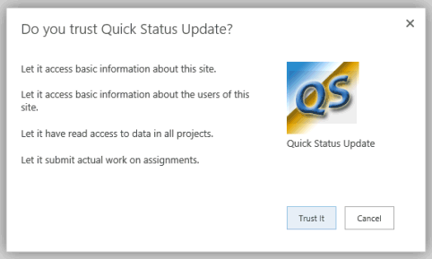

# <a name="create-a-sharepoint-hosted-project-server-add-in"></a>创建 SharePoint 托管的 Project Server 加载项

在可为 Project Online 创建的三种类型的应用程序 (自动承载、提供程序托管和 SharePoint 托管) 中, SharePoint 托管的应用程序是创建和部署的最简单的。 SharePoint 承载的应用程序不需要 OAuth 身份验证, 也不会使用 Azure, 也不需要维护提供程序承载的资源的本地网站。 Visual Studio 中的 " **SharePoint 相关应用程序**" 模板是一个方便的框架, 用于开发可在 Office 应用商店中发布和销售的应用程序, 或部署到 SharePoint 上的私有应用程序目录中的应用程序。 
  
在 project 中, statusing 是一个过程, 工作组成员可以使用 Project Web App 中的 "任务" 页来提交分配的任务的状态, 例如, 一周中每一天的工作小时数。 工作分配所有者 (通常为项目经理) 可以批准或拒绝状态。 如果状态为 "已批准", 则 Project 将重新计算计划。 **QuickStatus**应用程序显示已分配的任务, 用户可在其中快速更新所选工作分配的完成百分比和提交状态以供审批。 [! 注意] 尽管 Project Web App 中的 "任务" 页具有更多功能, 但**QuickStatus**应用程序是一个提供简化界面的示例。 
  
**QuickStatus**应用程序是开发人员的示例;它不应在生产环境中使用。 主要目的是显示 Project Online 的应用程序开发示例, 而不是创建功能齐全的 statusing 应用程序。 若要获得更好的 statusing 方法, 请参阅[后续步骤](#pj15_StatusingApp_NextSteps)中的建议。
  
有关 statusing 的一般信息, 请参阅[任务进度](https://support.office.com/article/Find-information-about-Project-Server-2013-8b08a414-15a7-4076-b2db-c90d0214ea7f?ui=en-US&rs=en-US&ad=US#BKMK_TaskProgress)。 有关开发 sharepoint 和 Project Server 外接程序的详细信息, 请参阅[SharePoint 外接程序](https://msdn.microsoft.com/library/jj163230.aspx)。

<a name="pj15_StatusingApp_Prerequisites"> </a>

## <a name="prerequisites-for-creating-an-app-for-project-server-2013"></a>为 Project Server 2013 创建应用程序的先决条件

若要开发可部署到 project Online 或本地安装的 project Server 2013 的相对简单的应用程序, 您可以使用 Napa, 它提供了联机开发环境。 对于更复杂的应用程序, 修改 Project Web App 功能区, 并在开发过程中更轻松地进行调试, 可以使用 Visual studio 2012 或 visual studio 2013。 例如, 在本地安装中, 可以手动检查 Project Server 数据库中的 "草稿" 数据表是否发生更改。 本文介绍如何使用 Visual Studio 进行应用程序开发。
  
使用 Visual Studio 开发 Project Server 应用程序需要满足以下条件:
  
- 确保您已在本地开发计算机上安装最新的 Service Pack 和 Windows 更新。操作系统可以是 Windows 7、Windows 8、Windows Server 2008 或 Windows Server 2012。
    
- 您必须具有安装了 SharePoint server 2013 和 Project Server 2013 的计算机, 其中的计算机配置为应用程序隔离和应用程序旁加载。 旁加载可使 Visual Studio 暂时安装用于调试的应用程序。 您可以使用 SharePoint 和 Project Server 的本地安装。 有关详细信息, 请参阅[设置 SharePoint 相关应用程序的本地开发环境](https://msdn.microsoft.com/library/fp179923%28Office.15%29.aspx)。
    
   > [!NOTE]
   > 对于本地安装, 请先配置一个独立的应用程序域,*然后再*创建一个企业应用程序目录。 
  
- 开发计算机可以是安装了 Visual Studio 2012 的 Office 开发人员工具的远程计算机。 确保已安装最新版本;请参阅[Office 相关应用程序和 SharePoint 下载](https://msdn.microsoft.com/office/apps/fp123627.aspx)的*工具*部分。
    
- 确认要用于开发和测试的 Project Web App 实例在浏览器中是可访问的。
    
有关使用联机工具的信息, 请参阅[在 Office 365 上设置用于开发 SharePoint 相关应用程序的环境](https://msdn.microsoft.com/library/fp161179.aspx)。 有关为使用联机工具的 Project Server 生成简单应用程序的演练, 请参阅 EPMSource 博客系列,[生成第一个 Project Server 应用程序](https://epmsource.com/2012/11/20/building-your-first-project-server-app-part-zerothe-introduction/)。

<a name="pj15_StatusingApp_UsingVisualStudio"> </a>

## <a name="using-visual-studio-to-create-a-project-server-app"></a>使用 Visual Studio 创建 Project Server 应用程序

Visual Studio 2012 的 Office 开发人员工具包括可与 Project Server 2013 一起使用的 SharePoint 应用程序模板。 创建应用程序解决方案时, 解决方案包含自定义代码的以下文件:
  
- **appmanifest.xml**包括应用程序标题、权限请求范围和其他属性的设置。 过程1包括使用清单设计器设置属性的步骤。 
    
- "页面" 文件夹中的 " **.aspx** " 是应用的主要页面。 步骤2演示如何为**QuickStatus**应用程序添加 HTML5 内容。 
    
- "脚本" 文件夹中的 **.js**是自定义 JavaScript 代码的主要文件。 过程3说明了**QuickStatus**应用程序的 JavaScript 代码。 
    
   如果添加了商业控件 (如基于 jQuery 的网格或日期选取器), 则可以在 default.aspx 文件中添加对其他 JavaScript 文件的引用。
    
- 内容文件夹中的**应用程序 css**是自定义 CSS3 样式的主要文件。 过程2和过程3包含有关**QuickStatus**应用的级联样式表 (CSS) 样式的信息。 您可以在默认 .aspx 文件中添加对其他 CSS 文件的引用。 
    
- Images 文件夹中的**AppIcon**是应用程序显示在 Office 应用商店或应用程序目录中的 96 x 96 图标。 
    
若要修改 Project Web App 功能区, 可以添加功能区自定义操作。 [QuickStatus 应用程序部分的示例代码](#pj15_StatusingApp_Example)包括修改后的 default.aspx、appmanifest.xml、web.xml 和文件的完整代码的代码示例。 
  
### <a name="procedure-1-to-create-an-app-project-in-visual-studio"></a>过程 1. 在 Visual Studio 中创建应用程序项目

1. 以管理员身份运行 Visual Studio 2012, 然后在 "开始" 页上选择 "**新建项目**"。 
    
2. 在 "**新建项目**" 对话框中, 展开 "**模板**"、" **Visual c #**" 和 " **Office/SharePoint** " 节点, 然后选择 "**应用程序**"。 在中心窗格顶部的 "目标框架" 下拉列表中, 使用默认的 **.net Framework 4.5** , 然后选择 "SharePoint 相关**应用程序 2013** " (参见图 1)。 
    
3. 在 "**名称**" 字段中, 键入 QuickStatus, 浏览到要保存应用程序的位置, 然后选择 **"确定"**。
    
   **图1。在 Visual Studio 中创建 Project Server 应用程序**

   
  
4. 在 "**新建 SharePoint 相关应用程序**" 对话框中, 填写以下三个字段: 
    
   - 在顶部文本框中, 键入您希望应用程序在 Project Web app 中显示的名称。 例如, 键入 "快速状态更新"。
    
   - 对于要用于调试的网站, 请键入 Project Web App 实例的 URL。 `https://ServerName/ProjectServerName`例如, 键入 (将_ServerName_和_ProjectServerName_替换为您自己的值), 然后选择 "**验证**"。 如果一切顺利, Visual Studio 会显示**连接成功**。 如果收到一条错误消息, 请确保 project Web App URL 正确无误, 并且 project Server 计算机已配置为应用程序隔离和应用程序旁加载。 有关详细信息, 请参阅[创建适用于 Project Server 2013 的应用程序](#pj15_StatusingApp_Prerequisites)一节中的先决条件。 
    
   - 在 "**您希望如何承载 sharepoint 相关应用程序**" 下拉列表中, 选择 " **sharepoint 托管**"。
    
   > [!CAUTION]
   > 如果您在错误的情况下选择**提供程序托管**的默认项目类型, Visual Studio 将在解决方案中创建两个项目: 一个**QuickStatus**项目和一个**QuickStatusWeb**项目。 如果看到两个项目, 请删除该解决方案, 然后重新开始。 
  
5. 选择 **"确定"** 以创建**QuickStatus**解决方案、 **QuickStatus**项目和默认文件。 
    
6. 打开清单设计器视图 (例如, 双击 appmanifest.xml 文件)。 在 "**常规**" 选项卡上, "**标题**" 文本框应显示您在步骤4中键入的应用名称。 选择 "**权限**" 选项卡, 为应用程序添加以下权限请求 (请参阅图 2): 
    
   - 在 "**权限请求**" 列表的第一行中, 在 "**范围**" 列中, 在下拉列表中选择 " **Statusing** "。 在 "**权限**" 列中, 选择 " **SubmitStatus**"。
    
   - 添加一个**范围**为**多个项目**且**权限**为 "已**读**" 的行。
    
   **图2。为 statusing 应用程序设置权限范围**

   
  
通过**QuickStatus**应用程序, Project Web app 用户可以从多个项目中读取该用户的分配, 更改分配的完成百分比, 并提交更新。 此应用程序不需要图2中的下拉列表中显示的其他权限请求范围。 权限请求作用域是指代表用户请求的应用程序的权限。 如果用户在 Project Web App 中没有这些权限, 则应用程序不会运行。 应用程序可以具有多个权限请求范围, 包括用于其他 SharePoint 权限的范围, 但只应具有应用程序功能所需的最低权限。 以下是与 Project Server 相关的权限请求范围: 

- **企业资源**: 资源管理器权限, 用于读取或写入其他 Project Web App 用户的相关信息。
    
- **多个项目**: 读取或写入多个项目, 其中的用户具有请求的权限。
    
- **project Server**: 要求应用程序用户拥有 Project Web app 的管理员权限。
    
- **报告**: 读取 project web app 的**ProjectData** OData 服务 (只需对 project web app 进行登录权限)。 
    
- **单个项目**: 读取或写入用户具有请求的权限的项目。
    
- **Statusing**: 提交工作分配状态的更新, 如 "工作时间"、"完成百分比" 和 "新工作分配"。
    
- **工作流**: 如果用户有权运行 Project Server 工作流, 则应用程序将使用提升的工作流权限运行。
    
有关 project Server 2013 的权限请求范围的详细信息, 请参阅 project*应用*程序[中面向开发人员的更新](updates-for-developers-in-project-2013.md)中的项目2013和[SharePoint 2013 中的应用程序权限](https://msdn.microsoft.com/library/fp142383.aspx)部分。


<a name="pj15_StatusingApp_HTML"> </a>

### <a name="creating-the-html-content-for-the-quickstatus-app"></a>为 QuickStatus 应用程序创建 HTML 内容

在开始编码 HTML 内容之前, 请为 QuickStatus 应用程序设计用户界面和用户体验 (图3显示了已完成页面的示例)。 设计还可以包含与 HTML 代码交互的 JavaScript 函数的概述。 有关一般信息, 请参阅[SharePoint 2013 中的应用程序 UX 设计](https://msdn.microsoft.com/library/fp179934.aspx)。
  
**图3。QuickStatus 应用程序页的设计**


  
应用程序在顶部显示显示名称, 这是 appmanifest.xml 中**Title**元素的值。 
  
默认情况下, 页面使用 HTML5。 以下是**QuickStatus**应用程序包含在页面正文中的主要 UI 对象的标准 HTML 元素: 
  
- **form**元素包含所有其他 UI 元素。 
    
- **字段集**元素为工作分配表创建容器和边框;子**图例**元素为容器提供标签。 
    
- **table**元素包含标题和表头。 JavaScript 函数更改表标题并为工作分配添加行。 
    
   > [!NOTE]
   > 为了方便地添加分页和排序, 生产应用程序可能会使用基于商业 jQuery 的网格控件而不是表。 
  
   该表包括项目名称的列、带有复选框的任务名称、实际工时、完成百分比、剩余工时和工作分配的完成日期。 JavaScript 函数创建每个任务的完成百分比的复选框和文本输入字段。
    
- 文本框的**input**元素设置所有选定工作分配的完成百分比。 
    
- **button**元素提交状态更改。 
    
- **button**元素刷新页面。 
    
- **button**元素将退出应用程序, 并返回到 Project Web app 中的 "任务" 页。 
    
底部的文本框和按钮元素位于**div**元素中, 因此, CSS 可以轻松地管理 UI 对象的位置和外观。 JavaScript 函数在页面底部添加一个段落, 其中包含状态更新成功或失败的结果。 
  
### <a name="procedure-2-to-create-the-html-content"></a>过程 2. 创建 HTML 内容

1. 在 Visual Studio 中, 打开 "默认 .aspx" 文件。
    
   该文件包含两个**asp: Content**元素: 具有该`ContentPlaceHolderID="PlaceHolderAdditionalPageHead"`属性的元素添加到页面页眉中, 且具有该`ContentPlaceHolderID="PlaceHolderMain"`属性的元素放置在页面**正文**元素中。 
    
2. 在页面`<asp:Content ContentPlaceHolderID="PlaceHolderAdditionalPageHead" runat="server">`页眉的控件中, 添加对 Project Server 计算机上的 .ps 文件的引用。 若要进行测试和调试, 可以使用 .ps。 
    
   ```HTML
     <script type="text/javascript" src="/_layouts/15/ps.debug.js"></script>
   ```

   应用程序基础结构在`/_layouts/15/` IIS 中使用 SharePoint 网站的虚拟目录。 物理文件为`%ProgramFiles%\Common Files\Microsoft Shared\Web Server Extensions\15\TEMPLATE\LAYOUTS\PS.debug.js`。
    
   > [!NOTE]
   > 在部署应用程序以供生产使用之前, `.debug`请从脚本引用中删除以提高性能。 
  
3. 在页面`<asp:Content ContentPlaceHolderID="PlaceHolderMain" runat="server">`正文的控件中, 删除生成的**div**元素, 然后为 UI 对象添加 HTML 代码。 **table**元素只包含一个标题行。 "**任务名称**" 列包含一个复选框输入控件。 在 app.config 文件中, 对**getUserInfo**函数的**onGetUserNameSuccess**回调替换**caption**元素的文本。 
    
    ```HTML
    <form>
        <fieldset>
        <legend>Select assigned tasks</legend>
        <table id="assignmentsTable">
            <caption id="tableCaption">Replace caption</caption>
            <thead>
            <tr id="headerRow">
                <th>Project name</th>
                <th><input type="checkbox" id="headercheckbox" checked="checked" />Task name</th>
                <th>Actual work</th>
                <th>% complete</th>
                <th>Remaining work</th>
                <th>Due date</th>
            </tr>
            </thead>
        </table>
        </fieldset>
        <div id="inputPercentComplete" >
        Set percent complete for all selected assignments, or leave this
        <br /> field blank and set percent complete for individual assignments: 
        <input type="text" name="percentComplete" id="pctComplete" size="4"  maxlength="4" />
        </div>
        <div id="submitResult">
        <p><button id="btnSubmitUpdate" type="button" class="bottomButtons" ></button></p>
        <p id="message"></p>
        </div>
        <div id="refreshPage">
        <p><button id="btnRefresh" type="button" class="bottomButtons" >Refresh</button></p>
        </div>
        <div id="exitPage">
        <p><button id="btnExit" type="button" class="bottomButtons" >Exit</button></p>
        </div>
    </form>
    ```

4. 在 app.config 文件中, 添加 UI 元素的位置和外观的 css 代码。 有关**QuickStatus**应用程序的完整 CSS 代码, 请参阅[QuickStatus 应用程序部分的代码示例](#pj15_StatusingApp_Example)。 
    
过程3添加 JavaScript 函数以读取工作分配并创建表行, 并更改和更新分配的完成百分比。 在开发应用程序时, 实际步骤更重复, 在这里您可以交替创建一些 html 代码, 添加和测试相关的样式和 JavaScript 函数, 修改或添加更多 html 代码, 然后重复该过程。

<a name="pj15_StatusingApp_JavaScript"> </a>

### <a name="creating-the-javascript-functions-for-the-quickstatus-app"></a>为 QuickStatus 应用程序创建 JavaScript 函数

SharePoint 应用程序的 Visual Studio 模板包括 app.config 文件, 该文件包含用于获取 SharePoint 客户端上下文的默认初始化代码, 并演示应用程序页的基本 get 和 set 操作。 SharePoint 客户端 SP .js 库的 JavaScript 命名空间为**SP**。 由于 Project Server 应用程序使用 .ps 库, 因此应用使用**ps**命名空间获取客户端上下文, 并访问 Project Server 的 JSOM。 
  
**QuickStatus**应用中的 JavaScript 函数包括以下各项: 
  
- 当文档对象模型 (DOM) 实例化时, 将运行文档**就绪**事件处理程序。 **就绪**事件处理程序将执行以下四个步骤: 
    
    1. 使用 Project Server JSOM 和**pwaWeb**全局变量的客户端上下文初始化**projContext**全局变量。 
        
    2. 调用**getUserInfo**函数来初始化**projUser**全局变量。 
        
    3. 调用**getAssignments**函数, 该函数将为用户获取指定的工作分配数据。 
        
    4. 将单击事件处理程序绑定到表标题复选框, 并将其绑定到表的每一行中的复选框。 当用户选中或清除表中的任何复选框时, 单击事件处理程序将管理复选框的**选中**属性。 
    
- 如果**getAssignments**函数成功, 它将调用**onGetAssignmentsSuccess**函数。 该函数在表中为每个分配插入一行, 初始化每行中的 HTML 控件, 然后初始化按钮的底部属性。 
    
- "**更新**" 按钮的**onClick**事件处理程序调用**updateAssignments**函数。 该函数获取应用于每个选定分配的完成百分比值;如果 "完成百分比" 文本框为空, 则该函数将获取表中每个选定工作分配的完成百分比。 然后, **updateAssignments**函数保存并提交状态更新, 并将有关结果的消息写入页面底部。 
    
### <a name="procedure-3-to-create-the-javascript-functions"></a>过程 3. 创建 JavaScript 函数

1. 在 Visual Studio 中, 打开应用程序 .js 文件, 然后删除文件中的所有内容。
    
2. 添加全局变量和文档**就绪**事件处理程序。 可以使用 jQuery 函数访问**document**对象。 
    
   "表标题的 click 事件处理程序" 复选框设置行复选框的选中状态。 如果所有的行复选框都已选中或全部清除, 则行的 click 事件处理程序将设置 "页眉" 复选框的选中状态。 click 事件处理程序还将页面底部的结果消息设置为一个空字符串。
    
   ```js
    var projContext;
    var pwaWeb;
    var projUser;
    // This code runs when the DOM is ready and creates a ProjectContext object.
    // The ProjectContext object is required to use the JSOM for Project Server.
    $(document).ready(function () {
        projContext = PS.ProjectContext.get_current();
        pwaWeb = projContext.get_web();
        getUserInfo();
        getAssignments();
        // Bind a click event handler to the table header check box, which sets the row check boxes
        // to the checked state of the header check box, and sets the results message to an empty string.
        $('#headercheckbox').live('click', function (event) {
            $('input:checkbox:not(#headercheckbox)').attr('checked', this.checked);
            $get("message").innerText = "";
        });
        // Bind a click event handler to the row check boxes. If any row check box is cleared, clear
        // the header check box. If all of the row check boxes are selected, select the header check box.
        $('input:checkbox:not(#headercheckbox)').live('click', function (event) {
            var isChecked = true;
            $('input:checkbox:not(#headercheckbox)').each(function () {
                if (this.checked == false) isChecked = false;
                $get("message").innerText = "";
            });
            $("#headercheckbox").attr('checked', isChecked);
        });
    });
   ```

3. 添加**getUserInfo**函数, 该函数将调用**onGetUserNameSuccess** (如果查询成功)。 **onGetUserNameSuccess**函数将**标题**段落的内容替换为包含用户名的表格标题。 
    
   ```js
        // Get information about the current user.
        function getUserInfo() {
            projUser = pwaWeb.get_currentUser();
            projContext.load(projUser);
            projContext.executeQueryAsync(onGetUserNameSuccess,
                // Anonymous function to execute if getUserInfo fails.
                function (sender, args) {
                    alert('Failed to get user name. Error: ' + args.get_message());
            });
        } 
        // This function is executed if the getUserInfo call is successful.
        function onGetUserNameSuccess() {
            var prefaceInfo = 'Assignments for ' + projUser.get_title();
            $('#tableCaption').text(prefaceInfo);
        }
   ```

4. 如果工作分配查询成功, 则添加**getAssignments**函数, 该函数调用**onGetAssignmentsSuccess** (请参阅第5步)。 "**包含**" 选项将查询限制为仅返回指定的字段。 
    
   ```js
    // Get the collection of assignments for the current user.
    function getAssignments() {
        assignments = PS.EnterpriseResource.getSelf(projContext).get_assignments();
        // Register the request that you want to run on the server. The optional "Include" parameter 
        // requests only the specified properties for each assignment in the collection.
        projContext.load(assignments,
            'Include(Project, Name, ActualWork, ActualWorkMilliseconds, PercentComplete, RemainingWork, Finish, Task)');
        // Run the request on the server.
        projContext.executeQueryAsync(onGetAssignmentsSuccess,
            // Anonymous function to execute if getAssignments fails.
            function (sender, args) {
                alert('Failed to get assignments. Error: ' + args.get_message());
            });
    }
   ```

5. 添加**onGetAssignmentsSuccess**函数, 该函数为表中的每个分配添加一行。 **prevProjName**变量用于确定行是否针对不同的项目。 如果是这样, 项目名称将以粗体显示;如果不是, 则将项目名称设置为空字符串。 
    
   > [!NOTE]
   > JSOM 不包括 CSOM 包含的**TimeSpan**属性, 例如**ActualWorkTimeSpan**。 相反, JSOM 使用属性的毫秒数, 例如[PS。actualWorkMilliseconds](https://msdn.microsoft.com/library/736bce1e-f734-0efe-6c5f-e0e891ab00ef%28Office.15%29.aspx)属性的 csom。 获取该属性的方法是**get\_actualWorkMilliseconds**, 这将返回一个整数值。 > **get_actualWork**方法返回一个字符串, 如 "3h"。 您可以使用**QuickStatus**应用中的任何一个值, 但以不同的方式显示。 "工作分配" 查询包含这两个属性, 因此您可以在调试过程中测试该值。 如果删除**actualWork**变量, 还可以在工作分配查询中删除**actualWork**属性。 
  
   最后, **onGetAssignmentsSuccess**函数使用 click 事件处理程序初始化 "**更新**" 按钮和 "**刷新**" 按钮。 也可以在 HTML 代码中设置 "**更新**" 按钮的文本值。 
    
   ```js
        // Get the enumerator, iterate through the assignment collection, 
        // and add each assignment to the table.
        function onGetAssignmentsSuccess(sender, args) {
            if (assignments.get_count() > 0) {
                var assignmentsEnumerator = assignments.getEnumerator();
                var projName = "";
                var prevProjName = "3D2A8045-4920-4B31-B3E7-9D0C5195FC70"; // Any unique name.
                var taskNum = 0;
                var chkTask = "";
                var txtPctComplete = "";
                // Constants for creating input controls in the table.
                var INPUTCHK = '<input type="checkbox" class="chkTask" checked="checked" id="chk';
                var LBLCHK = '<label for="chk';
                var INPUTTXT = '<input type="text" size="4"  maxlength="4" class="txtPctComplete" id="txt';
                while (assignmentsEnumerator.moveNext()) {
                    var statusAssignment = assignmentsEnumerator.get_current();
                    projName = statusAssignment.get_project().get_name();
                    // Get an integer, such as 3600000.
                    var actualWorkMilliseconds = statusAssignment.get_actualWorkMilliseconds(); 
                    // Get a string, such as "1h". Not used here.
                    var actualWork = statusAssignment.get_actualWork();
                    if (projName === prevProjName) {
                        projName = "";
                    }
                    prevProjName = statusAssignment.get_project().get_name();
                    // Create a row for the assignment information.
                    var row = assignmentsTable.insertRow();
                    taskNum++;
                    // Create an HTML string with a check box and task name label, for example:
                    // <input type="checkbox" class="chkTask" checked="checked" id="chk1" /> <label for="chk1">Task 1</label>
                    chkTask = INPUTCHK + taskNum + '" /> ' + LBLCHK + taskNum + '">' 
                        + statusAssignment.get_name() + '</label>';
                    txtPctComplete = INPUTTXT + taskNum + '" />';
                    // Insert cells for the assignment properties.
                    row.insertCell().innerHTML = '<strong>' + projName + '</strong>';
                    row.insertCell().innerHTML = chkTask;
                    row.insertCell().innerText = actualWorkMilliseconds / 3600000 + 'h';
                    row.insertCell().innerHTML = txtPctComplete;
                    row.insertCell().innerText = statusAssignment.get_remainingWork();
                    row.insertCell().innerText = statusAssignment.get_finish();
                    // Initialize the percent complete cell.
                    $get("txt" + taskNum).innerText = statusAssignment.get_percentComplete() + '%'
                }
            }
            else {
                $('p#message').attr('style', 'color: #0f3fdb');     // Blue text.
                $get("message").innerText = projUser.get_title() + ' has no assignments'
            }
            // Initialize the button properties.
            $get("btnSubmitUpdate").onclick = function() { updateAssignments(); };
            $get("btnSubmitUpdate").innerText = 'Update';
            $get('btnRefresh').onclick = function () { window.location.reload(true); };
            $get('btnExit').onclick = function () { exitToPwa(); };
        }
   ```

6. 为 "**更新**" 按钮添加**updateAssignments** click 事件处理程序。 当用户更改任务的完成百分比值或在 "**百分比**" 文本框中添加值时, 可以输入几种格式的值, 例如 "60"、"60%" 或 "60%"。 **getNumericValue**方法返回输入文本的数字值。 
    
   > [!NOTE]
   > 在专为生产使用而设计的应用程序中, 数值信息的输入值应包括字段验证和其他错误检查。 
  
   **updateAssignments**示例包括一些基本的错误检查, 并在页面底部的**邮件**段落中显示信息—绿色如果更新查询成功, 如果有输入错误或更新查询, 则显示红色。多次. 
    
   在使用**submitAllStatusUpdates**方法之前, 应用必须使用 PS 将更新保存到服务器 **。StatusAssignmentCollection**方法。 
    
   ```js
        // Update all checked assignments. If the bottom percent complete field is blank,
        // use the value in the % complete field of each selected row in the table.
        function updateAssignments() {
            // Get percent complete from the bottom text box.
            var pctCompleteMain = getNumericValue($('#pctComplete').val()).trim();
            var pctComplete = pctCompleteMain;
            var assignmentsEnumerator = assignments.getEnumerator();
            var taskNum = 0;
            var taskRow = "";
            var indexPercent = "";
            var doSubmit = true;
            while (assignmentsEnumerator.moveNext()) {
                var pctCompleteRow = "";
                taskRow = "chk" + ++taskNum;
                if ($get(taskRow).checked) {
                    var statusAssignment = assignmentsEnumerator.get_current();
                    if (pctCompleteMain === "") {
                        // Get percent complete from the text box field in the table row.
                        pctCompleteRow = getNumericValue($('#txt' + taskNum).val());
                        pctComplete = pctCompleteRow;
                    }
                    // If both percent complete fields are empty, show an error.
                    if (pctCompleteMain === "" && pctCompleteRow === "") {
                        $('p#message').attr('style', 'color: #e11500');     // Red text.
                        $get("message").innerHTML =
                            '<b>Error:</b> Both <i>Percent complete</i> fields are empty, in row '
                            + taskNum
                            + ' and in the bottom textbox.<br/>One of those fields must have a valid percent.'
                            + '<p>Please refresh the page and try again.</p>';
                        doSubmit = false;
                        taskNum = 0;
                        break;
                    }
                    if (doSubmit) statusAssignment.set_percentComplete(pctComplete);
                }
            } 
            // Save and submit the assignment updates.
            if (doSubmit) {
                assignments.update();
                assignments.submitAllStatusUpdates();
                projContext.executeQueryAsync(function (source, args) {
                    $('p#message').attr('style', 'color: #0faa0d');     // Green text.
                    $get("message").innerText = 'Assignments have been updated.';
                }, function (source, args) {
                    $('p#message').attr('style', 'color: #e11500');     // Red text.
                    $get("message").innerText = 'Error updating assignments: ' + args.get_message();
                });
            }
        }
        // Get the numeric part for percent complete, from a string. For example, with "20 %", return "20".
        function getNumericValue(pctComplete) {
            pctComplete = pctComplete.trim();
            pctComplete = pctComplete.replace(/ /g, "");    // Remove interior spaces.
            indexPercent = pctComplete.indexOf('%', 0);
            if (indexPercent > -1) pctComplete = pctComplete.substring(0, indexPercent);
            return pctComplete;
        }
   ```

7. 添加**exitToPwa**函数, 该函数使用主机项目 Web App 网站的 URL 的**SPHostUrl**查询字符串参数。 若要导航回 "任务" 页, `"/Tasks.aspx"`请追加到 URL。 例如, **spHostUrl**变量将设置为`https://ServerName/ProjectServerName/Tasks.aspx`。
    
   **getQueryStringParameter**函数拆分**QuickStatus**页面的 url, 以在 URL 选项中提取并返回指定的参数。 以下是文档的示例 **。** **QuickStatus**文档的 URL 值 (全部位于一行中): 
    
   ```HTML
    https://app-ef98082fa37e3c.servername.officeapps.selfhost.corp.microsoft.com/pwa/
        QuickStatus/Pages/Default.aspx
        ?SPHostUrl=https%3A%2F%2Fsphvm%2D85178%2Fpwa
        &SPLanguage=en%2DUS
        &SPClientTag=1
        &SPProductNumber=15%2E0%2E4420%2E1022
        &SPAppWebUrl=https%3A%2F%2Fapp%2Def98082fa37e3c%2Eservername
            %2Eofficeapps%2Eselfhost%2Ecorp%2Emicrosoft%2Ecom%2Fpwa%2FQuickStatus
   ```

   对于前面的 URL, **getQueryStringParameter**函数将返回**SPHostUrl**查询字符串值`https://ServerName/pwa`。 
    
   ```js
        // Exit the QuickStatus page and go back to the Tasks page in Project Web App.
        function exitToPwa() {
            // Get the SharePoint host URL, which is the top page of PWA, and add the Tasks page.
            var spHostUrl = decodeURIComponent(getQueryStringParameter('SPHostUrl'))
                            + "/Tasks.aspx";
            // Set the top window for the QuickStatus IFrame to the Tasks page.
            window.top.location.href = spHostUrl;
        }
        // Get a specified query string parameter from the {StandardTokens} URL option string.
        function getQueryStringParameter(urlParameterKey) {
            var docUrl = document.URL;
            var params = docUrl.split('?')[1].split('&');
            for (var i = 0; i < params.length; i++) {
                var theParam = params[i].split('=');
                if (theParam[0] == urlParameterKey)
                    return decodeURIComponent(theParam[1]);
            }
        }
   ```

如果此时发布**QuickStatus**应用程序并将其添加到 Project Web app, 则可以从 "网站内容" 页运行该应用程序, 但用户无法轻松使用该应用程序。 若要帮助用户查找和运行应用程序, 可以向 "任务" 页上的功能区中添加一个按钮。 步骤4说明如何添加功能区自定义操作。 

<a name="pj15_StatusingApp_ribbon"> </a>

### <a name="adding-a-ribbon-custom-action"></a>添加功能区自定义操作

project Web App 的功能区选项卡、组和控件在 pwaribbon 文件中进行指定, 该文件安装在运行 Project `[Program Files]\Common Files\Microsoft Shared\Web Server Extensions\15\TEMPLATE\FEATURES\PWARibbon\listtemplates` Server 的计算机上的目录中。 为了帮助设计 project Web App 功能区的自定义操作, project 2013 SDK 下载包含 pwaribbon 的副本。 
  
project web app 对 "任务" 页面使用不同的功能区定义, 具体取决于 project web app 实例是否使用单一进入模式, 使用户能够输入时间表和任务状态的值。 如果您具有 Project Web App 的管理权限, 则要确定输入模式, 请在页面右上角的下拉设置菜单中选择 " **PWA 设置**"。 在 "PWA 设置" 页上, 选择 "**时间表设置和默认值**", 然后查看页面底部的 "**单输入模式**" 复选框。 
  
当 "单输入模式" 关闭时, "任务" 页面上的功能区由 pwaribbon 中的 "我的工作" 区域定义: 
  
```XML
   <!-- REGION My Work Ribbon-->
   <CustomAction
      Id="Ribbon.ContextualTabs.MyWork"
      . . .
```

当单输入模式处于打开状态时, "任务" 页面功能区由 pwaribbon 中的绑定模式区域定义: 
  
```XML
   <!-- REGION Tied Mode Ribbon-->
   <CustomAction
      Id="Ribbon.ContextualTabs.TiedMode"
      . . .
```

虽然每个区域中的组和控件的外观相似, 但绑定模式的控件可以调用与非绑定模式相同的控件的不同功能。 步骤4显示当 "单输入模式" 处于关闭状态时 ("**单输入模式**" 复选框处于清除状态时) 如何添加**QuickStatus**应用的 button 控件。 
  
> [!NOTE]
> 有关将自定义操作添加到功能区或 sharepoint 应用程序中的菜单的常规信息, 请参阅[创建自定义操作以部署 sharepoint 相关应用](https://msdn.microsoft.com/library/jj163954.aspx)程序。 
  
### <a name="procedure-4-to-add-a-ribbon-custom-action-to-the-tasks-page"></a>过程 4. 将功能区自定义操作添加到 "任务" 页

1. 检查 Project Web App 中 "任务" 页上的功能区。 选择功能区上的 "**任务**" 选项卡, 并规划如何修改它。 共有七个组, 例如 "**提交**"、"**任务**" 和 "**时间段**"。 "**提交**" 组包含两个控件: "**保存**" 按钮和 "**发送状态**" 下拉菜单。 您可以在组中的任何位置添加控件, 在 "**任务**" 选项卡中的任意位置添加一个包含新控件的组, 或者添加另一个具有自定义组和控件的功能区选项卡。 在此示例中, 我们向 "**提交**" 组中添加第三个按钮, 其中按钮将调用**QuickStatus**应用程序的 URL。 
    
2. 在 Visual Studio 中的 "**解决方案资源管理器**" 窗格中, 右键单击 " **QuickStatus** " 项目, 然后添加新项目。 在 "**添加新项**" 对话框中, 选择 "**功能区自定义操作**" (请参阅图 4)。 例如, 将自定义操作命名为 RibbonQuickStatusAction, 然后选择 "**添加**"。
    
   **图4。添加功能区自定义操作**

   
  
3. 在 "**创建面向功能区的自定义操作**向导" 的第一页上, 保持 "**主机 Web** " 选项处于选中状态, 在自定义操作范围的下拉列表中选择 "**无**", 然后选择 "**下一步**" (请参阅图 5)。 下拉列表中的项与 SharePoint 相关, 而不适用于 Project Server。 我们将把大部分生成的 XML 替换为自定义操作, 使其适用于 Project Server。 
    
   **图5。指定功能区自定义操作的属性**

   
  
4. 在 "**创建功能区的自定义操作**向导" 的下一页上, 保留设置的所有默认值, 然后选择 "**完成**" (请参阅图 6)。 Visual Studio 创建**RibbonQuickStatusAction**文件夹, 其中包含一个元素 .xml 文件。 
    
   **图6。指定按钮控件的设置**

   
  
5. 修改功能区自定义操作的元素 .xml 文件中的默认生成代码。 以下是默认的 XML 代码:
    
   ```XML
    <?xml version="1.0" encoding="utf-8"?>
    <Elements xmlns="https://schemas.microsoft.com/sharepoint/">
        <CustomAction Id="21ea3aaf-79e5-4aac-9479-8eef14b4d9df.RibbonQuickStatusAction"
                    Location="CommandUI.Ribbon"
                    Sequence="10001"
                    Title="Invoke &apos;RibbonQuickStatusAction&apos; action">
        <CommandUIExtension>
            <!-- 
            Update the UI definitions below with the controls and the command actions
            that you want to enable for the custom action.
            -->
            <CommandUIDefinitions>
            <CommandUIDefinition Location="Ribbon.ListItem.Actions.Controls._children">
                <Button Id="Ribbon.ListItem.Actions.RibbonQuickStatusActionButton"
                        Alt="Request RibbonQuickStatusAction"
                        Sequence="100"
                        Command="Invoke_RibbonQuickStatusActionButtonRequest"
                        LabelText="Request RibbonQuickStatusAction"
                        TemplateAlias="o1"
                        Image32by32="_layouts/15/images/placeholder32x32.png"
                        Image16by16="_layouts/15/images/placeholder16x16.png" />
            </CommandUIDefinition>
            </CommandUIDefinitions>
            <CommandUIHandlers>
            <CommandUIHandler Command="Invoke_RibbonQuickStatusActionButtonRequest"
                                CommandAction="~appWebUrl/Pages/Default.aspx"/>
            </CommandUIHandlers>
        </CommandUIExtension >
        </CustomAction>
    </Elements>
   ```

   1. 在**CustomAction**元素中, 删除**Sequence**属性和**Title**属性。 
    
   2. 若要向 "**提交**" 组中添加控件, 请在 pwaribbon 文件`Ribbon.ContextualTabs.MyWork.Home.Groups`中查找集合中的第一个组, 该集合是开始的元素`<Group Id="Ribbon.ContextualTabs.MyWork.Home.Page" Command="PageGroup" Sequence="10" Title="$Resources:pwafeatures,PAGE_PDP_CM_SUBMIT"`。 若要将子控件添加到 "**提交**" 组中, 以下代码将显示**CommandUIDefinition**元素在元素 .xml 文件中的正确**位置**属性: 
    
      ```XML
        <CommandUIDefinitions>
          <CommandUIDefinition Location="Ribbon.ContextualTabs.MyWork.Home.Page.Controls._children">
             . . .
          </CommandUIDefinition>
        </CommandUIDefinitions>
      ```

   3. 更改子**按钮**元素的属性值, 如下所示: 
    
       ```XML
            <Button Id="Ribbon.ContextualTabs.MyWork.Home.Page.QuickStatus"
                    Alt="Quick Status app"
                    Sequence="30"
                    Command="Invoke_QuickStatus"
                    LabelText="Quick Status"
                    TemplateAlias="o1"
                    Image16by16="_layouts/15/1033/images/ps16x16.png" 
                    Image16by16Left="-80"
                    Image16by16Top="-144"
                    Image32by32="_layouts/15/1033/images/ps32x32.png" 
                    Image32by32Left="-32"
                    Image32by32Top="-288" 
                    ToolTipTitle="QuickStatus"
                    ToolTipDescription="Run the QuickStatus app" />
       ```

       - 若要使按钮成为组中的第三个控件, **Sequence**属性可以是任何高于现有**发送状态**控件 (在 pwaribbon 中为**FlyoutAnchor**元素) 的`Sequence="20"`值的任何数字。 按照约定, 组和控件的序列号是`10, 20, 30, …`, 这样可以在中间位置中插入元素。
    
       - **command**属性指定要在**CommandUIHandler**元素中运行的命令 (请参阅下面的步骤 5. d)。 您可以简化命令名称以使下一位开发人员更轻松。 例如`Command="Invoke_QuickStatus"` , 更易于读取`Command="Invoke_RibbonQuickStatusActionButtonRequest"`。
    
       - 图像属性指定 "按钮" 控件的 16 x 16 像素图标和 32 x 32 像素图标。 在 default 元素 .xml 文件中, `Image32by32="_layouts/15/images/placeholder32x32.png"`指定一个橙色点。 您可以从在运行 Project Server 的计算机上的`[Program Files]\Common Files\Microsoft Shared\Web Server Extensions\15\TEMPLATE\LAYOUTS\1033\IMAGES`目录中安装的图像映射文件 (ps16x16 和 ps32x32) 中提取图标。 例如, 32 x 32-像素图标位于左侧图标的第二列中, 从 ps32x32 图像地图顶部向下第十行 (图标的顶部位于第九行的末尾后面; 9 行 x 32 像素/行 = 288 像素)。 
    
       - 若要显示 "按钮" 控件的工具提示, 请添加**ToolTipTitle**属性和**ToolTipDescription**属性。 
    
    4. 更改**CommandUIHandler**元素的属性。 例如, 确保**command**属性与**Button**元素的**command**属性值相匹配。 对于**CommandAction**属性, `~appWebUrl`是**QuickStatus**网页的 URL 的占位符。 当功能区按钮调用**QuickStatus**应用程序时, **{StandardTokens}** 令牌将替换为包含**SPHostUrl**、 **SPLanguage**、 **SPClientTag**、 **SPProductNumber**和 SPAppWebUrl 的 URL 选项。 ****.
    
        ```XML
            <CommandUIHandlers>
                <CommandUIHandler Command="Invoke_QuickStatus"
                                  CommandAction="~appWebUrl/Pages/Default.aspx?{StandardTokens}"/>
            </CommandUIHandlers>
        ```

6. 在 "**解决方案资源管理**器" 中, 打开 " **Feature1**设计器", 并将 " **RibbonQuickStatusAction** " 项目从 **"解决方案**" 窗格中的项目移到**功能窗格中的项目**。 如果随后打开**包**设计器, 则**RibbonQuickStatusAction**项将位于包窗格中的**项**中。 
    
在开发应用程序并添加功能区按钮时, 通常会测试应用并在 JavaScript 代码中设置断点以进行调试。 当您按**F5**启动调试时, Visual Studio 会编译应用程序, 将其部署到在**QuickStatus**项目的 "**网站 URL** " 属性中指定的网站, 并显示一页, 询问您是否信任该应用程序。 在继续操作后退出**QuickStatus**应用程序时, 它会返回到 Project Web app 中的任务页面。 

> [!NOTE]
> 图7显示功能区的 "**任务**" 选项卡上的 "**快速状态**" 按钮已禁用。 在使用 Visual Studio 进行许多调试部署后, 在同一测试服务器上继续调试或部署已发布的应用程序时, 可能会阻止自定义功能区控件。 若要启用按钮, 请删除 Visual Studio 中的**RibbonQuickStatusAction**项, 然后创建一个具有不同名称和 ID 的新的功能区操作。 如果这不能解决问题, 请尝试从 Project Web app 测试实例中删除应用程序, 然后使用不同的应用 ID 重新创建应用。 
  
**图7。查看已禁用的快速状态按钮的工具提示**


  
步骤5显示了如何部署和安装**QuickStatus**应用程序。 步骤6显示了在安装应用程序后测试该应用程序的一些额外步骤。 

<a name="pj15_StatusingApp_Deploying"> </a>

## <a name="deploying-the-quickstatus-app"></a>部署 QuickStatus 应用程序

有几种方法可将应用程序部署到 SharePoint web 应用程序 (如 Project web app)。 您使用哪种部署取决于您想要将应用程序发布到专用 SharePoint 目录还是发布到公共 Office 商店, 以及 SharePoint 是安装在本地还是在线租赁。 步骤5显示了如何将**QuickStatus**应用程序部署到私有应用程序目录中的本地安装。 有关详细信息, 请参阅[安装和管理 sharepoint 相关应用程序 2013](https://technet.microsoft.com/library/fp161232.aspx)和[发布 sharepoint 相关应用](https://msdn.microsoft.com/library/jj164070.aspx)程序
  
> [!NOTE]
> 将应用程序添加到 sharepoint 目录需要 SharePoint 管理员权限。 
  
### <a name="procedure-5-to-deploy-the-quickstatus-app"></a>过程 5. 部署 QuickStatus 应用程序

1. 在 Visual Studio 中, 保存所有文件, 然后在 "**解决方案资源管理器**" 中右键单击 " **QuickStatus** " 项目, 然后选择 "**发布**"。
    
2. 由于**QuickStatus**应用程序是 SharePoint 托管的, 因此发布的选项非常少 (请参阅图 8)。 在 "**发布 Office 和 SharePoint 相关应用程序**" 对话框中, 选择 "**完成**"。
    
   **图8。发布 QuickStatus 应用程序**

   
  
3. 将 QuickStatus 文件从`~\QuickStatus\bin\Debug\app.publish\1.0.0.0`目录复制到本地计算机上的方便目录 (或本地安装的 SharePoint 计算机)。 
    
4. 在 SharePoint 管理中心中, 选择 "快速启动" 中的 "**应用程序**", 然后选择 "**管理应用程序目录**"。
    
5. 如果应用程序目录不存在, 请按照在[SharePoint 2013 中管理应用程序目录](https://technet.microsoft.com/library/fp161234.aspx)中的 "*为 web 应用程序配置应用程序目录网站*" 部分, 为应用程序目录创建网站集。
    
   如果存在应用程序目录, 则导航到 "管理应用程序目录" 页上的 "网站 URL"。 例如, 在以下步骤中, 应用程序目录网站为`https://ServerName/sites/TestApps`。
    
6. 在 "应用程序目录" 页上, 选择 "快速启动" 中的 " **SharePoint 相关应用程序**"。 在 "SharePoint 相关应用程序" 页上, 在功能区的 "**文件**" 选项卡上, 选择 "**上载文档**"。
    
7. 在 "**添加文档**" 对话框中, 浏览 QuickStatus 文件, 为版本添加注释, 然后选择 **"确定"**。
    
8. 添加应用程序时, 您还可以添加应用程序说明、图标和其他信息的本地信息。 在 " **sharepoint 相关应用程序-QuickStatus** " 对话框中, 添加要在 sharepoint 网站集中为该应用程序显示的信息。 例如, 添加以下信息: 
    
   1. **短说明**字段: 键入快速状态测试应用。
    
   2. **说明**字段: 键入测试应用程序以更新多个项目中的任务的完成百分比。
    
   3. **图标 URL**字段: 将应用程序图标的 96 x 96 像素图像添加到应用程序目录的网站资产中。 例如, 导航到`https://ServerName/sites/TestApps`, 选择 "**设置**" 下拉菜单中的 "**网站内容**", 选择 "**网站资产**", 然后添加 "quickStatusApp" 图像。 右键单击 " **quickStatusApp** " 项目, 选择 "**属性**", 然后在 "**属性**" 对话框中复制 "**地址 (URL)** " 值。 例如, 复制`https://ServerName/sites/TestApps/SiteAssets/QuickStatusApp.png`并粘贴 "**图标 URL** web 地址" 字段中的值。 键入图标的说明 (例如, 如图9所示), 键入 QuickStatus app 图标。 测试 URL 是否有效。
    
      **图9。为 QuickStatus 应用程序添加图标 URL**

      
  
   4. **类别**字段: 选择现有的类别, 或指定自己的值。 例如, 键入 Statusing。
    
      > [!NOTE]
      > 名为 " **Statusing** " 的类别仅用于测试目的。 project Server 应用程序的典型类别是**项目管理**。 
  
   5. "**发布者名称**" 字段: 键入发布服务器的名称。 在此示例中, 键入 Project SDK。
    
   6. **启用**的字段: 若要使应用程序对 Project Web app 网站管理员的安装可见, 请选中 "**已启用**" 复选框。 
    
   7. 其他字段是可选的。 例如, 您可以为应用程序详细信息页添加支持 URL 和多个帮助图像。 图9中的 "**图像 URL 1** " 字段包含应用程序屏幕截图的 URL 和屏幕截图的说明。 
    
   8. 在 " **SharePoint 相关应用程序-QuickStatus** " 对话框中, 选择 "**保存**"。 图9中的 "SharePoint 相关应用程序库中的**快速状态更新**" 项已签出, 因此在对话框功能区的 "**编辑**" 选项卡上, 选择 "**签入**" 以完成此过程 (见图 10)。 
    
      **图10。将 QuickStatus 应用程序添加到 SharePoint 相关应用程序库。**

      将![QuickStatus 应用程序添加到 SharePoint]将(media/pj15_CreateStatusingApp_AddAppToSharePoint.gif "QuickStatus 应用程序添加到 SharePoint")
  
9. 在 Project Web App 的 "**设置**" 下拉菜单中, 选择 "**添加应用程序**"。 在 "应用程序" 页上的 "快速启动" 中, 选择 "**来自您的组织**", 然后选择 "**快速状态更新**" 应用程序的 "**应用程序详细信息**"。 图11显示了带有在上一步中添加的应用程序图标、屏幕截图和其他信息的详细信息页。 
    
   **图11。使用 Project Web App 中的 "快速状态更新详细信息" 页**

   
  
10. 在 "快速状态更新详细信息" 页上, 选择 "**添加**"。 Project Web App 显示一个对话框, 其中列出了 QuickStatus 应用程序可以执行的操作 (见图 12)。 操作列表派生自 appmanifest.xml 文件中的**AppPermissionRequest**元素。 
    
    **图12。验证您是否信任 "快速状态" 应用程序**

    
  
11. 在 "**是否信任快速状态更新**" 对话框中, 选择 "**信任它**"。 该应用程序将添加到 Project Web app "网站内容" 页面 (见图 13)。
    
    **图13。查看 "网站内容" 页上的 "快速状态" 应用程序**

    
  
在 "网站内容" 页上, 您可以选择 "**快速状态更新**" 图标以运行应用程序。

> [!NOTE]
> 有关提供有关应用程序的信息的其他命令, 请在 "网站内容" 页上, 选择包含 "**快速状态更新**" 名称和省略号 ("...") 的区域。您可以查看应用程序的 "关于" 页、查看包含应用程序错误信息的 "应用程序详细信息" 页、查看 "应用程序权限" 页或从 Project Web app 中删除该应用程序。 
  
在 Project Web App 的 "任务" 页上 (见图 14), 应在功能区上启用 " **QuickStatus** " 按钮。 如果 "**快速状态**" 按钮处于禁用状态, 请尝试图7的注释中所述的操作。 

**图14。从 "任务" 选项卡启动 QuickStatus 应用程序**


  
过程6显示了使用 QuickStatus 应用程序进行的一些测试。

<a name="pj15_StatusingApp_Testing"> </a>

## <a name="testing-the-quickstatus-app"></a>测试 QuickStatus 应用程序

在将应用程序部署到生产服务器或 project Online 的生产租户之前, 应在 project server 的测试安装上测试用户在**QuickStatus**应用程序中可能尝试的每个操作。 通过测试安装, 您可以更改和删除用户的工作分配, 而不会影响实际项目。 测试还应涉及几个具有不同权限集的用户, 如管理员、项目经理和团队成员。 全面测试可以发现应在应用程序中进行的更改, 在开发过程中测试不明显。 过程6列出了**QuickStatus**应用程序的多个测试, 但不包括一系列详尽的测试。 
  
### <a name="procedure-6-to-test-the-quickstatus-app"></a>过程 6. 测试 QuickStatus 应用程序

1. 运行用户没有工作分配的**QuickStatus**应用程序。 应用程序应在页面底部显示一条蓝色消息, 例如, "用户名"**没有分配**。
    
   选择 "**更新**", 并更新对绿色**分配**的邮件所做的更改。
    
   > [!NOTE]
   > 应更改应用程序行为, 以便在没有工作分配时禁用 "**更新**" 按钮。 
  
2. 运行用户在多个不同的项目中有多个分配的应用程序, 并且一些工作分配不完整。 请注意应用程序的外观, 并按如下所示执行操作 (请参阅图 15):
    
   1. **onGetAssignmentsSuccess**函数为当前用户的每个分配在表中创建一行。 项目名称仅以粗体显示一次, 每个项目中的第一个工作分配。 
    
   2. 清除 "**任务名称**" 列标题中的复选框。 表头单击事件处理程序将清除任务行中的所有其他复选框。 
    
   3. 选择所有任务。 每个行的 click 事件处理程序确定是否选择了所有行, 如果是, 则选择 "**任务名称**" 列标题。 
    
   4. 再次清除所有复选框, 然后选择一个具有剩余工时的工作分配。 例如, 图15显示了首要任务 T1 的剩余 20% 的工作要完成。
    
   5. 在 "**设置完成百分比**" 文本框中, 键入 80, 然后选择 "**更新**"。 页面底部应显示绿色消息, 已**更新分配**。
    
      **图15。更新 QuickStatus 应用程序中的工作分配**

      
  
3. 选择 "**刷新**" (见图 16)。 再次选择所有任务, 最上面的任务显示已完成 80%。 
    
      **图16。刷新快速状态更新页面**

      
  
4. 清除所有复选框, 然后选择 "另一任务"。 例如,**从 PWA 中选择 "新建任务**"。 将 "**设置完成百分比**" 文本框保留为空, 删除选定任务的 "**完成**百分比" 列中的所有文本, 然后选择 "**更新**"。 由于两个文本框均为空, 因此应用程序显示红色错误消息 (见图 17)。
    
      **图17。测试错误消息**

      
  
5. 将上一个任务更新为已完成的 80%, 然后选择 "**退出**"。 **exitToPwa**函数将浏览器窗口的位置更改为 SharePoint 主机应用程序中的任务页面 (即 URL 更改为https://ServerName/pwa/Tasks.aspx))。 图18显示了**T1**任务和**来自 PWA 任务的新任务**, 每个显示的完成百分比为 80%。 
    
      **图18。验证 Project Web App 中的任务是否已更新**

      
  
6. 在 project Professional 2013 中显示已更新的状态之前, 必须提交更改以供审批, 然后由项目经理批准。
    
测试显示了在**QuickStatus**应用程序中应进行的几个其他更改, 以提高可用性。 例如：

- 应对文本框的值进行其他错误检查和验证。 目前, 用户可以输入一个非数值或负值的完成百分比, 这将导致 unfriendly 错误消息。 例如, 如果值为负值, 则错误消息会在**更新工作分配时出错: PJClientCallableException: StatusingSetDataValueInvalid**。
    
- 空白文本框的错误消息可以列出项目和任务, 以及行号。
    
- 成功的消息可能包括更新的任务的列表;如果**updateAssignments**函数成功, 它可以执行自动页面刷新, 并以不同的颜色和粗体字显示更新的任务或百分比。 
    
- 若要避免一个非常大的表格, 工作分配的表应限制为少于 100% 的任务已完成。 或者, 添加一个选项以显示所有任务。 此外, 还可以使用基于 jQuery 的网格 (而不是表) 来解决此问题, 您可以在其中轻松实现筛选和网格分页。
    
- 由于**QuickStatus**应用不会提交状态, 功能区的 "**任务**" 选项卡上的 "**快速状态**" 图标将更逻辑地成为 "**任务**" 组中的第一个图标, 而不是 "**提交**" 组中的最后一个图标。 
    
- 由于**onGetAssignmentsSuccess**函数初始化**btnSubmitUpdate**按钮文本, 但其他按钮文本值是在 HTML 中初始化的, 因此在**getAssignments**中, 页面将保持部分初始化状态。函数运行。 如果文本值全部以 HTML 格式初始化, 则页面上的按钮将显示为更一致。 
    
最重要的是, **QuickStatus**应用程序使用的方法, 在其中更改工作分配的完成百分比应在生产应用中进行修订。 有关详细信息, 请参阅 "[后续步骤](#pj15_StatusingApp_NextSteps)" 部分。 

<a name="pj15_StatusingApp_Example"> </a>

## <a name="example-code-for-the-quickstatus-app"></a>QuickStatus 应用程序示例代码

### <a name="defaultaspx-file"></a>默认 .aspx 文件

以下代码位于**QuickStatus**项目的`Pages\Default.aspx`文件中: 
  
```HTML
    <%-- The following lines are ASP.NET directives needed when using SharePoint components --%>
    <%@ Page Inherits="Microsoft.SharePoint.WebPartPages.WebPartPage, Microsoft.SharePoint, Version=15.0.0.0, 
    Culture=neutral, PublicKeyToken=71e9bce111e9429c" MasterPageFile="~masterurl/default.master" Language="C#" %>
    <%@ Register TagPrefix="Utilities" Namespace="Microsoft.SharePoint.Utilities" Assembly="Microsoft.SharePoint, Version=15.0.0.0, 
    Culture=neutral, PublicKeyToken=71e9bce111e9429c" %>
    <%@ Register TagPrefix="WebPartPages" Namespace="Microsoft.SharePoint.WebPartPages" Assembly="Microsoft.SharePoint, Version=15.0.0.0, 
    Culture=neutral, PublicKeyToken=71e9bce111e9429c" %>
    <%@ Register TagPrefix="SharePoint" Namespace="Microsoft.SharePoint.WebControls" Assembly="Microsoft.SharePoint, Version=15.0.0.0, 
    Culture=neutral, PublicKeyToken=71e9bce111e9429c" %>
    <%-- The markup and script in the following Content element will be placed in the <head> of the page.
        For production deployment, change the .debug.js JavaScript references to .js. --%>
    <asp:Content ContentPlaceHolderID="PlaceHolderAdditionalPageHead" runat="server">
    <script type="text/javascript" src="../Scripts/jquery-1.7.1.min.js"></script>
    <script type="text/javascript" src="/_layouts/15/sp.runtime.debug.js"></script>
    <script type="text/javascript" src="/_layouts/15/sp.debug.js"></script>
    <script type="text/javascript" src="/_layouts/15/ps.debug.js"></script>
    <!-- CSS styles -->
    <link rel="Stylesheet" type="text/css" href="../Content/App.css" />
    <!-- Add your JavaScript to the following file -->
    <script type="text/javascript" src="../Scripts/App.js"></script>
    </asp:Content>
    <%-- The markup and script in the following Content element will be placed in the <body> of the page --%>
    <asp:Content ContentPlaceHolderID="PlaceHolderMain" runat="server">
    <form>
        <fieldset>
        <legend>Select assigned tasks</legend>
        <table id="assignmentsTable">
            <caption id="tableCaption">Replace caption</caption>
            <thead>
            <tr id="headerRow">
                <th>Project name</th>
                <th><input type="checkbox" id="headercheckbox" checked="checked" />Task name</th>
                <th>Actual work</th>
                <th>% complete</th>
                <th>Remaining work</th>
                <th>Due date</th>
            </tr>
            </thead>
        </table>
        </fieldset>
        <div id="inputPercentComplete" >
        Set percent complete for all selected assignments, or leave this
        <br /> field blank and set percent complete for individual assignments: 
        <input type="text" name="percentComplete" id="pctComplete" size="4"  maxlength="4" />
        </div>
        <div id="submitResult">
        <p><button id="btnSubmitUpdate" type="button" class="bottomButtons" ></button></p>
        <p id="message"></p>
        </div>
        <div id="refreshPage">
        <p><button id="btnRefresh" type="button" class="bottomButtons" >Refresh</button></p>
        </div>
    <div id="exitPage">
        <p><button id="btnExit" type="button" class="bottomButtons" >Exit</button></p>
    </div>
    </form>
    </asp:Content>
```

<br/>

### <a name="appjs-file"></a>应用 .js 文件

以下代码位于**QuickStatus**项目的`Scripts\App.js`文件中: 
  
```js
    var projContext;
    var pwaWeb;
    var projUser;
    // This code runs when the DOM is ready and creates a ProjectContext object.
    // The ProjectContext object is required to use the JSOM for Project Server.
    $(document).ready(function () {
        projContext = PS.ProjectContext.get_current();
        pwaWeb = projContext.get_web();
        getUserInfo();
        getAssignments();
        // Bind a click event handler to the table header check box, which sets the row check boxes
        // to the selected state of the header check box, and sets the results message to an empty string.
        $('#headercheckbox').live('click', function (event) {
            $('input:checkbox:not(#headercheckbox)').attr('checked', this.checked);
            $get("message").innerText = "";
        });
        // Bind a click event handler to the row check boxes. If any row check box is cleared, clear
        // the header check box. If all of the row check boxes are selected, select the header check box.
        $('input:checkbox:not(#headercheckbox)').live('click', function (event) {
            var isChecked = true;
            $('input:checkbox:not(#headercheckbox)').each(function () {
                if (this.checked == false) isChecked = false;
                $get("message").innerText = "";
            });
            $("#headercheckbox").attr('checked', isChecked);
        });
    });
    // Get information about the current user.
    function getUserInfo() {
        projUser = pwaWeb.get_currentUser();
        projContext.load(projUser);
        projContext.executeQueryAsync(onGetUserNameSuccess,
            // Anonymous function to execute if getUserInfo fails.
            function (sender, args) {
                alert('Failed to get user name. Error: ' + args.get_message());
        });
    }
    // This function is executed if the getUserInfo call is successful.
    // Replace the contents of the 'caption' paragraph with the project user name.
    function onGetUserNameSuccess() {
        var prefaceInfo = 'Assignments for ' + projUser.get_title();
        $('#tableCaption').text(prefaceInfo);
    }
    // Get the collection of assignments for the current user.
    function getAssignments() {
        assignments = PS.EnterpriseResource.getSelf(projContext).get_assignments();
        // Register the request that you want to run on the server. The optional "Include" parameter 
        // requests only the specified properties for each assignment in the collection.
        projContext.load(assignments,
            'Include(Project, Name, ActualWork, ActualWorkMilliseconds, PercentComplete, RemainingWork, Finish, Task)');
        // Run the request on the server.
        projContext.executeQueryAsync(onGetAssignmentsSuccess,
            // Anonymous function to execute if getAssignments fails.
            function (sender, args) {
                alert('Failed to get assignments. Error: ' + args.get_message());
            });
    }
    // Get the enumerator, iterate through the assignment collection, 
    // and add each assignment to the table.
    function onGetAssignmentsSuccess(sender, args) {
        if (assignments.get_count() > 0) {
            var assignmentsEnumerator = assignments.getEnumerator();
            var projName = "";
            var prevProjName = "3D2A8045-4920-4B31-B3E7-9D0C5195FC70"; // Any unique name.
            var taskNum = 0;
            var chkTask = "";
            var txtPctComplete = "";
            // Constants for creating input controls in the table.
            var INPUTCHK = '<input type="checkbox" class="chkTask" checked="checked" id="chk';
            var LBLCHK = '<label for="chk';
            var INPUTTXT = '<input type="text" size="4"  maxlength="4" class="txtPctComplete" id="txt';
            while (assignmentsEnumerator.moveNext()) {
                var statusAssignment = assignmentsEnumerator.get_current();
                projName = statusAssignment.get_project().get_name();
                // Get an integer value for the number of milliseconds of actual work, such as 3600000.
                var actualWorkMilliseconds = statusAssignment.get_actualWorkMilliseconds();
                // Get a string value for the assignment actual work, such as "1h". Not used here.
                var actualWork = statusAssignment.get_actualWork();                         
                if (projName === prevProjName) {
                    projName = "";
                }
                prevProjName = statusAssignment.get_project().get_name();
                // Create a row for the assignment information.
                var row = assignmentsTable.insertRow();
                taskNum++;
                // Create an HTML string with a check box and task name label, for example:
                //     <input type="checkbox" class="chkTask" checked="checked" id="chk1" /> 
                //     <label for="chk1">Task 1</label>
                chkTask = INPUTCHK + taskNum + '" /> ' + LBLCHK + taskNum + '">'
                    + statusAssignment.get_name() + '</label>';
                txtPctComplete = INPUTTXT + taskNum + '" />';
                // Insert cells for the assignment properties.
                row.insertCell().innerHTML = '<strong>' + projName + '</strong>';
                row.insertCell().innerHTML = chkTask;
                row.insertCell().innerText = actualWorkMilliseconds / 3600000 + 'h';
                row.insertCell().innerHTML = txtPctComplete;
                row.insertCell().innerText = statusAssignment.get_remainingWork();
                row.insertCell().innerText = statusAssignment.get_finish();
                // Initialize the percent complete cell.
                $get("txt" + taskNum).innerText = statusAssignment.get_percentComplete() + '%'
            }
        }
        else {
            $('p#message').attr('style', 'color: #0f3fdb');     // Blue text.
            $get("message").innerText = projUser.get_title() + ' has no assignments'
        }
        // Initialize the button properties.
        $get("btnSubmitUpdate").onclick = function() { updateAssignments(); };
        $get("btnSubmitUpdate").innerText = 'Update';
        $get('btnRefresh').onclick = function () { window.location.reload(true); };
        $get('btnExit').onclick = function () { exitToPwa(); };
    }
    // Update all selected assignments. If the bottom percent complete field is blank,
    // use the value in the % complete field of each selected row in the table.
    function updateAssignments() {
        // Get percent complete from the bottom text box.
        var pctCompleteMain = getNumericValue($('#pctComplete').val()).trim();
        var pctComplete = pctCompleteMain;
        var assignmentsEnumerator = assignments.getEnumerator();
        var taskNum = 0;
        var taskRow = "";
        var indexPercent = "";
        var doSubmit = true;
        while (assignmentsEnumerator.moveNext()) {
            var pctCompleteRow = "";
            taskRow = "chk" + ++taskNum;
            if ($get(taskRow).checked) {
                var statusAssignment = assignmentsEnumerator.get_current();
                if (pctCompleteMain === "") {
                    // Get percent complete from the text box field in the table row.
                    pctCompleteRow = getNumericValue($('#txt' + taskNum).val());
                    pctComplete = pctCompleteRow;
                }
                // If both percent complete fields are empty, show an error.
                if (pctCompleteMain === "" && pctCompleteRow === "") {
                    $('p#message').attr('style', 'color: #e11500');     // Red text.
                    $get("message").innerHTML =
                        '<b>Error:</b> Both <i>Percent complete</i> fields are empty, in row '
                        + taskNum
                        + ' and in the bottom textbox.<br/>One of those fields must have a valid percent.'
                        + '<p>Please refresh the page and try again.</p>';
                    doSubmit = false;
                    taskNum = 0;
                    break;
                }
                if (doSubmit) statusAssignment.set_percentComplete(pctComplete);
            }
        } 
        // Save and submit the assignment updates.
        if (doSubmit) {
            assignments.update();
            assignments.submitAllStatusUpdates();
            projContext.executeQueryAsync(function (source, args) {
                $('p#message').attr('style', 'color: #0faa0d');     // Green text.
                $get("message").innerText = 'Assignments have been updated.';
            }, function (source, args) {
                $('p#message').attr('style', 'color: #e11500');     // Red text.
                $get("message").innerText = 'Error updating assignments: ' + args.get_message();
            });
        }
    }
    // Get the numeric part for percent complete, from a string. 
    // For example, with "20 %", return "20".
    function getNumericValue(pctComplete) {
        pctComplete = pctComplete.trim();
        pctComplete = pctComplete.replace(/ /g, "");    // Remove interior spaces.
        indexPercent = pctComplete.indexOf('%', 0);
        if (indexPercent > -1) pctComplete = pctComplete.substring(0, indexPercent);
        return pctComplete;
    }
    // Exit the QuickStatus page and go back to the Tasks page in Project Web App.
    function exitToPwa() {
        // Get the SharePoint host URL, which is the top page of PWA, and add the Tasks page.
        var spHostUrl = decodeURIComponent(getQueryStringParameter('SPHostUrl'))
                        + "/Tasks.aspx";
        // Set the top window for the QuickStatus IFrame to the Tasks page.
        window.top.location.href = spHostUrl;
    }
    // Get a specified query string parameter from the {StandardTokens} URL option string.
    function getQueryStringParameter(urlParameterKey) {
        var docUrl = document.URL;
        var params = docUrl.split('?')[1].split('&');
        for (var i = 0; i < params.length; i++) {
            var theParam = params[i].split('=');
            if (theParam[0] == urlParameterKey)
                return decodeURIComponent(theParam[1]);
        }
    }
```

<br/>

### <a name="appcss-file"></a>App.css 文件

以下 CSS 代码位于**QuickStatus**项目的`Content\App.css`文件中: 
  
```css
    /* Custom styles for the QuickStatus app. */
    /*============= Table elements ========================================*/
    table {
        width: 90%;
    }
    caption {
        font-size: 16px;
        padding-bottom: 5px;
        font-weight: bold;
        color: gray;
    }
    table th {
        background-color: gray;
        color: white;
    }
    table td, th {
        width: auto;
        text-align: left;
        padding: 2px;
        border: solid 1px whitesmoke;
        color: gray;
    }
    /*=== Class for check boxes added to rows 
    */
    .chkTask {
        width: 12px;
        height: 12px;
        color: gray;
    }
    /*========== DIV id for the Percent Complete text box ================*/
    #inputPercentComplete {
        position: fixed;
        top: auto;
        height: auto;
        padding-top: 20px;
        margin-left: 30px;
    }
    /*========== DIV id for the Submit Result button ====================*/
    #submitResult {
        position: fixed;
        top: auto;
        height: auto;
        padding-top: 60px;
    }
    /*========== DIV id for the Refresh Page button ====================*/
    #refreshPage {
        position: fixed;
        top: auto;
        height: auto;
        padding-top: 60px;
        margin-left: 120px;
    }
    /*========== DIV id for the Exit Page button ====================*/
    #exitPage {
        position: fixed;
        top: auto;
        height: auto;
        padding-top: 60px;
        margin-left: 240px;
    }
    /*========== Class for the buttons at the bottom of the page =======*/
    .bottomButtons {
        color: gray;
        font-weight: bold; 
        font-size: 12px; 
        border-color: darkgreen;
        border-width: thin;
    }
```

<br/>

### <a name="elementsxml-file-for-the-ribbon"></a>功能区的元素 .xml 文件

以下 XML 定义适用于功能区上 "**任务**" 选项卡上的 "已添加" 按钮`RibbonQuickStatusAction\Elements.xml` , 位于**QuickStatus**项目的文件中: 
  
```XML
    <?xml version="1.0" encoding="utf-8"?>
    <Elements xmlns="https://schemas.microsoft.com/sharepoint/">
    <CustomAction Id="21ea3aaf-79e5-4aac-9479-8eef14b4d9df.RibbonQuickStatusAction"
                    Location="CommandUI.Ribbon">
        <CommandUIExtension>
        <!-- 
        Add a button that invokes the QuickStatus app. The Quick Status button is displayed as  
        the third control in the Page group (the group title is "Submit").
        -->
        <CommandUIDefinitions>
            <CommandUIDefinition Location="Ribbon.ContextualTabs.MyWork.Home.Page.Controls._children">
            <Button Id="Ribbon.ContextualTabs.MyWork.Home.Page.QuickStatus"
                    Alt="Quick Status app"
                    Sequence="30"
                    Command="Invokae_QuickStatus"
                    LabelText="Quick Status"
                    TemplateAlias="o1"
                    Image16by16="_layouts/15/1033/images/ps16x16.png" 
                    Image16by16Left="-80"
                    Image16by16Top="-144"
                    Image32by32="_layouts/15/1033/images/ps32x32.png" 
                    Image32by32Left="-32"
                    Image32by32Top="-288" 
                    ToolTipTitle="Quick Status"
                    ToolTipDescription="Run the QuickStatus app" />
            </CommandUIDefinition>
        </CommandUIDefinitions>
        <CommandUIHandlers>
            <CommandUIHandler Command="Invoke_QuickStatus"
                            CommandAction="~appWebUrl/Pages/Default.aspx?{StandardTokens}"/>
        </CommandUIHandlers>
        </CommandUIExtension >
    </CustomAction>
    </Elements>
```

<br/>

### <a name="appmanifestxml-file"></a>AppManifest.xml 文件

以下是**QuickStatus**项目的应用程序清单的 XML, 其中包括在多个项目中更新应用程序用户的分配状态所需的两个权限请求范围: 
  
```XML
    <?xml version="1.0" encoding="utf-8" ?>
    <!--Created:cb85b80c-f585-40ff-8bfc-12ff4d0e34a9-->
    <App xmlns="https://schemas.microsoft.com/sharepoint/2012/app/manifest"
        Name="QuickStatus"
        ProductID="{bbc497e7-1221-4d7b-a0ae-141a99546008}"
        Version="1.0.0.0"
        SharePointMinVersion="15.0.0.0"
    >
    <Properties>
        <Title>Quick Status Update</Title>
        <StartPage>~appWebUrl/Pages/Default.aspx?{StandardTokens}</StartPage>
    </Properties>
    <AppPrincipal>
        <Internal />
    </AppPrincipal>
    <AppPermissionRequests>
        <AppPermissionRequest Scope="https://sharepoint/projectserver/statusing" Right="SubmitStatus" />
        <AppPermissionRequest Scope="https://sharepoint/projectserver/projects" Right="Read" />
    </AppPermissionRequests>
    </App>
```

<br/>

### <a name="appiconpng-file"></a>AppIcon .png 文件

**QuickStatus**应用程序的完整 Visual Studio 解决方案包含自定义的 AppIcon .png 文件。 解决方案将包含在 Project 2013 SDK 下载中。 

<a name="pj15_StatusingApp_NextSteps"> </a>

## <a name="next-steps"></a>后续步骤

**QuickStatus**应用程序是如何编写可在 project Server 2013 和 project Online 上安装的应用程序的相对简单的示例。 [测试 QuickStatus 应用程序](#pj15_StatusingApp_Testing)部分列出了可进行的多种改进以提高可用性。 **QuickStatus**应用使用 JavaScript 函数更新 Project Web app 的工作分配状态。 但是, 更改分配的完成百分比不是建议的项目管理实践。 另一种方法是更新所分配任务的实际开始日期和剩余持续时间。 有关这些问题的讨论, 请参阅 MPUG 新闻稿中[更好的更新](https://www.mpug.com/articles/update-better)。 

<a name="pj15_StatusingApp_AdditionalResources"> </a>

## <a name="see-also"></a>另请参阅

- [Project Server 编程任务](project-programming-tasks.md)
- [SharePoint 加载项](https://msdn.microsoft.com/library/jj163230.aspx)
- [管理 Project Web App 中的任务更新](https://technet.microsoft.com/en-us/library/hh767481%28v=office.14%29.aspx)
- [创建自定义操作以部署 SharePoint 外接程序](https://msdn.microsoft.com/library/jj163954.aspx)
    

