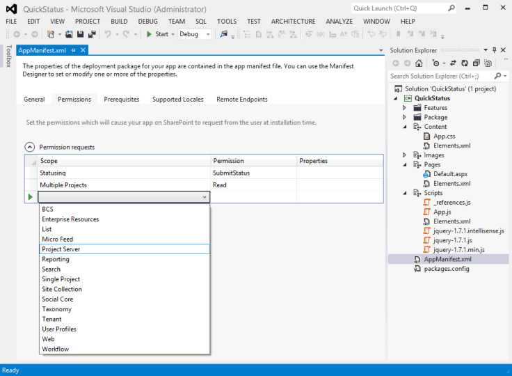
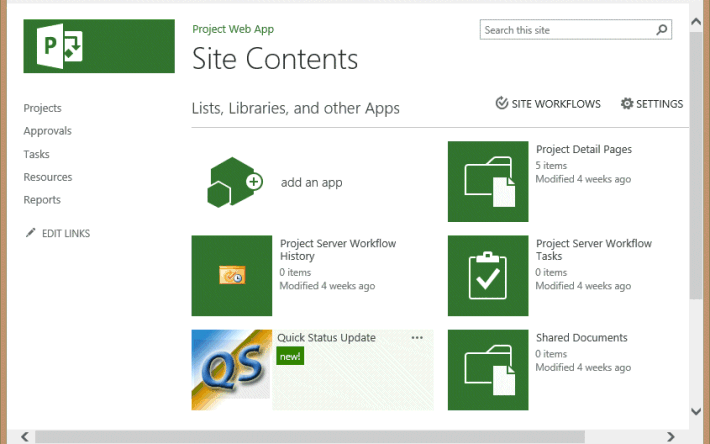
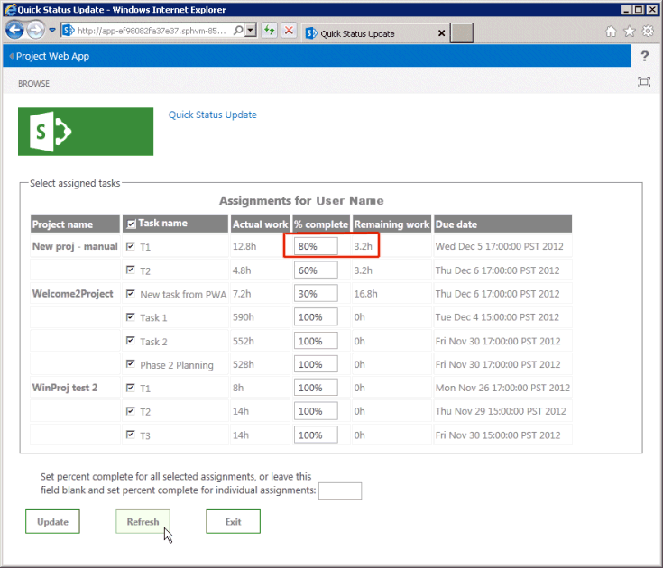

# <a name="create-a-sharepoint-hosted-project-server-add-in"></a><span data-ttu-id="6a8a7-103">创建 SharePoint 托管的 Project Server 加载项</span><span class="sxs-lookup"><span data-stu-id="6a8a7-103">Create a SharePoint-hosted Project Server add-in</span></span>

<span data-ttu-id="6a8a7-104">在你可以为 Project Online (自动托管、提供程序托管和 SharePoint 托管的) 创建的三种类型的应用中，SharePoint 承载的应用程序是创建和部署最简单的方法。</span><span class="sxs-lookup"><span data-stu-id="6a8a7-104">Of the three types of apps that you can create for Project Online (autohosted, provider-hosted, and SharePoint-hosted), the SharePoint-hosted app is the simplest to create and deploy.</span></span> <span data-ttu-id="6a8a7-105">托管SharePoint应用程序不需要 OAuth 身份验证，也不需要使用 Azure 或需要为提供程序托管的资源维护本地网站。</span><span class="sxs-lookup"><span data-stu-id="6a8a7-105">A SharePoint-hosted app does not require OAuth authentication, and does not use Azure or require maintenance of a local site for the provider-hosted resources.</span></span> <span data-ttu-id="6a8a7-106">Visual Studio 中的 **"SharePoint 2013** 应用"模板是开发可在 Office 应用商店中发布和出售或部署到 SharePoint 上的专用应用目录的应用的便捷框架。</span><span class="sxs-lookup"><span data-stu-id="6a8a7-106">The **App for SharePoint 2013** template in Visual Studio is a convenient framework for developing apps that can be published and sold in the Office Store or deployed to a private app catalog on SharePoint.</span></span> 
  
<span data-ttu-id="6a8a7-107">在 Project 中，状态是一个流程，工作组成员可以使用 Project Web App 中的"任务"页提交已分配任务的状态，例如一周中每天工作该任务所花的小时数。</span><span class="sxs-lookup"><span data-stu-id="6a8a7-107">In Project, statusing is a process where a team member can use the Tasks page in Project Web App to submit the status of an assigned task, such as the number of hours worked each day of a week spent working on the task.</span></span> <span data-ttu-id="6a8a7-108">工作分配所有者 (项目经理) 审批或拒绝状态。</span><span class="sxs-lookup"><span data-stu-id="6a8a7-108">The assignment owner (usually the project manager) can approve or reject the status.</span></span> <span data-ttu-id="6a8a7-109">当状态为"已批准"时，Project重新计算计划。</span><span class="sxs-lookup"><span data-stu-id="6a8a7-109">When the status is approved, Project recalculates the schedule.</span></span> <span data-ttu-id="6a8a7-110">**QuickStatus** 应用显示分配的任务，用户可以在这些任务中快速更新完成百分比并提交选定工作分配的状态进行审批。</span><span class="sxs-lookup"><span data-stu-id="6a8a7-110">The **QuickStatus** app displays assigned tasks, where the user can quickly update percent complete and submit status of the selected assignments for approval.</span></span> <span data-ttu-id="6a8a7-111">尽管"任务"Project Web App的功能更多，**但 QuickStatus** 应用是一个提供简化界面的示例。</span><span class="sxs-lookup"><span data-stu-id="6a8a7-111">Although the Tasks page in Project Web App has much more functionality, the **QuickStatus** app is an example that provides a simplified interface.</span></span> 
  
<span data-ttu-id="6a8a7-112">**QuickStatus** 应用是开发人员的示例;它不适合在生产环境使用。</span><span class="sxs-lookup"><span data-stu-id="6a8a7-112">The **QuickStatus** app is a sample for developers; it is not intended for use in a production environment.</span></span> <span data-ttu-id="6a8a7-113">主要用途是演示应用程序开发示例，Project Online，而不是创建功能齐全的状态应用。</span><span class="sxs-lookup"><span data-stu-id="6a8a7-113">The primary purpose is to show an example of app development for Project Online, not to create a fully functional statusing app.</span></span> <span data-ttu-id="6a8a7-114">有关更好的状态方法，请参阅下一步 [中的建议](#pj15_StatusingApp_NextSteps)。</span><span class="sxs-lookup"><span data-stu-id="6a8a7-114">For a better approach to statusing, see the recommendation in [Next steps](#pj15_StatusingApp_NextSteps).</span></span>
  
<span data-ttu-id="6a8a7-115">有关状态的常规信息，请参阅任务 [进度](https://support.office.com/article/Find-information-about-Project-Server-2013-8b08a414-15a7-4076-b2db-c90d0214ea7f?ui=en-US&rs=en-US&ad=US#BKMK_TaskProgress)。</span><span class="sxs-lookup"><span data-stu-id="6a8a7-115">For general information about statusing, see [Task progress](https://support.office.com/article/Find-information-about-Project-Server-2013-8b08a414-15a7-4076-b2db-c90d0214ea7f?ui=en-US&rs=en-US&ad=US#BKMK_TaskProgress).</span></span> <span data-ttu-id="6a8a7-116">有关为 SharePoint 和 Project 服务器开发外接程序SharePoint[请参阅](https://msdn.microsoft.com/library/jj163230.aspx)外接程序。</span><span class="sxs-lookup"><span data-stu-id="6a8a7-116">For more information about developing add-ins for SharePoint and Project Server, see [SharePoint Add-ins](https://msdn.microsoft.com/library/jj163230.aspx).</span></span>

<span data-ttu-id="6a8a7-117"><a name="pj15_StatusingApp_Prerequisites"> </a></span><span class="sxs-lookup"><span data-stu-id="6a8a7-117"><a name="pj15_StatusingApp_Prerequisites"> </a></span></span>

## <a name="prerequisites-for-creating-an-app-for-project-server-2013"></a><span data-ttu-id="6a8a7-118">为 Project Server 2013 创建应用程序的先决条件</span><span class="sxs-lookup"><span data-stu-id="6a8a7-118">Prerequisites for creating an app for Project Server 2013</span></span>

<span data-ttu-id="6a8a7-119">若要开发可部署到 Project Online 或 Project Server 2013 本地安装中的相对简单的应用，可以使用 Napa（提供联机开发环境）。</span><span class="sxs-lookup"><span data-stu-id="6a8a7-119">To develop relatively simple apps that can be deployed to Project Online or to an on-premises installation of Project Server 2013, you can use the Napa, which provide an online development environment.</span></span> <span data-ttu-id="6a8a7-120">对于更复杂的应用、修改 Project Web App 功能区以及更轻松地在开发过程中进行调试，可以使用 Visual Studio 2012 或 Visual Studio 2013。</span><span class="sxs-lookup"><span data-stu-id="6a8a7-120">For more complex apps, modifying the Project Web App ribbon, and easier debugging during development, you can use Visual Studio 2012 or Visual Studio 2013.</span></span> <span data-ttu-id="6a8a7-121">例如，对于本地安装，您可以手动检查草稿数据表，了解 Project 服务器数据库中的更改。</span><span class="sxs-lookup"><span data-stu-id="6a8a7-121">For example, with an on-premises installation, you can manually check the Drafts datatables for changes in the Project Server database.</span></span> <span data-ttu-id="6a8a7-122">本文演示如何使用 Visual Studio 进行应用开发。</span><span class="sxs-lookup"><span data-stu-id="6a8a7-122">This article shows how to do app development with Visual Studio.</span></span>
  
<span data-ttu-id="6a8a7-123">使用 Project 开发 Visual Studio Server 应用程序需要以下各项：</span><span class="sxs-lookup"><span data-stu-id="6a8a7-123">Development of Project Server apps with Visual Studio requires the following:</span></span>
  
- <span data-ttu-id="6a8a7-p106">确保您已在本地开发计算机上安装最新的 Service Pack 和 Windows 更新。操作系统可以是 Windows 7、Windows 8、Windows Server 2008 或 Windows Server 2012。</span><span class="sxs-lookup"><span data-stu-id="6a8a7-p106">Ensure that you have installed the most recent service packs and Windows updates on your local development computer. The operating system can be Windows 7, Windows 8, Windows Server 2008, or Windows Server 2012.</span></span>
    
- <span data-ttu-id="6a8a7-126">必须拥有已安装 SharePoint Server 2013 和 Project Server 2013 的计算机，其中计算机配置为应用隔离和旁加载应用。</span><span class="sxs-lookup"><span data-stu-id="6a8a7-126">You must have a computer that has SharePoint Server 2013 and Project Server 2013 installed, where the computer is configured for app isolation and sideloading of apps.</span></span> <span data-ttu-id="6a8a7-127">通过旁加载Visual Studio可以临时安装应用进行调试。</span><span class="sxs-lookup"><span data-stu-id="6a8a7-127">Sideloading enables Visual Studio to temporarily install the app for debugging.</span></span> <span data-ttu-id="6a8a7-128">可以使用本地安装的 SharePoint 和 Project Server。</span><span class="sxs-lookup"><span data-stu-id="6a8a7-128">You can use an on-premises installation of SharePoint and Project Server.</span></span> <span data-ttu-id="6a8a7-129">有关详细信息，请参阅为 SharePoint[应用程序设置本地开发SharePoint。](https://msdn.microsoft.com/library/fp179923%28Office.15%29.aspx)</span><span class="sxs-lookup"><span data-stu-id="6a8a7-129">For more information, see [Set up an on-premises development environment for apps for SharePoint](https://msdn.microsoft.com/library/fp179923%28Office.15%29.aspx).</span></span>
    
   > [!NOTE]
   > <span data-ttu-id="6a8a7-130">对于本地安装，在创建企业应用程序目录之前配置独立的应用程序域。</span><span class="sxs-lookup"><span data-stu-id="6a8a7-130">For an on-premises installation, configure an isolated app domain  *before*  you create a corporate app catalog.</span></span> 
  
- <span data-ttu-id="6a8a7-131">开发计算机可以是安装了 Office Tools for Visual Studio 2012 的远程计算机。</span><span class="sxs-lookup"><span data-stu-id="6a8a7-131">The development computer can be a remote computer that has Office Developer Tools for Visual Studio 2012 installed.</span></span> <span data-ttu-id="6a8a7-132">确保已安装最新版本;请参阅 *应用* 应用和下载 [Office SharePoint部分](https://msdn.microsoft.com/office/apps/fp123627.aspx)。</span><span class="sxs-lookup"><span data-stu-id="6a8a7-132">Ensure that you have installed the most recent version; see the  *Tools*  section of the [Apps for Office and SharePoint downloads](https://msdn.microsoft.com/office/apps/fp123627.aspx).</span></span>
    
- <span data-ttu-id="6a8a7-133">验证Project Web App用于开发和测试的实例是否可在浏览器中访问。</span><span class="sxs-lookup"><span data-stu-id="6a8a7-133">Verify that the Project Web App instance you will be using for development and testing is accessible in the browser.</span></span>
    
<span data-ttu-id="6a8a7-134">有关使用联机工具的信息，请参阅在 Office 365 上设置用于开发 SharePoint[应用程序Office 365。](https://msdn.microsoft.com/library/fp161179.aspx)</span><span class="sxs-lookup"><span data-stu-id="6a8a7-134">For information about using the online tools, see [Set up an environment for developing apps for SharePoint on Office 365](https://msdn.microsoft.com/library/fp161179.aspx).</span></span> <span data-ttu-id="6a8a7-135">有关为使用联机工具的 Project Server 生成简单应用的演练，请参阅 EPMSource 博客系列生成首个[Project Server 应用](https://epmsource.com/2012/11/20/building-your-first-project-server-app-part-zerothe-introduction/)。</span><span class="sxs-lookup"><span data-stu-id="6a8a7-135">For a walkthrough of building a simple app for Project Server that uses the online tools, see the EPMSource blog series, [Building your first Project Server app](https://epmsource.com/2012/11/20/building-your-first-project-server-app-part-zerothe-introduction/).</span></span>

<span data-ttu-id="6a8a7-136"><a name="pj15_StatusingApp_UsingVisualStudio"> </a></span><span class="sxs-lookup"><span data-stu-id="6a8a7-136"><a name="pj15_StatusingApp_UsingVisualStudio"> </a></span></span>

## <a name="using-visual-studio-to-create-a-project-server-app"></a><span data-ttu-id="6a8a7-137">使用 Visual Studio 创建 Project Server 应用</span><span class="sxs-lookup"><span data-stu-id="6a8a7-137">Using Visual Studio to create a Project Server app</span></span>

<span data-ttu-id="6a8a7-138">Office2012 Visual Studio开发人员工具包含一个模板，SharePoint可用于 Project Server 2013 的应用。</span><span class="sxs-lookup"><span data-stu-id="6a8a7-138">Office Developer Tools for Visual Studio 2012 includes a template for SharePoint apps that can be used with Project Server 2013.</span></span> <span data-ttu-id="6a8a7-139">创建应用解决方案时，该解决方案包括自定义代码的以下文件：</span><span class="sxs-lookup"><span data-stu-id="6a8a7-139">When you create an app solution, the solution includes the following files for your custom code:</span></span>
  
- <span data-ttu-id="6a8a7-140">**AppManifest.xml** 包括应用程序标题、权限请求范围和其他属性的设置。</span><span class="sxs-lookup"><span data-stu-id="6a8a7-140">**AppManifest.xml** includes settings for the app title, permission request scope, and other properties.</span></span> <span data-ttu-id="6a8a7-141">过程 1 包括使用清单设计器设置属性的步骤。</span><span class="sxs-lookup"><span data-stu-id="6a8a7-141">Procedure 1 includes steps to set the properties by using the Manifest Designer.</span></span> 
    
- <span data-ttu-id="6a8a7-142">"页面"文件夹中的 **Default.aspx** 是应用程序的主页。</span><span class="sxs-lookup"><span data-stu-id="6a8a7-142">**Default.aspx** in the Pages folder is the main page of the app.</span></span> <span data-ttu-id="6a8a7-143">过程 2 演示如何为 **QuickStatus** 应用程序添加 HTML5 内容。</span><span class="sxs-lookup"><span data-stu-id="6a8a7-143">Procedure 2 shows how to add HTML5 content for the **QuickStatus** app.</span></span> 
    
- <span data-ttu-id="6a8a7-144">**App.js** 脚本文件夹中的脚本是自定义 JavaScript 代码的主文件。</span><span class="sxs-lookup"><span data-stu-id="6a8a7-144">**App.js** in the Scripts folder is the primary file for the custom JavaScript code.</span></span> <span data-ttu-id="6a8a7-145">过程 3 介绍了 **QuickStatus** 应用的 JavaScript 代码。</span><span class="sxs-lookup"><span data-stu-id="6a8a7-145">Procedure 3 explains the JavaScript code for the **QuickStatus** app.</span></span> 
    
   <span data-ttu-id="6a8a7-146">如果添加商业控件（如基于 jQuery 的网格或日期选取器），可以在 Default.aspx 文件中添加对其他 JavaScript 文件的引用。</span><span class="sxs-lookup"><span data-stu-id="6a8a7-146">If you add commercial controls such as a jQuery-based grid or date picker, you can add references to additional JavaScript files in the Default.aspx file.</span></span>
    
- <span data-ttu-id="6a8a7-147">**内容文件夹中的 App.css** 是自定义 CSS3 样式的主文件。</span><span class="sxs-lookup"><span data-stu-id="6a8a7-147">**App.css** in the Content folder is the primary file for custom CSS3 styles.</span></span> <span data-ttu-id="6a8a7-148">过程 2 和过程 3 包括有关 **QuickStatus** (CSS) 样式的级联样式表的信息。</span><span class="sxs-lookup"><span data-stu-id="6a8a7-148">Procedure 2 and Procedure 3 include information about cascading style sheets (CSS) styles for the **QuickStatus** app.</span></span> <span data-ttu-id="6a8a7-149">您可以在 Default.aspx 文件中添加对其他 CSS 文件的引用。</span><span class="sxs-lookup"><span data-stu-id="6a8a7-149">You can add references to additional CSS files in the Default.aspx file.</span></span> 
    
- <span data-ttu-id="6a8a7-150">**AppIcon.png** 图像"文件夹中的图标是应用在 Office 应用商店或应用程序目录中显示的 96 x 96 图标。</span><span class="sxs-lookup"><span data-stu-id="6a8a7-150">**AppIcon.png** in the Images folder is the 96 x 96 icon that the app displays in the Office Store or the app catalog.</span></span> 
    
<span data-ttu-id="6a8a7-151">若要修改Project Web App功能区，可以添加功能区自定义操作。</span><span class="sxs-lookup"><span data-stu-id="6a8a7-151">To modify the Project Web App ribbon, you can add a ribbon custom action.</span></span> <span data-ttu-id="6a8a7-152">[QuickStatus 应用程序](#pj15_StatusingApp_Example)部分的示例代码包括修改后的 Default.aspx、App.js、App.css、Elements.xml 和 AppManifest.xml 代码。</span><span class="sxs-lookup"><span data-stu-id="6a8a7-152">The [Example code for the QuickStatus app](#pj15_StatusingApp_Example) section includes the complete code for the modified Default.aspx, App.js, App.css, Elements.xml, and AppManifest.xml files.</span></span> 
  
### <a name="procedure-1-to-create-an-app-project-in-visual-studio"></a><span data-ttu-id="6a8a7-153">程序 1.</span><span class="sxs-lookup"><span data-stu-id="6a8a7-153">Procedure 1.</span></span> <span data-ttu-id="6a8a7-154">在应用程序中创建应用Visual Studio</span><span class="sxs-lookup"><span data-stu-id="6a8a7-154">To create an app project in Visual Studio</span></span>

1. <span data-ttu-id="6a8a7-155">以Visual Studio 2012 运行 2012，然后选择"Project"页上的"新建网站"。</span><span class="sxs-lookup"><span data-stu-id="6a8a7-155">Run Visual Studio 2012 as an administrator, and then select **New Project** on the Start page.</span></span> 
    
2. <span data-ttu-id="6a8a7-156">在"**新建Project** 对话框中，展开"模板"、"Visual **C#"** 和 **"Office/SharePoint"** 节点，然后选择"应用 **"。** </span><span class="sxs-lookup"><span data-stu-id="6a8a7-156">In the **New Project** dialog box, expand the **Templates**, **Visual C#**, and **Office/SharePoint** nodes, and then select **Apps**.</span></span> <span data-ttu-id="6a8a7-157">在中心窗格顶部的.NET Framework框架下拉列表中，使用默认的 **"4.5"，** 然后选择 **"SharePoint 2013** ("，请参阅图 1) 。</span><span class="sxs-lookup"><span data-stu-id="6a8a7-157">Use the default **.NET Framework 4.5** in the target framework drop-down list at the top of the center pane, and then select **App for SharePoint 2013** (see Figure 1).</span></span> 
    
3. <span data-ttu-id="6a8a7-158">在"**名称**"字段中，键入 QuickStatus，浏览到要保存应用的位置，然后选择"确定 **"。**</span><span class="sxs-lookup"><span data-stu-id="6a8a7-158">In the **Name** field, type QuickStatus, browse to the location where you want to save the app, and then choose **OK**.</span></span>
    
   <span data-ttu-id="6a8a7-159">**图 1.在 Project 创建 Visual Studio Server Visual Studio**</span><span class="sxs-lookup"><span data-stu-id="6a8a7-159">**Figure 1. Creating a Project Server app in Visual Studio**</span></span>

   <span data-ttu-id="6a8a7-160"></span><span class="sxs-lookup"><span data-stu-id="6a8a7-160"></span></span>
  
4. <span data-ttu-id="6a8a7-161">在"**新建应用程序SharePoint** 对话框中，填写以下三个字段：</span><span class="sxs-lookup"><span data-stu-id="6a8a7-161">In the **New app for SharePoint** dialog box, fill in the following three fields:</span></span> 
    
   - <span data-ttu-id="6a8a7-162">在顶部文本框中，键入希望应用在文本框中Project Web App。</span><span class="sxs-lookup"><span data-stu-id="6a8a7-162">In the top text box, type the name that you want the app to display in Project Web App.</span></span> <span data-ttu-id="6a8a7-163">例如，键入快速状态更新。</span><span class="sxs-lookup"><span data-stu-id="6a8a7-163">For example, type Quick Status Update.</span></span>
    
   - <span data-ttu-id="6a8a7-164">对于要用于调试的网站，请键入 Project Web App URL。</span><span class="sxs-lookup"><span data-stu-id="6a8a7-164">For the site to use for debugging, type the URL of the Project Web App instance.</span></span> <span data-ttu-id="6a8a7-165">例如，键入 (将 `https://ServerName/ProjectServerName` _ServerName_ 和 _ProjectServerName_ 替换为您自己的值) ，然后选择"验证 **"。**</span><span class="sxs-lookup"><span data-stu-id="6a8a7-165">For example, type  `https://ServerName/ProjectServerName` (replacing  _ServerName_ and  _ProjectServerName_ with your own values), and then choose **Validate**.</span></span> <span data-ttu-id="6a8a7-166">如果一切顺利，Visual Studio连接 **成功**。</span><span class="sxs-lookup"><span data-stu-id="6a8a7-166">If all goes well, Visual Studio shows **Connection successful**.</span></span> <span data-ttu-id="6a8a7-167">如果收到错误消息，请确保 Project Web App URL 正确，并确保 Project Server 计算机配置为应用隔离和旁加载应用。</span><span class="sxs-lookup"><span data-stu-id="6a8a7-167">If you get an error message, ensure that the Project Web App URL is correct and that the Project Server computer is configured for app isolation and sideloading of apps.</span></span> <span data-ttu-id="6a8a7-168">有关详细信息，请参阅[为 Project Server 2013](#pj15_StatusingApp_Prerequisites)创建应用程序的先决条件部分。</span><span class="sxs-lookup"><span data-stu-id="6a8a7-168">For more information, see the [Prerequisites for creating an app for Project Server 2013](#pj15_StatusingApp_Prerequisites) section.</span></span> 
    
   - <span data-ttu-id="6a8a7-169">在 **"如何托管应用程序以** 托管SharePoint下拉列表中，选择"SharePoint **托管"。**</span><span class="sxs-lookup"><span data-stu-id="6a8a7-169">In the **How do you want to host your app for SharePoint** drop-down list, choose **SharePoint-hosted**.</span></span>
    
   > [!CAUTION]
   > <span data-ttu-id="6a8a7-170">如果您错误地选择了默认的提供程序承载的项目类型，Visual Studio解决方案创建两个项目 **：QuickStatus** 项目和 **QuickStatusWeb** 项目。</span><span class="sxs-lookup"><span data-stu-id="6a8a7-170">If you choose the default **Provider-hosted** project type by mistake, Visual Studio creates two projects in the solution: a **QuickStatus** project and a **QuickStatusWeb** project.</span></span> <span data-ttu-id="6a8a7-171">如果看到两个项目，请删除该解决方案，然后重新开始。</span><span class="sxs-lookup"><span data-stu-id="6a8a7-171">If you see two projects, delete that solution and start again.</span></span> 
  
5. <span data-ttu-id="6a8a7-172">选择 **"确定** "创建 **QuickStatus** 解决方案 **、QuickStatus** 项目和默认文件。</span><span class="sxs-lookup"><span data-stu-id="6a8a7-172">Choose **OK** to create the **QuickStatus** solution, **QuickStatus** project, and default files.</span></span> 
    
6. <span data-ttu-id="6a8a7-173">打开"清单设计器" (例如，双击"清单设计器"AppManifest.xml文件) 。</span><span class="sxs-lookup"><span data-stu-id="6a8a7-173">Open the Manifest Designer view (for example, double-click the AppManifest.xml file).</span></span> <span data-ttu-id="6a8a7-174">在"**常规**"选项卡上，"标题"文本框应显示你在步骤 4 中键入的应用名称。</span><span class="sxs-lookup"><span data-stu-id="6a8a7-174">On the **General** tab, the **Title** text box should show the app name that you typed in step 4.</span></span> <span data-ttu-id="6a8a7-175">选择 **"权限"** 选项卡，为应用程序添加以下权限 (请参阅图 2) ：</span><span class="sxs-lookup"><span data-stu-id="6a8a7-175">Choose the **Permissions** tab to add the following permission requests for the app (see Figure 2):</span></span> 
    
   - <span data-ttu-id="6a8a7-176">在"权限 **请求"列表** 的第一行的"范围"**列中，** 选择下拉列表中的"状态"。</span><span class="sxs-lookup"><span data-stu-id="6a8a7-176">In the first row of the **Permission requests** list, in the **Scope** column, choose **Statusing** in the drop-down list.</span></span> <span data-ttu-id="6a8a7-177">在"**权限"** 列中，选择 **"SubmitStatus"。**</span><span class="sxs-lookup"><span data-stu-id="6a8a7-177">In the **Permission** column, choose **SubmitStatus**.</span></span>
    
   - <span data-ttu-id="6a8a7-178">添加一行，**其中范围** 是 **多个项目**，**权限是\*\*\*\*读取**。</span><span class="sxs-lookup"><span data-stu-id="6a8a7-178">Add a row where the **Scope** is **Multiple Projects** and the **Permission** is **Read**.</span></span>
    
   <span data-ttu-id="6a8a7-179">**图 2.设置状态应用程序的权限范围**</span><span class="sxs-lookup"><span data-stu-id="6a8a7-179">**Figure 2. Setting the permission scope for a statusing app**</span></span>

   <span data-ttu-id="6a8a7-180"></span><span class="sxs-lookup"><span data-stu-id="6a8a7-180"></span></span>
  
<span data-ttu-id="6a8a7-181">**QuickStatus** 应用使Project Web App用户可以从多个项目中读取该用户的工作分配、更改工作分配完成百分比并提交更新。</span><span class="sxs-lookup"><span data-stu-id="6a8a7-181">The **QuickStatus** app enables a Project Web App user to read assignments for that user from multiple projects, change the assignment percent complete, and submit the update.</span></span> <span data-ttu-id="6a8a7-182">此应用不需要图 2 的下拉列表中显示的其他权限请求范围。</span><span class="sxs-lookup"><span data-stu-id="6a8a7-182">The other permission request scopes shown in the drop-down list in Figure 2 are not required for this app.</span></span> <span data-ttu-id="6a8a7-183">权限请求范围是应用程序代表用户请求的权限。</span><span class="sxs-lookup"><span data-stu-id="6a8a7-183">The permission request scopes are the permissions that the app requests on behalf of the user.</span></span> <span data-ttu-id="6a8a7-184">如果用户在应用中没有这些权限Project Web App，则应用不会运行。</span><span class="sxs-lookup"><span data-stu-id="6a8a7-184">If the user does not have those permissions in Project Web App, the app does not run.</span></span> <span data-ttu-id="6a8a7-185">应用可以有多个权限请求范围，包括其他权限SharePoint范围，但应仅具有应用功能所需的最小范围。</span><span class="sxs-lookup"><span data-stu-id="6a8a7-185">An app can have multiple permission request scopes, including those for other SharePoint permissions, but should have only the minimum necessary for the app functionality.</span></span> <span data-ttu-id="6a8a7-186">以下是与 Project 服务器相关的权限请求范围：</span><span class="sxs-lookup"><span data-stu-id="6a8a7-186">Following are the permission request scopes that are related to Project Server:</span></span> 

- <span data-ttu-id="6a8a7-187">**Enterprise：** 资源管理器权限，用于读取或写入有关其他用户Project Web App的信息。</span><span class="sxs-lookup"><span data-stu-id="6a8a7-187">**Enterprise Resources**: Resource manager permissions, to read or write information about other Project Web App users.</span></span>
    
- <span data-ttu-id="6a8a7-188">**多个项目**：读取或写入多个项目，其中用户具有请求的权限。</span><span class="sxs-lookup"><span data-stu-id="6a8a7-188">**Multiple Projects**: Read or write to more than one project, where the user has the permissions requested.</span></span>
    
- <span data-ttu-id="6a8a7-189">**Project服务器**：要求应用用户拥有对 Project Web App 的管理员权限。</span><span class="sxs-lookup"><span data-stu-id="6a8a7-189">**Project Server**: Requires the app user to have administrator permissions for Project Web App.</span></span>
    
- <span data-ttu-id="6a8a7-190">**报告**：读取 **ProjectData** OData 服务Project Web App (仅需要用户登录Project Web App) 。</span><span class="sxs-lookup"><span data-stu-id="6a8a7-190">**Reporting**: Read the **ProjectData** OData service for Project Web App (requires only log on permission for Project Web App).</span></span> 
    
- <span data-ttu-id="6a8a7-191">**单Project：** 读取或写入用户具有所请求的权限的项目。</span><span class="sxs-lookup"><span data-stu-id="6a8a7-191">**Single Project**: Read or write to a project where the user has the permissions requested.</span></span>
    
- <span data-ttu-id="6a8a7-192">**状态：** 提交工作分配状态的更新，如工作时间、完成百分比和新分配。</span><span class="sxs-lookup"><span data-stu-id="6a8a7-192">**Statusing**: Submit updates for status of assignments, such as times worked, percent complete, and new assignments.</span></span>
    
- <span data-ttu-id="6a8a7-193">**工作流**：如果用户有权运行 Project 服务器工作流，则应用程序随后会使用工作流的提升权限运行。</span><span class="sxs-lookup"><span data-stu-id="6a8a7-193">**Workflow**: If the user has permission to run Project Server workflows, the app then runs with elevated permissions for the workflow.</span></span>
    
<span data-ttu-id="6a8a7-194">有关 Project Server 2013 的权限请求范围详细信息，请参阅 updates for developers in Project [2013](updates-for-developers-in-project-2013.md)中的 Project *apps* 部分和 [SharePoint 2013 中的应用程序权限](https://msdn.microsoft.com/library/fp142383.aspx)。</span><span class="sxs-lookup"><span data-stu-id="6a8a7-194">For more information about permission request scopes for Project Server 2013, see the  *Project apps*  section in [Updates for developers in Project 2013](updates-for-developers-in-project-2013.md) and [App permissions in SharePoint 2013](https://msdn.microsoft.com/library/fp142383.aspx).</span></span>


<span data-ttu-id="6a8a7-195"><a name="pj15_StatusingApp_HTML"> </a></span><span class="sxs-lookup"><span data-stu-id="6a8a7-195"><a name="pj15_StatusingApp_HTML"> </a></span></span>

### <a name="creating-the-html-content-for-the-quickstatus-app"></a><span data-ttu-id="6a8a7-196">为 QuickStatus 应用程序创建 HTML 内容</span><span class="sxs-lookup"><span data-stu-id="6a8a7-196">Creating the HTML content for the QuickStatus app</span></span>

<span data-ttu-id="6a8a7-197">在开始编写 HTML 内容代码之前，请为 QuickStatus 应用程序设计用户界面和用户体验 (图 3 显示了已完成的页面示例) 。</span><span class="sxs-lookup"><span data-stu-id="6a8a7-197">Before you start coding the HTML content, design the user interface and user experience for the QuickStatus app (Figure 3 shows an example of the completed page).</span></span> <span data-ttu-id="6a8a7-198">设计还可以包含与 HTML 代码交互的 JavaScript 函数的大纲。</span><span class="sxs-lookup"><span data-stu-id="6a8a7-198">A design can also include an outline of the JavaScript functions that interact with the HTML code.</span></span> <span data-ttu-id="6a8a7-199">有关一般信息，请参阅[UX design for apps in SharePoint 2013。](https://msdn.microsoft.com/library/fp179934.aspx)</span><span class="sxs-lookup"><span data-stu-id="6a8a7-199">For general information, see [UX design for apps in SharePoint 2013](https://msdn.microsoft.com/library/fp179934.aspx).</span></span>
  
<span data-ttu-id="6a8a7-200">**图 3.QuickStatus 应用页面的设计**</span><span class="sxs-lookup"><span data-stu-id="6a8a7-200">**Figure 3. Design of the QuickStatus app page**</span></span>

<span data-ttu-id="6a8a7-201"></span><span class="sxs-lookup"><span data-stu-id="6a8a7-201"></span></span>
  
<span data-ttu-id="6a8a7-202">应用在顶部显示名称标题元素的值，即 AppManifest.xml。 </span><span class="sxs-lookup"><span data-stu-id="6a8a7-202">The app shows the display name at the top, which is the value of the **Title** element in AppManifest.xml.</span></span> 
  
<span data-ttu-id="6a8a7-203">默认情况下，页面使用 HTML5。</span><span class="sxs-lookup"><span data-stu-id="6a8a7-203">By default, the page uses HTML5.</span></span> <span data-ttu-id="6a8a7-204">下面是 **QuickStatus** 应用程序在页面正文中包含的主 UI 对象的标准 HTML 元素：</span><span class="sxs-lookup"><span data-stu-id="6a8a7-204">Following are the standard HTML elements for the main UI objects that the **QuickStatus** app contains in the body of the page:</span></span> 
  
- <span data-ttu-id="6a8a7-205">表单 **元素** 包含所有其他 UI 元素。</span><span class="sxs-lookup"><span data-stu-id="6a8a7-205">A **form** element contains all of the other UI elements.</span></span> 
    
- <span data-ttu-id="6a8a7-206">**fieldset** 元素为工作分配表创建容器和边框;子 **图例** 元素为容器提供标签。</span><span class="sxs-lookup"><span data-stu-id="6a8a7-206">A **fieldset** element creates a container and border for the table of assignments; the child **legend** element provides a label for the container.</span></span> 
    
- <span data-ttu-id="6a8a7-207">表格 **元素** 包括标题和表格标题。</span><span class="sxs-lookup"><span data-stu-id="6a8a7-207">A **table** element includes a caption and only a table header.</span></span> <span data-ttu-id="6a8a7-208">JavaScript 函数更改表格标题，并添加工作分配的行。</span><span class="sxs-lookup"><span data-stu-id="6a8a7-208">JavaScript functions change the table caption and add rows for the assignments.</span></span> 
    
   > [!NOTE]
   > <span data-ttu-id="6a8a7-209">为了轻松添加分页和排序，生产应用可能使用基于 jQuery 的商业网格控件，而不是表格。</span><span class="sxs-lookup"><span data-stu-id="6a8a7-209">To easily add paging and sorting, a production app would probably use a commercial jQuery-based grid control instead of a table.</span></span> 
  
   <span data-ttu-id="6a8a7-210">该表包含项目名称、带复选框的任务名称、实际工时、完成百分比、剩余工时和工作分配完成日期的列。</span><span class="sxs-lookup"><span data-stu-id="6a8a7-210">The table includes columns for the project name, task name with a check box, actual work, percent complete, remaining work, and the assignment finish date.</span></span> <span data-ttu-id="6a8a7-211">JavaScript 函数为每个任务的完成百分比创建复选框和文本输入字段。</span><span class="sxs-lookup"><span data-stu-id="6a8a7-211">JavaScript functions create the check box and the text input field for the percent complete of each task.</span></span>
    
- <span data-ttu-id="6a8a7-212">文本框的 **输入** 元素可设置所有选定工作分配的完成百分比。</span><span class="sxs-lookup"><span data-stu-id="6a8a7-212">An **input** element for a text box sets percent complete for all selected assignments.</span></span> 
    
- <span data-ttu-id="6a8a7-213">**button** 元素提交状态更改。</span><span class="sxs-lookup"><span data-stu-id="6a8a7-213">A **button** element submits the status changes.</span></span> 
    
- <span data-ttu-id="6a8a7-214">**按钮** 元素刷新页面。</span><span class="sxs-lookup"><span data-stu-id="6a8a7-214">A **button** element refreshes the page.</span></span> 
    
- <span data-ttu-id="6a8a7-215">button 元素退出应用并返回到应用中的"任务"Project Web App。</span><span class="sxs-lookup"><span data-stu-id="6a8a7-215">A **button** element exits the app and returns to the Tasks page in Project Web App.</span></span> 
    
<span data-ttu-id="6a8a7-216">底部文本框和 button 元素位于 **div** 元素内，以便 CSS 可以轻松管理 UI 对象的位置和外观。</span><span class="sxs-lookup"><span data-stu-id="6a8a7-216">The bottom text box and button elements are within **div** elements, so that CSS can easily manage the position and appearance of the UI objects.</span></span> <span data-ttu-id="6a8a7-217">JavaScript 函数在页面底部添加一个段落，其中包含状态更新成功或失败的结果。</span><span class="sxs-lookup"><span data-stu-id="6a8a7-217">A JavaScript function adds a paragraph at the bottom of the page that contains results for success or failure of the status update.</span></span> 
  
### <a name="procedure-2-to-create-the-html-content"></a><span data-ttu-id="6a8a7-218">程序 2.</span><span class="sxs-lookup"><span data-stu-id="6a8a7-218">Procedure 2.</span></span> <span data-ttu-id="6a8a7-219">创建 HTML 内容</span><span class="sxs-lookup"><span data-stu-id="6a8a7-219">To create the HTML content</span></span>

1. <span data-ttu-id="6a8a7-220">在Visual Studio中，打开 Default.aspx 文件。</span><span class="sxs-lookup"><span data-stu-id="6a8a7-220">In Visual Studio, open the Default.aspx file.</span></span>
    
   <span data-ttu-id="6a8a7-221">文件包含两 **个 asp：Content** 元素：具有 属性的元素添加到页面页眉中，具有 属性的元素  `ContentPlaceHolderID="PlaceHolderAdditionalPageHead"`  `ContentPlaceHolderID="PlaceHolderMain"` 放置在页面 **正文** 元素中。</span><span class="sxs-lookup"><span data-stu-id="6a8a7-221">The file includes two **asp:Content** elements: The element with the  `ContentPlaceHolderID="PlaceHolderAdditionalPageHead"` attribute is added within the page header, and the element with the  `ContentPlaceHolderID="PlaceHolderMain"` attribute is placed within the page **body** element.</span></span> 
    
2. <span data-ttu-id="6a8a7-222">在页面标头的控件中，添加对 PS.js Server 计算机上 Project `<asp:Content ContentPlaceHolderID="PlaceHolderAdditionalPageHead" runat="server">` 文件的引用。</span><span class="sxs-lookup"><span data-stu-id="6a8a7-222">In the  `<asp:Content ContentPlaceHolderID="PlaceHolderAdditionalPageHead" runat="server">` control for the page header, add a reference to the PS.js file on the Project Server computer.</span></span> <span data-ttu-id="6a8a7-223">对于测试和调试，可以使用PS.debug.js。</span><span class="sxs-lookup"><span data-stu-id="6a8a7-223">For testing and debugging, you can use PS.debug.js.</span></span> 
    
   ```HTML
     <script type="text/javascript" src="/_layouts/15/ps.debug.js"></script>
   ```

   <span data-ttu-id="6a8a7-224">应用程序基础结构使用 `/_layouts/15/` IIS 中网站SharePoint虚拟目录。</span><span class="sxs-lookup"><span data-stu-id="6a8a7-224">The app infrastructure uses the `/_layouts/15/` virtual directory for the SharePoint site in IIS.</span></span> <span data-ttu-id="6a8a7-225">物理文件为  `%ProgramFiles%\Common Files\Microsoft Shared\Web Server Extensions\15\TEMPLATE\LAYOUTS\PS.debug.js` 。</span><span class="sxs-lookup"><span data-stu-id="6a8a7-225">The physical file is  `%ProgramFiles%\Common Files\Microsoft Shared\Web Server Extensions\15\TEMPLATE\LAYOUTS\PS.debug.js`.</span></span>
    
   > [!NOTE]
   > <span data-ttu-id="6a8a7-226">在部署应用以用于生产之前，请  `.debug` 从脚本引用中删除以提高性能。</span><span class="sxs-lookup"><span data-stu-id="6a8a7-226">Before you deploy the app for production use, remove  `.debug` from the script references to improve performance.</span></span> 
  
3. <span data-ttu-id="6a8a7-227">在  `<asp:Content ContentPlaceHolderID="PlaceHolderMain" runat="server">` 页面正文的控件中，删除生成的 **div** 元素，然后添加 UI 对象的 HTML 代码。</span><span class="sxs-lookup"><span data-stu-id="6a8a7-227">In the  `<asp:Content ContentPlaceHolderID="PlaceHolderMain" runat="server">` control for the page body, delete the generated **div** element, and then add the HTML code for the UI objects.</span></span> <span data-ttu-id="6a8a7-228">**table** 元素仅包含标题行。</span><span class="sxs-lookup"><span data-stu-id="6a8a7-228">The **table** element contains only a header row.</span></span> <span data-ttu-id="6a8a7-229">" **任务名称** "列包括复选框输入控件。</span><span class="sxs-lookup"><span data-stu-id="6a8a7-229">The **Task name** column includes a check box input control.</span></span> <span data-ttu-id="6a8a7-230">caption **元素的文本** 将替换为文件文件中 **getUserInfo** 函数的 **onGetUserNameSuccess** App.js回调。</span><span class="sxs-lookup"><span data-stu-id="6a8a7-230">Text for the **caption** element is replaced by the **onGetUserNameSuccess** callback for the **getUserInfo** function in the App.js file.</span></span> 
    
    ```HTML
    <form>
        <fieldset>
        <legend>Select assigned tasks</legend>
        <table id="assignmentsTable">
            <caption id="tableCaption">Replace caption</caption>
            <thead>
            <tr id="headerRow">
                <th>Project name</th>
                <th><input type="checkbox" id="headercheckbox" checked="checked" />Task name</th>
                <th>Actual work</th>
                <th>% complete</th>
                <th>Remaining work</th>
                <th>Due date</th>
            </tr>
            </thead>
        </table>
        </fieldset>
        <div id="inputPercentComplete" >
        Set percent complete for all selected assignments, or leave this
        <br /> field blank and set percent complete for individual assignments: 
        <input type="text" name="percentComplete" id="pctComplete" size="4"  maxlength="4" />
        </div>
        <div id="submitResult">
        <p><button id="btnSubmitUpdate" type="button" class="bottomButtons" ></button></p>
        <p id="message"></p>
        </div>
        <div id="refreshPage">
        <p><button id="btnRefresh" type="button" class="bottomButtons" >Refresh</button></p>
        </div>
        <div id="exitPage">
        <p><button id="btnExit" type="button" class="bottomButtons" >Exit</button></p>
        </div>
    </form>
    ```

4. <span data-ttu-id="6a8a7-231">在 App.css 文件中，为 UI 元素的位置和外观添加 CSS 代码。</span><span class="sxs-lookup"><span data-stu-id="6a8a7-231">In the App.css file, add CSS code for the position and appearance of the UI elements.</span></span> <span data-ttu-id="6a8a7-232">有关 **QuickStatus** 应用程序的完整 CSS 代码，请参阅 [QuickStatus](#pj15_StatusingApp_Example) 应用程序的示例代码部分。</span><span class="sxs-lookup"><span data-stu-id="6a8a7-232">For the complete CSS code of the **QuickStatus** app, see the [Example code for the QuickStatus app](#pj15_StatusingApp_Example) section.</span></span> 
    
<span data-ttu-id="6a8a7-233">过程 3 添加 JavaScript 函数以读取工作分配和创建表行，以及更改和更新工作分配完成百分比。</span><span class="sxs-lookup"><span data-stu-id="6a8a7-233">Procedure 3 adds the JavaScript functions to read the assignments and create the table rows, and to change and update the assignment percent complete.</span></span> <span data-ttu-id="6a8a7-234">在开发应用时，实际步骤会反复进行，你可以交替创建一些 HTML 代码，添加和测试相关的样式和 JavaScript 函数，修改或添加更多 HTML 代码，然后重复此过程。</span><span class="sxs-lookup"><span data-stu-id="6a8a7-234">The actual steps are more iterative in developing an app, where you alternately create some of the HTML code, add and test related styles and JavaScript functions, modify or add more HTML code, and then repeat the process.</span></span>

<span data-ttu-id="6a8a7-235"><a name="pj15_StatusingApp_JavaScript"> </a></span><span class="sxs-lookup"><span data-stu-id="6a8a7-235"><a name="pj15_StatusingApp_JavaScript"> </a></span></span>

### <a name="creating-the-javascript-functions-for-the-quickstatus-app"></a><span data-ttu-id="6a8a7-236">为 QuickStatus 应用创建 JavaScript 函数</span><span class="sxs-lookup"><span data-stu-id="6a8a7-236">Creating the JavaScript functions for the QuickStatus app</span></span>

<span data-ttu-id="6a8a7-237">SharePoint Visual Studio应用的 Visual Studio 模板包括 App.js 文件，该文件包含获取 SharePoint 客户端上下文并演示应用程序页面的基本获取和设置操作的默认初始化代码。</span><span class="sxs-lookup"><span data-stu-id="6a8a7-237">The Visual Studio template for a SharePoint app includes the App.js file, which contains default initialization code that gets the SharePoint client context and demonstrates basic get and set actions for the app page.</span></span> <span data-ttu-id="6a8a7-238">客户端客户端库SharePoint JavaScript SP.js SP **。**</span><span class="sxs-lookup"><span data-stu-id="6a8a7-238">The JavaScript namespace for the SharePoint client-side SP.js library is **SP**.</span></span> <span data-ttu-id="6a8a7-239">因为 Project Server 应用使用 PS.js 库，所以应用使用 **PS** 命名空间获取客户端上下文并访问 Project Server 的 JSOM。</span><span class="sxs-lookup"><span data-stu-id="6a8a7-239">Because a Project Server app uses the PS.js library, the app uses the **PS** namespace to get the client context and access the JSOM for Project Server.</span></span> 
  
<span data-ttu-id="6a8a7-240">**QuickStatus 应用中的 JavaScript** 函数包括：</span><span class="sxs-lookup"><span data-stu-id="6a8a7-240">JavaScript functions in the **QuickStatus** app include the following:</span></span> 
  
- <span data-ttu-id="6a8a7-241">文档就绪 **事件** 处理程序在实例化文档对象模型 (DOM) 运行时运行。</span><span class="sxs-lookup"><span data-stu-id="6a8a7-241">The document **ready** event handler runs when the document object model (DOM) is instantiated.</span></span> <span data-ttu-id="6a8a7-242">就绪 **事件** 处理程序执行以下四个步骤：</span><span class="sxs-lookup"><span data-stu-id="6a8a7-242">The **ready** event handler does the following four steps:</span></span> 
    
    1. <span data-ttu-id="6a8a7-243">使用 Project Server JSOM 和 **pwaWeb** 全局变量的客户端上下文初始化 **projContext** 全局变量。</span><span class="sxs-lookup"><span data-stu-id="6a8a7-243">Initializes the **projContext** global variable with the client context for the Project Server JSOM and the **pwaWeb** global variable.</span></span> 
        
    2. <span data-ttu-id="6a8a7-244">调用 **getUserInfo** 函数以初始化 **projUser 全局** 变量。</span><span class="sxs-lookup"><span data-stu-id="6a8a7-244">Calls the **getUserInfo** function to initialize the **projUser** global variable.</span></span> 
        
    3. <span data-ttu-id="6a8a7-245">调用 **getAssignments** 函数，该函数获取用户的指定工作分配数据。</span><span class="sxs-lookup"><span data-stu-id="6a8a7-245">Calls the **getAssignments** function, which gets specified assignment data for the user.</span></span> 
        
    4. <span data-ttu-id="6a8a7-246">将单击事件处理程序绑定到表标题复选框以及表格每行中的复选框。</span><span class="sxs-lookup"><span data-stu-id="6a8a7-246">Binds click event handlers to the table header check box, and to the check boxes in each row of the table.</span></span> <span data-ttu-id="6a8a7-247">当用户选择或清除表中的任何复选框时，单击事件处理程序将管理复选框的 checked 属性。</span><span class="sxs-lookup"><span data-stu-id="6a8a7-247">The click event handlers manage the **checked** attribute of the check boxes when the user selects or clears any check box in the table.</span></span> 
    
- <span data-ttu-id="6a8a7-248">如果 **getAssignments** 函数成功，它将调用 **onGetAssignmentsSuccess** 函数。</span><span class="sxs-lookup"><span data-stu-id="6a8a7-248">If the **getAssignments** function is successful, it calls the **onGetAssignmentsSuccess** function.</span></span> <span data-ttu-id="6a8a7-249">该函数在每个赋值的表中插入一行，初始化每一行中的 HTML 控件，然后初始化底部按钮属性。</span><span class="sxs-lookup"><span data-stu-id="6a8a7-249">That function inserts a row in the table for each assignment, initializes the HTML controls in each row, and then initializes the bottom button properties.</span></span> 
    
- <span data-ttu-id="6a8a7-250">"更新"按钮的 **onClick** 事件处理程序调用 **updateAssignments** 函数。</span><span class="sxs-lookup"><span data-stu-id="6a8a7-250">The **onClick** event handler for the **Update** button calls the **updateAssignments** function.</span></span> <span data-ttu-id="6a8a7-251">该函数获取应用于每个选定工作分配的完成百分比值;或者，如果"完成百分比"文本框为空，则函数获取表中每个选定工作分配的完成百分比。</span><span class="sxs-lookup"><span data-stu-id="6a8a7-251">That function gets the percent complete value that is applied to each selected assignment; or if the percent complete text box is empty, the function gets the percent complete of each selected assignment in the table.</span></span> <span data-ttu-id="6a8a7-252">然后 **，updateAssignments** 函数保存并提交状态更新，然后将有关结果的消息写入页面底部。</span><span class="sxs-lookup"><span data-stu-id="6a8a7-252">The **updateAssignments** function then saves and submits the status updates and writes a message about the results to the bottom of the page.</span></span> 
    
### <a name="procedure-3-to-create-the-javascript-functions"></a><span data-ttu-id="6a8a7-253">过程 3.</span><span class="sxs-lookup"><span data-stu-id="6a8a7-253">Procedure 3.</span></span> <span data-ttu-id="6a8a7-254">创建 JavaScript 函数</span><span class="sxs-lookup"><span data-stu-id="6a8a7-254">To create the JavaScript functions</span></span>

1. <span data-ttu-id="6a8a7-255">In Visual Studio， open the App.js file， and then delete all the content in the file.</span><span class="sxs-lookup"><span data-stu-id="6a8a7-255">In Visual Studio, open the App.js file, and then delete all the content in the file.</span></span>
    
2. <span data-ttu-id="6a8a7-256">添加全局变量和文档 **就绪** 事件处理程序。</span><span class="sxs-lookup"><span data-stu-id="6a8a7-256">Add the global variables and the document **ready** event handler.</span></span> <span data-ttu-id="6a8a7-257">文档 **对象** 是使用 jQuery 函数访问的。</span><span class="sxs-lookup"><span data-stu-id="6a8a7-257">The **document** object is accessed by using a jQuery function.</span></span> 
    
   <span data-ttu-id="6a8a7-258">表标题的单击事件处理程序复选框设置行复选框的选中状态。</span><span class="sxs-lookup"><span data-stu-id="6a8a7-258">The click event handler for the table header check box sets the checked state of the row check boxes.</span></span> <span data-ttu-id="6a8a7-259">如果选中所有行复选框或清除所有复选框，则行复选框的单击事件处理程序将设置标题复选框的选中状态。</span><span class="sxs-lookup"><span data-stu-id="6a8a7-259">If all of the row check boxes are selected or all are clear, the click event handler for the row check boxes sets the checked state of the header check box.</span></span> <span data-ttu-id="6a8a7-260">单击事件处理程序还将页面底部的结果消息设置为空字符串。</span><span class="sxs-lookup"><span data-stu-id="6a8a7-260">The click event handlers also set the results message at the bottom of the page to an empty string.</span></span>
    
   ```js
    var projContext;
    var pwaWeb;
    var projUser;
    // This code runs when the DOM is ready and creates a ProjectContext object.
    // The ProjectContext object is required to use the JSOM for Project Server.
    $(document).ready(function () {
        projContext = PS.ProjectContext.get_current();
        pwaWeb = projContext.get_web();
        getUserInfo();
        getAssignments();
        // Bind a click event handler to the table header check box, which sets the row check boxes
        // to the checked state of the header check box, and sets the results message to an empty string.
        $('#headercheckbox').live('click', function (event) {
            $('input:checkbox:not(#headercheckbox)').attr('checked', this.checked);
            $get("message").innerText = "";
        });
        // Bind a click event handler to the row check boxes. If any row check box is cleared, clear
        // the header check box. If all of the row check boxes are selected, select the header check box.
        $('input:checkbox:not(#headercheckbox)').live('click', function (event) {
            var isChecked = true;
            $('input:checkbox:not(#headercheckbox)').each(function () {
                if (this.checked == false) isChecked = false;
                $get("message").innerText = "";
            });
            $("#headercheckbox").attr('checked', isChecked);
        });
    });
   ```

3. <span data-ttu-id="6a8a7-261">添加 **getUserInfo** 函数，如果查询成功，将调用 **onGetUserNameSuccess。**</span><span class="sxs-lookup"><span data-stu-id="6a8a7-261">Add the **getUserInfo** function, which calls **onGetUserNameSuccess** if the query is successful.</span></span> <span data-ttu-id="6a8a7-262">**onGetUserNameSuccess** 函数将标题段落的内容替换为包含用户名的表格标题。</span><span class="sxs-lookup"><span data-stu-id="6a8a7-262">The **onGetUserNameSuccess** function replaces the contents of the **caption** paragraph with a table caption that includes the user name.</span></span> 
    
   ```js
        // Get information about the current user.
        function getUserInfo() {
            projUser = pwaWeb.get_currentUser();
            projContext.load(projUser);
            projContext.executeQueryAsync(onGetUserNameSuccess,
                // Anonymous function to execute if getUserInfo fails.
                function (sender, args) {
                    alert('Failed to get user name. Error: ' + args.get_message());
            });
        } 
        // This function is executed if the getUserInfo call is successful.
        function onGetUserNameSuccess() {
            var prefaceInfo = 'Assignments for ' + projUser.get_title();
            $('#tableCaption').text(prefaceInfo);
        }
   ```

4. <span data-ttu-id="6a8a7-263">添加 **getAssignments** 函数，该函数调用 **getAssignmentsSuccess** (如果分配查询成功) 请参阅步骤 5。</span><span class="sxs-lookup"><span data-stu-id="6a8a7-263">Add the **getAssignments** function, which calls **onGetAssignmentsSuccess** (see step 5) if the assignment query is successful.</span></span> <span data-ttu-id="6a8a7-264">Include 选项将查询限制为仅返回指定的字段。</span><span class="sxs-lookup"><span data-stu-id="6a8a7-264">The **Include** option limits the query to return only the fields specified.</span></span> 
    
   ```js
    // Get the collection of assignments for the current user.
    function getAssignments() {
        assignments = PS.EnterpriseResource.getSelf(projContext).get_assignments();
        // Register the request that you want to run on the server. The optional "Include" parameter 
        // requests only the specified properties for each assignment in the collection.
        projContext.load(assignments,
            'Include(Project, Name, ActualWork, ActualWorkMilliseconds, PercentComplete, RemainingWork, Finish, Task)');
        // Run the request on the server.
        projContext.executeQueryAsync(onGetAssignmentsSuccess,
            // Anonymous function to execute if getAssignments fails.
            function (sender, args) {
                alert('Failed to get assignments. Error: ' + args.get_message());
            });
    }
   ```

5. <span data-ttu-id="6a8a7-265">添加 **onGetAssignmentsSuccess** 函数，该函数将每个工作分配的行添加到表中。</span><span class="sxs-lookup"><span data-stu-id="6a8a7-265">Add the **onGetAssignmentsSuccess** function, which adds a row for each assignment to the table.</span></span> <span data-ttu-id="6a8a7-266">**prevProjName** 变量用于确定行是否用于其他项目。</span><span class="sxs-lookup"><span data-stu-id="6a8a7-266">The **prevProjName** variable is used to determine whether a row is for a different project.</span></span> <span data-ttu-id="6a8a7-267">如果是，则项目名称以粗体显示;如果没有，则项目名称设置为空字符串。</span><span class="sxs-lookup"><span data-stu-id="6a8a7-267">If so, the project name is shown in a bold font; if not, the project name is set to an empty string.</span></span> 
    
   > [!NOTE]
   > <span data-ttu-id="6a8a7-268">JSOM 不包括 **CSOM** 包括的 TimeSpan 属性，例如 **ActualWorkTimeSpan**。</span><span class="sxs-lookup"><span data-stu-id="6a8a7-268">The JSOM does not include **TimeSpan** properties that the CSOM includes, such as **ActualWorkTimeSpan**.</span></span> <span data-ttu-id="6a8a7-269">相反，JSOM 使用以毫秒为单位的属性，如 [PS。StatusAssignment.actualWorkMilliseconds](https://msdn.microsoft.com/library/736bce1e-f734-0efe-6c5f-e0e891ab00ef%28Office.15%29.aspx) 属性。</span><span class="sxs-lookup"><span data-stu-id="6a8a7-269">Instead, the JSOM uses properties for the number of milliseconds, such as the [PS.StatusAssignment.actualWorkMilliseconds](https://msdn.microsoft.com/library/736bce1e-f734-0efe-6c5f-e0e891ab00ef%28Office.15%29.aspx) property.</span></span> <span data-ttu-id="6a8a7-270">获取该属性的方法是获取 **\_ actualWorkMilliseconds**，这将返回一个整数值。</span><span class="sxs-lookup"><span data-stu-id="6a8a7-270">The method to get that property is **get\_actualWorkMilliseconds**, which returns an integer value.</span></span> <span data-ttu-id="6a8a7-271">> 方法 **get_actualWork** 返回一个字符串，如"3h"。</span><span class="sxs-lookup"><span data-stu-id="6a8a7-271">> The **get_actualWork** method returns a string such as "3h".</span></span> <span data-ttu-id="6a8a7-272">可以在 **QuickStatus** 应用中使用任一值，但显示方式不同。</span><span class="sxs-lookup"><span data-stu-id="6a8a7-272">You could use either value in the **QuickStatus** app, but display it differently.</span></span> <span data-ttu-id="6a8a7-273">工作分配查询包括这两个属性，因此您可以在调试期间测试该值。</span><span class="sxs-lookup"><span data-stu-id="6a8a7-273">The assignments query includes both properties, so you can test the value during debugging.</span></span> <span data-ttu-id="6a8a7-274">如果删除 **actualWork** 变量，则还可以删除工作分配查询中的 **ActualWork** 属性。</span><span class="sxs-lookup"><span data-stu-id="6a8a7-274">If you remove the **actualWork** variable, you can also remove the **ActualWork** property in the assignments query.</span></span> 
  
   <span data-ttu-id="6a8a7-275">最后 **，onGetAssignmentsSuccess** 函数使用单击事件处理程序初始化"更新"按钮和"刷新"按钮。</span><span class="sxs-lookup"><span data-stu-id="6a8a7-275">Finally, the **onGetAssignmentsSuccess** function initializes the **Update** button and the **Refresh** button with click event handlers.</span></span> <span data-ttu-id="6a8a7-276">还可以在 HTML 代码中设置 **"** 更新"按钮的文本值。</span><span class="sxs-lookup"><span data-stu-id="6a8a7-276">The text value of the **Update** button could also be set in the HTML code.</span></span> 
    
   ```js
        // Get the enumerator, iterate through the assignment collection, 
        // and add each assignment to the table.
        function onGetAssignmentsSuccess(sender, args) {
            if (assignments.get_count() > 0) {
                var assignmentsEnumerator = assignments.getEnumerator();
                var projName = "";
                var prevProjName = "3D2A8045-4920-4B31-B3E7-9D0C5195FC70"; // Any unique name.
                var taskNum = 0;
                var chkTask = "";
                var txtPctComplete = "";
                // Constants for creating input controls in the table.
                var INPUTCHK = '<input type="checkbox" class="chkTask" checked="checked" id="chk';
                var LBLCHK = '<label for="chk';
                var INPUTTXT = '<input type="text" size="4"  maxlength="4" class="txtPctComplete" id="txt';
                while (assignmentsEnumerator.moveNext()) {
                    var statusAssignment = assignmentsEnumerator.get_current();
                    projName = statusAssignment.get_project().get_name();
                    // Get an integer, such as 3600000.
                    var actualWorkMilliseconds = statusAssignment.get_actualWorkMilliseconds(); 
                    // Get a string, such as "1h". Not used here.
                    var actualWork = statusAssignment.get_actualWork();
                    if (projName === prevProjName) {
                        projName = "";
                    }
                    prevProjName = statusAssignment.get_project().get_name();
                    // Create a row for the assignment information.
                    var row = assignmentsTable.insertRow();
                    taskNum++;
                    // Create an HTML string with a check box and task name label, for example:
                    // <input type="checkbox" class="chkTask" checked="checked" id="chk1" /> <label for="chk1">Task 1</label>
                    chkTask = INPUTCHK + taskNum + '" /> ' + LBLCHK + taskNum + '">' 
                        + statusAssignment.get_name() + '</label>';
                    txtPctComplete = INPUTTXT + taskNum + '" />';
                    // Insert cells for the assignment properties.
                    row.insertCell().innerHTML = '<strong>' + projName + '</strong>';
                    row.insertCell().innerHTML = chkTask;
                    row.insertCell().innerText = actualWorkMilliseconds / 3600000 + 'h';
                    row.insertCell().innerHTML = txtPctComplete;
                    row.insertCell().innerText = statusAssignment.get_remainingWork();
                    row.insertCell().innerText = statusAssignment.get_finish();
                    // Initialize the percent complete cell.
                    $get("txt" + taskNum).innerText = statusAssignment.get_percentComplete() + '%'
                }
            }
            else {
                $('p#message').attr('style', 'color: #0f3fdb');     // Blue text.
                $get("message").innerText = projUser.get_title() + ' has no assignments'
            }
            // Initialize the button properties.
            $get("btnSubmitUpdate").onclick = function() { updateAssignments(); };
            $get("btnSubmitUpdate").innerText = 'Update';
            $get('btnRefresh').onclick = function () { window.location.reload(true); };
            $get('btnExit').onclick = function () { exitToPwa(); };
        }
   ```

6. <span data-ttu-id="6a8a7-277">为 **"更新"按钮添加 updateAssignments** 单击 **事件** 处理程序。</span><span class="sxs-lookup"><span data-stu-id="6a8a7-277">Add the **updateAssignments** click event handler for the **Update** button.</span></span> <span data-ttu-id="6a8a7-278">当用户更改任务的完成百分比值，或在 **percentComplete** 文本框中添加值时，该值可以输入多种格式，例如"60"、"60%"或"60%"。</span><span class="sxs-lookup"><span data-stu-id="6a8a7-278">When the user changes a value for percent complete of a task, or adds a value in the **percentComplete** text box, the value could be entered in several formats such as "60", "60%", or "60 %".</span></span> <span data-ttu-id="6a8a7-279">**getNumericValue** 方法返回输入文本的数值。</span><span class="sxs-lookup"><span data-stu-id="6a8a7-279">The **getNumericValue** method returns the numeric value of the input text.</span></span> 
    
   > [!NOTE]
   > <span data-ttu-id="6a8a7-280">在专为生产用途设计的应用中，数值信息的输入值应包括字段验证和其他错误检查。</span><span class="sxs-lookup"><span data-stu-id="6a8a7-280">In an app that is designed for production use, input values for numeric information should include field validation and additional error checking.</span></span> 
  
   <span data-ttu-id="6a8a7-281">**updateAssignments** 示例包括一些基本错误检查，并显示页面底部的消息段落中的信息-如果更新查询成功，则为绿色;如果输入错误或更新查询不成功，则显示为红色。</span><span class="sxs-lookup"><span data-stu-id="6a8a7-281">The **updateAssignments** example includes some basic error checking, and displays information in the **message** paragraph at the bottom of the page—green if the update query is successful and red if there is an input error or the update query is unsuccessful.</span></span> 
    
   <span data-ttu-id="6a8a7-282">在使用 **submitAllStatusUpdates** 方法之前，应用必须使用 PS 将更新保存到 **服务器。StatusAssignmentCollection.update** 方法。</span><span class="sxs-lookup"><span data-stu-id="6a8a7-282">Before using the **submitAllStatusUpdates** method, the app must save the updates to the server by using the **PS.StatusAssignmentCollection.update** method.</span></span> 
    
   ```js
        // Update all checked assignments. If the bottom percent complete field is blank,
        // use the value in the % complete field of each selected row in the table.
        function updateAssignments() {
            // Get percent complete from the bottom text box.
            var pctCompleteMain = getNumericValue($('#pctComplete').val()).trim();
            var pctComplete = pctCompleteMain;
            var assignmentsEnumerator = assignments.getEnumerator();
            var taskNum = 0;
            var taskRow = "";
            var indexPercent = "";
            var doSubmit = true;
            while (assignmentsEnumerator.moveNext()) {
                var pctCompleteRow = "";
                taskRow = "chk" + ++taskNum;
                if ($get(taskRow).checked) {
                    var statusAssignment = assignmentsEnumerator.get_current();
                    if (pctCompleteMain === "") {
                        // Get percent complete from the text box field in the table row.
                        pctCompleteRow = getNumericValue($('#txt' + taskNum).val());
                        pctComplete = pctCompleteRow;
                    }
                    // If both percent complete fields are empty, show an error.
                    if (pctCompleteMain === "" && pctCompleteRow === "") {
                        $('p#message').attr('style', 'color: #e11500');     // Red text.
                        $get("message").innerHTML =
                            '<b>Error:</b> Both <i>Percent complete</i> fields are empty, in row '
                            + taskNum
                            + ' and in the bottom textbox.<br/>One of those fields must have a valid percent.'
                            + '<p>Please refresh the page and try again.</p>';
                        doSubmit = false;
                        taskNum = 0;
                        break;
                    }
                    if (doSubmit) statusAssignment.set_percentComplete(pctComplete);
                }
            } 
            // Save and submit the assignment updates.
            if (doSubmit) {
                assignments.update();
                assignments.submitAllStatusUpdates();
                projContext.executeQueryAsync(function (source, args) {
                    $('p#message').attr('style', 'color: #0faa0d');     // Green text.
                    $get("message").innerText = 'Assignments have been updated.';
                }, function (source, args) {
                    $('p#message').attr('style', 'color: #e11500');     // Red text.
                    $get("message").innerText = 'Error updating assignments: ' + args.get_message();
                });
            }
        }
        // Get the numeric part for percent complete, from a string. For example, with "20 %", return "20".
        function getNumericValue(pctComplete) {
            pctComplete = pctComplete.trim();
            pctComplete = pctComplete.replace(/ /g, "");    // Remove interior spaces.
            indexPercent = pctComplete.indexOf('%', 0);
            if (indexPercent > -1) pctComplete = pctComplete.substring(0, indexPercent);
            return pctComplete;
        }
   ```

7. <span data-ttu-id="6a8a7-283">添加 **exitToPwa** 函数，该函数使用 **SPHostUrl** 查询字符串参数作为网站宿主Project Web App URL。</span><span class="sxs-lookup"><span data-stu-id="6a8a7-283">Add the **exitToPwa** function, which uses the **SPHostUrl** query string parameter for the URL of the host Project Web App site.</span></span> <span data-ttu-id="6a8a7-284">若要导航回"任务"页，请  `"/Tasks.aspx"` 追加到 URL。</span><span class="sxs-lookup"><span data-stu-id="6a8a7-284">To navigate back to the Tasks page, append  `"/Tasks.aspx"` to the URL.</span></span> <span data-ttu-id="6a8a7-285">例如 **，spHostUrl** 变量将设置为  `https://ServerName/ProjectServerName/Tasks.aspx` 。</span><span class="sxs-lookup"><span data-stu-id="6a8a7-285">For example, the **spHostUrl** variable would be set to  `https://ServerName/ProjectServerName/Tasks.aspx`.</span></span>
    
   <span data-ttu-id="6a8a7-286">**getQueryStringParameter** 函数拆分 **QuickStatus** 页的 URL，以提取和返回 URL 选项中的指定参数。</span><span class="sxs-lookup"><span data-stu-id="6a8a7-286">The **getQueryStringParameter** function splits the URL of the **QuickStatus** page to extract and return the specified parameter in the URL options.</span></span> <span data-ttu-id="6a8a7-287">下面是一个文档 **示例。** **QuickStatus** 文档的 URL (全部位于一行) ：</span><span class="sxs-lookup"><span data-stu-id="6a8a7-287">Following is an example of the **document.URL** value for the **QuickStatus** document (all on one line):</span></span> 
    
   ```HTML
    https://app-ef98082fa37e3c.servername.officeapps.selfhost.corp.microsoft.com/pwa/
        QuickStatus/Pages/Default.aspx
        ?SPHostUrl=https%3A%2F%2Fsphvm%2D85178%2Fpwa
        &SPLanguage=en%2DUS
        &SPClientTag=1
        &SPProductNumber=15%2E0%2E4420%2E1022
        &SPAppWebUrl=https%3A%2F%2Fapp%2Def98082fa37e3c%2Eservername
            %2Eofficeapps%2Eselfhost%2Ecorp%2Emicrosoft%2Ecom%2Fpwa%2FQuickStatus
   ```

   <span data-ttu-id="6a8a7-288">对于之前的 **URL，getQueryStringParameter** 函数返回 **SPHostUrl** 查询字符串值  `https://ServerName/pwa` 。</span><span class="sxs-lookup"><span data-stu-id="6a8a7-288">For the previous URL, the **getQueryStringParameter** function returns the **SPHostUrl** query string value,  `https://ServerName/pwa`.</span></span> 
    
   ```js
        // Exit the QuickStatus page and go back to the Tasks page in Project Web App.
        function exitToPwa() {
            // Get the SharePoint host URL, which is the top page of PWA, and add the Tasks page.
            var spHostUrl = decodeURIComponent(getQueryStringParameter('SPHostUrl'))
                            + "/Tasks.aspx";
            // Set the top window for the QuickStatus IFrame to the Tasks page.
            window.top.location.href = spHostUrl;
        }
        // Get a specified query string parameter from the {StandardTokens} URL option string.
        function getQueryStringParameter(urlParameterKey) {
            var docUrl = document.URL;
            var params = docUrl.split('?')[1].split('&');
            for (var i = 0; i < params.length; i++) {
                var theParam = params[i].split('=');
                if (theParam[0] == urlParameterKey)
                    return decodeURIComponent(theParam[1]);
            }
        }
   ```

<span data-ttu-id="6a8a7-289">如果此时发布 **QuickStatus** 应用并将其添加到 Project Web App，该应用可以从"网站内容"页运行，但用户无法轻松使用该应用程序。</span><span class="sxs-lookup"><span data-stu-id="6a8a7-289">If you publish the **QuickStatus** app at this point and add it to Project Web App, the app can be run from the Site Contents page, but it is not easily available to users.</span></span> <span data-ttu-id="6a8a7-290">若要帮助用户查找和运行该应用程序，可以将该应用的按钮添加到"任务"页上的功能区。</span><span class="sxs-lookup"><span data-stu-id="6a8a7-290">To help users find and run the app, you can add a button for it to the ribbon on the Tasks page.</span></span> <span data-ttu-id="6a8a7-291">过程 4 演示如何添加功能区自定义操作。</span><span class="sxs-lookup"><span data-stu-id="6a8a7-291">Procedure 4 shows how to add a ribbon custom action.</span></span> 

<span data-ttu-id="6a8a7-292"><a name="pj15_StatusingApp_ribbon"> </a></span><span class="sxs-lookup"><span data-stu-id="6a8a7-292"><a name="pj15_StatusingApp_ribbon"> </a></span></span>

### <a name="adding-a-ribbon-custom-action"></a><span data-ttu-id="6a8a7-293">添加功能区自定义操作</span><span class="sxs-lookup"><span data-stu-id="6a8a7-293">Adding a ribbon custom action</span></span>

<span data-ttu-id="6a8a7-294">在 pwaribbon.xml 文件中指定用于Project Web App的功能区选项卡、组和控件，该文件安装在运行 `[Program Files]\Common Files\Microsoft Shared\Web Server Extensions\15\TEMPLATE\FEATURES\PWARibbon\listtemplates` Project Server 的计算机上目录中。</span><span class="sxs-lookup"><span data-stu-id="6a8a7-294">Ribbon tabs, groups, and controls for Project Web App are specified in the pwaribbon.xml file, which is installed in the  `[Program Files]\Common Files\Microsoft Shared\Web Server Extensions\15\TEMPLATE\FEATURES\PWARibbon\listtemplates` directory on the computer running Project Server.</span></span> <span data-ttu-id="6a8a7-295">为了帮助设计 Project Web App 功能区的自定义操作，Project 2013 SDK 下载包括 pwaribbon.xml。</span><span class="sxs-lookup"><span data-stu-id="6a8a7-295">To help design custom actions for the Project Web App ribbon, the Project 2013 SDK download includes a copy of pwaribbon.xml.</span></span> 
  
<span data-ttu-id="6a8a7-296">Project Web App"任务"页使用不同的功能区定义，具体取决于 Project Web App 实例是否使用单输入模式，该模式使用户能够为时间表和任务状态输入值。</span><span class="sxs-lookup"><span data-stu-id="6a8a7-296">Project Web App uses different ribbon definitions for the Tasks page, depending on whether the Project Web App instance uses single entry mode that enables users to enter values for both the timesheet and task status.</span></span> <span data-ttu-id="6a8a7-297">如果您具有对 Project Web App 的管理权限，若要确定输入模式，请选择PWA 设置右上角的下拉列表设置菜单中的"设置"。</span><span class="sxs-lookup"><span data-stu-id="6a8a7-297">If you have administrative permissions for Project Web App, to determine the entry mode, choose **PWA Settings** in the drop-down settings menu at the top-right corner of the page.</span></span> <span data-ttu-id="6a8a7-298">On the PWA 设置 page， choose **Timesheet 设置 and Defaults**， and then look at the **Single Entry Mode** check box at the bottom of the page.</span><span class="sxs-lookup"><span data-stu-id="6a8a7-298">On the PWA Settings page, choose **Timesheet Settings and Defaults**, and then look at the **Single Entry Mode** check box at the bottom of the page.</span></span> 
  
<span data-ttu-id="6a8a7-299">关闭单输入模式时，"任务"页上的功能区由"我的工作"区域pwaribbon.xml：</span><span class="sxs-lookup"><span data-stu-id="6a8a7-299">When single entry mode is off, the ribbon on the Tasks page is defined by the My Work region in pwaribbon.xml:</span></span> 
  
```XML
   <!-- REGION My Work Ribbon-->
   <CustomAction
      Id="Ribbon.ContextualTabs.MyWork"
      . . .
```

<span data-ttu-id="6a8a7-300">当单输入模式打开时，任务页面功能区由任务页中的"绑定模式"区域pwaribbon.xml：</span><span class="sxs-lookup"><span data-stu-id="6a8a7-300">When single entry mode is on, the Tasks page ribbon is defined by the Tied Mode region in pwaribbon.xml:</span></span> 
  
```XML
   <!-- REGION Tied Mode Ribbon-->
   <CustomAction
      Id="Ribbon.ContextualTabs.TiedMode"
      . . .
```

<span data-ttu-id="6a8a7-301">尽管每个区域中的组和控件看起来相似，但绑定模式的控件可以调用与非绑定模式相同的控件不同的函数。</span><span class="sxs-lookup"><span data-stu-id="6a8a7-301">Although the groups and controls in each region look similar, a control for the tied mode can call a different function than the same control for the non-tied mode.</span></span> <span data-ttu-id="6a8a7-302">过程 4 演示如何在单输入模式关闭时为 **QuickStatus** 应用添加按钮控件 ("单输入模式"复选框) 。</span><span class="sxs-lookup"><span data-stu-id="6a8a7-302">Procedure 4 shows how to add a button control for the **QuickStatus** app when single entry mode is off (the **Single Entry Mode** check box is clear).</span></span> 
  
> [!NOTE]
> <span data-ttu-id="6a8a7-303">有关向功能区或 SharePoint 应用程序中的菜单添加自定义操作的常规信息，请参阅创建自定义操作以部署与[SharePoint。](https://msdn.microsoft.com/library/jj163954.aspx)</span><span class="sxs-lookup"><span data-stu-id="6a8a7-303">For general information about adding custom actions to a ribbon or to a menu in a SharePoint application, see [Create custom actions to deploy with apps for SharePoint](https://msdn.microsoft.com/library/jj163954.aspx).</span></span> 
  
### <a name="procedure-4-to-add-a-ribbon-custom-action-to-the-tasks-page"></a><span data-ttu-id="6a8a7-304">过程 4.</span><span class="sxs-lookup"><span data-stu-id="6a8a7-304">Procedure 4.</span></span> <span data-ttu-id="6a8a7-305">将功能区自定义操作添加到"任务"页</span><span class="sxs-lookup"><span data-stu-id="6a8a7-305">To add a ribbon custom action to the Tasks page</span></span>

1. <span data-ttu-id="6a8a7-306">检查"任务"页上的功能区Project Web App。</span><span class="sxs-lookup"><span data-stu-id="6a8a7-306">Examine the ribbon on the Tasks page in Project Web App.</span></span> <span data-ttu-id="6a8a7-307">选择功能 **区** 上的"任务"选项卡并规划如何修改它。</span><span class="sxs-lookup"><span data-stu-id="6a8a7-307">Select the **TASKS** tab on the ribbon and plan how to modify it.</span></span> <span data-ttu-id="6a8a7-308">有七个组，如 **"提交"、"\*\*\*\*任务**"和"**时间段"。**</span><span class="sxs-lookup"><span data-stu-id="6a8a7-308">There are seven groups, such as **Submit**, **Tasks**, and **Period**.</span></span> <span data-ttu-id="6a8a7-309">" **提交** "组有两个控件，一个 **"** 保存" **按钮和一** 个"发送状态"下拉菜单。</span><span class="sxs-lookup"><span data-stu-id="6a8a7-309">The **Submit** group has two controls, a **Save** button and a **Send Status** drop-down menu.</span></span> <span data-ttu-id="6a8a7-310">可以在组内的任何位置添加控件，在"任务"选项卡的任何位置添加包含新控件的组，或者添加另一个包含自定义组和控件的功能区选项卡。</span><span class="sxs-lookup"><span data-stu-id="6a8a7-310">You can add a control at any location in a group, add a group with a new control at any location in the **TASKS** tab, or add another ribbon tab that has custom groups and controls.</span></span> <span data-ttu-id="6a8a7-311">此示例向"提交"组添加第三个按钮，其中按钮调用 **QuickStatus** 应用的 URL。</span><span class="sxs-lookup"><span data-stu-id="6a8a7-311">In this example, we add a third button to the **Submit** group, where the button invokes the URL of the **QuickStatus** app.</span></span> 
    
2. <span data-ttu-id="6a8a7-312">在"**解决方案资源管理器**"窗格中Visual Studio，右键单击 **QuickStatus** 项目，然后添加新项。</span><span class="sxs-lookup"><span data-stu-id="6a8a7-312">In the **Solution Explorer** pane in Visual Studio, right-click the **QuickStatus** project, and then add a new item.</span></span> <span data-ttu-id="6a8a7-313">在" **添加新项"对话框中** ，选择"功能区 **自定义** 操作 (请参阅图 4) 。</span><span class="sxs-lookup"><span data-stu-id="6a8a7-313">In the **Add New Item** dialog box, choose **Ribbon Custom Action** (see Figure 4).</span></span> <span data-ttu-id="6a8a7-314">例如，将自定义操作命名为 RibbonQuickStatusAction，然后选择"添加 **"。**</span><span class="sxs-lookup"><span data-stu-id="6a8a7-314">For example, name the custom action RibbonQuickStatusAction, and then choose **Add**.</span></span>
    
   <span data-ttu-id="6a8a7-315">**图 4.添加功能区自定义操作**</span><span class="sxs-lookup"><span data-stu-id="6a8a7-315">**Figure 4. Adding a ribbon custom action**</span></span>

   <span data-ttu-id="6a8a7-316"></span><span class="sxs-lookup"><span data-stu-id="6a8a7-316"></span></span>
  
3. <span data-ttu-id="6a8a7-317">在"为功能区创建自定义操作"向导的第一页上，将"主机 **Web"** 选项保持选中状态，在自定义操作范围的下拉列表中选择"无"，然后选择"下一步 (参见图 5) 。</span><span class="sxs-lookup"><span data-stu-id="6a8a7-317">On the first page of the **Create Custom Action for Ribbon** wizard, leave the **Host Web** option selected, choose **None** in the drop-down list for the custom action scope, and then choose **Next** (see Figure 5).</span></span> <span data-ttu-id="6a8a7-318">下拉列表中的项与列表项SharePoint，与Project服务器相关。</span><span class="sxs-lookup"><span data-stu-id="6a8a7-318">The items in the drop-down lists are relevant to SharePoint, not to Project Server.</span></span> <span data-ttu-id="6a8a7-319">我们将替换自定义操作生成的大部分 XML，以便它适用于 Project Server。</span><span class="sxs-lookup"><span data-stu-id="6a8a7-319">We will replace most of the generated XML for the custom action so that it applies to Project Server.</span></span> 
    
   <span data-ttu-id="6a8a7-320">**图 5.指定功能区自定义操作的属性**</span><span class="sxs-lookup"><span data-stu-id="6a8a7-320">**Figure 5. Specifying properties for the ribbon custom action**</span></span>

   <span data-ttu-id="6a8a7-321"></span><span class="sxs-lookup"><span data-stu-id="6a8a7-321"></span></span>
  
4. <span data-ttu-id="6a8a7-322">在"为功能区创建自定义操作"向导的下一页上，保留设置的所有默认值，然后选择"完成 (请参阅图6) 。</span><span class="sxs-lookup"><span data-stu-id="6a8a7-322">On the next page of the **Create Custom Action for Ribbon** wizard, leave all the default values for the settings, and then choose **Finish** (see Figure 6).</span></span> <span data-ttu-id="6a8a7-323">Visual Studio创建 **RibbonQuickStatusAction** 文件夹，其中包含Elements.xml文件。</span><span class="sxs-lookup"><span data-stu-id="6a8a7-323">Visual Studio creates the **RibbonQuickStatusAction** folder, which contains an Elements.xml file.</span></span> 
    
   <span data-ttu-id="6a8a7-324">**图 6.指定按钮控件的设置**</span><span class="sxs-lookup"><span data-stu-id="6a8a7-324">**Figure 6. Specifying the settings for a button control**</span></span>

   <span data-ttu-id="6a8a7-325"></span><span class="sxs-lookup"><span data-stu-id="6a8a7-325"></span></span>
  
5. <span data-ttu-id="6a8a7-326">修改功能区自定义操作Elements.xml文件中默认生成的代码。</span><span class="sxs-lookup"><span data-stu-id="6a8a7-326">Modify the default generated code in the Elements.xml file for the ribbon custom action.</span></span> <span data-ttu-id="6a8a7-327">以下是默认的 XML 代码：</span><span class="sxs-lookup"><span data-stu-id="6a8a7-327">Following is the default XML code:</span></span>
    
   ```XML
    <?xml version="1.0" encoding="utf-8"?>
    <Elements xmlns="http://schemas.microsoft.com/sharepoint/">
        <CustomAction Id="21ea3aaf-79e5-4aac-9479-8eef14b4d9df.RibbonQuickStatusAction"
                    Location="CommandUI.Ribbon"
                    Sequence="10001"
                    Title="Invoke &apos;RibbonQuickStatusAction&apos; action">
        <CommandUIExtension>
            <!-- 
            Update the UI definitions below with the controls and the command actions
            that you want to enable for the custom action.
            -->
            <CommandUIDefinitions>
            <CommandUIDefinition Location="Ribbon.ListItem.Actions.Controls._children">
                <Button Id="Ribbon.ListItem.Actions.RibbonQuickStatusActionButton"
                        Alt="Request RibbonQuickStatusAction"
                        Sequence="100"
                        Command="Invoke_RibbonQuickStatusActionButtonRequest"
                        LabelText="Request RibbonQuickStatusAction"
                        TemplateAlias="o1"
                        Image32by32="_layouts/15/images/placeholder32x32.png"
                        Image16by16="_layouts/15/images/placeholder16x16.png" />
            </CommandUIDefinition>
            </CommandUIDefinitions>
            <CommandUIHandlers>
            <CommandUIHandler Command="Invoke_RibbonQuickStatusActionButtonRequest"
                                CommandAction="~appWebUrl/Pages/Default.aspx"/>
            </CommandUIHandlers>
        </CommandUIExtension >
        </CustomAction>
    </Elements>
   ```

   1. <span data-ttu-id="6a8a7-328">在 **CustomAction 元素** 中，删除 **Sequence** 属性和 **Title** 属性。</span><span class="sxs-lookup"><span data-stu-id="6a8a7-328">In the **CustomAction** element, delete the **Sequence** attribute and the **Title** attribute.</span></span> 
    
   2. <span data-ttu-id="6a8a7-329">若要向"提交"组添加控件，请查找集合中的第一个组pwaribbon.xml文件，该文件是开始的元素 `Ribbon.ContextualTabs.MyWork.Home.Groups` `<Group Id="Ribbon.ContextualTabs.MyWork.Home.Page" Command="PageGroup" Sequence="10" Title="$Resources:pwafeatures,PAGE_PDP_CM_SUBMIT"` 。</span><span class="sxs-lookup"><span data-stu-id="6a8a7-329">To add a control to the **Submit** group, find the first group in the  `Ribbon.ContextualTabs.MyWork.Home.Groups` collection in the pwaribbon.xml file, which is the element that begins,  `<Group Id="Ribbon.ContextualTabs.MyWork.Home.Page" Command="PageGroup" Sequence="10" Title="$Resources:pwafeatures,PAGE_PDP_CM_SUBMIT"`.</span></span> <span data-ttu-id="6a8a7-330">若要将子控件添加到 **"** 提交"组，以下代码显示"提交"文件中 **CommandUIDefinition** 元素Elements.xml属性：</span><span class="sxs-lookup"><span data-stu-id="6a8a7-330">To add a child control to the **Submit** group, the following code shows the correct **Location** attribute of the **CommandUIDefinition** element in the Elements.xml file:</span></span> 
    
      ```XML
        <CommandUIDefinitions>
          <CommandUIDefinition Location="Ribbon.ContextualTabs.MyWork.Home.Page.Controls._children">
             . . .
          </CommandUIDefinition>
        </CommandUIDefinitions>
      ```

   3. <span data-ttu-id="6a8a7-331">更改子 **Button** 元素的属性值，如下所示：</span><span class="sxs-lookup"><span data-stu-id="6a8a7-331">Change the attribute values of the child **Button** element as follows:</span></span> 
    
       ```XML
            <Button Id="Ribbon.ContextualTabs.MyWork.Home.Page.QuickStatus"
                    Alt="Quick Status app"
                    Sequence="30"
                    Command="Invoke_QuickStatus"
                    LabelText="Quick Status"
                    TemplateAlias="o1"
                    Image16by16="_layouts/15/1033/images/ps16x16.png" 
                    Image16by16Left="-80"
                    Image16by16Top="-144"
                    Image32by32="_layouts/15/1033/images/ps32x32.png" 
                    Image32by32Left="-32"
                    Image32by32Top="-288" 
                    ToolTipTitle="QuickStatus"
                    ToolTipDescription="Run the QuickStatus app" />
       ```

       - <span data-ttu-id="6a8a7-332">若要使按钮成为组中第三个控件 **，Sequence** 属性可以比现有"发送状态"控件值高任意数字 (该控件是 pwaribbon.xml) 中的 `Sequence="20"` **FlyoutAnchor** 元素。 </span><span class="sxs-lookup"><span data-stu-id="6a8a7-332">To make the button the third control in the group, the **Sequence** attribute can be any number higher than the  `Sequence="20"` value of the existing **Send Status** control (which is a **FlyoutAnchor** element in pwaribbon.xml).</span></span> <span data-ttu-id="6a8a7-333">根据惯例，组和控件的序列号为 ，这允许  `10, 20, 30, …` 元素插入到中间位置。</span><span class="sxs-lookup"><span data-stu-id="6a8a7-333">By convention, the sequence numbers of groups and controls are  `10, 20, 30, …`, which enables elements to be inserted in intermediate positions.</span></span>
    
       - <span data-ttu-id="6a8a7-334">Command 属性指定在 **CommandUIHandler** 元素中运行的命令 (请参阅以下步骤 5.d) 。</span><span class="sxs-lookup"><span data-stu-id="6a8a7-334">The **Command** attribute specifies the command to run in the **CommandUIHandler** element (see the following step 5.d).</span></span> <span data-ttu-id="6a8a7-335">您可以简化命令名称，以便让下一位开发人员更轻松地操作。</span><span class="sxs-lookup"><span data-stu-id="6a8a7-335">You can simplify the command name to make it easier for the next developer.</span></span> <span data-ttu-id="6a8a7-336">例如  `Command="Invoke_QuickStatus"` ，比 更易于阅读  `Command="Invoke_RibbonQuickStatusActionButtonRequest"` 。</span><span class="sxs-lookup"><span data-stu-id="6a8a7-336">For example  `Command="Invoke_QuickStatus"` is easier to read than  `Command="Invoke_RibbonQuickStatusActionButtonRequest"`.</span></span>
    
       - <span data-ttu-id="6a8a7-337">图像属性指定按钮控件的 16 x 16 像素图标和 32 x 32 像素的图标。</span><span class="sxs-lookup"><span data-stu-id="6a8a7-337">The image attributes specify the 16 x 16-pixel icon and the 32 x 32-pixel icon for the button control.</span></span> <span data-ttu-id="6a8a7-338">在默认Elements.xml文件中  `Image32by32="_layouts/15/images/placeholder32x32.png"` ，指定一个橙色点。</span><span class="sxs-lookup"><span data-stu-id="6a8a7-338">In the default Elements.xml file,  `Image32by32="_layouts/15/images/placeholder32x32.png"` specifies an orange dot.</span></span> <span data-ttu-id="6a8a7-339">可以从运行 (ps16x16.png Server ps32x32.png) 的目录中的图像映射文件中提取 `[Program Files]\Common Files\Microsoft Shared\Web Server Extensions\15\TEMPLATE\LAYOUTS\1033\IMAGES` 图标Project文件。</span><span class="sxs-lookup"><span data-stu-id="6a8a7-339">You can extract icons from the image map files (ps16x16.png and ps32x32.png) that are installed in the  `[Program Files]\Common Files\Microsoft Shared\Web Server Extensions\15\TEMPLATE\LAYOUTS\1033\IMAGES` directory on the computer running Project Server.</span></span> <span data-ttu-id="6a8a7-340">例如，32 x 32 像素图标位于第二列图标的左侧，第十行从 ps32x32.png 图像映射的顶部向下 (该图标的顶部位于第九行的末尾之后;9 行 x 32 像素/行 = 288 像素) 。</span><span class="sxs-lookup"><span data-stu-id="6a8a7-340">For example, the 32 x 32-pixel icon is in the second column of icons from the left and the tenth row down from the top of the ps32x32.png image map (the top of the icon is after the end of the ninth row; 9 rows x 32 pixels/row = 288 pixels).</span></span> 
    
       - <span data-ttu-id="6a8a7-341">若要显示按钮控件的工具提示，请添加 **ToolTipTitle** 属性和 **ToolTipDescription** 属性。</span><span class="sxs-lookup"><span data-stu-id="6a8a7-341">To show a tool tip for the button control, add the **ToolTipTitle** attribute and the **ToolTipDescription** attribute.</span></span> 
    
    4. <span data-ttu-id="6a8a7-342">更改 **CommandUIHandler 元素** 的属性。</span><span class="sxs-lookup"><span data-stu-id="6a8a7-342">Change the attributes of the **CommandUIHandler** element.</span></span> <span data-ttu-id="6a8a7-343">例如，确保 **Command** 属性与 **Button** 元素的 Command **属性值相匹配** 。</span><span class="sxs-lookup"><span data-stu-id="6a8a7-343">For example, ensure that the **Command** attribute matches the **Command** attribute value for the **Button** element.</span></span> <span data-ttu-id="6a8a7-344">对于 **CommandAction** 属性，  `~appWebUrl` 是 **QuickStatus** 网页的 URL 的占位符。</span><span class="sxs-lookup"><span data-stu-id="6a8a7-344">For the **CommandAction** attribute,  `~appWebUrl` is a placeholder for the URL of the **QuickStatus** webpage.</span></span> <span data-ttu-id="6a8a7-345">当功能区按钮调用 **QuickStatus** 应用时 **，{StandardTokens}** 令牌将替换为包含 SPHostUrl、SPLanguage、SPClientTag、SPProductNumber 和 **SPAppWebUrl** 的 URL 选项。    </span><span class="sxs-lookup"><span data-stu-id="6a8a7-345">When the ribbon button invokes the **QuickStatus** app, the **{StandardTokens}** token is replaced by URL options that include **SPHostUrl**, **SPLanguage**, **SPClientTag**, **SPProductNumber**, and **SPAppWebUrl**.</span></span>
    
        ```XML
            <CommandUIHandlers>
                <CommandUIHandler Command="Invoke_QuickStatus"
                                  CommandAction="~appWebUrl/Pages/Default.aspx?{StandardTokens}"/>
            </CommandUIHandlers>
        ```

6. <span data-ttu-id="6a8a7-346">在 **"解决方案资源管理器**"中，打开 **Feature1.feature** 设计器，将"解决方案"窗格中的"项目"中的 **"RibbonQuickStatusAction"** 项移到"功能"**窗格中的"项**"。</span><span class="sxs-lookup"><span data-stu-id="6a8a7-346">In **Solution Explorer**, open the **Feature1.feature** designer, and move the **RibbonQuickStatusAction** item from the **Items in the Solution** pane to the **Items in the Feature** pane.</span></span> <span data-ttu-id="6a8a7-347">如果随后打开 **Package.package** 设计器 **，RibbonQuickStatusAction** 项将包含于"程序包 **"窗格中的"项目** "中。</span><span class="sxs-lookup"><span data-stu-id="6a8a7-347">If you then open the **Package.package** designer, the **RibbonQuickStatusAction** item will be in the **Items in the Package** pane.</span></span> 
    
<span data-ttu-id="6a8a7-348">在开发应用并添加功能区按钮时，通常会测试应用，在 JavaScript 代码中设置断点进行调试。</span><span class="sxs-lookup"><span data-stu-id="6a8a7-348">As you develop the app and add a ribbon button, you normally test the app and set breakpoints in the JavaScript code for debugging.</span></span> <span data-ttu-id="6a8a7-349">按 **F5** 开始调试时，Visual Studio 编译应用程序，将其部署到 **QuickStatus** 项目的 Site **URL** 属性中指定的网站，并显示询问您是否信任该应用程序的页面。</span><span class="sxs-lookup"><span data-stu-id="6a8a7-349">When you press **F5** to start debugging, Visual Studio compiles the app, deploys it to the site that is specified in the **Site URL** property of the **QuickStatus** project, and displays a page that asks whether you trust the app.</span></span> <span data-ttu-id="6a8a7-350">当你继续然后退出 **QuickStatus** 应用时，它将返回到 Project Web App 中的任务Project Web App。</span><span class="sxs-lookup"><span data-stu-id="6a8a7-350">When you proceed and then exit the **QuickStatus** app, it returns to the Tasks page in Project Web App.</span></span> 

> [!NOTE]
> <span data-ttu-id="6a8a7-351">图 7 显示功能 **区的** "任务" **选项卡上的** "快速状态"按钮已禁用。</span><span class="sxs-lookup"><span data-stu-id="6a8a7-351">Figure 7 shows that the **Quick Status** button on the **TASKS** tab of the ribbon is disabled.</span></span> <span data-ttu-id="6a8a7-352">在使用 Visual Studio多次调试部署后，当您继续在同一测试服务器上调试或部署已发布的应用时，自定义功能区控件可能会被阻止。</span><span class="sxs-lookup"><span data-stu-id="6a8a7-352">After many debug deployments with Visual Studio, custom ribbon controls can be blocked when you continue to debug or deploy the published app on the same test server.</span></span> <span data-ttu-id="6a8a7-353">若要启用该按钮，请删除功能区中的 **RibbonQuickStatusAction** Visual Studio，然后创建一个名称和 ID 不同的新功能区操作。</span><span class="sxs-lookup"><span data-stu-id="6a8a7-353">To enable the button, delete the **RibbonQuickStatusAction** item in Visual Studio, and then create a new ribbon action that has a different name and ID.</span></span> <span data-ttu-id="6a8a7-354">如果无法解决问题，请尝试从测试实例中删除Project Web App，然后使用不同的应用 ID 重新创建应用。</span><span class="sxs-lookup"><span data-stu-id="6a8a7-354">If that doesn't solve the problem, try removing the app from the Project Web App test instance, and then recreate the app with a different app ID.</span></span> 
  
<span data-ttu-id="6a8a7-355">**图 7.查看已禁用的快速状态按钮的工具提示**</span><span class="sxs-lookup"><span data-stu-id="6a8a7-355">**Figure 7. Viewing the tooltip of the disabled Quick Status button**</span></span>

<span data-ttu-id="6a8a7-356"></span><span class="sxs-lookup"><span data-stu-id="6a8a7-356"></span></span>
  
<span data-ttu-id="6a8a7-357">过程 5 显示如何部署和安装 **QuickStatus** 应用程序。</span><span class="sxs-lookup"><span data-stu-id="6a8a7-357">Procedure 5 shows how to deploy and install the **QuickStatus** app.</span></span> <span data-ttu-id="6a8a7-358">过程 6 显示安装应用后测试应用时的额外步骤。</span><span class="sxs-lookup"><span data-stu-id="6a8a7-358">Procedure 6 shows some additional steps in testing the app after you have installed it.</span></span> 

<span data-ttu-id="6a8a7-359"><a name="pj15_StatusingApp_Deploying"> </a></span><span class="sxs-lookup"><span data-stu-id="6a8a7-359"><a name="pj15_StatusingApp_Deploying"> </a></span></span>

## <a name="deploying-the-quickstatus-app"></a><span data-ttu-id="6a8a7-360">部署 QuickStatus 应用</span><span class="sxs-lookup"><span data-stu-id="6a8a7-360">Deploying the QuickStatus app</span></span>

<span data-ttu-id="6a8a7-361">有几种方法将应用部署到 SharePoint Web 应用程序（如 Project Web App）。</span><span class="sxs-lookup"><span data-stu-id="6a8a7-361">There are several ways to deploy an app to a SharePoint web application such as Project Web App.</span></span> <span data-ttu-id="6a8a7-362">使用哪种部署将取决于是希望将应用发布到专用 SharePoint 目录还是公共 Office 应用商店，以及 SharePoint 是在本地安装还是联机租赁。</span><span class="sxs-lookup"><span data-stu-id="6a8a7-362">Which deployment you use will depend on whether you want to publish the app to a private SharePoint catalog or to the public Office Store, and whether SharePoint is installed on-premises or is an online tenancy.</span></span> <span data-ttu-id="6a8a7-363">过程 5 演示如何将 **QuickStatus** 应用程序部署到专用应用程序目录中的本地安装。</span><span class="sxs-lookup"><span data-stu-id="6a8a7-363">Procedure 5 shows how to deploy the **QuickStatus** app to an on-premises installation in a private app catalog.</span></span> <span data-ttu-id="6a8a7-364">有关详细信息，请参阅 Install [and manage apps for SharePoint 2013](https://technet.microsoft.com/library/fp161232.aspx)和 Publish apps for [SharePoint](https://msdn.microsoft.com/library/jj164070.aspx)</span><span class="sxs-lookup"><span data-stu-id="6a8a7-364">For more information, see [Install and manage apps for SharePoint 2013](https://technet.microsoft.com/library/fp161232.aspx) and [Publish apps for SharePoint](https://msdn.microsoft.com/library/jj164070.aspx)</span></span>
  
> [!NOTE]
> <span data-ttu-id="6a8a7-365">将应用程序添加到应用程序SharePoint需要SharePoint管理员权限。</span><span class="sxs-lookup"><span data-stu-id="6a8a7-365">Adding an app to a SharePoint catalog requires SharePoint administrator permissions.</span></span> 
  
### <a name="procedure-5-to-deploy-the-quickstatus-app"></a><span data-ttu-id="6a8a7-366">过程 5.</span><span class="sxs-lookup"><span data-stu-id="6a8a7-366">Procedure 5.</span></span> <span data-ttu-id="6a8a7-367">部署 QuickStatus 应用</span><span class="sxs-lookup"><span data-stu-id="6a8a7-367">To deploy the QuickStatus app</span></span>

1. <span data-ttu-id="6a8a7-368">In Visual Studio， save all of the files， and then right-click the **QuickStatus** project in the **Solution Explorer** and choose **Publish**.</span><span class="sxs-lookup"><span data-stu-id="6a8a7-368">In Visual Studio, save all of the files, and then right-click the **QuickStatus** project in the **Solution Explorer** and choose **Publish**.</span></span>
    
2. <span data-ttu-id="6a8a7-369">由于 **QuickStatus** 应用SharePoint托管，因此只有很少的发布 (请参阅图 8) 。</span><span class="sxs-lookup"><span data-stu-id="6a8a7-369">Because the **QuickStatus** app is SharePoint-hosted, there are very few options for publishing (see Figure 8).</span></span> <span data-ttu-id="6a8a7-370">在"**发布Office和SharePoint** 对话框中，选择"完成 **"。**</span><span class="sxs-lookup"><span data-stu-id="6a8a7-370">In the **Publish apps for Office and SharePoint** dialog box, choose **Finish**.</span></span>
    
   <span data-ttu-id="6a8a7-371">**图 8.发布 QuickStatus 应用**</span><span class="sxs-lookup"><span data-stu-id="6a8a7-371">**Figure 8. Publishing the QuickStatus app**</span></span>

   <span data-ttu-id="6a8a7-372"></span><span class="sxs-lookup"><span data-stu-id="6a8a7-372"></span></span>
  
3. <span data-ttu-id="6a8a7-373">将 QuickStatus.app 文件从目录复制到本地计算机 (或 SharePoint 计算机上用于本地安装 `~\QuickStatus\bin\Debug\app.publish\1.0.0.0`) 。</span><span class="sxs-lookup"><span data-stu-id="6a8a7-373">Copy the QuickStatus.app file from the  `~\QuickStatus\bin\Debug\app.publish\1.0.0.0` directory to a convenient directory on the local computer (or to the SharePoint computer for an on-premises installation).</span></span> 
    
4. <span data-ttu-id="6a8a7-374">在SharePoint管理中心"中 **，选择"** 快速启动"中的"应用程序"，然后选择"**管理应用程序目录"。**</span><span class="sxs-lookup"><span data-stu-id="6a8a7-374">In SharePoint Central Administration, choose **Apps** in the Quick Launch, and then choose **Manage App Catalog**.</span></span>
    
5. <span data-ttu-id="6a8a7-375">如果应用程序目录不存在，则按照在 SharePoint 2013 中管理应用程序目录中的为 Web 应用程序配置应用程序目录网站[部分操作，为应用程序目录创建网站](https://technet.microsoft.com/library/fp161234.aspx)集。</span><span class="sxs-lookup"><span data-stu-id="6a8a7-375">If an app catalog does not exist, create a site collection for the app catalog, by following the  *Configure the App Catalog site for a web application*  section in [Manage the App Catalog in SharePoint 2013](https://technet.microsoft.com/library/fp161234.aspx).</span></span>
    
   <span data-ttu-id="6a8a7-376">如果存在应用程序目录，请导航到"管理应用程序目录"页上的网站 URL。</span><span class="sxs-lookup"><span data-stu-id="6a8a7-376">If an app catalog exists, navigate to the site URL on the Manage App Catalog page.</span></span> <span data-ttu-id="6a8a7-377">例如，在以下步骤中，应用程序目录网站为  `https://ServerName/sites/TestApps` 。</span><span class="sxs-lookup"><span data-stu-id="6a8a7-377">For example, in the following steps, the app catalog site is  `https://ServerName/sites/TestApps`.</span></span>
    
6. <span data-ttu-id="6a8a7-378">在应用程序目录页面上，在"快速启动 **"SharePoint"** 应用程序应用程序"。</span><span class="sxs-lookup"><span data-stu-id="6a8a7-378">On the app catalog page, choose **Apps for SharePoint** in the Quick Launch.</span></span> <span data-ttu-id="6a8a7-379">On the Apps for SharePoint page， on the **FILES** tab of the ribbon， choose **Upload Document**.</span><span class="sxs-lookup"><span data-stu-id="6a8a7-379">On the Apps for SharePoint page, on the **FILES** tab of the ribbon, choose **Upload Document**.</span></span>
    
7. <span data-ttu-id="6a8a7-380">在 **"添加文档"** 对话框中，浏览 QuickStatus.app 文件，添加版本的注释，然后选择"确定 **"。**</span><span class="sxs-lookup"><span data-stu-id="6a8a7-380">In the **Add a document** dialog box, browse for the QuickStatus.app file, add comments for the version, and then choose **OK**.</span></span>
    
8. <span data-ttu-id="6a8a7-381">添加应用时，还可以添加应用说明、图标和其他信息的本地信息。</span><span class="sxs-lookup"><span data-stu-id="6a8a7-381">When you add an app, you can also add local information for the app description, icon, and other information.</span></span> <span data-ttu-id="6a8a7-382">在 **"SharePoint - QuickStatus.app"** 对话框中，添加要显示的应用程序在网站集中SharePoint的信息。</span><span class="sxs-lookup"><span data-stu-id="6a8a7-382">In the **Apps for SharePoint - QuickStatus.app** dialog box, add the information that you want to show for the app in the SharePoint site collection.</span></span> <span data-ttu-id="6a8a7-383">例如，添加以下信息：</span><span class="sxs-lookup"><span data-stu-id="6a8a7-383">For example, add the following information:</span></span> 
    
   1. <span data-ttu-id="6a8a7-384">**简短说明** 字段：键入快速状态测试应用程序。</span><span class="sxs-lookup"><span data-stu-id="6a8a7-384">**Short Description** field: Type Quick Status test app.</span></span>
    
   2. <span data-ttu-id="6a8a7-385">**说明** 字段：键入测试应用以更新多个项目中任务的完成百分比。</span><span class="sxs-lookup"><span data-stu-id="6a8a7-385">**Description** field: Type Test app to update percent complete for tasks in multiple projects.</span></span>
    
   3. <span data-ttu-id="6a8a7-386">**图标 URL** 字段：将应用图标的 96 x 96 像素图像添加到应用程序目录的网站资产。</span><span class="sxs-lookup"><span data-stu-id="6a8a7-386">**Icon URL** fields: Add a 96 x 96-pixel image for the app icon to the site assets for the app catalog.</span></span> <span data-ttu-id="6a8a7-387">例如，导航到 ，在"网站设置菜单中选择"网站内容"，选择"网站资产"，然后添加quickStatusApp.png `https://ServerName/sites/TestApps` 图像。   </span><span class="sxs-lookup"><span data-stu-id="6a8a7-387">For example, navigate to  `https://ServerName/sites/TestApps`, choose **Site contents** in the **Settings** drop-down menu, choose **Site Assets**, and then add the quickStatusApp.png image.</span></span> <span data-ttu-id="6a8a7-388">右键单击 **quickStatusApp** 项，选择"属性"，然后复制"属性" (**url**) "**值。**</span><span class="sxs-lookup"><span data-stu-id="6a8a7-388">Right-click the **quickStatusApp** item, choose **Properties**, and then copy the **Address (URL)** value in the **Properties** dialog box.</span></span> <span data-ttu-id="6a8a7-389">例如，复制  `https://ServerName/sites/TestApps/SiteAssets/QuickStatusApp.png` ，然后将值粘贴到"图标 **URL** Web 地址"字段中。</span><span class="sxs-lookup"><span data-stu-id="6a8a7-389">For example, copy  `https://ServerName/sites/TestApps/SiteAssets/QuickStatusApp.png`, and then paste the value in the **Icon URL** web address field.</span></span> <span data-ttu-id="6a8a7-390">键入图标的说明，例如 (如图 9 所示) QuickStatus 应用图标。</span><span class="sxs-lookup"><span data-stu-id="6a8a7-390">Type a description for the icon, for example (as in Figure 9), type QuickStatus app icon.</span></span> <span data-ttu-id="6a8a7-391">测试 URL 是否有效。</span><span class="sxs-lookup"><span data-stu-id="6a8a7-391">Test that the URL is valid.</span></span>
    
      <span data-ttu-id="6a8a7-392">**图 9.为 QuickStatus 应用添加图标 URL**</span><span class="sxs-lookup"><span data-stu-id="6a8a7-392">**Figure 9. Adding an icon URL for the QuickStatus app**</span></span>

      <span data-ttu-id="6a8a7-393"></span><span class="sxs-lookup"><span data-stu-id="6a8a7-393"></span></span>
  
   4. <span data-ttu-id="6a8a7-394">**类别** 字段：选择现有类别，或指定您自己的值。</span><span class="sxs-lookup"><span data-stu-id="6a8a7-394">**Category** field: Choose an existing category, or specify your own value.</span></span> <span data-ttu-id="6a8a7-395">例如，键入 Statusing。</span><span class="sxs-lookup"><span data-stu-id="6a8a7-395">For example, type Statusing.</span></span>
    
      > [!NOTE]
      > <span data-ttu-id="6a8a7-396">名为 **Statusing** 的类别仅出于测试目的。</span><span class="sxs-lookup"><span data-stu-id="6a8a7-396">A category named **Statusing** is just for testing purposes.</span></span> <span data-ttu-id="6a8a7-397">服务器应用的典型类别Project管理Project **类别**。</span><span class="sxs-lookup"><span data-stu-id="6a8a7-397">A typical category for Project Server apps is **Project Management**.</span></span> 
  
   5. <span data-ttu-id="6a8a7-398">**Publisher名称** 字段：键入发布者的名称。</span><span class="sxs-lookup"><span data-stu-id="6a8a7-398">**Publisher name** field: Type the name of the publisher.</span></span> <span data-ttu-id="6a8a7-399">在此示例中，键入 Project SDK。</span><span class="sxs-lookup"><span data-stu-id="6a8a7-399">In this example, type Project SDK.</span></span>
    
   6. <span data-ttu-id="6a8a7-400">**已启用** 字段：若要使应用对网站Project Web App可见，请选中"**已启用**"复选框。</span><span class="sxs-lookup"><span data-stu-id="6a8a7-400">**Enabled** field: To make the app visible to Project Web App site administrators for installation, select the **Enabled** check box.</span></span> 
    
   7. <span data-ttu-id="6a8a7-401">其他字段是可选的。</span><span class="sxs-lookup"><span data-stu-id="6a8a7-401">Additional fields are optional.</span></span> <span data-ttu-id="6a8a7-402">例如，你可以为应用详细信息页面添加一个支持 URL 和多个帮助图像。</span><span class="sxs-lookup"><span data-stu-id="6a8a7-402">For example, you can add a support URL and multiple help images for the app details page.</span></span> <span data-ttu-id="6a8a7-403">在图 9 中，" **图像 URL 1"** 字段包括应用程序的屏幕截图的 URL 和屏幕截图的说明。</span><span class="sxs-lookup"><span data-stu-id="6a8a7-403">In Figure 9, the **Image URL 1** fields include the URL for a screenshot of the app and a description of the screenshot.</span></span> 
    
   8. <span data-ttu-id="6a8a7-404">在 **"SharePoint - QuickStatus.app"** 对话框中，选择"保存 **"。**</span><span class="sxs-lookup"><span data-stu-id="6a8a7-404">In the **Apps for SharePoint - QuickStatus.app** dialog box, choose **Save**.</span></span> <span data-ttu-id="6a8a7-405">在图 9 中，"SharePoint 应用程序"库中的"快速状态更新"项已签出进行编辑，因此在对话框功能区的"编辑"选项卡上，可以选择"签入"以完成此过程 (请参阅图 10) 。 </span><span class="sxs-lookup"><span data-stu-id="6a8a7-405">In Figure 9, the **Quick Status Update** item in the Apps for SharePoint library is checked out for editing, so on the **EDIT** tab of the dialog box ribbon, you would choose **Check In** to complete the process (see Figure 10).</span></span> 
    
      <span data-ttu-id="6a8a7-406">**图 10.QuickStatus 应用将添加到应用程序 for SharePoint 库。**</span><span class="sxs-lookup"><span data-stu-id="6a8a7-406">**Figure 10. The QuickStatus app is added to the Apps for SharePoint library.**</span></span>

      <span data-ttu-id="6a8a7-407"></span><span class="sxs-lookup"><span data-stu-id="6a8a7-407"></span></span>
  
9. <span data-ttu-id="6a8a7-408">In Project Web App， in the **设置** drop-down menu， choose **Add an app**.</span><span class="sxs-lookup"><span data-stu-id="6a8a7-408">In Project Web App, in the **Settings** drop-down menu, choose **Add an app**.</span></span> <span data-ttu-id="6a8a7-409">在"你的应用"页上的"快速启动"中，选择"**自你的** 组织"，然后选择"快速状态 **更新"应用的应用详细信息**。</span><span class="sxs-lookup"><span data-stu-id="6a8a7-409">On the Your Apps page, in the Quick Launch, choose **From Your Organization**, and then choose **App Details** for the **Quick Status Update** app.</span></span> <span data-ttu-id="6a8a7-410">图 11 显示了包含应用程序图标、屏幕截图以及你在上一步中添加的其他信息的详细信息页面。</span><span class="sxs-lookup"><span data-stu-id="6a8a7-410">Figure 11 shows the details page with the app icon, screenshot, and other information that you added in the previous step.</span></span> 
    
   <span data-ttu-id="6a8a7-411">**图 11.使用"快速状态更新详细信息"页Project Web App**</span><span class="sxs-lookup"><span data-stu-id="6a8a7-411">**Figure 11. Using the Quick Status Update details page in Project Web App**</span></span>

   <span data-ttu-id="6a8a7-412"></span><span class="sxs-lookup"><span data-stu-id="6a8a7-412"></span></span>
  
10. <span data-ttu-id="6a8a7-413">在"快速状态更新详细信息"页上，选择"**添加 IT"。**</span><span class="sxs-lookup"><span data-stu-id="6a8a7-413">On the Quick Status Update details page, choose **ADD IT**.</span></span> <span data-ttu-id="6a8a7-414">Project Web App显示一个对话框，其中列出了 QuickStatus 应用可 (执行的操作，请参阅图 12) 。</span><span class="sxs-lookup"><span data-stu-id="6a8a7-414">Project Web App displays a dialog box that lists the operations that the QuickStatus app can perform (see Figure 12).</span></span> <span data-ttu-id="6a8a7-415">操作列表派生自应用程序文件中 **AppPermissionRequest** AppManifest.xml元素。</span><span class="sxs-lookup"><span data-stu-id="6a8a7-415">The list of operations is derived from the **AppPermissionRequest** elements in the AppManifest.xml file.</span></span> 
    
    <span data-ttu-id="6a8a7-416">**图 12.验证您是否信任快速状态应用程序**</span><span class="sxs-lookup"><span data-stu-id="6a8a7-416">**Figure 12. Verifying that you trust the Quick Status app**</span></span>

    <span data-ttu-id="6a8a7-417"></span><span class="sxs-lookup"><span data-stu-id="6a8a7-417"></span></span>
  
11. <span data-ttu-id="6a8a7-418">在"**是否信任快速状态更新**"对话框中，选择"**信任它"。**</span><span class="sxs-lookup"><span data-stu-id="6a8a7-418">In the **Do you trust Quick Status Update** dialog box, choose **Trust It**.</span></span> <span data-ttu-id="6a8a7-419">应用程序已添加到"网站内容Project Web App页 (图 13) 。</span><span class="sxs-lookup"><span data-stu-id="6a8a7-419">The app is added to the Project Web App Site Contents page (see Figure 13).</span></span>
    
    <span data-ttu-id="6a8a7-420">**图 13.在"网站内容"页上查看"快速状态"应用**</span><span class="sxs-lookup"><span data-stu-id="6a8a7-420">**Figure 13. Viewing the Quick Status app on the Site Contents page**</span></span>

    <span data-ttu-id="6a8a7-421"></span><span class="sxs-lookup"><span data-stu-id="6a8a7-421"></span></span>
  
<span data-ttu-id="6a8a7-422">在"网站内容"页上，可以选择"快速 **状态更新** "图标来运行应用程序。</span><span class="sxs-lookup"><span data-stu-id="6a8a7-422">On the Site Contents page, you can select the **Quick Status Update** icon to run the app.</span></span>

> [!NOTE]
> <span data-ttu-id="6a8a7-423">有关提供有关应用程序信息的其他命令，在"网站内容"页上，选择包含"快速状态更新"名称和省略号 (...) 。你可以查看应用的"关于"页面、查看包含有关应用程序错误的信息的"应用程序详细信息"页、查看应用程序权限页面，或者从应用程序中删除Project Web App。</span><span class="sxs-lookup"><span data-stu-id="6a8a7-423">For additional commands that provide information about the app, on the Site Contents page, choose the region that contains the **Quick Status Update** name and the ellipsis (...). You can review the About page for the app, view the App Details page that contains information about app errors, review the app permissions page, or remove the app from Project Web App.</span></span> 
  
<span data-ttu-id="6a8a7-424">在"任务"页上Project Web App (参阅图 14) ，应在功能区上启用 **QuickStatus** 按钮。</span><span class="sxs-lookup"><span data-stu-id="6a8a7-424">On the Tasks page in Project Web App (see Figure 14), the **QuickStatus** button should be enabled on the ribbon.</span></span> <span data-ttu-id="6a8a7-425">如果 **禁用了** "快速状态"按钮，请尝试图 7 的注释中描述的操作。</span><span class="sxs-lookup"><span data-stu-id="6a8a7-425">If the **Quick Status** button is disabled, try the actions described in the note for Figure 7.</span></span> 

<span data-ttu-id="6a8a7-426">**图 14.从"任务"选项卡启动 QuickStatus 应用**</span><span class="sxs-lookup"><span data-stu-id="6a8a7-426">**Figure 14. Starting the QuickStatus app from the TASKS tab**</span></span>

<span data-ttu-id="6a8a7-427"></span><span class="sxs-lookup"><span data-stu-id="6a8a7-427"></span></span>
  
<span data-ttu-id="6a8a7-428">过程 6 演示了使用 QuickStatus 应用要进行的一些测试。</span><span class="sxs-lookup"><span data-stu-id="6a8a7-428">Procedure 6 shows some tests to make with the QuickStatus app.</span></span>

<span data-ttu-id="6a8a7-429"><a name="pj15_StatusingApp_Testing"> </a></span><span class="sxs-lookup"><span data-stu-id="6a8a7-429"><a name="pj15_StatusingApp_Testing"> </a></span></span>

## <a name="testing-the-quickstatus-app"></a><span data-ttu-id="6a8a7-430">测试 QuickStatus 应用</span><span class="sxs-lookup"><span data-stu-id="6a8a7-430">Testing the QuickStatus app</span></span>

<span data-ttu-id="6a8a7-431">在将应用部署到生产服务器或 Project Online 的生产租户之前，应在 Project Server 的测试安装上测试用户可能尝试在 **QuickStatus** 应用中执行的每一个操作。</span><span class="sxs-lookup"><span data-stu-id="6a8a7-431">Every operation that a user might try in the **QuickStatus** app should be tested on a test installation of Project Server before deploying the app to a production server or to a production tenant of Project Online.</span></span> <span data-ttu-id="6a8a7-432">通过测试安装，您可以更改和删除用户的分配，而不会影响实际项目。</span><span class="sxs-lookup"><span data-stu-id="6a8a7-432">A test installation enables you to change and delete assignments for users without affecting actual projects.</span></span> <span data-ttu-id="6a8a7-433">测试还应涉及具有不同权限集的几个用户，例如管理员、项目经理和工作组成员。</span><span class="sxs-lookup"><span data-stu-id="6a8a7-433">Testing should also involve several users who have different sets of permissions, such as administrator, project manager, and team member.</span></span> <span data-ttu-id="6a8a7-434">全面的测试可以发现应在应用中所做的更改，这些更改在开发期间在测试中并不明显。</span><span class="sxs-lookup"><span data-stu-id="6a8a7-434">Thorough testing can uncover changes that should be made in the app, which were not apparent in testing during development.</span></span> <span data-ttu-id="6a8a7-435">过程 6 列出了 **QuickStatus** 应用程序的多个测试，但不包括一系列详尽的测试。</span><span class="sxs-lookup"><span data-stu-id="6a8a7-435">Procedure 6 lists several tests for the **QuickStatus** app, but does not include an exhaustive series of tests.</span></span> 
  
### <a name="procedure-6-to-test-the-quickstatus-app"></a><span data-ttu-id="6a8a7-436">过程 6.</span><span class="sxs-lookup"><span data-stu-id="6a8a7-436">Procedure 6.</span></span> <span data-ttu-id="6a8a7-437">测试 QuickStatus 应用</span><span class="sxs-lookup"><span data-stu-id="6a8a7-437">To test the QuickStatus app</span></span>

1. <span data-ttu-id="6a8a7-438">运行 **用户没有工作分配的 QuickStatus** 应用。</span><span class="sxs-lookup"><span data-stu-id="6a8a7-438">Run the **QuickStatus** app where the user has no assignments.</span></span> <span data-ttu-id="6a8a7-439">应用应在页面底部显示一条蓝色消息，例如，" **用户名"没有分配**。</span><span class="sxs-lookup"><span data-stu-id="6a8a7-439">The app should show a blue message at the bottom of the page, for example, **User Name has no assignments**.</span></span>
    
   <span data-ttu-id="6a8a7-440">选择 **"更新**"，且对绿色"工作分配 **"的邮件更改已更新**。</span><span class="sxs-lookup"><span data-stu-id="6a8a7-440">Choose **Update**, and the message changes to a green **Assignments have been updated**.</span></span>
    
   > [!NOTE]
   > <span data-ttu-id="6a8a7-441">应更改应用行为，以便当没有分配时禁用"更新"按钮。</span><span class="sxs-lookup"><span data-stu-id="6a8a7-441">The app behavior should be changed so that the **Update** button is disabled when there are no assignments.</span></span> 
  
2. <span data-ttu-id="6a8a7-442">运行用户在多个不同项目中具有多个工作分配且某些工作分配无法完成的应用。</span><span class="sxs-lookup"><span data-stu-id="6a8a7-442">Run the app where the user has multiple assignments in several different projects and some assignments are not complete.</span></span> <span data-ttu-id="6a8a7-443">请注意应用程序的外观并执行如下操作 (参见图 15) ：</span><span class="sxs-lookup"><span data-stu-id="6a8a7-443">Notice the appearance of the app and perform actions as follows (see Figure 15):</span></span>
    
   1. <span data-ttu-id="6a8a7-444">**onGetAssignmentsSuccess** 函数在表中为当前用户的每个工作分配创建一行。</span><span class="sxs-lookup"><span data-stu-id="6a8a7-444">The **onGetAssignmentsSuccess** function creates a row in the table for each assignment for the current user.</span></span> <span data-ttu-id="6a8a7-445">每个项目的第一个工作分配的项目名称只以粗体显示一次。</span><span class="sxs-lookup"><span data-stu-id="6a8a7-445">The project name shows only once, in a bold font, for the first assignment in each project.</span></span> 
    
   2. <span data-ttu-id="6a8a7-446">清除"任务名称" **列标题** 中的复选框。</span><span class="sxs-lookup"><span data-stu-id="6a8a7-446">Clear the check box in the **Task name** column header.</span></span> <span data-ttu-id="6a8a7-447">表标题单击事件处理程序清除任务行中的所有其他复选框。</span><span class="sxs-lookup"><span data-stu-id="6a8a7-447">The table header click event handler clears all of the other check boxes in the task rows.</span></span> 
    
   3. <span data-ttu-id="6a8a7-448">选择所有任务。</span><span class="sxs-lookup"><span data-stu-id="6a8a7-448">Select all of the tasks.</span></span> <span data-ttu-id="6a8a7-449">每行的单击事件处理程序确定是否选择了所有行，如果是，则选择 **"任务** 名称"列标题。</span><span class="sxs-lookup"><span data-stu-id="6a8a7-449">The click event handler for each row determines whether all rows are selected, and if so, selects the **Task name** column header.</span></span> 
    
   4. <span data-ttu-id="6a8a7-450">再次清除所有复选框，然后选择一个剩余工时的工作分配。</span><span class="sxs-lookup"><span data-stu-id="6a8a7-450">Clear all of the check boxes again, and then select one assignment that has some remaining work.</span></span> <span data-ttu-id="6a8a7-451">例如，图 15 显示了顶部任务 T1 有 20% 的剩余工作要完成。</span><span class="sxs-lookup"><span data-stu-id="6a8a7-451">For example, Figure 15 shows the top task T1 has 20% remaining work to complete.</span></span>
    
   5. <span data-ttu-id="6a8a7-452">在"**设置完成百分比**"文本框中，键入 80，然后选择"更新 **"。**</span><span class="sxs-lookup"><span data-stu-id="6a8a7-452">In the **Set percent complete** text box, type 80, and then choose **Update**.</span></span> <span data-ttu-id="6a8a7-453">页面底部应显示绿色消息， **分配已更新**。</span><span class="sxs-lookup"><span data-stu-id="6a8a7-453">The bottom of the page should show a green message, **Assignments have been updated**.</span></span>
    
      <span data-ttu-id="6a8a7-454">**图 15.在 QuickStatus 应用中更新分配**</span><span class="sxs-lookup"><span data-stu-id="6a8a7-454">**Figure 15. Updating an assignment in the QuickStatus app**</span></span>

      <span data-ttu-id="6a8a7-455"></span><span class="sxs-lookup"><span data-stu-id="6a8a7-455"></span></span>
  
3. <span data-ttu-id="6a8a7-456">选择 **"刷新** (请参阅图 16) 。</span><span class="sxs-lookup"><span data-stu-id="6a8a7-456">Choose **Refresh** (see Figure 16).</span></span> <span data-ttu-id="6a8a7-457">将再次选择所有任务，顶部任务显示已完成 80%。</span><span class="sxs-lookup"><span data-stu-id="6a8a7-457">All of the tasks are selected again, and the top task shows 80% complete.</span></span> 
    
      <span data-ttu-id="6a8a7-458">**图 16.刷新"快速状态更新"页**</span><span class="sxs-lookup"><span data-stu-id="6a8a7-458">**Figure 16. Refreshing the Quick Status Update page**</span></span>

      <span data-ttu-id="6a8a7-459"></span><span class="sxs-lookup"><span data-stu-id="6a8a7-459"></span></span>
  
4. <span data-ttu-id="6a8a7-460">清除所有复选框，然后选择其他任务。</span><span class="sxs-lookup"><span data-stu-id="6a8a7-460">Clear all of the check boxes, and then select another task.</span></span> <span data-ttu-id="6a8a7-461">例如，从"新建 **任务"PWA。**</span><span class="sxs-lookup"><span data-stu-id="6a8a7-461">For example, select **New task from PWA**.</span></span> <span data-ttu-id="6a8a7-462">将"**设置完成百分比**"文本框保留为空，删除选定任务的"**完成百** 分比"列中的所有文本，然后选择"更新 **"。**</span><span class="sxs-lookup"><span data-stu-id="6a8a7-462">Leave the **Set percent complete** text box empty, delete all text in the **% complete** column for the selected task, and then choose **Update**.</span></span> <span data-ttu-id="6a8a7-463">由于这两个文本框都为空，因此应用会显示一条红色 (请参阅图 17) 。</span><span class="sxs-lookup"><span data-stu-id="6a8a7-463">Because both text boxes are empty, the app shows a red error message (see Figure 17).</span></span>
    
      <span data-ttu-id="6a8a7-464">**图 17.测试错误消息**</span><span class="sxs-lookup"><span data-stu-id="6a8a7-464">**Figure 17. Testing the error message**</span></span>

      <span data-ttu-id="6a8a7-465"></span><span class="sxs-lookup"><span data-stu-id="6a8a7-465"></span></span>
  
5. <span data-ttu-id="6a8a7-466">将上一个任务更新为已完成 80%，然后选择"退出 **"。**</span><span class="sxs-lookup"><span data-stu-id="6a8a7-466">Update the previous task to 80% complete, and then choose **Exit**.</span></span> <span data-ttu-id="6a8a7-467">**exitToPwa** 函数将浏览器窗口位置SharePoint主机应用程序中的"任务 (，即 URL 会更改 https://ServerName/pwa/Tasks.aspx) 。</span><span class="sxs-lookup"><span data-stu-id="6a8a7-467">The **exitToPwa** function changes the browser window location to the Tasks page in the SharePoint host application (that is, the URL changes to https://ServerName/pwa/Tasks.aspx).</span></span> <span data-ttu-id="6a8a7-468">图 18 显示 **T1** 任务和任务中的"新建 **PWA任务都** 显示 80% 已完成。</span><span class="sxs-lookup"><span data-stu-id="6a8a7-468">Figure 18 shows that the **T1** task and the **New task from PWA** task each show 80% complete.</span></span> 
    
      <span data-ttu-id="6a8a7-469">**图 18.验证任务是否已在任务Project Web App**</span><span class="sxs-lookup"><span data-stu-id="6a8a7-469">**Figure 18. Verifying the tasks are updated in Project Web App**</span></span>

      <span data-ttu-id="6a8a7-470"></span><span class="sxs-lookup"><span data-stu-id="6a8a7-470"></span></span>
  
6. <span data-ttu-id="6a8a7-471">在 2013 年 10 月更新状态Project Professional，必须提交更改进行审批，然后由项目经理批准。</span><span class="sxs-lookup"><span data-stu-id="6a8a7-471">Before the updated status shows in Project Professional 2013, the changes must be submitted for approval, and then approved by the project manager.</span></span>
    
<span data-ttu-id="6a8a7-472">测试显示应在 **QuickStatus** 应用中进行的其他一些更改，以提高可用性。</span><span class="sxs-lookup"><span data-stu-id="6a8a7-472">Testing reveals several other changes that should be made in the **QuickStatus** app for improved usability.</span></span> <span data-ttu-id="6a8a7-473">例如：</span><span class="sxs-lookup"><span data-stu-id="6a8a7-473">For example:</span></span>

- <span data-ttu-id="6a8a7-474">应进行其他错误检查和文本框值的验证。</span><span class="sxs-lookup"><span data-stu-id="6a8a7-474">There should be additional error checks and validation of text box values.</span></span> <span data-ttu-id="6a8a7-475">目前，用户可以为完成百分比输入非数值或负值，这导致不友好的错误消息。</span><span class="sxs-lookup"><span data-stu-id="6a8a7-475">Currently, a user can enter a non-numeric value or a negative value for percent complete, which results in an unfriendly error message.</span></span> <span data-ttu-id="6a8a7-476">例如，对于负值，错误消息为错误更新 **分配： PJClientCallableException： StatusingSetDataValueInvalid**。</span><span class="sxs-lookup"><span data-stu-id="6a8a7-476">For example, with a negative value, the error message is **Error updating assignments: PJClientCallableException: StatusingSetDataValueInvalid**.</span></span>
    
- <span data-ttu-id="6a8a7-477">空白文本框的错误消息可能会列出项目和任务以及行号。</span><span class="sxs-lookup"><span data-stu-id="6a8a7-477">The error message for blank text boxes could list the project and task, in addition to the row number.</span></span>
    
- <span data-ttu-id="6a8a7-478">成功消息可能包括更新的任务列表;或者， **如果 updateAssignments** 函数成功，它可以执行自动页面刷新，并使用不同的颜色和粗体显示更新的任务或百分比。</span><span class="sxs-lookup"><span data-stu-id="6a8a7-478">The success message could include a list of the tasks updated; or if the **updateAssignments** function is successful, it could perform an automatic page refresh and show updated tasks or percentages in a different color and bold font.</span></span> 
    
- <span data-ttu-id="6a8a7-479">为避免表过大，工作分配表应限制为小于 100% 完成的任务。</span><span class="sxs-lookup"><span data-stu-id="6a8a7-479">To avoid a very large table, the table of assignments should be limited to tasks that are less than 100% complete.</span></span> <span data-ttu-id="6a8a7-480">或者，添加一个选项以显示所有任务。</span><span class="sxs-lookup"><span data-stu-id="6a8a7-480">Or, add an option to show all tasks.</span></span> <span data-ttu-id="6a8a7-481">使用基于 jQuery 的网格（而不是表）也可以解决此问题，可在其中轻松实现筛选和网格分页。</span><span class="sxs-lookup"><span data-stu-id="6a8a7-481">This problem could also be solved by using a jQuery-based grid instead of a table, where you can easily implement filtering and grid paging.</span></span>
    
- <span data-ttu-id="6a8a7-482">由于 **QuickStatus** 应用不提交状态，因此功能区"**任务**"选项卡上的"快速状态"图标在逻辑上更可能是"任务"组的第一个图标，而不是"提交"组中最后一 **个图标。**</span><span class="sxs-lookup"><span data-stu-id="6a8a7-482">Because the **QuickStatus** app does not submit status, the **Quick Status** icon on the **TASKS** tab of the ribbon would more logically be the first icon in the **Tasks** group, rather than the last icon in the **Submit** group.</span></span> 
    
- <span data-ttu-id="6a8a7-483">由于 **onGetAssignmentsSuccess** 函数初始化 **btnSubmitUpdate** 按钮文本，但其他按钮文本值以 HTML 格式初始化，因此在 **运行 getAssignments** 函数时，页面将处于部分初始化状态。</span><span class="sxs-lookup"><span data-stu-id="6a8a7-483">Because the **onGetAssignmentsSuccess** function initializes the **btnSubmitUpdate** button text, but the other button text values are initialized in HTML, the page is left in a partially initialized state while the **getAssignments** function runs.</span></span> <span data-ttu-id="6a8a7-484">如果文本值全部以 HTML 格式初始化，则页面上的按钮看起来更加一致。</span><span class="sxs-lookup"><span data-stu-id="6a8a7-484">Buttons on the page would appear more consistent if the text values were all initialized in HTML.</span></span> 
    
<span data-ttu-id="6a8a7-485">最重要的是 **，QuickStatus** 应用使用的方法（更改作业的完成百分比）应在生产应用中进行修改。</span><span class="sxs-lookup"><span data-stu-id="6a8a7-485">Most importantly, the approach that the **QuickStatus** app uses, where it changes percent complete for assignments, should be revised in a production app.</span></span> <span data-ttu-id="6a8a7-486">有关详细信息，请参阅"下 [一步"](#pj15_StatusingApp_NextSteps) 部分。</span><span class="sxs-lookup"><span data-stu-id="6a8a7-486">For more information, see the [Next steps](#pj15_StatusingApp_NextSteps) section.</span></span> 

<span data-ttu-id="6a8a7-487"><a name="pj15_StatusingApp_Example"> </a></span><span class="sxs-lookup"><span data-stu-id="6a8a7-487"><a name="pj15_StatusingApp_Example"> </a></span></span>

## <a name="example-code-for-the-quickstatus-app"></a><span data-ttu-id="6a8a7-488">QuickStatus 应用的示例代码</span><span class="sxs-lookup"><span data-stu-id="6a8a7-488">Example code for the QuickStatus app</span></span>

### <a name="defaultaspx-file"></a><span data-ttu-id="6a8a7-489">Default.aspx 文件</span><span class="sxs-lookup"><span data-stu-id="6a8a7-489">Default.aspx file</span></span>

<span data-ttu-id="6a8a7-490">以下代码位于  `Pages\Default.aspx` **QuickStatus** 项目的 文件中：</span><span class="sxs-lookup"><span data-stu-id="6a8a7-490">The following code is in the  `Pages\Default.aspx` file of the **QuickStatus** project:</span></span> 
  
```HTML
    <%-- The following lines are ASP.NET directives needed when using SharePoint components --%>
    <%@ Page Inherits="Microsoft.SharePoint.WebPartPages.WebPartPage, Microsoft.SharePoint, Version=15.0.0.0, 
    Culture=neutral, PublicKeyToken=71e9bce111e9429c" MasterPageFile="~masterurl/default.master" Language="C#" %>
    <%@ Register TagPrefix="Utilities" Namespace="Microsoft.SharePoint.Utilities" Assembly="Microsoft.SharePoint, Version=15.0.0.0, 
    Culture=neutral, PublicKeyToken=71e9bce111e9429c" %>
    <%@ Register TagPrefix="WebPartPages" Namespace="Microsoft.SharePoint.WebPartPages" Assembly="Microsoft.SharePoint, Version=15.0.0.0, 
    Culture=neutral, PublicKeyToken=71e9bce111e9429c" %>
    <%@ Register TagPrefix="SharePoint" Namespace="Microsoft.SharePoint.WebControls" Assembly="Microsoft.SharePoint, Version=15.0.0.0, 
    Culture=neutral, PublicKeyToken=71e9bce111e9429c" %>
    <%-- The markup and script in the following Content element will be placed in the <head> of the page.
        For production deployment, change the .debug.js JavaScript references to .js. --%>
    <asp:Content ContentPlaceHolderID="PlaceHolderAdditionalPageHead" runat="server">
    <script type="text/javascript" src="../Scripts/jquery-1.7.1.min.js"></script>
    <script type="text/javascript" src="/_layouts/15/sp.runtime.debug.js"></script>
    <script type="text/javascript" src="/_layouts/15/sp.debug.js"></script>
    <script type="text/javascript" src="/_layouts/15/ps.debug.js"></script>
    <!-- CSS styles -->
    <link rel="Stylesheet" type="text/css" href="../Content/App.css" />
    <!-- Add your JavaScript to the following file -->
    <script type="text/javascript" src="../Scripts/App.js"></script>
    </asp:Content>
    <%-- The markup and script in the following Content element will be placed in the <body> of the page --%>
    <asp:Content ContentPlaceHolderID="PlaceHolderMain" runat="server">
    <form>
        <fieldset>
        <legend>Select assigned tasks</legend>
        <table id="assignmentsTable">
            <caption id="tableCaption">Replace caption</caption>
            <thead>
            <tr id="headerRow">
                <th>Project name</th>
                <th><input type="checkbox" id="headercheckbox" checked="checked" />Task name</th>
                <th>Actual work</th>
                <th>% complete</th>
                <th>Remaining work</th>
                <th>Due date</th>
            </tr>
            </thead>
        </table>
        </fieldset>
        <div id="inputPercentComplete" >
        Set percent complete for all selected assignments, or leave this
        <br /> field blank and set percent complete for individual assignments: 
        <input type="text" name="percentComplete" id="pctComplete" size="4"  maxlength="4" />
        </div>
        <div id="submitResult">
        <p><button id="btnSubmitUpdate" type="button" class="bottomButtons" ></button></p>
        <p id="message"></p>
        </div>
        <div id="refreshPage">
        <p><button id="btnRefresh" type="button" class="bottomButtons" >Refresh</button></p>
        </div>
    <div id="exitPage">
        <p><button id="btnExit" type="button" class="bottomButtons" >Exit</button></p>
    </div>
    </form>
    </asp:Content>
```

<br/>

### <a name="appjs-file"></a><span data-ttu-id="6a8a7-491">App.js文件</span><span class="sxs-lookup"><span data-stu-id="6a8a7-491">App.js file</span></span>

<span data-ttu-id="6a8a7-492">以下代码位于  `Scripts\App.js` **QuickStatus** 项目的 文件中：</span><span class="sxs-lookup"><span data-stu-id="6a8a7-492">The following code is in the  `Scripts\App.js` file of the **QuickStatus** project:</span></span> 
  
```js
    var projContext;
    var pwaWeb;
    var projUser;
    // This code runs when the DOM is ready and creates a ProjectContext object.
    // The ProjectContext object is required to use the JSOM for Project Server.
    $(document).ready(function () {
        projContext = PS.ProjectContext.get_current();
        pwaWeb = projContext.get_web();
        getUserInfo();
        getAssignments();
        // Bind a click event handler to the table header check box, which sets the row check boxes
        // to the selected state of the header check box, and sets the results message to an empty string.
        $('#headercheckbox').live('click', function (event) {
            $('input:checkbox:not(#headercheckbox)').attr('checked', this.checked);
            $get("message").innerText = "";
        });
        // Bind a click event handler to the row check boxes. If any row check box is cleared, clear
        // the header check box. If all of the row check boxes are selected, select the header check box.
        $('input:checkbox:not(#headercheckbox)').live('click', function (event) {
            var isChecked = true;
            $('input:checkbox:not(#headercheckbox)').each(function () {
                if (this.checked == false) isChecked = false;
                $get("message").innerText = "";
            });
            $("#headercheckbox").attr('checked', isChecked);
        });
    });
    // Get information about the current user.
    function getUserInfo() {
        projUser = pwaWeb.get_currentUser();
        projContext.load(projUser);
        projContext.executeQueryAsync(onGetUserNameSuccess,
            // Anonymous function to execute if getUserInfo fails.
            function (sender, args) {
                alert('Failed to get user name. Error: ' + args.get_message());
        });
    }
    // This function is executed if the getUserInfo call is successful.
    // Replace the contents of the 'caption' paragraph with the project user name.
    function onGetUserNameSuccess() {
        var prefaceInfo = 'Assignments for ' + projUser.get_title();
        $('#tableCaption').text(prefaceInfo);
    }
    // Get the collection of assignments for the current user.
    function getAssignments() {
        assignments = PS.EnterpriseResource.getSelf(projContext).get_assignments();
        // Register the request that you want to run on the server. The optional "Include" parameter 
        // requests only the specified properties for each assignment in the collection.
        projContext.load(assignments,
            'Include(Project, Name, ActualWork, ActualWorkMilliseconds, PercentComplete, RemainingWork, Finish, Task)');
        // Run the request on the server.
        projContext.executeQueryAsync(onGetAssignmentsSuccess,
            // Anonymous function to execute if getAssignments fails.
            function (sender, args) {
                alert('Failed to get assignments. Error: ' + args.get_message());
            });
    }
    // Get the enumerator, iterate through the assignment collection, 
    // and add each assignment to the table.
    function onGetAssignmentsSuccess(sender, args) {
        if (assignments.get_count() > 0) {
            var assignmentsEnumerator = assignments.getEnumerator();
            var projName = "";
            var prevProjName = "3D2A8045-4920-4B31-B3E7-9D0C5195FC70"; // Any unique name.
            var taskNum = 0;
            var chkTask = "";
            var txtPctComplete = "";
            // Constants for creating input controls in the table.
            var INPUTCHK = '<input type="checkbox" class="chkTask" checked="checked" id="chk';
            var LBLCHK = '<label for="chk';
            var INPUTTXT = '<input type="text" size="4"  maxlength="4" class="txtPctComplete" id="txt';
            while (assignmentsEnumerator.moveNext()) {
                var statusAssignment = assignmentsEnumerator.get_current();
                projName = statusAssignment.get_project().get_name();
                // Get an integer value for the number of milliseconds of actual work, such as 3600000.
                var actualWorkMilliseconds = statusAssignment.get_actualWorkMilliseconds();
                // Get a string value for the assignment actual work, such as "1h". Not used here.
                var actualWork = statusAssignment.get_actualWork();                         
                if (projName === prevProjName) {
                    projName = "";
                }
                prevProjName = statusAssignment.get_project().get_name();
                // Create a row for the assignment information.
                var row = assignmentsTable.insertRow();
                taskNum++;
                // Create an HTML string with a check box and task name label, for example:
                //     <input type="checkbox" class="chkTask" checked="checked" id="chk1" /> 
                //     <label for="chk1">Task 1</label>
                chkTask = INPUTCHK + taskNum + '" /> ' + LBLCHK + taskNum + '">'
                    + statusAssignment.get_name() + '</label>';
                txtPctComplete = INPUTTXT + taskNum + '" />';
                // Insert cells for the assignment properties.
                row.insertCell().innerHTML = '<strong>' + projName + '</strong>';
                row.insertCell().innerHTML = chkTask;
                row.insertCell().innerText = actualWorkMilliseconds / 3600000 + 'h';
                row.insertCell().innerHTML = txtPctComplete;
                row.insertCell().innerText = statusAssignment.get_remainingWork();
                row.insertCell().innerText = statusAssignment.get_finish();
                // Initialize the percent complete cell.
                $get("txt" + taskNum).innerText = statusAssignment.get_percentComplete() + '%'
            }
        }
        else {
            $('p#message').attr('style', 'color: #0f3fdb');     // Blue text.
            $get("message").innerText = projUser.get_title() + ' has no assignments'
        }
        // Initialize the button properties.
        $get("btnSubmitUpdate").onclick = function() { updateAssignments(); };
        $get("btnSubmitUpdate").innerText = 'Update';
        $get('btnRefresh').onclick = function () { window.location.reload(true); };
        $get('btnExit').onclick = function () { exitToPwa(); };
    }
    // Update all selected assignments. If the bottom percent complete field is blank,
    // use the value in the % complete field of each selected row in the table.
    function updateAssignments() {
        // Get percent complete from the bottom text box.
        var pctCompleteMain = getNumericValue($('#pctComplete').val()).trim();
        var pctComplete = pctCompleteMain;
        var assignmentsEnumerator = assignments.getEnumerator();
        var taskNum = 0;
        var taskRow = "";
        var indexPercent = "";
        var doSubmit = true;
        while (assignmentsEnumerator.moveNext()) {
            var pctCompleteRow = "";
            taskRow = "chk" + ++taskNum;
            if ($get(taskRow).checked) {
                var statusAssignment = assignmentsEnumerator.get_current();
                if (pctCompleteMain === "") {
                    // Get percent complete from the text box field in the table row.
                    pctCompleteRow = getNumericValue($('#txt' + taskNum).val());
                    pctComplete = pctCompleteRow;
                }
                // If both percent complete fields are empty, show an error.
                if (pctCompleteMain === "" && pctCompleteRow === "") {
                    $('p#message').attr('style', 'color: #e11500');     // Red text.
                    $get("message").innerHTML =
                        '<b>Error:</b> Both <i>Percent complete</i> fields are empty, in row '
                        + taskNum
                        + ' and in the bottom textbox.<br/>One of those fields must have a valid percent.'
                        + '<p>Please refresh the page and try again.</p>';
                    doSubmit = false;
                    taskNum = 0;
                    break;
                }
                if (doSubmit) statusAssignment.set_percentComplete(pctComplete);
            }
        } 
        // Save and submit the assignment updates.
        if (doSubmit) {
            assignments.update();
            assignments.submitAllStatusUpdates();
            projContext.executeQueryAsync(function (source, args) {
                $('p#message').attr('style', 'color: #0faa0d');     // Green text.
                $get("message").innerText = 'Assignments have been updated.';
            }, function (source, args) {
                $('p#message').attr('style', 'color: #e11500');     // Red text.
                $get("message").innerText = 'Error updating assignments: ' + args.get_message();
            });
        }
    }
    // Get the numeric part for percent complete, from a string. 
    // For example, with "20 %", return "20".
    function getNumericValue(pctComplete) {
        pctComplete = pctComplete.trim();
        pctComplete = pctComplete.replace(/ /g, "");    // Remove interior spaces.
        indexPercent = pctComplete.indexOf('%', 0);
        if (indexPercent > -1) pctComplete = pctComplete.substring(0, indexPercent);
        return pctComplete;
    }
    // Exit the QuickStatus page and go back to the Tasks page in Project Web App.
    function exitToPwa() {
        // Get the SharePoint host URL, which is the top page of PWA, and add the Tasks page.
        var spHostUrl = decodeURIComponent(getQueryStringParameter('SPHostUrl'))
                        + "/Tasks.aspx";
        // Set the top window for the QuickStatus IFrame to the Tasks page.
        window.top.location.href = spHostUrl;
    }
    // Get a specified query string parameter from the {StandardTokens} URL option string.
    function getQueryStringParameter(urlParameterKey) {
        var docUrl = document.URL;
        var params = docUrl.split('?')[1].split('&');
        for (var i = 0; i < params.length; i++) {
            var theParam = params[i].split('=');
            if (theParam[0] == urlParameterKey)
                return decodeURIComponent(theParam[1]);
        }
    }
```

<br/>

### <a name="appcss-file"></a><span data-ttu-id="6a8a7-493">App.css 文件</span><span class="sxs-lookup"><span data-stu-id="6a8a7-493">App.css file</span></span>

<span data-ttu-id="6a8a7-494">以下 CSS 代码位于  `Content\App.css` **QuickStatus** 项目的文件中：</span><span class="sxs-lookup"><span data-stu-id="6a8a7-494">The following CSS code is in the  `Content\App.css` file of the **QuickStatus** project:</span></span> 
  
```css
    /* Custom styles for the QuickStatus app. */
    /*============= Table elements ========================================*/
    table {
        width: 90%;
    }
    caption {
        font-size: 16px;
        padding-bottom: 5px;
        font-weight: bold;
        color: gray;
    }
    table th {
        background-color: gray;
        color: white;
    }
    table td, th {
        width: auto;
        text-align: left;
        padding: 2px;
        border: solid 1px whitesmoke;
        color: gray;
    }
    /*=== Class for check boxes added to rows 
    */
    .chkTask {
        width: 12px;
        height: 12px;
        color: gray;
    }
    /*========== DIV id for the Percent Complete text box ================*/
    #inputPercentComplete {
        position: fixed;
        top: auto;
        height: auto;
        padding-top: 20px;
        margin-left: 30px;
    }
    /*========== DIV id for the Submit Result button ====================*/
    #submitResult {
        position: fixed;
        top: auto;
        height: auto;
        padding-top: 60px;
    }
    /*========== DIV id for the Refresh Page button ====================*/
    #refreshPage {
        position: fixed;
        top: auto;
        height: auto;
        padding-top: 60px;
        margin-left: 120px;
    }
    /*========== DIV id for the Exit Page button ====================*/
    #exitPage {
        position: fixed;
        top: auto;
        height: auto;
        padding-top: 60px;
        margin-left: 240px;
    }
    /*========== Class for the buttons at the bottom of the page =======*/
    .bottomButtons {
        color: gray;
        font-weight: bold; 
        font-size: 12px; 
        border-color: darkgreen;
        border-width: thin;
    }
```

<br/>

### <a name="elementsxml-file-for-the-ribbon"></a><span data-ttu-id="6a8a7-495">Elements.xml功能区创建文件</span><span class="sxs-lookup"><span data-stu-id="6a8a7-495">Elements.xml file for the ribbon</span></span>

<span data-ttu-id="6a8a7-496">对于功能区上" **任务** "选项卡上添加的按钮，以下 XML 定义位于  `RibbonQuickStatusAction\Elements.xml` **QuickStatus 项目的** 文件中：</span><span class="sxs-lookup"><span data-stu-id="6a8a7-496">The following XML definition, for the added button on the **TASKS** tab on the ribbon, is in the  `RibbonQuickStatusAction\Elements.xml` file of the **QuickStatus** project:</span></span> 
  
```XML
    <?xml version="1.0" encoding="utf-8"?>
    <Elements xmlns="http://schemas.microsoft.com/sharepoint/">
    <CustomAction Id="21ea3aaf-79e5-4aac-9479-8eef14b4d9df.RibbonQuickStatusAction"
                    Location="CommandUI.Ribbon">
        <CommandUIExtension>
        <!-- 
        Add a button that invokes the QuickStatus app. The Quick Status button is displayed as  
        the third control in the Page group (the group title is "Submit").
        -->
        <CommandUIDefinitions>
            <CommandUIDefinition Location="Ribbon.ContextualTabs.MyWork.Home.Page.Controls._children">
            <Button Id="Ribbon.ContextualTabs.MyWork.Home.Page.QuickStatus"
                    Alt="Quick Status app"
                    Sequence="30"
                    Command="Invokae_QuickStatus"
                    LabelText="Quick Status"
                    TemplateAlias="o1"
                    Image16by16="_layouts/15/1033/images/ps16x16.png" 
                    Image16by16Left="-80"
                    Image16by16Top="-144"
                    Image32by32="_layouts/15/1033/images/ps32x32.png" 
                    Image32by32Left="-32"
                    Image32by32Top="-288" 
                    ToolTipTitle="Quick Status"
                    ToolTipDescription="Run the QuickStatus app" />
            </CommandUIDefinition>
        </CommandUIDefinitions>
        <CommandUIHandlers>
            <CommandUIHandler Command="Invoke_QuickStatus"
                            CommandAction="~appWebUrl/Pages/Default.aspx?{StandardTokens}"/>
        </CommandUIHandlers>
        </CommandUIExtension >
    </CustomAction>
    </Elements>
```

<br/>

### <a name="appmanifestxml-file"></a><span data-ttu-id="6a8a7-497">AppManifest.xml 文件</span><span class="sxs-lookup"><span data-stu-id="6a8a7-497">AppManifest.xml file</span></span>

<span data-ttu-id="6a8a7-498">下面是 **QuickStatus** 项目的应用程序清单的 XML，其中包括更新应用程序用户在多个项目中的工作分配状态所需的两个权限请求范围：</span><span class="sxs-lookup"><span data-stu-id="6a8a7-498">Following is the XML for the app manifest of the **QuickStatus** project, which includes the two permission request scopes that are necessary for updating the app user's assignment status in multiple projects:</span></span> 
  
```XML
    <?xml version="1.0" encoding="utf-8" ?>
    <!--Created:cb85b80c-f585-40ff-8bfc-12ff4d0e34a9-->
    <App xmlns="http://schemas.microsoft.com/sharepoint/2012/app/manifest"
        Name="QuickStatus"
        ProductID="{bbc497e7-1221-4d7b-a0ae-141a99546008}"
        Version="1.0.0.0"
        SharePointMinVersion="15.0.0.0"
    >
    <Properties>
        <Title>Quick Status Update</Title>
        <StartPage>~appWebUrl/Pages/Default.aspx?{StandardTokens}</StartPage>
    </Properties>
    <AppPrincipal>
        <Internal />
    </AppPrincipal>
    <AppPermissionRequests>
        <AppPermissionRequest Scope="https://sharepoint/projectserver/statusing" Right="SubmitStatus" />
        <AppPermissionRequest Scope="https://sharepoint/projectserver/projects" Right="Read" />
    </AppPermissionRequests>
    </App>
```

<br/>

### <a name="appiconpng-file"></a><span data-ttu-id="6a8a7-499">AppIcon.png文件</span><span class="sxs-lookup"><span data-stu-id="6a8a7-499">AppIcon.png file</span></span>

<span data-ttu-id="6a8a7-500">**QuickStatus** Visual Studio的完整解决方案包括自定义 AppIcon.png 文件。</span><span class="sxs-lookup"><span data-stu-id="6a8a7-500">The complete Visual Studio solution for the **QuickStatus** app includes a custom AppIcon.png file.</span></span> <span data-ttu-id="6a8a7-501">该解决方案将包含在 Project 2013 SDK 下载中。</span><span class="sxs-lookup"><span data-stu-id="6a8a7-501">The solution will be included in the Project 2013 SDK download.</span></span> 

<span data-ttu-id="6a8a7-502"><a name="pj15_StatusingApp_NextSteps"> </a></span><span class="sxs-lookup"><span data-stu-id="6a8a7-502"><a name="pj15_StatusingApp_NextSteps"> </a></span></span>

## <a name="next-steps"></a><span data-ttu-id="6a8a7-503">后续步骤</span><span class="sxs-lookup"><span data-stu-id="6a8a7-503">Next steps</span></span>

<span data-ttu-id="6a8a7-504">**QuickStatus** 应用是一个相对简单的示例，它演示了如何编写可安装在 Project Server 2013 和 Project Online。</span><span class="sxs-lookup"><span data-stu-id="6a8a7-504">The **QuickStatus** app is a relatively simple example of how to write apps that can be installed on Project Server 2013 and Project Online.</span></span> <span data-ttu-id="6a8a7-505">测试 [QuickStatus 应用](#pj15_StatusingApp_Testing) 部分列出了为获得更好的可用性而进行的几个改进。</span><span class="sxs-lookup"><span data-stu-id="6a8a7-505">The [Testing the QuickStatus app](#pj15_StatusingApp_Testing) section lists several improvements that can be made for better usability.</span></span> <span data-ttu-id="6a8a7-506">**QuickStatus** 应用使用 JavaScript 函数更新 Project Web App。</span><span class="sxs-lookup"><span data-stu-id="6a8a7-506">The **QuickStatus** app uses JavaScript functions to update assignment status for Project Web App.</span></span> <span data-ttu-id="6a8a7-507">但是，不建议使用更改工作分配完成百分比的项目管理做法。</span><span class="sxs-lookup"><span data-stu-id="6a8a7-507">But, changing the assignment percent complete is not a recommended project management practice.</span></span> <span data-ttu-id="6a8a7-508">另一个方法是更新已分配任务的实际开始日期和剩余工期。</span><span class="sxs-lookup"><span data-stu-id="6a8a7-508">Another approach would be to update the actual start date and remaining duration of assigned tasks.</span></span> <span data-ttu-id="6a8a7-509">有关这些问题的讨论，请参阅 MPUG [新闻稿中的更新](https://www.mpug.com/articles/update-better) 更好。</span><span class="sxs-lookup"><span data-stu-id="6a8a7-509">For a discussion of the issues, see [Update Better](https://www.mpug.com/articles/update-better) in the MPUG newsletter.</span></span> 

<span data-ttu-id="6a8a7-510"><a name="pj15_StatusingApp_AdditionalResources"> </a></span><span class="sxs-lookup"><span data-stu-id="6a8a7-510"><a name="pj15_StatusingApp_AdditionalResources"> </a></span></span>

## <a name="see-also"></a><span data-ttu-id="6a8a7-511">另请参阅</span><span class="sxs-lookup"><span data-stu-id="6a8a7-511">See also</span></span>

- [<span data-ttu-id="6a8a7-512">Project Server 编程任务</span><span class="sxs-lookup"><span data-stu-id="6a8a7-512">Project Server programming tasks</span></span>](project-programming-tasks.md)
- [<span data-ttu-id="6a8a7-513">SharePoint 外接程序</span><span class="sxs-lookup"><span data-stu-id="6a8a7-513">SharePoint Add-ins</span></span>](https://msdn.microsoft.com/library/jj163230.aspx)
- [<span data-ttu-id="6a8a7-514">管理 Project Web App 中的任务更新</span><span class="sxs-lookup"><span data-stu-id="6a8a7-514">Managing task updates in Project Web App</span></span>](https://technet.microsoft.com/library/hh767481%28v=office.14%29.aspx)
- [<span data-ttu-id="6a8a7-515">创建自定义操作以部署 SharePoint 外接程序</span><span class="sxs-lookup"><span data-stu-id="6a8a7-515">Create custom actions to deploy with SharePoint Add-ins</span></span>](https://msdn.microsoft.com/library/jj163954.aspx)
    

