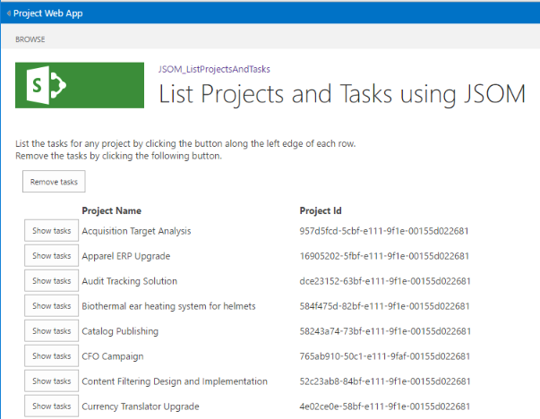

# <a name="developing-a-project-online-add-in-using-the-javascript-object-model-jsom"></a><span data-ttu-id="c7deb-105">开发的 Project Online 外接程序使用 JavaScript 对象模型 (JSOM)</span><span class="sxs-lookup"><span data-stu-id="c7deb-105">Developing a Project Online add-in using the JavaScript Object Model (JSOM)</span></span>

<span data-ttu-id="c7deb-106">本文介绍 Microsoft Project Online 的加载项开发来增强您使用 Project Online 的体验。</span><span class="sxs-lookup"><span data-stu-id="c7deb-106">This article describes Microsoft Project Online Add-in development to enhance your experience with the Project Online.</span></span> <span data-ttu-id="c7deb-107">开发项目是作为演练实现的。</span><span class="sxs-lookup"><span data-stu-id="c7deb-107">The development project is implemented as a walkthrough.</span></span> <span data-ttu-id="c7deb-108">外接程序用于本文读取和显示的项目名称和 Id 的已发布项目从您的 Project Online 帐户并允许您以检索与各个项目的任务向下钻取。</span><span class="sxs-lookup"><span data-stu-id="c7deb-108">The add-in used for this article reads and displays the project names and IDs of the published projects from your Project Online account and allows you to drill down to retrieve tasks associated with individual projects.</span></span>
  
<span data-ttu-id="c7deb-109">在运行时外, 接程序列出看起来类似于下图：</span><span class="sxs-lookup"><span data-stu-id="c7deb-109">At run time, the add-in listing looks similar to the following illustration:</span></span>
  
<span data-ttu-id="c7deb-110"></span><span class="sxs-lookup"><span data-stu-id="c7deb-110"></span></span>
  
<span data-ttu-id="c7deb-111">该示例的重点是使用 Project Online，进行查询并从服务设置为每个请求的上下文的交互。</span><span class="sxs-lookup"><span data-stu-id="c7deb-111">The focus of the example is the interaction with the Project Online, making queries and setting the context for each request from the service.</span></span> <span data-ttu-id="c7deb-112">用户界面 (UI) 元素得到最少的关注。</span><span class="sxs-lookup"><span data-stu-id="c7deb-112">User interface (UI) elements receive minimal attention.</span></span> <span data-ttu-id="c7deb-113">而是源列表提供了有关用户界面的注释。</span><span class="sxs-lookup"><span data-stu-id="c7deb-113">Instead, the source listings provide comments regarding the UI.</span></span>
  
> [!NOTE]
> <span data-ttu-id="c7deb-114">示例加载项，Visual Studio 项目中，源文件位于： https://github.com/OfficeDev/Project-JSOM-List-Projects-Tasks....。</span><span class="sxs-lookup"><span data-stu-id="c7deb-114">The source files for the example add-in, a Visual Studio project, are available at: https://github.com/OfficeDev/Project-JSOM-List-Projects-Tasks.....</span></span> <span data-ttu-id="c7deb-115">保留的源文件通过单一便捷式作为引用时您阅读此文章中，为每个补充另。</span><span class="sxs-lookup"><span data-stu-id="c7deb-115">Keep the source files handy as a reference while you read the article, as each complements the other.</span></span> <span data-ttu-id="c7deb-116">Visual Studio 中的文件 project 生成且可使用最少的更改执行 — 替换为您的 PWA 文件夹下的 Project Online 租户的 URL。</span><span class="sxs-lookup"><span data-stu-id="c7deb-116">The files in the Visual Studio project build and are executable with minimal changes—substituting the URL for your Project Online tenant down to the PWA folder.</span></span> 
  
## <a name="background"></a><span data-ttu-id="c7deb-117">背景</span><span class="sxs-lookup"><span data-stu-id="c7deb-117">Background</span></span>

<span data-ttu-id="c7deb-118">Project Online 是一种 Office 365 服务，公司提供的项目组合管理 (PPM) 和项目管理办公室 (PMO) 解决方案，以进行协调和管理项目组合、 程序和项目。</span><span class="sxs-lookup"><span data-stu-id="c7deb-118">Project Online is a Office 365 service that provides companies with a project portfolio management (PPM) and project management office (PMO) solution to coordinate and manage portfolios, programs, and projects.</span></span> <span data-ttu-id="c7deb-119">Project Online 是一种不同的产品比 Project 桌面版本;尚未，Project Online 仍包含的功能来维护和跟踪整个生命周期中的项目的项目详细信息。</span><span class="sxs-lookup"><span data-stu-id="c7deb-119">Project Online is a different offering than the Project desktop editions; yet, Project Online still contains the functionality to maintain and track project details throughout the life of a project.</span></span> <span data-ttu-id="c7deb-120">Project Online 是基于 SharePoint Online。</span><span class="sxs-lookup"><span data-stu-id="c7deb-120">Project Online is built on SharePoint Online.</span></span>
  
<span data-ttu-id="c7deb-121">Project Online 中托管的加载项包含与客户端对象模型 API 进行交互的 JavaScript 和资源文件。</span><span class="sxs-lookup"><span data-stu-id="c7deb-121">A Project Online hosted add-in consists of JavaScript and resource files that interact with the Client-Side-Object-Model API.</span></span> <span data-ttu-id="c7deb-122">当用户访问的加载项时，将下载并在浏览器中执行 JavaScript 和资源。</span><span class="sxs-lookup"><span data-stu-id="c7deb-122">When the user visits the add-in, the JavaScript and resources are downloaded and executed within the browser.</span></span> <span data-ttu-id="c7deb-123">外接程序使到 Project Online 与服务进行交互，是否创建、 检索、 更新或删除数据的异步调用。</span><span class="sxs-lookup"><span data-stu-id="c7deb-123">The add-In makes asynchronous calls to Project Online to interact with the service, whether creating, retrieving, updating, or deleting data.</span></span> 
  
<span data-ttu-id="c7deb-124">Project Online 执行一个更多操作来保护信息属于其他租户中的外接程序;即，Project Online 中创建一个独立的网站，以与来自外接程序的请求进行交互。</span><span class="sxs-lookup"><span data-stu-id="c7deb-124">Project Online performs one more action to protect information that belongs to other tenants from the add-in; namely, Project Online creates an isolated site to interact with the requests from the add-in.</span></span> <span data-ttu-id="c7deb-125">Project Online 主机上不运行的任何自定义代码。</span><span class="sxs-lookup"><span data-stu-id="c7deb-125">No custom code runs on the Project Online host.</span></span> 
  
<span data-ttu-id="c7deb-126">Project Online 外接程序的开发设置使用 Visual Studio SharePoint 外接程序项目类型。</span><span class="sxs-lookup"><span data-stu-id="c7deb-126">The development setup for Project Online add-ins uses the Visual Studio SharePoint Add-in project type.</span></span> <span data-ttu-id="c7deb-127">外接程序编写 JavaScript 中, 并使用项目 JavaScript 对象模型 (JSOM) 与 Project Online 服务进行交互。</span><span class="sxs-lookup"><span data-stu-id="c7deb-127">The add-in is written in JavaScript, and uses the Project JavaScript object model (JSOM) to interact with the Project Online service.</span></span> <span data-ttu-id="c7deb-128">JSOM 从 SharePoint JSOM 继承其大部分功能。</span><span class="sxs-lookup"><span data-stu-id="c7deb-128">The JSOM inherits much of its functionality from the SharePoint JSOM.</span></span>
  
> [!NOTE]
> <span data-ttu-id="c7deb-129">加载项可以发布和销售的 Office 商店或部署到 SharePoint 上专用应用程序目录。</span><span class="sxs-lookup"><span data-stu-id="c7deb-129">Add-ins can be published and sold in the Office Store or deployed to a private app catalog on SharePoint.</span></span> <span data-ttu-id="c7deb-130">有关详细信息，请参阅[部署和发布 Office 外接程序](https://docs.microsoft.com/en-us/office/dev/add-ins/publish/publish)。</span><span class="sxs-lookup"><span data-stu-id="c7deb-130">For more information, see [Deploy and publish your Office Add-in](https://docs.microsoft.com/en-us/office/dev/add-ins/publish/publish).</span></span>
> 
> <span data-ttu-id="c7deb-131">使用本文中的外接程序是面向开发人员; 示例它不是为在生产环境中使用。</span><span class="sxs-lookup"><span data-stu-id="c7deb-131">The add-in used in this article is a sample for developers; it is not intended for use in a production environment.</span></span> <span data-ttu-id="c7deb-132">主要用途是显示 for Project Online 中的应用程序开发的示例。</span><span class="sxs-lookup"><span data-stu-id="c7deb-132">The primary purpose is to show an example of app development for Project Online.</span></span> 
  
## <a name="prerequisites"></a><span data-ttu-id="c7deb-133">先决条件</span><span class="sxs-lookup"><span data-stu-id="c7deb-133">Prerequisites</span></span>

<span data-ttu-id="c7deb-134">向支持 Windows 环境中添加以下各项：</span><span class="sxs-lookup"><span data-stu-id="c7deb-134">Add the following items to a supported Windows environment:</span></span>
  
- <span data-ttu-id="c7deb-135">**.NET framework 4.0 或更高版本**： 4.0 版从框架的完整版本的兼容。</span><span class="sxs-lookup"><span data-stu-id="c7deb-135">**.NET Framework 4.0 or later**: Complete versions of the framework from version 4.0 are compatible.</span></span> <span data-ttu-id="c7deb-136">下载站点是https://msdn.microsoft.com/en-us/vstudio/aa496123.aspx。</span><span class="sxs-lookup"><span data-stu-id="c7deb-136">The download site is https://msdn.microsoft.com/en-us/vstudio/aa496123.aspx.</span></span>
    
- <span data-ttu-id="c7deb-137">**Visual Studio 2013 或更高版本**：</span><span class="sxs-lookup"><span data-stu-id="c7deb-137">**Visual Studio 2013 or later**:</span></span>  
    
   - <span data-ttu-id="c7deb-138">Visual Studio 2015 专业版已准备好转出的框中，可在https://www.visualstudio.com/en-us/products/visual-studio-professional-with-msdn-vs.aspx。</span><span class="sxs-lookup"><span data-stu-id="c7deb-138">The professional edition of Visual Studio 2015 is ready to go out-of-the box and is available at https://www.visualstudio.com/en-us/products/visual-studio-professional-with-msdn-vs.aspx.</span></span>
    
   - <span data-ttu-id="c7deb-139">社区版本的 Visual Studio 2015 位于https://www.visualstudio.com/en-us/products/visual-studio-community-vs.aspx。</span><span class="sxs-lookup"><span data-stu-id="c7deb-139">The community edition of Visual Studio 2015 is available at https://www.visualstudio.com/en-us/products/visual-studio-community-vs.aspx.</span></span> <span data-ttu-id="c7deb-140">此版本的 Visual Studio 需要手动安装 Microsoft Office 开发人员工具。</span><span class="sxs-lookup"><span data-stu-id="c7deb-140">This edition requires manual installation of the Microsoft Office Developer Tools for Visual Studio.</span></span>
    
   <span data-ttu-id="c7deb-141">Microsoft Visual Studio 的 Office 开发人员工具，可从https://www.visualstudio.com/en-us/features/office-tools-vs.aspx。</span><span class="sxs-lookup"><span data-stu-id="c7deb-141">The Microsoft Office Developer Tools for Visual Studio are available at https://www.visualstudio.com/en-us/features/office-tools-vs.aspx.</span></span>
    
- <span data-ttu-id="c7deb-142">**Project Online 帐户**： 这提供了对承载服务的访问。</span><span class="sxs-lookup"><span data-stu-id="c7deb-142">**A Project Online account**: This provides access to the hosting service.</span></span> <span data-ttu-id="c7deb-143">有关获取 Project Online 帐户的详细信息，请参阅https://products.office.com/en-us/Project/project-online-portfolio-management。</span><span class="sxs-lookup"><span data-stu-id="c7deb-143">For more information about obtaining a Project Online account, see https://products.office.com/en-us/Project/project-online-portfolio-management.</span></span>
    
   <span data-ttu-id="c7deb-144">确保外接程序用户具有权限不足，无法访问 Project Online 租户中的某些项目。</span><span class="sxs-lookup"><span data-stu-id="c7deb-144">Ensure that the add-in user has sufficient authorization to access some projects in the Project Online tenant.</span></span> 
    
- <span data-ttu-id="c7deb-145">**承载的网站上的项目**填充的信息。</span><span class="sxs-lookup"><span data-stu-id="c7deb-145">**Projects on the hosting site** that are populated with information.</span></span>
    
> [!NOTE]
> <span data-ttu-id="c7deb-146">标准.NET Framework 是要使用的正确框架。</span><span class="sxs-lookup"><span data-stu-id="c7deb-146">The standard .NET Framework is the correct framework to use.</span></span> <span data-ttu-id="c7deb-147">不要使用".NET Framework 4 客户端配置文件"。</span><span class="sxs-lookup"><span data-stu-id="c7deb-147">Do not use the ".NET Framework 4 Client Profile".</span></span> 
  
### <a name="set-up-the-visual-studio-project"></a><span data-ttu-id="c7deb-148">设置 Visual Studio 项目</span><span class="sxs-lookup"><span data-stu-id="c7deb-148">Set up the Visual Studio project</span></span>

<span data-ttu-id="c7deb-149">应用程序安装由创建新项目、 链接合适的库和声明所需的命名空间组成。</span><span class="sxs-lookup"><span data-stu-id="c7deb-149">The application setup consists of creating a new project, linking the appropriate libraries and declaring the needed namespaces.</span></span> <span data-ttu-id="c7deb-150">Visual Studio 提供了几种类型的开发项目。</span><span class="sxs-lookup"><span data-stu-id="c7deb-150">Visual Studio presents several types of development projects.</span></span> <span data-ttu-id="c7deb-151">在部分，简要和非常基本。</span><span class="sxs-lookup"><span data-stu-id="c7deb-151">The section is brief and very basic.</span></span> <span data-ttu-id="c7deb-152">值遇到信息合并在一个位置。</span><span class="sxs-lookup"><span data-stu-id="c7deb-152">The value is having the information is coalesced in one place.</span></span>
  
#### <a name="select-a-visual-studio-project"></a><span data-ttu-id="c7deb-153">选择 Visual Studio 项目</span><span class="sxs-lookup"><span data-stu-id="c7deb-153">Select a Visual Studio project</span></span>

<span data-ttu-id="c7deb-154">若要创建外接程序的适当类型的项目时，必须执行以下步骤。</span><span class="sxs-lookup"><span data-stu-id="c7deb-154">To create a project of the appropriate type for the add-in, you must do the following steps.</span></span> <span data-ttu-id="c7deb-155">在屏幕上遇到关键字具有**粗体**属性：</span><span class="sxs-lookup"><span data-stu-id="c7deb-155">Keywords encountered on the screen have a **bold** attribute:</span></span> 
  
1. <span data-ttu-id="c7deb-156">从文件菜单中，选择**文件** > **新建** > **项目**。</span><span class="sxs-lookup"><span data-stu-id="c7deb-156">From the File menu, choose **File** > **New** > **Project**.</span></span> 
    
2. <span data-ttu-id="c7deb-157">从已安装的模板的左窗格中，选择**C#** > **Office/SharePoint** > **Web 加载项**。</span><span class="sxs-lookup"><span data-stu-id="c7deb-157">From the Installed templates in the left pane, select **C#** > **Office/SharePoint** > **Web Add-ins**.</span></span> 
    
3. <span data-ttu-id="c7deb-158">在中央窗格的顶部，选择 **.NET Framework 4**或更高版本;当前版本是 4.6。</span><span class="sxs-lookup"><span data-stu-id="c7deb-158">At the top of the central pane, select **.NET Framework 4** or later; the current version is 4.6.</span></span> 
    
4. <span data-ttu-id="c7deb-159">从类型的应用程序的中央窗格中，选择**SharePoint 加载项**。</span><span class="sxs-lookup"><span data-stu-id="c7deb-159">From the application types in the central pane, choose **SharePoint Add-in**.</span></span> 
    
5. <span data-ttu-id="c7deb-160">在底部部分中，指定的名称和位置的项目，并解决方案名称。</span><span class="sxs-lookup"><span data-stu-id="c7deb-160">In the bottom section, specify a name and location for the project, and a solution name.</span></span> 
    
6. <span data-ttu-id="c7deb-161">此外在底部部分中，检查**创建解决方案的目录**框中。</span><span class="sxs-lookup"><span data-stu-id="c7deb-161">Also in the bottom section, check the **Create directory for solution** box.</span></span> 
    
7. <span data-ttu-id="c7deb-162">单击**确定**以创建初始项目。</span><span class="sxs-lookup"><span data-stu-id="c7deb-162">Click **OK** to create the initial project.</span></span> 
    
<span data-ttu-id="c7deb-163">在两个遵循的对话框中，Visual Studio 向导会有关 Project Online 中设置网站 （称为 SharePoint 设置在该对话框） 询问几个后续问题。</span><span class="sxs-lookup"><span data-stu-id="c7deb-163">The Visual Studio Wizard asks a few follow-up questions about the Project Online settings site (called SharePoint settings in the dialogs) in a couple of dialogs that follow.</span></span> <span data-ttu-id="c7deb-164">下面是这些问题：</span><span class="sxs-lookup"><span data-stu-id="c7deb-164">Here are the questions:</span></span>
  
1. <span data-ttu-id="c7deb-165">要用于调试您的加载项将哪个 SharePoint 网站？</span><span class="sxs-lookup"><span data-stu-id="c7deb-165">What SharePoint site do you want to use for debugging your add-in?</span></span> <span data-ttu-id="c7deb-166">指定您的 PWA 网站的 URL，如https://contoso.sharepoint.com/sites/pwa。</span><span class="sxs-lookup"><span data-stu-id="c7deb-166">Specify the URL to your PWA site, such as https://contoso.sharepoint.com/sites/pwa.</span></span>
    
2. <span data-ttu-id="c7deb-167">您希望如何承载 SharePoint 外接程序？</span><span class="sxs-lookup"><span data-stu-id="c7deb-167">How do you want to host your SharePoint Add-in?</span></span> <span data-ttu-id="c7deb-168">选择 [X] **SharePoint 承载**。</span><span class="sxs-lookup"><span data-stu-id="c7deb-168">Choose [X] **SharePoint-hosted**.</span></span>
    
   <span data-ttu-id="c7deb-169">有关 SharePoint 加载项的详细信息，包括承载选项，请参阅[SharePoint 加载项](https://docs.microsoft.com/en-us/sharepoint/dev/sp-add-ins/sharepoint-add-ins)。</span><span class="sxs-lookup"><span data-stu-id="c7deb-169">For more information about SharePoint Add-ins, including hosting options, see [SharePoint Add-ins](https://docs.microsoft.com/en-us/sharepoint/dev/sp-add-ins/sharepoint-add-ins).</span></span>
    
3. <span data-ttu-id="c7deb-170">单击“下一步”****。</span><span class="sxs-lookup"><span data-stu-id="c7deb-170">Click **Next**.</span></span> 
    
<span data-ttu-id="c7deb-171">第二个其他对话框询问您指定的外接程序的 SharePoint Online 版本：</span><span class="sxs-lookup"><span data-stu-id="c7deb-171">The second additional dialog asks you to specify the SharePoint Online version for the add-in:</span></span> 
  
1. <span data-ttu-id="c7deb-172">什么是您希望加载项到目标的 SharePoint 的最早版本？</span><span class="sxs-lookup"><span data-stu-id="c7deb-172">What's the earliest version of SharePoint that you want your add-in to target?</span></span> <span data-ttu-id="c7deb-173">选择 [X] S **harePoint 联机**。</span><span class="sxs-lookup"><span data-stu-id="c7deb-173">Choose [X] S **harePoint-Online**.</span></span> 
    
2. <span data-ttu-id="c7deb-174">单击“完成”****。</span><span class="sxs-lookup"><span data-stu-id="c7deb-174">Click **Finish**.</span></span> 
    
<span data-ttu-id="c7deb-175">Visual Studio 创建项目并访问的 Project Online 网站。</span><span class="sxs-lookup"><span data-stu-id="c7deb-175">Visual Studio creates the project and accesses the Project Online site.</span></span> 
  
### <a name="enable-sideloading-on-the-project-online-site"></a><span data-ttu-id="c7deb-176">启用 Project Online 网站上的 sideloading</span><span class="sxs-lookup"><span data-stu-id="c7deb-176">Enable sideloading on the Project Online site</span></span>

<span data-ttu-id="c7deb-177">Sideloading 是用于测试和调试 Project Online 的加载项的机制。需要两个脚本 sideloading： 一个启用 sideloading 上 Project Online 网站，另一个用于禁用 sideloading 后完成测试和调试外接程序。</span><span class="sxs-lookup"><span data-stu-id="c7deb-177">Sideloading is the mechanism for testing and debugging Project Online add-ins. You need two scripts for sideloading: one to enable sideloading on your Project Online site and another to disable sideloading once you finish testing and debugging the add-in.</span></span>
  
<span data-ttu-id="c7deb-178">有关 sideloading 设置的详细信息，请参阅[启用应用程序 SideLoading 非开发人员网站集](https://blogs.msdn.microsoft.com/officeapps/2013/12/10/enable-app-sideloading-in-your-non-developer-site-collection/)。</span><span class="sxs-lookup"><span data-stu-id="c7deb-178">For more information about setting up sideloading, see [Enable app SideLoading in your non-developer site collection](https://blogs.msdn.microsoft.com/officeapps/2013/12/10/enable-app-sideloading-in-your-non-developer-site-collection/).</span></span>
  
> [!NOTE]
> <span data-ttu-id="c7deb-179">Sideloading 应用程序是开发人员/测试功能。</span><span class="sxs-lookup"><span data-stu-id="c7deb-179">Sideloading apps is a developer/test feature.</span></span> <span data-ttu-id="c7deb-180">它是**不用于生产用途**。</span><span class="sxs-lookup"><span data-stu-id="c7deb-180">It is **not intended for production use**.</span></span> <span data-ttu-id="c7deb-181">定期，不要不 sideload 应用程序或保留应用程序 sideloading 启用比您当前正在使用的功能更长时间。</span><span class="sxs-lookup"><span data-stu-id="c7deb-181">Do not sideload apps regularly, or keep app sideloading enabled for longer than you are actively using the feature.</span></span> 
  
## <a name="add-content-to-the-add-in-project"></a><span data-ttu-id="c7deb-182">将内容添加到加载项项目</span><span class="sxs-lookup"><span data-stu-id="c7deb-182">Add content to the add-in project</span></span>

<span data-ttu-id="c7deb-183">创建项目并设置调试机制之后, 将内容添加到应用程序包括以下任务：</span><span class="sxs-lookup"><span data-stu-id="c7deb-183">After creating a project and setting up the debugging mechanism, adding content to the app includes the following tasks:</span></span>
  
- <span data-ttu-id="c7deb-184">设置应用程序范围</span><span class="sxs-lookup"><span data-stu-id="c7deb-184">Setting the application scope</span></span>
    
- <span data-ttu-id="c7deb-185">链接的 JSOM 库</span><span class="sxs-lookup"><span data-stu-id="c7deb-185">Linking the JSOM library</span></span>
    
- <span data-ttu-id="c7deb-186">将 UI 元素添加到加载项</span><span class="sxs-lookup"><span data-stu-id="c7deb-186">Adding UI Elements to the add-in</span></span>
    
- <span data-ttu-id="c7deb-187">初始化并连接到 Project Online 服务</span><span class="sxs-lookup"><span data-stu-id="c7deb-187">Initializing and connecting to the Project Online service</span></span>
    
- <span data-ttu-id="c7deb-188">检索项目和详细信息/属性</span><span class="sxs-lookup"><span data-stu-id="c7deb-188">Retrieving projects and details/properties</span></span>
    
- <span data-ttu-id="c7deb-189">显示项目</span><span class="sxs-lookup"><span data-stu-id="c7deb-189">Displaying projects</span></span>
    
- <span data-ttu-id="c7deb-190">显示任务项目</span><span class="sxs-lookup"><span data-stu-id="c7deb-190">Displaying tasks for a Project</span></span>
    
<span data-ttu-id="c7deb-191">外接程序项目包含多个文件。</span><span class="sxs-lookup"><span data-stu-id="c7deb-191">The add-in project consists of many files.</span></span> <span data-ttu-id="c7deb-192">本示例中，您需要编辑以下文件：</span><span class="sxs-lookup"><span data-stu-id="c7deb-192">In this example, you'll need to edit the following files:</span></span> 
  
- <span data-ttu-id="c7deb-193">AppManifest.xml</span><span class="sxs-lookup"><span data-stu-id="c7deb-193">AppManifest.xml</span></span>
    
- <span data-ttu-id="c7deb-194">Default.aspx</span><span class="sxs-lookup"><span data-stu-id="c7deb-194">Default.aspx</span></span>
    
- <span data-ttu-id="c7deb-195">App.js</span><span class="sxs-lookup"><span data-stu-id="c7deb-195">App.js</span></span>
    
- <span data-ttu-id="c7deb-196">App.css-可选;包含开发加载项的样式定义</span><span class="sxs-lookup"><span data-stu-id="c7deb-196">App.css - optional; contains style definitions developed for the add-in</span></span>
    
<span data-ttu-id="c7deb-197">如果 Project Online 租户发生更改，如进入从试用订阅网站，您可以更新项目属性，包括服务器连接和网站 URL，使用属性窗口可通过**查看** > **属性窗口**命令。</span><span class="sxs-lookup"><span data-stu-id="c7deb-197">If the Project Online tenant changes, such as moving from a trial to a subscription site, you can update the project properties, including the Server Connection and Site URL, using the Properties Window available through the **View** > **Properties Window** command.</span></span> 
  
<span data-ttu-id="c7deb-198">您还可以将文件添加到项目。</span><span class="sxs-lookup"><span data-stu-id="c7deb-198">You can also add files to the project.</span></span> <span data-ttu-id="c7deb-199">如果是这样，您需要更新位于同一组 （内容、 图像、 页面或脚本） 以包含新文件中的 Elements.xml 文件。</span><span class="sxs-lookup"><span data-stu-id="c7deb-199">If so, you'll need to update the Elements.xml file located in the same group (Content, Images, Pages, or Scripts) to include the new files.</span></span> <span data-ttu-id="c7deb-200">有关项目文件的详细信息，请参阅[了解应用程序清单结构和包的 SharePoint 外接程序](https://docs.microsoft.com/en-us/sharepoint/dev/sp-add-ins/explore-the-app-manifest-structure-and-the-package-of-a-sharepoint-add-in)。</span><span class="sxs-lookup"><span data-stu-id="c7deb-200">For more information about the project files, see [Explore the app manifest structure and the package of a SharePoint Add-in](https://docs.microsoft.com/en-us/sharepoint/dev/sp-add-ins/explore-the-app-manifest-structure-and-the-package-of-a-sharepoint-add-in).</span></span>
  
### <a name="set-application-scope"></a><span data-ttu-id="c7deb-201">设置应用程序范围</span><span class="sxs-lookup"><span data-stu-id="c7deb-201">Set application scope</span></span>

<span data-ttu-id="c7deb-202">外接程序需要该服务在查询结果中返回信息之前定义的范围或权限级别。</span><span class="sxs-lookup"><span data-stu-id="c7deb-202">The add-in needs scope or permission levels defined before the service returns information in query results.</span></span> <span data-ttu-id="c7deb-203">对于此外接程序，使用 Visual Studio 项目的以下范围。</span><span class="sxs-lookup"><span data-stu-id="c7deb-203">For this add-in, use the following scope to the Visual Studio project.</span></span> <span data-ttu-id="c7deb-204">对 AppManifest.xml 文件权限选项卡中进行此更改：</span><span class="sxs-lookup"><span data-stu-id="c7deb-204">This change is made to the AppManifest.xml file in the Permissions tab:</span></span>

|<span data-ttu-id="c7deb-205">范围</span><span class="sxs-lookup"><span data-stu-id="c7deb-205">Scope</span></span>|<span data-ttu-id="c7deb-206">权限</span><span class="sxs-lookup"><span data-stu-id="c7deb-206">Permission</span></span>|
|:-----|:-----|
|<span data-ttu-id="c7deb-207">多个项目 (Project Server)</span><span class="sxs-lookup"><span data-stu-id="c7deb-207">Multiple Projects (Project Server)</span></span>  <br/> |<span data-ttu-id="c7deb-208">Read</span><span class="sxs-lookup"><span data-stu-id="c7deb-208">Read</span></span>  <br/> |
   
<span data-ttu-id="c7deb-209">设置应用程序范围后保存文件。</span><span class="sxs-lookup"><span data-stu-id="c7deb-209">Save the file after setting the application scope.</span></span> <span data-ttu-id="c7deb-210">否则，将从服务不返回任何数据。</span><span class="sxs-lookup"><span data-stu-id="c7deb-210">Otherwise, no data will be returned from the service.</span></span> 
  
### <a name="link-the-jsom-library"></a><span data-ttu-id="c7deb-211">链接 JSOM 库</span><span class="sxs-lookup"><span data-stu-id="c7deb-211">Link the JSOM library</span></span>

<span data-ttu-id="c7deb-212">运行时 Project Online 库，PS.js 和 PS.debug.js，提供的 Project Online 和始终是最新版本。</span><span class="sxs-lookup"><span data-stu-id="c7deb-212">The runtime Project Online libraries, PS.js and PS.debug.js, are provided by Project Online and are always the most recent version.</span></span> <span data-ttu-id="c7deb-213">JavaScript 加载项使用 JSOM 必须与这些库之一链接。</span><span class="sxs-lookup"><span data-stu-id="c7deb-213">JavaScript add-ins that use JSOM must link with one of these libraries.</span></span> <span data-ttu-id="c7deb-214">在 Default.aspx 文件中添加链接的定义。</span><span class="sxs-lookup"><span data-stu-id="c7deb-214">The linking definitions are added in the Default.aspx file.</span></span> <span data-ttu-id="c7deb-215">若要使用的 PS.js 和/或 PS.debug.js 的命令是代码的位于 App.js 文件中的一部分。</span><span class="sxs-lookup"><span data-stu-id="c7deb-215">The commands to use the PS.js and/or PS.debug.js are part of the code located in the App.js file.</span></span>
  
<span data-ttu-id="c7deb-216">添加下面的命令中的 PS.js 或 PS.debug.js 定义`<asp:Content ContentPlaceHolderID="PlaceHolderAdditionalPageHead"`元素关注"sharepoint: Scriptlink"的 sp.js。</span><span class="sxs-lookup"><span data-stu-id="c7deb-216">Add the following command for PS.js or PS.debug.js definition in the  `<asp:Content ContentPlaceHolderID="PlaceHolderAdditionalPageHead"` element following the "SharePoint:ScriptLink" for sp.js.</span></span> 
  
```js
<SharePoint:ScriptLink name="PS.js" runat="server" OnDemand="false" LoadAfterUI="true" Localizable="false" />
```

> [!NOTE]
> <span data-ttu-id="c7deb-217">PS.js 或 PS.debug.js **ondemand 时**属性设置为**false**。</span><span class="sxs-lookup"><span data-stu-id="c7deb-217">The **OnDemand** attribute for PS.js or PS.debug.js set to **false**.</span></span> 
  
### <a name="add-ui-elements-to-the-add-in"></a><span data-ttu-id="c7deb-218">将 UI 元素添加到加载项</span><span class="sxs-lookup"><span data-stu-id="c7deb-218">Add UI elements to the add-in</span></span>

<span data-ttu-id="c7deb-219">示例加载项包括几个组件。</span><span class="sxs-lookup"><span data-stu-id="c7deb-219">The example add-in consists of a few components.</span></span> <span data-ttu-id="c7deb-220">静态元素说明位于 Default.aspx 文件中。</span><span class="sxs-lookup"><span data-stu-id="c7deb-220">Static element descriptions are located in the Default.aspx file.</span></span> <span data-ttu-id="c7deb-221">动态元素说明和代码的所有组件都位于 App.js 文件。</span><span class="sxs-lookup"><span data-stu-id="c7deb-221">Dynamic element descriptions and code for all components are located in the App.js file.</span></span> <span data-ttu-id="c7deb-222">有关组件的注释，请参阅源代码清单。</span><span class="sxs-lookup"><span data-stu-id="c7deb-222">For comments regarding the components, refer to the source code listings.</span></span> <span data-ttu-id="c7deb-223">下面是在外接程序的用户界面组件的列表：</span><span class="sxs-lookup"><span data-stu-id="c7deb-223">Here is a list of the UI components in the add-in:</span></span>
  
- <span data-ttu-id="c7deb-224">Title</span><span class="sxs-lookup"><span data-stu-id="c7deb-224">Title</span></span>
    
- <span data-ttu-id="c7deb-225">介绍性措辞</span><span class="sxs-lookup"><span data-stu-id="c7deb-225">Introductory verbiage</span></span>
    
- <span data-ttu-id="c7deb-226">若要从表中删除任务的按钮</span><span class="sxs-lookup"><span data-stu-id="c7deb-226">Button to remove tasks from the table</span></span>
    
- <span data-ttu-id="c7deb-227">列出项目 ID 和名称和任务信息的表。</span><span class="sxs-lookup"><span data-stu-id="c7deb-227">Table that lists the project ID and name, and the task information.</span></span>
    
- <span data-ttu-id="c7deb-228">任务导入到表中的任务数据的按钮 （克隆一次为每个项目）。</span><span class="sxs-lookup"><span data-stu-id="c7deb-228">Tasks Button (cloned once for each project) that imports task data into the table.</span></span>
    
<span data-ttu-id="c7deb-229">有关详细信息的用户界面中，如标题和页眉部分的项目表中，请参阅 Default.aspx 项目文件。</span><span class="sxs-lookup"><span data-stu-id="c7deb-229">For details of the user interface, such as the title and the header portion of the project table, see the Default.aspx project file.</span></span>
  
### <a name="initialize-and-connect-to-the-host-system"></a><span data-ttu-id="c7deb-230">初始化并连接到主机系统</span><span class="sxs-lookup"><span data-stu-id="c7deb-230">Initialize and connect to the host system</span></span>

<span data-ttu-id="c7deb-231">App.js 文件包含 JavaScript 代码。</span><span class="sxs-lookup"><span data-stu-id="c7deb-231">The App.js file contains the JavaScript code.</span></span> <span data-ttu-id="c7deb-232">外接程序在浏览器中，加载 PS.js，然后调用 initializePage 函数。</span><span class="sxs-lookup"><span data-stu-id="c7deb-232">The add-in loads PS.js in the browser, and then calls the initializePage function.</span></span> <span data-ttu-id="c7deb-233">InitializePage 检索到 Project Online 的终结点的上下文，并启动 loadProjects 函数。</span><span class="sxs-lookup"><span data-stu-id="c7deb-233">InitializePage retrieves a context to the Project Online endpoint and starts the loadProjects function.</span></span>
  
```js
    'use strict';
    SP.SOD.executeOrDelayUntilScriptLoaded(initializePage, "PS.js");
    //Project PWA Context and published projects in PWA
    var projContext;
    var projects;
    function initializePage() {
        //Get the Project context for this web
        projContext = PS.ProjectContext.get_current();
        loadProjects();
    }
    //General CSOM failure event handler
    //Invoked when ExecuteQueryAsync returns unsuccessfully
    function onRequestFailed(sender, args) {
        alert("Failed to execute: " + args.get_message());
        return;
    };

```

### <a name="retrieve-the-projects"></a><span data-ttu-id="c7deb-234">检索项目</span><span class="sxs-lookup"><span data-stu-id="c7deb-234">Retrieve the projects</span></span>

<span data-ttu-id="c7deb-235">LoadProjects 函数查询的项目名称和 Id 的服务。</span><span class="sxs-lookup"><span data-stu-id="c7deb-235">The loadProjects function queries the service for the project names and IDs.</span></span> 
  
<span data-ttu-id="c7deb-236">应用程序检索的项目名称和项目 id。有关项目的其他信息并且可访问通过修改 load 方法来显式标识要检索的属性。</span><span class="sxs-lookup"><span data-stu-id="c7deb-236">The application retrieves the project name and project Id. Other information about the project is available and can be accessed by modifying the load method to identify explicitly the properties to retrieve.</span></span> <span data-ttu-id="c7deb-237">为注释代码中提供了示例。</span><span class="sxs-lookup"><span data-stu-id="c7deb-237">An example is provided in the code as a comment.</span></span> 
  
<span data-ttu-id="c7deb-238">如果查询成功外, 接程序将继续通过调用 displayProjects。</span><span class="sxs-lookup"><span data-stu-id="c7deb-238">If the query succeeds, the add-in continues by calling displayProjects.</span></span> 
  
```js
    //Query CSOM and get the list of projects in PWA
    function loadProjects() {
        projects = projContext.get_projects();
    //Request to server - identifies what to retrieve
        projContext.load(projects, 'Include(Name, Id)');
        //Notice to server to execute query
        projContext.executeQueryAsync(displayProjects, onRequestFailed);
        // Syntax for requesting more fields to pull down from server
        // projContext.load(projects, 'Include(Name, Description, StartDate, 
        // Id, IsCheckedOut)');
    }

```

### <a name="display-the-projects"></a><span data-ttu-id="c7deb-239">显示项目</span><span class="sxs-lookup"><span data-stu-id="c7deb-239">Display the projects</span></span>

<span data-ttu-id="c7deb-240">DisplayProjects 函数创建表格、 项目，每一行和按钮以显示特定项目的任务。</span><span class="sxs-lookup"><span data-stu-id="c7deb-240">The displayProjects function creates a table, one row per project, and a button to show the tasks for the specific project.</span></span> 
  
```js
    //Display the projects with names and ids in a table
    function displayProjects() {
        //Current published project and ID
        var p, projId;
        //Project table rows to publish collectively
        var pTable = []; 
        var pEnum = projects.getEnumerator();
        //Build a 3-column table, with one project per row.
        while (pEnum.moveNext()) {
            p = pEnum.get_current();
        
            //Items used in getting information for table rows:
            //Current published project object, and ID and name
            // var project = p;
            // var projId = p.get_id();
            // var projName = p.get_name();
        
            //Continue processing/working with project object as needed.
        }
    }

```

> [!NOTE]
> <span data-ttu-id="c7deb-241">While 循环访问 ID 和 name 属性。</span><span class="sxs-lookup"><span data-stu-id="c7deb-241">The while loop accesses the ID and name properties.</span></span> <span data-ttu-id="c7deb-242">这是略有不同于源代码项目调用的函数，依次访问相同的属性。</span><span class="sxs-lookup"><span data-stu-id="c7deb-242">This is slightly different than the source code project that calls a function that, in turn, accesses the same properties.</span></span> 
  
### <a name="display-the-tasks-for-a-project"></a><span data-ttu-id="c7deb-243">显示项目的任务</span><span class="sxs-lookup"><span data-stu-id="c7deb-243">Display the tasks for a project</span></span>

<span data-ttu-id="c7deb-244">任务外, 接程序的一部分时不属于初始加载。</span><span class="sxs-lookup"><span data-stu-id="c7deb-244">The tasks, while part of the add-in, are not part of the initial loading.</span></span> <span data-ttu-id="c7deb-245">如果用户希望与项目关联的任务，单击"显示任务"按钮会使用 btnLoadTasks 事件处理程序的列表中显示的任务。</span><span class="sxs-lookup"><span data-stu-id="c7deb-245">If the user is interested in the tasks associated with a project, clicking the "Show Tasks" button causes the tasks to display in the list using the btnLoadTasks event handler.</span></span> 
  
<span data-ttu-id="c7deb-246">BtnLoadTasks 事件处理程序中，具有适当的项目 ID，从服务器请求指定的项目的任务。</span><span class="sxs-lookup"><span data-stu-id="c7deb-246">The btnLoadTasks event handler, with the appropriate project ID, requests the tasks for the specified project from the server.</span></span> <span data-ttu-id="c7deb-247">检索后，btnLoadTasks 会将任务列表传递给 displayTasks 演示屏幕上的任务。</span><span class="sxs-lookup"><span data-stu-id="c7deb-247">Once retrieved, btnLoadTasks passes the task list to displayTasks to present the tasks onscreen.</span></span>
  
```js
    //Query CSOM and get the list of tasks for a specific project
    function btnLoadTasks(pid) {
        //Event handler for the "Show tasks" buttons. 
        //
        //The project ID is the sole argument and is used to get the appropriate task 
        //info from the service.
        //The project ID is also the button name, and is used to identify where to place
        //the task information in the table.
        //
        //Project ID to pass to the event handler
        var projId = pid;
        //
        //Get the project reference
        var pProj = projects.getById(projId);
        //
        //Get the tasks collection reference associated with the project.
        var tasks = pProj.get_tasks();
        //
        projContext.load(tasks, 'Include(Id, Name, Start, ScheduledStart, Completion)');
        //
        //If the query succeeds, displayTasks presents the tasks to the user.
        projContext.executeQueryAsync(function () { displayTasks(tasks, projId) }, onRequestFailed);
    }

```

<span data-ttu-id="c7deb-248">DisplayTasks 函数显示与紧下方的项目项为指定项目的任务。</span><span class="sxs-lookup"><span data-stu-id="c7deb-248">The displayTasks function displays the tasks associated with a specified project immediately beneath the project entry.</span></span>
  
```js
    //Insert tasks for the specified project immediately underneath the project entry 
    //in the table.
    function displayTasks(tasks, projId) {
        //selected project ID
        var pId = projId;
        //individual task
        var t;
        //Task table rows to publish collectively
        var tTable = [];
        var tEnum = tasks.getEnumerator();
        //Build table one task per row.
        while (tEnum.moveNext()) {
            t = tEnum.get_current();
            //
            //Items used in getting information for table rows:
            //Current task object, and ID and name
            // var task = t;
            // var taskId = t.get_id();
            // var taskName = t.get_name();
            
            //Continue processing/working with task object as needed.
        }
    }

```

> [!NOTE]
> <span data-ttu-id="c7deb-249">While 循环访问的任务 ID 和 name 属性。</span><span class="sxs-lookup"><span data-stu-id="c7deb-249">The while loop accesses the task ID and name properties.</span></span> <span data-ttu-id="c7deb-250">这是略有不同于源代码项目调用的函数，依次访问相同的属性。</span><span class="sxs-lookup"><span data-stu-id="c7deb-250">This is slightly different than the source code project that calls a function that, in turn, accesses the same properties.</span></span> 
  
<span data-ttu-id="c7deb-251">单个项目的任务的示例输出如下所示。</span><span class="sxs-lookup"><span data-stu-id="c7deb-251">Sample output for the tasks of a single project follows.</span></span>
  
<span data-ttu-id="c7deb-252"></span><span class="sxs-lookup"><span data-stu-id="c7deb-252"></span></span>
  
## <a name="see-also"></a><span data-ttu-id="c7deb-253">另请参阅</span><span class="sxs-lookup"><span data-stu-id="c7deb-253">See also</span></span>

<span data-ttu-id="c7deb-254">有关文档和与 Project Online 和使用 CSOM 的应用程序开发相关的示例，请参阅[Project 开发门户](https://developer.microsoft.com/en-us/project)。</span><span class="sxs-lookup"><span data-stu-id="c7deb-254">For documentation and samples related to Project Online and application development using CSOM, see the [Project Development Portal](https://developer.microsoft.com/en-us/project).</span></span>
    


