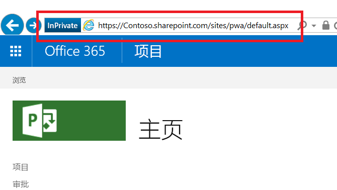

# <a name="developing-a-project-online-application-using-the-client-side-object-model-csom"></a>使用客户端对象模型开发 Project Online 应用程序（CSOM）

>[!NOTE] 
>本文介绍了如何使用 CSOM 开发 Microsoft Project Online 应用程序。 我们建议了解如何使用[新建 Project 网页版](https://developer.microsoft.com/zh-CN/office/blogs/developing-applications-and-reports-using-the-new-project/)来开发应用程序。
  
## <a name="background"></a>背景

在 20 世纪 90 年代早期，Microsoft Project 已作为桌面应用程序推出。 如今，Project 要多得多，其多个不同的版本就是很好的证明：
  
- Project 标准版桌面应用程序可作为单独的应用程序运行。
    
- Project 专业版桌面应用程序可更大规模地与服务器交互和共享数据，以及执行 Project 标准版中的功能。
    
- Project Online 是一种 Microsoft 托管的服务，可为公司提供 PMO 级解决方案，用于协调和管理项目、计划和项目组合。 Project Online 是一款不同于桌面版本的产品，它可以在整个项目周期内维护和跟踪项目的详细信息。 
    
- Project Server 是一款企业托管的服务，企业可以通过它管理和保护含有项目、计划和项目组合信息的服务器。 Project Server 可以保护内部服务器，因此，它可以提供外部托管的 Project Online 所具有的的项目、计划和项目组合功能，并且可以实现更大程度的自定义。
    
Project Online 具有三个在线 API 集：客户端对象模型 (CSOM)、JavaScript 对象模型 (JSOM) 和表述性状态转移 (REST)。 
  
- 开发与 Project Online 租户交互的 Windows 应用程序时，.NET CSOM 实施是首选界面。 以用户为中心的应用程序的典型环境包括 Windows 桌面和 Microsoft Surface 设备。 使用 .NET CSOM 编写的后端应用程序可连接至其他服务器，以获取 Project Online 外部业务逻辑和数据源。 至 Project Online 的检索请求使用类似于 LINQ 的查询系统，该系统在基本检索功能的基础上提供了多项增强功能。
    
- JavaScript 对象模型 (JSOM) 界面为 Project Online 加载项提供跨浏览器支持。加载项是指存储于 Project Online 租户中的 Web 应用程序。 当用户想要运行加载项时，加载项代码将在用户计算机上的浏览器中下载和运行。 
    
- REST/Odata 模型提供基于 HTTP 的通信，对于非 Windows 环境中的应用程序，推荐使用此界面。 通信终结点为 Project Web 应用程序 (PWA) 网站中的对象。 结果提供正常 HTTP 状态代码。
    
本文重点介绍使用 .NET CSOM 界面的应用程序。
  
## <a name="prerequisites"></a>先决条件

从运行 Windows 10 的基本系统入手，并添加以下项：
  
- .Net Framework 4.0 或更高版本 -- 使用完整的框架。 下载网站为 https://msdn.microsoft.com/vstudio/aa496123.aspx。
    
- Visual Studio 2013 或更高版本 -- 接受任何版本。 Visual Studio Community 2015 版用于开发实例应用程序。 Community 版可在 https://www.visualstudio.com/en-us/products/visual-studio-community-vs.aspx 上获取。
    
- SharePoint 客户端组件 SDK -- Project Online 和 Project Server 位于 SharePoint 和 SharePoint 程序集之上。 Visual Studio Professional 和 Enterprise 版中包含 SharePoint 客户端组件。 如果使用 Visual Studio Community 版，则可在以下网站上获取最新版 Office 开发人员工具 SDK：https://www.microsoft.com/en-us/download/details.aspx?id=35585
    
- Project Online 帐户 -- 可通过该账户访问托管网站。 有关获取 Project Online 帐户的详细信息，请参阅 https://products.office.com/en-us/Project/project-online-portfolio-management
    
- 托管网站上已填充信息的项目
    
> [!NOTE]
> 要使用的正确框架为标准 .NET Framework（4.0 或更高版本）。 请勿不使用 .NET Framework 4 Client Profile。 
  
## <a name="develop-the-application"></a>开发应用程序

开发 SharePoint 桌面应用程序时，首选界面为 Project 客户端对象模型 (CSOM)。 
  
可从 Office 开发人员中心的 Project 开发人员资源库中下载 [Project CSOM 示例](https://developer.microsoft.com/project/gallery/?filterBy=Samples,Project)。
  
前两个主题涵盖了基本问题：创建具有适当命名空间和程序集的 Visual Studio 项目；访问托管服务器。 其余主题介绍通过 CSOM 检索一个和多个对象中的信息。 
  
对于客户端应用程序，检索主机中的信息涉及两个操作步骤。 首先，应用程序向服务器指定并发送一个或多个检索请求。 其次，应用程序向服务器发送执行所提交查询的通知。 服务器通过向客户端发送查询结果来响应。
  
### <a name="set-up-the-visual-studio-project"></a>设置 Visual Studio 项目

应用程序设置由三个部分组成：新建项目、链接相应的程序集和声明所需命名空间。 Visual Studio 提供有多种类型的开发项目。 
  
#### <a name="select-a-visual-studio-project"></a>选择 Visual Studio 项目

1. 在“开始”页上启动 Visual Studio 并选择“**启动新项目**”。 
    
   “新建项目”对话框显示可用应用程序模板以及任意选定模板中的数据字段。 
    
2. 在此应用程序中，请指定以下项。 屏幕上显示的关键字采用粗体属性：
    
   1. 从左侧窗格中的“已安装的模板”中，选择“**C#** => **Windows** => **经典桌面**”。 
    
   2. 在中间窗格顶部，选择“**.NET Framework 4**”。 
    
   3. 从中间窗格的应用程序类型中，选择“**控制台应用程序**”。 
    
   4. 在底部为项目指定名称和位置以及解决方案名称。 
    
   5. 此外，在底部选中“**创建解决方案的目录**”复选框。 
    
3. 单击“**确定**”以创建初始项目。 
    
#### <a name="add-assemblies"></a>添加程序集

VS 解决方案需要使用 Project 2103 SDK 中的 ProjectServerClient 程序集、一些 SharePoint SDK 程序集和 .NET Framework System.Security 程序集。
  
1. 在 VS 解决方案资源管理器中，右键单击“引用”条目，然后从快捷菜单中选择“**添加引用…**” 。 
    
2. 选中“**Microsoft.ProjectServer.Client.dll**”。 
    
   如果需要，单击对话框底部的“**浏览…**” 按钮并导航至 Project 2013 SDK 安装目录，以找到程序集。 
    
3. 单击“**确定**”。 
    
4. 将 PrjoctServer 客户端名称空间添加到 .cs 文件。
    
   ```cs
    using Microsoft.ProjectServer.Client;
   ```

使用 NuGet 程序包管理器控制台添加 SharePoint 2013 SDK 程序集。 
  
1. 从 VS“工具”菜单中，单击以下菜单：**“工具”=\>“NuGet 程序包管理器”=\>“程序包管理器控制台”**。 
    
2. 在“程序包管理器控制台”中，输入以下命令并按 \<ENTER\>：
    
   ```cs
    Install-Package Microsoft.SharePointOnline.CSOM
   ```

   “**程序包管理器控制台**”提供命令结果描述，“VS 解决方案资源管理器”的项目首选项中显示 SharePoint 程序集。 
    
3. 价格命名空间添加到 .cs 文件：
    
   ```cs
    using Microsoft.SharePoint.Client;
   ```

System.Security 程序集是 .NET Framework 的一部分，与框架一起安装。 示例应用程序需要使用另一个命名空间，该命名空间提供了一个至托管系统的加密字符串，以便进行身份验证。 通过身份验证后，应用程序即可访问托管系统上的项目。 通过以下方式将 System.Security 命名空间添加到 .cs 文件中：
  
1. 在 VS 解决方案资源管理器中，右键单击“引用”条目，然后从快捷菜单中选择“**添加引用…**” 。 
    
2. 在“引用管理器”对话框的左侧窗格中，选择 **“程序集”=\>“框架”**，然后选中“**System.Security**”。 
    
3. 单击“**确定**”。 
    
4. 将 System.Security 命名空间添加到 .cs 文件中：
    
   ```cs
    using System.Security;
   ```

.cs 文件的开头应包含以下命名空间：
  
- System
    
- System.Collections.Generic
    
- System.Linq
    
- System.Test
    
- Microsoft.ProjectServer.Client
    
- Microsoft.SharePoint.Client
    
- System.Security
    
### <a name="connect-to-the-host-system"></a>连接至主机系统

Project Online 是一款 SharePoint 应用程序，因此，使用 SharePoint 身份验证是正确方法。 以下代码片段准备访问托管环境。
  
```cs
    class Program
    {
        private static ProjectContext projContext;
        static void Main (string[] args)
        {
            using (ProjectContext projContext = new ProjectContext("https://Contoso.sharepoint.com/sites/pwa"))
            {
                SecureString password - new SecureString();
                foreach (char c in "password".ToCharArray()) password.AppendChar(c);
                //Using SharePoint method to load Credentials
                projContext.Credentials = new SharePointOnlineCredentials("sarad@Contoso.onmicrosoft.com", password);

```

访问托管环境的准备工作包括以下事项：
  
1. 为项目创建上下文对象 -- 这包含在前面代码片段的以下代码中。 
    
   ```cs
    private static ProjectContext projContext;
    
   ```

   其他组件将继承此上下文，从而使得系统能够管理 Project 对象模型的上下文。
    
2. 识别主机网站 -- 此操作在前面代码片段的以下代码中完成。
    
   ```cs
    using (ProjectContext projContext = new ProjectContext("https://Contoso.sharepoint.com/sites/pwa"))
   ```

   实例化项目上下文时，应用程序需要提供项目网站集的根网站。 应用程序使用项目根网站的 URL 子字符串。 在下面的示例图中，用红色矩形突出显示了此位置的快照。 身份验证需要从开头到子字符串“pwa”的字符串。 在代码列表中，应用程序使用字符串“https://XXXXXXXX.sharepoint.com/sites/pwa”。
        
   
  
3. 将密码置于安全的字符串中 -- 此操作在前面代码片段的以下代码中完成。
    
   ```cs
    SecureString password - new SecureString();
    foreach (char c in "password".ToCharArray()) password.AppendChar(c);
    
   ```

   密码和用户帐户是访问主机网站的凭据。 
    
4. 将用户帐户和密码添加到上下文对象的凭据部分 -- 此操作在前面代码片段的以下代码中完成。
    
   ```cs
    projContext.Credentials = new SharePointOnlineCredentials("sarad@Contoso.onmicrosoft.com", password);
   ```

已实例化的项目上下文已可供使用。
  
### <a name="list-all-published-projects"></a>列出所有已发布的项目

Project Online 和 ProjectServer 使用代理来预服务器通信，以完成创建、报告、更新和删除 (CRUD) 操作。 与服务器通信时，主机/服务器高效处理请求，并让客户端执行以下操作：
  
1. 建立通信上下文。 
    
   此上下文供项目集合以及通过继承获得的其他对象和集合（包括任务集合、工作分配集合、阶段对象和自定义字段）使用。 
    
2. 使用对象模型指定要检索的对象、集合或数据。
    
   此步骤将 LINQ 用作查询或方法。 规范用于控制检索的内容。 通常情况下，此步骤已作为 Load 方法主体嵌入（步骤 3）。 
    
3. 使用 Load() 或 LoadQuery() 方法加载上一步中的检索规范。
    
   对于加载集合和对象，请使用 Load()。 对于具有子句（如“where”和“group”）的查询，请使用 LoadQuery()。 
    
4. 使用 ExecuteQuery() 方法执行请求。
    
   ExecuteQuery() 方法将在可执行查询时通知主机。 收到通知后，主机将执行查询并将结果发送至客户端。 
    
客户端收到结果信息之后，应用程序即可使用该信息。 下面的代码片段将会循环显示已发布的项目，并打印主机上每个已发布项目的 ID 和名称。
  
```cs
// Get the list of projects in Project Web App.
var projects = projContext.Projects;
projContext.Load(projects);
projcontext.ExecuteQuery();
foreach (PublishedProject pubProj in projContext.Projects)
{
    Console.WriteLine("\n{0}. {1}   {2} \t{3} \n", j++, pubProj.Id, pubProj.Name, pubProj.CreatedDate);
}

```

输出：
  
```cs
Published Project count:2
1. be80a848-b2ef-e511-80f4-00155dc84e01   A second Project     3/21/2016 10:14:40 PM
2. 9d730a1a-60ed-e511-80f6-00155dc87d01   Ent_Proj_1   3/18/2016 11:21:14 PM

```

### <a name="make-a-request"></a>发出请求

通过使用上一代码片段中的操作，应用程序可以在托管网站上检索指定账户中的项目列表。 
  
1. ProjectContext 已指定为要列出的项目。 
    
   ```cs
    var projects = projContext.Projects;
   ```

2. 指定要检索的项目。 
    
   ```cs
    projContext.Load(projects);
   ```

   只需指定集合，服务器即可检索项目集合，并用默认属性集中的值填充每个项目。 如果访问的属性是默认属性集的一部分，则获得成功结果。 如果访问的属性不是默认属性集的一部分，则会出现“未初始化”异常。
    
3. 加载请求 (projContext.Load)。
    
   这是上一步骤的一部分。
    
4. 执行查询 (ExecuteQuery)。 
    
   ```cs
    projContext.ExecuteQuery();
   ```

### <a name="retrieve-high-level-project-information"></a>检索高级项目信息

必须在发送到服务器的请求中指定非默认属性的属性。 在上一示例中，下一代码片段将加载项目集合上下文。 然后，规范将会请求要包括在结果中的其他非默认。 
  
```cs
var projects = projContext.Projects;
projContext.Load(projects,
    ps => ps.IncludeWithDefaultProperties(
        p => p.StartDate, p => p.Phase, p => p.Stage));
projContext.ExecuteQuery();

```

load 语句指定项目集合上下文，并将 StartDate、Phase 和 Stage 添加到查询结果中。 其他属性可以是标量、对象或集合。 可直接访问标量项。 对象和集合需要按照以下代码片段所示进行额外的处理。
  
```cs
// Using the previous definition and Load statement …
projContext.ExecuteQuery();
foreach (PublishedProject pubProj in projContext.Projects)
{
Console.WriteLine("\n\t{0}. \t{1} \n\t{2} \n\t{3} \n", j++, pubProj.Id, pubProj.Name,
    pubProj.CreatedDate);
             // The following statement generates an exception about the object 
             // reference not being set to an instance on the server. 
             // Console.WriteLine("\tCurrent Phase:\t{0}", pubProj.Phase.Name);
             // Phase and Stage are not published with the rest of the data. Need to pull these objects from the server.
             Phase oPhase = pubProj.Phase;
             projContext.Load(oPhase);
             projContext.ExecuteQuery();
             //if-else fails because the else case fails with "Microsoft.SharePoint.Client.ServerObjectNullReferenceException".
             //if (oPhase.ServerObjectIsNull != null)
             //Using try-catch instead
             try
             {
                  Console.WriteLine("\tCurrent Phase:\t{0}", oPhase.Name);
             }
             
             catch
             {
                  Console.WriteLine("\tCurrent Phase:\t Not available");
             }
             
             Stage oStage = pubProj.Stage;
             projContext.Load(oStage);
             projContext.ExecuteQuery();
             //Again, not using if-else combination for the same reason as above.
             try
             {
                  Console.WriteLine("\tCurrent Stage:\t{0}", oStage.Name);
             }
             
             catch
             {
                  Console.WriteLine("\tCurrent Stage:\t Not available");
    }

```

前三个项目输出：
  
```cs
Project counts:31
1. Project ID:  957d5fcd-5cbf-e111-9f1e-00155d022681
        Name:           Acquisition Target Analysis
        CreatedDate:            3/22/2016 5:14:34 PM
        Current Phase:  3. Plan
        Current Stage:  6. Plan
2. Project ID:  16905202-5fbf-e111-9f1e-00155d022681
        Name:           Apparel ERP Upgrade
        CreatedDate:            3/22/2016 5:36:40 PM
        Current Phase:  3. Plan
        Current Stage:  6. Plan
3. Project ID:  dce23152-63bf-e111-9f1e-00155d022681
        Name:           Audit Tracking Solution
        CreatedDate:            3/22/2016 5:02:24 PM
        Current Phase:  2. Select
        Current Stage:  4. Select Gate

```

### <a name="retrieve-all-tasks-in-a-project"></a>检索项目中的所有任务

每个项目都包含许多个任务。 因此，拉取单个项目中的任务包含以下几个步骤：
  
1. 建立项目集合的上下文。
    
   ```cs
    var projects = projContext.Projects;
   ```

2. 检索项目信息，包括任务属性。
    
   ```cs
    projContext.Load(projects);
    ProjContext.ExecuteQuery();
    foreach (PublishedProject pubProj in projContext.Projects){
    
   ```

    请注意，应用程序将对已发布的项目进行寻址。 当前已发布项目的上下文为 pubProj。 
    
3. 建立“任务”集合的上下文。
    
   ```cs
    PublishedTaskCollection collTask = pubProj.Tasks;
   ```

   `pubProj.Tasks` 属性将引用当前已发布项目的任务。 
    
4. 加载规范以检索“任务”集合，包括相应的非默认属性。
    
   ```cs
    projContext.Load(collTask,
        tsk => tsk.IncludeWithDefaultProperties(
            t => t.Id, t => t.Name, t => t.Start,
            t => t.ScheduledStart, t => t.Completion));
    
   ```

5. 执行查询以检索具有相应属性的“任务”集合。
    
   ```cs
    projContext.ExecuteQuery();
   ```

信息现已位于本地机上。 下面的代码片段通过将信息写入到控制台来处理已发布的“任务”集合。
  
```cs
    Console.WriteLine("Task collection count: {0}", collTask.Count.ToString());
    if (collTask.Count > 0)
    {
        int k = 1;    //Task counter.
        foreach (PublishedTask t in collTask)
        {
            Console.WriteLine("{0}. Id:{1} \tName:{2}", k++, t.Id, t.Name);
            Console.WriteLine("\t ScheduledStart:{0} \tStart:{1} \tCompletion:{2}", k, t.ScheduledStart, t.Start, t.Completion);
        }
    }

```

一个项目的任务输出：
  
```cs
Task collection count: 5
1. Id:256fa850-b2ef-e511-80f6-00155dc87d01      Name:Load software onto computer
         ScheduledStart:2       Start:4/4/2016 8:00:00 AM       Completion:4/4/2016 8:00:00 AM
2. Id:266fa850-b2ef-e511-80f6-00155dc87d01      Name:Locate and load Project Online SDK
         ScheduledStart:3       Start:4/5/2016 8:00:00 AM       Completion:4/5/2016 8:00:00 AM
3. Id:276fa850-b2ef-e511-80f6-00155dc87d01      Name:Locate and load SP SDK
         ScheduledStart:4       Start:4/5/2016 1:00:00 PM       Completion:4/5/2016 1:00:00 PM
4. Id:286fa850-b2ef-e511-80f6-00155dc87d01      Name:Build app that accesses Proj Online
         ScheduledStart:5       Start:4/6/2016 8:00:00 AM       Completion:4/6/2016 8:00:00 AM
5. Id:296fa850-b2ef-e511-80f6-00155dc87d01      Name:Build app that accesses task assignments
         ScheduledStart:6       Start:4/7/2016 8:00:00 AM       Completion:4/7/2016 8:00:00 AM

```

### <a name="access-information-at-multiple-levels"></a>访问多个级别的信息

每个任务中涉及一个或多个人员（a.k.a. 资源）来完成任务。 对于每个任务，“工作分配”和“资源”集合均包含此信息。 
  
涉及以下几个处理步骤：
  
1. 获取项目任务的上下文。
    
2. 生成请求并加载绑定到此任务的工作分配请求。 
    
3. 执行工作分配查询。
    
4. 生成请求并加载与单个工作分配关联的资源请求。 
    
5. 执行资源查询。
    
> [!NOTE] 
> - 已显式请求服务器信息中的“工作分配”集合，因为它不是“任务”集合的默认属性。 作为集合，可以进行后续查询以拉取服务器中的集合。 
> - “资源”为对象。 工作分配查询包括与此工作分配关联的资源名称。
    
```cs
PublishedTaskCollection collTask = pubProj.Tasks;
    projContext.Load(collTask,
        tsk => tsk.IncludeWithDefaultProperties(
            t => t.Id, t => t.Name, 
            t => t.Assignments));
    projContext.Load(collTask);
    projContext.ExecuteQuery();
    Console.WriteLine("Task collection count: {0}", collTask.Count.ToString());
    if (collTask.Count > 0)
    {
        int k = 1;    //Task counter.
        //Processing task list for current project
        foreach (PublishedTask t in collTask)
        {
            Console.WriteLine("{0}. Id:{1} \tName:{2}", k, t.Id, t.Name);
            k++;
            //Define and retrieve Assignments for current task
            PublishedAssignmentCollection collAssgns = t.Assignments;
            projContext.Load(collAssgns);
            projContext.ExecuteQuery();
            Console.WriteLine("    Assignment collection count: {0}", collAssgns.Count);
            if (collAssgns.Count > 0)
            {
                //Output string for resources assigned to task
                StringBuilder output = new StringBuilder();
                output.AppendFormat("\t Assignments: ");
                foreach (PublishedAssignment a in collAssgns)
                {
                    //Define and retrieve resource name for current assignment 
                    //(an object)
                    projContext.Load(a,
                        b => b.Resource.Name);
                    projContext.ExecuteQuery();
                    output.AppendFormat("{0}, ", a.Resource.Name);
                }
                Console.WriteLine(output);
            }
            else
            {
                Console.WriteLine("\t Assignments: None");
            }
        }
    }   // endif

```

项目的任务 52、75 和 76 的输出：
  
```cs
52. Id:2c729e96-54f0-e511-80c6-000d3a33235f     Name:Develop training materials
    Assignment collection count: 1
         Assignments: Robert Lyon,
75. Id:43729e96-54f0-e511-80c6-000d3a33235f     Name:Determine final deployment strategy
    Assignment collection count: 0
         Assignments: None
76. Id:44729e96-54f0-e511-80c6-000d3a33235f     Name:Develop deployment methodology
    Assignment collection count: 4
         Assignments: Molly Dempsey, Sara Davis, Shammi Mohamed, Zainal Arifin, 

```

### <a name="access-custom-enterprise-level-fields"></a>访问自定义企业级字段

Project Online 存在自定义字段。 这些企业级字段可与单个项目关联在一起。 本节介绍如何访问这些字段。 
  
自定义字段不包括在与项目关联的默认属性集中。 因此，它们需要检索规范中的显式标识。 此过程的高级视图有以下项目组成：
  
1. 以隧道方式连接到使用公用名的自定义字段。
    
2. 检索自定义字段的内部名称。
    
3. 返回至全局上下文并查询使用自定义字段的内部名称的系统。
    
#### <a name="tunnel-to-the-custom-field-retrieve-its-internal-name-and-used-it-to-query-the-system"></a>以隧道方式连接到自定义字段，检索其内部名称并用其查询系统

此任务指定使用带一条新增详细信息的非默认属性的检索。
  
1. 如本文开头所述，从使用项目上下文开始。
    
   ```cs
    // Get the list of published projects in Project Web App.
    var projects = projContext.Projects;
    
   ```

2. 除了要检索的任何其他非默认属性外，再向项目集合检索请求添加两个项目：
    
   ```cs
    projContext.Load(projects,
        ps => ps.IncludeWithDefaultProperties(
            p => p.Phase, p => p.Stage,                  // Other nondefault properties
            p => p.IncludeCustomFields,                  // Gets PublishedProject object 
                                                        // that contains custom fields
            p => p.IncludeCustomFields.CustomFields));   // Populates the custom fields
                    projContext.ExecuteQuery();
    
   ```

   `p => p.IncludeCustomFields` 子句标识需要使用支持自定义字段的项目对象。 
    
   `p => p.IncludeCustomFields.CustomFields` 子句请求将自定义字段数据包含在查询结果中。 在检索自定义字段内部名称后，将使用此信息。 
    
3. 加载请求。
    
   这是上一步骤的一部分。
    
4. 执行查询。
    
   ```cs
    projContext.ExecuteQuery()
   ```

5. 客户端收到此信息后，构建检索与当前项目关联的自定义字段的请求。
    
   ```cs
    foreach (PublishedProject pubProj in projContext.Projects)
    {
        //Console.WriteLine("\n\t{0}. \t{1} \n\t\t{2} \n\t\t{3} \n", 
                j++, pubProj.Id, pubProj.Name, pubProj.CreatedDate);
        CustomFieldCollection collCustF = pubProj.CustomFields;
                        
        projContext.Load(collCustF);
        projContext.ExecuteQuery();
    
   ```

6. 查找相应的自定义字段并检索字段的内部名称。 
    
   ```cs
        foreach (CustomField oCF in collCustF)
        {
            if (oCF.Name == "Project Health")
            {
                Console.WriteLine("Name: {0}", oCF.Name);
                Console.WriteLine("InternalName: {0}", oCF.InternalName);
    
   ```

   检索自定义字段的内部名称。 高级项 1 和 2 现已完成。
    
7. 返回项目上下文并检索自定义字段的值。
    
   ```cs
    Console.WriteLine("Value: {0}", 
        pubProj.IncludeCustomFields.FieldValues[oCF.InternalName]);
    
   ```

   > [!NOTE]
   > 将内部名称用作索引，检索自定义字段的值。 
  
三个项目的输出包括项目 ID、项目名称、自定义字段内部名称和自定义字段值。
  
```cs
Project counts:31
1. Project ID:  957d5fcd-5cbf-e111-9f1e-00155d022681
        Name:           Acquisition Target Analysis
Name: Project Health
InternalName: Custom_745de6dfcfb4e11195dc00155d02c97f
Value: Green
2. Project ID:  16905202-5fbf-e111-9f1e-00155d022681
        Name:           Apparel ERP Upgrade
Name: Project Health
InternalName: Custom_745de6dfcfb4e11195dc00155d02c97f
Value: Green
3. Project ID:  dce23152-63bf-e111-9f1e-00155d022681
        Name:           Audit Tracking Solution
Name: Project Health
InternalName: Custom_745de6dfcfb4e11195dc00155d02c97f
Value: Red

```

## <a name="see-also"></a>另请参阅

有关 Project Online 和使用 CSOM 进行应用程序开发的文档和示例，请参阅 Office 开发人员中心[Project 开发门户](https://developer.microsoft.com/project)。
    

