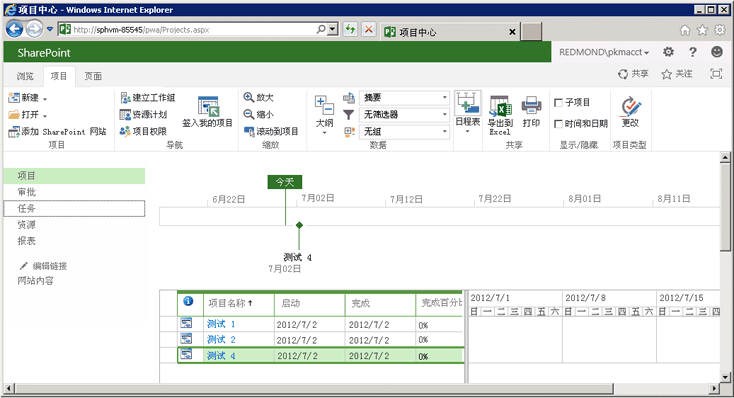

# <a name="getting-started-with-the-project-server-csom-and-net"></a><span data-ttu-id="dde0e-105">Project Server CSOM 和 .NET 入门</span><span class="sxs-lookup"><span data-stu-id="dde0e-105">Getting started with the Project Server CSOM and .NET</span></span>

<span data-ttu-id="dde0e-106">Project Server 2013 客户端对象模型 (CSOM) 可用于通过 .NET Framework 4 开发 Project Online 和本地解决方案。</span><span class="sxs-lookup"><span data-stu-id="dde0e-106">You can use the Project Server 2013 client-side object model (CSOM) to develop Project Online and on-premises solutions with the .NET Framework 4.</span></span> <span data-ttu-id="dde0e-107">本文介绍了如何创建使用 CSOM 创建并发布项目的控制台应用程序。</span><span class="sxs-lookup"><span data-stu-id="dde0e-107">This article describes how to create a console application that uses the CSOM to create and publish projects.</span></span> <span data-ttu-id="dde0e-108">发布项目之后，应用程序等待 Project Server 队列服务完成发布操作，然后列出已发布的项目。</span><span class="sxs-lookup"><span data-stu-id="dde0e-108">After publishing a project, the application waits for the Project Server Queue Service to finish with the publish action, and then lists the published projects.</span></span>
  
<span data-ttu-id="dde0e-109">有关 Project Server CSOM 的一般介绍，请参阅 [Project 2013 中面向开发人员的更新](updates-for-developers-in-project-2013.md)。</span><span class="sxs-lookup"><span data-stu-id="dde0e-109">For a general introduction to the Project Server CSOM, see What's new for developers in Project 2013. For reference topics in the CSOM namespace, see N:Microsoft.ProjectServer.Client.</span></span> <span data-ttu-id="dde0e-110">有关 CSOM 命名空间中的引用主题，请参阅 [Microsoft.ProjectServer.Client](https://msdn.microsoft.com/library/Microsoft.ProjectServer.Client.aspx)。</span><span class="sxs-lookup"><span data-stu-id="dde0e-110">For reference topics in the CSOM namespace, see [Microsoft.ProjectServer.Client](https://msdn.microsoft.com/library/Microsoft.ProjectServer.Client.aspx) .</span></span> 
  
## <a name="creating-a-csom-project-in-visual-studio"></a><span data-ttu-id="dde0e-111">在 Visual Studio 中创建 CSOM 项目</span><span class="sxs-lookup"><span data-stu-id="dde0e-111">Creating a CSOM project in Visual Studio</span></span>
<span data-ttu-id="dde0e-112"><a name="pj15_GettingStartedCSOM_CreatingVSProject"> </a></span><span class="sxs-lookup"><span data-stu-id="dde0e-112"></span></span>

<span data-ttu-id="dde0e-113">可以使用 Visual Studio 2010 或 Visual Studio 2012 开发可使用 Project Server CSOM 的解决方案。</span><span class="sxs-lookup"><span data-stu-id="dde0e-113">You can use Visual Studio 2010 or Visual Studio 2012 to develop solutions that use the Project Server CSOM.</span></span> <span data-ttu-id="dde0e-114">Project Server CSOM 包含三个程序集，用于使用 .Net Framework 4 开发客户端应用程序、Microsoft Silverlight 应用程序和 Windows Phone 8 应用程序。</span><span class="sxs-lookup"><span data-stu-id="dde0e-114">The Project Server CSOM includes three assemblies for development of client applications, Microsoft Silverlight applications, and Windows Phone 8 applications by using the .NET Framework 4.</span></span> <span data-ttu-id="dde0e-115">CSOM 还包括用于开发 Web 应用程序的 JavaScript 文件，如 [Microsoft.ProjectServer.Client](https://msdn.microsoft.com/library/Microsoft.ProjectServer.Client.aspx) 中所述。</span><span class="sxs-lookup"><span data-stu-id="dde0e-115">The CSOM also includes a JavaScript file for development of web applications, as described in [Microsoft.ProjectServer.Client](https://msdn.microsoft.com/library/Microsoft.ProjectServer.Client.aspx) .</span></span> 
  
<span data-ttu-id="dde0e-116">可以将所需的 CSOM 程序集从 Project Server 计算机或从 Project 2013 SDK 下载复制到远程开发计算机。</span><span class="sxs-lookup"><span data-stu-id="dde0e-116">You can copy the CSOM assembly that you need from the Project Server computer or from the Project 2013 SDK download to a remote development computer.</span></span> <span data-ttu-id="dde0e-117">本主题中所述的 **QueueCreateProject** 控制台应用程序不是 Silverlight 应用程序，也不是 Windows Phone 8 应用程序，因此需要 Microsoft.ProjectServer.Client.dll 程序集。</span><span class="sxs-lookup"><span data-stu-id="dde0e-117">The **QueueCreateProject** console application that is described in this topic is not a Silverlight application or a Windows Phone 8 application, so you need the Microsoft.ProjectServer.Client.dll assembly.</span></span> <span data-ttu-id="dde0e-118">CSOM 独立于基于 WCF 或基于 ASMX 的 Project Server Interface (PSI)，因此不必为 PSI 设置服务引用，也不必使用 **Microsoft.Office.Project.Server.Library** 命名空间。</span><span class="sxs-lookup"><span data-stu-id="dde0e-118">Because the CSOM is independent of the WCF-based or ASMX-based Project Server Interface (PSI), you do not have to set service references for the PSI or use the **Microsoft.Office.Project.Server.Library** namespace.</span></span> 
  
<span data-ttu-id="dde0e-p106">**QueueCreateProject** 应用程序将命令行参数用于要创建的项目的名称以及用于队列超时限制。在过程 1 中，创建基本控制台应用程序、添加一个例程以分析命令行并添加使用消息，前提是命令行中没有错误。</span><span class="sxs-lookup"><span data-stu-id="dde0e-p106">The **QueueCreateProject** application uses command-line arguments for the name of the project to create and for the queue timeout limit. In Procedure 1, you create the basic console application, add a routine to parse the command line, and add a usage message if there are errors in the command line.</span></span> 
  
### <a name="procedure-1-to-create-a-csom-project-in-visual-studio"></a><span data-ttu-id="dde0e-p107">过程 1：在 Visual Studio 中创建 CSOM 项目</span><span class="sxs-lookup"><span data-stu-id="dde0e-p107">Procedure 1. To create a CSOM project in Visual Studio</span></span>

1. <span data-ttu-id="dde0e-123">从 `%ProgramFiles%\Common Files\Microsoft Shared\Web Server Extensions\15\ISAPI\` 文件夹将 Microsoft.ProjectServer.Client.dll 程序集复制到开发计算机。</span><span class="sxs-lookup"><span data-stu-id="dde0e-123">Copy the Microsoft.ProjectServer.Client.dll assembly from the  `%ProgramFiles%\Common Files\Microsoft Shared\Web Server Extensions\15\ISAPI\` folder to your development computer.</span></span> <span data-ttu-id="dde0e-124">将程序集复制到要使用的其他 Project Server 和 SharePoint 引用程序集（如 `C:\Project\Assemblies`）方便访问的文件夹。</span><span class="sxs-lookup"><span data-stu-id="dde0e-124">Copy the Microsoft.ProjectServer.Client.dll assembly from the %ProgramFiles%\Common Files\Microsoft Shared\Web Server Extensions\15\ISAPI\ `C:\Project\Assemblies` folder to your development computer. Copy the assembly to a convenient folder for other Project Server and SharePoint reference assemblies that you will use, such as C:\Project\Assemblies.</span></span>
    
2. <span data-ttu-id="dde0e-p109">将 Microsoft.SharePoint.Client.dll 程序集和 Microsoft.SharePoint.Client.Runtime.dll 程序集从同一源文件夹中复制到开发计算机中。Microsoft.ProjectServer.Client.dll 程序集依赖相关 SharePoint 程序集。</span><span class="sxs-lookup"><span data-stu-id="dde0e-p109">Copy the Microsoft.SharePoint.Client.dll assembly and the Microsoft.SharePoint.Client.Runtime.dll assembly from the same source folder to your development computer. The Microsoft.ProjectServer.Client.dll assembly has dependencies on the related SharePoint assemblies.</span></span>
    
3. <span data-ttu-id="dde0e-127">在 Visual Studio 中，创建 Windows 控制台应用程序，并将目标框架设置为 .NET Framework 4。</span><span class="sxs-lookup"><span data-stu-id="dde0e-127">In Visual Studio, create a Windows console application, and set the target framework to .NET Framework 4.</span></span> <span data-ttu-id="dde0e-128">例如，将应用程序命名为 QueueCreateProject。</span><span class="sxs-lookup"><span data-stu-id="dde0e-128">For example, name the application QueueCreateProject.</span></span>
    
   > [!NOTE]
   > <span data-ttu-id="dde0e-p111">如果您忘记设置正确的目标，请在 Visual Studio 创建项目之后，在“项目”\*\*\*\* 菜单中打开“QueueCreateProject 属性”\*\*\*\*。在“应用程序”\*\*\*\* 选项卡的“目标框架”\*\*\*\* 下拉列表中，选择“.NET Framework 4”\*\*\*\*。请勿使用“.NET Framework 4 客户端配置文件”\*\*\*\*。</span><span class="sxs-lookup"><span data-stu-id="dde0e-p111">If you forget to set the correct target, after Visual Studio creates the project, open **QueueCreateProject Properties** in the **Project** menu. On the **Application** tab, in the **Target framework** drop-down list, choose **.NET Framework 4**. Do not use the **.NET Framework 4 Client Profile**.</span></span> 
  
4. <span data-ttu-id="dde0e-132">在解决方案资源管理器中，设置对以下程序集的引用：</span><span class="sxs-lookup"><span data-stu-id="dde0e-132">In Solution Explorer, set references to the following assemblies:</span></span>
    
   - <span data-ttu-id="dde0e-133">Microsoft.ProjectServer.Client.dll</span><span class="sxs-lookup"><span data-stu-id="dde0e-133">Microsoft.ProjectServer.Client.dll</span></span>
   - <span data-ttu-id="dde0e-134">Microsoft.SharePoint.Client.dll</span><span class="sxs-lookup"><span data-stu-id="dde0e-134">Microsoft.SharePoint.Client.dll</span></span>
   - <span data-ttu-id="dde0e-135">Microsoft.SharePoint.Client.Runtime.dll</span><span class="sxs-lookup"><span data-stu-id="dde0e-135">Microsoft.SharePoint.Client.Runtime.dll</span></span>
    
5. <span data-ttu-id="dde0e-136">在 Program.cs 文件中，编辑 `using` 语句，如下所示。</span><span class="sxs-lookup"><span data-stu-id="dde0e-136">In the Program.cs file, edit the using`using` statements, as follows.</span></span> 
    
   ```cs
    using System;
    using System.Collections.Generic;
    using System.Linq;
    using System.Text;
    using Microsoft.ProjectServer.Client;
   ```

6. <span data-ttu-id="dde0e-p112">添加方法以分析用于项目名称和队列超时的秒数的命令行参数，显示使用信息，然后退出应用程序。将 Program.cs 文件中代码的正文替换为下列代码。</span><span class="sxs-lookup"><span data-stu-id="dde0e-p112">Add methods to parse the command-line arguments for the project name and the number of seconds for queue timeout, show usage information, and exit the application. Replace the main body of code in the Program.cs file with the following code.</span></span>
    
   ```cs
    namespace QueueCreateProject
    {
        class Program
        {
            static void Main(string[] args)
            {
                if (!ParseCommandLine(args))
                {
                    Usage();
                    ExitApp();
                }
                /* Add calls to methods here to get the project context and create a project. */
                ExitApp();
            }
            // Parse the command line. Return true if there are no errors.
            private static bool ParseCommandLine(string[] args)
            {
                bool error = false;
                int argsLen = args.Length;
                try
                {
                    for (int i = 0; i < argsLen; i++)
                    {
                        if (error) break;
                        if (args[i].StartsWith("-") || args[i].StartsWith("/"))
                            args[i] = "*" + args[i].Substring(1).ToLower();
                        switch (args[i])
                        {
                            case "*projname":
                            case "*n":
                                if (++i >= argsLen) return false;
                                projName = args[i];
                                break;
                            case "*timeout":
                            case "*t":
                                if (++i >= argsLen) return false;
                                timeoutSeconds = Convert.ToInt32(args[i]);
                                break;
                            case "*?":
                            default:
                                error = true;
                                break;
                        }
                    }
                }
                catch (FormatException)
                {
                    error = true;
                }
                if (string.IsNullOrEmpty(projName)) error = true;
                return !error;
            }
            private static void Usage()
            {
                string example = "Usage: QueueCreateProject -projName | -n \"New project name\" [-timeout | -t sec]";
                example += "\nExample: QueueCreateProject -n \"My new project\"";
                example += "\nDefault timeout seconds = " + timeoutSeconds.ToString();
                Console.WriteLine(example);
            }
            private static void ExitApp()
            {
                Console.Write("\nPress any key to exit... ");
                Console.ReadKey(true);
                Environment.Exit(0);
            }
        }
    }
   ```

## <a name="getting-the-project-context"></a><span data-ttu-id="dde0e-139">获取项目上下文</span><span class="sxs-lookup"><span data-stu-id="dde0e-139">Getting the project context</span></span>
<span data-ttu-id="dde0e-140"><a name="pj15_GettingStartedCSOM_GettingContext"> </a></span><span class="sxs-lookup"><span data-stu-id="dde0e-140"></span></span>

<span data-ttu-id="dde0e-141">CSOM 开发要求使用 Project Web App URL 初始化 **ProjectContext** 对象。</span><span class="sxs-lookup"><span data-stu-id="dde0e-141">CSOM development requires the **ProjectContext** object to be initialized with the Project Web App URL.</span></span> <span data-ttu-id="dde0e-142">过程 2 中的代码使用 **pwaPath** 常量。</span><span class="sxs-lookup"><span data-stu-id="dde0e-142">The code in Procedure 2 uses the **pwaPath** constant.</span></span> <span data-ttu-id="dde0e-143">如果计划对 Project Web App 的多个实例使用该应用程序，可以将 **pwaPath** 作为一个变量，并添加另一个命令行参数。</span><span class="sxs-lookup"><span data-stu-id="dde0e-143">If you plan to use the application for multiple instances of Project Web App, you could make **pwaPath** a variable and add another command-line argument.</span></span> 
  
### <a name="procedure-2-to-get-the-project-context"></a><span data-ttu-id="dde0e-p114">过程 2：获取项目上下文</span><span class="sxs-lookup"><span data-stu-id="dde0e-p114">Procedure 2. To get the project context</span></span>

1. <span data-ttu-id="dde0e-146">添加 **QueueCreateProject** 应用程序将使用的 **Program** 类常量和变量。</span><span class="sxs-lookup"><span data-stu-id="dde0e-146">Add **Program** class constants and variables that the **QueueCreateProject** application will use.</span></span> <span data-ttu-id="dde0e-147">除了 Project Web App URL 之外，应用程序还使用默认企业项目类型 (EPT) 的名称、要创建的项目名称以及以秒为单位的最大队列超时时间。</span><span class="sxs-lookup"><span data-stu-id="dde0e-147">In addition to the Project Web App URL, the application uses the name of the default enterprise project type (EPT), the name of the project to create, and a maximum queue timeout in seconds.</span></span> <span data-ttu-id="dde0e-148">在本例中，使用 **timeoutSeconds** 变量可以测试超时的各种值如何影响应用程序。</span><span class="sxs-lookup"><span data-stu-id="dde0e-148">In this case, the **timeoutSeconds** variable enables you to test how various values for the timeout affect the application.</span></span> <span data-ttu-id="dde0e-149">**ProjectContext** 对象是用于访问 CSOM 的主要对象。</span><span class="sxs-lookup"><span data-stu-id="dde0e-149">The **ProjectContext** object is the primary object for access to the CSOM.</span></span> 
    
   ```cs
    private const string pwaPath = "https://ServerName /pwa/"; // Change the path to your Project Web App instance.
    private static string basicEpt = "Enterprise Project";   // Basic enterprise project type.
    private static string projName = string.Empty;
    private static int timeoutSeconds = 10;  // The maximum wait time for a queue job, in seconds.
    private static ProjectContext projContext;
   ```

2. <span data-ttu-id="dde0e-150">用以下代码替换 `/* Add calls to methods here to get the project context and create a project. */` 批注。</span><span class="sxs-lookup"><span data-stu-id="dde0e-150">Replace the `/* Add calls to methods here to get the project context and create a project. */` with the following code.</span></span> <span data-ttu-id="dde0e-151">使用 Project Web App URL 初始化 **Microsoft.ProjectServer.Client.ProjectContext** 对象。</span><span class="sxs-lookup"><span data-stu-id="dde0e-151">The **Microsoft.ProjectServer.Client.ProjectContext** object is initialized with the Project Web App URL.</span></span> <span data-ttu-id="dde0e-152">**CreateTestProject** 方法和 **ListPublishedProjects** 方法如过程 4 和过程 5 中所示。</span><span class="sxs-lookup"><span data-stu-id="dde0e-152">The **CreateTestProject** method and the **ListPublishedProjects** method are shown in Procedure 4 and Procedure 5.</span></span> 
    
   ```cs
    projContext = new ProjectContext(pwaPath);
    if (CreateTestProject())
        ListPublishedProjects();
    else
        Console.WriteLine("\nProject creation failed: {0}", projName);
   ```

## <a name="getting-an-enterprise-project-type"></a><span data-ttu-id="dde0e-153">获取企业项目类型</span><span class="sxs-lookup"><span data-stu-id="dde0e-153">Getting an enterprise project type</span></span>
<span data-ttu-id="dde0e-154"><a name="pj15_GettingStartedCSOM_GettingEPT"> </a></span><span class="sxs-lookup"><span data-stu-id="dde0e-154"></span></span>

<span data-ttu-id="dde0e-p117">**QueueCreateProject** 示例应用程序显式选择企业项目 EPT 以显示应用程序如何才能为项目选择 EPT。如果项目创建信息未指定 EPT GUID，则应用程序将使用默认 EPT。**GetEptUid** 方法由过程 4 中介绍的 **CreateTestProject** 方法使用。</span><span class="sxs-lookup"><span data-stu-id="dde0e-p117">The **QueueCreateProject** sample application explicitly selects the Enterprise Project EPT, to show how an application can select the EPT for a project. If the project creation information does not specify the EPT GUID, an application would use the default EPT. The **GetEptUid** method is used by the **CreateTestProject** method that is described in Procedure 4.</span></span> 
  
<span data-ttu-id="dde0e-p118">**GetEptUid** 方法查询 **EnterpriseProjectTypes** 集合的 **ProjectContext** 对象，其中 EPT 名称与指定名称相同。执行查询后，将 **eptUid** 变量设置为 **eptList** 集合中第一个 **EnterpriseProjectType** 对象的 GUID。因为 EPT 名称是唯一的，因此只有一个具有指定名称的 **EnterpriseProjectType** 对象。</span><span class="sxs-lookup"><span data-stu-id="dde0e-p118">The **GetEptUid** method queries the **ProjectContext** object for the collection of **EnterpriseProjectTypes** where the EPT name equals the specified name. After executing the query, the **eptUid** variable is set to the GUID of the first **EnterpriseProjectType** object in the **eptList** collection. Because EPT names are unique, there is only one **EnterpriseProjectType** object that has the specified name.</span></span> 
  
### <a name="procedure-3-to-get-the-guid-of-an-ept-for-a-new-project"></a><span data-ttu-id="dde0e-p119">过程 3：为新项目获取 EPT 的 GUID</span><span class="sxs-lookup"><span data-stu-id="dde0e-p119">Procedure 3. To get the GUID of an EPT for a new project</span></span>

- <span data-ttu-id="dde0e-163">向 **Program** 类添加 **GetEptUid** 方法。</span><span class="sxs-lookup"><span data-stu-id="dde0e-163">Add the **GetEptUid** method to the **Program** class.</span></span> 
    
   ```cs
    // Get the GUID of the specified enterprise project type.
    private static Guid GetEptUid(string eptName)
    {
        Guid eptUid = Guid.Empty;
        try
        {
            // Get the list of EPTs that have the specified name. 
            // If the EPT name exists, the list will contain only one EPT.
            var eptList = projContext.LoadQuery(
                projContext.EnterpriseProjectTypes.Where(
                    ept => ept.Name == eptName));
            projContext.ExecuteQuery();
            eptUid = eptList.First().Id;
        }
        catch (Exception ex)
        {
            string msg = string.Format("GetEptUid: eptName = \"{0}\"\n\n{1}",
                eptName, ex.GetBaseException().ToString());
            throw new ArgumentException(msg);
        }
        return eptUid;
    }
   ```

<span data-ttu-id="dde0e-p120">查找 EPT GUID 的方法有多种。**GetEptUid** 方法中显示的查询效率很高，因为它仅下载一个与 EPT 名称匹配的 **EnterpriseProjectType** 对象。下面的备用例程效率不高，因为它将 EPT 的完整列表下载到客户端应用程序并循环访问此列表。</span><span class="sxs-lookup"><span data-stu-id="dde0e-p120">There are several ways to find the EPT GUID. The query shown in the **GetEptUid** method is efficient because it downloads only the one **EnterpriseProjectType** object that matches the EPT name. The following alternate routine is less efficient, because it downloads the complete list of EPTs to the client application and iterates through the list.</span></span> 

```cs
foreach (EnterpriseProjectType ept in projSvr.EnterpriseProjectTypes)
{
    if (ept.Name == eptName)
    {
        eptUid = ept.Id;
        break;
    }
}
```

<span data-ttu-id="dde0e-167">以下例程使用 LINQ 查询和 lambda 表达式来选择 EPT 对象，但仍会下载所有 **EnterpriseProjectType** 对象。</span><span class="sxs-lookup"><span data-stu-id="dde0e-167">The following routine uses a LINQ query and lambda expression to select the EPT object, but still downloads all of the **EnterpriseProjectType** objects.</span></span> 

```cs
var eptList = projContext.LoadQuery(projContext.EnterpriseProjectTypes);
projContext.ExecuteQuery();
eptUid = eptList.First(ept => ept.Name == eptName).Id;
```

## <a name="setting-the-creation-information-and-publishing-the-project"></a><span data-ttu-id="dde0e-168">设置创建信息并发布项目</span><span class="sxs-lookup"><span data-stu-id="dde0e-168">Setting the creation information and publishing the project</span></span>
<span data-ttu-id="dde0e-169"><a name="pj15_GettingStartedCSOM_ProjectCreation"> </a></span><span class="sxs-lookup"><span data-stu-id="dde0e-169"></span></span>

<span data-ttu-id="dde0e-p121">**CreateTestProject** 方法创建一个 **ProjectCreationInformation** 对象并指定创建项目所需的信息。项目 GUID 和名称是必需的；开始日期、项目描述和 EPT GUID 是可选的。</span><span class="sxs-lookup"><span data-stu-id="dde0e-p121">The **CreateTestProject** method creates a **ProjectCreationInformation** object and specifies the information that is required to create a project. The project GUID and name are required; the start date, project description, and EPT GUID are optional.</span></span> 
  
<span data-ttu-id="dde0e-p122">设置新的项目属性后，**Projects.Add** 方法会将项目添加到 **Projects** 集合中。若要保存并发布项目，您必须调用 **Projects.Update** 方法向 Project Server 队列发送一条消息并创建项目。</span><span class="sxs-lookup"><span data-stu-id="dde0e-p122">After setting the new project properties, the **Projects.Add** method adds the project to the **Projects** collection. To save and publish the project, you must call the **Projects.Update** method to send a message to the Project Server queue and create the project.</span></span> 
  
### <a name="procedure-4-to-set-the-new-project-properties-create-the-project-and-publish-the-project"></a><span data-ttu-id="dde0e-p123">过程 4：设置新项目属性、创建项目并发布项目</span><span class="sxs-lookup"><span data-stu-id="dde0e-p123">Procedure 4. To set the new project properties, create the project, and publish the project</span></span>

1. <span data-ttu-id="dde0e-p124">将 **CreateTestProject** 方法添加到 **Program** 类。下列代码创建并发布项目，但不会等待队列作业完成。</span><span class="sxs-lookup"><span data-stu-id="dde0e-p124">Add the **CreateTestProject** method to the **Program** class. The following code creates and publishes a project, but does not wait for the queue job to complete.</span></span> 
    
   ```cs
    // Create a project.
    private static bool CreateTestProject()
    {
        bool projCreated = false;
        try
        {
            Console.Write("\nCreating project: {0} ...", projName);
            ProjectCreationInformation newProj = new ProjectCreationInformation();
            newProj.Id = Guid.NewGuid();
            newProj.Name = projName;
            newProj.Description = "Test creating a project with CSOM";
            newProj.Start = DateTime.Today.Date;
            // Setting the EPT GUID is optional. If no EPT is specified, Project Server  
            // uses the default EPT. 
            newProj.EnterpriseProjectTypeId = GetEptUid(basicEpt);
            PublishedProject newPublishedProj = projContext.Projects.Add(newProj);
            QueueJob qJob = projContext.Projects.Update();
            /* Add code here to wait for the queue. */
        }
        catch(Exception ex)
        {
            Console.ForegroundColor = ConsoleColor.Red;
            Console.WriteLine("\nError: {0}", ex.Message);
            Console.ResetColor();
        }
        return projCreated;
    }
   ```

2. <span data-ttu-id="dde0e-178">用以下代码替换 `/* Add code here to wait for the queue. */` 批注以等待队列作业。</span><span class="sxs-lookup"><span data-stu-id="dde0e-178">Replace the  `/* Add code here to wait for the queue. */` comment with the following code to wait for the queue job.</span></span> <span data-ttu-id="dde0e-179">该例程等待指定的 **timeoutSeconds** 秒数最大值，如果队列作业在超时之前完成，则继续。</span><span class="sxs-lookup"><span data-stu-id="dde0e-179">The routine waits a maximum of the specified **timeoutSeconds** number of seconds, or proceeds if the queue job completes before the timeout.</span></span> <span data-ttu-id="dde0e-180">有关可能的队列作业状态，请参阅 [Microsoft.ProjectServer.Client.JobState](https://msdn.microsoft.com/library/Microsoft.ProjectServer.Client.JobState.aspx)。</span><span class="sxs-lookup"><span data-stu-id="dde0e-180">For possible queue job states, see [Microsoft.ProjectServer.Client.JobState](https://msdn.microsoft.com/library/Microsoft.ProjectServer.Client.JobState.aspx) .</span></span> 
    
   <span data-ttu-id="dde0e-p126">为 **QueueJob** 对象调用 **Load** 方法和 **ExecuteQuery** 方法是可选的。如果 **QueueJob** 对象在您调用 **WaitForQueue** 方法时未进行初始化，则 Project Server 将初始化它。</span><span class="sxs-lookup"><span data-stu-id="dde0e-p126">Calling the **Load** method and the **ExecuteQuery** method for the **QueueJob** object is optional. If the **QueueJob** object is not initialized when you call the **WaitForQueue** method, Project Server initializes it.</span></span> 
    
   ```cs
    // Calling Load and ExecuteQuery for the queue job is optional.
    // projContext.Load(qJob);
    // projContext.ExecuteQuery();
    JobState jobState = projContext.WaitForQueue(qJob, timeoutSeconds);
    if (jobState == JobState.Success)
    {
        projCreated = true;
    }
    else
    {
        Console.ForegroundColor = ConsoleColor.Yellow;
        Console.WriteLine("\nThere is a problem in the queue. Timeout is {0} seconds.", 
            timeoutSeconds);
        Console.WriteLine("\tQueue JobState: {0}", jobState.ToString());
        Console.ResetColor();
    }
    Console.WriteLine();
   ```

## <a name="listing-the-published-projects"></a><span data-ttu-id="dde0e-183">列出已发布的项目</span><span class="sxs-lookup"><span data-stu-id="dde0e-183">Listing the published projects</span></span>
<span data-ttu-id="dde0e-184"><a name="pj15_GettingStartedCSOM_ListingPublished"> </a></span><span class="sxs-lookup"><span data-stu-id="dde0e-184"></span></span>

<span data-ttu-id="dde0e-185">**ListPublishedProjects** 方法用于获取 Project Web App 中发布的所有项目集合。</span><span class="sxs-lookup"><span data-stu-id="dde0e-185">The **ListPublishedProjects** method gets the collection of all projects that are published in Project Web App.</span></span> <span data-ttu-id="dde0e-186">如果在过程 4 中创建项目的队列作业未成功完成或超时，新项目将不会包含在 **Projects** 集合中。</span><span class="sxs-lookup"><span data-stu-id="dde0e-186">The **ListPublishedProjects** method gets the collection of all projects that are published in pwa. If the queue job that creates a project in Procedure 4 does not complete successfully or times out, the new project is not included in the Projects collection.</span></span> 
  
### <a name="procedure-5-to-list-the-published-projects"></a><span data-ttu-id="dde0e-p128">过程 5：列出已发布的项目</span><span class="sxs-lookup"><span data-stu-id="dde0e-p128">Procedure 5. To list the published projects</span></span>

1. <span data-ttu-id="dde0e-189">向 **Program** 类添加 **ListPublishedProjects** 方法。</span><span class="sxs-lookup"><span data-stu-id="dde0e-189">Add the **ListPublishedProjects** method to the **Program** class.</span></span> 
    
   ```cs
    // List the published projects.
    private static void ListPublishedProjects()
    {
        // Get the list of projects on the server.
        projContext.Load(projContext.Projects);
        projContext.ExecuteQuery();
        Console.WriteLine("\nProject ID : Project name : Created date");
        foreach (PublishedProject pubProj in projContext.Projects)
        {
            Console.WriteLine("\n\t{0} :\n\t{1} : {2}", pubProj.Id.ToString(), pubProj.Name,
                pubProj.CreatedDate.ToString());
        }
    }
   ```

2. <span data-ttu-id="dde0e-190">为 Project Web App URL 设置正确的值，编译 **QueueCreateProject** 应用程序，然后按过程 6 中的步骤测试应用程序。</span><span class="sxs-lookup"><span data-stu-id="dde0e-190">Set the correct value for your pwa URL, compile the QueueCreateProject application, and then test the application as in Procedure 6.</span></span> 
    
## <a name="testing-the-queuecreateproject-application"></a><span data-ttu-id="dde0e-191">测试 QueueCreateProject 应用程序</span><span class="sxs-lookup"><span data-stu-id="dde0e-191">Testing the QueueCreateProject application</span></span>
<span data-ttu-id="dde0e-192"><a name="pj15_GettingStartedCSOM_Testing"> </a></span><span class="sxs-lookup"><span data-stu-id="dde0e-192"></span></span>

<span data-ttu-id="dde0e-193">在 Project Web App 的测试实例上首次运行 **QueueCreateProject** 应用程序时，尤其是如果 Project Server 安装在虚拟机上，则应用程序可能需要比默认的 10 秒队列超时时间更长的时间运行。</span><span class="sxs-lookup"><span data-stu-id="dde0e-193">When you first run the QueueCreateProject application on a test instance of pwa, especially if Project Server is installed on a virtual machine, the application may require more time to run than the default queue timeout of ten seconds.</span></span> 
  
### <a name="procedure-6-to-test-the-queuecreateproject-application"></a><span data-ttu-id="dde0e-p129">过程 6：测试 QueueCreateProject 应用程序</span><span class="sxs-lookup"><span data-stu-id="dde0e-p129">Procedure 6. To test the QueueCreateProject application</span></span>

1. <span data-ttu-id="dde0e-196">打开“QueueCreateProject 属性”\*\*\*\* 窗口，选择“调试”\*\*\*\* 选项卡，然后在“启动选项”\*\*\*\* 部分中添加以下命令行参数：`-n "Test proj 1" -t 20`</span><span class="sxs-lookup"><span data-stu-id="dde0e-196">Open the **QueueCreateProject Properties** window, select the **Debug** tab, and then add the following command-line arguments in the **Start Options** section: -n "Test proj 1" -t 20`-n "Test proj 1" -t 20`</span></span>
    
   <span data-ttu-id="dde0e-197">运行应用程序（例如，按 **F5**）。</span><span class="sxs-lookup"><span data-stu-id="dde0e-197">Run the application (for example, press **F5**).</span></span> <span data-ttu-id="dde0e-198">如果超时值足够长，应用程序将显示下列输出（如果其他已发布项目存在于 Project Web App 实例中，还将显示这些项目）：</span><span class="sxs-lookup"><span data-stu-id="dde0e-198">Run the application (for example, press F5). If the timeout value is long enough, the application shows the following output (if other published projects exist in your pwa instance, they will also be shown):</span></span>
    
   ```MS-DOS
    Creating project: Test proj 1 ...
    Project ID : Project name : Created date
            b34d7009-753f-4abb-9191-f4b15a82aac3 :
            Test proj 1 : 9/22/2011 11:27:57 AM
    Press any key to exit...
   ```

2. <span data-ttu-id="dde0e-199">使用下列命令行参数运行另一个测试，以便使用默认的 10 秒队列超时值：`-n "Test proj 1"`</span><span class="sxs-lookup"><span data-stu-id="dde0e-199">Run another test with the following command-line arguments, to use the default 10-second queue timeout: -n "Test proj 1" `-n "Test proj 1"`</span></span>
    
   <span data-ttu-id="dde0e-200">由于测试项目 1 已存在，应用程序显示以下输出。</span><span class="sxs-lookup"><span data-stu-id="dde0e-200">Because Test proj 1 already exists, the application shows the following output.</span></span>
    
   ```MS-DOS
    Creating project: Test proj 1 ...
    Error: PJClientCallableException: ProjectNameAlreadyExists
    ProjectNameAlreadyExists
    projName = Test proj 1
    Project creation failed: Test proj 1
    Press any key to exit...
   ```

3. <span data-ttu-id="dde0e-201">使用下列命令行参数运行另一个测试，以便使用默认的 10 秒队列超时值：`-n "Test proj 2"`</span><span class="sxs-lookup"><span data-stu-id="dde0e-201">Run another test with the following command-line arguments, to use the default 10-second queue timeout: -n "Test proj 2" `-n "Test proj 2"`</span></span>
    
   <span data-ttu-id="dde0e-202">**QueueCreateProject** 应用程序创建和发布名为“测试项目 2”的项目。</span><span class="sxs-lookup"><span data-stu-id="dde0e-202">The **QueueCreateProject** application creates and publishes the project named Test proj 2.</span></span> 
    
4. <span data-ttu-id="dde0e-203">使用下列命令行参数运行另一个测试，将超时值设置得过短，使队列作业无法完成：`-n "Test proj 3" -t 1`</span><span class="sxs-lookup"><span data-stu-id="dde0e-203">Run another test with the following command-line arguments, and set the timeout to be too short for the queue job to finish: -n "Test proj 3" –t 1`-n "Test proj 3" -t 1`</span></span>
    
   <span data-ttu-id="dde0e-p131">由于队列超时值过短，因此不会创建项目。应用程序显示以下输出。</span><span class="sxs-lookup"><span data-stu-id="dde0e-p131">Because the queue timeout is too short, the project is not created. The application shows the following output.</span></span>
    
   ```MS-DOS
    Creating project: Test proj 3 ...
    There is a problem in the queue. Timeout is 1 seconds.
            Queue JobState: Unknown
    Project creation failed: Test proj 3
    Press any key to exit...
   ```

5. <span data-ttu-id="dde0e-206">修改代码，使应用程序就不会等待队列作业。</span><span class="sxs-lookup"><span data-stu-id="dde0e-206">Modify the code so that the application does not wait for the queue job.</span></span> <span data-ttu-id="dde0e-207">例如，注释掉等待队列的代码，`projCreated = true` 行除外，如下所示。</span><span class="sxs-lookup"><span data-stu-id="dde0e-207">Modify the code so that the application does not wait for the queue job. For example, comment out the code that waits for the queue, except for the projCreated = true`projCreated = true` line, as follows.</span></span> 
    
   ```cs
    //JobState jobState = projContext.WaitForQueue(qJob, timeoutSeconds);
    //if (jobState == JobState.Success)
    //{
    projCreated = true;
    //}
    //else
    //{
    //    Console.ForegroundColor = ConsoleColor.Yellow;
    //    Console.WriteLine("\nThere is a problem in the queue. Timeout is {0} seconds.",
    //        timeoutSeconds);
    //    Console.WriteLine("\tQueue JobState: {0}", jobState.ToString());
    //    Console.ResetColor();
    //}
    
   ```

6. <span data-ttu-id="dde0e-208">重新编译应用程序并使用下列命令行参数运行另一个测试：`-n "Test proj 4"`</span><span class="sxs-lookup"><span data-stu-id="dde0e-208">Recompile the application and run another test with the following command-line arguments: -n "Test proj 4" `-n "Test proj 4"`</span></span>
    
   <span data-ttu-id="dde0e-p133">由于已注释 **WaitForQueue** 例程，因此应用程序不会使用默认超时值。即使应用程序不等待队列，如果 Project Server 中的发布操作足够快，则也可能显示 Test proj 4。</span><span class="sxs-lookup"><span data-stu-id="dde0e-p133">Because the **WaitForQueue** routine is commented out, the application does not use the default timeout value. Even though the application does not wait for the queue, it may show Test proj 4, if the publish action in Project Server is fast enough.</span></span> 
    
   ```MS-DOS
    Creating project: Test proj 4 ...
    Project ID : Project name : Created date
            cdd54103-082f-425c-b075-9ff52ac7d4e6 :
            Test proj 2 : 9/25/2011 4:28:55 PM
            b34d7009-753f-4abb-9191-f4b15a82aac3 :
            Test proj 1 : 9/22/2011 11:27:57 AM
            5c0c73f2-f5dd-499b-8bd8-ebb74bf8c122 :
            Test proj 4 : 9/25/2011 4:39:21 PM
    Press any key to exit...
   ```

<span data-ttu-id="dde0e-211">刷新 Project Web App 中的“项目中心”页 (`https://ServerName/ProjectServerName/Projects.aspx`)，显示已发布的项目。</span><span class="sxs-lookup"><span data-stu-id="dde0e-211">Refresh the Project Center page in Project Web App (`https://ServerName/ProjectServerName/Projects.aspx`), to show the published projects.</span></span> <span data-ttu-id="dde0e-212">下图显示已发布的测试项目。</span><span class="sxs-lookup"><span data-stu-id="dde0e-212">The following figure shows that the test projects are published.</span></span>

<span data-ttu-id="dde0e-213">**在 Project Web App 中查看已发布的项目**</span><span class="sxs-lookup"><span data-stu-id="dde0e-213">**Checking the published projects in Project Web App**</span></span>

<span data-ttu-id="dde0e-214"></span><span class="sxs-lookup"><span data-stu-id="dde0e-214"></span></span>
  
<span data-ttu-id="dde0e-215">**QueueCreateProject** 示例应用程序显示以下典型示例：如何通过 **ProjectCreationInformation** 类使用 CSOM 创建项目实体、如何将项目添加到已发布集合、如何使用 **WaitForQueue** 方法等待队列作业，以及如何枚举已发布项目的集合。</span><span class="sxs-lookup"><span data-stu-id="dde0e-215">The **QueueCreateProject** sample application shows a typical example of how to create a project entity with the CSOM by using the **ProjectCreationInformation** class, how to add the project to the published Projects collection, how to wait for a queue job by using the **WaitForQueue** method, and how to enumerate the collection of published projects.</span></span> 
  
## <a name="complete-code-example"></a><span data-ttu-id="dde0e-216">完整的代码示例</span><span class="sxs-lookup"><span data-stu-id="dde0e-216">Complete code example</span></span>
<span data-ttu-id="dde0e-217"><a name="pj15_GettingStartedCSOM_CompleteCode"> </a></span><span class="sxs-lookup"><span data-stu-id="dde0e-217"></span></span>

<span data-ttu-id="dde0e-218">下面是 **QueueCreateProject** 示例应用程序的完整代码。</span><span class="sxs-lookup"><span data-stu-id="dde0e-218">Following is the complete code for the sample console application.</span></span> <span data-ttu-id="dde0e-219">[Microsoft.ProjectServer.Client.ProjectCreationInformation](https://msdn.microsoft.com/library/Microsoft.ProjectServer.Client.ProjectCreationInformation.aspx) 类引用还包含本主题中的代码。</span><span class="sxs-lookup"><span data-stu-id="dde0e-219">The following is the complete code for the QueueCreateProject sample application. The [T:Microsoft.ProjectServer.Client.ProjectCreationInformation](https://msdn.microsoft.com/library/Microsoft.ProjectServer.Client.ProjectCreationInformation.aspx) class reference also includes the code in this topic.</span></span> 
  
```cs
using System;
using System.Collections.Generic;
using System.Linq;
using System.Text;
using Microsoft.ProjectServer.Client;
namespace QueueCreateProject
{
    class Program
    {
        private const string pwaPath = "https://ServerName /pwa/"; // Change the path to your Project Web App instance.
        private static string basicEpt = "Enterprise Project";   // Basic enterprise project type.
        private static string projName = string.Empty;
        private static int timeoutSeconds = 10;  // The maximum wait time for a queue job, in seconds.
        private static ProjectContext projContext;
        static void Main(string[] args)
        {
            if (!ParseCommandLine(args))
            {
                Usage();
                ExitApp();
            }
            projContext = new ProjectContext(pwaPath);
            if (CreateTestProject())
                ListPublishedProjects();
            else
                Console.WriteLine("\nProject creation failed: {0}", projName);
            ExitApp();
        }
        // Create a project.
        private static bool CreateTestProject()
        {
            bool projCreated = false;
            try
            {
                Console.Write("\nCreating project: {0} ...", projName);
                ProjectCreationInformation newProj = new ProjectCreationInformation();
                newProj.Id = Guid.NewGuid();
                newProj.Name = projName;
                newProj.Description = "Test creating a project with CSOM";
                newProj.Start = DateTime.Today.Date;
                // Setting the EPT GUID is optional. If no EPT is specified, Project Server uses 
                // the default EPT. 
                newProj.EnterpriseProjectTypeId = GetEptUid(basicEpt);
                PublishedProject newPublishedProj = projContext.Projects.Add(newProj);
                QueueJob qJob = projContext.Projects.Update();
                // Calling Load and ExecuteQuery for the queue job is optional. If qJob is 
                // not initialized when you call WaitForQueue, Project Server initializes it.
                // projContext.Load(qJob);
                // projContext.ExecuteQuery();
                JobState jobState = projContext.WaitForQueue(qJob, timeoutSeconds);
                if (jobState == JobState.Success)
                {
                    projCreated = true;
                }
                else
                {
                    Console.ForegroundColor = ConsoleColor.Yellow;
                    Console.WriteLine("\nThere is a problem in the queue. Timeout is {0} seconds.", 
                        timeoutSeconds);
                    Console.WriteLine("\tQueue JobState: {0}", jobState.ToString());
                    Console.ResetColor();
                }
                Console.WriteLine();
            }
            catch(Exception ex)
            {
                Console.ForegroundColor = ConsoleColor.Red;
                Console.WriteLine("\nError: {0}", ex.Message);
                Console.ResetColor();
            }
            return projCreated;
        }
        // Get the GUID of the specified enterprise project type.
        private static Guid GetEptUid(string eptName)
        {
            Guid eptUid = Guid.Empty;
            try
            {
                // Get the list of EPTs that have the specified name. 
                // If the EPT name exists, the list will contain only one EPT.
                var eptList = projContext.LoadQuery(
                    projContext.EnterpriseProjectTypes.Where(
                        ept => ept.Name == eptName));
                projContext.ExecuteQuery();
                eptUid = eptList.First().Id;
                // Alternate routines to find the EPT GUID. Both (a) and (b) download the entire list of EPTs.
                // (a) Using a foreach block:
                //foreach (EnterpriseProjectType ept in projSvr.EnterpriseProjectTypes)
                //{
                //    if (ept.Name == eptName)
                //    {
                //        eptUid = ept.Id;
                //        break;
                //    }
                //}
                // (b) Querying for the EPT list, and then using a lambda expression to select the EPT:
                //var eptList = projContext.LoadQuery(projContext.EnterpriseProjectTypes);
                //projContext.ExecuteQuery();
                //eptUid = eptList.First(ept => ept.Name == eptName).Id;
            }
            catch (Exception ex)
            {
                string msg = string.Format("GetEptUid: eptName = \"{0}\"\n\n{1}",
                    eptName, ex.GetBaseException().ToString());
                throw new ArgumentException(msg);
            }
            return eptUid;
        }
        // List the published projects.
        private static void ListPublishedProjects()
        {
            // Get the list of projects on the server.
            projContext.Load(projContext.Projects);
            projContext.ExecuteQuery();
            Console.WriteLine("\nProject ID : Project name : Created date");
            foreach (PublishedProject pubProj in projContext.Projects)
            {
                Console.WriteLine("\n\t{0} :\n\t{1} : {2}", pubProj.Id.ToString(), pubProj.Name,
                    pubProj.CreatedDate.ToString());
            }
        }
        // Parse the command line. Return true if there are no errors.
        private static bool ParseCommandLine(string[] args)
        {
            bool error = false;
            int argsLen = args.Length;
            try
            {
                for (int i = 0; i < argsLen; i++)
                {
                    if (error) break;
                    if (args[i].StartsWith("-") || args[i].StartsWith("/"))
                        args[i] = "*" + args[i].Substring(1).ToLower();
                    switch (args[i])
                    {
                        case "*projname":
                        case "*n":
                            if (++i >= argsLen) return false;
                            projName = args[i];
                            break;
                        case "*timeout":
                        case "*t":
                            if (++i >= argsLen) return false;
                            timeoutSeconds = Convert.ToInt32(args[i]);
                            break;
                        case "*?":
                        default:
                            error = true;
                            break;
                    }
                }
            }
            catch (FormatException)
            {
                error = true;
            }
            if (string.IsNullOrEmpty(projName)) error = true;
            return !error;
        }
        private static void Usage()
        {
            string example = "Usage: QueueCreateProject -projName | -n \"New project name\" [-timeout | -t sec]";
            example += "\nExample: QueueCreateProject -n \"My new project\"";
            example += "\nDefault timeout seconds = " + timeoutSeconds.ToString();
            Console.WriteLine(example);
        }
        private static void ExitApp()
        {
            Console.Write("\nPress any key to exit... ");
            Console.ReadKey(true);
            Environment.Exit(0);
        }
    }
}
```

## <a name="see-also"></a><span data-ttu-id="dde0e-220">另请参阅</span><span class="sxs-lookup"><span data-stu-id="dde0e-220">See also</span></span>

- [<span data-ttu-id="dde0e-221">Project 2013 中面向开发人员的更新</span><span class="sxs-lookup"><span data-stu-id="dde0e-221">Updates for developers in Project 2013</span></span>](updates-for-developers-in-project-2013.md) 
- [<span data-ttu-id="dde0e-222">Project 2013 的客户端对象模型 (CSOM)</span><span class="sxs-lookup"><span data-stu-id="dde0e-222">Client-side object model (CSOM) for Project 2013</span></span>](client-side-object-model-csom-for-project-2013.md)
    

